# Donna Tartt — Complete Catalogue

**193 items** · 64 works + 18 interviews & bylines (full pages) · 111 novel editions (cover gallery) · **24 works with full text hosted here**.  
_Generated by `scripts/build_catalogue.py` — do not edit by hand._

[← Back to the README](README.md)

👆 **Works & interviews** open a full page — cover, reference info, a link to the original source, and the full text where we hold it. **Novel covers** open the full-size image; each novel's complete edition list lives in the reference.

## The Secret History (1992) — 48 editions · [full reference & edition list →](Donna_Tartt_Collectors_Reference.md#2-the-secret-history-1992)

<table>
  <tr>
    <td align="center" width="150" valign="top"> <b>US Knopf 1st/1st (acetate jacket)</b></td>
    <td align="center" width="150" valign="top"> <b>US Knopf Uncorrected Proof (plain wraps;…</b></td>
    <td align="center" width="150" valign="top"> <b>US Knopf Advance Reader's Edition (gloss…</b></td>
    <td align="center" width="150" valign="top"> <b>UK Viking 1st (Faun and Girl)</b></td>
    <td align="center" width="150" valign="top"><a href="Donna_Tartt_Collectors_Reference.md#2-the-secret-history-1992"><em>(cover missing)</em></a> <b>UK Viking uncorrected proof (epigraph va…</b> <i>cover missing</i></td>
  </tr>
  <tr>
    <td align="center" width="150" valign="top"><a href="Donna_Tartt_Collectors_Reference.md#2-the-secret-history-1992"><em>(cover missing)</em></a> <b>UK Viking trial binding 'snowfall'</b> <i>cover missing</i></td>
    <td align="center" width="150" valign="top"><a href="Donna_Tartt_Collectors_Reference.md#2-the-secret-history-1992"><em>(cover missing)</em></a> <b>Penguin UK trade paperback 1st</b> <i>cover missing</i></td>
    <td align="center" width="150" valign="top"> <b>US Vintage Contemporaries paperback 1st</b></td>
    <td align="center" width="150" valign="top"> <b>Ivy Books International Edition</b></td>
    <td align="center" width="150" valign="top"> <b>Ballantine US domestic mass-market 1993</b></td>
  </tr>
  <tr>
    <td align="center" width="150" valign="top"> <b>Random House trade paperback 1996</b></td>
    <td align="center" width="150" valign="top"><a href="assets/images/rId70.jpg">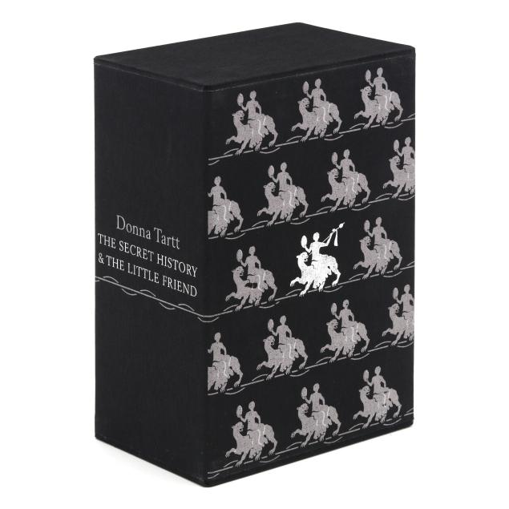</a> <b>Bloomsbury 2009 boxed signed limited (TS…</b></td>
    <td align="center" width="150" valign="top"> <b>Penguin UK 25th Anniversary 2017</b></td>
    <td align="center" width="150" valign="top"> <b>Viking 30th Anniversary signed numbered …</b></td>
    <td align="center" width="150" valign="top"><a href="assets/images/_retrieved/TSH-F01-publisher.jpg">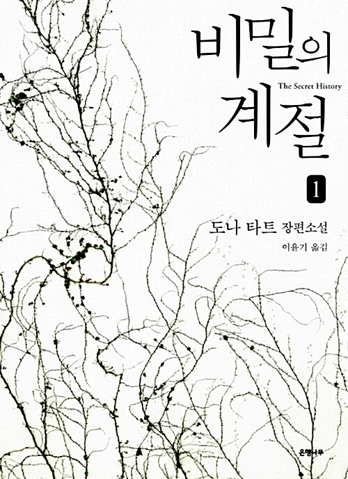</a> <b>Korean 1992 first - 비밀의 계절</b></td>
  </tr>
  <tr>
    <td align="center" width="150" valign="top"> <b>Italian Rizzoli 1st HC - Dio di illusioni</b></td>
    <td align="center" width="150" valign="top"><a href="assets/images/_retrieved/TSH-F02b-cover-openlibrary.jpg">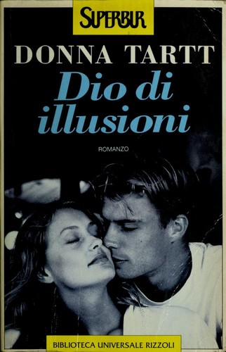</a> <b>Italian Rizzoli PB - Dio di illusioni</b></td>
    <td align="center" width="150" valign="top"> <b>Dutch Anthos - De verborgen geschiedenis</b></td>
    <td align="center" width="150" valign="top"> <b>French Plon - Le Maître des illusions</b></td>
    <td align="center" width="150" valign="top"><a href="assets/images/TSH-FR-POCKET94-cover_goodreads.jpg">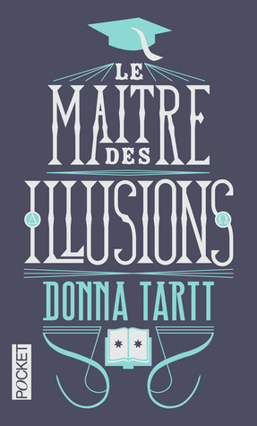</a> <b>French Pocket PB - Le Maître des illusio…</b></td>
  </tr>
  <tr>
    <td align="center" width="150" valign="top"> <b>German Goldmann - Die geheime Geschichte</b></td>
    <td align="center" width="150" valign="top"><a href="assets/images/_retrieved/TSH-F06-cover-abebooks.jpg">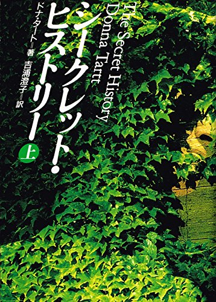</a> <b>Japanese Fusosha (Vol 1) - シークレット・ヒストリー 上</b></td>
    <td align="center" width="150" valign="top"> <b>Japanese Fusosha (Vol 2) - シークレット・ヒストリー 下</b></td>
    <td align="center" width="150" valign="top"><a href="assets/images/_retrieved/TSH-F06c-cover-abebooks.jpg">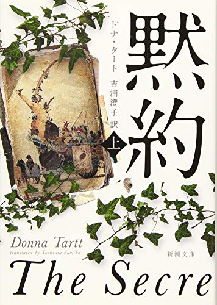</a> <b>Japanese Shinchosha bunko - 黙約 (Mokuyaku…</b></td>
    <td align="center" width="150" valign="top"><a href="assets/images/_retrieved/TSH-F07-cover-abebooks.jpg">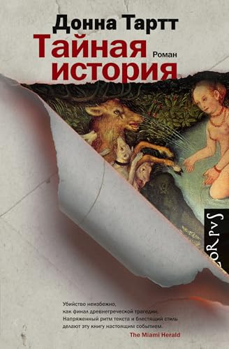</a> <b>Russian Inostranka - Тайная история</b></td>
  </tr>
  <tr>
    <td align="center" width="150" valign="top"> <b>Polish Zysk i S-ka 1st - Tajemna historia</b></td>
    <td align="center" width="150" valign="top"><a href="assets/images/TSH-PL-ZNAK22-cover_goodreads.jpg">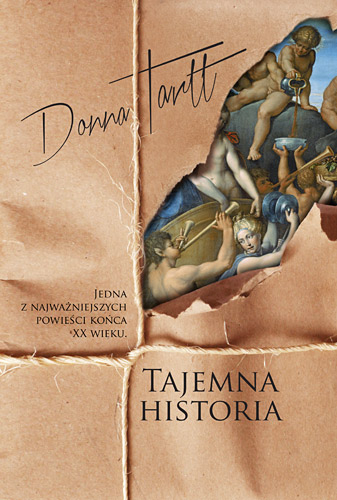</a> <b>Polish Znak reissue 2022 - Tajemna Histo…</b></td>
    <td align="center" width="150" valign="top"> <b>Greek Nea Synora - Η μυστική ιστορία</b></td>
    <td align="center" width="150" valign="top"><a href="assets/images/TSH-ES-PLAZAJANES93-cover_goodreads.jpg">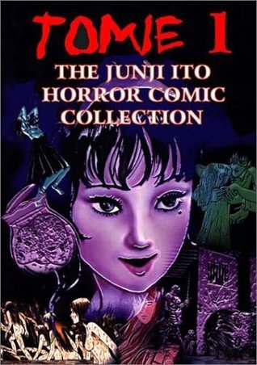</a> <b>Spanish Plaza & Janés - El secreto</b></td>
    <td align="center" width="150" valign="top"> <b>Spanish Lumen reissue - El secreto</b></td>
  </tr>
  <tr>
    <td align="center" width="150" valign="top"><a href="assets/images/TSH-CS-OSVETA96-cover_ebay.jpg">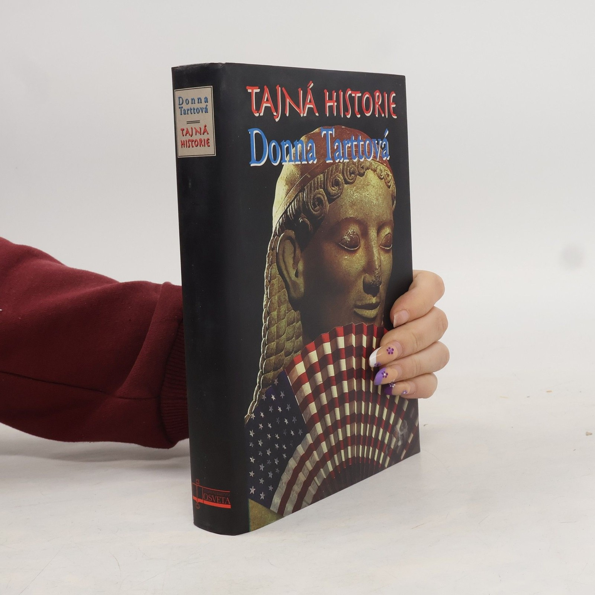</a> <b>Chinese Chongqing 2007 - 校园秘史</b></td>
    <td align="center" width="150" valign="top"><a href="Donna_Tartt_Collectors_Reference.md#2-the-secret-history-1992"><em>(cover missing)</em></a> <b>Chinese People's Lit 2016 - 秘史</b> <i>cover missing</i></td>
    <td align="center" width="150" valign="top"> <b>Portuguese (BR) - A História Secreta</b></td>
    <td align="center" width="150" valign="top"> <b>Portuguese (BR) reissue 2021</b></td>
    <td align="center" width="150" valign="top"><a href="assets/images/_retrieved/TSH-F13-publisher.jpg">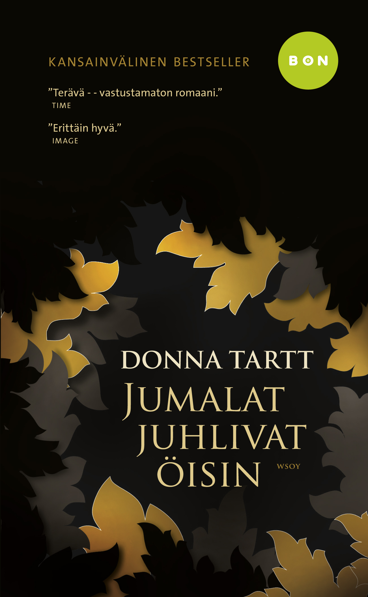</a> <b>Finnish WSOY - Jumalat Juhlivat Öisin</b></td>
  </tr>
  <tr>
    <td align="center" width="150" valign="top"> <b>Norwegian Tiden - Den hemmelige historien</b></td>
    <td align="center" width="150" valign="top"><a href="assets/images/_retrieved/TSH-F15-bokborsen.jpg">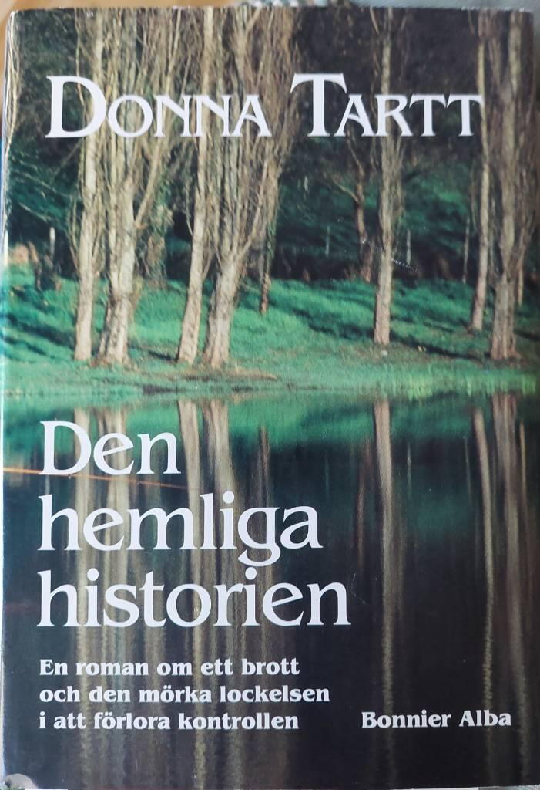</a> <b>Swedish Bonnier Alba - Den hemliga histo…</b></td>
    <td align="center" width="150" valign="top"> <b>Danish Lindhardt og Ringhof - Den hemmel…</b></td>
    <td align="center" width="150" valign="top"> <b>Turkish Pegasus - Gizli Tarih</b></td>
    <td align="center" width="150" valign="top"><a href="assets/images/_retrieved/TSH-F18-publisher.jpg">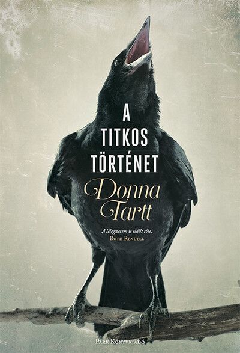</a> <b>Hungarian Park - A titkos történet</b></td>
  </tr>
  <tr>
    <td align="center" width="150" valign="top"> <b>Hebrew Modan - ההיסטוריה הסודית</b></td>
    <td align="center" width="150" valign="top"> <b>Czech Osveta/Argo - Tajná historie</b></td>
    <td align="center" width="150" valign="top"><a href="assets/images/TSH-LT-ALMA98-cover_goodreads.jpg">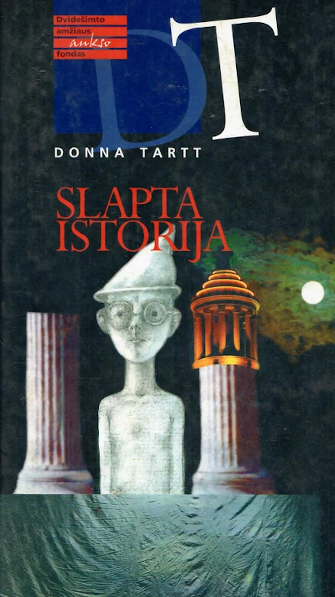</a> <b>Lithuanian Alma Littera - Slapta istorija</b></td>
    <td align="center" width="150" valign="top"> <b>Romanian Litera - Istoria secretă</b></td>
    <td align="center" width="150" valign="top"> <b>Korean reissue 은행나무 - 비밀의 계절</b></td>
  </tr>
  <tr>
    <td align="center" width="150" valign="top"> <b>TSH 2023 Unabridged Audiobook (Tartt nar…</b></td>
    <td align="center" width="150" valign="top"> <b>TSH unabridged audiobook (Karen White, P…</b></td>
    <td align="center" width="150" valign="top"><a href="assets/images/rId72.jpg">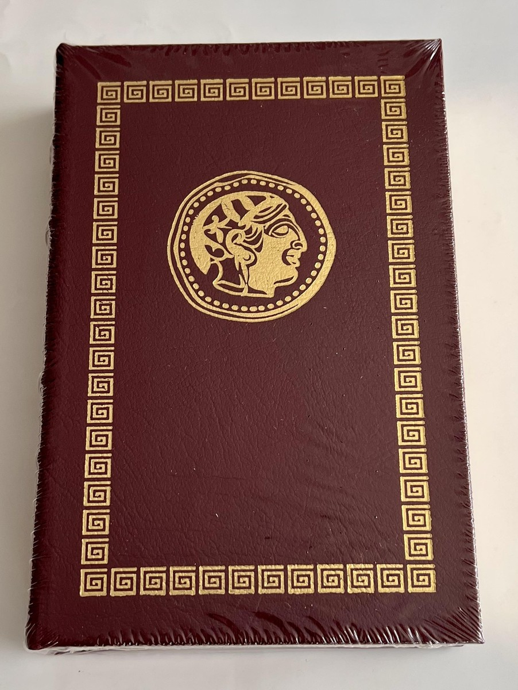</a> <b>Easton Press signed leather edition</b></td>
  </tr>
</table>

## The Little Friend (2002) — 24 editions · [full reference & edition list →](Donna_Tartt_Collectors_Reference.md#3-the-little-friend-2002)

<table>
  <tr>
    <td align="center" width="150" valign="top"> <b>US Knopf 1st/1st (orange/red jacket)</b></td>
    <td align="center" width="150" valign="top"> <b>US Knopf uncorrected proof / ARC</b></td>
    <td align="center" width="150" valign="top"> <b>UK Bloomsbury trade hardcover 1st</b></td>
    <td align="center" width="150" valign="top"> <b>UK Bloomsbury Deluxe Limited 350 signed</b></td>
    <td align="center" width="150" valign="top"><a href="assets/images/rId73.jpg">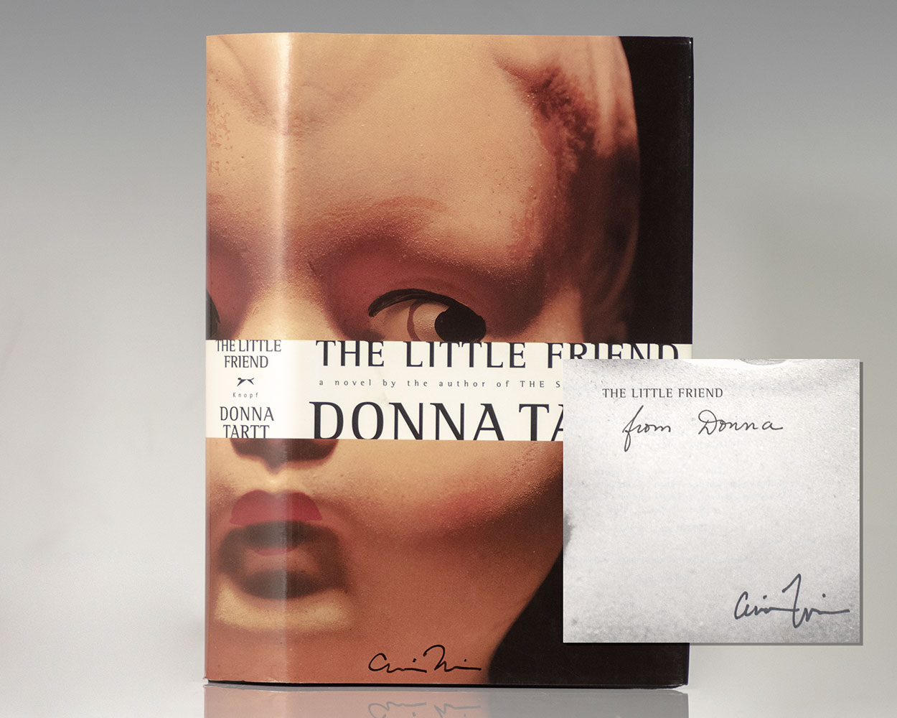</a> <b>UK Bloomsbury Advance Review Copy (940 s…</b></td>
  </tr>
  <tr>
    <td align="center" width="150" valign="top"> <b>Dutch De Bezige Bij true first - De klei…</b></td>
    <td align="center" width="150" valign="top"><a href="assets/images/_retrieved/TLF-F02-cover-openlibrary.jpg">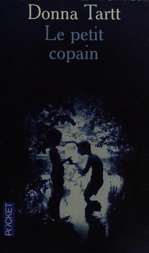</a> <b>French Plon - Le petit copain</b></td>
    <td align="center" width="150" valign="top"> <b>German Goldmann - Der kleine Freund</b></td>
    <td align="center" width="150" valign="top"> <b>Italian Rizzoli BUR - Il piccolo amico</b></td>
    <td align="center" width="150" valign="top"><a href="assets/images/TLF-ES-LUMEN03-cover_goodreads.jpg">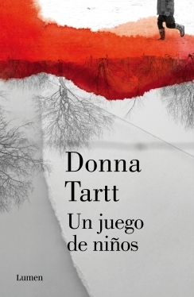</a> <b>Spanish Lumen - Un juego de niños</b></td>
  </tr>
  <tr>
    <td align="center" width="150" valign="top"> <b>Greek Livanis - Ο μικρός φίλος</b></td>
    <td align="center" width="150" valign="top"> <b>Polish Zysk i S-ka 1st - Mały przyjaciel</b></td>
    <td align="center" width="150" valign="top"> <b>Japanese Fusosha vol 1 - ひそやかな復讐 上</b></td>
    <td align="center" width="150" valign="top"> <b>Japanese Fusosha vol 2 - ひそやかな復讐 下</b></td>
    <td align="center" width="150" valign="top"><a href="assets/images/_retrieved/TLF-F09-publisher.jpg">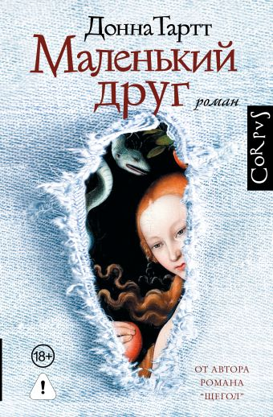</a> <b>Russian AST/Corpus - Маленький друг</b></td>
  </tr>
  <tr>
    <td align="center" width="150" valign="top"><a href="assets/images/TLF-KO-EHN17-vol1-cover_publisher.jpg">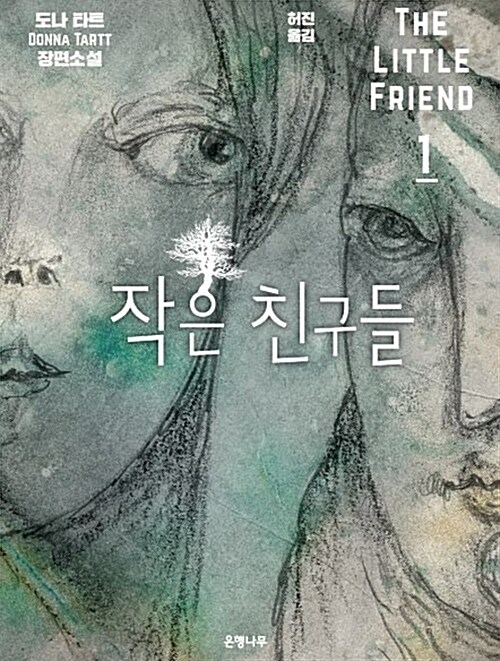</a> <b>Korean Eunhaeng-namu - 작은 친구들</b></td>
    <td align="center" width="150" valign="top"><a href="Donna_Tartt_Collectors_Reference.md#3-the-little-friend-2002"><em>(cover missing)</em></a> <b>Chinese (Trad) Marco Polo - 小友</b> <i>cover missing</i></td>
    <td align="center" width="150" valign="top"> <b>Hebrew Zmora-Bitan - הידיד הקטן</b></td>
    <td align="center" width="150" valign="top"> <b>TLF abridged audiobook (Tartt narrated)</b></td>
    <td align="center" width="150" valign="top"> <b>TLF unabridged audiobook (Karen White, 2…</b></td>
  </tr>
  <tr>
    <td align="center" width="150" valign="top"><a href="assets/images/_retrieved/TLF-008-cover-openlibrary.jpg">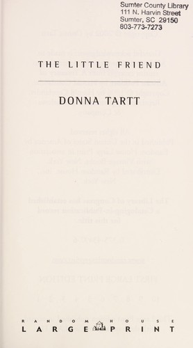</a> <b>TLF Random House Large Print 2005</b></td>
    <td align="center" width="150" valign="top"> <b>UK Bloomsbury paperback 1st 2003</b></td>
    <td align="center" width="150" valign="top"> <b>US Vintage Contemporaries paperback 1st …</b></td>
    <td align="center" width="150" valign="top"> <b>Bloomsbury Modern Classics paperback 2017</b></td>
  </tr>
</table>

## The Goldfinch (2013) — 39 editions · [full reference & edition list →](Donna_Tartt_Collectors_Reference.md#4-the-goldfinch-2013)

<table>
  <tr>
    <td align="center" width="150" valign="top"><a href="assets/images/HET-PUTTERTJE_1_f2d94d8d66.jpg">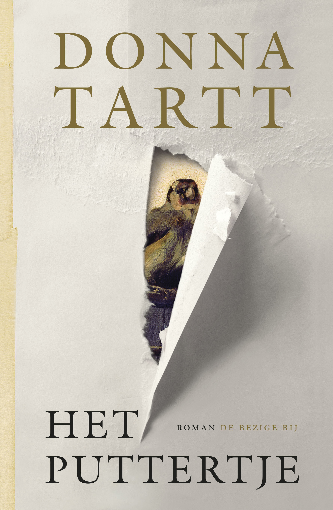</a> <b>Het puttertje Dutch paperback (chronolog…</b></td>
    <td align="center" width="150" valign="top"> <b>US Little Brown 1st/1st (no Pulitzer tex…</b></td>
    <td align="center" width="150" valign="top"> <b>UK Little Brown trade hardcover 1st</b></td>
    <td align="center" width="150" valign="top"><a href="assets/images/TG-US-ARC-cover.jpg">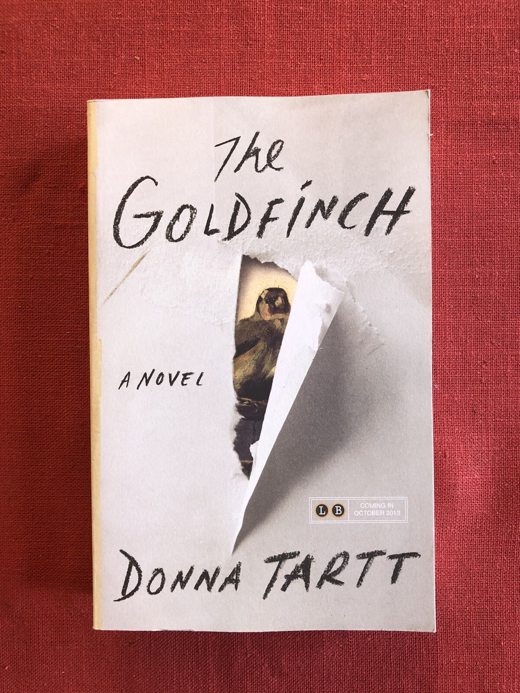</a> <b>US Little Brown uncorrected proof / ARC</b></td>
    <td align="center" width="150" valign="top"><a href="assets/images/TG-UK-DLX-Sothebys_1_ba53b8321d.png">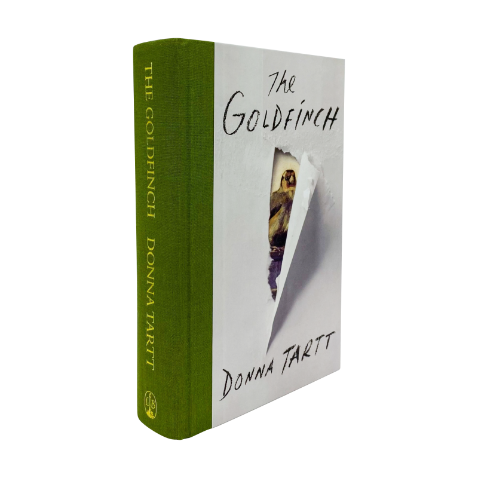</a> <b>UK Little Brown Deluxe Signed Limited (1…</b></td>
  </tr>
  <tr>
    <td align="center" width="150" valign="top"><a href="assets/images/TG-UK-LETTERED-Z-slipcase_abe.jpg">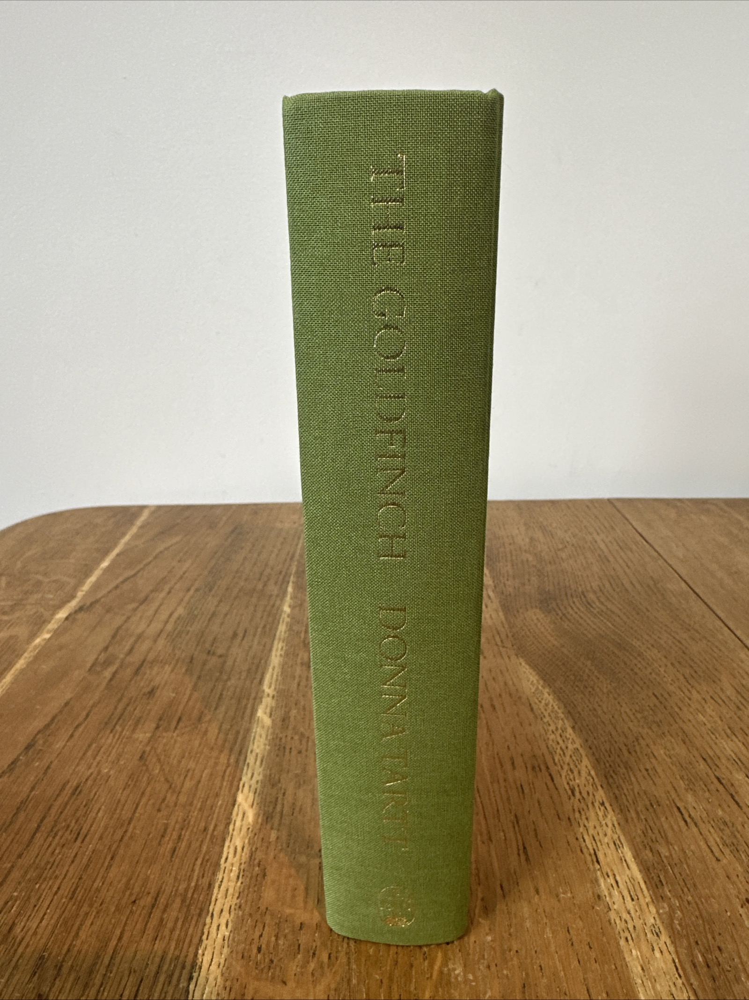</a> <b>UK Little Brown Deluxe Lettered Limited …</b></td>
    <td align="center" width="150" valign="top"><a href="assets/images/rId50.jpg">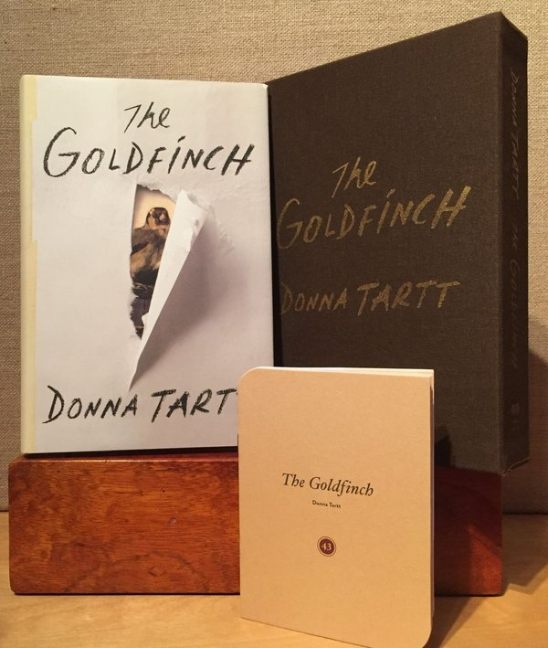</a> <b>Powell's Indiespensable Vol 43 (purple i…</b></td>
    <td align="center" width="150" valign="top"><a href="assets/images/rId74.jpg">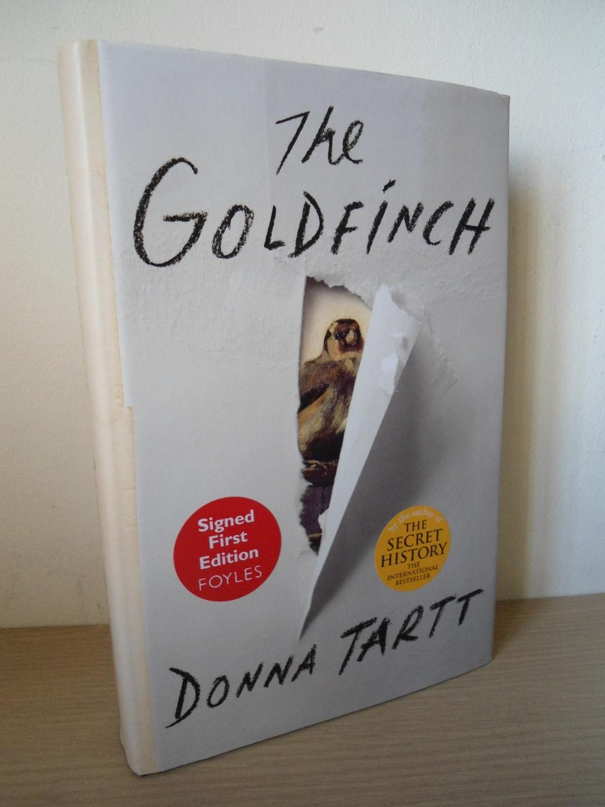</a> <b>Foyles signed first edition (copper ink,…</b></td>
    <td align="center" width="150" valign="top"><a href="assets/images/TG-UK-10ANN-cover_ebay.jpg">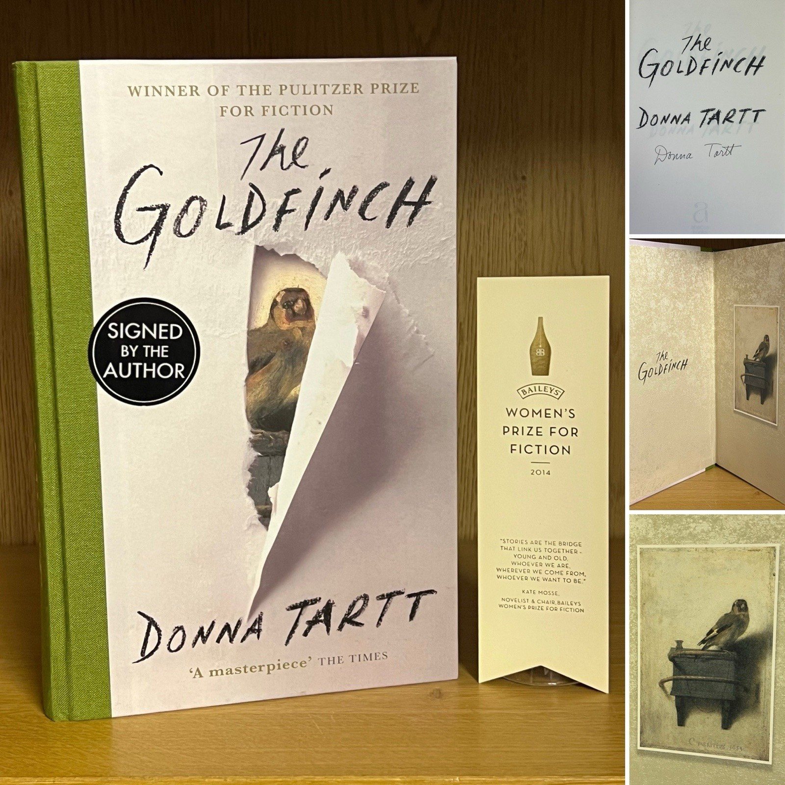</a> <b>Waterstones 10th Anniversary signed 2023</b></td>
    <td align="center" width="150" valign="top"><a href="assets/images/rId75.jpg">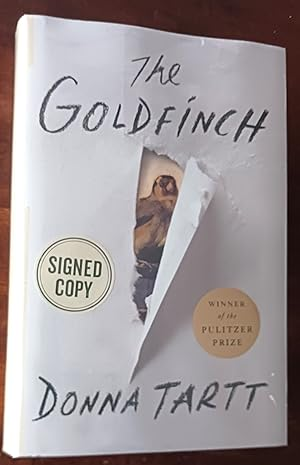</a> <b>Barnes & Noble Signed First Edition</b></td>
  </tr>
  <tr>
    <td align="center" width="150" valign="top"><a href="assets/images/rId76.jpg">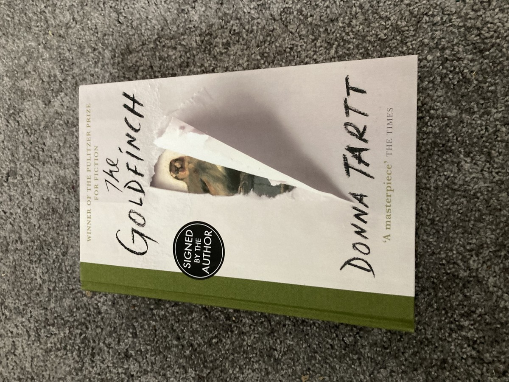</a> <b>US Little Brown 10th Anniversary Deluxe …</b></td>
    <td align="center" width="150" valign="top"><a href="assets/images/_retrieved/TG-F01-cover-openlibrary.jpg">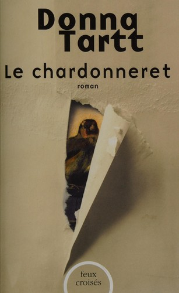</a> <b>French Plon - Le Chardonneret</b></td>
    <td align="center" width="150" valign="top"> <b>German Goldmann HC - Der Distelfink</b></td>
    <td align="center" width="150" valign="top"> <b>Italian Rizzoli HC 1st - Il cardellino</b></td>
    <td align="center" width="150" valign="top"> <b>Italian BUR 2015 - Il cardellino</b></td>
  </tr>
  <tr>
    <td align="center" width="150" valign="top"><a href="assets/images/_retrieved/TG-F04-cover-openlibrary.jpg">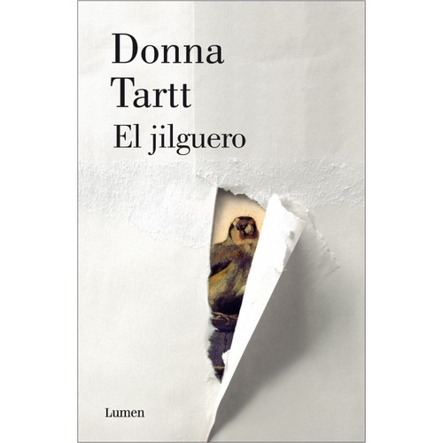</a> <b>Spanish Lumen - El jilguero</b></td>
    <td align="center" width="150" valign="top"> <b>Greek Livanis - Η Καρδερίνα</b></td>
    <td align="center" width="150" valign="top"> <b>Polish Znak - Szczygieł</b></td>
    <td align="center" width="150" valign="top"><a href="assets/images/TG-JP-KAWADE16-vol1-cover_publisher.jpg">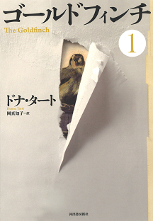</a> <b>Japanese Kawade vol 1 - ゴールドフィンチ</b></td>
    <td align="center" width="150" valign="top"><a href="assets/images/_retrieved/TG-F08-ast.jpg">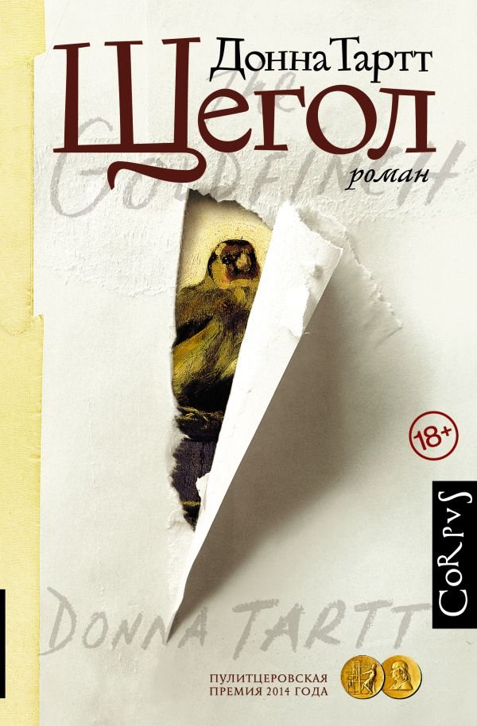</a> <b>Russian AST/Corpus - Щегол</b></td>
  </tr>
  <tr>
    <td align="center" width="150" valign="top"><a href="assets/images/TG-KO-EHN15-vol1-cover_publisher.jpg">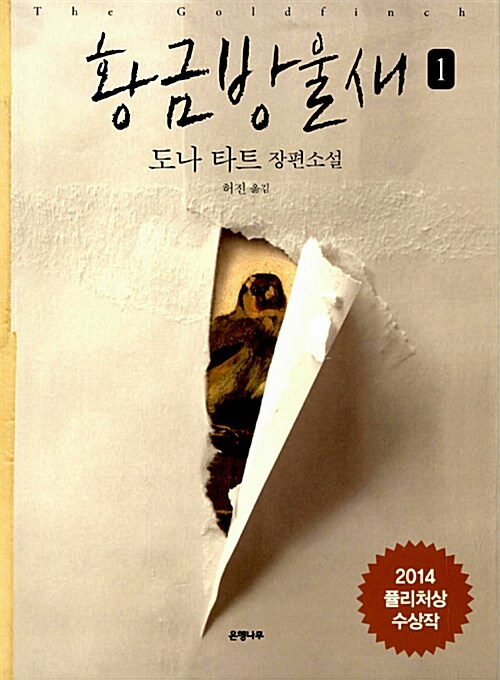</a> <b>Korean Eunhaeng-namu vol 1 - 황금방울새</b></td>
    <td align="center" width="150" valign="top"> <b>Chinese People's Literature - 金翅雀</b></td>
    <td align="center" width="150" valign="top"> <b>Portuguese BR Companhia das Letras - O p…</b></td>
    <td align="center" width="150" valign="top"> <b>Portuguese (PT) Editorial Presença - O P…</b></td>
    <td align="center" width="150" valign="top"><a href="assets/images/TG-CS-ARGO15-cover_ebay.jpg">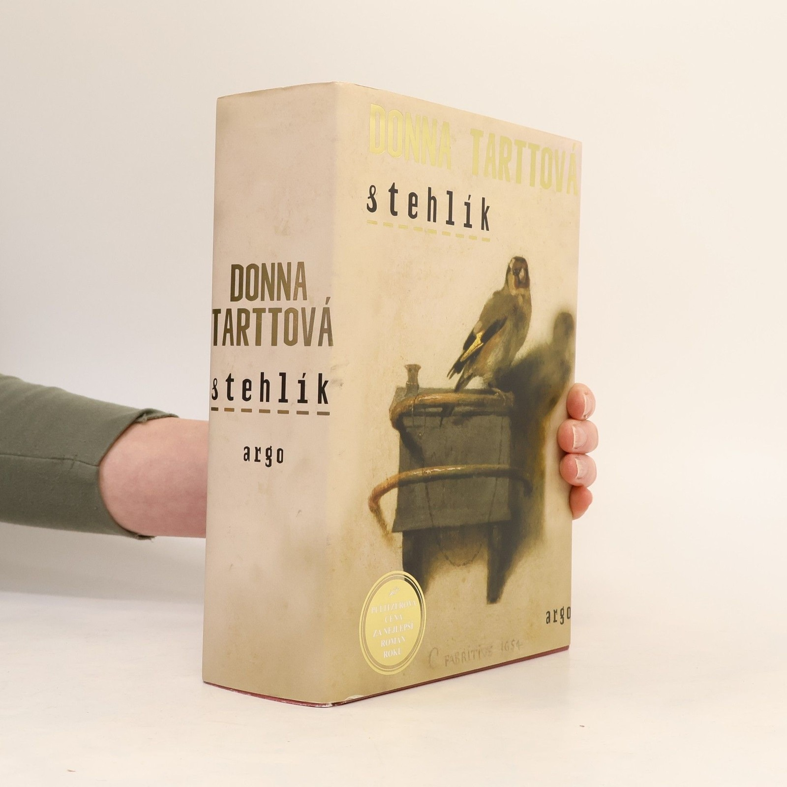</a> <b>Czech Argo - Stehlík</b></td>
  </tr>
  <tr>
    <td align="center" width="150" valign="top"> <b>Hungarian Park - Az Aranypinty</b></td>
    <td align="center" width="150" valign="top"><a href="assets/images/TG-RO-LITERA14-cover_goodreads.jpg">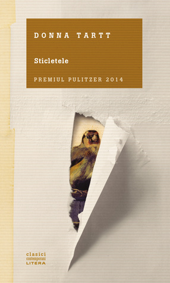</a> <b>Romanian Litera - Sticletele</b></td>
    <td align="center" width="150" valign="top"><a href="assets/images/_retrieved/TG-F15-bokborsen.jpg">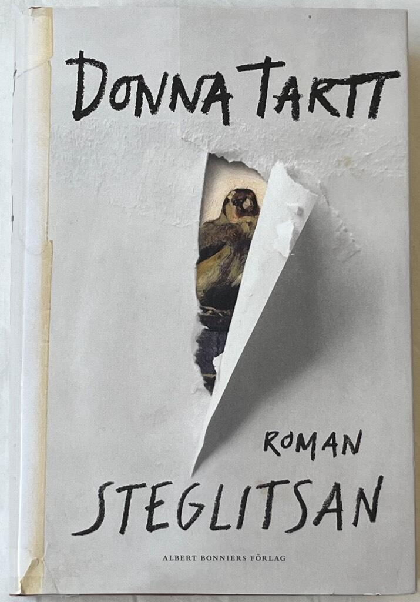</a> <b>Swedish Albert Bonniers - Steglitsan</b></td>
    <td align="center" width="150" valign="top"><a href="assets/images/TG-NO-CAPPELEN14-cover_goodreads.jpg">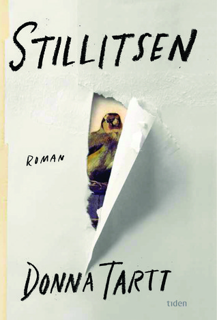</a> <b>Norwegian Cappelen Damm - Stillitsen</b></td>
    <td align="center" width="150" valign="top"> <b>Turkish Doğan Kitap - Saka Kuşu</b></td>
  </tr>
  <tr>
    <td align="center" width="150" valign="top"> <b>Hebrew Modan - הציפור החולמנית</b></td>
    <td align="center" width="150" valign="top"><a href="Donna_Tartt_Collectors_Reference.md#4-the-goldfinch-2013"><em>(cover missing)</em></a> <b>Arabic - العصفور الذهبي</b> <i>cover missing</i></td>
    <td align="center" width="150" valign="top"><a href="Donna_Tartt_Collectors_Reference.md#4-the-goldfinch-2013"><em>(cover missing)</em></a> <b>Thai - นกโกลด์ฟินช์</b> <i>cover missing</i></td>
    <td align="center" width="150" valign="top"> <b>TG unabridged audiobook (David Pittu)</b></td>
    <td align="center" width="150" valign="top"> <b>TG UK Abacus film tie-in 2019</b></td>
  </tr>
  <tr>
    <td align="center" width="150" valign="top"> <b>TG US Little Brown film tie-in 2019</b></td>
    <td align="center" width="150" valign="top"> <b>TG large-print edition 2013</b></td>
    <td align="center" width="150" valign="top"> <b>TG US Kindle (B00BAXFECK)</b></td>
    <td align="center" width="150" valign="top"> <b>TG UK Kindle (B00C74SHRK)</b></td>
  </tr>
</table>

## Short Fiction (9)

<table>
  <tr>
    <td align="center" width="150" valign="top"> <b>Penguin 60s - A Christmas Pageant reprint</b></td>
    <td align="center" width="150" valign="top"> <b>Harper's July 1992 - Sleepytown</b></td>
    <td align="center" width="150" valign="top"> <b>The New Yorker April 1993 - Tam-O'-Shant…</b></td>
    <td align="center" width="150" valign="top"><a href="catalogue/MAG-003.md">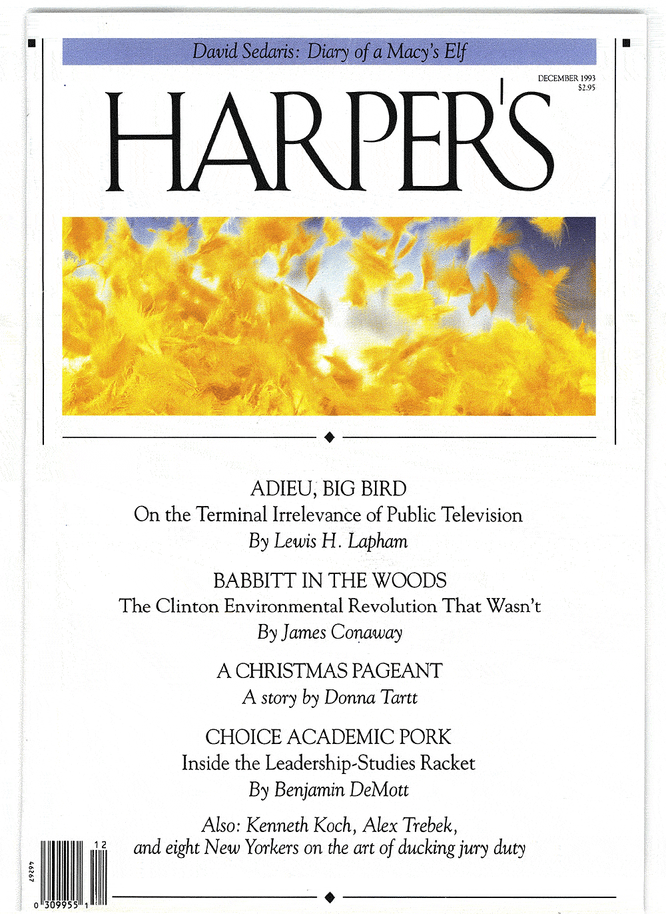</a> <b>Harper's December 1993 - A Christmas Pag…</b></td>
    <td align="center" width="150" valign="top"> <b>A Very Southern Christmas - Holiday Stor…</b></td>
  </tr>
  <tr>
    <td align="center" width="150" valign="top"> <b>GQ May 1995 - A Garter Snake</b></td>
    <td align="center" width="150" valign="top"><a href="catalogue/MAG-005.md"><em>(cover missing)</em></a> <b>Guardian Weekend June 25 2005 - The Ambu…</b> <i>cover missing</i></td>
    <td align="center" width="150" valign="top"><a href="catalogue/MAG-006.md">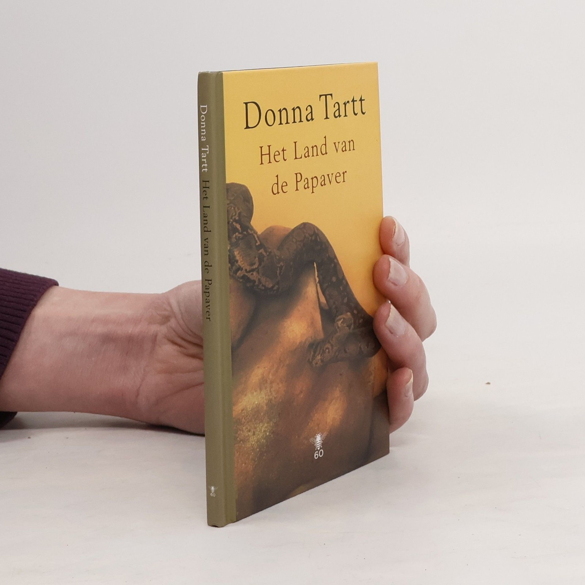</a> <b>Het land van de Papaver - De Bezige Bij …</b></td>
    <td align="center" width="150" valign="top"><a href="catalogue/MAG-020.md"><em>(cover missing)</em></a> <b>Sommer Sonne Sand und mehr (ed Georg Reu…</b> <i>cover missing</i></td>
  </tr>
</table>

## Nonfiction & Essays (12)

<table>
  <tr>
    <td align="center" width="150" valign="top"> <b>Oxford American #2 Fall 1992 - Basketbal…</b></td>
    <td align="center" width="150" valign="top"> <b>Harper's April 1994 - Team Spirit</b></td>
    <td align="center" width="150" valign="top"> <b>Oxford American #30 Nov/Dec 1999 - Spiri…</b></td>
    <td align="center" width="150" valign="top"> <b>Remembering Willie 2000 - UPMS</b></td>
    <td align="center" width="150" valign="top"> <b>Harper's July 2024 - Art and Artifice</b></td>
  </tr>
  <tr>
    <td align="center" width="150" valign="top"><a href="catalogue/MAG-013.md"><em>(cover missing)</em></a> <b>NYT June 9 2020 - On the Singular Voice …</b> <i>cover missing</i></td>
    <td align="center" width="150" valign="top"><a href="catalogue/MAG-014.md">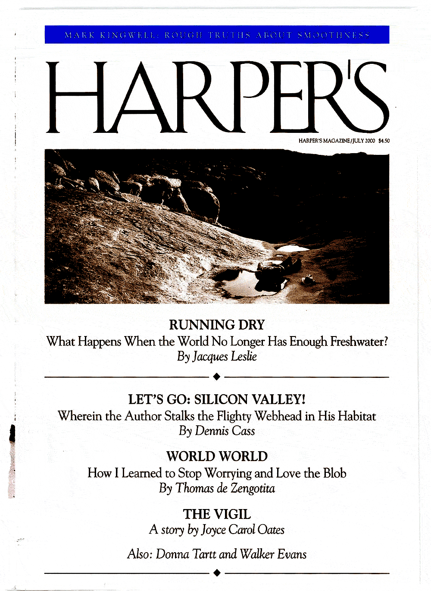</a> <b>Harper's July 2000 - The Glory of J. F. …</b></td>
    <td align="center" width="150" valign="top"><a href="catalogue/MAG-015.md">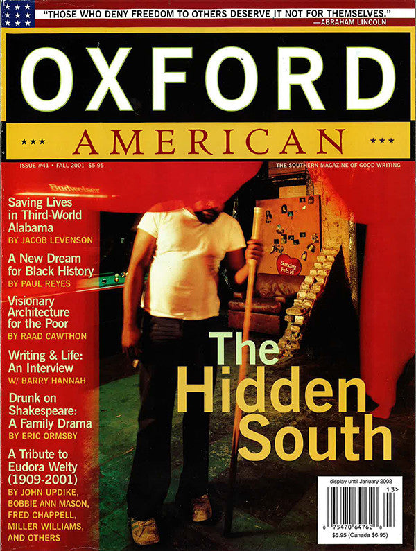</a> <b>Oxford American #41 Fall 2001 - Spanish …</b></td>
    <td align="center" width="150" valign="top"> <b>Oxford American #6 Mar/Apr 1995 - In Mel…</b></td>
    <td align="center" width="150" valign="top"><a href="catalogue/MAG-017.md">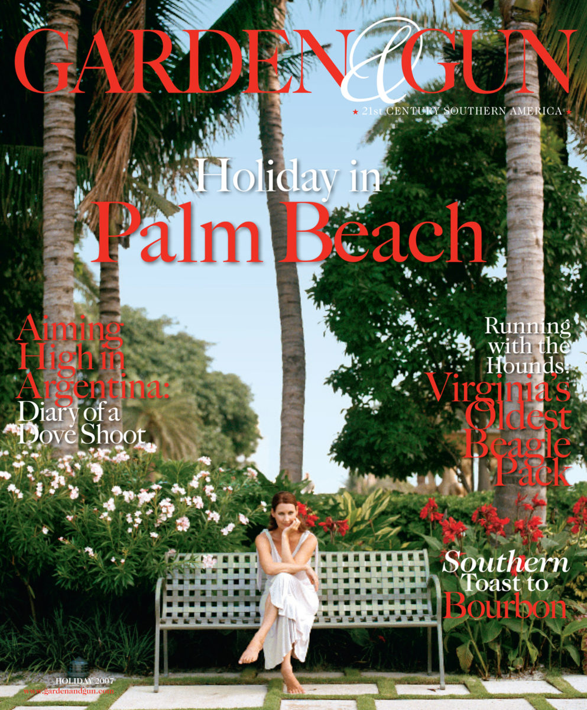</a> <b>Garden & Gun Holiday 2007 - Early Times …</b></td>
  </tr>
  <tr>
    <td align="center" width="150" valign="top"> <b>The Observer Nov 16 2003 - This much I k…</b></td>
    <td align="center" width="150" valign="top"> <b>Oxford American #29 Sep/Oct 1999 - Willi…</b></td>
  </tr>
</table>

## Introductions & Contributions (33)

<table>
  <tr>
    <td align="center" width="150" valign="top"> <b>True Grit (Bloomsbury 2005) - Tartt intr…</b></td>
    <td align="center" width="150" valign="top"> <b>True Grit (Overlook 2010 movie tie-in re…</b></td>
    <td align="center" width="150" valign="top"><a href="catalogue/CON-001b2.md"><em>(cover missing)</em></a> <b>True Grit (Overlook 2010 reprint trade e…</b> <i>cover missing</i></td>
    <td align="center" width="150" valign="top"> <b>True Grit Audiobook (Recorded Books 2006…</b></td>
    <td align="center" width="150" valign="top"><a href="catalogue/CON-003.md"><em>(cover missing)</em></a> <b>Winesburg, Ohio audiobook contribution</b> <i>cover missing</i></td>
  </tr>
  <tr>
    <td align="center" width="150" valign="top"> <b>Murder For Love - Penzler ed (Delacorte …</b></td>
    <td align="center" width="150" valign="top"> <b>Murder For Love - Dell paperback</b></td>
    <td align="center" width="150" valign="top"> <b>Reclaiming Art in the Age of Artifice (C…</b></td>
    <td align="center" width="150" valign="top"> <b>Reclaiming Art audiobook 2024</b></td>
    <td align="center" width="150" valign="top"> <b>Bomb Magazine Summer 1996 - Editor's Cho…</b></td>
  </tr>
  <tr>
    <td align="center" width="150" valign="top"> <b>Erin Parish 'Into the Blue Again' exhibi…</b></td>
    <td align="center" width="150" valign="top"> <b>Pen Meets Paint - 200 Years Mauritshuis …</b></td>
    <td align="center" width="150" valign="top"><a href="catalogue/CON-009.md">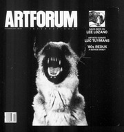</a> <b>Artforum International Oct 2001 - Willia…</b></td>
    <td align="center" width="150" valign="top"> <b>A William Maxwell Portrait (Norton 2004)…</b></td>
    <td align="center" width="150" valign="top"><a href="catalogue/CON-010b.md">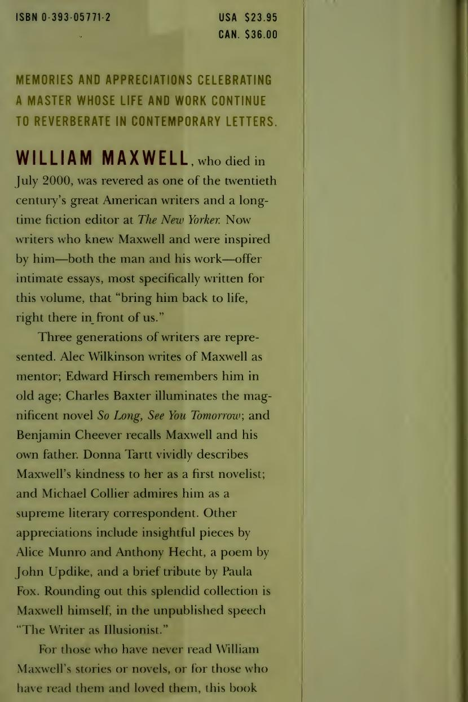</a> <b>A William Maxwell Portrait (Norton 2004)…</b></td>
  </tr>
  <tr>
    <td align="center" width="150" valign="top"> <b>Folio Society - We Have Always Lived in …</b></td>
    <td align="center" width="150" valign="top"> <b>Folio Society - We Have Always Lived in …</b></td>
    <td align="center" width="150" valign="top"><a href="catalogue/CON-012.md">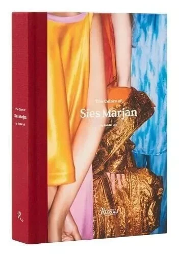</a> <b>The Colors of Sies Marjan (Sander Lak) -…</b></td>
    <td align="center" width="150" valign="top"> <b>By the Book - Writers on Literature (Pam…</b></td>
    <td align="center" width="150" valign="top"> <b>National Gallery of Art Washington - A W…</b></td>
  </tr>
  <tr>
    <td align="center" width="150" valign="top"><a href="catalogue/CON-014b.md"><em>(cover missing)</em></a> <b>National Gallery of Art Washington - A W…</b> <i>cover missing</i></td>
    <td align="center" width="150" valign="top"> <b>The Same River Twice (USN 2014) - ✗ MISI…</b></td>
    <td align="center" width="150" valign="top"> <b>The Same River Twice - Reminiscences fro…</b></td>
    <td align="center" width="150" valign="top"> <b>Fairy Tale Review Vol 1 The Blue Issue (…</b></td>
    <td align="center" width="150" valign="top"> <b>Mein Lieblingsmensch - Geschichten ueber…</b></td>
  </tr>
  <tr>
    <td align="center" width="150" valign="top"> <b>Mein Lieblingsmensch - Diogenes Deluxe (…</b></td>
    <td align="center" width="150" valign="top"><a href="catalogue/CON-018.md">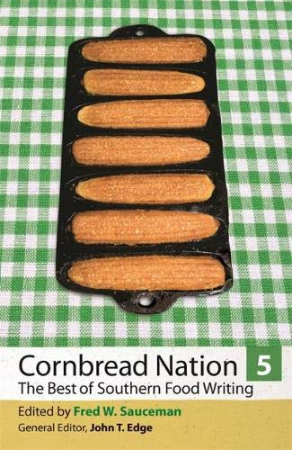</a> <b>Cornbread Nation 5 - Best of Southern Fo…</b></td>
    <td align="center" width="150" valign="top"> <b>Fairy Tale Review Vol 2 The Green Issue …</b></td>
    <td align="center" width="150" valign="top"> <b>The Life of St Francis (Bonaventure tr C…</b></td>
    <td align="center" width="150" valign="top"> <b>When We Were Young - A Compendium of Chi…</b></td>
  </tr>
  <tr>
    <td align="center" width="150" valign="top"><a href="catalogue/CON-022.md"><em>(cover missing)</em></a> <b>Legendary Authors and the Clothes They W…</b> <i>cover missing</i></td>
    <td align="center" width="150" valign="top"> <b>A Portrait of Southern Writers (Curt Ric…</b></td>
    <td align="center" width="150" valign="top"> <b>Livraison N°2 (Marie Birde ed Stockholm …</b></td>
  </tr>
</table>

## Press & Ephemera (10)

<table>
  <tr>
    <td align="center" width="150" valign="top"> <b>Vanity Fair September 1992 - Smart Tartt…</b></td>
    <td align="center" width="150" valign="top"><a href="catalogue/EPH-002.md"><em>(cover missing)</em></a> <b>The Bookseller (UK) June 27 2002</b> <i>cover missing</i></td>
    <td align="center" width="150" valign="top"><a href="catalogue/EPH-002b.md"><em>(cover missing)</em></a> <b>The Bookseller (UK) Sept 26 2002 - Embar…</b> <i>cover missing</i></td>
    <td align="center" width="150" valign="top"> <b>Lenox Hill chapbook 'Tam O'Shanter' 250 …</b></td>
    <td align="center" width="150" valign="top"> <b>Esquire September 1992 'Tartt's Sweet De…</b></td>
  </tr>
  <tr>
    <td align="center" width="150" valign="top"><a href="catalogue/EPH-005.md">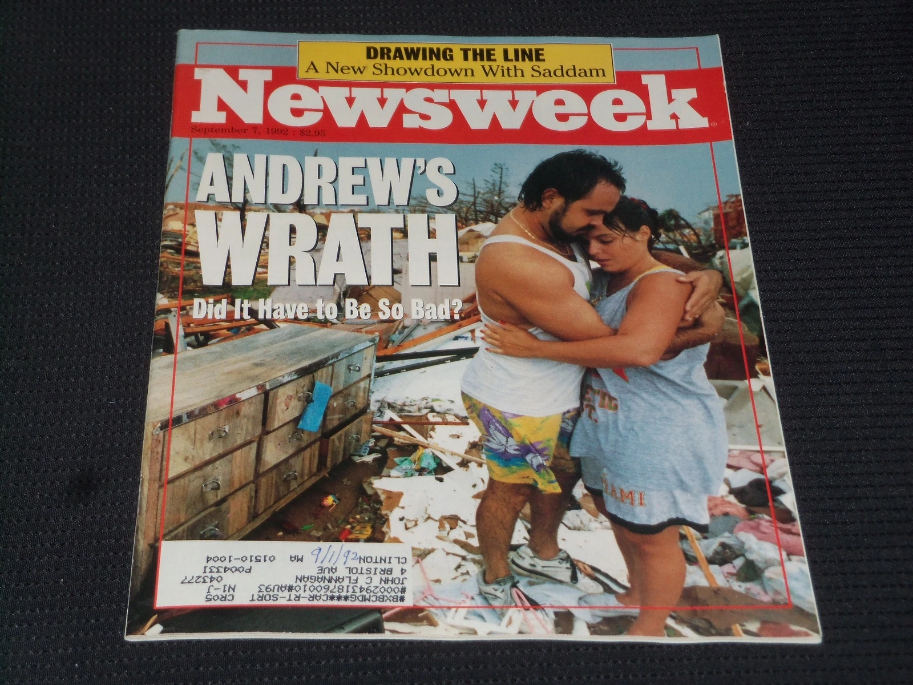</a> <b>Newsweek September 7 1992 'Anatomy of a …</b></td>
    <td align="center" width="150" valign="top"> <b>Vogue September 1992 (Claudia Schiffer b…</b></td>
    <td align="center" width="150" valign="top"> <b>Cosmopolitan September 1992</b></td>
    <td align="center" width="150" valign="top"> <b>Glamour September 1992</b></td>
    <td align="center" width="150" valign="top"><a href="catalogue/EPH-009.md"><em>(cover missing)</em></a> <b>Borzoi Reader Vol 4 No 3 Fall 1992 (Knop…</b> <i>cover missing</i></td>
  </tr>
</table>

## Interviews & bylines (18)

<table>
  <tr>
    <td align="center" width="150" valign="top"><a href="catalogue/INT-1992-10-04_Newsday_Pat-Lambert_Cinderella-Story.md"><em>(cover missing)</em></a> <b>Talking With Donna Tartt, Cinderella Sto…</b> <i>transcript</i></td>
    <td align="center" width="150" valign="top"><a href="catalogue/INT-2001-04_BBC-Today_Mark-Coles_The-Secret-History-of-Donna-Tartt.md"><em>(cover missing)</em></a> <b>The Secret History of Donna Tartt</b> <i>transcript</i></td>
    <td align="center" width="150" valign="top"><a href="catalogue/INT-2002-05-21_Independent_Boyd-Tonkin_Whatever-Happened-to-Donna-Tartt.md"><em>(cover missing)</em></a> <b>The Secret History: Whatever happened to…</b> <i>transcript</i></td>
    <td align="center" width="150" valign="top"><a href="catalogue/INT-2002-09-23_NovaTV-NL_Donna-Tartt-verovert-Nederland.md"><em>(cover missing)</em></a> <b>Donna Tartt verovert Nederland (Dutch TV)</b> <i>transcript</i></td>
    <td align="center" width="150" valign="top"><a href="catalogue/INT-2002-10-14_USAToday_Dennis-Moore_A-Decade-Later-Another-Illusion-Crafted.md"><em>(cover missing)</em></a> <b>A decade later, another 'illusion' craft…</b> <i>transcript</i></td>
  </tr>
  <tr>
    <td align="center" width="150" valign="top"><a href="catalogue/INT-2002-10-19_Telegraph_Mick-Brown_Worth-Waiting-For.md"><em>(cover missing)</em></a> <b>Worth Waiting For</b> <i>transcript</i></td>
    <td align="center" width="150" valign="top"><a href="catalogue/INT-2002-11-12_BookMagazine_Liz-Seymour_Adventure-of-the-Vanishing-Lady-Writer.md"><em>(cover missing)</em></a> <b>The Adventure of the Vanishing Lady Writ…</b> <i>transcript</i></td>
    <td align="center" width="150" valign="top"><a href="catalogue/INT-2002-12-02_NPR-MorningEdition_Woodroof_Donna-Tartt-Discusses-The-Little-Friend.md"><em>(cover missing)</em></a> <b>Donna Tartt discusses her new book *The …</b> <i>transcript</i></td>
    <td align="center" width="150" valign="top"><a href="catalogue/INT-2002_RandomHouse_Author-Q-and-A_The-Little-Friend.md"><em>(cover missing)</em></a> <b>A Conversation with Donna Tartt, Author …</b> <i>transcript</i></td>
    <td align="center" width="150" valign="top"><a href="catalogue/INT-2003-12-07_Oregonian_Nancy-Haught_Little-Tip-Read-Aloud.md"><em>(cover missing)</em></a> <b>Here's a little tip from Tartt: Slip the…</b> <i>transcript</i></td>
  </tr>
  <tr>
    <td align="center" width="150" valign="top"><a href="catalogue/INT-2003-12-07_Oregonian_Nancy-Haught_Smartt-Writing.md"><em>(cover missing)</em></a> <b>Smartt writing</b> <i>transcript</i></td>
    <td align="center" width="150" valign="top"><a href="catalogue/INT-2003_OrangePrize_Shortlisted-Author-Interview.md"><em>(cover missing)</em></a> <b>The Orange Prize Shortlisted Author Inte…</b> <i>transcript</i></td>
    <td align="center" width="150" valign="top"><a href="catalogue/INT-2005-09-04_Telegraph_Melissa-Whitworth_The-Levee-Breaking.md"><em>(cover missing)</em></a> <b>The levee breaking: it was always the te…</b> <i>transcript</i></td>
    <td align="center" width="150" valign="top"><a href="catalogue/INT-2013-10-22_Salon_Laura-Miller_The-Fun-Thing-About-Writing.md"><em>(cover missing)</em></a> <b>Donna Tartt: "The fun thing about writin…</b> <i>transcript</i></td>
    <td align="center" width="150" valign="top"><a href="catalogue/INT-2023-12-11_QueensReadingRoom_Q-and-A-with-Donna-Tartt.md"><em>(cover missing)</em></a> <b>Q&A with Donna Tartt — The Queen's Readi…</b> <i>transcript</i></td>
  </tr>
  <tr>
    <td align="center" width="150" valign="top"><a href="catalogue/INT-1993_Actuel_Taddei_Au-Poil.md"><em>(cover missing)</em></a> <b>1993 — Actuel — Taddei — Au-Poil</b> <i>full text</i></td>
    <td align="center" width="150" valign="top"><a href="catalogue/INT-2025-09-15_IlFoglio_Monda.md"><em>(cover missing)</em></a> <b>2025-09-15 — IlFoglio — Monda</b> <i>full text</i></td>
    <td align="center" width="150" valign="top"><a href="catalogue/P55_NYT-Bosman_Talks-A-Bit.md"><em>(cover missing)</em></a> <b>NYT-Bosman — Talks-A-Bit</b> <i>full text</i></td>
  </tr>
</table>

