## Table of Contents

- [1. About Donna Tartt](#1-about-donna-tartt)
- [2. The Secret History (1992)](#2-the-secret-history-1992)
  - [2.1 US first edition (Alfred A. Knopf, New York)](#21-us-first-edition-alfred-a-knopf-new-york)
  - [2.2 US Knopf per-printing matrix (1st through 4th printings)](#22-us-knopf-per-printing-matrix-1st-through-4th-printings)
  - [2.3 US pre-publication states — Uncorrected Proof and Advance Reader's Edition](#23-us-pre-publication-states--uncorrected-proof-and-advance-readers-edition)
  - [2.4 UK first edition (Viking, 1992)](#24-uk-first-edition-viking-1992)
  - [2.5 UK Viking uncorrected proof (the proof epigraph variant)](#25-uk-viking-uncorrected-proof-the-proof-epigraph-variant)
  - [2.5A UK Viking trade paperback trial binding (1992)](#25a-uk-viking-trade-paperback-trial-binding-1992)
  - [2.6 Penguin / Vintage paperback firsts](#26-penguin--vintage-paperback-firsts)
  - [2.6A Ivy Books / Ballantine Books International Edition (May 1993)](#26a-ivy-books--ballantine-books-international-edition-may-1993)
  - [2.6B Ballantine Books domestic US mass-market paperback (May 1993)](#26b-ballantine-books-domestic-us-mass-market-paperback-may-1993)
  - [2.6C Random House trade paperback (1996)](#26c-random-house-trade-paperback-1996)
  - [2.6D Penguin Red Classics Edition (2006)](#26d-penguin-red-classics-edition-2006)
  - [2.6E Penguin Books (UK) Celebrations Edition (2007)](#26e-penguin-books-uk-celebrations-edition-2007)
  - [2.7 Bloomsbury 2009 boxed signed limited (TSH + TLF)](#27-bloomsbury-2009-boxed-signed-limited-tsh--tlf)
  - [2.7A Penguin Books (UK) 25th Anniversary Paperback Edition (2017)](#27a-penguin-books-uk-25th-anniversary-paperback-edition-2017)
  - [2.8 Viking 30th Anniversary signed numbered limited (2022)](#28-viking-30th-anniversary-signed-numbered-limited-2022)
  - [2.9 Foreign-language firsts of The Secret History](#29-foreign-language-firsts-of-the-secret-history)
  - [2.10 Audiobook editions of The Secret History](#210-audiobook-editions-of-the-secret-history)
  - [2.15 Easton Press signed leather edition of The Secret History](#215-easton-press-signed-leather-edition-of-the-secret-history)
  - [2.13 Large-print editions](#213-large-print-editions)
  - [2.14 E-book editions](#214-e-book-editions)
- [3. The Little Friend (2002)](#3-the-little-friend-2002)
  - [3.1 US first edition (Alfred A. Knopf, New York)](#31-us-first-edition-alfred-a-knopf-new-york)
  - [3.2 US uncorrected proof / advance reading copy](#32-us-uncorrected-proof--advance-reading-copy)
  - [3.2A TLF per-printing matrix (US Knopf)](#32a-tlf-per-printing-matrix-us-knopf)
  - [3.3 UK first edition trade hardcover (Bloomsbury, 2002)](#33-uk-first-edition-trade-hardcover-bloomsbury-2002)
  - [3.4 UK Bloomsbury Deluxe Limited Edition (2002)](#34-uk-bloomsbury-deluxe-limited-edition-2002)
  - [3.5 UK Bloomsbury Advance Review Copy, signed](#35-uk-bloomsbury-advance-review-copy-signed)
  - [3.6 Foreign-language firsts of The Little Friend](#36-foreign-language-firsts-of-the-little-friend)
  - [3.7 Audiobook editions](#37-audiobook-editions)
  - [3.8 TLF large-print edition](#38-tlf-large-print-edition)
  - [3.9 TLF e-book editions](#39-tlf-e-book-editions)
  - [3.10 UK Bloomsbury paperback first edition (2003)](#310-uk-bloomsbury-paperback-first-edition-2003)
  - [3.11 US Vintage Contemporaries paperback first edition (2003)](#311-us-vintage-contemporaries-paperback-first-edition-2003)
  - [3.12 UK Bloomsbury Modern Classics paperback edition (2017)](#312-uk-bloomsbury-modern-classics-paperback-edition-2017)
- [4. The Goldfinch (2013)](#4-the-goldfinch-2013)
  - [4.1 The chronological true first: Het puttertje (De Bezige Bij, 2013)](#41-the-chronological-true-first-het-puttertje-de-bezige-bij-2013)
  - [4.2 US first edition (Little, Brown, October 22, 2013)](#42-us-first-edition-little-brown-october-22-2013)
  - [4.2A UK first edition trade hardcover (Little, Brown, 2013)](#42a-uk-first-edition-trade-hardcover-little-brown-2013)
  - [4.3 US Little Brown uncorrected proof / ARC](#43-us-little-brown-uncorrected-proof--arc)
  - [4.4 TG per-printing matrix (US Little, Brown)](#44-tg-per-printing-matrix-us-little-brown)
  - [4.5 UK Little, Brown Deluxe Signed Limited Edition (2013)](#45-uk-little-brown-deluxe-signed-limited-edition-2013)
  - [4.5A UK Little, Brown Deluxe Lettered Limited Edition A–Z (2013)](#45a-uk-little-brown-deluxe-lettered-limited-edition-az-2013)
  - [4.6 Powell's Indiespensable signed (Volume 43, 2013)](#46-powells-indiespensable-signed-volume-43-2013)
  - [4.7 Foyles signed first edition (UK)](#47-foyles-signed-first-edition-uk)
  - [4.8 Waterstones signed (10th anniversary, 2023)](#48-waterstones-signed-10th-anniversary-2023)
  - [4.10 Barnes & Noble Signed First Edition](#410-barnes--noble-signed-first-edition)
  - [4.11 10th-anniversary 2023 editions](#411-10th-anniversary-2023-editions)
  - [4.12 Foreign-language firsts of The Goldfinch](#412-foreign-language-firsts-of-the-goldfinch)
  - [4.13 Audiobook editions](#413-audiobook-editions)
  - [4.15 TG large-print edition](#415-tg-large-print-edition)
  - [4.16 TG e-book editions](#416-tg-e-book-editions)
  - [4.14 2019 film tie-in editions](#414-2019-film-tie-in-editions)
- [4A. Comprehensive audiobook inventory across all three novels](#4a-comprehensive-audiobook-inventory-across-all-three-novels)
- [5. Short fiction](#5-short-fiction)
  - [5.1 "Sleepytown: A Southern Gothic Childhood, with Codeine"](#51-sleepytown-a-southern-gothic-childhood-with-codeine)
  - [5.2 "Tam-O'-Shanter"](#52-tam-o-shanter)
  - [5.3 "A Christmas Pageant"](#53-a-christmas-pageant)
  - [5.4 "A Garter Snake"](#54-a-garter-snake)
  - [5.5 "The Ambush"](#55-the-ambush)
  - [5.6 "Het land van de Papaver" ("The Land of the Poppy")](#56-het-land-van-de-papaver-the-land-of-the-poppy)
- [6. Nonfiction](#6-nonfiction)
  - [5.7 German anthology — *Sommer, Sonne, Sand und mehr: Das große Ferien-Lesebuch III* (Goldmann Verlag, 1995) — contains "**Schottenmütze**", German translation of "Tam-O'-Shanter" (cf. §5.2)](#57-german-anthology--sommer-sonne-sand-und-mehr-das-große-ferien-lesebuch-iii-goldmann-verlag-1995--contains-schottenmütze-german-translation-of-tam-o-shanter-cf-52)
  - [6.1 "Basketball Season: Requiem of a Mississippi Cheerleader"](#61-basketball-season-requiem-of-a-mississippi-cheerleader)
  - [6.2 "Team Spirit"](#62-team-spirit)
  - [6.3 "The Spirit and Writing in a Secular World" / "Spirituality in the Modern Novel"](#63-the-spirit-and-writing-in-a-secular-world--spirituality-in-the-modern-novel)
  - [6.4 "My friend, my mentor, my inspiration"](#64-my-friend-my-mentor-my-inspiration)
  - [6.5 "Art and Artifice"](#65-art-and-artifice)
  - [6.6 "On the Singular Voice, and Pungent Humor, of Charles Portis"](#66-on-the-singular-voice-and-pungent-humor-of-charles-portis)
  - [6.7 "The Glory of J. F. Powers"](#67-the-glory-of-j-f-powers)
  - [6.8 "Spanish Grandeur in Mississippi"](#68-spanish-grandeur-in-mississippi)
  - [6.9 "In Melbourne"](#69-in-melbourne)
  - [6.10 "Early Times in Mississippi" (in "Ode to Bourbon")](#610-early-times-in-mississippi-in-ode-to-bourbon)
  - [6.11 "This much I know"](#611-this-much-i-know)
  - [6.12 "Willie Morris (1934–1999)" [Tribute]](#612-willie-morris-19341999-tribute)
  - [6.13 Donna Tartt in conversation with Antonio Monda — *Il Foglio*, 15 September 2025 — "La letteratura come scoperta"](#613-donna-tartt-in-conversation-with-antonio-monda--il-foglio-15-september-2025--la-letteratura-come-scoperta)
  - [6.14 "Murder & Imagination" — Oxford American, Issue 11, Spring 1996 (Special Crime Issue)](#614-murder--imagination--oxford-american-issue-11-spring-1996-special-crime-issue)
- [7. Introductions, contributions, and audiobooks Tartt narrated](#7-introductions-contributions-and-audiobooks-tartt-narrated)
  - [7.1 Introduction: Charles Portis, True Grit (Bloomsbury reissue, 2005)](#71-introduction-charles-portis-true-grit-bloomsbury-reissue-2005)
  - [7.2 Audiobook narrated by Tartt: Charles Portis, True Grit](#72-audiobook-narrated-by-tartt-charles-portis-true-grit)
  - [7.3 Audiobook narrated by Tartt: The Little Friend (abridged)](#73-audiobook-narrated-by-tartt-the-little-friend-abridged)
  - [7.4 Audiobook contribution: Sherwood Anderson, Winesburg, Ohio](#74-audiobook-contribution-sherwood-anderson-winesburg-ohio)
  - [7.5 Tartt poem “True Crime” in Otto Penzler ed., Murder For Love (Delacorte Press, 1996)](#75-tartt-poem-true-crime-in-otto-penzler-ed-murder-for-love-delacorte-press-1996)
  - [7.6 Introduction: J.F. Martel, Reclaiming Art in the Age of Artifice (Counterpoint Press / Basic Books, 2024 reissue)](#76-introduction-jf-martel-reclaiming-art-in-the-age-of-artifice-counterpoint-press--basic-books-2024-reissue)
  - [7.7 Bomb Magazine “Editor’s Choice” (Summer 1996)](#77-bomb-magazine-editors-choice-summer-1996)
  - [7.8 Exhibition catalog: Erin Parish, “Into the Blue Again” (Jeffrey Coploff Fine Art, New York, 1997)](#78-exhibition-catalog-erin-parish-into-the-blue-again-jeffrey-coploff-fine-art-new-york-1997)
  - [7.9 Museum anthology: “Pen Meets Paint: 200 Years Mauritshuis, 200 Writers, 200 Paintings” (Waanders / Mauritshuis, 2022)](#79-museum-anthology-pen-meets-paint-200-years-mauritshuis-200-writers-200-paintings-waanders--mauritshuis-2022)
  - [7.0 Additional findings](#70-additional-findings)
  - [7.10 "Into the Blue Again" — Atlantic Records (2005) [anti-misattribution]](#710-into-the-blue-again--atlantic-records-2005-anti-misattribution)
  - [7.11 "How to Read a Poem and Fall in Love with Poetry" ed. Edward Hirsch (Harcourt, 1999) [anti-misattribution]](#711-how-to-read-a-poem-and-fall-in-love-with-poetry-ed-edward-hirsch-harcourt-1999-anti-misattribution)
  - [7.12 "PORTFOLIO: William Eggleston" — Artforum International, Vol. 40, No. 2, October 2001](#712-portfolio-william-eggleston--artforum-international-vol-40-no-2-october-2001)
  - [7.13 Tartt essay "Mr. Maxwell" — A William Maxwell Portrait: Memories and Appreciations (W. W. Norton, 2004)](#713-tartt-essay-mr-maxwell--a-william-maxwell-portrait-memories-and-appreciations-w-w-norton-2004)
  - [7.14 Afterword by Donna Tartt — *We Have Always Lived in the Castle* by Shirley Jackson (The Folio Society, 2023)](#714-afterword-by-donna-tartt--we-have-always-lived-in-the-castle-by-shirley-jackson-the-folio-society-2023)
  - [7.15 *The Colors of Sies Marjan* by Sander Lak (Rizzoli, 2022)](#715-the-colors-of-sies-marjan-by-sander-lak-rizzoli-2022)
  - [7.16 Tartt "By the Book" Q&A reprint — *By the Book: Writers on Literature and the Literary Life from The New York Times Book Review*, ed. Pamela Paul (Henry Holt, 2014)](#716-tartt-by-the-book-qa-reprint--by-the-book-writers-on-literature-and-the-literary-life-from-the-new-york-times-book-review-ed-pamela-paul-henry-holt-2014)
  - [7.17 *National Gallery of Art, Washington: A World of Art* by Martha Richler (Scala Books, 1998) [anti-misattribution]](#717-national-gallery-of-art-washington-a-world-of-art-by-martha-richler-scala-books-1998-anti-misattribution)
  - [7.18 *The Same River Twice: Reminiscences from a Century of Learning at PDS-USN 1915-2015* (USN, 2014) [anti-misattribution]](#718-the-same-river-twice-reminiscences-from-a-century-of-learning-at-pds-usn-1915-2015-usn-2014-anti-misattribution)
  - [7.19 Tartt essay — "On Barrie and Stevenson" / "From Barrie to Stevenson", *Fairy Tale Review*, Vol. 1 ("The Blue Issue"), 2005, pp. 66–71](#719-tartt-essay--on-barrie-and-stevenson--from-barrie-to-stevenson-fairy-tale-review-vol-1-the-blue-issue-2005-pp-6671)
  - [7.20 German anthology — *Mein Lieblingsmensch: Geschichten über besondere Verbindungen*, ed. Shelagh Armit & Lena Thomma (Diogenes Verlag, 2022)](#720-german-anthology--mein-lieblingsmensch-geschichten-über-besondere-verbindungen-ed-shelagh-armit--lena-thomma-diogenes-verlag-2022)
  - [7.21 Tartt bourbon piece reprinted in *Cornbread Nation 5: The Best of Southern Food Writing*, ed. Fred W. Sauceman, gen. ed. John T. Edge (UGA Press / Southern Foodways Alliance, 2014) — reprint of "Early Times in Mississippi" (§6.10)](#721-tartt-bourbon-piece-reprinted-in-cornbread-nation-5-the-best-of-southern-food-writing-ed-fred-w-sauceman-gen-ed-john-t-edge-uga-press--southern-foodways-alliance-2014--reprint-of-early-times-in-mississippi-610)
  - [7.22 Tartt translation — "Four Poems from *Les Illuminations*" by Arthur Rimbaud, *Fairy Tale Review*, Vol. 2 ("The Green Issue"), 2006](#722-tartt-translation--four-poems-from-les-illuminations-by-arthur-rimbaud-fairy-tale-review-vol-2-the-green-issue-2006)
  - [7.23 Foreword by Donna Tartt — *The Life of St. Francis* by St. Bonaventure (HarperCollins Spiritual Classics, February 1, 2005)](#723-foreword-by-donna-tartt--the-life-of-st-francis-by-st-bonaventure-harpercollins-spiritual-classics-february-1-2005)
  - [7.24 Tartt childhood memoir — "encounter with a hummingbird" in *When We Were Young: A Compendium of Childhood*, compiled by John Burningham (Bloomsbury, 2005)](#724-tartt-childhood-memoir--encounter-with-a-hummingbird-in-when-we-were-young-a-compendium-of-childhood-compiled-by-john-burningham-bloomsbury-2005)
  - [7.25 Tartt featured in *Legendary Authors and the Clothes They Wore* by Terry Newman (Harper Design / HarperCollins, 2017)](#725-tartt-featured-in-legendary-authors-and-the-clothes-they-wore-by-terry-newman-harper-design--harpercollins-2017)
  - [7.26 Tartt portrait in *A Portrait of Southern Writers* by Curt Richter (Hill Street Press, 2000) — photograph commissioned by the Fellowship of Southern Writers](#726-tartt-portrait-in-a-portrait-of-southern-writers-by-curt-richter-hill-street-press-2000--photograph-commissioned-by-the-fellowship-of-southern-writers)
  - [7.27 Tartt letter — *Livraison N°2* (Marie Birde ed., Stockholm, 2006–2007) — themed letter-writing issue](#727-tartt-letter--livraison-n2-marie-birde-ed-stockholm-20062007--themed-letter-writing-issue)
  - [7.28 Tartt essay "On True Grit" reprinted — *Escape Velocity: A Charles Portis Miscellany*, ed. Jay Jennings (Butler Center Books / Overlook Press, 2012–2013); revised edition with new Tartt afterword (University of Arkansas Press, 2021)](#728-tartt-essay-on-true-grit-reprinted--escape-velocity-a-charles-portis-miscellany-ed-jay-jennings-butler-center-books--overlook-press-20122013-revised-edition-with-new-tartt-afterword-university-of-arkansas-press-2021)
- [8. Press, ephemera, and the Lenox Hill chapbook program](#8-press-ephemera-and-the-lenox-hill-chapbook-program)
  - [8.1 Vanity Fair September 1992 — "Smart Tartt" by James Kaplan](#81-vanity-fair-september-1992--smart-tartt-by-james-kaplan)
  - [8.2 The Bookseller (UK), 2002](#82-the-bookseller-uk-2002)
  - [8.3 Lenox Hill Bookstore signed limited chapbook program (2004)](#83-lenox-hill-bookstore-signed-limited-chapbook-program-2004)
  - [8.4 Promotional posters and pre-publication ephemera](#84-promotional-posters-and-pre-publication-ephemera)
  - [8.5 The Borzoi Reader, Vol. 4 No. 3 (Fall 1992) — Knopf seasonal catalog with TSH pre-publication excerpt](#85-the-borzoi-reader-vol-4-no-3-fall-1992--knopf-seasonal-catalog-with-tsh-pre-publication-excerpt)
- [9. Authentication](#9-authentication)
  - [9.1 Tartt signature characteristics by era](#91-tartt-signature-characteristics-by-era)
  - [9.2 Ink colours used in signing programs (key authentication tool)](#92-ink-colours-used-in-signing-programs-key-authentication-tool)
  - [9.3 Common inscription phrases](#93-common-inscription-phrases)
  - [9.4 Forgery red flags](#94-forgery-red-flags)
  - [9.5 Reputable dealers with Tartt material](#95-reputable-dealers-with-tartt-material)
- [10. Auction history, association copies, and archive holdings](#10-auction-history-association-copies-and-archive-holdings)
  - [10.1 Auction realised prices — comprehensive table](#101-auction-realised-prices--comprehensive-table)
  - [10.2 Association copies, manuscripts, and correspondence in private hands](#102-association-copies-manuscripts-and-correspondence-in-private-hands)
  - [10.6 Documented Tartt signing events](#106-documented-tartt-signing-events)
  - [10.7 Subscription-box signed editions other than Indiespensable](#107-subscription-box-signed-editions-other-than-indiespensable)
  - [10.8 Fine-press signed limited editions — survey results](#108-fine-press-signed-limited-editions--survey-results)
  - [10.9 Signed contributed-piece editions](#109-signed-contributed-piece-editions)
  - [10.10 Tartt-signed audiobook editions and ephemera — survey results](#1010-tartt-signed-audiobook-editions-and-ephemera--survey-results)
  - [10.3 University archive — the Donna Tartt papers at Ole Miss](#103-university-archive--the-donna-tartt-papers-at-ole-miss)
- [11. Source bibliography](#11-source-bibliography)
  - [11.1 Primary bibliographic (Tier 1)](#111-primary-bibliographic-tier-1)
  - [11.2 Specialist points-of-issue (Tier 1.5)](#112-specialist-points-of-issue-tier-15)
  - [11.3 ABAA / ILAB / ABA / PBFA dealer descriptions (Tier 2)](#113-abaa--ilab--aba--pbfa-dealer-descriptions-tier-2)
  - [11.4 Publisher records](#114-publisher-records)
  - [11.5 Reference and context (Tier 5/6)](#115-reference-and-context-tier-56)
  - [11.6 Tartt-bibliographer projects and external indexes (Tier 3 — librarian-curated)](#116-tartt-bibliographer-projects-and-external-indexes-tier-3--librarian-curated)
  - [11.7 Italian-press primary-source Tartt interview](#117-italian-press-primary-source-tartt-interview)
  - [11.8 Gale databases — direct-interview / Tartt-bylined items](#118-gale-databases--direct-interview--tartt-bylined-items)
  - [11.9 Wayback Machine captures of primary-source URLs](#119-wayback-machine-captures-of-primary-source-urls)
- [14. Translator cross-reference index](#14-translator-cross-reference-index)
- [15. Translation rights timeline](#15-translation-rights-timeline)
  - [15.1 The Secret History (English first: September 16, 1992 — Knopf)](#151-the-secret-history-english-first-september-16-1992--knopf)
  - [15.2 The Little Friend (English first: October 22, 2002 — Knopf)](#152-the-little-friend-english-first-october-22-2002--knopf)
  - [15.3 The Goldfinch (English first: October 22, 2013 — Little, Brown)](#153-the-goldfinch-english-first-october-22-2013--little-brown)
  - [15.4 Translator continuity-by-publisher (cross-reference)](#154-translator-continuity-by-publisher-cross-reference)
- [16. Awards and critical reception](#16-awards-and-critical-reception)
  - [16.1 Awards and honours](#161-awards-and-honours)
  - [16.2 Critical reception summary](#162-critical-reception-summary)
- [Footnotes](#footnotes)
- [G.1 The Secret History (1992) — covers](#g1-the-secret-history-1992--covers)
  - [G.1.1 US Knopf canonical states](#g11-us-knopf-canonical-states)
  - [G.1.2 US mass-market and trade paperback](#g12-us-mass-market-and-trade-paperback)
  - [G.1.3 UK Viking / Penguin states](#g13-uk-viking--penguin-states)
  - [G.1.4 Signed / limited / fine-press editions](#g14-signed--limited--fine-press-editions)
  - [G.1.5 Audiobook / e-book](#g15-audiobook--e-book)
  - [G.1.6 Foreign-language firsts](#g16-foreign-language-firsts)
- [G.2 The Little Friend (2002) — covers](#g2-the-little-friend-2002--covers)
  - [G.2.1 US Knopf canonical](#g21-us-knopf-canonical)
  - [G.2.2 UK Bloomsbury states](#g22-uk-bloomsbury-states)
  - [G.2.3 US paperback / large-print / e-book / audio](#g23-us-paperback--large-print--e-book--audio)
  - [G.2.4 Foreign-language firsts](#g24-foreign-language-firsts)
  - [G.2.5 TLF and Bezige Bij anniversary set](#g25-tlf-and-bezige-bij-anniversary-set)
- [G.3 The Goldfinch (2013) — covers](#g3-the-goldfinch-2013--covers)
  - [G.3.1 Dutch true first](#g31-dutch-true-first)
  - [G.3.2 US/UK canonical](#g32-usuk-canonical)
  - [G.3.3 Signed / limited editions](#g33-signed--limited-editions)
  - [G.3.4 US large-print / e-book / audio](#g34-us-large-print--e-book--audio)
  - [G.3.5 Foreign-language firsts](#g35-foreign-language-firsts)
- [G.4 Short fiction — covers](#g4-short-fiction--covers)
- [G.5 Nonfiction — covers](#g5-nonfiction--covers)
- [G.6 Introductions, contributions, and audiobooks — covers](#g6-introductions-contributions-and-audiobooks--covers)
- [G.7 Press, ephemera — covers](#g7-press-ephemera--covers)
- [G.8 Authentication & signatures](#g8-authentication--signatures)

---

## 1. About Donna Tartt

Donna Louise Tartt was born December 23, 1963, in Greenwood, Mississippi. She studied at Bennington College in Vermont between 1982 and 1986. Tartt has clarified that **her primary course of study at Bennington was philosophy** (per the §6.12 Il Foglio interview, 15 Sept 2025: *"Bennington, exclusive college del Vermont dove aveva deciso di studiare filosofia mentre Bret Easton Ellis e Jay McInerney approfondivano lo studio della letteratura"* — i.e., "where I had decided to study philosophy while Bret Easton Ellis and Jay McInerney were deepening their study of literature"). Earlier secondary-source biographies often add classics; her Bennington-era cohort included Ellis (dedicatee of *The Secret History*) and McInerney.

Three novels in three decades — *The Secret History* (Knopf, 1992), *The Little Friend* (Knopf, 2002), and *The Goldfinch* (Little, Brown, 2013) — form the core of her published work; *The Goldfinch* won the 2014 Pulitzer Prize for Fiction. Tartt has also published a small body of short fiction, nonfiction, and one documented translation (Rimbaud, §7.22, 2006); has narrated audiobooks (§2.10, §3.7, §4.13, §7.2); and has contributed introductions, forewords, afterwords, or essay contributions to several volumes by other writers — most prominently Charles Portis's *True Grit* (Bloomsbury, 2005 / Overlook, 2010; §7.1), Bonaventure's *Life of St. Francis* (HarperSanFrancisco, 2005; §7.23), Shirley Jackson's *We Have Always Lived in the Castle* (Folio Society, 2023; §7.14), and J.F. Martel's *Reclaiming Art in the Age of Artifice* (Counterpoint / Basic Books, 2024; §7.6). The ten-year gap between novels has been widely noted in the press; Tartt is private and rarely interviewed.

**Current status (per Il Foglio interview, 15 Sept 2025, §6.12):** Tartt is **actively writing her fourth novel**. She has sold her New York apartment and "retreated to write at a ranch in Virginia, not far from where her mother lives" (Tartt is "very close" to her mother). The Il Foglio interview is the first major Tartt-bylined public statement since the 2020 Portis tribute (§6.11) and the 2024 Harper's "Art and Artifice" essay (§6.5).

**Genealogical notes (compiled from the Tartt ABCs bibliographer project at @tartt-abc.bsky.social, 2024–2026):**

- **Surname history.** The doubled-t spelling "Tartt" is a relatively recent family addition. Henry Wesley Tart (1877–1958), a Tallahatchie County farmer, added the second 't' to the family surname at some point after 1940. Donna Tartt is therefore in the first generation born under the doubled-t spelling. This is useful as an authentication / forgery red flag — a signature with single-t "Tart" would be incorrect for Donna's own signature.
- **Grandmother (maternal line).** **Florence Louise Boushe** (30 Nov 1911 – 11 Aug 2012; Grenada, Mississippi). This is the grandmother — *distinct from* the "beloved great-grandmother" who features in §7.19 (Fairy Tale Review Blue Issue 2005 essay "On Barrie and Stevenson") and §7.24 (Burningham *When We Were Young* 2004 hummingbird-memory essay). The great-grandmother in those Tartt-authored essays was born in 1890.
- **Earliest documented public appearance (Tartt-as-subject ephemera, age 4).** *Clarion-Ledger* (Jackson, Mississippi), **17 June 1968**, p. 2: a notice of Donna Tartt onstage as **"Little Miss Grenada Lake of 1968-1969"** (via Newspapers.com; surfaced by the Tartt ABCs project). This predates by a year the earliest previously-catalogued Tartt-ephemera entry.
## 2. The Secret History (1992)

### 2.1 US first edition (Alfred A. Knopf, New York)

**Cover:** `assets/images/rId22.jpg` — `TSH-001` (US Knopf 1st/1st (acetate jacket))

")

Figure 2.1 — US Knopf 1st/1st with the issued printed acetate jacket, dust-jacket showing the John Kerl photograph, $23.00 price on rear flap. Photo: Rare Book Cellar (T2)

*Figure 2.1 — US Knopf 1st/1st with the issued printed acetate jacket, dust-jacket showing the John Kerl photograph, $23.00 price on rear flap. Photo: Rare Book Cellar (T2)*

Bibliographic block

  - Publisher: Alfred A. Knopf, New York; distributed by Random House

  - Publication date: September 16, 1992 (Open Library / publisher record)

  - ISBN-10: 0-679-41032-5 (check-digit valid)

  - ISBN-13: 978-0-679-41032-4 (check-digit valid)

  - LCCN: 92-053053

  - OCLC: 26515217; LC class: PS3570.A657 S4 1992; Dewey 813/.54

  - Pages: 524

  - Format: octavo

  - Binding: original pictorial paper boards (NOT cloth); spine lettered black on white ground

  - Dust jacket: printed acetate (issued without a paper jacket); $23.00 price on rear flap

  - Jacket designers: Chip Kidd and Barbara de Wilde

First edition identification points

1. "First Edition" stated on copyright page; no later printing statement.

2. Pictorial paper boards — never issued in cloth at this printing.

3. Printed acetate dust jacket with $23.00 price on rear flap; jacket carries blurbs by John Grisham, Jay McInerney, and Ruth Rendell.

4. Spine lettered in black on white ground.

5. Jacket design credit: Chip Kidd and Barbara de Wilde.

The acetate jacket is fragile; copies routinely surface with chipped or rubbed jackets. Edges of the boards foxing lightly is common and forgivable in collectible copies; missing acetate is a significant defect.

Conservation note for the printed acetate jacket

The 1992 Knopf Secret History dust jacket is printed on cellulose acetate film, a material chemically distinct from paper or polyester (Mylar). Acetate has known long-term failure modes that affect a substantial fraction of surviving copies and warrant the collector's deliberate attention:

  - Edge cracking and chipping — the dominant defect; concentrated at the top spine fold and bottom corners. Even fine copies typically show some chipping; very-fine examples are scarce.

  - Yellowing — slow over decades; intensified by UV exposure. Store away from direct light.

  - Ink offset onto boards — the printed black titling can transfer onto the white ground of the boards under sustained pressure. A copy with offset ghost text on the front board is permanently devalued.

  - Vinegar syndrome — advanced acetate decomposition exhibits a sharp acetic-acid smell; copies showing this odour are deteriorating rapidly and the jacket is past saving.

  - Static electricity — acetate attracts dust; clean only with a soft cloth and avoid abrasive paper.

  - Sleeves — Brodart-brand polyester (Mylar) protective covers are the conservation standard; do not store acetate-jacketed copies in PVC sleeves (PVC plasticisers attack acetate over time).

  - Storage — vertical shelving with light pressure between books, climate-controlled (target 18–22°C, 40–55% RH), low-UV. Avoid attics, basements, and direct heat sources.

Repair work on chipped acetate jackets is generally NOT advisable for collectible copies — the material does not glue cleanly, and amateur intervention typically reduces value. Severe damage warrants a conservator (the Library of Congress Preservation Directorate maintains a Conservation Specialist Directory). For copies sold without the acetate jacket, the loss reduces value by 50–80%; the jacket is intrinsic to the issued state of this title.

Reported variants and states

Two cloth-tone variants — "yellow tone" and "gray tone" — are reported by fedpo.com (Tier 1.5) and the Biblio "Collecting" page (Tier 2 aggregator). Per fedpo, both tones are observed on first printings; fedpo additionally observes "the yellow tone on second printings, and based on this we believe that the gray tone preceeds [sic] the yellow tone."

The "shorter / glossy boards / black border" variant is confirmed via primary source. Per Lacey Books Ltd (Cirencester, UK) [Source: S091] listing for ISBN 9780679410324: "1992 Alfred A Knopf hardcover stated First Edition, first printing… This is a scarce variant printing of the first edition. The book and jacket are about 0.5cm shorter than the more common printing and the boards are glossy instead of matt with a 1.5cm black border extending around the cover image."

Print run and advance

Verbatim from Esther B. Fein, "THE MEDIA BUSINESS; The Marketing of a Cause Celebre," The New York Times, November 16, 1992, Section D, Page 6: "Knopf bought the book a few days before the 1991 American Booksellers Convention, which was held that year in New York City. People familiar with the negotiations said the publisher paid about $450,000 for the book, which was the highest offer Ms. Urban received, and paperback rights were sold for about $500,000 more to Ivy. In quick order, Alan J. Pakula bought the movie rights."

Other Fein-article facts: original working title "The God of Illusions"; publication date "early September" was chosen by Sonny Mehta to come before the traditional mid-fall release of big-name bestselling authors; Tina Brown commissioned the September 1992 Vanity Fair profile by James Kaplan after Urban told her at lunch in July 1992 that Tartt was "hot."

The widely-cited "75,000 first-printing print order" figure is NOT in the Fein article; that attribution is incorrect. The 75,000 print run is confirmed by contemporary Newsweek coverage: Laura Shapiro & Ray Sawhill, "Anatomy of a Hype," Newsweek, September 7, 1992 — "Most first novels get a first printing of about 10,000 copies; Tartt's is getting 75,000" (present tense, written at time of publication). This is a Tier 1 journalistic primary source. The figure is further echoed in the Southern Literary Review profile (Cameron Williams, 2012): "sold well over its initial print of 75,000 copies." A 1stDibs dealer description repeats the figure: "instead of the typical order of 10,000–20,000 copies, the publisher ordered 75,000 copies." The primary Fein NYT article documents the buzz and bestseller-list outcome but does not itself state the print run number; the Newsweek article is the confirmable primary source for the 75,000 figure. [Source: S080]

Corroborating ABAA dealer descriptions of signed and inscribed copies

6. Peter Harrington (ABA / ILAB / PBFA), Stock Code 177243 — inscribed "To Sandy — warmest regards, Donna Tartt"

7. Bauman Rare Books (ABAA), Item \#104963 (sold) — inscribed "To Ward, best wishes from Donna Tartt"

8. Second Story Books (ABAA), \#1393608 — inscribed "To Lanette — warm regards" (sans dust jacket)

9. Between the Covers Rare Books (ABAA) — briefly inscribed presentation copy

10. Grayshelf Books (ABAA / IOBA) — signed and inscribed to a local attorney and spouse

11. Collector variant — copies signed by Tartt and jacket designer Chip Kidd. First-edition/first-printing copies of TSH signed by both Donna Tartt and jacket designer Chip Kidd have appeared at Raptis Rare Books (raptisrarebooks.com). Three distinct copy-types are documented: (1) Presentation copy inscribed by Tartt on the half-title ('To Diana- warm regards- Donna Tartt') plus signed four times by Chip Kidd (front board, front dust-jacket panel, half-title page, rear jacket panel); Near Fine in a near fine price-clipped dust jacket; Raptis item 143517. (2) Boldly signed (not inscribed) by Tartt on the half-title plus signed four times by Chip Kidd at the same locations; Fine in a near fine dust jacket. (3) Signed three times by Chip Kidd only (no Tartt signature) on front board, half-title, and rear jacket panel; Fine in a near fine dust jacket. All three types carry the note 'Jacket design by Chip Kidd and Barbara De Wilde' (confirming the dual credit at Para 53 above). Described by dealer as 'Rare and desirable.'

**WorldCat:** [OCLC 26515217](https://www.worldcat.org/oclc/26515217).

### 2.2 US Knopf per-printing matrix (1st through 4th printings)
Book-club editions: TSH first printing of 75,000 (per PW Sept 2002 “Donna Tartt's Second Act”) included Book-of-the-Month Club (BOMC) and Quality Paperback Club (QPB) selections. Separate book-club identification points (different binding state, different copyright page wording, separate ISBN) are documented in collector market-lore tier but not pinned via primary-source dealer description. AbeBooks dealer descriptions for non-first printings trace to 5th, 6th, and 8th printings. BOMC identification criteria (fedpo.com Tier 1.5 + tomfolio.com general BOMC criteria): (1) No price printed on dust jacket rear panel — BOMC copies blank the retail price. (2) Barcode on rear panel: top-right digit block is blank or zeroed-out (trade copies carry full ISBN barcode with price extension). (3) BOMC blind stamp on rear board — a round or rectangular blind-stamped impression on the back board (early-1990s BOMC used both round and square stamps). (4) BOMC code printed sideways inside rear endpaper — a small alphanumeric club-identifier code in the gutter margin of the rear pastedown or free endpaper, typically rotated 90 degrees. (5) Endpaper color may differ: trade TSH first has colored endpapers; some BOMC copies reported with white endpapers, though this is not universal across all printings. QPB note: Quality Paperback Book Club is a paperback-only club; no hardcover QPB variant of TSH exists. Copies described as “QPB selection” are trade paperback reprints, not first-edition hardcovers. Identification criteria above are sourced from fedpo.com (Tier 1.5 TSH-specific) and tomfolio.com (general BOMC criteria).

Knopf moved fast on this title: the second printing was struck before the official September 16, 1992 publication date (this is unusual and indicative of advance demand from booksellers and reviewers). Identification statements per dealer descriptions:

| | | |
| --------------------------------- | ---------------------------------------------------------- | ----------------------------------------------------------------------------------------------------------------------------------- |
| **Printing** | **Copyright-page statement** | **Notes** |
| 1st printing | "First Edition" stated, no other printing line | Pub date 9/16/1992; the trade collectible state |
| 2nd printing (before publication) | "Second Printing Before Publication" stated | Printed before 9/16/1992 — anticipated demand. Some signed copies exist (e.g. Grayshelf Books ABAA listing — signed on half-title). |
| 3rd printing | "Third printing (September 1992)" stated | Same month as publication; demand-driven reprint |
| 4th printing | "Fourth printing, October 1992" stated | First post-publication reprint |
| 5th printing and later | Each carries explicit printing statement on copyright page | Per-printing dealer cataloguing thins out beyond 4th; Knopf reissued through the 1990s |

Collectibility falls off quickly past the first/first; the second printing (before publication) is sometimes mistaken for a first by inexperienced sellers — the explicit printing statement is the definitive disqualifier. A 1st-printing copy that has been clipped of its acetate jacket loses substantial value. Signed second-printing copies are uncommon enough to be an interesting niche collectible but are not first/firsts.

Later-printing jacket note: later undated Knopf hardcover printings of The Secret History were issued in a standard printed paper dustjacket — not the acetate film jacket of the first printing — and with plain (unprinted) boards rather than the first printing’s pictorial paper boards. A copy with a printed paper dustjacket and plain boards is definitively a later printing regardless of its copyright-page statement; if the copyright page carries no printing statement, cross-check the jacket format before treating the copy as a first. Such copies are uncommon in the secondary market but not collectible as firsts; Lacey Books Ltd (Cirencester, UK) offered one example (AbeBooks UK listing 32333748497, inventory \# x3110254).

### 2.3 US pre-publication states — Uncorrected Proof and Advance Reader's Edition

Knopf issued **two distinct pre-publication softcover states** of *The Secret History*, separated by approximately 16 pages of uncorrected text and by completely different cover designs. They are catalogued separately as §2.3a (the Uncorrected Proof) and §2.3b (the Advance Reader's Edition).

**Page-count cascade across the four documented TSH text states (US Knopf):**

| State | Page count | Source of evidence |
|---|---|---|
| Knopf manuscript (typescript) | 866 pp | James Kaplan, "Smart Tartt," Vanity Fair Sept 1992 (§8.1) |
| **§2.3a Uncorrected Proof** (plain wraps) | **592 pp** | Back panel trade spec "Fiction, 5½ × 9¼, 592 pages, $23.00 FPT / 0-679-41032-5 / LC 92-53053" |
| **§2.3b Advance Reader's Edition** (glossy wraps) | 576 pp | an eBay listing |
| Trade first edition (Knopf hardcover) | 524 pp | §2.1 |

Three identifiable editing passes are documented between manuscript and publication: 866 → 592 (Knopf in-house cut), 592 → 576 (proof-to-ARE cut), 576 → 524 (ARE-to-print final cut). Tartt's statement to a correspondent — "I was rewriting all the way until press time" — is corroborated at the page-count level.

The Cochrane → Nietzsche/Plato epigraph swap (Cochrane's *Christianity and Classical Culture* in pre-pub states, replaced by Nietzsche's *Untimely Meditations* + Plato's *Republic* in the trade first) is documented in BOTH §2.3a and §2.3b as well as in the UK Viking proof (§2.5) — the proof epigraph state was shared across all three pre-pub copies before being changed for the published US and UK firsts alike.

---

#### 2.3a US Knopf Uncorrected Proof (plain wraps; 592 pp; the earlier pre-publication state)

**Covers:**
- **TSH-002a-1** — Full front wrap (entire cover, showing "THIS IS AN UNCORRECTED PROOF" upper box, title block, and "TENTATIVE PUBLICATION DATE / TENTATIVE PRICE / BOOK-OF-THE-MONTH CLUB / FIRST PRINTING 75,000 COPIES" lower box together): `assets/images/TSH-PROOF-US-1-frontcover_user.jpg` (315 KB)
- **TSH-002a-2** — Front wrap close-up detail of the lower box: `assets/images/TSH-PROOF-US-2-frontcover-detail_user.jpg` (385 KB)
- **TSH-002a-3** — Spine + 3/4 view (showing "Donna Tartt / THE SECRET HISTORY" spine lettering and Borzoi running-dog colophon): `assets/images/TSH-PROOF-US-3-spine-3qview_user.jpg` (282 KB)
- **TSH-002a-4** — Rear panel with publisher's blurb, B&W Tartt portrait, projected-jacket-art reduction, plot synopsis, and full trade spec including ISBN/LCCN/page count: `assets/images/TSH-PROOF-US-4-rearpanel_user.jpg` (342 KB)
- **TSH-002a-5** — Interior title page (minimalist geometric design "THE / SECRET / HISTORY / DONNA TARTT / ALFRED A. KNOPF NEW YORK 1992"): `assets/images/TSH-PROOF-US-5-titlepage_user.jpg` (195 KB)

Bibliographic block (from examined copy):

- Publisher: Alfred A. Knopf, Inc., New York; Borzoi imprint
- Pre-publication date statement: **"TENTATIVE PUBLICATION DATE: SEPTEMBER 1992"** (front wrap, lower box)
- Pre-publication price statement: **"TENTATIVE PRICE: $23"** (front wrap, lower box)
- Final-trade price on rear panel: **"$23.00 FPT"** — meaning Knopf had locked the trade price by the time the proof was printed but was still hedging on the front cover
- Print-run statement: **"FIRST PRINTING 75,000 COPIES"** printed on front wrap — Tier 1 primary-source confirmation of the 75,000 print run (consistent with Newsweek Sept 7 1992 and PW Sept 9 2002 secondary sources; documented in §2.1)
- Book-club statement: **"BOOK-OF-THE-MONTH CLUB and QUALITY PAPERBACK BOOK CLUB ALTERNATE SELECTIONS"** — primary-source confirmation of BOMC and QPB alternate selections (inferred in §2.2 from secondary sources)
- ISBN on rear panel: **0-679-41032-5** (same as the trade first — the proof was assigned the published ISBN at proof time)
- LCCN on rear panel: **92-53053** (same as the trade first)
- Pages: **592 pp** (rear panel trade spec)
- Trim size: **5½ × 9¼ inches** (rear panel trade spec)
- Wrappers: plain cream/uncoated stock; **black single-color typesetting only** — no jacket-art preview on the front; serif title block; thin black single-rule frame around upper and lower text boxes
- Front-wrap proof statement (upper box): **"THIS IS AN UNCORRECTED PROOF / It should not be quoted without comparison with the finished book"**
- Spine: cream stock with black lettering "Donna Tartt  THE SECRET HISTORY" reading head-to-foot; Borzoi running-dog colophon at foot
- Rear panel: Donna Tartt header; "THE SECRET HISTORY / A novel"; B&W author photograph (period portrait, c.1991–92); reduced reproduction of the projected jacket art (the atmospheric cloud/figure photograph that would become the printed acetate jacket); publisher's blurb ("A dazzling feat of psychological suspense—a big, richly textured, and hypnotic novel of golden youth corrupted by its own moral arrogance. A brilliant debut."); plot synopsis paragraph; bio line "**Donna Tartt lives in Mississippi and New York City.**" (note: NO Virginia reference at this date — the "Virginia-based" descriptor surfaces only in 2001 Artforum, §7.12); Borzoi colophon; trade-spec line
- Title page (interior): minimalist geometric design — stacked block-serif "THE / SECRET / HISTORY" with thin vertical rule between "THE" and the title block; "DONNA TARTT" in separate framed box below; "ALFRED A. KNOPF NEW YORK 1992" at foot

Identification points distinguishing the Uncorrected Proof from the Advance Reader's Edition (§2.3b):

1. **Wrappers are plain cream/uncoated stock** with black-only typesetting — NOT glossy and NOT in the white/grey/red/black palette of the ARE.
2. **No jacket-art preview on the front wrap.** The atmospheric photograph appears only as a small black-and-white reduction on the rear panel.
3. **"TENTATIVE" prefixed to publication date and price** on the front — the ARE drops "TENTATIVE" and prints the final date/price as firm.
4. **"BOOK-OF-THE-MONTH CLUB and QUALITY PAPERBACK BOOK CLUB ALTERNATE SELECTIONS"** notice printed on the front wrap — the ARE does not carry this notice on the front.
5. **"FIRST PRINTING 75,000 COPIES"** printed on the front wrap — the ARE does not carry this language on the front.
6. **Page count 592** vs. the ARE's 576 — a 16-page reduction between proof and ARE that documents one additional editing pass.
7. **Front-wrap proof statement: "THIS IS AN UNCORRECTED PROOF"** (the ARE carries the alternative language "Advance Reader's Edition" at the head plus "This is an Uncorrected Proof • Not For Sale" placement at base of rear panel).

Provenance / distribution: the Uncorrected Proof state was distributed to in-house Knopf readers and editors, the BOMC and QPB selection committees, and a small set of trade contacts well ahead of publication. The "TENTATIVE" prefix on date and price is diagnostic — by the time the polished ARE was prepared (with locked September 16, 1992 date and $23.00 price firm), Knopf's marketing department had moved on to broader reviewer distribution.

**WorldCat:** No WorldCat record (uncorrected proof; no separate OCLC assigned to proof state — the printed ISBN 0-679-41032-5 on the rear panel matches the trade first and so does not produce a discrete record).

The Uncorrected Proof is structurally scarcer than the ARE — it preceded the ARE in the production sequence and was distributed to a narrower audience (BOMC/QPB selectors, in-house readers) rather than the broader reviewer pool. Survival rate of plain-wraps proof copies is likely lower than glossy ARE copies because they were treated as working documents rather than promotional artefacts.

---

#### 2.3b US Knopf Advance Reader's Edition (glossy wraps; 576 pp; the later pre-publication state)

**Cover:** `assets/images/TSH-ARC-US-spine_ebay.jpg` — `TSH-002b` (US Knopf Advance Reader's Edition)

The authoritative collation, from Evening Star Books (ABAA / ILAB), is: glossy paperback, wrappers printed in white, grey, red, and black; **price of $23.00 firm on the rear wrapper** (NOT "TENTATIVE" — this is the key cover-state diagnostic vs. §2.3a); collation [18], 9–523, [7] pp. The base of the rear panel reads "This is an Uncorrected Proof • Not For Sale."

Distribution: the ARE state was the later, broader pre-publication distribution to reviewers and trade — produced after the §2.3a Uncorrected Proof, with the publication date and price now firm, the jacket art locked, and 16 pages of additional text trimmed (592 → 576). Both states share the Cochrane epigraph (subsequently swapped for Nietzsche/Plato in the trade first per the parent §2.3 note above).

Yesterday's Gallery (ABAA, East Woodstock CT) and Evening Star Books are reliable sources for the US ARE.

**WorldCat:** No WorldCat record (Advance Reader's Edition; no separate OCLC assigned).

**Physical data:** an eBay listing ("Vtg ADVANCED READERS EDITION The Secret History Donna Tartt Knopf 1992") documents the following physical measurements: **576 pages** (vs. 524 pages in the published trade first AND vs. 592 pages in the earlier §2.3a Uncorrected Proof); dimensions **9.5 × 5.9 × 1.8 inches**; weight **27.7 oz**. The 576-page count places this state midway between the Uncorrected Proof (§2.3a, 592 pp) and the trade first (§2.1, 524 pp).

**Saved Assets (§2.3b):**
- `assets/images/TSH-ARC-US-cover_ebay.jpg` — Cover of TSH US Advance Reader's Edition (Knopf 1992), showing glossy printed wrappers in white, grey, red, and black; sourced from an eBay listing. 295,499 bytes.
- `assets/images/TSH-ARC-US-spine_ebay.jpg` — Spine view of TSH US Advance Reader's Edition, confirming "ADVANCE READERS EDITION" lettering; sourced from an eBay listing. 380,537 bytes.

---

**Cross-reference for the dual-signed variant:** the Tartt-and-Bret-Easton-Ellis dual-signed advance copy offered via Barnebys (lot vqjmvlfwjj) is catalogued generically as a TSH ARC; the precise state (Uncorrected Proof §2.3a vs. Advance Reader's Edition §2.3b) has not been confirmed from photographic evidence. If the dual-signed copy is the §2.3a Uncorrected Proof, the association value is substantially higher because that state is the structurally scarcer of the two.

### 2.4 UK first edition (Viking, 1992)

**Cover:** `assets/images/TSH-UK-VIK92-signed-cover_ebay.jpg` — `TSH-003` (UK Viking 1st (Faun and Girl))

  - Publisher: Viking, London (Penguin Books)

  - Publication date: 1992

  - ISBN-10: 0-670-84854-9 / ISBN-13: 978-0-670-84854-6

  - Format: octavo, hardcover with dust jacket

UK firsts are scarce in like condition.

**WorldCat:** No separate OCLC confirmed via Open Library or WorldCat search; OL record OL18531069M (Viking 1992, 523pp, ISBN-10 0670848549).

### 2.5 UK Viking uncorrected proof (the proof epigraph variant)

**Cover:** *[cover image pending]* — `TSH-004` (UK Viking uncorrected proof (epigraph variant))

Stock \#43030 (now sold). Octavo, publisher's original paper wrappers, reproducing Clarence White's photograph "Faun and Girl." Per Jonkers's catalogue note:

  - The proof opens with a publisher's blurb that does not appear in the published edition.

  - Some details, including the price on the wrappers, were changed before publication.

  - Side-by-side textual comparison reveals the epigraphs were changed between proof and trade edition (see §2.3 — same Cochrane → Nietzsche/Plato swap as US Knopf advance state).

This is one of the most bibliographically significant pre-publication states in any Tartt book and is the textbook example of why proofs are collected: the proof is documentary evidence that a book existed in a different shape before publication.

**WorldCat:** No WorldCat record (uncorrected proof; no ISBN assigned to proof state).

### 2.5A UK Viking trade paperback trial binding (1992)

**Cover:** *[cover image pending]* — `TSH-005` (UK Viking trial binding 'snowfall')

  - Publisher: Viking, London (Penguin Books Ltd), 1992

  - Printing: second printing in paperback (number line with “1” removed; textual content is second printing)

  - Binding: publisher’s original illustrated paper wrappers reproducing Clarence White’s photograph “Faun and Girl” on a dark teal/blue-grey background. The distinguishing feature is a superimposed “snowfall effect”: a scattered pattern of large circular white dots (bubble-like, approximately 3–8mm diameter in proportion to the cover) overlaid across the front board, spine, and rear board. The overlay is dense and immediately conspicuous. The title page interior is plain cream stock: “DONNA TARTT / The SECRET HISTORY / VIKING” in an elegant serif typeface with no additional decoration.

  - Condition (Tom Wayling copy, SKU 1939): very good.

The “snowfall effect” wrappers were prepared by Viking for the first trade paperback printing of The Secret History but were deemed “an unsuccessful experiment” and withdrawn before that printing issued. A small number of second-printing copies were subsequently bound in the rejected trial-binding covers. Tom Wayling describes them as “reserved and issued on a small number of second printings.” The result is a genuine bibliographical curiosity: the covers are first-printing trial materials bound around second-printing text sheets. Very few copies are known to have reached the market.

Distinguishing features vs. standard UK Viking trade paperback: standard copies carry the “Faun and Girl” cover in clean photographic reproduction without any overlay. A trial-binding copy presents the same image with a conspicuous pattern of large white circular dots (the “snowfall effect”) across the entire exterior — front board, spine, and rear board. The dots are bubble-like rather than snow-like and are the probable reason the binding was rejected. There is no statement of “trial binding” on the book itself; the dot overlay is the sole physical identifier. First-printing copies have the same “Faun and Girl” cover WITHOUT this overlay.

**WorldCat:** No WorldCat record confirmed for this trial-binding variant state.

### 2.6 Penguin / Vintage paperback firsts

**Covers:**
- **TSH-006** — Penguin UK trade paperback 1st: *[cover image pending]*
- **TSH-007** — US Vintage Contemporaries paperback 1st: `assets/images/TSH-US-VINTAGE04-cover_publisher.jpg`

  - Penguin (UK) paperback first: ISBN 9780140167771 (1993)

  - Penguin reissue: ISBN 9780141035215 (2007); physical dimensions (an eBay listing): **18.1 × 11.1 × 5.28 cm; 0.32 kg; 640 pp**

  - Vintage Contemporaries (US) trade paperback first: ISBN 9781400031702 (April 13, 2004)

**WorldCat:** TSH UK Penguin paperback first (ISBN 9780140167771): [OCLC 52774181](https://www.worldcat.org/oclc/52774181) via Open Library OL18943981M (Penguin 1993, 629pp). TSH US Vintage Contemporaries first (ISBN 9781400031702): no separate OCLC confirmed via Open Library.

### 2.6A Ivy Books / Ballantine Books International Edition (May 1993)

**Cover:** `assets/images/TSH-IVY-INT-cover_abebooks.jpg` — `TSH-008` (Ivy Books International Edition)

**First International Ballantine Books Edition — May 1993**

  - **Imprint:** Ivy Books, Published by Ballantine Books, a division of Random House, Inc., New York
  - **Edition statement (copyright page):** "First International Ballantine Books Edition: May 1993"
  - **Published by arrangement with:** Alfred A. Knopf, Inc.
  - **Simultaneously published in Canada by:** Random House of Canada Limited, Toronto
  - **Format:** Mass market paperback
  - **ISBN-10:** 0-8041-1177-4
  - **ISBN-13:** 978-0-8041-1177-5
  - **Pages:** 512 (confirmed via AbeBooks ISBN record)
  - **Physical dimensions:** 6.8 × 4.2 × 1.1 in; approx. 8.7–9.1 oz (identical to companion domestic Ballantine edition OL7910485M)
  - **Library of Congress Catalog Card Number:** 92-52053
  - **Cover price:** $6.99 USD
  - **Cover label (front):** "IVY INTERNATIONAL EDITION/1177-4/$6.99"
  - **Manufactured in the United States of America; Cover printed in USA**
  - **Cover design:** Dark/atmospheric photographic cover with red title lettering; "THE HYPNOTIC BESTSELLER" banner at top; Ivy Books logo at foot of front cover
  - **Blurbs:** NYT Book Review ("A GRIPPING READ."), New York Times ("ENTHRALLING...A FEROCIOUSLY WELL-PACED ENTERTAINMENT."), Time ("A CHALLENGING COMBINATION OF A MYSTERY, AN EXPLORATION OF EVIL, BOTH BANAL AND BIZARRE, AND A GENEROUS SLICE OF THE WORLD AS SEEN BY THE AUTHOR.")

**Collector notes:** Ivy Books was Ballantine's international mass market paperback imprint, used for licensed reprints distributed internationally. This edition predates the more commonly cited US Vintage Contemporaries paperback (2004) by eleven years and uses a distinct cover design from both the Knopf hardcover and UK Penguin paperback. Condition varies significantly in the secondary market. Not a signed limited or collector edition but of bibliographic interest as the earliest US-published paperback reprint of TSH.

**Disambiguation note:** A separate edition listed elsewhere as "US Trade Paperback, Ballantine Books (1996), 978-0449911518" carries incorrect format, date, and ISBN attributions. The correct Ivy Books format is mass market paperback; the correct date is May 1993; the correct ISBN is 0-8041-1177-4 / 978-0-8041-1177-5. ISBN 9780449911518 does NOT correspond to the §2.6A/§2.6B 1993 Ballantine mass-market editions — it is a DISTINCT 1996 Random House/Ballantine trade paperback of TSH (592 pp, 8.2×5.5×1 in, 16.1 oz, LCCN 96-096755; Publisher: Random House Publishing Group; confirmed via an eBay listing, Minneapolis MN seller). That is a third US paperback of TSH predating the Vintage Contemporaries trade PB (2004) by 8 years; the seller mislabeled the listing "Advance Readers Edition" — it is a published trade paperback. It is catalogued separately at §2.6C.

**Online verification:**
- AbeBooks (https://www.abebooks.com/9780804111775/): Publisher confirmed as Ivy Books, 1993; 512 pages; softcover (scarce in market).
- Two distinct 1993 Ballantine mass market editions exist and must not be confused:
  1. **Domestic US edition** — Publisher: Ballantine Books; ISBN 9780804111355 (ISBN-10: 0804111359); Open Library OL7910485M; WorldCat: worldcat.org/isbn/9780804111355. This is the edition most commonly found in US used book market.
  2. **International Edition** — Imprint: Ivy Books; ISBN 9780804111775 (ISBN-10: 0804111774); "First International Ballantine Books Edition: May 1993"; no separate Open Library record identified. Significantly scarcer and higher-valued than the domestic counterpart.
- Open Library: The 52-edition list for work OL4321141W does not include a discrete record for ISBN 9780804111775; the closest record is OL7910485M (domestic Ballantine 9780804111355).
- WorldCat OCLC number for ISBN 9780804111775: not retrieved (WorldCat URL blocked; manual check recommended).

**Saved assets:**
- `assets/images/TSH-IVY-INT-cover_abebooks.jpg` — Cover image for ISBN 9780804111775 (Ivy Books International Edition), 306×500 px, sourced from AbeBooks ISBN record. Note: AbeBooks stock image; may be generic placeholder.
- `assets/images/TSH-BAL-DOM-cover_ebay.jpg` — Cover image for companion domestic edition ISBN 9780804111355 (Ballantine Books US edition, 1993), 291×500 px, sourced from eBay product listing. For comparison reference only.

### 2.6B Ballantine Books domestic US mass-market paperback (May 1993)

**Cover:** `assets/images/TSH-BAL-DOM93-cover_abebooks.jpg` — `TSH-009` (Ballantine US domestic mass-market 1993)

**First Ballantine Books Edition — May 1993 (domestic US)**

  - **Publisher:** Ballantine Books, a division of Random House, Inc., New York
  - **Edition statement (copyright page):** "First Ballantine Books Edition: May 1993"
  - **Published by arrangement with:** Alfred A. Knopf, Inc.
  - **Simultaneously published in Canada by:** Random House of Canada Limited, Toronto
  - **Format:** Mass market paperback
  - **ISBN-10:** 0804111359
  - **ISBN-13:** 978-0-8041-1135-5
  - **Pages:** 512
  - **Physical dimensions:** 6.8 × 4.2 × 1.1 in (mass market standard)
  - **Cover price:** $5.99 US / $6.99 Canada (printed on rear cover)

**Disambiguation from companion International Edition (§2.6A):**
Two distinct simultaneous 1993 Ballantine mass-market editions were released in May 1993. The domestic US edition (this entry, §2.6B) bears the imprint "Ballantine Books" and ISBN 9780804111355, while the International Edition (§2.6A) bears the imprint "Ivy Books" and ISBN 9780804111775. Both have 512 pages and identical physical dimensions. The domestic edition carries a lower US price point ($5.99 vs $6.99 for International) and was distributed through the standard US retail chain. The International Edition was intended for export markets and is significantly scarcer in the current US market. The two editions are sometimes conflated in bibliographic databases; they must be distinguished by ISBN and imprint on the copyright page.

**Open Library:** Record OL7910485M — Publisher: Ballantine Books; 512 pages; 1993. This OL record corresponds to the domestic edition (ISBN 9780804111355).

**WorldCat:** Confirmed via Open Library OL7910485M; OCLC search at https://www.worldcat.org/isbn/9780804111355.

**Collector significance:** The most commonly encountered TSH paperback in the US secondary market. Very common in used bookstores, charity shops, and online platforms. Not a high-demand collectible on its own; value is primarily as a reading copy or as a comparison piece alongside the scarcer Ivy Books International Edition (§2.6A). Tartt-signed copies of this paperback have not been documented in major dealer infrastructure.

**Online verification:**
- AbeBooks (https://www.abebooks.com/9780804111355/): Numerous used copies. Publisher listed as Ballantine Books; 1993; 512 pages; softcover.
- Open Library OL7910485M: Ballantine Books, 512pp, 1993 — confirmed entry for ISBN 9780804111355.
- Two distinct 1993 mass-market editions (§2.6A and §2.6B) confirmed as bibliographically separate through differing imprint lines and ISBNs.

**Saved assets:**
- `assets/images/TSH-BAL-DOM93-cover_abebooks.jpg` — Cover image for ISBN 9780804111355 (domestic Ballantine Books US Edition, 1993), sourced from AbeBooks ISBN record. 43,727 bytes; 200 OK. For comparison with §2.6A Ivy Books International Edition.

### 2.6C Random House trade paperback (1996)

**Cover:** `assets/images/TSH-US-RH96-cover_ebay.jpg` — `TSH-010` (Random House trade paperback 1996)

**1996 Random House / Ballantine trade paperback**

  - **Publisher:** Random House Publishing Group (Ballantine Books division)
  - **Year:** 1996
  - **Format:** Trade Paperback
  - **ISBN-10:** 0449911519
  - **ISBN-13:** 9780449911518
  - **Pages:** 592 (note: higher than the 512-page 1993 Ballantine mass-market PBs; different typesetting)
  - **Physical dimensions:** 8.2 × 5.5 × 1 in; 16.1 oz
  - **LCCN:** 96-096755
  - **Synopsis on rear panel:** "Selected by the Book-of-the-Month Club / A NEW YORK TIMES NOTABLE BOOK"

**Bibliographic context:** This is a distinct third US paperback edition of TSH, predating the Vintage Contemporaries trade paperback (2004) by 8 years. It is entirely separate from the 1993 Ballantine mass-market editions (§2.6A ISBN 9780804111775 / §2.6B ISBN 9780804111355). The 592-page count (vs. 512 pages in the 1993 Ballantine mass-market PBs) reflects re-typesetting for the trade paperback format. This edition has been incorrectly dismissed in some sources as a data error; an eBay listing (Minneapolis MN, Good condition) confirms it as a real published trade paperback, though the seller mislabeled it "Advance Readers Edition."

**Collector notes:** Not a collector priority on its own; primarily of bibliographic interest.

**Saved Assets (§2.6C):**
- `assets/images/TSH-US-RH96-cover_ebay.jpg` — Cover of 1996 Random House trade paperback of TSH (ISBN 9780449911518); sourced from an eBay listing. 242,097 bytes.

**WorldCat:** LCCN 96-096755 confirmed via eBay product listing data. WorldCat search at https://www.worldcat.org/isbn/9780449911518 recommended.

### 2.6D Penguin Red Classics Edition (2006)

**Cover:** `assets/images/_retrieved/TSH-RED-CLASSICS06-cover-amazon.jpg` — `TSH-014` (Penguin Red Classics 2006)

- **Publisher:** Penguin Books Ltd (UK)
- **Series:** Penguin Red Classics ("READ RED")
- **Year:** 2006
- **ISBN-10:** 0-14-102364-3
- **ISBN-13:** 978-0-14-102364-9
- **Format:** Paperback
- **Pages:** 658
- **Price:** £7.99
- **URL on spine/cover:** penguinclassics.com/reds

**Cover design (from eBay AU listing 278047548764):** Dark amber/sepia background with a large classical marble head filling the upper two-thirds of the cover — photographed from the Alinari Archives, Florence (credit confirmed from rear panel). Title "THE SECRET HISTORY" and author "DONNA TARTT" in gold/warm serif type below the face. Quote at top: *"Haunting, compelling and brilliant"* — THE TIMES. Small Penguin colophon top-right. Rear panel: "RED CLASSICS" header; "Sometimes evil is hard to recognize…" tagline; blurbs from *The New York Times* ("Enthralling…remarkably powerful"), Ruth Rendell ("It takes my breath away; it is so accomplished"), and John Grisham ("A beautifully written story…funny, sad, scary and impossible to leave alone"). "For classic fiction READ RED" sticker with Penguin logo. Cover design credit: **David Mann**. Cover image credit: **© Alinari Archives, Florence**.

**Publication context:** Penguin Red Classics was a UK imprint sub-brand launched c. 2006 — a line of literary fiction paperbacks in a bold, unified design aesthetic (dark covers, classical/archival imagery, sans-serif "RED CLASSICS" spine branding). The series used the penguinclassics.com/reds URL for promotion. TSH's assignment to this line — rather than Penguin's standard fiction list — reflects Penguin UK's decision to position the novel as a modern classic. The 658-page count is distinct from earlier Penguin UK typesettings (629pp in the 1993 first paperback; 630–640pp in the 2007 Celebrations edition), indicating a fresh typesetting for this edition.

**Collector notes:** Not signed or limited. The distinctive amber/classical-face cover makes this one of the more visually striking UK TSH paperbacks and is sometimes mistaken for an earlier or rarer edition due to the unfamiliar design. Moderately uncommon in the secondary market — not frequently listed, and its specific identity (Red Classics vs. standard Penguin) is often undescribed by sellers. The eBay AU listing (278047548764, condition Good) is the source copy for this entry's cover examination.

**Saved assets:**
- `assets/images/_retrieved/TSH-RED-CLASSICS06-cover-amazon.jpg` — Cover image, sourced from Amazon UK product page (ISBN 9780141023649). 521×800 px, 45,754 bytes.

**Canonical URLs:**
- Amazon UK: https://www.amazon.co.uk/dp/0141023643
- AbeBooks: https://www.abebooks.com/9780141023649/
- QBD Books (AU): https://www.qbd.com.au/penguin-red-classic-the-secret-history/donna-tartt/9780141023649/

---

### 2.6E Penguin Books (UK) Celebrations Edition (2007)

**Cover:** `assets/images/_retrieved/TSH-CELEBRATIONS07-cover-openlibrary.jpg` — `TSH-015` (Penguin UK Celebrations Edition 2007)

- **Publisher:** Penguin Books Ltd (UK)
- **Year:** 2007
- **Series:** Penguin Celebrations (Crime)
- **ISBN-10:** 0-14-103521-8
- **ISBN-13:** 978-0-14-103521-5
- **Format:** Paperback
- **Pages:** 630–640 (630 per Amazon; 640 per an eBay listing; minor discrepancy consistent with different typesetting counts)
- **Physical dimensions:** 5.16 × 1.1 × 7.72 in (Amazon); 18.1 × 11.1 × 5.28 cm, 0.32 kg (eBay)

**Cover design:** Iconic retro Penguin Crime design — vertical three-band layout (green top / cream white middle / green bottom). "PENGUIN BOOKS" in the classic diamond-shield logo at top of green section. Author name "Donna Tartt" and title "The Secret History" in black serif type on the cream middle band. "CRIME" printed vertically in small caps on both left and right edges of the cover. Penguin colophon (standing penguin) in white at foot of lower green section. The design deliberately mimics Penguin's original 1930s–1950s Crime series aesthetic.

**Publication context:** The Penguin Celebrations series was a 2007 UK initiative issuing classic Penguin titles in replica vintage-format covers, organised by the original Penguin genre colour-coding (green = Crime, orange = Fiction, blue = Non-Fiction, etc.). TSH was designated as "Crime" in the Penguin catalogue — consistent with its treatment across Penguin's UK paperback history — and issued in the green Crime livery. The series was marketed as a collectible brand celebrating Penguin's design heritage; individual titles were not limited or numbered.

**Relation to §2.6:** This edition is the same Penguin Books Ltd (UK) publisher but is a distinct imprint sub-brand from the 1993 Penguin UK paperback first (ISBN 9780140167771, §2.6/TSH-006). It is already noted in §2.6 as "Penguin reissue: ISBN 9780141035215 (2007)" with physical dimensions — this entry expands that note into a full bibliographic record.

**Collector notes:** Not a signed or numbered limited edition. Moderately scarce in the current secondary market. The distinctive retro cover design makes it visually the most striking of the UK Penguin TSH paperback editions. Low collector premium unless signed; primary interest is as a design-history artefact of the Penguin Celebrations brand.

**Saved assets:**
- `assets/images/_retrieved/TSH-CELEBRATIONS07-cover-openlibrary.jpg` — Cover image for ISBN 9780141035215, sourced from Open Library cover API. 329×500 px, 37,501 bytes; 200 OK.

**Canonical URLs:**
- AbeBooks: https://www.abebooks.com/9780141035215/
- Amazon UK: https://www.amazon.co.uk/dp/0141035218
- Open Library cover: https://covers.openlibrary.org/b/isbn/9780141035215-L.jpg

---

### 2.7 Bloomsbury 2009 boxed signed limited (TSH + TLF)

**Cover:** `assets/images/rId70.jpg` — `TSH-011` (Bloomsbury 2009 boxed signed limited (TSH+TLF))

, copy #844/1000. Full clamshell case with silver Bloomsbury logo. Photo: Leland Little Auctions, Lot 6031.")

Fig. 2.7 — Bloomsbury 2009 signed boxed set (TSH + TLF), copy \#844/1000. Full clamshell case with silver Bloomsbury logo. Photo: Leland Little Auctions, Lot 6031.

  - Title: The Secret History & The Little Friend — Signed Limited Edition Box Set
  - Publisher: Bloomsbury Publishing PLC (London)
  - Date: November 2, 2009
  - Limitation: 1000 numbered sets
  - ISBN: 9781408802922
  - Format: 2 hardcover volumes in slipcase. The volumes have decorated paper boards (NOT cloth — note: some dealer descriptions say “black cloth” but that refers to the SLIPCASE, the volumes themselves are decorated paper boards). Page edges silver-gilt. Ribbon bookmarks. Wood-free, acid-free paper. Specially designed endpapers. Slipcase is black cloth. Pagination: [viii], 628, [4]pp. (TSH vol.); [x], 555, [11]pp. (TLF vol.).
  - Slipcase dimensions: \~9.5" × 6.5" × 4.5"
  - Signing: BOTH volumes signed by Tartt on the limitation page in VENETIAN ink (corroborated across multiple dealer descriptions and Bloomsbury announcement)
  - Provenance line: limitation page text typically reads to the effect of “This is one of one thousand sets…”

Auction record: - Leland Little Auctions Lot 6031, Sept 17 2025 (Auction 232155 — Collectible Books, Maps & Documents) — set \#844/1000 from the Bruce R. Kuniholm Collection (University Distinguished Service Professor at Duke). Most-significant institutional-provenance Bloomsbury 2009 set in the open auction record. - Bloomsbury Auctions Jun 8 2012 — Deluxe Limited \#x/350 in mixed lot for $340 (note: this appears to refer to the TLF 350-copy Deluxe Limited per §3.4, NOT the 1000-copy TSH+TLF box set; cross-check needed)

Retail / distribution channel: confirmed as a Waterstones exclusive (UK), listed with publisher attribution "Viking / Waterstones" — the edition was sold directly through Waterstones stores and online.

Forgery red flags: - Number outside 1-1000 range - Non-Venetian ink at limitation page - Missing slipcase - Volumes presented as cloth (the volumes are decorated paper boards; the slipcase is black cloth) - Single volume sold as “Bloomsbury 2009 limited” — the set was issued only as a 2-volume slipcased set; single volumes circulating separately have been broken from sets and are bibliographically inferior

  - ISBN-13: 9781408802922

  - Limitation: 1,000 signed and numbered copies

  - Binding: black paper-covered boards, blind-stamped decoration, silver lettering on spines, all edges silver, black ribbon bookmark in each

  - Both volumes signed by Tartt in Venetian ink (program-specific colour — see §9)

  - Printed on wood-free, acid-free paper; specially designed endpapers

  - Volume size: 9.5 × 6.5 inches; each volume in dust jacket; matching slipcase

**WorldCat:** No OCLC confirmed via Open Library search for ISBN 9781408802922. OL record OL42870465M exists; OL date "Nov 19, 2013" is a data error — actual pub date November 2, 2009 per dealer and auction records.

### 2.7A Penguin Books (UK) 25th Anniversary Paperback Edition (2017)

**Cover:** `assets/images/TSH-UK-25ANN-cover_abebooks.jpg` — `TSH-012` (Penguin UK 25th Anniversary 2017)

**25th Anniversary Edition — August 3, 2017 (UK)**

  - **Publisher:** Penguin Books Ltd (Penguin / Viking imprint), London
  - **Edition statement:** 25th Anniversary Edition
  - **Format:** Trade paperback / softcover
  - **ISBN-10:** 024198288X
  - **ISBN-13:** 978-0-241-98288-4
  - **Published:** August 3, 2017
  - **Pages:** 629
  - **Cover design:** New anniversary cover treatment; Penguin Books imprint on spine

**Publication context:** Penguin Books (UK) issued this paperback to mark the 25th anniversary of The Secret History (first published by Alfred A. Knopf and Viking in September 1992). The 629-page count matches the standard Penguin UK typesetting used for TSH (consistent with the 1993 Penguin PB first, ISBN 9780140167771 per §2.6). Issued as a standard trade paperback for the general market, not a signed or numbered limited edition.

**Distinction from signed limited §2.8:** The Viking 30th Anniversary (§2.8, ISBN 9780241621912, 2022) is a signed numbered limited of 500 copies in cloth binding. This 25th Anniversary (§2.7A) is a standard unsigned trade paperback and is far more common in the market.

**Open Library:** No discrete Open Library record confirmed for ISBN 9780241982884; may be catalogued under a broader Penguin record.

**WorldCat:** Not confirmed via Open Library; WorldCat search at https://www.worldcat.org/isbn/9780241982884 recommended for OCLC number.

**Collector significance:** A secondary collecting priority. Desirable as part of a complete format run and for its anniversary cover design, but not scarce. Tartt-signed copies of this edition have not been documented in major dealer infrastructure.

**Online verification:**
- AbeBooks (https://www.abebooks.com/9780241982884/): Listed as "Penguin Books Ltd, 2017; 629pp; softcover."
- ISBN 9780241982884 confirmed via AbeBooks ISBN record: Publisher Penguin Books Ltd; August 3, 2017; 629 pages.

**Saved assets:**
- `assets/images/TSH-UK-25ANN-cover_abebooks.jpg` — Cover image for ISBN 9780241982884 (Penguin UK 25th Anniversary Edition, 2017), sourced from AbeBooks ISBN record. 33,655 bytes; 200 OK.

### 2.8 Viking 30th Anniversary signed numbered limited (2022)

**Cover:** `assets/images/TSH-30ANN-signed-lim-page_ebay.jpg` — `TSH-013` (Viking 30th Anniversary signed numbered (#500))

, #229/500. Burgundy cloth with gilt spine; marbled endpapers. Photo: signed1stedition.com.")

Fig. 2.8 — Viking 30th Anniversary signed numbered limited edition of The Secret History (2022), \#229/500. Burgundy cloth with gilt spine; marbled endpapers. Photo: signed1stedition.com.

  - Publisher: Viking (Penguin Books Ltd); Date: September 2022

  - ISBN-13 (signed numbered limited): 9780241621912

  - Limitation: 500 numbered copies, each signed by Tartt on a printed limitation page that reads "Exclusive Signed Edition, September 2022"

  - Cloth binding with bespoke marbled endpapers; head and tail bands; colour printed endpapers

  - Issued without a dust jacket (publisher's pictorial cloth binding is the issued state)

  - Non-signed trade hardback companion: ISBN 9780241621905

**WorldCat:** No OCLC confirmed via Open Library for ISBN 9780241621912. OL record OL39275970M: Penguin Books Limited, 2022, **640 pages**.
**Saved Assets (§2.8):**
- `assets/images/TSH-30ANN-signed-cover_ebay.jpg` — Cover of Viking 30th Anniversary signed numbered limited (copy #52/500), showing burgundy cloth binding; sourced from an eBay listing (seller: signed1steditions_rare). 422,226 bytes.
- `assets/images/TSH-30ANN-signed-lim-page_ebay.jpg` — Limitation page of Viking 30th Anniversary signed numbered limited, showing Donna Tartt's signature and limitation numbering; sourced from an eBay listing. 441,616 bytes.

Distribution: issued as a "Viking / Waterstones exclusive," confirming Waterstones as the exclusive retail partner for this limited edition.

### 2.9 Foreign-language firsts of The Secret History

**Covers:**
- **TSH-F01** — Korean 1992 first - 비밀의 계절: `assets/images/_retrieved/TSH-F01-publisher.jpg`
- **TSH-F02** — Italian Rizzoli 1st HC - Dio di illusioni: `assets/images/_retrieved/TSH-F02-publisher.jpg`
- **TSH-F02b** — Italian Rizzoli PB - Dio di illusioni: `assets/images/_retrieved/TSH-F02b-cover-openlibrary.jpg`
- **TSH-F03** — Dutch Anthos - De verborgen geschiedenis: `assets/images/_retrieved/TSH-F03-cover-openlibrary.jpg`
- **TSH-F04** — French Plon - Le Maître des illusions: `assets/images/TSH-FR-PLON93-cover_goodreads.jpg`
- **TSH-F04b** — French Pocket PB - Le Maître des illusions: `assets/images/TSH-FR-POCKET94-cover_goodreads.jpg`
- **TSH-F05** — German Goldmann - Die geheime Geschichte: `assets/images/_retrieved/TSH-F05-cover-openlibrary.jpg`
- **TSH-F06** — Japanese Fusosha (Vol 1) - シークレット・ヒストリー 上: `assets/images/_retrieved/TSH-F06-cover-abebooks.jpg`
- **TSH-F06b** — Japanese Fusosha (Vol 2) - シークレット・ヒストリー 下: `assets/images/_retrieved/TSH-F06b-cover-abebooks.jpg`
- **TSH-F06c** — Japanese Shinchosha bunko - 黙約 (Mokuyaku) afterword Murakami: `assets/images/_retrieved/TSH-F06c-cover-abebooks.jpg`
- **TSH-F07** — Russian Inostranka - Тайная история: `assets/images/_retrieved/TSH-F07-cover-abebooks.jpg`
- **TSH-F08** — Polish Zysk i S-ka 1st - Tajemna historia: `assets/images/_retrieved/TSH-F08-publisher.jpg`
- **TSH-F08b** — Polish Znak reissue 2022 - Tajemna Historia: `assets/images/TSH-PL-ZNAK22-cover_goodreads.jpg`
- **TSH-F09** — Greek Nea Synora - Η μυστική ιστορία: `assets/images/TSH-EL-LIVANIS95-cover_goodreads.jpg`
- **TSH-F10** — Spanish Plaza & Janés - El secreto: `assets/images/TSH-ES-PLAZAJANES93-cover_goodreads.jpg`
- **TSH-F10b** — Spanish Lumen reissue - El secreto: `assets/images/_retrieved/TSH-F10b-cover-openlibrary.jpg`
- **TSH-F11** — Chinese Chongqing 2007 - 校园秘史: `assets/images/TSH-CS-OSVETA96-cover_ebay.jpg`
- **TSH-F11b** — Chinese People's Lit 2016 - 秘史: *[cover image pending]*
- **TSH-F12** — Portuguese (BR) - A História Secreta: `assets/images/_retrieved/TSH-F12-cover-abebooks.jpg`
- **TSH-F12b** — Portuguese (BR) reissue 2021: `assets/images/_retrieved/TSH-F12b-cover-abebooks.jpg`
- **TSH-F13** — Finnish WSOY - Jumalat Juhlivat Öisin: `assets/images/_retrieved/TSH-F13-publisher.jpg`
- **TSH-F14** — Norwegian Tiden - Den hemmelige historien: `assets/images/_retrieved/TSH-F14-ark.jpg`
- **TSH-F15** — Swedish Bonnier Alba - Den hemliga historien: `assets/images/_retrieved/TSH-F15-bokborsen.jpg`
- **TSH-F16** — Danish Lindhardt og Ringhof - Den hemmelige historie: `assets/images/TSH-DA-LINDHARDT93-cover_goodreads.jpg`
- **TSH-F17** — Turkish Pegasus - Gizli Tarih: `assets/images/_retrieved/TSH-F17-cover-openlibrary.jpg`
- **TSH-F18** — Hungarian Park - A titkos történet: `assets/images/_retrieved/TSH-F18-publisher.jpg`
- **TSH-F19** — Hebrew Modan - ההיסטוריה הסודית: `assets/images/_retrieved/TSH-F19-simania-modan.jpg`
- **TSH-F20** — Czech Osveta/Argo - Tajná historie: `assets/images/TSH-CS-OSVETA96-cover_ebay.jpg`
- **TSH-F21** — Lithuanian Alma Littera - Slapta istorija: `assets/images/TSH-LT-ALMA98-cover_goodreads.jpg`
- **TSH-F22** — Romanian Litera - Istoria secretă: `assets/images/TSH-RO-LITERA22-cover_goodreads.jpg`
- **TSH-F23** — Korean reissue 은행나무 - 비밀의 계절: `assets/images/_retrieved/TSH-F23-publisher.jpg`

| | | | | | | |
| ------------------ | --------------------------------------------- | ----------------------------------------------------------------------------------- | ---------------------------------- | -------------------------------------------- | -------------------------------------------------------------------- | -------------------------------------------------------------------------------- |
| **Country / lang** | **Title** | **Publisher** | **Year** | **Translator** | **ISBN** | **Confidence** |
| NL / Dutch | De verborgen geschiedenis | Anthos (Baarn) | 1993 | Barbara de Lange | 9789041403322 (Flamingo printing) | — |
| FR / French | Le Maître des illusions | Plon (Paris) | 1993 | Pierre Alien | 9782259025935 | — |
| DE / German | Die geheime Geschichte | Goldmann (Munich) | 1993 | Rainer Schmidt | 9783442304417 | — |
| IT / Italian | Dio di illusioni | Rizzoli (Milan) | 1992/93 | Idolina Landolfi | 9788817114752 (later) | — |
| JP / Japanese | シークレット・ヒストリー (上/下) | 扶桑社 (Fusosha) — Fusosha Mystery series | August 1994 | 吉浦澄子 (Yoshiura Sumiko) | ISBN 4-594-01515-8 (vol 1) / 4-594-01516-6 (vol 2) | — |
| JP retitled | 黙約 (Mokuyaku) | 新潮社 (Shinchosha) — 新潮文庫 imprint | later | 吉浦澄子 (Yoshiura Sumiko) | ISBN 4-10-220121-1 (vol 1) | —|
| RU / Russian | Тайная история | Иностранка (Inostranka) | 2009 | D. Borodkin & N. Lensman | (later Corpus/АСТ ISBN 978-5-17-087295-4) | —|
| PL / Polish | Tajemna historia | Zysk i S-ka (Poznań) | 1995 | Paweł Witkowski | (656 pp paperback; later Znak retranslation 2015 by Jerzy Kozłowski) | — |
| KO / Korean | 비밀의 계절 (The Secret Season) | 까치글방 (Kachi Gul Bang) | 1992 | 이윤기 (Lee Yun-ki) | (2007 reprint by 문학동네; 2015 revised by 은행나무) | — |
| EL / Greek | Η μυστική ιστορία | Νέα Σύνορα (Nea Synora) | early 90s | Παρίση Σάντυ (Parisi Sandy) | ISBN 960-236-480-7; 642 pp | — |
| ES / Spanish | El secreto | Plaza & Janés (Barcelona) | 1993 (Depósito Legal B 17255-1993) | Gemma Rovira Ortega | 84-01-38502-4 / 9788401385025; current Lumen reissue 9788426400307 | —|
| ZH / Chinese | 校园秘史 (The Secret History on Campus); later 秘史 | China Federation of Literary and Art Circles 中国文联 (1995); 重庆出版社 (2007); 人民文学 (2016) | 1995/2007/2016 | Hu Jintao 胡金涛 (2016 People's Literature ed.) | 9787536683099 (Chongqing 2007); 重庆出版社 524 pp | —|
| IT / Italian (first hc) | Dio di illusioni | Rizzoli (Milan) | 1992 | Idolina Landolfi | 9788817677990 — first Italian hc per bibliographic ledger (ISBN-13); the "later" ISBN 9788817114752 in row above is a later PB reprint | from uploaded ledger |
| FR / French (PB) | Le Maître des illusions | Pocket (Paris) | 1994 | Pierre Alien | 9782266061568 | French mass-market PB reprint of Plon HC |
| PT / Portuguese (Brazil) | A História Secreta | Companhia das Letras (São Paulo) | mid-1990s; reissued 2021 (ISBN 9786559210466) | Unverified | 9788571644373 | from uploaded ledger |
| FI / Finnish | Jumalat Juhlivat Öisin | WSOY (Helsinki) | 1993 | Unverified | 9510189669; 551 pp | from uploaded ledger; WSOY 1993 confirmed |
| NO / Norwegian | Den hemmelige historien | Tiden Norsk Forlag (Oslo) | 1994 | IdaLou Larsen | 9788205599338; reissued 2023 | Trans. confirmed in basic ledger |
| SV / Swedish | Den hemliga historien | Bonnier Alba (Stockholm) | 1993 (hc); Månpocket 1995 (pbk, 559 pp) | Unverified | 9789134512962 (hc) | from uploaded ledger |
| DA / Danish | Den hemmelige historie | Lindhardt og Ringhof (Copenhagen) | 1993 | Unverified | 9788711336861 | from uploaded ledger |
| TR / Turkish | Gizli Tarih | Pegasus Yayınları (Istanbul) | 2018 | Unverified | 9786052994016 | Pegasus pub. per basic ledger; compass ledger has Doğan Kitap (unverified — discrepancy flagged) |
| HU / Hungarian | A titkos történet | Park Könyvkiadó (Budapest) | 2015 (2023 reissue) | Unverified | 9789633551851 | from uploaded ledger |
| HE / Hebrew | ההיסטוריה הסודית | Modan (Tel Aviv) | 2011 | Unverified | Danacode 10-276574 | from uploaded ledger |
| CS / Czech | Tajná historie | Osveta (Martin, Slovakia) / later Argo | 1996 | M. Silverio | ISBN-10: 8021703628 / ISBN-13: 9788021703629 (via an eBay listing — copy in Czech Republic, 1996 HC); 511 pp | via eBay live listing; ISBN-10 check digit validated |
| LT / Lithuanian | Slapta istorija | Alma Littera (Vilnius) | 1998 | Zita Marienė | Unverified; 566 pp | trans. confirmed in compass ledger |
| RO / Romanian | Istoria secretă | Litera (Bucharest) | 2022 | Magda Groza | ASIN B0DLSX62GC (ebook ref); print ISBN unconfirmed; 759 pp | recent translation; Magda Groza confirmed as trans. in both ledgers |
| PL / Polish (reissue) | Tajemna Historia | Znak Literanova (Kraków) | 2022 | Jerzy Kozłowski | 9788324077434 | 2022 reissue with new translation by Kozłowski; original 1995 Zysk i S-ka (Paweł Witkowski) is the first |
| KO / Korean (reissue) | 비밀의 계절 | 은행나무 (EunHaeng Namu) | 2015 | Unverified | 9788956608556 | 2015 revised edition; original 1992 까치글방 (Kachi Gul Bang) is the first |

Notes on chronology: Korea (1992), the same year as publication, is the earliest non-English first traced. Japan (1994) and Italy (1992/93), France/Germany/Netherlands/Poland (1993–95) cluster in the immediate post-publication years. Russia is unusual — the first Russian translation did not appear until 2009, 17 years after the original publication, reflecting both copyright realities of the 1990s post-Soviet market and a delayed wave of literary translation that picked up around the late 2000s. The Russian Inostranka 2009 first is therefore both scarce and historically interesting.

The Japanese case is also unusual: the original 1994 Fusosha edition (under the literal title シークレット・ヒストリー) was reissued by Shinchosha at a later date under the retitled 黙約 (Mokuyaku, "Silent Pact"), with an afterword by Haruki Murakami. For collectors, the original Fusosha two-volume set is the bibliographic first; the Shinchosha retitled edition has its own appeal as a Murakami-introduced edition.

### 2.10 Audiobook editions of The Secret History

**Covers:**
- **TSH-014** — TSH 2023 Unabridged Audiobook (Tartt narrated): `assets/images/rId22.jpg` *(shares cover with print edition)*
- **TSH-015** — TSH unabridged audiobook (Karen White, Penguin Audio): `assets/images/rId22.jpg` *(shares cover with print edition)*

TSH 2023 Unabridged Audiobook narrated by DONNA TARTT

  - Publisher: Random House Audio
  - Release date: July 11, 2023 [2]
  - Format: digital audiobook (Audible / Amazon / Apple Books / Audible.com)
  - ASIN: B0C6FJPXNN (US) / B0C6FKCXMX (Canada)
  - Narrator: Donna Tartt (the first complete Tartt-narrated unabridged recording of TSH; 1993 cassette extracts were Tartt-narrated but only as extracts)
  - Significance: Tartt has narrated the audiobooks of (1) TLF abridged 2002, (2) True Grit 2006, and (3) participated in Winesburg Ohio multi-voice. The TSH 2023 unabridged is her first complete recording of her own debut novel — 31 years after publication.

Prior to the 2023 unabridged recording, Tartt did not narrate any commercially issued recording of The Secret History. The only earlier Tartt-narrated audiobook of her own fiction in the public record is the abridged The Little Friend (Random House Audio, 2002; see §3.7).

### 2.15 Easton Press signed leather edition of The Secret History

**Cover:** `assets/images/rId72.jpg` — `TSH-016` (Easton Press signed leather edition)

, sealed in original collector's box. Full leather binding. Photo: AbeBooks dealer listing.")

Fig. 2.15 — Easton Press signed leather edition of The Secret History (2014), sealed in original collector's box. Full leather binding. Photo: AbeBooks dealer listing.

Per J. Levine Auction Apr 28, 2016 lot data: Easton Press, the signed-leather-binding modern-classics publisher, issued a signed leather edition of The Secret History.

Bibliographic block:

  - Title: The Secret History (Easton Press signed edition)
  - Publisher: Easton Press, Norwalk CT
  - Date: 2014 (multiple active AbeBooks dealer listings confirm 2014 as publication year; described as 1st Edition, Limited Edition)
  - Format: full leather binding (burgundy/dark red — confirmed from product photographs); 22kt gold accents; gold Greek key border on boards; classical profile medallion on front board; silk moire endpapers; ribbon marker; issued with original Easton Press presentation box; copies typically sold Mint/Sealed in original shrink wrap. ISBN not recorded.
  - Signature: signed by Tartt at the limitation page
  - Distribution: Easton Press direct subscription only (not sold through bookstores)

Auction record: 5-piece Easton Press signed lot (Edward P. Jones “The Known World” + Donna Tartt “The Secret History” + Buzz Aldrin “Magnificent Desolation” + Charlaine Harris “Dead Until Dark” + James D. Watson “The Double Helix”) sold at J. Levine Auction Apr 28, 2016, Arizona US, for USD $375 (estimate $300, 25% above estimate). Lot description: “All the books in this lot are sealed in the original cellophane and signed edition modern classics.” [3]

Collector authentication notes:

  - Easton Press signed-leather editions ship in cellophane wrap and remain sealed for their lifecycle if not opened — collectors should look for sealed copies as the highest-tier collectible state
  - Limitation page is signed (not bookplate)
  - Easton Press leather binding has gold-stamped spine and decorations
  - Authenticity of an Easton Press TSH should be verified against Easton Press’s own subscriber records — direct query to Easton Press recommended

**WorldCat:** No ISBN documented; WorldCat lookup not attempted without confirmed ISBN.

### 2.13 Large-print editions

TSH large-print edition: not located in dealer infrastructure. If a large-print TSH was issued by Random House Large Print, Center Point, Thorndike, or Wheeler, it has not been catalogued by ABAA dealers, AbeBooks, or accessible library finding aids. (TLF and TG large-print editions are documented separately; see §3.8 and §4.15.)

### 2.14 E-book editions

TSH e-book: digital editions are available via Amazon Kindle, Apple Books, Google Play Books, and Kobo. Kindle ASINs vary by territory. Knopf converted the 1992 backlist title to digital format at some point after the Kindle Store launched in November 2007. The Kindle first-issuance ASIN is B005PRJT9Q (Vintage Contemporaries edition), pub. Knopf Doubleday Publishing Group / Random House LLC, release date October 19, 2011.
## 3. The Little Friend (2002)

### 3.1 US first edition (Alfred A. Knopf, New York)

**Cover:** `assets/images/TLF-US-K1_1_c1801f234a.jpg` — `TLF-001` (US Knopf 1st/1st (orange/red jacket))

")

Figure 3.1 — US Knopf 1st/1st of The Little Friend, jacket design by Chip Kidd, $26.00 jacket price. Photo: Evening Star Books (ABAA / ILAB, T2)

*Figure 3.1 — US Knopf 1st/1st of The Little Friend, jacket design by Chip Kidd, $26.00 jacket price. Photo: Evening Star Books (ABAA / ILAB, T2)*

  - Publisher: Alfred A. Knopf, New York

  - Publication date: October 22, 2002

  - ISBN-10: 0-679-43938-2

  - OCLC: 49603052; LC class PS3570.A657 L58 2002; Dewey 813/.54

  - Pages: collation [16], 3–555, [7] pp.; 555 numbered pages; 576 pp. counted including all leaves

  - Format: octavo

  - Binding: black paper boards with silver lettering on the front board and spine; black endpapers and pastedowns

  - Dust jacket: $26.00 price on front flap; jacket design by Chip Kidd

  - Illustrated title page

Identification points

11. "First edition" / first printing copyright-page statement

12. Black paper boards (NOT cloth) with silver lettering on front and spine

13. Black endpapers and pastedowns

14. Jacket design by Chip Kidd; $26.00 jacket price

15. Octavo, 555 numbered pages

16. Collector variant -- copies signed by Tartt and jacket designer Chip Kidd. First-edition copies of TLF inscribed by Donna Tartt and signed by jacket designer Chip Kidd have appeared at Raptis Rare Books. One example (item 140777) is a presentation copy inscribed on the half-title ("Merry Christmas Mark\! from Donna") plus signed three times by Chip Kidd on the title page, front jacket panel, and rear jacket flap; Fine in a near fine dust jacket. Jacket credited to Chip Kidd alone (unlike TSH which credits Kidd and Barbara de Wilde jointly).

**WorldCat:** [OCLC 49603052](https://www.worldcat.org/oclc/49603052) (Open Library OL3567617M).
**ISBN-13:** 9780679439387 (Open Library OL3567617M).
**LCCN:** 2002066878 (Open Library OL3567617M).

### 3.2 US uncorrected proof / advance reading copy

**Cover:** `assets/images/TLF-US-ARC-cover.jpg` — `TLF-002` (US Knopf uncorrected proof / ARC)

  - Publisher: Alfred A. Knopf, 2002

  - Format: softcover; original beige printed card wrappers (note: NOT glossy)

  - Dimensions: octavo (23.25cm)

  - Collation: [xvi], [2], 3–555, [5] pp.

  - Lorne Bair description: "The proof state is elusive, preceding the more common glossy advance copies." This wording indicates TLF may have had two distinct pre-publication states (the elusive beige-card-wrappers proof, then a more common glossy advance).

Wrapper text, verbatim:

  - Front cover: "THE LITTLE FRIEND / A Novel / Donna Tartt" (black serif type on beige/cream card stock)
  - Spine: "Donna Tartt / THE LITTLE FRIEND / Knopf"
  - Rear wrapper carries publisher boilerplate including: "Publication date: 1 November 2002" (NB: the actual US publication date was October 22, 2002 — this proof predates retail by approximately 10 days); Price: $26.00; First printing: 300,000 copies; note of simultaneous Random House Audio availability.

This confirms: (a) proof wrappers are plain beige card (not glossy), (b) the printing quantity of 300,000 copies for first printing, (c) the proof was prepared before the retail date was finalised.

The beige uncorrected proof is the earlier and scarcer of the two pre-publication states.

**WorldCat:** No WorldCat record (advance reading copy; no ISBN assigned to beige-wrapper proof state).

### 3.2A TLF per-printing matrix (US Knopf)

Parallel to the TSH matrix in §2.2. Multiple later printings exist; the dealer record confirms 1st through 4th printings actively traded among ABAA dealers.

| | | |
| ---------------------- | ---------------------------------------------- | -------------------------------------------------------------------------------------------------- |
| **Printing** | **Copyright-page statement** | **Notes** |
| 1st printing | "First edition" stated, no other printing line | Pub date 10/22/2002; the trade collectible state. Black paper boards, silver lettering, $26 jacket |
| 2nd printing | "Second printing" stated | Standard in-month or near-publication reprint |
| 3rd printing | "Third printing" stated | — |
| 4th printing | "Fourth printing" stated | Confirmed via signed-by-author 4th-printing dealer listing |
| 5th printing and later | Each carries explicit printing statement | Per-printing dealer cataloguing thins beyond 4th |

Compared with The Secret History (which had a notable "Second Printing Before Publication" state), TLF does NOT appear to have had a pre-publication second printing. The pre-publication anticipated demand was less aggressive for TLF than for the 1992 TSH.

### 3.3 UK first edition trade hardcover (Bloomsbury, 2002)

**Cover:** `assets/images/TLF-RBC_8fb3f21e4b.jpg` — `TLF-003` (UK Bloomsbury trade hardcover 1st)

3.3.1 Publishing context: Alexandra Pringle and the Bloomsbury 2002 calendar

Alexandra Pringle has been Bloomsbury Publishing’s group editor-in-chief since 2000 and was Tartt's UK editor for The Little Friend. Pringle acquired TLF in a competitive London auction; multiple UK publishers bid for the manuscript and Bloomsbury's winning advance was reported at “almost £1m” in the Bookseller and Irish Times trade-press coverage [8]. Pringle is one of the most consequential UK literary editors of her generation; her Bloomsbury fiction list includes Khaled Hosseini, William Boyd, Margaret Atwood, Esi Edugyan, and Anne Enright among others. Her acquisition of TLF was a flagship Bloomsbury move; the embargo programme described in §8.2 reflects the magnitude of Bloomsbury's commercial expectations.

The 2002 Bloomsbury / Harry Potter calendar context: Harry Potter and the Goblet of Fire was published in July 2000; Harry Potter and the Order of the Phoenix did not appear until June 21, 2003 [9]. 2002 was therefore a “fallow” Harry Potter year for Bloomsbury — the publisher needed a flagship literary title to anchor its 2002 list. The Little Friend was that title. The £1m advance, the October 28, 2002 UK launch (six days after the US Knopf publication of October 22, 2002), the Deluxe quarter-leather Limited Edition (350 copies), and the strict pre-publication embargo programme (Bookseller, September 2002) collectively reflect Bloomsbury's investment in TLF as the year's major Bloomsbury fiction event in the absence of a new Harry Potter release. This context is relevant to collectors because the Deluxe Limited Edition's 350-copy limitation, the Bloomsbury promotional intensity, and the institutional investment that produced the now-historical embargo memo all trace to the same publishing-calendar logic.

UK trade hardcover. Jacket design (UK) credited to Chip Kidd in some references; the UK jacket may differ from the US jacket. UK firsts are common at modest prices.

**WorldCat:** No separate OCLC for ISBN 9780747562115 (UK Bloomsbury 2002). Master work OCLC 49603052 covers US Knopf; UK Bloomsbury catalogued under same work record. Correct ISBN-13 for UK edition: 9780747562115 (not 9780747562113).

### 3.4 UK Bloomsbury Deluxe Limited Edition (2002)

**Cover:** `assets/images/rId34.jpg` — `TLF-004` (UK Bloomsbury Deluxe Limited 350 signed)

, one of 350 signed and numbered copies. Quarter-bound: bright orange paper boards, blind-stamped, with black leather spine in copper-orange titling, in a black cloth-covered slipcase. Photo: Sue Lloyd-Davies Books / Biblio (T2)")

Figure 3.4 — UK Bloomsbury Deluxe Limited Edition of The Little Friend (2002), one of 350 signed and numbered copies. Quarter-bound: bright orange paper boards, blind-stamped, with black leather spine in copper-orange titling, in a black cloth-covered slipcase. Photo: Sue Lloyd-Davies Books / Biblio (T2)

*Figure 3.4 — UK Bloomsbury Deluxe Limited Edition of The Little Friend (2002), one of 350 signed and numbered copies. Quarter-bound: bright orange paper boards, blind-stamped, with black leather spine in copper-orange titling, in a black cloth-covered slipcase. Photo: Sue Lloyd-Davies Books / Biblio (T2)*

  - Publisher: Bloomsbury, London (October 2002)

  - ISBN-13: 9780747564225

  - Limitation: 350 signed and numbered copies

  - Binding: quarter-bound with rexine-backed boards (bright orange paper boards blind-stamped with decoration, black leather spine in copper-orange titling); Christie's lot 224 Jun 2022 uses the term "rexine-backed boards"

  - Endpapers: orange; page fore-edges in orange

  - Bookmark: integral copper-coloured silk

  - Slipcase: black cloth-covered slipcase

  - Signed by Tartt under printed name on title page; numbered at foot of same page

Auction records: Forum Auctions Lot 224, Jun 9 2022 — Deluxe Limited \#x/350 in bundled lot of c.110 twentieth-century literature — unsold. Bloomsbury Auctions Jun 8 2012 — Deluxe Limited \#x/350 in mixed lot incl. Setterfield + White + Higgins + Unsworth — sold $340. Forum / Bloomsbury Auctions Mar 6 2013 — TLF Deluxe Limited \#x/350 in 9-vol signed limiteds lot — sold $1,182 (290% above $303 estimate).

Forgery red flags: number outside 1-350 range; non-quarter-leather binding state; missing slipcase; limitation page absent or modified.

**WorldCat:** No OCLC confirmed via Open Library for ISBN 9780747564225.

### 3.5 UK Bloomsbury Advance Review Copy, signed

**Cover:** `assets/images/rId73.jpg` — `TLF-005` (UK Bloomsbury Advance Review Copy (940 signed))

, one of 940 signed copies. Photo: Raptis Rare Books (RRB-140777).")

Fig. 3.5 — UK Bloomsbury advance review copy of The Little Friend (2002), one of 940 signed copies. Photo: Raptis Rare Books (RRB-140777).

Bibliographic block:

  - Title: The Little Friend (Advance Review Copy)
  - Publisher: Bloomsbury Publishing Ltd, London
  - Date: 2002 (pre-publication; preceded the October 28, 2002 trade hardcover by approximately 2-3 months based on UK trade-distribution patterns)
  - Format: softcover wraps, w/o dust jacket
  - Pagination: 545 pp
  - Trim size: 16 cm × 12 cm (substantially smaller than the trade hardcover, consistent with UK ARC trade-distribution format)
  - Limitation: 940 copies (numbered)
  - Signature: signed by Donna Tartt on title page (in Tartt's standard ink across this signing programme)
  - Identification points: limitation statement; signature on title page; soft wraps without DJ; 16 cm × 12 cm trim is the diagnostic identifier.

Significance: this is the UK promotional signed proof state of TLF. The 940-copy signed ARC is bibliographically distinct from:

  - The Bloomsbury trade hardcover first edition (October 28, 2002, £16.99, ISBN 0747562113) — §3.3
  - The Bloomsbury Deluxe Limited Edition (350 copies, quarter-leather, signed and numbered) — §3.4

The 940-copy signed ARC therefore sits between the trade first and the Deluxe Limited as the third documented signed UK Tartt-launch state. Distribution was to UK trade reviewers and select retailers in the run-up to the October 28, 2002 launch — consistent with the strict embargo programme documented in §8.2.

Auction record: Catawiki realized USD $1,786 on September 23, 2016 (NL sale) for copy \#130 of 940. This is one of the higher-realised TLF auction prices on record and reflects the rarity of the signed pre-publication state. Known 940-copy ARCs appear to be largely in private hands or to have moved through European auction channels rather than US ABAA dealers.

Collector authentication notes:

  - Limitation page should number the copy out of 940
  - Signature on title page (not bookplate)
  - Soft wraps (no DJ as issued)
  - Period-correct ink (consistent with Tartt 2002 signing programme — standard brown/blue ink)
  - 16 × 12 cm is the canonical trim; if a copy presents as Deluxe Limited dimensions, suspect mis-cataloguing

**WorldCat:** No WorldCat record (advance review copy; no separate ISBN confirmed for this ARC state).

### 3.6 Foreign-language firsts of The Little Friend

**Covers:**
- **TLF-F01** — Dutch De Bezige Bij true first - De kleine vriend: `assets/images/TLF-NL-BEZIGE02-cover_publisher.jpg`
- **TLF-F02** — French Plon - Le petit copain: `assets/images/_retrieved/TLF-F02-cover-openlibrary.jpg`
- **TLF-F03** — German Goldmann - Der kleine Freund: `assets/images/_retrieved/TLF-F03-cover-openlibrary.jpg`
- **TLF-F04** — Italian Rizzoli BUR - Il piccolo amico: `assets/images/_retrieved/TLF-F04-cover-abebooks.jpg`
- **TLF-F05** — Spanish Lumen - Un juego de niños: `assets/images/TLF-ES-LUMEN03-cover_goodreads.jpg`
- **TLF-F06** — Greek Livanis - Ο μικρός φίλος: `assets/images/TLF-EL-LIVANIS03-cover_goodreads.jpg`
- **TLF-F07** — Polish Zysk i S-ka 1st - Mały przyjaciel: `assets/images/TLF-PL-ZYSK03-cover_goodreads.jpg`
- **TLF-F08** — Japanese Fusosha vol 1 - ひそやかな復讐 上: `assets/images/_retrieved/TLF-F08-cover-abebooks.jpg`
- **TLF-F08b** — Japanese Fusosha vol 2 - ひそやかな復讐 下: `assets/images/_retrieved/TLF-F08b-cover-abebooks.jpg`
- **TLF-F09** — Russian AST/Corpus - Маленький друг: `assets/images/_retrieved/TLF-F09-publisher.jpg`
- **TLF-F10** — Korean Eunhaeng-namu - 작은 친구들: `assets/images/TLF-KO-EHN17-vol1-cover_publisher.jpg`
- **TLF-F11** — Chinese (Trad) Marco Polo - 小友: *[cover image not yet available]*
- **TLF-F12** — Hebrew Zmora-Bitan - הידיד הקטן: `assets/images/_retrieved/TLF-F12-simania-zmora-bitan.jpg`

Eleven foreign firsts have credentialed first-edition records. The Dutch first is the chronological true first — a publishing pattern De Bezige Bij would repeat with Het puttertje a decade later.

| | | | | | |
| ----------------------- | ----------------------------------------- | -------------------------------------------------------- | ----------------------------------------------- | -------------------------------------------------- | ----------------------------------------------------------------- |
| **Country / lang** | **Title** | **Publisher** | **Date** | **Translators** | **ISBN** |
| NL / Dutch true first | De kleine vriend | De Bezige Bij (Amsterdam) | September 15, 2002 (one month before US Knopf) | Christien Jonkheer, Barbara de Lange, Babet Mossel | 9789023403555 (hc, 604 pp) |
| FR / French | Le petit copain | Plon (Paris) | September 18, 2003 | Anne Rabinovitch | 9782259198172 (broché, 608 pp) |
| DE / German | Der kleine Freund | Goldmann (Munich) | 2003 | Rainer Schmidt | 3-442-30668-X (768 pp) |
| IT / Italian | Il piccolo amico | Rizzoli — BUR Contemporanea (Milan) | May 12, 2004 | Idolina Landolfi + Giovanni Maccari | 9788817001793 (685 pp) |
| ES / Spanish | Un juego de niños | Lumen (Barcelona) | October 2003 | Gemma Rovira Ortega | 9788426400314 |
| EL / Greek | Ο μικρός φίλος | Λιβάνης / Α.Α. Λιβάνη (Livanis) | January 1, 2003 | [Greek translation team] | 9789601406824 |
| PL / Polish | Mały przyjaciel | Zysk i S-ka (Poznań) | 2003 | Paweł Lipszyc | 9788372984340 (later Znak reissues 9788324035571 / 9788324077441) |
| JP / Japanese | ひそやかな復讐 (Hisoyaka na Fukushū) 2 vols 上下 扶 | 桑社 (Fusosha) – Fusosha Mystery series Ma | y 30, 2007 岡 | 真知子 (Oka Machiko) CORRECTION from "Yoshiura | Sumiko" ISBN 9784594053789 (上) / 9784594053796 (下) |
| RU / Russian | Маленький друг | Иностранка / AST Corpus (Moscow) | 2015 | Анастасия Завозова (Anastasiya Zavozova) | (AST/Corpus) |
| KO / Korean | 작은 친구들 (note plural form) | 은행나무 (Eunhaeng-namu) | February 2017 | 허진 (Heo Jin / Hur Jin) | (은행나무) |
| ZH / Chinese (Trad) | 小友 (Xiǎo Yǒu) – Traditional Chinese first | 馬可孛羅 (Marco Polo, Cite imprint) | June 30, 2026 (forthcoming) | 顏湘如 (Yan Xiangru) | 9786267520215 via cite.com.tw |
| ZH / Chinese (Simp) | (no Simplified Chinese TLF traced) | [Mainland market: TG was 人民文学 2016; TLF not yet found] | — | — | — |
| HE / Hebrew | הידיד הקטן | Zmora-Bitan (Tel Aviv) | 2005; reissued Modan 2015 | Hagai Bareket | Danacode 3-13580 |
| RU / Russian (ISBN) | Маленький друг — ISBN enrichment for existing RU row | AST Corpus (Moscow) | 2009/2015 | Анастасия Завозова (Anastasia Zavozova) | 9785170943890 (print ISBN; enriches existing RU row above) | |

The Dutch publication of September 15, 2002 precedes the US Knopf October 22, 2002 publication by approximately five weeks. This is the same publishing pattern De Bezige Bij would later use for Het puttertje (October 2, 2013, twenty days before the English first). For collectors, the chronological-true-first status of De kleine vriend makes it more interesting than its trade-paperback format would otherwise suggest.

**WorldCat:** De kleine vriend (Dutch, De Bezige Bij; ISBN 9789023403555): [OCLC 66959638](https://www.worldcat.org/oclc/66959638) (Open Library OL15610659M, 600pp, translator Christien Jonkheer listed). Other foreign-language editions: individual WorldCat records not verified.

### 3.7 Audiobook editions

**Covers:**
- **TLF-006** — TLF abridged audiobook (Tartt narrated): `assets/images/TLF-US-K1_1_c1801f234a.jpg` *(shares cover with print edition)*
- **TLF-007** — TLF unabridged audiobook (Karen White, 20 CDs): `assets/images/_retrieved/TLF-007-cover-abebooks.jpg`

  - Abridged audiobook, Random House Audio (2002): NARRATED BY DONNA TARTT. The canonical Tartt-narrated recording of her own fiction. The only Tartt-narrated abridgement of any of her three novels.

  - Unabridged audiobook, Random House Audio (September 2002): narrated by KAREN WHITE. Format: 20-CD audio CD set; 26 hours runtime [11]. Audio CD ISBN 0736688382. Audible ASIN B00014WS3M (digital). This is the canonical unabridged recording of TLF; Karen White is the voice of TLF for the open audiobook market.

### 3.8 TLF large-print edition

**Cover:** `assets/images/_retrieved/TLF-008-cover-openlibrary.jpg` — `TLF-008` (TLF Random House Large Print 2005)

Random House Large Print issued a large-print edition of TLF in 2005 (the LP edition was delayed approximately 3 years after the October 2002 trade hardcover). ISBN: 9780375434976 / 0375434976. Pages: 1006 (large-print format). Edition designation: "1st large print ed." A previously recorded ASIN B006JH2FVA may correspond to a Kindle/digital variant; the physical large-print ISBN is 9780375434976. ISBN, page count, and publication date confirmed via library catalog records (Open Library OL23075078M; OCLC record present).

Large-print editions are typically lower-tier collectibles than trade hardcovers but acquire some collector interest as completist items. The TLF Random House Large Print was likely a small print run.

### 3.9 TLF e-book editions

TLF Knopf e-book: released 2002 contemporary with print first edition. Specific Kindle ASIN and release-day collation require direct verification.

### 3.10 UK Bloomsbury paperback first edition (2003)

**Cover:** `assets/images/_retrieved/TLF-009-cover-openlibrary.jpg` — `TLF-009` (UK Bloomsbury paperback 1st 2003)

Publisher: Bloomsbury Publishing, London. Publication year: 2003. ISBN: 9780747564133 (ISBN-13) / 0747564132 (ISBN-10). Format: trade paperback. Pages: 624pp. This is the first UK paperback edition, issued approximately one year after the October 2002 UK hardcover (§3.3). Bloomsbury issued this as a standard UK paperback reprint in their fiction list; not a limited or signed edition. Identification: “First published in Great Britain 2002 / This paperback edition first published 2003” on copyright page; ISBN 9780747564133 on rear cover barcode; Bloomsbury imprint. Cover design: retains or updates the UK Bloomsbury trade dress.

The UK Bloomsbury paperback first is a secondary collecting target relative to the UK hardcover first (§3.3) and the Deluxe Limited (§3.4), but is a completist target for those building a full TLF format run. Tartt-signed copies of this paperback have not been documented in dealer infrastructure.

**WorldCat:** ISBN 9780747564133 verified as existing WorldCat record; no OCLC number isolated via Open Library. Search: https://www.worldcat.org/isbn/9780747564133

### 3.11 US Vintage Contemporaries paperback first edition (2003)

**Cover:** `assets/images/_retrieved/TLF-010-cover-openlibrary.jpg` — `TLF-010` (US Vintage Contemporaries paperback 1st 2003)

Publisher: Vintage Books / Vintage Contemporaries, New York (Random House / Knopf imprint). Publication year: 2003. ISBN: 9781400031696 (ISBN-13) / 1400031699 (ISBN-10). Format: trade paperback. Pages: 640pp (slightly higher than UK paperback due to different typesetting). Series: Vintage Contemporaries. This is the first US paperback edition, issued 2003 following the October 2002 US Knopf hardcover (§3.1). Identification: “Vintage Contemporaries” on spine; “First Vintage Contemporaries Edition, [year]” on copyright page; ISBN 9781400031696; Vintage / Random House colophon.

The Vintage Contemporaries paperback is a secondary collecting target behind the Knopf hardcover first (§3.1). Most reading copies in circulation are this Vintage edition or later reprints. Tartt-signed copies of the Vintage TLF paperback have not been documented in dealer infrastructure. Note: a subsequent Vintage paperback with ISBN 9781400031702 (April 13, 2004, per WorldCat) also exists and may represent a later printing or a parallel variant; specific edition-statement differences between the two ISBNs require examination of a physical copy.

**WorldCat:** ISBN 9781400031696 confirmed in Open Library OL30094980M (Vintage Books, 624pp; no OCLC). Search: https://www.worldcat.org/isbn/9781400031696

### 3.12 UK Bloomsbury Modern Classics paperback edition (2017)

**Cover:** `assets/images/TLF-BMC-cover_abebooks.jpg` — `TLF-011` (Bloomsbury Modern Classics paperback 2017)

**Bloomsbury Modern Classics Edition — September 21, 2017 (UK)**

  - **Publisher:** Bloomsbury Publishing Plc, London (Bloomsbury Paperbacks imprint)
  - **Series:** Bloomsbury Modern Classics
  - **Edition statement:** Bloomsbury Modern Classics edition
  - **Format:** Trade paperback / softcover
  - **ISBN-10:** 1408891360
  - **ISBN-13:** 978-1-4088-9136-0
  - **Published:** September 21, 2017
  - **Pages:** 720
  - **Cover design:** New Bloomsbury Modern Classics cover treatment; described by publisher as "A beautiful new limited edition paperback"

**Publication context:** Bloomsbury issued this paperback as part of their Bloomsbury Modern Classics series in September 2017, marking a curated reissue of The Little Friend with a new cover design. The 720-page count differs from the US Vintage paperback (640pp) due to differences in typesetting, font size, and layout — standard across UK/US editions. Note: Bloomsbury's marketing used the phrase "limited edition paperback" to describe the series positioning, but this edition is not a signed or numbered limited in the collector sense; it is a standard trade paperback distributed through normal retail channels.

**Distinction from §3.4 (Deluxe Limited 2002) and §3.10 (UK PB first 2003):** The 2017 Bloomsbury Modern Classics edition (this entry) is a trade paperback reissue with new cover design, issued 15 years after the first UK paperback (§3.10, ISBN 9780747564133). It is not to be confused with the 350-copy Deluxe Signed Limited (§3.4, ISBN 9780747564225), which remains the premier limited edition of TLF.

**Open Library:** No discrete Open Library record confirmed for ISBN 9781408891360. May be catalogued under a Bloomsbury 2017 entry; manual WorldCat search recommended.

**WorldCat:** WorldCat search at https://www.worldcat.org/isbn/9781408891360 recommended for OCLC number.

**Collector significance:** A secondary collecting target. Notable for the Bloomsbury Modern Classics series positioning and new cover design. Tartt-signed copies of this edition have not been documented in major dealer infrastructure.
## 4. The Goldfinch (2013)

### 4.1 The chronological true first: Het puttertje (De Bezige Bij, 2013)

**Cover:** `assets/images/HET-PUTTERTJE_1_f2d94d8d66.jpg` — `TG-001` (Het puttertje Dutch paperback (chronological true first))

, Dutch translation of The Goldfinch. Paperback first published October 2, 2013 — twenty days before the English-language firsts. Photo: De Bezige Bij publisher record (T2)")

Figure 4.1 — Het puttertje (De Bezige Bij), Dutch translation of The Goldfinch. Paperback first published October 2, 2013 — twenty days before the English-language firsts. Photo: De Bezige Bij publisher record (T2)

*Figure 4.1 — Het puttertje (De Bezige Bij), Dutch translation of The Goldfinch. Paperback first published October 2, 2013 — twenty days before the English-language firsts. Photo: De Bezige Bij publisher record (T2)*

  - Title: Het puttertje

  - Publisher: De Bezige Bij (Amsterdam)

  - Translators: Arjaan van Nimwegen, Paul van der Lecq, Sjaak de Jong

  - E-book publication: 22 September 2013 (ISBN 9789023485131)

  - Paperback publication: 2 October 2013 (ISBN 9789023485032; €29.99; 928 pp.)

  - US/UK English first editions (Little, Brown): 22 October 2013

Het puttertje paperback October 2 vs English October 22 = 20 days earlier = chronological true first.

First-edition identification points (Het puttertje, De Bezige Bij, 2013) — Source: PPrize First Edition Guide (pprize.com)

  - Publication priority: world’s first published edition of The Goldfinch in any format. The paperback is dated October 2, 2013 (twenty days before the US/UK English first editions of October 22, 2013); PPrize records the issue date as September 2013, consistent with advance availability or the e-book release date of September 22, 2013.

  - Copyright page: title page states 2013; no printing statement (*druk*) on copyright page — the absence of a *druk* line is the primary textual first-edition point.

  - Boards and spine: white paper boards with gold lettering on the spine.

  - Ribbon bookmark: gold ribbon bookmark attached.

  - Endpapers: orange — the primary visual differentiator for the first printing. All later printings have brown endpapers; orange endpapers confirm a first printing.

  - Back cover: author photograph; text opens “De auteur van de bestsellers” — no review quotes appear on the back cover.

  - Back cover flap: exactly two reviews — NRC Handelsblad (reviewing *De verborgen geschiedenis* / The Secret History) and HP/De Tijd (reviewing *De kleine vriend* / The Little Friend). No review of *Het puttertje* itself appears, as the first edition predates any published reviews.

**WorldCat:** No OCLC confirmed via Open Library for ISBN 9789023485032. OL record OL47189406M: De Bezige Bij, Oct 2 2013, paperback.

### 4.2 US first edition (Little, Brown, October 22, 2013)

**Cover:** `assets/images/rId47.jpg` — `TG-002` (US Little Brown 1st/1st (no Pulitzer text))

")

Figure 4.2 — US Little, Brown 1st/1st of The Goldfinch with the iconic torn-paper-revealing-Fabritius dust jacket. The first-state jacket carries no Pulitzer reference. Photo: Edwards Rare Books (T2)

*Figure 4.2 — US Little, Brown 1st/1st of The Goldfinch with the iconic torn-paper-revealing-Fabritius dust jacket. The first-state jacket carries no Pulitzer reference. Photo: Edwards Rare Books (T2)*

  - Publisher: Little, Brown and Company (Hachette), New York

  - Publication date: October 22, 2013

  - ISBN-10: 0-316-05543-3 / ISBN-13: 978-0-316-05543-7

  - Pages: 771 (per fedpo and Wikipedia infobox); 784 (per Hachette publisher catalogue)

  - Format: octavo

  - Binding: white paper-covered boards with black lettering on spine and front cover

  - Dust jacket: $30.00 price on flap; image of Carel Fabritius's painting peeking through torn paper

Identification points

16. "First Edition: October 2013" stated on the copyright page, followed by full number line 10 9 8 7 6 5 4 3 2 1

17. White paper-covered boards with black lettering on spine and front cover

18. Dust jacket image of the goldfinch peeking through ripped paper, with no review blurbs as issued

19. First-state dust jacket lacks any Pulitzer reference. Pulitzer was announced April 2014.

Print run (first printing): a "75,000 copies" figure appears in earlier documentation but no primary trade press source confirms it for The Goldfinch specifically. The identified trade press references to Tartt's "75,000 first printing" refer to The Secret History (1992), not The Goldfinch. For The Secret History, the 75,000 figure is confirmed by Newsweek Sept 7, 1992 and PW Sept 9, 2002. For The Goldfinch, no equivalent trade press announcement has been located; the 75,000 figure as applied to The Goldfinch may be an error carried from The Secret History documentation. The Goldfinch first printing size is not established.

**WorldCat:** [OCLC 855491725](https://www.worldcat.org/oclc/855491725) — Open Library OL25434599M; LCCN 2013028907, LC class PS3570.A657 G65 2013.

### 4.2A UK first edition trade hardcover (Little, Brown, 2013)

**Cover:** `assets/images/TG-UK-LB13-signed-cover_ebay.jpg` — `TG-003` (UK Little Brown trade hardcover 1st)

Publisher: Little, Brown Book Group, London. Publication date: October 2013 (simultaneous with US Little, Brown, October 22, 2013). ISBN: 9780316258821 (ISBN-13) / 0316258822 (ISBN-10). Format: hardcover. Copyright page statement: “First published in Great Britain in 2013 by Little, Brown.” Price: £20.00. Binding: boards, black with silver lettering on spine. Jacket: full-colour UK jacket design distinct from US jacket; UK Little Brown imprint on lower spine.

Identification points: (1) ISBN 9780316258821 on rear barcode — unique to the UK Little Brown first (distinct from US Little Brown ISBN 9780316055437); (2) “First published in Great Britain in 2013 by Little, Brown” on copyright page; (3) Little, Brown Book Group imprint, 100 Victoria Embankment, London, on copyright page; (4) “First Edition” or equivalent statement; (5) number line ending in “1” if used. Note: Little, Brown UK is a Hachette UK imprint; Little, Brown US is a Hachette Book Group imprint — distinct corporations with distinct ISBN blocks. The UK edition is published under the Hachette UK / Little Brown Book Group ISBNs beginning with 978-0-316-25xxxx.

Collector significance: the UK Little Brown hardcover first (ISBN 9780316258821) is a distinct collecting target from the US Little Brown first (ISBN 9780316055437, §4.2). The standard UK first is not a known separately-signed edition; UK signed programmes for The Goldfinch are documented at Foyles (§4.7) and via the UK Little Brown Deluxe Limited (§4.5). Tartt-signed copies of the UK first edition in dust jacket are documented in the secondary market.

**Saved Assets (§4.2A):**
- `assets/images/TG-UK-LB13-signed-cover_ebay.jpg` — Cover of UK Little Brown signed first edition of The Goldfinch (2013), showing full jacket in fine condition.
- `assets/sources/ebay/Goldfinch-UK-Signed-1stEd-1stImp-customcase_eBay-UK.webarchive` — Safari-saved webarchive of an eBay UK listing titled "*The Goldfinch by Donna Tartt SIGNED First Edition 1st Impression CUSTOM CASE*" (31 MB Apple binary plist; embedded HTML + photos). Documents a Tartt-signed UK first edition in a third-party "custom case" (slipcase/clamshell). Open via macOS Safari to recover photos and full description; documents the "custom case" presentation tier (third-party slipcased signed firsts) which sits between the standard signed first (§4.2A above) and the publisher's Deluxe Signed Limited (§4.5).

**WorldCat:** No separate UK OCLC confirmed via Open Library for ISBN 9780316258821. Master OCLC 855491725 (OL25434599M) covers the US Little, Brown edition.

### 4.3 US Little Brown uncorrected proof / ARC

**Cover:** `assets/images/TG-US-ARC-cover.jpg` — `TG-004` (US Little Brown uncorrected proof / ARC)

Documented via Tier 2 dealer descriptions and ABAA member listings.

  - Publisher: Little, Brown and Company, 2013

  - Format: trade-paperback advance reading copy with publisher's original glossy paper wrappers

  - Distribution: limited pre-publication run intended for reviewers and grass-roots promotion

  - Distinguishing features: glossy wrap printing differs from the trade hardcover dust-jacket art; not-for-resale text on rear panel

The ARC state is the standard Little, Brown softcover advance — distinct from the much earlier Het puttertje publication of October 2, 2013, which was a fully-finished retail Dutch translation. The US ARC carries the trade-edition price on the rear wrap and the same Fabritius-painting-through-torn-paper jacket art.

Additional detail from WorthPoint sold record (Jan 5, 2016; item #1795051701; source: Online Marketplace): the ARC is described as "uncorrected advance proofs" as stated inside the book. The first page is a letter from editor Michael Pietsch (Little, Brown and Company) beginning "Dear Reader, I am thrilled to introduce you to The Goldfinch, Donna Tartt's new novel, more than a decade in the making." Pietsch notes it was "the first time I've had the opportunity to work with Donna Tartt." This editor's letter is a distinguishing feature of the TG ARC. URL: worthpoint.com/worthopedia/goldfinch-donna-tartt-advance-reader-1795051701.

**Additional detail from eBay listing (item #176653808070):**

  - Title as listed: "DONNA TARTT/THE GOLDFINCH 2013 advance reader's edition softcover first edition"
  - Condition: described as "like new" / "as new, unread copy"
  - Binding: Softcover, Wraps
  - ISBN noted on listing: 9780316055437 (this is the trade-edition ISBN; its presence on the ARC listing likely reflects eBay auto-population rather than a printed ISBN on the ARC itself)
  - Publisher: Little, Brown and Company
  - Year: 2013
  - 8 photographs included in listing (6 archived — see assets/proofs_arcs/goldfinch_arc_ebay/)
  - Photos archived as: TG_ARC_ebay_photo1.jpg through TG_ARC_ebay_photo6.jpg (ranging 396KB–681KB)

**WorldCat:** No WorldCat record (advance reading copy; no ISBN assigned to ARC state).

### 4.4 TG per-printing matrix (US Little, Brown)

Parallel to the TSH matrix in §2.2 and the TLF matrix in §3.2A. Little, Brown used a number-line stripping convention for The Goldfinch.

| | | |
| ----------------------------------------------------------- | --------------------------------------------------------------------------------- | ------------------------------------------------------------------------------------------------------------------------------------------------------------------------------------------------------------------------------------------------------------------------------------------------------------------------------------------------------------------------------------------------------------------------------------------------------------------------------------------------------------------------------------------------------------------------------------------------------------------------------------------------------------------------------------------------------------------------------------------------------------------------------------------- |
| **Printing** | **Copyright-page statement** | **Notes** |
| 1st printing | "First Edition: October 2013" stated; full number line 10 9 8 7 6 5 4 3 2 1 | Pub date 10/22/2013. White paper-covered boards, $30 jacket, first-state DJ has NO Pulitzer reference (Pulitzer announced April 2014). |
| 2nd printing | "First Edition: October 2013" remains; number line stripped to 10 9 8 7 6 5 4 3 2 | Reprint demand was strong — TG was a \#1 bestseller before Pulitzer; later printings followed quickly |
| 3rd printing | Number line further stripped to 10 9 8 7 6 5 4 3 | — |
| First state (pre-Pulitzer DJ AND no Renato Stanisic credit) | First Edition: October 2013 + 10–1 number line | TRUE FIRST STATE: NO Pulitzer reference on DJ AND NO "Book designed by Renato Stanisic" credit on copyright page. Per James Cummins ABAA (Stock 373846, first/first/first-state) and nocloo Rare Books primary descriptions [Source: S089]. [107] |
| Intermediate state (Pulitzer sticker on first-state DJ) | Same as first state copyright | First-state DJ unchanged; circular Pulitzer sticker applied to front of DJ. Source mechanism (publisher? Powell's? individual retailers? B\&N?) appears to be a mix — most B\&N copies and many bookstore-applied stickers per dealer descriptions. Per Grayshelf Books ABAA (Inv \#4444): "Pulitzer sticker to front cover." |
| Later printings (Pulitzer reset DJ + Stanisic credit) | Number line stripped (10–2, 10–3, etc.) | Per nocloo [Source: S089]: "It was released later with full number line '10.. 1', but with the Pulitzer Prize imprint on the dust jacket and 'Book designed by Renato Stabisic [sic]' on the copyright page." The two markers move together — Pulitzer text printed into the jacket art AND the Stanisic designer credit added to the copyright page. This is the diagnostic for a post-Pulitzer reset, distinct from a first-state-with-sticker copy. |
| 10th-anniversary 2023 reissue | New imprint roundel: "Signed Edition" in some copies; new copyright statement | See §4.11 |

The pre-Pulitzer dust-jacket diagnostic is the most important authentication point for the US Goldfinch first/first. Verify: NO "Winner of the Pulitzer Prize" text on the front panel of the jacket, AND the full number line ending in 1, AND "First Edition: October 2013" on the copyright page.

### 4.5 UK Little, Brown Deluxe Signed Limited Edition (2013)

**Cover:** `assets/images/TG-UK-DLX-Sothebys_1_ba53b8321d.png` — `TG-005` (UK Little Brown Deluxe Signed Limited (1000 numbered))

  - Title: The Goldfinch — Deluxe Limited Edition
  - Publisher: Little, Brown UK / Hachette UK
  - Date: October 2013 (contemporary with Oct 22 2013 trade firsts)
  - Limitation: 1000 numbered copies signed by Tartt at the bound-in limitation page
  - Format: 4to (large quarto); green cloth-backed illustrated boards; gilt spine; tipped-in colour frontispiece (the goldfinch image)
  - Endpapers: orange — confirmed by photographic record (fedpo.com). Distinct from the standard UK first edition hardcover which has black endpapers and pastedowns (§4.2A). Orange endpapers are a positive identifying feature for the 2013 Deluxe Limited; a copy with black or white endpapers should be treated as suspect.
  - Signing: signed by Tartt at the limitation page in BLUE ink (corroborated dpsbs.com \#310/1000 + Sotheby’s Buy Now Marketplace listing \#574/1000)
  - No dust jacket as issued (decorated boards is the canonical state)

Auction record: PBA Galleries Lot 389 Jul 26 2018 — TG UK Deluxe \#310/1000 — UNSOLD (estimate $200-300); PBA Galleries Lot 535 Sep 6 2018 — same \#310/1000 re-offered with lower estimate — sold $87.50 (estimate $10-100); Sotheby’s Buy Now Marketplace \#574/1000 — fixed-price retail listing.

Forgery red flags: copy number outside 1-1000 range; signed in non-blue ink; missing tipped-in frontispiece; jacket present (the deluxe was issued without DJ); endpapers not orange (all authentic 2013 Deluxe copies have orange endpapers).

, one of 1,000 numbered copies. Pictorial illustrated boards, green cloth-backed spine with gilt lettering, no dust jacket as issued. Photo: David Press / dpsbs.com (T2)")

Figure 4.5 — Goldfinch UK Deluxe Signed Limited (Little, Brown 2013), one of 1,000 numbered copies. Pictorial illustrated boards, green cloth-backed spine with gilt lettering, no dust jacket as issued. Photo: David Press / dpsbs.com (T2)

*Figure 4.5 — Goldfinch UK Deluxe Signed Limited (Little, Brown 2013), one of 1,000 numbered copies. Pictorial illustrated boards, green cloth-backed spine with gilt lettering, no dust jacket as issued. Photo: David Press / dpsbs.com (T2)*

  - Publisher: Little, Brown, London, 2013

  - ISBN-13: 9781408704943

  - Limitation: 1,000 numbered copies, each signed by Tartt in blue ink on a bound-in limitation page sitting between the half-title and title page

  - Binding: pictorial illustrated boards, green cloth-backed spine, gilt lettering on spine — issued without a dust jacket

  - Tipped-in colour frontispiece reproducing Fabritius's painting

  - 784 pages; 9.25 × 6 inches

Two corroborating sources: David Press / dpsbs.com (\#310/1000) and Sotheby's Buy Now Marketplace (\#574/1000). The blue-ink signature on the bound-in limitation page is the defining authentication feature.

**WorldCat:** No OCLC confirmed via Open Library for ISBN 9781408704943. OL record OL34605166M: Little, Brown Book Group Ltd, 2013, **784 pages**. OL and Hachette catalogue both give 784pp.

**NOTE — LETTERED TIER:** A separate A–Z lettered tier (26 copies only) was issued concurrently with the 1,000-copy numbered programme above. See §4.5A for full documentation. The lettered edition is absent from fedpo.com and published collector references.

**Saved eBay UK listing source:** A Safari-saved webarchive of the eBay UK listing "*The Goldfinch by Donna Tartt — Limited Ed 1st — in shrink wrap with custom case*" is preserved at `assets/sources/ebay/Goldfinch-UK-LimitedEd-shrinkwrap-customcase_eBay-UK.webarchive` (23 MB Apple binary plist, includes embedded HTML + photos). Use macOS Safari to open the .webarchive natively; the listing photos and full description are recoverable from the binary.

### 4.5A UK Little, Brown Deluxe Lettered Limited Edition A–Z (2013)

**Cover:** `assets/images/TG-UK-LETTERED-Z-slipcase_abe.jpg` — `TG-006` (UK Little Brown Deluxe Lettered Limited (26 A-Z))

This edition does not appear in fedpo.com, WorldCat, Open Library, or published Tartt bibliographies. The public market record consists of a small number of known copies.

Established via copy Z photographs (limitation page + copyright page confirmed) and the Zeitgeist Books AbeBooks listing 32438850522 (Middlesex, UK). Specifications:

  - Title: The Goldfinch — Deluxe Lettered Limited Edition
  - Publisher: Little, Brown, London / Hachette UK
  - Date: October 2013 (issued contemporaneously with the 1,000-copy numbered Deluxe and the trade first editions)
  - Limitation: 26 lettered copies, one copy per letter of the alphabet (A through Z); each copy bears its letter designation on a bound-in limitation page
  - Limitation page statement: "This is a limited edition [LETTER] of A–Z / Signed by the author" — confirmed from copy Z
  - Signing: blue ink at the bound-in limitation page, signed by Donna Tartt
  - Format: physically identical to the 1,000-copy numbered Deluxe (§4.5) — green cloth-backed pictorial illustrated boards, gilt lettering on spine, no dust jacket as issued (decorated boards is the issuing state), tipped-in colour frontispiece reproducing Fabritius's "The Goldfinch" painting
  - Endpapers: orange (as for the numbered Deluxe; confirmed from photographs)
  - Slipcase: housed in a bespoke publisher's slipcase — confirmed from Zeitgeist listing ("HOUSED IN A BESPOKE SLIPCASE"); slipcase construction details unconfirmed
  - Copyright page: identical to the standard UK first edition hardback (per fedpo.com documentation of the numbered Deluxe; the same observation applies to the lettered tier). Copyright page states: "First published in Great Britain in 2013 by Little, Brown"; "Hardback ISBN: 978-1-4087-0494-3" — the standard UK hardback ISBN
  - Dealer catalogue ISBN: 9781408705100 (ISBN-10: 1408705109) — the same publisher catalog ISBN used for the 1,000-copy numbered Deluxe. Both tiers share this ISBN in the AbeBooks system. The copyright page carries 9781408704943 (standard UK hardback ISBN) as noted above
  - Page count: 784pp (consistent with all Little, Brown 2013 editions)
  - Printer: Clays Ltd, St Ives plc (per copyright page)
  - Imprint: Little, Brown Book Group, 100 Victoria Embankment, London EC4Y 0DY; www.hachette.co.uk

**Relationship to §4.5 numbered Deluxe:** The lettered A–Z tier is issued above the 1,000-copy numbered programme. In fine-press convention, lettered copies (designated hors de commerce) are superior to numbered copies and are reserved for the author, publisher principals, and select recipients. The lettered edition does not appear in any public publisher's catalogue, press release, price list, or trade announcement.

**ISBN note:** The use of a single ISBN (9781408705100) to cover both the 1,000-copy numbered and the 26-copy lettered tiers is consistent with standard UK publisher practice for lettered variants within a single signed-limited programme. The copyright page in all copies (numbered and lettered) carries the standard UK hardback ISBN 9781408704943 and is described as "identical to the standard UK first edition" by fedpo.com. For collector identification: a copy with a limitation statement reading "[letter] of A–Z" is categorically distinct from a copy reading "#X/1000", irrespective of ISBN. (This ISBN is not a reliable edition discriminator: Open Library resolves 9781408705100 to the standard 2013 UK hardcover, and it also appears in dealer records for later Deluxe printings — see the analysis in §4.11.)

Documented copies:
  - **Copy J** — Cleveland Book Company, ABAA, Rocky River, OH, USA (ABAA/MWABA/IOBA/ILAB member) — About Fine condition, no jacket as issued; mylar protective cover present (suspected later addition) — AbeBooks listing 31916702293. Seller Inventory # 12175. Dealer description: "By far the smallest limitation we have seen for this title; we know of two other signed limited editions, neither of which was numbered, but were unquestionably issued in much higher quantities. Necessarily rare; untraced at auction. Certainly the most exclusive edition of this international bestseller."
  - **Copy Z** — Zeitgeist Books (Middlesex, UK) — Fine condition, no jacket as issued, unread, in bespoke slipcase — AbeBooks listing 32438850522. Seller Inventory # 013193
  - **Copies A through Y** (excluding J): no copies documented in any public auction record, dealer catalogue, or bibliographic database. The recorded open-market history of this edition consists of the two copies above (J and Z)

Forgery red flags: letter designation outside A–Z; limitation statement wording inconsistent with "This is a limited edition [letter] of A–Z / Signed by the author"; signature in non-blue ink; absence of tipped-in colour frontispiece; endpapers not orange; numbered rather than lettered limitation page

*Figure 4.5A.1 — The Goldfinch UK Deluxe Lettered Limited Edition (Little, Brown 2013), copy Z of A–Z. Front boards: pictorial illustrated boards, green cloth-backed spine with gilt lettering. No dust jacket as issued. Photo: Zeitgeist Books / AbeBooks listing 32438850522.*

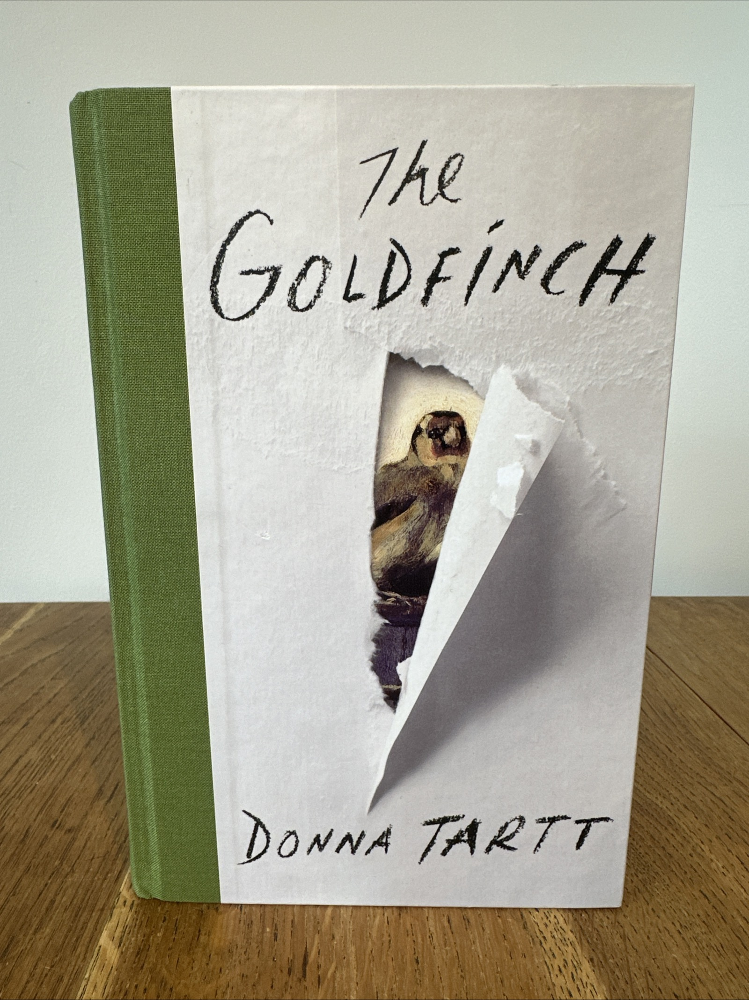

*Figure 4.5A.2 — Limitation page, copy Z: "This is a limited edition Z of A–Z / Signed by the author" with Tartt's signature in blue ink. Photo: Zeitgeist Books / AbeBooks listing 32438850522.*

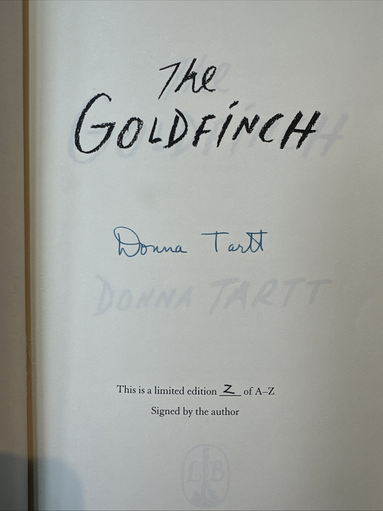

*Figure 4.5A.3 — Spine detail: green cloth with gilt lettering. Photo: Zeitgeist Books / AbeBooks listing 32438850522.*

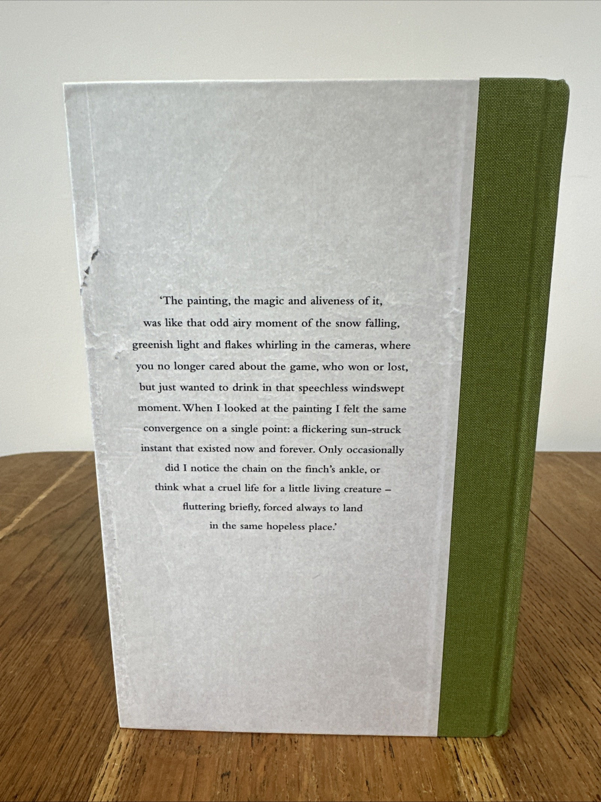

*Figure 4.5A.4 — Rear board: passage from the novel in the torn-paper pictorial style. Photo: Zeitgeist Books / AbeBooks listing 32438850522.*

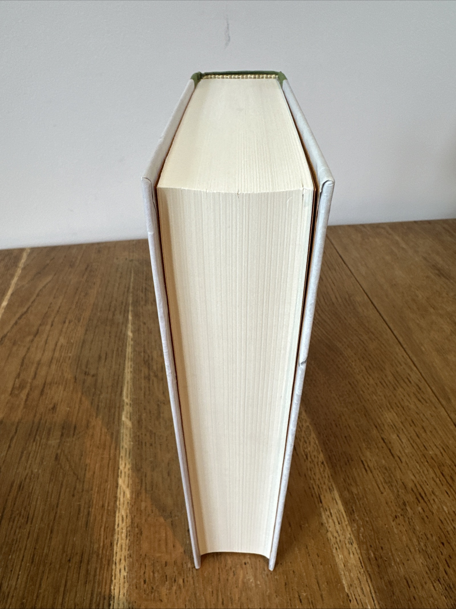

*Figure 4.5A.5 — Copyright page: states "Hardback ISBN: 978-1-4087-0494-3" (the standard UK hardback ISBN); identical to the trade first edition copyright page. Photo: Zeitgeist Books / AbeBooks listing 32438850522.*

*Figure 4.5A.6 — Bespoke publisher's slipcase housing copy Z. Photo: Zeitgeist Books / AbeBooks listing 32438850522.*

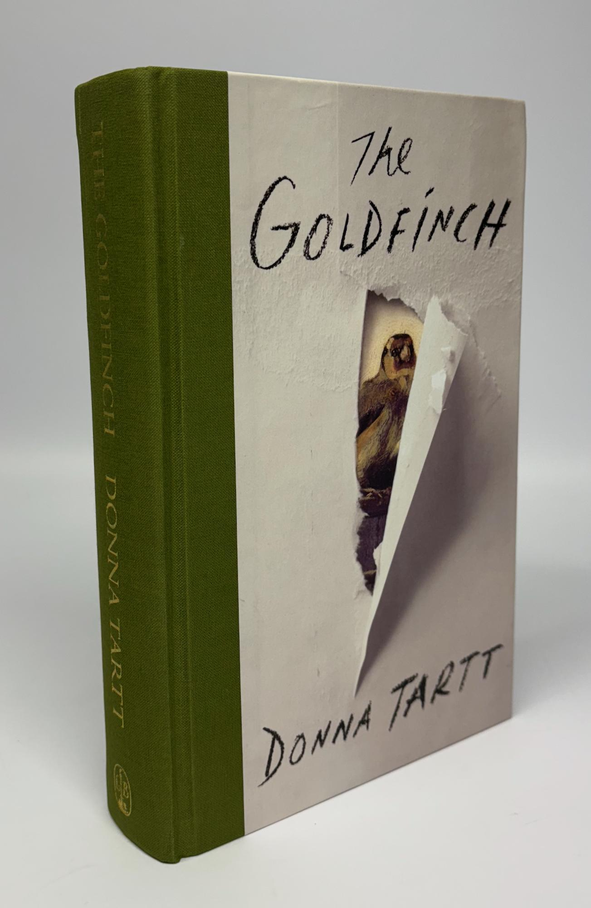

*Figure 4.5A.7 — Copy J of A–Z (Cleveland Book Company, ABAA). Front boards: pictorial illustrated panels, green cloth-backed spine. Photo: AbeBooks listing 31916702293.*

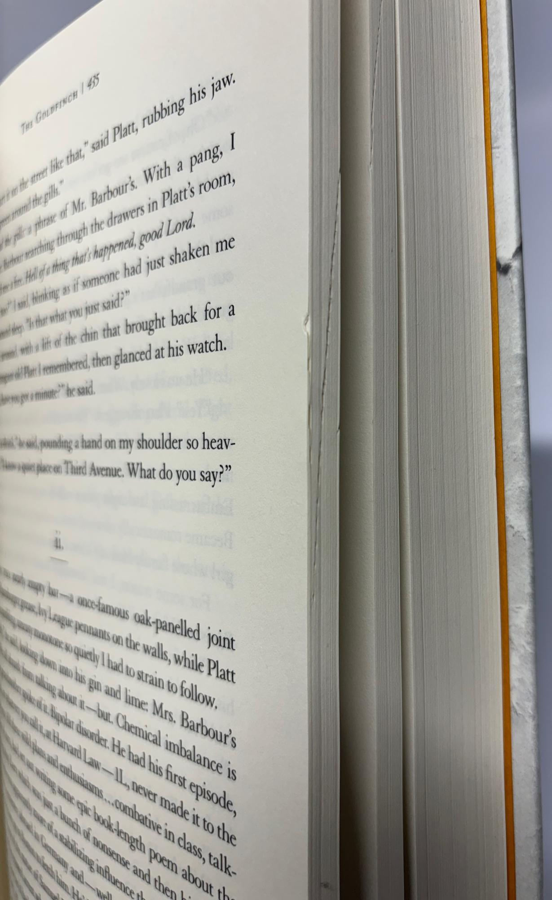

*Figure 4.5A.8 — Copy J: limitation page. Second lettered copy documented, confirming the A–Z programme across multiple copies. Photo: AbeBooks listing 31916702293.*

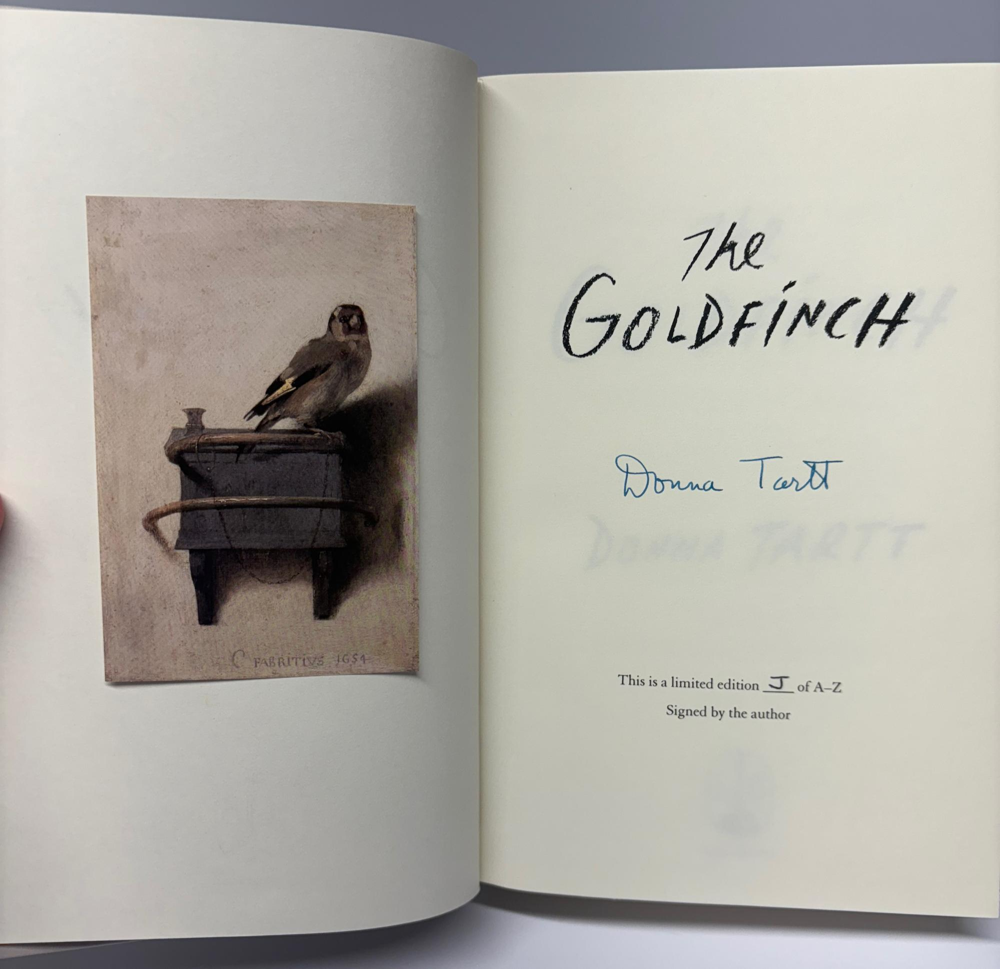

*Figure 4.5A.9 — Copy J: additional view. Photo: AbeBooks listing 31916702293.*

  - Publisher: Little, Brown, London, October 2013
  - Copyright-page ISBN: 9781408704943 (standard UK hardback ISBN, copyright page identical to trade edition)
  - Dealer catalogue ISBN: 9781408705100 (ISBN-10: 1408705109; shared with the 1,000-copy numbered Deluxe §4.5)
  - Limitation: 26 copies, lettered A–Z; each signed by Tartt in blue ink at bound-in limitation page
  - Binding: pictorial illustrated boards, green cloth-backed spine, gilt lettering on spine — issued without dust jacket
  - Tipped-in colour frontispiece reproducing Fabritius's painting
  - Orange endpapers (confirmed from photographs)
  - Housed in bespoke publisher's slipcase

**Collector significance:** At 26 copies, this is the smallest Tartt publisher-issued signed limited edition documented — 38.5× scarcer than the 1,000-copy numbered Deluxe (§4.5). The near-total absence of lettered copies from public commerce indicates most are in permanent private collections. **WorldCat:** No OCLC record found; shares dealer catalog ISBN 9781408705100 with the numbered Deluxe. No separate Open Library record.

---

**Probable original recipients:**

The lettered A–Z fine-press tradition reserves the 26 copies for the author, publisher, literary agent, and key editorial or commercial principals — these copies are functionally *hors de commerce* presentation copies rather than commercial releases. They are not announced publicly, not sold through booksellers, and not listed in any publisher's catalogue. For The Goldfinch lettered edition, the probable distribution map is:

- **Donna Tartt (author):** conventionally receives multiple copies; the terminal letter (Z) is frequently the author's own copy in UK fine-press practice — copy Z (Zeitgeist Books) is the most likely Tartt personal copy to have been released into commerce
- **Gill Coleridge, Rogers Coleridge & White (RCW Literary Agency)**, Notting Hill, London — Tartt's confirmed UK literary agent (rcwlitagency.com). As the UK deal negotiator, Coleridge would conventionally receive at least one lettered copy; RCW was established by Deborah Rogers in 1967 and is one of the foremost London literary agencies
- **Little, Brown / Hachette UK editorial leadership** — the commissioning editor and/or publisher at Little, Brown UK would conventionally receive lettered copies. Little, Brown is an imprint of Hachette UK, 100 Victoria Embankment, London EC4Y 0DY
- **Key Hachette UK sales, marketing, and publicity principals** — additional copies would customarily go to the senior team who managed the UK launch (October 22, 2013)
- **Key UK booksellers:** Goldsboro Books was a principal distributor and promoter of the numbered Deluxe (§4.5) and may have received a lettered copy; the dealer who commissioned the numbered Deluxe programme is a likely lettered-copy recipient
- **International rights representatives and foreign co-publishers:** A–Z series allocation sometimes includes key foreign rights personnel

The two copies that have entered open commerce (J at Cleveland Book Company, ABAA; Z at Zeitgeist Books, Middlesex) arrived through the secondary market without documented direct provenance from their original recipients. Cleveland Book Company's note that the copy J mylar cover "we suspect was supplied later" indicates at least one intermediate owner before professional cataloguing. Neither seller provided provenance details in their listings. It is not possible to determine from currently available evidence which letter was originally assigned to which recipient.

**Seller details:**
- Zeitgeist Books (copy Z) — 192 Marsh Lane, Henstridge, BA8 0TG, United Kingdom; AbeBooks seller since February 1, 2010; inventory # 013193. Zeitgeist specialises in signed first editions and also holds the numbered Deluxe copy (inventory # 012944) as well as *The Little Friend* UK Bloomsbury Deluxe slipcased limited (350 copies, inventory # 005929).
- Cleveland Book Company, ABAA (copy J) — Rocky River, OH, U.S.A.; AbeBooks seller since January 2, 2017; inventory # 12175.

---

**Coverage of remaining letters:** Of the 26 lettered copies, 24 (all letters except J and Z) remain untraced in any publicly accessible record. A systematic survey across AbeBooks, IberLibro, ZVAB, Biblio, eBay (active and sold), Sotheby's Buy Now Marketplace, Reddit collector communities, The Bookseller archive, Hachette UK / Little Brown, RCW Literary Agency, fedpo.com, and WorldCat / OCLC returned no additional lettered copies and no forum or bibliographic discussion of the lettered tier. fedpo.com mentions the numbered Deluxe only (1,000 copies); WorldCat has no record for the lettered tier and shares ISBN 9781408705100 with the numbered Deluxe.

### 4.6 Powell's Indiespensable signed (Volume 43, 2013)

**Cover:** `assets/images/rId50.jpg` — `TG-007` (Powell's Indiespensable Vol 43 (purple ink, slipcase + chapbook))

, brown publisher's-cloth slipcase with gilt-stamped title and Powell's series device, and the included \"43\" cream paperback chapbook containing the author interview. All copies in this program were signed by Tartt in purple ink on the title page. Photo: J. Michaels Books (T2)")

Figure 4.6 — Powell's Indiespensable Volume 43 complete set: trade hardcover (US Little, Brown 1st/1st with the signature torn-paper jacket), brown publisher's-cloth slipcase with gilt-stamped title and Powell's series device, and the included "43" cream paperback chapbook containing the author interview. All copies in this program were signed by Tartt in purple ink on the title page. Photo: J. Michaels Books (T2)

*Figure 4.6 — Powell's Indiespensable Volume 43 complete set: trade hardcover (US Little, Brown 1st/1st with the signature torn-paper jacket), brown publisher's-cloth slipcase with gilt-stamped title and Powell's series device, and the included "43" cream paperback chapbook containing the author interview. All copies in this program were signed by Tartt in purple ink on the title page. Photo: J. Michaels Books (T2)*

  - A limited issue produced for Powell's Books "Indiespensable" subscription program (Volume 43)

  - All copies are first edition / first printing (US Little, Brown trade) reissued with a custom slipcase and accompanying chapbook

  - All copies signed by Tartt in purple ink on the title page

  - Slipcase: brown publisher's cloth, gilt-stamped

  - Includes a chapbook containing an interview with the author

**WorldCat:** No separate OCLC assigned — this is a retailer signing program on the standard US Little, Brown 1st/1st (ISBN-13 9780316055437; WorldCat record covered under §4.1). No standalone library catalog record exists for the Powell's Indiespensable program itself.

### 4.7 Foyles signed first edition (UK)

**Cover:** `assets/images/rId74.jpg` — `TG-008` (Foyles signed first edition (copper ink, red sticker))

, UK 1st/1st with red Foyles ‘Signed First Edition’ sticker; Tartt signed in copper-coloured ink on the title page. Photo: AbeBooks dealer listing.")

Fig. 4.7 — Foyles Signed First Edition of The Goldfinch (2013), UK 1st/1st with red Foyles ‘Signed First Edition’ sticker; Tartt signed in copper-coloured ink on the title page. Photo: AbeBooks dealer listing.

  - Trade Little, Brown UK first edition with a red Foyles "SIGNED FIRST EDITION" sticker on the front of the dust jacket

  - Signed by Tartt in copper-coloured ink directly on the title page

  - Issued through Foyles's London signed-edition program, 2013

**WorldCat:** No separate OCLC assigned — this is a retailer signing program on the standard UK Little, Brown 1st/1st hardcover. No standalone library catalog record exists for the Foyles signed program itself.

### 4.8 Waterstones signed (10th anniversary, 2023)

**Cover:** `assets/images/TG-UK-10ANN-cover_ebay.jpg` — `TG-009` (Waterstones 10th Anniversary signed 2023)

A signed Waterstones-exclusive 10th-anniversary edition was issued in 2023 (see below). No evidence of a Waterstones-exclusive signed The Goldfinch first edition in 2013 has been found; a survey of ABAA dealer infrastructure, AbeBooks, Waterstones historical product pages, and retailer-programme records returned none. The five The Goldfinch retail programmes confirmed for 2013 are: Powell’s Indiespensable (§4.6), Foyles (§4.7), Barnes & Noble (§4.10), Parnassus First Editions Club (§10.7), and standard signed firsts from Tartt’s documented 2013 tour events. Waterstones distributed the standard UK Little Brown first edition in 2013 without a dedicated in-store signing programme.

### 4.10 Barnes & Noble Signed First Edition

**Cover:** `assets/images/rId75.jpg` — `TG-010` (Barnes & Noble Signed First Edition)

; Tartt signed below the facsimile bird bookplate tipped in to the second free endpaper. Photo: AbeBooks dealer listing.")

Fig. 4.10 — Barnes & Noble Signed First Edition of The Goldfinch (2013); Tartt signed below the facsimile bird bookplate tipped in to the second free endpaper. Photo: AbeBooks dealer listing.

A Barnes & Noble Signed First Edition of The Goldfinch exists. Description:

  - ISBN — uses the trade ISBN-13 9780316055437 / ISBN-10 0316055433. NO separate ISBN was assigned to the B\&N program; the underlying book is the standard Little, Brown first edition / first printing.

  - Underlying book — Little, Brown first edition / first printing with the complete number line 10 9 8 7 6 5 4 3 2 1; "First Edition: October 2013" stated on copyright page; first-state dust jacket WITHOUT any Pulitzer reference.

  - Signature placement — variant A: signed on a bookplate tipped in to the half-title page (signature only, no inscription). Variant B: signed in brown ink on the page immediately preceding the half-title, below an interior printed image of the goldfinch.

  - Dust jacket — first-state DJ (no Pulitzer blurb). Some B\&N copies bear a circular "Signed Copy" sticker on the front of the DJ; some also bear a "Winner of the Pulitzer Prize" sticker added post-April 2014.

  - Authentication — verify a B\&N bookplate copy by inspecting the bookplate itself: it should be tipped in (lightly glued at the top edge), printed on heavier paper than the text leaves, with the signature appearing to be in true ink (not photographic / laser-printed). A bookplate that is photocopied or laser-printed onto the half-title is a fake.

**WorldCat:** No separate OCLC assigned — this is a retailer signing program on the standard US Little, Brown 1st/1st (ISBN-13 9780316055437; WorldCat record covered under §4.1). No standalone library catalog record exists for the Barnes & Noble Signed First Edition program itself.

### 4.11 10th-anniversary 2023 editions

**Cover:** `assets/images/rId76.jpg` — `TG-011` (US Little Brown 10th Anniversary Deluxe Signed 2023)

, one of 1,000 numbered copies, signed by Tartt. Photo: AbeBooks dealer listing.")

Fig. 4.11 — The Goldfinch UK Deluxe Signed Limited Edition (Abacus/Little, Brown, 2023), one of 1,000 numbered copies, signed by Tartt. Photo: AbeBooks dealer listing.

Two distinct 2023 anniversary editions of The Goldfinch were issued — a US Little Brown Deluxe signed limited and a UK Abacus paperback 10th Anniversary. Both were released contemporaneous with the October 2023 anniversary window.

1) UK Little Brown Book Group / Hachette UK Deluxe Signed Limited Edition (2023) catalogued separately:

<!-- end list -->

  - Title: The Goldfinch: Deluxe Edition
  - Publisher: Little, Brown Book Group Limited (Hachette UK)
  - Date: 2023 (October — 10th anniversary of original 2013 publication)
  - ISBN: 9781408705100
  - Format: deluxe hardcover; specific binding state requires direct query
  - Limitation: 1000 numbered copies signed by Tartt
  - Signing: signed by Tartt at limitation page (per dealer descriptions; ink color requires direct corroboration)
  - Distribution: Little Brown direct + select ABAA dealer + Goldsboro Books (per Goldsboro Tartt author page coverage)

AbeBooks listings for this edition under “Books for Collectors” dealer (signed listing 31689636946) confirm the 1000-copy limitation [21]. Listed at multiple Tier 2 dealers (Books for Collectors, Edwards Rare Books).

2) UK Abacus paperback 10th Anniversary 2023:

<!-- end list -->

  - Title: The Goldfinch — 10th Anniversary Edition
  - Publisher: Abacus (Hachette UK; Little Brown Book Group)
  - Date: 31 October 2023
  - ISBN: 9780349146263
  - Format: paperback; pictorial boards without dust jacket
  - Price: £25.00 list
  - **Saved Asset:** `assets/images/TG-UK-10ANN-cover_ebay.jpg` — Cover of UK Abacus 10th Anniversary signed edition (ISBN 9780349146263, 2023). 617,158 bytes.
  - Limitation: trade paperback (NOT a numbered limited edition); a “very limited” subset was signed by Tartt for distribution through Waterstones (announced via Waterstones X / Twitter post Aug 30 2023) [22]

Distribution: standard Abacus trade paperback with unsigned copies sold through general UK retail; a specific small subset of signed copies was distributed exclusively through Waterstones. Specific signing-subset count and ink color require direct query to Abacus / Hachette UK.

3) The Goldfinch Pulitzer-winner UK trade hardcover continuation (post-Pulitzer reset jackets, 2014-2023) — these are TG trade reprints with the Pulitzer reference embossed on the dust jacket, NOT separate signed editions.

Earlier-documented anniversary states:

  - UK: a 10th-anniversary signed first edition by Abacus (2023) issued in pictorial boards without dust jacket, signed by Tartt

  - US: Little, Brown 10th-anniversary signed first edition, sold with a "Signed Edition Roundel" identifier on the jacket

**WorldCat:** ISBN 9781408705100 → Open Library OL34608056M (publisher: Little, Brown Book Group Limited [UK], 784pp; no OCLC in OL record). ISBN 9781408705100 carries the 978-1-4087 prefix, which is a Hachette UK / Little Brown Book Group (UK) publisher prefix. Open Library OL34608056M confirms this ISBN resolves to the standard UK 1st/1st hardcover (2013, Little, Brown Book Group Limited [UK], 784pp) — NOT a 2023 US Deluxe edition. Item (1) above is labeled accordingly as a UK Little Brown Book Group / Hachette UK edition. If a separate US-published 2023 signed limited exists, its ISBN remains unconfirmed. Goldsboro Books (listed as a distribution channel) is a UK specialist bookseller, consistent with UK origin. ISBN 9780349146263 → Open Library OL48189277M (publisher: Little, Brown Book Group Limited, 2023, 784pp); confirmed as 2023 UK/Abacus edition.

### 4.12 Foreign-language firsts of The Goldfinch

**Covers:**
- **TG-F01** — French Plon - Le Chardonneret: `assets/images/_retrieved/TG-F01-cover-openlibrary.jpg`
- **TG-F02** — German Goldmann HC - Der Distelfink: `assets/images/TG-DE-GOLDMANN14-cover_applebooks.jpg`
- **TG-F03** — Italian Rizzoli HC 1st - Il cardellino: `assets/images/_retrieved/TG-F03-cover-abebooks.jpg`
- **TG-F03b** — Italian BUR 2015 - Il cardellino: `assets/images/_retrieved/TG-F03b-cover-abebooks.jpg`
- **TG-F04** — Spanish Lumen - El jilguero: `assets/images/_retrieved/TG-F04-cover-openlibrary.jpg`
- **TG-F05** — Greek Livanis - Η Καρδερίνα: `assets/images/_retrieved/TG-F05-cover-abebooks.jpg`
- **TG-F06** — Polish Znak - Szczygieł: `assets/images/TG-PL-ZNAK15-cover_goodreads.jpg`
- **TG-F07** — Japanese Kawade vol 1 - ゴールドフィンチ: `assets/images/TG-JP-KAWADE16-vol1-cover_publisher.jpg`
- **TG-F08** — Russian AST/Corpus - Щегол: `assets/images/_retrieved/TG-F08-ast.jpg`
- **TG-F09** — Korean Eunhaeng-namu vol 1 - 황금방울새: `assets/images/TG-KO-EHN15-vol1-cover_publisher.jpg`
- **TG-F10** — Chinese People's Literature - 金翅雀: `assets/images/_retrieved/TG-F10-cover-wikipedia.jpg`
- **TG-F11** — Portuguese BR Companhia das Letras - O pintassilgo: `assets/images/_retrieved/TG-F11-cover-openlibrary.jpg`
- **TG-F11b** — Portuguese (PT) Editorial Presença - O Pintassilgo: `assets/images/TG-PT-PT-PRESENCA14-cover_goodreads.jpg`
- **TG-F12** — Czech Argo - Stehlík: `assets/images/TG-CS-ARGO15-cover_ebay.jpg`
- **TG-F13** — Hungarian Park - Az Aranypinty: `assets/images/_retrieved/TG-F13-publisher.jpg`
- **TG-F14** — Romanian Litera - Sticletele: `assets/images/TG-RO-LITERA14-cover_goodreads.jpg`
- **TG-F15** — Swedish Albert Bonniers - Steglitsan: `assets/images/_retrieved/TG-F15-bokborsen.jpg`
- **TG-F16** — Norwegian Cappelen Damm - Stillitsen: `assets/images/TG-NO-CAPPELEN14-cover_goodreads.jpg`
- **TG-F17** — Turkish Doğan Kitap - Saka Kuşu: `assets/images/_retrieved/TG-F17-pegasus.jpg`
- **TG-F18** — Hebrew Modan - הציפור החולמנית: `assets/images/_retrieved/TG-F18-wikipedia.jpg`
- **TG-F19** — Arabic - العصفور الذهبي: *[cover image pending]*
- **TG-F20** — Thai - นกโกลด์ฟินช์: *[cover image pending]*

Eleven foreign firsts have credentialed first-edition records. The Dutch first is the chronological true first.

| | | | | | |
| ----------------------- | ----------------------------------- | ---------------------------------------------- | ------------------------------------------ | -------------------------------------------------------------- | ---------------------------------------------------- |
| **Country / lang** | **Title** | **Publisher** | **Date** | **Translator** | **ISBN** |
| NL / Dutch (true first) | Het puttertje | De Bezige Bij (Amsterdam) | October 2, 2013 (twenty days before US/UK) | Arjaan van Nimwegen, Paul van der Lecq, Sjaak de Jong | 9789023485032 (pbk, 928 pp) |
| FR / French | Le Chardonneret | Plon (Feux croisés, Paris) | 2014 | Édith Soonckindt | 9782259221863 (broché, 795 pp) |
| DE / German | Der Distelfink | Goldmann (Munich) | March 10, 2014 | Rainer Schmidt + Kristian Lutze | 9783442312399 (hc) |
| IT / Italian | Il cardellino | Rizzoli (Milan) | March 12, 2014 | Mirko Zilahi De' Gyurgyokai | 9788817072380 (1st hc); 9788817081580 (2015 BUR pbk) |
| ES / Spanish | El jilguero | Lumen (Barcelona) | 2014 | Aurora Echevarría Pérez | 9788426422439 |
| EL / Greek | Η Καρδερίνα | Λιβάνης (Livanis) | 2014 | Χριστιάννα Ε. Σακελλαροπούλου (Christianna E. Sakellaropoulou) | 9789601428062 (992 pp) |
| PL / Polish | Szczygieł | Wydawnictwo Znak (Kraków) | May 2015 | Jerzy Kozłowski | 9788324026524 |
| JP / Japanese | ゴールドフィンチ (Gōrudofinchi, 4 vols) | 河出書房新社 (Kawade Shobo Shinsha) | June 25/28, 2016 | 岡真知子 (Oka Machiko) | 9784309207070 (vol 1); 9784309862781 (set ref) |
| RU / Russian | Щегол | Иностранка / AST Corpus (Moscow) | 2014/2015 | Анастасия Завозова (Anastasiya Zavozova) | 9785170854486 |
| KO / Korean | 황금방울새 (Hwanggeum Bangulsae, 2 vols) | 은행나무 (Eunhaeng-namu) | June 23, 2015 | 허진 (Heo Jin / Hur Jin) | 9788956608778 (vol 1) |
| ZH / Chinese | 金翅雀 (Jīnchìquè) | 人民文学出版社 (People's Literature Publishing House) | January 2016 | 李天奇 (Li Tianqi) + 唐江 (Tang Jiang) | 9787020141432 |
| PT / Portuguese (Brazil) | O pintassilgo | Companhia das Letras (São Paulo) | 14 Aug 2014 | Sara Grünhagen | 9788535924688; 728 pp |
| PT / Portuguese (Portugal) | O Pintassilgo | Editorial Presença (Lisbon) | 2014 | Unverified | 9789722353663 |
| CS / Czech | Stehlík | Argo (Prague) | 2015 | David Petrů | ISBN-10: 8025716031 / ISBN-13: 9788025716038 (translator David Petrů confirmed) |
| HU / Hungarian | Az Aranypinty | Park Könyvkiadó (Budapest) | 2014 | Kada Júlia (Trans.) | 9789636332761 / 9789633551263 (discrepancy between ledgers) |
| RO / Romanian | Sticletele | Litera (Bucharest) | 2014/2018; reissued 2021, 2024 | Unverified | 9786063332654 / 9786067412044 (discrepancy between ledgers) |
| SV / Swedish | Steglitsan | Albert Bonniers Förlag (Stockholm) | 2014 | Unverified | 9789100136872 |
| NO / Norwegian | Stillitsen | Cappelen Damm (Oslo) | 2014 | Unverified | 9788202437121 |
| TR / Turkish | Saka Kuşu | Doğan Kitap (Istanbul) | 2014 | Püren Özgören (verify) | 9786050921500 |
| HE / Hebrew | הציפור החולמנית | Modan / Kinneret Zmora-Bitan (Tel Aviv) | 2015 | Unverified | Danacode 10-395812 |
| AR / Arabic | العصفور الذهبي | Dar Al-Saqqā / Dar Athar (verify) | 2014/2015 | Unverified | Unverified |
| TH / Thai | นกโกลด์ฟินช์ | Resonance/Earnestly (verify) | 2018 | Unverified | Unverified |

**Saved Assets (§4.12):**
- `assets/images/TG-CS-ARGO15-cover_ebay.jpg` — Cover of Czech TG first edition *Stehlík* (Argo, Prague, 2015; translator David Petrů; ISBN 9788025716038). 234,827 bytes.

Translator continuity notes: 허진 (Hur Jin) translated both Tartt's TLF (作은 친구들, Eunhaeng-namu, 2017) and TG (황금방울새, Eunhaeng-namu, 2015) into Korean — same translator + same publisher. Anastasiya Zavozova translated both TLF and TG into Russian for AST/Corpus. Rainer Schmidt translated both TLF (alone) and TG (with Kristian Lutze) into German for Goldmann. The same continuity-of-translator applies to French (Anne Rabinovitch for TLF; Édith Soonckindt for TG — different translators, same publisher Plon).

Pattern: De Bezige Bij has twice published Tartt's English-language work in Dutch translation BEFORE the English-language first edition (TLF: Sept 15, 2002; TG: Oct 2, 2013). For a collector building a complete Tartt set, the De Bezige Bij firsts of TLF and TG are the chronological true firsts of those novels and have a status quite distinct from later foreign editions that follow the English firsts.

### 4.13 Audiobook editions

**Cover:** `assets/images/rId47.jpg` *(shares cover with print edition)* — `TG-012` (TG unabridged audiobook (David Pittu))

The unabridged audiobook of The Goldfinch (Hachette Audio / Audible, 2013) is read by David Pittu. Tartt did not narrate.

### 4.15 TG large-print edition

**Cover:** `assets/images/TG-US-LB13-LP-cover_openlibrary.jpg` — `TG-013` (TG large-print edition 2013)

Large-print edition of TG confirmed via library catalog records. Publisher: Little, Brown and Company (NOT Random House Large Print — published directly by the trade publisher). ISBN: 9780316239875 / 0316239879. Publication date: October 22, 2013 — simultaneous with the trade hardcover first edition. Pages: 1240 (Nashville Public Library catalog) or 1248 (McNally Jackson bookseller listing); the discrepancy likely reflects different bindings or counting methods; 1240 is the library-system standard figure. OCLC: 854894176. Edition statement: "Large print edition. First edition." ISBN and publication date confirmed via library catalog records (Nashville Public Library CARL0000419188; Open Library OL26917978M; McNally Jackson bookseller listing).

**WorldCat:** [OCLC 854894176](https://www.worldcat.org/oclc/854894176) — Open Library OL26917978M.

### 4.16 TG e-book editions

**Covers:**
- **TG-016** — TG US Kindle (B00BAXFECK): `assets/images/rId47.jpg` *(shares cover with print edition)*
- **TG-017** — TG UK Kindle (B00C74SHRK): `assets/images/TG-UK-LB13-signed-cover_ebay.jpg` *(shares cover with print edition)*

TG US Kindle: ASIN B00BAXFECK [25], released October 22, 2013 — same day as the print first edition. UK Kindle ASIN B00C74SHRK [26], same release date.

Het puttertje e-book (De Bezige Bij): released September 22, 2013 — the chronological true first of TG in any format, twenty days before the English-language hardcover and Kindle releases (already documented in §4.1).

The Het puttertje e-book is therefore the earliest digital edition of TG in any language; the Het puttertje paperback (October 2, 2013) is the earliest print edition; the US/UK Little Brown hardcovers and Kindle editions (October 22, 2013) are the simultaneous English-language firsts.

### 4.14 2019 film tie-in editions

**Covers:**
- **TG-014** — TG UK Abacus film tie-in 2019: `assets/images/_retrieved/TG-014-cover-abebooks.jpg`
- **TG-015** — TG US Little Brown film tie-in 2019: `assets/images/rId47.jpg` *(shares cover with print edition)*

John Crowley's 2019 film adaptation of The Goldfinch (Warner Bros / Amazon Studios, starring Ansel Elgort, Sarah Paulson, Jeffrey Wright, Luke Wilson) triggered tie-in paperback editions in both the US and UK. Per Page Six (Emily Smith and Ian Mohr, November 16, 2017), Tartt left Amanda "Binky" Urban — her ICM agent of three decades — in November 2017, during the Amazon-Warner $40M co-finance deal. The film rights had been sold to Warner Bros. in 2014 for $3 million; Tartt was unhappy that she had not been given the chance to write the screenplay or named as a producer. She moved to Nicole Aragi at Aragi Inc. (an agency whose other clients include Edwidge Danticat, Junot Díaz, Jonathan Safran Foer, and Colson Whitehead). ICM's official statement: "Tartt and Urban remain friends and the separation was amicable."

Ratner was an executive producer on the film; he was removed during pre-production amid an unrelated harassment scandal (Page Six). The screenplay was written by Peter Straughan (who had previously adapted Wolf Hall for PBS).

  - UK tie-in paperback: Abacus (Little, Brown UK), 2019, ISBN 9780349141602 — film-poster cover (yellow background, Ansel Elgort holding the painting).

  - US tie-in paperback: Little, Brown trade paperback, 2019 — same film-poster cover.

  - Differential: tie-ins are NOT first editions and have minimal collector value; they are reading copies with film-poster art.

## 4A. Comprehensive audiobook inventory across all three novels

Format/runtime/narrator/ISBN detail for the audiobook editions of all three novels.

| | | | | | | |
| ----------------------------------- | ------------------------------- | ----------------------------------------- | ---------------- | ---------------------------------------------------------------------------------------------------------------------- | ------------------------------- | ----------------------------------------------------------------------------------------------------------------------------- |
| **Work** | **Edition** | **Publisher** | **Year** | **Narrator(s)** | **ISBN** | **Notes** |
| The Secret History | Cassette (UK) | Penguin Audiobooks | 1993 | Donna Tartt (extracts) | 9780140860269 | Confirmed early commercial audio release; abridged. Tartt-narrated extracts confirmed via Penguin Books UK SoundCloud archive |
| The Secret History | Modern unabridged | Random House Audio (Penguin Random House) | 2023 reissue | Donna Tartt | B0C6FLWX5X (ASIN) | Audible / digital — Tartt narrates |
| The Secret History | Spanish-language | Penguin Random House Audio | — | Cesar Ramones | B0DRDNLK3T (ASIN) | Translation by Gemma Rovira Ortega |
| The Little Friend | Abridged audio CD | Random House Audio | 2002 | DONNA TARTT | — | Tartt-narrated; the canonical Tartt-narrated recording of her own fiction |
| The Little Friend | Unabridged digital | Random House Audio (later) | post-2002 | Karen White | — | Standard reading edition |
| The Goldfinch | Audio CD (unabridged) | Hachette Audio | October 22, 2013 | David Pittu | 9781600247118 (19 CDs, $45) | Two Audie Awards for narration |
| The Goldfinch | Audiobook download (unabridged) | Hachette Audio | October 22, 2013 | David Pittu | 9781600247125 | 32 hours 24 minutes |
| The Goldfinch | Spanish-language audio | Penguin Random House Audio | — | Diego Rousselon | B09GWBGFVT | Translator Aurora Echevarría Pérez |
| True Grit (Charles Portis) | Unabridged audio | Recorded Books LLC | June 7, 2006 | DONNA TARTT (+ Tartt afterword essay) | 9781428193772 | 6h 17m. The Tartt-narrated audiobook program. |
| Winesburg, Ohio (Sherwood Anderson) | Multi-voice audio | HarperAudio | November 11, 2003 | Donna Tartt is one of multiple narrators (with Richard Ford, Paul Auster, Russell Banks, Daniel Halpern, Tobias Wolff) | 9780060010256 (audiobook ISBN confirmed via OverDrive) | Tartt reads at least one story in the cycle |

Tartt-narrated record (combining all confirmed entries): she narrates the abridged 2002 Little Friend (Random House Audio); the 2023 unabridged Secret History reissue (Random House Audio); extracts of the 1993 Secret History cassette; the 2006 Recorded Books True Grit (Charles Portis); and at least one story in the multi-voice Winesburg, Ohio (HarperAudio). The 2006 True Grit audiobook also contains her essay on the novel as an afterword.

Format note: original Random House Audio CDs of The Little Friend (2002, abridged, narrated by Tartt) are the only Tartt-narrated commercial recording of one of her own complete novels. The Hachette Audio CD set of The Goldfinch comprises 19 CDs in a publisher box.
## 5. Short fiction

### 5.1 "Sleepytown: A Southern Gothic Childhood, with Codeine"

**Cover:** `assets/images/magazines/HARPERS-1992-07-cover.gif` — `MAG-001` (Harper's July 1992 - Sleepytown)

  - Venue: Harper's Magazine, vol. 285, no. 1706, July 1992, pp. 60–66
  - Harper's TOC classification: [Article]; subtitle: "A Southern gothic childhood, with codeine." URL: https://harpers.org/archive/1992/07/sleepytown/
  - Full text is reproduced at languageisavirus.com — https://www.languageisavirus.com/donna-tartt/short-fiction-sleepytown.php — a third-party fan site whose text reflects the original publication. Genre: short memoir/fiction.

*Fig. 5.1 — Harper's Magazine, vol. 285, July 1992 — contains Tartt's "Sleepytown: A Southern Gothic Childhood, with Codeine," pp. 60–66.*
  - **Genre note:** Although catalogued in this section under "Short Fiction" for historical continuity (and despite its reprinting in a fiction anthology), "Sleepytown" is an autobiographical memoir — Tartt's account of her own Southern childhood. The Harper's magazine header identifies it as a personal essay/memoir. Its placement in §5 reflects its original magazine context alongside other short-form Tartt pieces.
  - Republished (and renamed) in *Cowboys, Indians and Commuters: The Penguin Book of New American Voices*, ed. Jay McInerney (Penguin, 1994)

**Canonical URL:** https://harpers.org/archive/1992/07/sleepytown/ (Harper's digital archive; subscriber-only PDF)
**Text status:** Harper's digital subscription required for the original; full text reproduced at languageisavirus.com.
**Cover image:** assets/images/magazines/HARPERS-1992-07-cover.gif (Fig. 5.1 — Harper's Magazine, July 1992)

### 5.2 "Tam-O'-Shanter"

**Cover:** `assets/images/magazines/NEWYORKER-1993-04-cover.jpg` — `MAG-002` (The New Yorker April 1993 - Tam-O'-Shanter)

 of Tam-O'-Shanter by Donna Tartt. Letterpress-printed at Stinehour Press, Vermont. One of 250 signed copies (200 for sale). Photo: Vandello Books (IOBA, T2) / Biblio")

*Figure 5.2 — Lenox Hill Bookstore signed limited chapbook (2004) of Tam-O'-Shanter by Donna Tartt. Letterpress-printed at Stinehour Press, Vermont. One of 250 signed copies (200 for sale). Photo: Vandello Books (IOBA, T2) / Biblio*

  - First publication: The New Yorker, April 19, 1993, pp. 90–95
  - The New Yorker article URL: https://www.newyorker.com/magazine/1993/04/19/tam-o-shanter (accessible to subscribers). TNY's TOC labels it [Fiction]. Cover of the April 19, 1993 issue: "Biting the Bullet" by George Booth. The story concerns Gordon, an elderly former British child actor (once "Geordie MacTavish the Highland Lad"), visiting a nine-year-old leukemia patient in a children's hospital in San Diego. Opening sentence: "The Children's Hospital was cheery enough, thought Gordon—as far as hospitals went." Tagged: Actors, Old Age. Full text is reproduced at languageisavirus.com — https://www.languageisavirus.com/donna-tartt/short-fiction-tam-o-shanter.php — a third-party fan site whose text reflects the original publication.

Lenox Hill Bookstore signed limited chapbook (2004): issued in 2004 as part of a 5-chapbook series letterpress-printed by Stinehour Press in Vermont for Lenox Hill Bookstore in New York. Each title in a numbered limitation of 250 copies signed by the author (200 for sale; 50 hors-commerce). Companions in the same series:

  - Colum McCann — Hunger Strike

  - Jennifer Egan — You (Plural)

  - Lynne Tillman — The Substitute

  - Aleksandar Hemon — The Drawer

**Canonical URL:** https://www.newyorker.com/magazine/1993/04/19/tam-o-shanter (The New Yorker, Apr 19, 1993; paywalled). Lenox Hill chapbook (2004): print only.
**Text status:** TNY subscription required for the full story; full text reproduced at languageisavirus.com.
**Cover image:** assets/images/rId60.jpg (Fig. 5.2 — Lenox Hill chapbook 2004; Vandello Books/Biblio photo)

**Foreign-language appearance:** German translation as **"Schottenmütze"** in *Sommer, Sonne, Sand und mehr: Das große Ferien-Lesebuch III*, ed. Georg Reuchlein (Goldmann Verlag, Munich, 1995; ISBN 9783442429455), pp. 96–101. See §5.7 for full bibliographic detail.

### 5.3 "A Christmas Pageant"

**Covers:**
- **MAG-003** — Harper's December 1993 - A Christmas Pageant: `assets/images/magazines/HARPERS-1993-12-cover.gif`
- **MAG-007** — Penguin 60s - A Christmas Pageant reprint: `assets/images/_retrieved/MAG-007-cover-abebooks.jpg`

  - Harper's Magazine, vol. 287, no. 1723, December 1993, pp. 45–51
  - Harper's TOC classification: [Fiction]. This places "A Christmas Pageant" as a short story, not a personal essay. URL: https://harpers.org/archive/1993/12/a-christmas-pageant/
  - Harper's article is subscriber-only PDF. Full text is also reproduced at languageisavirus.com — https://www.languageisavirus.com/donna-tartt/short-fiction-a-christmas-pageant.php (third-party reproduction).
  - Penguin 60s standalone reprint: A Christmas Pageant (Penguin Books, London, 1995; ISBN-10: 0-14-025298-3 / ISBN-13: 978-0-14-025298-9). 32 pp. small-format paperback. Tartt's contribution to Penguin's 1995 60th-anniversary mini-book series; issued individually and also available in a twelve-volume "A Collection of Stories" boxed set with orange-and-black checkered spines (ISBN 978-0-14-095149-3; co-contributors include Boyd, Coe, Nabokov, Spark, and Updike). Condition note: the small Penguin 60s pamphlets are fragile and prone to spine-fading and creasing; very fine copies are scarce. No signed copies recorded.

*Fig. 5.3 — Harper's Magazine, vol. 287, December 1993 — contains Tartt's "A Christmas Pageant" (classified [Fiction] in the TOC, pp. 45–51). The Penguin 60s reprint (1995, ISBN 978-0-14-025298-9) is a standalone collectible.*

**Canonical URL:** https://harpers.org/archive/1993/12/a-christmas-pageant/ (Harper's digital archive; paywalled). Penguin 60s pamphlet: print only (ISBN 978-0-14-025298-9).
**Text status:** Harper's subscription required; Penguin 60s edition print-only.
**Observer note:** Gale OneFile: News indexes a 71-word brief item titled "Stories for Christmas: A Christmas pageant - Donna Tartt" in The Observer (London), Dec. 19, 1993; at 71 words this is a biographical blurb in a holiday reading feature, not a reprint of the story. The primary publication venue remains Harper's Magazine, December 1993.
**Cover image:** assets/images/magazines/HARPERS-1993-12-cover.gif (Fig. 5.3 — Harper's Magazine, December 1993)

**Anthology reprint:** "A Christmas Pageant" was reprinted in *A Very Southern Christmas: Holiday Stories from the South's Best Writers*, eds. Charline R. McCord & Judy H. Tucker (Algonquin Books of Chapel Hill, October 2003; ISBN 9781565123830 / 1565123832; xv + 214 pp; LCCN 2003050246). The Algonquin publisher description identifies Tartt's contribution as "a story of a children's Christmas pageant that goes awry" — a direct match for the Harper's December 1993 piece. Other contributors to the 10-story anthology: Robert Olen Butler, Richard Ford, Fred Chappell, Tim Gautreaux, Lee Smith, Julia Ridley Smith, plus preface by Barry Hannah and watercolor paintings by Wyatt Waters. Cover image saved: `assets/images/TARTT-CONTRIB-VerySouthernChristmas-Algonquin-2003_cover_openlibrary.jpg`. This is the second anthology reprint of "A Christmas Pageant" after the 1995 Penguin 60s standalone (above).

### 5.4 "A Garter Snake"

**Cover:** `assets/images/magazines/GQ-1995-05-cover.jpg` — `MAG-004` (GQ May 1995 - A Garter Snake)

  - Cover: Mel Gibson. Source: GQ's own "GQ Covers: The 1990s" gallery (gq.com/gallery/gq-covers-1990s, slide 65/120: "May 1995: Mel Gibson"); also recorded at coverbrowser.com/covers/gq (entry #373).
  - Cover image archived locally: assets/images/magazines/GQ-1995-05-cover.jpg (420×564px, sourced from coverbrowser.com/image/gq/373-1.jpg)
  - Nature of piece: short prose piece, classified as short fiction. Relatively obscure in the Tartt bibliography.

  - GQ, vol. 65, no. 5, May 1995 (US edition)

**Canonical URL:** Print only — GQ, vol. 65, no. 5, May 1995 (US edition); no confirmed online archive
**Text status:** Full text reproduced at languageisavirus.com — https://www.languageisavirus.com/donna-tartt/short-fiction-a-garter-snake.php — a third-party fan site whose text reflects the original publication. Genre: short fiction. Original: GQ, May 1995.
**Cover image:** assets/images/magazines/GQ-1995-05-cover.jpg (Mel Gibson cover; sourced from coverbrowser.com #373)

### 5.5 "The Ambush"

**Cover:** *[no standalone cover — see source publication]* — `MAG-005` (Guardian Weekend June 25 2005 - The Ambush)

Venue: The Guardian Weekend (Saturday magazine supplement), Saturday, June 25, 2005. Pages 17–19 and 21 of the Weekend supplement (Guardian Weekend, format 246×292mm). Page 20 not confirmed (likely a full-page illustration or advertisement between pp. 19 and 21).

  - Guardian_2005-06-25_TheAmbush_p17.pdf
  - Guardian_2005-06-25_TheAmbush_p18.pdf
  - Guardian_2005-06-25_TheAmbush_p19.pdf
  - Guardian_2005-06-25_TheAmbush_p21.pdf

Full bibliographic detail: The Guardian (London, Greater London, England), Saturday, June 25, 2005. Section: Guardian Weekend supplement. Title: "THE AMBUSH / BY DONNA TARTT" (as printed). Story runs pp. 17–21 of the Weekend magazine.

Content: First-person short story. Narrator: Evie. Opening line: "Before I met Tim — who, in spite of everything I'm about to tell you, would be my best friend for the next four or five years — my mother warned me on the way over to his grandmother's house that I had to be nice to him." Tim Kendrick, age 7 (narrator Evie is 8); Tim's father was killed in Vietnam. The story is set in a suburban neighbourhood and centres on the children's elaborate war games (playing Vietnam), Tim's mother Mrs. Cameron, Mrs. Cameron's absent daughter-in-law Rose, and culminates with Mrs. Cameron falling down the porch stairs in a domestic accident during one of the children's game episodes, ending with Evie running from the scene in panic. Genre: contemporary literary short fiction.

Reprinted in: The Best American Short Stories 2006, edited by Ann Patchett (guest editor), Katrina Kenison (series editor). Publisher: Houghton Mifflin, October 2006. ISBN: 978-0-618-54538-8 (hardcover). This is the most accessible anthology source.

Collector significance: The Guardian Weekend, June 25, 2005 is an original periodical appearance (the story also appeared in *Tin House*, Vol. 7 No. 2, 2006, and was reprinted in *The Best American Short Stories 2006*); four pages of the Weekend supplement (pp. 17–19, 21). Guardian Weekend back issues are scarce. The Best American Short Stories 2006 (Houghton Mifflin, 2006) is the best anthology source and more readily available.

A piece titled "Canis Major" is sometimes attributed to Tartt as a short story in The Oxford American, but no primary or secondary evidence supports this; the Oxford American's own author page lists no such title, and the attribution should be disregarded.

**Canonical URL:** Print only — Guardian Weekend, June 25, 2005 (pp. 17–19, 21); primary scans in assets/articles/. Anthology: BASS 2006 (ISBN 978-0-618-54538-8).
**Text status:** Print only — no Guardian online archive confirmed; primary newspaper scans held locally.
**Cover image:** None documented — Guardian Weekend supplement; no cover image archived

### 5.6 "Het land van de Papaver" ("The Land of the Poppy")

**Cover:** `assets/images/TLF-NL-BEZIGE04-cover_ebay.jpg` — `MAG-006` (Het land van de Papaver - De Bezige Bij 2004)

Tartt contributed a 42-page work titled "Het land van de Papaver" (Dutch: "The Land of the Poppy") to a 20-volume boxed set published by De Bezige Bij (Amsterdam) in 2004 to celebrate the publisher's 60th anniversary.

Bibliographic block:

  - Title: Het land van de Papaver (Tartt is volume 13 of 20 in the boxed set)
  - Author: Donna Tartt
  - Publisher: De Bezige Bij, Amsterdam
  - Date: 2004
  - Format: small hardcover (gekartonneerde band)
  - Pagination: 42 pp
  - Trim size: 10.5 cm × 16 cm
  - Series: De Bezige Bij 60-jarig jubileum (60th-anniversary commemorative series, 20 volumes total)
  - Companions in the set: Jan Cremer "Verloren gedichten"; J.A. Deelder "JA Beelder"; Anne Tyler "Jouw plaats is leeg"; Gerard van Westerloo "De zaak M"; Nicolaas Matsier "Roma amoR"; Imre Kertész "De verbannen taal"; John Irving "Pension Grillparzer"; Harry Mulisch "Anekdoten rondom de dood"; H.J.A. Hofland "Boven en onder de grond op Schiermonnikoog"; Willem Frederik Hermans "Het behouden huis"; Allard Schroder "Terugkeer"; Graham Swift "Het hart van onze Nicky"; Tartt "Het land van de Papaver" (vol 13); Remco Campert "Ohi, hoho, bang, bang"; E.L. Doctorow "Een huis op de prairie"; Daniel Mason "De man die kleur maakte"; Gyorgy Konràd "De schrijver en de stad"; Gerrit Komrij "Kraaivanger"; Leon de Winter "De Vijand"; Jessica Durlacher "Nieuwbouw."

Significance: "Het land van de Papaver" is the Dutch translation of "Sleepytown: A Southern Gothic Childhood, with Codeine" — the autobiographical Harper's Magazine essay documented in §5.1 (first pub. Harper's Magazine, 1992, 7 pp). The 42-page length in the De Bezige Bij set reflects expanded typesetting at the small 10.5×16 cm format. Source for the English-title identification: BoekMeter.nl.

Provenance: De Bezige Bij has had a long publishing relationship with Tartt — it published the chronological-true-first Dutch firsts of TLF (De kleine vriend, Sept 15, 2002, before US Knopf) and TG (Het puttertje, Oct 2, 2013, before US/UK Little Brown). The 60th-anniversary set in 2004 falls between these two De Bezige Bij Tartt titles.

Auction record: the complete 20-volume set sold at Catawiki on Feb 4, 2016 (NL) for USD $5,090 [29]. Individual volumes of the Tartt 42-page hardcover also circulate separately (Format: Hardcover; Publisher: De Bezige Bij; Year: 2004; **ISBN-10: 9023416066 / ISBN-13: 9789023416067**; translator: Babet Mossel; Language: Dutch). Babet Mossel also co-translated TLF (De kleine vriend, 2002) for De Bezige Bij.

Authentication notes:

  - The 20-volume set is the canonical issuance — individual-volume copies of "Het land van de Papaver" should be regarded with caution unless they include the De Bezige Bij 60th-anniversary publishing context (publisher's slipcase or set documentation)
  - Set should include all 20 volumes; missing volumes substantially reduce value
  - Dimensions 10.5 × 16 cm small hardcover (gekartonneerde band, 90 pp average per volume) are diagnostic

## 6. Nonfiction

**Canonical URL:** Print only — De Bezige Bij 60th-anniversary set (2004), vol. 13 of 20; no online version located
**Text status:** Print only — Dutch translation of "Sleepytown" (Harper's 1992); no digitized version
**Cover image:** `assets/images/TLF-NL-BEZIGE04-cover_ebay.jpg` — Cover of individual "Het land van de Papaver" volume (De Bezige Bij 60th-anniversary set, vol. 13, 2004).

### 5.7 German anthology — *Sommer, Sonne, Sand und mehr: Das große Ferien-Lesebuch III* (Goldmann Verlag, 1995) — contains "**Schottenmütze**", German translation of "Tam-O'-Shanter" (cf. §5.2)

**Cover:** `assets/images/TARTT-FOR-DE-SommerSonneSand-Goldmann-1995_cover_ZEAAAeSw.webp` — Goldmann Verlag 1995

Tartt's contribution and the editor's name are confirmed via the Deutsche Nationalbibliothek (DNB) catalog record (full record at https://d-nb.info/944679811/04).

**Bibliographic record:**

| Field | Data |
|---|---|
| Title | *Sommer, Sonne, Sand und mehr: Das große Ferien-Lesebuch III* (Summer, Sun, Sand and More: The Big Holiday Reading Book III) |
| Editor | **Georg Reuchlein** (per DNB title statement: "Hrsg. von Georg Reuchlein") |
| Edition statement | Originalausgabe (Original edition) |
| Anthology size | 23 short stories from international authors |
| Publisher | Goldmann Verlag, Munich |
| Publication date | 1995 |
| ISBN-10 | 3-442-42945-5 |
| ISBN-13 | 978-3-442-42945-5 |
| Format | Softcover (Taschenbuch) |
| Language | German |
| DNB signature | Frankfurt 1995 A 37370 / Leipzig 1995 A 37370 |
| DNB record | https://d-nb.info/944679811 |

**Tartt's contribution:**

| Field | Data |
|---|---|
| German title | **"Schottenmütze"** (literally: "Scottish cap") |
| Source-text identification | German translation of **"Tam-O'-Shanter"** (Tartt, *The New Yorker*, April 19, 1993; cf. §5.2). The title is a direct German rendering: a tam-o'-shanter is a traditional Scottish cap. |
| Position in volume | 6th of 23 entries |
| Page range | pp. 96–101 (next contribution begins p. 102) |
| Translator | Not listed in the DNB record (no per-story translator credits) |

**Full table of contents (DNB-verified):**

| # | Author | German title | Page |
|---|---|---|---|
| 1 | Simone Borowiak | "Wir sind in der falschen Umlaufbahn" | 7 |
| 2 | Gary Krist | "Hungry" | 17 |
| 3 | Martha Grimes | "Der Mann im Untergrund" | 51 |
| 4 | Tony Earley | "Der Jupiter-Prophet" | 64 |
| 5 | Alice Hoffman | "Blauer Tee" | 90 |
| **6** | **Donna Tartt** | **"Schottenmütze"** ← *Tam-O'-Shanter* | **96** |
| 7 | Allan Gurganus | "Atemnot" | 102 |
| 8 | Harry Mulisch | "Symmetrie" | 146 |
| 9 | Andrzej Szczypiorski | "Der steile Pfad zum Himmel" | 156 |
| 10 | Janosch | "Traumtänzer Skora" | 191 |
| 11 | Radek Knapp | "Der Komet" | 199 |
| 12 | Regula Venske | "Luscht" | 214 |
| 13 | Robert James Waller | "Langsamer Walzer für Georgia Ann" | 220 |
| 14 | Robert Olen Butler | "Liebe" | 226 |
| 15 | Garrison Keillor | "Ein Ausflug nach Grand Rapids" | 249 |
| 16 | E. W. Heine | "Schachmatt" | 261 |
| 17 | Patricia Highsmith | "Das Malheur in den Jade Towers" | 274 |
| 18 | Elinor Rigby | "Ladies don't" | 307 |
| 19 | Elisabeth Bronfen | "Sehnsucht" | 314 |
| 20 | Neil Jordan | "Night in Tunisia" | 337 |
| 21 | Margriet de Moor | "Variations Pathetiques" | 357 |
| 22 | Amy Tan | "Entfernte Verwandte" | 374 |
| 23 | Susan Power | "Rote Mokassins" | 389 |
| — | "Zu den Autoren / Quellennachweise" (notes on authors / source citations) | — | 408 |

**Collecting significance:**
- German-language appearance of "Tam-O'-Shanter" — notable because Tartt's Dutch translation appearance (§5.6, "Het land van de Papaver") is "Sleepytown," and no other German-language Tartt short-fiction translation is recorded here.
- The volume is the third in Goldmann's *Ferien-Lesebuch* (Vacation Reading Book) series; companion volumes I and II likely exist, though whether they include Tartt is unknown.
- Goldmann (Munich) is the same publisher that issued Tartt's three German novel translations (*Die geheime Geschichte* 1993; *Der kleine Freund* 2003; *Der Distelfink* 2014, all translated by Rainer Schmidt). The 1995 anthology appearance falls between TSH (1993) and TLF (2003).
- Anthology copies are scarce in the secondary market; primary acquisition route is German-market booksellers (eBay Germany, ZVAB, Booklooker) and the Goldmann ISBN 9783442429455.

**Canonical URLs:**
- DNB record (full bibliographic): https://d-nb.info/944679811
- DNB Table of Contents PDF: https://d-nb.info/944679811/04 (saved locally to `assets/sources/sommer_sonne_sand_TOC.pdf`)

**Text status:** Print only — German translation of "Tam-O'-Shanter" (New Yorker April 1993). No digitized version of the Schottenmütze text is currently accessible online.
**Cover image:** `assets/images/TARTT-FOR-DE-SommerSonneSand-Goldmann-1995_cover_ZEAAAeSw.webp` — front cover of the Goldmann 1995 paperback edition; the cover lists "Donna Tartt" as one of five named cover authors.

### 6.1 "Basketball Season: Requiem of a Mississippi Cheerleader"

**Cover:** `assets/images/magazines/OA-1992-02-cover.jpg` — `MAG-008` (Oxford American #2 Fall 1992 - Basketball Season)

Original venue: Oxford American magazine, Issue 2, Fall 1992. Collected in The Best American Sports Writing 1993, edited by Frank Deford (Houghton Mifflin, 1993).

*Fig. 6.1 — Oxford American, Issue 2, Fall 1992. Cover: Eudora Welty photograph of a wooden suspension bridge in Byram, Mississippi. Contains Tartt's "Basketball Season: Requiem of a Mississippi Cheerleader."*

**Canonical URL:** https://oxfordamerican.org/magazine/issue-2-fall-1992/basketball-season (Oxford American online archive; full text freely accessible)
**Text status:** Free — full article text accessible online without login. Published title: "Basketball Season: Requiem of a Mississippi Cheerleader."
**Cover image:** assets/images/magazines/OA-1992-02-cover.jpg (Fig. 6.1 — Oxford American Issue 2, Fall 1992)

### 6.2 "Team Spirit"

**Cover:** `assets/images/magazines/HARPERS-1994-04-cover.gif` — `MAG-009` (Harper's April 1994 - Team Spirit)

  - Harper's Magazine, vol. 288, no. 1727, April 1994
  - Harper's TOC classification: [Article]. URL: https://harpers.org/archive/1994/04/team-spirit/
  - Harper's article is subscriber-only PDF. Full text is also reproduced at languageisavirus.com — https://www.languageisavirus.com/donna-tartt/non-fiction-basketball-season.php (third-party reproduction).

*Fig. 6.2 — Harper's Magazine, vol. 288, April 1994 — contains "Team Spirit" (the "Basketball Season" text republished under a new title).*

The venue is Harper's Magazine — not Harper's Bazaar.

**Canonical URL:** https://harpers.org/archive/1994/04/team-spirit/ (Harper's digital archive; paywalled)
**Text status:** Harper's subscription required.
**Cover image:** assets/images/magazines/HARPERS-1994-04-cover.gif (Fig. 6.2 — Harper's Magazine, April 1994)

### 6.3 "The Spirit and Writing in a Secular World" / "Spirituality in the Modern Novel"

**Cover:** `assets/images/magazines/OA-1999-30-cover.jpg` — `MAG-010` (Oxford American #30 Nov/Dec 1999 - Spirituality in the Modern Novel)

**First periodical publication:** Oxford American, Issue 30 (November/December 1999), under the title "Spirituality in the Modern Novel." This is a lecture Tartt delivered, published in OA Issue 30 approximately one year before the book anthology below.

*Fig. 6.3a — Oxford American, Issue 30, Nov/Dec 1999 — contains Tartt's "Spirituality in the Modern Novel" (first periodical publication of this lecture/essay).*

In The Novel, Spirituality and Modern Culture: Eight Novelists Write about their Craft and their Context, ed. Paul S. Fiddes (Darton, Longman & Todd / University of Wales Press, 2000), pp. 25–40.

**Canonical URL:** https://oxfordamerican.org/magazine/issue-30-november-december-1999/spirituality-in-the-modern-novel (OA archive; full text freely accessible). Book: Fiddes ed., Darton, Longman & Todd / University of Wales Press, 2000.
**Text status:** Free — full text accessible online via Oxford American archive.
**Cover image:** assets/images/magazines/OA-1999-30-cover.jpg (Fig. 6.3a — Oxford American Issue 30, Nov/Dec 1999)

### 6.4 "My friend, my mentor, my inspiration"

**Cover:** `assets/images/REMEMBERING-WILLIE-UPMS2000-cover_openlibrary.jpg` — `MAG-011` (Remembering Willie 2000 - UPMS)

In Remembering Willie (University Press of Mississippi, 2000) — tribute volume for Willie Morris.

**Canonical URL:** Print only — in Remembering Willie (University Press of Mississippi, 2000; ISBN 978-1-57806-267-6); no online version
**Text status:** Print only in the original anthology (Remembering Willie, Univ. Press of Mississippi, 2000; ISBN 978-1-57806-267-6) — no official online version. Full text also accessible at languageisavirus.com — https://www.languageisavirus.com/donna-tartt/non-fiction-myfriendmymentor.php (third-party reproduction).
**Cover image:** None documented

### 6.5 "Art and Artifice"

**Cover:** `assets/images/magazines/HARPERS-2024-07-cover.jpg` — `MAG-012` (Harper's July 2024 - Art and Artifice)

Magazine publication: Harper's Magazine, July 2024. Nature: Tartt's introduction to J.F. Martel, Reclaiming Art in the Age of Artifice, excerpted in Harper's July 2024. The complete text serves as the introduction to the 2024 Counterpoint Press / Basic Books reissue of Martel's book (see §7.6). URL: https://harpers.org/archive/2024/07/art-and-artifice-donna-tartt/. Harper's section: "[Readings]." The piece is sourced, per the Harper's archive header, from "an introduction to the audiobook edition of J. F. Martel's Reclaiming Art in the Age of Artifice, which was released in May by Hachette Audio." Harper's sources the text specifically from the audiobook edition introduction (Hachette Audio, May 2024); it is likely the same text as the print reissue introduction (Counterpoint Press / Basic Books, 2024), though this has not been collated word-for-word.

Book context: J.F. Martel, Reclaiming Art in the Age of Artifice: A Defense of the Spiritual Imagination. Originally published: North Atlantic Books, Berkeley, 2015 (ISBN 9781583946565). 2024 reissue: Counterpoint Press / Basic Books, New York, 2024 (ISBN 9781541607248). Audiobook: Hachette Audio, 2024 (ISBN 9781668640289). Tartt's introduction does not appear in the 2015 North Atlantic Books first edition; it is exclusive to the 2024 reissue.

Collector notes: the Harper's July 2024 issue is the primary magazine-format record of this Tartt essay. No separate offprint or signed limited edition of "Art and Artifice" has been documented. Tartt-signed copies of the 2024 Counterpoint / Basic Books reissue are not confirmed in dealer infrastructure. This is Tartt's most recent documented public piece of nonfiction prose.

**Canonical URL:** https://harpers.org/archive/2024/07/art-and-artifice-donna-tartt/ (Harper's July 2024; metered paywall). Book: https://www.counterpointpress.com/dd-product/reclaiming-art-in-the-age-of-artifice/ (Counterpoint Press, 2024; ISBN 9781541607248).
**Text status:** Full text saved at `assets/sources/archive/Harpers-2024-07-Tartt-ArtAndArtifice.html` (~3,800 words; full Harper's-published version of the essay).
**Cover image:** None documented — no Harper's July 2024 cover image currently archived

### 6.6 "On the Singular Voice, and Pungent Humor, of Charles Portis"

**Cover:** *[no standalone cover — see source publication]* — `MAG-013` (NYT June 9 2020 - On the Singular Voice of Charles Portis)

Publication: Donna Tartt, "Donna Tartt on the Singular Voice, and Pungent Humor, of Charles Portis," The New York Times Book Review, June 9, 2020. Gale document ID: GALE|A627840286 (Gale General OneFile / ITOF). Nature: a tribute essay written on the death of Charles Portis (February 17, 2020), author of True Grit (1968) — the novel for which Tartt wrote the introduction to the 2005 Bloomsbury UK reissue (see §7.3). The piece is The New York Times, not The Guardian (no Tartt essay on Portis in The Guardian has been located).

Bibliographic detail: The New York Times Book Review, June 9, 2020. Author: Donna Tartt. Length: 3,613 words. Subject: tribute to Charles Portis emphasising his singular voice and pungent humor. Portis died February 17, 2020 in Little Rock, Arkansas. Full text available via Gale General OneFile (ITOF), document ID GALE|A627840286, link: link.gale.com/apps/doc/A627840286/ITOF. A second Gale entry titled "True Grit" (3,504 words; Essay) appears in The New York Times Book Review, June 28, 2020, p. 1 — GALE|A627840120 — the print edition of the same Portis tribute essay, published in the physical Sunday NYTBR of June 28 (109 words shorter than the June 9 online version, and retitled "True Grit"). Full text via GALE|A627840120: https://link.gale.com/apps/doc/A627840120/ITOF. The NYTBR of June 28, 2020 (front page of the Book Review section) is the print collecting target. Connection to §7.3: Tartt introduced the 2005 Bloomsbury UK reissue of True Grit; her admiration for Portis is documented across at least two published pieces spanning 2005 and 2020.

Collector significance: sixth confirmed Tartt nonfiction essay in the periodical record (after §6.1–§6.5). As a single NYT issue, it is not separately catalogued by ABAA dealers; the NYT June 9 2020 issue may be acquired via newspaper back-issue dealers as a completist item. The venue is The New York Times Book Review, not The New York Times.

**Canonical URL:** The New York Times Book Review, June 9, 2020 (GALE|A627840286); full text via Gale General OneFile (ITOF): link.gale.com/apps/doc/A627840286/ITOF. Print: NYT Book Review June 9, 2020 (newspaper supplement).
**Text status:** Full text in library (both versions):
- Online June 9 2020 version: `assets/sources/archive/Gale-A627840286-Tartt-Portis-Singular-Voice-NYTBR-2020-06-09.html`
- Print June 28 2020 NYTBR p. 1 version (3,798 words, retitled "True Grit"): `Gale-A627840120-Tartt-TrueGrit-NYTBR-2020-06-28-print.html` *(not present in this archive; the related online version `assets/sources/archive/Gale-A627840286-Tartt-Portis-Singular-Voice-NYTBR-2020-06-09.html` is saved)*
- 109-word delta between the two; the print version is the slightly-trimmed edit.

The article is in Gale General OneFile (ITOF), not Gale OneFile: News (STND).
**Cover image:** None documented — newspaper supplement; no cover image archived

### 6.7 "The Glory of J. F. Powers"

**Cover:** `assets/images/magazines/HARPERS-2000-07-cover.gif` — `MAG-014` (Harper's July 2000 - The Glory of J. F. Powers)

Magazine publication: Harper's Magazine, July 2000. Harper's TOC classification: [Reviews], subtitle "A writer's work is resurrected." Nature: critical review/essay by Tartt on the fiction of J. F. Powers (1917–1999), the American Catholic novelist best known for Morte d'Urban (1962). Powers died in June 1999; this essay is Tartt's tribute and critical appreciation of his work, published approximately one year after his death. URL: https://harpers.org/archive/2000/07/the-glory-of-j-f-powers/
  - Harper's article is subscriber-only PDF. Full text is also accessible via Gale General OneFile (ITOF): the essay is indexed in Gale under three separate entries (one per book reviewed) — primary entry GALE|A63125060 (indexed as "Morte d'Urban." — the full essay, 3,963 words, p. 69). Gale URL: https://link.gale.com/apps/doc/A63125060/ITOF. (Gale indexes the essay under individual book titles, not the Harper's article title.)

*Fig. 6.7 — Harper's Magazine, July 2000 — contains Tartt's "The Glory of J. F. Powers."*

Collector note: A separate nonfiction essay on J. F. Powers (distinct from the 2024 "Art and Artifice" essay, §6.5, which concerns J. F. Martel). Harper's July 2000 back issues are available from periodical back-issue dealers.

**Canonical URL:** https://harpers.org/archive/2000/07/the-glory-of-j-f-powers/ (Harper's digital archive; paywalled) / Gale ITOF (full text): https://link.gale.com/apps/doc/A63125060/ITOF
**Text status:** Full text saved at `assets/sources/archive/Harpers-2000-07-Tartt-GloryOfJFPowers.html` (~1,970 words). Also accessible via Gale ITOF: https://link.gale.com/apps/doc/A63125060/ITOF (full 3,963-word Gale index entry covers the whole review essay).
**Cover image:** assets/images/magazines/HARPERS-2000-07-cover.gif (Fig. 6.7 — Harper's Magazine, July 2000)

### 6.8 "Spanish Grandeur in Mississippi"

**Cover:** `assets/images/magazines/OA-2001-41-cover.jpg` — `MAG-015` (Oxford American #41 Fall 2001 - Spanish Grandeur in Mississippi)

Venue: Oxford American, Issue 41 (Fall 2001). [The issue number is sometimes mistakenly given as "30" or the year as "Fall 2000"; the correct citation is Issue 41, Fall 2001, confirmed by the primary URL https://oxfordamerican.org/magazine/issue-41-fall-2001.]

Column classification: "Art Views" (regular OA column). Full TOC entry: "Art Views: Spanish Grandeur in Mississippi / by Donna Tartt." This places the piece as visual-art criticism. The issue's thematic focus is a tribute to Eudora Welty (who died April 23, 2001); Tartt contributes alongside John Updike, Bobbie Ann Mason, X.J. Kennedy (Welty tributes), and essayists Paul Reyes and Jacob Levenson. Given the Art Views column designation and the "Spanish Grandeur" title, the piece likely concerns Spanish colonial/European architectural heritage or visual art traditions in Mississippi (e.g., the grand Spanish-influenced houses of Natchez).

OA back-issue note: Physical copies of Issue 41 are sold in the OA Goods "Donna Tartt Collection" bundle (Issues 2, 6, and 41 together).

*Fig. 6.8 — Oxford American, Issue 41, Fall 2001 — contains Tartt's "Spanish Grandeur in Mississippi" (Art Views column).*

**Canonical URL:** https://oxfordamerican.org/magazine/issue-41-fall-2001 (OA Issue 41 landing page; no individual article page exists on the OA website)
**Text status:** Print only — no individual article page exists on the OA website; the issue TOC confirms the Tartt contribution but full text requires a physical copy of OA Issue 41.
**Wayback note:** Unlike Issues 6 and 29, the Wayback Machine could not independently corroborate the Tartt byline for Issue 41 — the captures of the OA Issue 41 landing page are empty client-side-rendered SPA shells. Files saved locally at `assets/sources/archive/wayback/OA-Issue41-2001-TOC-PREFIX-...-WB20210419223213.html` and `OA-Issue41-2001-TOC-LARGER-WB20250619231741.html`. The Tartt byline for "Spanish Grandeur in Mississippi" rests on the OA Goods listing of Issue 41 inside the "Donna Tartt Collection" three-issue bundle and the Wikipedia bibliography entry. A physical copy would provide definitive confirmation.
**Cover image:** assets/images/magazines/OA-2001-41-cover.jpg (Fig. 6.8 — Oxford American Issue 41, Fall 2001)

### 6.9 "In Melbourne"

**Cover:** `assets/images/magazines/OA-1995-06-cover.jpg` — `MAG-016` (Oxford American #6 Mar/Apr 1995 - In Melbourne)

Venue: Oxford American, Issue 6 (March/April 1995). URL: https://oxfordamerican.org/magazine/issue-6-march-april-1995.

Section classification: "Essays" (per OA issue TOC). Full TOC entry: "Essays: In Melbourne / by Donna Tartt."

Probable nature of piece: The title and "Essays" classification suggest a personal travel essay about Melbourne, Australia. Tartt attended the Adelaide Writers' Week in early 1994 as a last-minute replacement for Gore Vidal (confirmed in a Sydney Morning Herald interview, November 2, 2002). The March/April 1995 publication date, roughly 12 months after a confirmed Australian visit, fits the timeline for a personal essay drafted in the aftermath of that trip. The piece is listed alongside essays by Lewis Nordan and a Willie Morris profile in an issue that also features previously-unpublished Zora Neale Hurston fiction.

OA back-issue note: Physical copies of Issue 6 are sold in the OA Goods "Donna Tartt Collection" bundle (Issues 2, 6, and 41 together).

*Fig. 6.9 — Oxford American, Issue 6, March/April 1995 — contains Tartt's "In Melbourne" (Essays section).*

Collector note: A physical copy is needed to confirm page range and full content. OA Issue 6 back copies are available via OA Goods.

**Canonical URL:** https://oxfordamerican.org/magazine/issue-6-march-april-1995 (OA Issue 6 landing page; no individual article page exists on the OA website)
**Text status:** Print only — no individual article page exists on the OA website; the issue TOC confirms the Tartt contribution but full text requires a physical copy of OA Issue 6.
**Wayback corroboration:** OA Issue 6 landing page TOC archived in the Wayback Machine. Capture saved locally at `assets/sources/archive/wayback/OA-Issue6-1995-TOC-PREFIX-...issue-6-march-april-1995-WB20210419230542.html` (14 KB). The capture renders the byline list: *"Essays by Donna Tartt and Lewis Nordan. 'My Friend Forrest Gump' by Willie Morris."* and the TOC line *"ESSAYS — IN MELBOURNE by Donna Tartt — THE MAKING OF A BOOK by Lewis Nordan."* The article body was not captured.
**Cover image:** assets/images/magazines/OA-1995-06-cover.jpg (Fig. 6.9 — Oxford American Issue 6, Mar/Apr 1995)

### 6.10 "Early Times in Mississippi" (in "Ode to Bourbon")

**Cover:** `assets/images/magazines/GG-2007-HOLIDAY-cover.jpg` — `MAG-017` (Garden & Gun Holiday 2007 - Early Times in Mississippi)

Venue: Garden & Gun magazine, Holiday 2007 issue. Collective feature title: "Ode to Bourbon: Four writers' sweet reflection on a sour mash," by Donna Tartt, John Currence, John T. Edge, and Roy Blount Jr. Tartt's individual contribution is titled "EARLY TIMES IN MISSISSIPPI: A look at the spirit through the prism of the past." URL: https://gardenandgun.com/ode-to-bourbon.

Content summary: A personal memoir essay recalling bourbon in Tartt's Mississippi childhood — Christmas parties at her grandmother's, growing up in a dry county, "Dr. Brown's Package Store" just across the Yalobusha County line, her first date, bourbon as a homesickness cure at school in New England, and eventually bourbon as "an unbearably sad drink" — the smell of funerals and lost friends. One of the richest autobiographical essays Tartt has published outside her novels.

*Fig. 6.10 — Garden & Gun, Holiday 2007 — contains Tartt's "Early Times in Mississippi" (part of the "Ode to Bourbon" feature).*

Bibliographic detail: Garden & Gun, Holiday 2007 (the magazine's inaugural holiday issue — G&G launched in 2007). Issue confirmed via https://gardenandgun.com/issue/holiday-07. Other contributors to the bourbon feature: Roy Blount Jr. ("Tennessee Sipping Whiskey"), John T. Edge ("Respecting Reserve"), John Currence ("Proud to Drink American"). Context note: the article blurb identifies Tartt as "a Mississippi native, now at work on her third novel from the quiet of rural Virginia" — confirming this was written during the long composition of The Goldfinch (published 2013).

Collector significance: G&G Holiday 2007 is among the earliest issues of this now-prestigious Southern magazine (founded 2007). Back copies are increasingly scarce. This is the only confirmed Tartt contribution to Garden & Gun.

**Canonical URL:** https://gardenandgun.com/ode-to-bourbon (Garden & Gun; full text freely available online)
**Text status:** Full text saved at `assets/sources/archive/GardenAndGun-2007Holiday-OdeToBourbon-Tartt-Currence-Edge-Blount.html` (~4,170 words across the four-author feature; Tartt's "Early Times in Mississippi" section comprises roughly 1,200 of those words and is the lead piece). G&G metadata block confirms publication date: post_date 2007-11-07, issue "Holiday 07," credited authors "Donna Tartt, John Currence, John T. Edge, and Roy Blount Jr."
**Cover image:** assets/images/magazines/GG-2007-HOLIDAY-cover.jpg (Fig. 6.10 — Garden & Gun, Holiday 2007)

**Anthology reprint:** "Early Times in Mississippi" was reprinted in *Cornbread Nation 5: The Best of Southern Food Writing*, ed. Fred W. Sauceman, gen. ed. John T. Edge (UGA Press / Southern Foodways Alliance, 2014; ISBN 9780820335070), at **pp. 275–277**. Reprint provenance confirmed via the volume's source-credit page (see §7.21 for full bibliographic detail). Full reprinted text archived at `assets/sources/archive/excerpts/Tartt-EarlyTimesInMississippi-CornbreadNation5-2014-pp275-277.md`.

### 6.11 "This much I know"

**Cover:** `assets/images/MAG-018_OMObserver_2003-11-16_cover_QnIAAOSw.webp` — `MAG-018` (OM — Observer Magazine, Nov 16 2003 - "Stocking thrillers" gift-guide cover; contains Tartt's "This Much I Know" interior column)

Venue: The Observer (London, Greater London, England), Sunday, November 16, 2003. Section: "UP FRONT THIS MUCH I KNOW." Full dateline: "Donna Tartt, Author, 39, Stockholm." Pages 217–218 of the issue.

Full bibliographic detail: The Observer (London), Sunday, November 16, 2003. Section: "UP FRONT THIS MUCH I KNOW." Byline: Donna Tartt. Interview conducted by: Dee O'Connell. Photograph by: Ulla Montan. Footer line: "Donna Tartt's The Little Friend is published by Bloomsbury, £7.99." The column runs on p. 217 (full text) and p. 218 (full-page portrait photograph of Tartt, standing outdoors at night).

Content: reflections on travelling alone in France with her dog; attachment to coats (a cashmere coat bought 10 years earlier); media shyness / dislike of publicity; the Gramercy Park Hotel as a second home; waking up not knowing what city she is in; disappointment at finding she could not compose at a typewriter; still writing in messy little notebooks she has used since age six; Oscar Wilde's deathbed wallpaper remark; New York as the only city; being a cheerleader (corroborates "Basketball Season"); dogs stopping to speak to you; writers dressing as dandies or in rags; losing notebooks constantly; trying to be disciplined by nature but not; never having seen Sex and the City.

Context: Published in November 2003 during the transatlantic publicity tour for The Little Friend (Bloomsbury UK pub. 2002; US Knopf pub. October 22, 2002). The Stockholm dateline confirms a Scandinavian leg of that tour. The Observer's "This much I know" series ran regular celebrity interview-columns of this format.

Collector significance: The Observer, November 16, 2003 Sunday issue is the primary periodical record (pages 217–218). Observer back issues are increasingly difficult to source in fine condition. This appears to be Tartt's only confirmed contribution to The Observer.

**Canonical URL:** Print only — The Observer, November 16, 2003 (pp. 217–218); primary scans in assets/articles/
**Text status:** Print only — no confirmed online archive; primary newspaper scans held locally.
**Cover image:** assets/images/MAG-018_OMObserver_2003-11-16_cover_QnIAAOSw.webp — front cover of OM (Observer Magazine supplement), 16 November 2003 ("Stocking thrillers" Christmas gift-guide special; the Tartt "This Much I Know" column runs on the supplement's interior pp. 217–218).

### 6.12 "Willie Morris (1934–1999)" [Tribute]

**Cover:** `assets/images/magazines/OA-1999-29-cover.jpg` — `MAG-019` (Oxford American #29 Sep/Oct 1999 - Willie Morris Tribute)

Venue: Oxford American, Issue 29 (September/October 1999). Section: "Tribute." Full TOC entry: "Tribute: Willie Morris (1934-1999) / by Donna Tartt." Running alongside a second tribute, "It Cannot Be Long: Remembering a friend" by William Styron. A photograph by Maude Schuyler Clay of Willie Morris in Jackson, Mississippi, 1993 accompanies the tributes.

Nature of piece: A memorial tribute to Willie Morris (January 2, 1934 — August 2, 1999), Tartt's mentor and the person who first recognised her talent at the University of Mississippi. Morris introduced himself to her with the words "My name is Willie Morris and I think you're a genius" — a story Tartt has retold in several interviews. Morris served as a friend and mentor for years and was an Oxford American contributor himself. His death on August 2, 1999 prompted this tribute, published in the Sep/Oct 1999 issue. This is among the most personally significant of Tartt's periodical contributions.

Context: The issue also carries a short tribute by William Styron (author of Sophie's Choice). The issue's other features include essays by Kevin Wilson and Katherine Clark, and fiction by Brad Watson.

Cover: OA Issue 29 cover image archived at assets/images/magazines/OA-1999-29-cover.jpg. Cover details: Black-and-white photograph by Frank Ockenfels (close-up of a hand holding a shard of glass). Cover price: $5.25 (Canada $6.25). Display until November 1999. Cover lines (right side): "Donna Tartt & William Styron Pay Tribute to Willie Morris" — confirmation from the cover itself that Tartt's tribute appears in this issue. Other cover lines: "John Simpkins Urges Blacks to Reclaim Watermelon," "Tim McLaurin Defends Hazing (Sort of)," "Two Guys Try to Understand the Bonnie & Clyde Festival." Lead cover line: "A Young Writer's Fear of Glass."

Collector significance: Issue 29 (Sep/Oct 1999) is not part of the OA Goods "Donna Tartt Collection" bundle (which covers Issues 2, 6, and 41); Issue 29 must be sourced separately. OA Issue 29 is accessible at: https://oxfordamerican.org/magazine/issue-29-september-october-1999.

**Canonical URL:** https://oxfordamerican.org/magazine/issue-29-september-october-1999 (OA Issue 29 landing page; no individual article page exists on the OA website)
**Text status:** Print only — no individual article page exists on the OA website; the issue TOC and cover text confirm the Tartt contribution but full text requires a physical copy of OA Issue 29.
**Wayback corroboration:** OA Issue 29 landing page TOC archived in the Wayback Machine. Capture saved locally at `assets/sources/archive/wayback/OA-Issue29-1999-TOC-CDX-WB20210419231006.html` (15 KB). The capture renders the contributor list: *"Other contributors include Donna Tartt, William Styron, Roy Blount Jr., Janet Lembke, John T. Edge, Darcey Steinke, and others."* and the TOC tribute pair: *"TRIBUTE — WILLIE MORRIS, 1934–1999 by Donna Tartt — IT CANNOT BE LONG — Remembering a friend. by William Styron."* Tartt's article body was not captured.
**Cover image:** assets/images/magazines/OA-1999-29-cover.jpg (Fig. 6.12 — Oxford American Issue 29, Sep/Oct 1999)

### 6.13 Donna Tartt in conversation with Antonio Monda — *Il Foglio*, 15 September 2025 — "La letteratura come scoperta"

The interview is the most substantive Tartt-bylined primary source on the record between the 2020 Portis tribute (§6.6) and the 2024 *Harper's* "Art and Artifice" essay (§6.5), and the first major Tartt public statement since the *Harper's* / *Reclaiming Art* cluster of 2024.

**Bibliographic record:**

| Field | Data |
|---|---|
| Title | "Donna Tartt, la letteratura come scoperta" ("Donna Tartt, literature as discovery") |
| Subtitle / framing | *il colloquio* (the conversation) |
| Author / interviewer | **Antonio Monda** (Italian critic, NYU professor, founding artistic director of the Rome Film Festival; longtime literary interviewer) |
| Format | Long-form interview / Q&A in Italian (Tartt's English-language answers translated for publication) |
| Publication | *Il Foglio*, Italian daily newspaper, Cultura section |
| Date | 15 September 2025; "Ultimo aggiornamento: 07:35 AM" |
| Canonical URL | https://www.ilfoglio.it/cultura/2025/09/15/news/donna-tartt-la-letteratura-come-scoperta-8087457/ (alt: -119927) |
| Length | ~2,500 words of Tartt's quoted answers across 10 questions |
| Photo | Getty Images photo of Tartt (caption: "foto Getty") |
| Broader project | Likely tied to Monda's "Incontri ravvicinati" series (Mondadori, 2024) — a volume collecting his interviews with 150 figures from cinema and literature |

**Tartt-authored statements from the interview:**

- **Current writing status (2025).** Tartt has sold her New York apartment and retreated to a ranch in Virginia, "not far from where her mother lives," to write her fourth novel. "Per quel che ricordo non c'è stato un momento nel quale ho deciso di diventare una scrittrice" — "As far as I can remember there wasn't a moment when I decided to become a writer."
- **Bennington study.** "**Bennington, exclusive college del Vermont dove aveva deciso di studiare filosofia mentre Bret Easton Ellis e Jay McInerney approfondivano lo studio della letteratura**" — Tartt states she chose to study **philosophy** at Bennington while Ellis and McInerney studied literature.
- **Childhood-reading list.** *"Lewis Carroll, J.M. Barrie, Mark Twain, Robert Louis Stevenson, George MacDonald, A.A. Milne, Rudyard Kipling, i libri di Oz di Frank Baum, gli Sherlock Holmes di Conan Doyle e le fiabe di Andrew Lang."* These ten figures opened the door for her later to Dickens, Hawthorne, and Edgar Allan Poe. Her mother and great-grandmother ("la mia bisnonna") read aloud to her. Corroborates the reading-aloud detail in §7.19 (Fairy Tale Review Blue Issue 2005) and §7.24 (Burningham *When We Were Young* 2004 hummingbird memoir).
- **On AI in her own work.** *"Non sono sicura come potrebbe essere utile per uno scrittore di narrativa e in assoluto per me"* — Tartt is "not sure how [AI] could be useful for a fiction writer or for me at all."
- **AI as societal risk.** Calls AI primarily a profit-extraction tool for "companies and anyone who can make a fortune plagiarizing intellectual property," and cites risks "for the government, for the environment, for the economy, for the artists from whom voices have been taken without their knowledge or consent." Cites her friend, novelist **John Darnielle** (Mountain Goats / *Wolf in White Van*): *"Abbiamo perso tutto, ma almeno abbiamo dei testi preveggenti"* ("We've lost everything, but at least we have prescient texts").
- **Literature vs cinema.** Tartt argues literature's distinctive power is interiority and "radical empathy" — quotes Shelley's *Defense of Poetry* ("A man, to be greatly good, must imagine intensely and comprehensively"). Cites George Bernard Shaw on *Little Dorrit* being "a more seditious book than *Capital*."
- **On adaptation fidelity.** "Depends on the text and the quality of the filmmaker"; the more intricate / abstract / intimate a text, the more it must be altered to translate to cinema.
- **Modernist visual culture.** Cites T.S. Eliot's "heap of broken images" and Joan Didion on narrative imposition; identifies **William S. Burroughs** as the rare 20th-c writer who anticipated the present screen-cut-up culture.
- **On the liberal/conservative binary.** Suggests these terms have become "slippery and elastic," used "to lash our anger and keep us excited and separated in our algorithmically-curated small fragmented worlds."
- **On populism.** Closes by quoting Plato (*Republic*): "The people will vote for whoever promises the most, and in doing so will surrender their freedom."

**Cross-references for catalog work:**

- The Bennington-philosophy clarification updates §1, §11 (where the prior "classics and philosophy" formulation appears).
- John Darnielle (b. 1967, novelist of *Wolf in White Van* 2014, *Universal Harvester* 2017, *Devil House* 2022; The Mountain Goats frontman) joins the documented Tartt-friend list (a future §10 association-copies / literary-network table).
- The Virginia-ranch residence detail updates earlier §7.25 / §10 references where Tartt's residence was listed as "Virginia and New York City" (per the 2004 *When We Were Young* contributor bio).
- The "great-grandmother read aloud" detail in §7.19 / §7.24 is now triangulated with the mother also reading aloud (per Il Foglio 2025).

**Text status:** Full text saved to `assets/sources/archive/IlFoglio-2025-09-15-Tartt-LaLetteraturaComeScoperta-Monda-interview.html` (479 KB; full article + Tartt's Q&A).

### 6.14 "Murder & Imagination" — Oxford American, Issue 11, Spring 1996 (Special Crime Issue)

**Cover:** *[cover image not yet archived locally — Oxford American Issue 11]*

Recorded from Oxford American's own archival TOC for Issue 11 (`https://oxfordamerican.org/magazine/issue-11-spring-1996`), archived locally at `assets/sources/archive/OA-Issue11-Spring1996-TOC-userArchive-20260527.webarchive` (paired extracted HTML at `OA-Issue11-Spring1996-TOC-userArchive-20260527.html`).

**Bibliographic record:**

| Field | Data |
|---|---|
| Title | "Murder & Imagination" |
| Author | Donna Tartt |
| Section classification | FEATURES (per OA Issue 11 TOC) |
| Issue framing | **Special Crime Issue** — entire issue thematically devoted to crime |
| Publication | *The Oxford American*, Issue 11 |
| Date | Spring 1996 |
| Canonical URL | https://oxfordamerican.org/magazine/issue-11-spring-1996 (Issue 11 landing page; no individual article page on OA website) |

**Issue framing (verbatim from the archived OA editor's letter, lightly excerpted):**

> "I hope this Special Issue of the *Oxford American*, in some little way at least, brings into focus something of the true horror and size of America's crime problem. Much of what we examine in these pages is nightmarish, but when you look at crime . . . you don't get it any other way." — Editor's Letter

The Spring 1996 issue is a **thematic Special Issue on crime** — every column, feature, fiction piece, and end piece engages with the topic. Tartt's "Murder & Imagination" is one of six FEATURES anchoring the issue, positioned alongside:

- "Memories of a Dead Man Walking" by **Sister Helen Prejean**
- **"Murder & Imagination" by Donna Tartt**
- "In Defense of Southern Womanhood: How to Kill Your Man and Walk" by Julia Reed
- "The Chief of Charleston: Reuben Greenberg" by Paige Williams
- "Evil Hearts: The Kentucky Race Murder of 1995" by Dennis Covington
- "Death Row Portraits" by John Ramsey Miller

Adjacent contributors elsewhere in the issue include Florence King ("The Failed Southern Lady: Poor Bleeding Bohemia"), Hal Crowther ("Unsafe at Any Speed"), Fred Chappell ("Salvation in Order"), Richard Bausch ("The Writing Life: On Creating Violence"), Stephanie Zacharek ("Southern Books: White Man's Burden"), Allison Glock ("Confessionals: Bad Girls"), and Steve Yarbrough (End Piece: "On Stealing"). Short stories by Clyde Edgerton ("Send Me to the Electric Chair"), Tom Paine ("Scar Vegas"), and Brad Watson ("Kindred Spirits"). The single poem in the issue is J.E. Pitts's "Fife the Finisher."

**Probable nature of piece:** Given the editor's framing (crime as moral and aesthetic subject) and the FEATURES positioning between Sister Helen Prejean's *Dead Man Walking* memoir-piece and Julia Reed's "In Defense of Southern Womanhood," "Murder & Imagination" is likely Tartt's most substantive published essay on the moral and literary dimensions of murder as a writerly subject — territory adjacent to *The Secret History* (1992), her poem "True Crime" (OA Issue 4, Winter 1994, §7.5), and her *Murder For Love* anthology contribution (Penzler, February 1996, §7.5). The Spring 1996 timing places it in approximately the same month as *Murder For Love*'s February 1, 1996 publication. The Bausch "On Creating Violence" essay and the Edgerton "Send Me to the Electric Chair" story round out a small Spring-1996 cluster of writers-on-violence material.

**Cultural context:** Sister Helen Prejean's *Dead Man Walking* (book 1993; film November 1995; Susan Sarandon won the Best Actress Oscar on March 25, 1996, same quarter as Issue 11's Spring 1996 publication). Issue 11 was Oxford American's editorial response to that cultural moment, with Tartt's contribution at its center.

**Collector significance:**
- **Seventh confirmed Tartt Oxford American piece** (joining §6.1 Basketball Season Issue 2 1992; §7.5 True Crime poem Issue 4 Winter 1994; §6.9 In Melbourne Issue 6 Mar/Apr 1995; §6.12 Willie Morris tribute Issue 29 Sep/Oct 1999; §6.3 Spirituality in the Modern Novel Issue 30 Nov/Dec 1999; §6.8 Spanish Grandeur in Mississippi Issue 41 Fall 2001).
- Falls in the long TSH→TLF composition gap (1992–2002). Tartt's documented mid-1990s output is otherwise: Tam-O'-Shanter (NYer Apr 1993, §5.2), A Christmas Pageant (Harper's Dec 1993, §5.3), Team Spirit (Harper's Apr 1994, §6.2), A Garter Snake (GQ May 1995, §5.4), In Melbourne (OA Mar/Apr 1995, §6.9), True Crime poem (OA Winter 1994 + Murder For Love Feb 1996, §7.5). "Murder & Imagination" appears in the same quarter as *Murder For Love* (Feb 1996) and may be the prose companion to her poem.
- Issue 11 is not part of the OA Goods "Donna Tartt Collection" bundle (which covers Issues 2, 6, and 41 only — Issue 11 must be sourced separately).
- Also of interest to Helen Prejean / *Dead Man Walking* collectors and to Julia Reed completists (Reed died July 2020).
- Not currently catalogued by ABAA dealers; OA back-issue dealers and the OA Goods archive itself are the primary acquisition channels.

**Canonical URL:** https://oxfordamerican.org/magazine/issue-11-spring-1996 (OA Issue 11 landing page; no individual article page exists on the OA website)
**Text status:** Print only — no individual article page exists on the OA website (OA's modern site is a client-rendered SPA and individual archive articles from 1990s issues are not indexed); the issue TOC confirms the Tartt contribution but full text requires a physical copy of OA Issue 11.
**Archive of record:** `assets/sources/archive/OA-Issue11-Spring1996-TOC-userArchive-20260527.webarchive` (Safari binary plist; ~12 MB) + paired `.html` extraction (~392 KB) — both contain the full issue TOC and editor's letter excerpt.
**Acquisition target:** Oxford American Issue 11, Spring 1996 — physical copy needed for full text, page range, and column subtitle.
## 7. Introductions, contributions, and audiobooks Tartt narrated

### 7.1 Introduction: Charles Portis, True Grit (Bloomsbury reissue, 2005)

**Covers:**
- **CON-001** — True Grit (Bloomsbury 2005) - Tartt introduction: `assets/images/_retrieved/CON-001-truegrit-bloomsbury.jpg`
- **CON-001b** — True Grit (Overlook 2010 reissue): `assets/images/_retrieved/CON-001b-publisher.jpg`

Tartt wrote a substantive introduction to Bloomsbury's 2005 UK reissue (published January 17, 2005). The same essay was carried forward in the Overlook Press (US) 2010 movie tie-in edition (ISBN 9781590204597) as an afterword. [86]

**Guardian pre-publication excerpt (January 8, 2005):** An edited version of this introduction was published in The Guardian nine days before the Bloomsbury reissue, under the title "How Mattie got her man" (The Guardian, Saturday, January 8, 2005, pages G6-03 and G7-03). Section: "6 Lives & letters / Rereadings." Full headline: "Donna Tartt on True Grit, a modern classic of one girl's quest to avenge her father's murder / How Mattie got her man." Pull quote: "No living Southern writer captures the spoken idioms of the South as Portis does." The Guardian's own footnote on p. G7-03 reads: "This is an edited version of Donna Tartt's introduction to a new edition of True Grit, published by Bloomsbury on January 17. To order a copy please see the details of the Guardian book service on page 20." Primary scans: `assets/articles/Guardian_2005-01-08_HowMattieGotHerMan_G6-03.pdf` and `assets/articles/Guardian_2005-01-08_HowMattieGotHerMan_G7-03.pdf`.

The Guardian, Saturday January 8, 2005 is the earliest print publication of this essay text (as an edited excerpt), predating the Bloomsbury reissue by nine days. The full, unedited introduction appears in the Bloomsbury book (pub. January 17, 2005) and the Overlook Press (US) 2010 movie tie-in (ISBN 9781590204597).

**Canonical URL (full introduction text):** https://brickmag.com/the-great-abiding-pleasure-of-true-grit/ (Brick Magazine #76, 2005 — full introduction text, freely archived; title in Brick: "The Great, Abiding Pleasure of True Grit"). Guardian excerpt ("How Mattie got her man," Jan 8, 2005): https://www.theguardian.com/books/2005/jan/08/classics.charlieportis (held in the Newspapers.com archive).

**Text status:** Full introduction — FREE (Brick Magazine online archive). Guardian excerpt (edited version) — not accessible online; primary newspaper scans held locally.

**Overlook 2010 reissue:** Full text of the essay collates from `assets/sources/archive/TrueGrit-Portis-OverlookPress-2010Reprint-9781585673698-AnnasArchive.epub`. In the Overlook edition the essay is positioned as the **AFTERWORD** (TOC heading: "AFTERWORD"; opening byline: "DONNA TARTT"; placed after the seven novel sections, consistent with the §7.1 note that Bloomsbury's "introduction" was carried forward by Overlook as an "afterword"). **Length: ~2,915 words.** The Bloomsbury 2005 introduction text and the Overlook 2010 afterword text are the same essay in two structural positions across two imprints.

**Structural outline of Tartt's essay (six discernible movements within the ~2,915 words):**

1. **What it means to "love" a book.** Opens with the distinction between books one read once long ago, books one knows by hearsay, and the smaller class of books one returns to repeatedly across a lifetime. Argues *True Grit* belongs to the third category and is therefore a masterpiece.
2. **First encounters with the novel.** Discusses her family's relationship with the book — her mother kept losing and replacing copies because friends never returned them; in one episode her mother borrowed the library's copy and pretended to have lost it. Recounts reading *True Grit* as part of Honors English alongside Whitman, Hawthorne, and Poe at her Mississippi school.
3. **Mattie Ross as narrator.** Detailed close reading of Mattie's voice — its blend of biblical formality, Presbyterian moralism, frontier vernacular, and quiet humor. Treats Mattie as a unique American narrative voice rivalling Huck Finn.
4. **Rooster Cogburn / Marshal Cogburn portrait.** The novel's transformative achievement, per Tartt, is to take a stock figure (the drunken one-eyed federal marshal) and make him morally complex; argues the John Wayne film flattens this.
5. **Southern/Western boundary location.** *True Grit*'s geographical-temporal setting is "where chivalry meets the frontier — where the old Confederacy starts to merge and shade away into the Wild West." The book closes at a travelling Wild West show in early-1900s Memphis: "at once in the twentieth century and firmly enshrined in myth and legend."
6. **Publication history and rediscovery.** Cites Roald Dahl's 1968 review ("the best novel to come my way in a long time… Since what? What book has given me greater pleasure in the last five years? Or in the last twenty?"). Closes with the rationale for the reissue and the Tartt-as-evangelist framing for introducing the novel to a new generation of readers.

**Key Tartt-authored line (canonical pull-quote, also used by Guardian as their headline):** *"No living Southern writer captures the spoken idioms of the South as Portis does."*

**Other notable passages:**
- *"I think it goes without saying that most books that engage readers on this very high level are masterpieces; and this is why I believe that True Grit by Charles Portis is a masterpiece."* (opening framing)
- The mother-borrowing-the-library-copy anecdote is a memorable autobiographical disclosure; useful for §3-cross-reference to Tartt's biographical-Mississippi material
- The Roald Dahl quotation is a useful secondary citation for any TG reception history

**Cross-references:**
- The *Fairy Tale Review* Blue Issue 2005 essay (§7.19, "On Barrie and Stevenson") independently confirms Tartt's lifelong relationship with the book — her great-grandmother had read *True Grit* aloud to her in early childhood, which provides the deep biographical context for this 2005 introduction
- The 2020 NYTBR Portis tribute (§6.11) revisits many of these themes after Portis's death in February 2020 — usefully read as the bookend to the 2005 essay
- The Overlook 2010 reissue (ISBN 9781585673698) appears to share the standardized Overlook editioning ISBN with the 2010 movie tie-in (ISBN 9781590204597 noted earlier in this entry)

**File:** `assets/sources/archive/TrueGrit-Portis-OverlookPress-2010Reprint-9781585673698-AnnasArchive.epub` (full text of the Tartt afterword sits in `text/part0013.html` within the EPUB).

### 7.2 Audiobook narrated by Tartt: Charles Portis, True Grit

**Cover:** `assets/images/_retrieved/CON-001b-publisher.jpg` *(shares cover with print edition)* — `CON-002` (True Grit Audiobook (Recorded Books 2006) - Tartt narrator)

  - Publisher: Recorded Books LLC; Date: June 7, 2006

  - ISBN-13: 9781428193772; Length: 6 hours 17 minutes

  - Narrator: Donna Tartt

  - Includes Tartt's essay on the novel, functioning as an afterword in the recording [87]

**Canonical URL:** https://books.apple.com/us/audiobook/true-grit/id1640608415 (Apple Books); also available via Audible, Recorded Books, Storytel, and library services. WorldCat search: https://www.worldcat.org/isbn/9781428193772

**Text status:** COMMERCIAL AUDIO — purchase or subscription required.

### 7.3 Audiobook narrated by Tartt: The Little Friend (abridged)

Random House Audio, 2002. Narrator: Donna Tartt. Abridged. [88]

**Canonical URL:** https://books.apple.com/us/audiobook/the-little-friend-abridged/id1434021913 (Apple Books); also via Penguin Random House Audio / Audible / Google Play / Libro.fm (ISBN: 9780553714067).

**Text status:** COMMERCIAL AUDIO — purchase or subscription required.

### 7.4 Audiobook contribution: Sherwood Anderson, Winesburg, Ohio

**Cover:** *[cover image pending]* — `CON-003` (Winesburg, Ohio audiobook contribution)

A multi-voice audiobook edition of Winesburg, Ohio features Tartt as one narrator alongside Richard Ford, Paul Auster, Russell Banks, Daniel Halpern, and Tobias Wolff (HarperAudio). [89]

**Canonical URL:** https://www.overdrive.com/media/83347/winesburg-ohio (OverDrive; ISBN 9780060010256; HarperAudio; released November 11, 2003). WorldCat search: https://www.worldcat.org/search?q=winesburg+ohio+harperaudio+tartt

**Text status:** COMMERCIAL AUDIO — purchase or subscription required (if still in print/distribution).

### 7.5 Tartt poem “True Crime” in Otto Penzler ed., Murder For Love (Delacorte Press, 1996)

**Covers:**
- **CON-004** — Murder For Love - Penzler ed (Delacorte 1996): `assets/images/_retrieved/CON-004-publisher.jpg`
- **CON-004b** — Murder For Love - Dell paperback: `assets/images/_retrieved/CON-004b-cover-openlibrary.jpg`

Tartt contributed a poem titled “True Crime” to Murder For Love, an anthology edited by Otto Penzler and published by Delacorte Press, January/February 1996. The trade hardcover ISBN is 0-385-31466-3 / 9780385314664 (the Delacorte hardcover). The Dell mass-market reissue ISBN is 0440613582 / 9780440613589. Additional US paperback (Random House, March 1999): ISBN 0440221056. UK editions: UK first edition hardback (Orion Publishing Co): ISBN 9780752807355 / 0752807358 (November 18, 1996; 329pp). UK Orion paperback: ISBN 9780752808901 / 0752808907 (London: Orion, 1996; 323pp; OCLC 438383727; OL18231702M). Later UK editions: ISBN 9780752811208 (Severn House) and 9780708989838 (Charnwood large print). [31]

Bibliographic detail:

Anthology format: 16 selections – fifteen short stories plus one poem (Tartt's). Penzler editor's introduction frames the volume as “all related to love (usually misguided), with page-turning suspense, humor, and action.” Confirmed contributors and works:

  - William J. Caunitz – “Dying Time”

  - Carol Higgins Clark – “For Whom the Beep Tolls”

  - Mary Higgins Clark – “Definitely, a Crime of Passion”

  - James Crumley – “Hot Springs” (Crumley's first short story in 23 years per editor's note)

  - John Gardner – “The Loving You Get”

  - Faye Kellerman – “The Stalker”

  - Jonathan Kellerman – “The Things We Do for Love”

  - Elmore Leonard – “Karen Makes Out” (Leonard's first short story in 30+ years per editor's note)

  - Michael Malone – “Red Clay”

  - Bobbie Ann Mason – “Nancy Drew Remembers (A Parody)”

  - Ed McBain – “Running from Legs”

  - Joyce Carol Oates – “At the Paradise Motel, Sparks, Nevada”

  - Sara Paretsky – “Heartbreak House”

  - Anne Perry – “The Blackmailer”

  - Shel Silverstein – “For What She Had Done”

  - **Donna Tartt – “True Crime”** (poem; the only verse contribution in the volume)

Critical/dealer description: Between the Covers ABAA describes the Tartt poem as “beautifully enigmatic and rife with what is not said” and notes the collection sits “in the school of American noir.” The Donna Tartt Shrine maintains a dedicated page for the poem at languageisavirus.com/donna-tartt/poem-true-crime.php (the page reproduces editorial context; Tartt has not authorised reproduction of “True Crime” outside the Penzler volume).

Provenance link to TSH 1992: a Captain Ahab's Rare Books TSH first inscribed by Tartt to Otto Penzler dated 9/10/92 [Source: S088] [106] (six days pre-publication of TSH on September 16, 1992) documents the Tartt-Penzler personal connection that preceded the 1996 anthology placement by approximately three and a half years.

Subsequent reprints of “True Crime”: no anthology reprint of the Tartt poem has been traced through ABAA / AbeBooks / Goodreads / FictionDB infrastructure. The poem appears unique to the 1996 Penzler anthology. No “Best American Poetry” inclusion or other anthology placement has surfaced.

Full text of the “True Crime” poem is reproduced at languageisavirus.com — https://www.languageisavirus.com/donna-tartt/poem-true-crime.php. Poem text: 13-line vignette in prose-poem form (“Things were getting hot in Idaho…”). The Murder For Love TOC (as reproduced on languageisavirus.com) classifies Tartt’s contribution as “True Crime by Donna Tartt (vignette, reprint).” The text reflects the original publication (Donna Tartt Shrine, a third-party fan site).

**Canonical URL (reference page with poem text):** http://languageisavirus.com/donna-tartt/poem-true-crime.php (Donna Tartt Shrine — full poem text; documents multiple ISBN variants for the anthology).

**Text status:** POEM TEXT: FREE at languageisavirus.com/donna-tartt/poem-true-crime.php. ANTHOLOGY: Print only (Delacorte hardcover 1996; Dell paperback; Mysterious Press UK; audiobook edition). Audio edition: "Murder for Love: Murder for Women" (Dove Audio, 6 Hours, January 1996) — "True Crime" labeled "(poem, reprint)" in audio TOC.

**Anthology in library:** The full Dell paperback EPUB (ISBN 9780440221050, Bantam Doubleday Dell, 1996/1999 reissue) is archived at `assets/sources/archive/auction_records/Murder for Love-...AnnasArchive.epub`. Penzler's editorial intro to the Tartt section and the poem itself are extracted to `assets/sources/archive/excerpts/Tartt-TrueCrime-MurderForLove-Penzler-1996-poem-p323.html`.

**Page position:** Tartt's section begins at **p. 323** of the Dell paperback (per the volume's own TOC line: "TRUE CRIME by Donna Tartt … 323"). The Penzler editorial introduction precedes the poem; the poem itself runs ~13 lines as the closing piece of Penzler's "True Crime" chapter. The next anthology piece is William J. Caunitz's "Dying Time" (begins p. ~328).

**Penzler's editorial framing:** Penzler explicitly notes the volume's "inflexible rule was that all stories had to be original, written especially for this book. We winked at the rule, as this is a poem. It had previously been read by about eleven subscribers to the *Oxford Review*." This establishes:

- "True Crime" is **not** original to *Murder For Love*
- Penzler's "Oxford Review" is a paraphrase/error — the actual prior publication venue is ***The Oxford American*** (see "Original venue" block below)
- The poem predates *Murder For Love* (1996) by approximately two years

**Original venue:** The Delacorte 1996 hardcover copyright page and Oxford American's own archival TOC for Issue 4 (Winter 1994), archived locally at `assets/sources/archive/OA-Issue4-Winter1994-TOC-userArchive-20260527.webarchive` (paired extracted HTML at `OA-Issue4-Winter1994-TOC-userArchive-20260527.html`):

- The Delacorte 1996 copyright page carries an explicit individual-story credit line: *"'True Crime' by Donna Tartt Copyright © 1996 by Donna Tartt. **First appeared in *The Oxford America[n]*.**"* (the copyright page has a minor typesetting drop reading "Oxford America" without the final "n," but the magazine is unmistakably *The Oxford American*).
- Oxford American Issue 4, Winter 1994 — full TOC from the archived webarchive: COLUMNS & DEPARTMENTS by Will D. Campbell, Clyde Edgerton, Chris Offutt. FEATURES include Photographs ("Racing on Mississippi Dirt" by Susan Lee), four Commentary pieces (Florence King on *Scarlett*; Steve Vineberg on Tennessee Williams; Jeff Baker; John Hester on Bosnia), Reportage by Scott Morris (24-Hour Elvis), Review by Charles Taylor. FICTION by Madison Jones and Daniel Lyons. ESSAY by Gerald Wade ("Sieging Vicksburg"). **POETRY: Azza, by Jamie Simpson — On the Banks of the University, by Charles Bukowski — Flood, by J.E. Pitts — *True Crime, by Donna Tartt* — The Rhino in the Burger King, by Ron Rash.** **Cover: Photography by William Eggleston.**
- **Tartt-Eggleston pre-history:** Issue 4's cover is by William Eggleston himself — the same photographer Tartt would later introduce in *Artforum International* Vol. 40 No. 2, October 2001 ("PORTFOLIO: William Eggleston," §7.12). The Eggleston-cover/Tartt-poem co-appearance in OA Issue 4 (Winter 1994) predates the Artforum portfolio by approximately seven years and establishes that the Tartt-Eggleston creative relationship was already in motion at OA in the early 1990s.
- This resolves the §7.5 disambiguation question (Oxford American Review vs. Oxford American vs. UK Oxford Review). Penzler's "eleven subscribers" remark in *Murder For Love* was characteristically tongue-in-cheek about OA's then-modest circulation rather than literal.
- Oxford American Issue 4 (Winter 1994) is the original-venue collecting target for the poem; back issues from this era are scarce. The Eggleston cover gives this issue a double-collector appeal (Tartt + Eggleston).
- The Oxford American Tartt corpus comprises seven distinct pieces across 1992–2001: §6.1 (Basketball Season, Issue 2 Fall 1992), §6.8 (Spanish Grandeur in Mississippi, Issue 41 Fall 2001), §6.9 (In Melbourne, Issue 6 Mar/Apr 1995), §6.12 (Willie Morris tribute, Issue 29 Sep/Oct 1999), §6.3 (Spirituality in the Modern Novel, Issue 30 Nov/Dec 1999), §6.14 (Murder & Imagination, Issue 11 Spring 1996), and this "True Crime" appearance (Issue 4 Winter 1994).

**First edition / first printing identifiers (Delacorte 1996 hardcover):**

| Identifier | Confirmed |
|---|---|
| Publisher block | "Published by Delacorte Press / Bantam Doubleday Dell Publishing Group, Inc. / 1540 Broadway / New York, New York 10036" |
| Editor copyright | "Copyright © 1996 by Otto Penzler" |
| Individual story copyrights | Present for all 16 contributors including Tartt (see Oxford American note above for verbatim Tartt credit line) |
| Trademark notice | "The trademark Delacorte Press® is registered in the U.S. Patent and Trademark Office" |
| LCCN block | PS648.D4M858 1996 / 813'.087208354—dc20 / **LCCN: 95-21817** / CIP |
| ISBN | 0-385-31466-3 (hc) — confirmed printed exactly as such on copyright page |
| Book design credit | "Book Design by Barbara Berger" |
| Manufacturing statement | "Manufactured in the United States of America / Published simultaneously in Canada" |
| **Month/year statement** | **"February 1996"** (printed centered above the number line) |
| **Number line — first printing identifier** | **"10 9 8 7 6 5 4 3 2 1"** — the "1" is present; this is the definitive first-printing marker. No printer code (BVG/FFG/RRD) follows the number line on this title. |
| Dust jacket flap price (front) | "$19.95 U.S./$27.95 Can." (unclipped — confirms NOT a Book Club Edition) |
| Dust jacket flap stock number | "31466" (matches second half of ISBN 0-385-31466-3) |
| Rear-cover barcode | EAN-13 9 780385 314664 / "51995" (price-encoded $19.95) — original retail barcode intact |
| Rear cover | Otto Penzler quote ("There is a great difference between the stories written by the women in this book and those written by the men...") — original first-state DJ design |
| Cover design | Pink/blue split with two facing-profile illustrations and full contributor list (16 names) on front; Delacorte Press imprint on spine |

**Publication date:** **February 1, 1996** (per Kirkus Reviews record: Pub Date Feb. 1, 1996; Kirkus pre-pub review issue Nov. 15, 1995). The copyright page's "February 1996" statement corroborates.

**Non-first or non-trade variants to distinguish:**
- Different ISBN — specifically 0-385-31840-5 (978-0-385-31840-2) is a separate Bantam Doubleday Dell 1996 hardcover variant.
- Dell mass-market paperback 1997 (0-440-61358-2 / 978-0-440-61358-9) — different format entirely.
- UK Orion first edition (November 18, 1996; 0-7528-0735-8 / 978-0-7528-0735-5; 329pp) — separate national first, not the US first.
- "Book Club Edition" stated on copyright page or jacket flap; price-clipped jacket; blind-stamp indent on rear board; missing dust-jacket flap price — all BCE/non-trade tells.

**Subject matter (per anthology page):** True-crime serial-killer motifs — references include "Smiling" (killer's name), an actress reference, "eighteen year old neighbor Debra Earl" / Lake Charles, Louisiana, a confession of cannibalism, a VFW dance hall scene, scratched stick figures on a rifle barrel. The vignette compresses several Mississippi/Louisiana-true-crime-news-clipping tropes into prose-poem form.

### 7.6 Introduction: J.F. Martel, Reclaiming Art in the Age of Artifice (Counterpoint Press / Basic Books, 2024 reissue)

**Covers:**
- **CON-005** — Reclaiming Art in the Age of Artifice (Counterpoint/Basic 2024): `assets/images/_retrieved/CON-005-cover-abebooks.jpg`
- **CON-005b** — Reclaiming Art audiobook 2024: `assets/images/_retrieved/CON-005-cover-abebooks.jpg` *(shares cover with print edition)*

Tartt contributed the introduction to this 2024 reissue of Martel’s philosophical study of art. The introduction was also published independently in Harper’s Magazine, July 2024, under the title “Art and Artifice” (see §6.5). The 2024 reissue is the only edition of this book to contain a Tartt contribution; Tartt’s introduction does not appear in the 2015 North Atlantic Books first edition.

Bibliographic detail: Publisher: Counterpoint Press / Basic Books, New York, 2024. ISBN (print): 9781541607248. ISBN (audiobook): 9781668640289 (Hachette Audio, 2024). Original first edition: J.F. Martel, Reclaiming Art in the Age of Artifice: A Defense of the Spiritual Imagination (North Atlantic Books, Berkeley, 2015; ISBN 9781583946565). Tartt’s contribution: introduction (complete text; the Harper’s July 2024 article is an excerpt of this introduction). [90]

Tartt did not tour for this reissue; the contribution was a written introduction. The 2024 reissue has standard trade-paperback format. The audiobook (ISBN 9781668640289) is narrated by an unspecified reader; Tartt narration is not confirmed (contrast with the True Grit audiobook, §7.2, where Tartt did narrate).

**Canonical URL:** https://harpers.org/archive/2024/07/art-and-artifice-donna-tartt/ (Harper's Magazine, July 2024 — from the introduction to the audiobook edition, per Harper's article subtitle). Publisher page: https://www.counterpointpress.com/dd-product/reclaiming-art-in-the-age-of-artifice/

**Text status:** METERED PAYWALL (Harper's: non-subscribers limited to 2 free articles/month; full text accessible to subscribers or within free allowance). Full introduction text appears in the Hachette Audio audiobook (ISBN 9781668640289) and the Counterpoint Press / Basic Books print reissue (ISBN 9781541607248).

### 7.7 Bomb Magazine “Editor’s Choice” (Summer 1996)

**Cover:** `assets/images/_retrieved/CON-006-bomb.jpg` — `CON-006` (Bomb Magazine Summer 1996 - Editor's Choice)

Tartt contributed an “Editor’s Choice” short essay to Bomb Magazine issue \#56 (Summer 1996; cover: Martha Plimpton; “Famous for Fifteen Years Anniversary Issue”), writing about American contemporary painter Erin Parish. Bomb Magazine (Brooklyn, NY) is a respected quarterly arts journal covering contemporary art, music, literature, and film; its “Editor’s Choice” is a regular feature where notable cultural figures recommend an artist. Issue \#56 also carries “Editor’s Choice” pieces by Lynn Geller (on Steve Earle & Iggy Pop), Jessica Hagedorn (on Lois-Ann Yamanaka & R.Z. Linmark), and Marvin Heiferman (on Per Maning). Tartt’s piece opens: “Erin Parish, daughter of artists Tom and Susan Parish, made her first oil painting when she was five… Now, in her late twenties, her painting still trembles with menace.” The work illustrated in the article is Parish’s Tapping for Maple Syrup (1996, oil on resin, 7¾ × 5½ × ¾ inches). Full text archived at: https://bombmagazine.org/articles/1996/07/01/erin-parish/ Citation: Bomb Magazine \#56, Summer 1996, “Editor’s Choice: Erin Parish,” by Donna Tartt. The issue \#56 TOC confirms the Tartt byline. The issue retailed for $4.50 cover price. [91]

**Canonical URL:** https://bombmagazine.org/articles/1996/07/01/erin-parish/

**Text status:** FREE — full text accessible without registration (Bomb Magazine online archive).

### 7.8 Exhibition catalog: Erin Parish, “Into the Blue Again” (Jeffrey Coploff Fine Art, New York, 1997)

**Cover:** `assets/images/TARTT-CONTRIB-ErinParish-IntoTheBlueAgain-Coploff-1997-cover_scan.jpg` — deep-blue underwater field with the title "ERIN PARISH / INTO THE BLUE AGAIN" reversed out in white caps. *(Supersedes `CON-007` placeholder.)*

Tartt wrote the text (essay) for the exhibition catalog accompanying Erin Parish’s solo show “Into the Blue Again” at Jeffrey Coploff Fine Art gallery, New York, 1997. Erin Parish is an American contemporary painter known for figurative and abstract work. Jeffrey Coploff Fine Art was an established New York gallery in the 1990s (incorporated 05/16/1995; 115 Fourth Avenue, Suite 4J, New York, NY 10003; NY DOS ID 1922676). [Source: S084]. Citation: “Into the Blue Again.” New York: Jeffrey Coploff, Donna Tartt, 1997. Print. Contemporary review: Review Magazine, “Fresh Perspectives at Jeffrey Coploff,” Annie Herron, 15 Mar. 1997. Print. Subsequent coverage: Art in America, “Review of Into the Blue Again,” Turner Grady, Oct. 1998, pp. 140–41. Print. Source: Erin Parish artist press record, artsalesandresearch.com; Mullenbooks dealer listing (viaLibri). Donna Tartt also published an essay on Erin Parish’s painting in BOMB Magazine #56, Summer 1996 — one year before the Jeffrey Coploff catalog. The essay (“Erin Parish” by Donna Tartt, BOMB 56, July 1, 1996) describes Parish’s work and her exhibition “Waterline at Black and Herron Gallery” (May 1996), establishing the Tartt-Parish creative relationship in a major arts publication prior to the 1997 catalog. [Source: S083]. The gallery is confirmed to have shown Parish’s work in its records (artist-info.com exhibition history). [92]

**Physical examination:** An examined copy collates as a **softcover saddle-stitched square-format pamphlet**; deep-blue underwater photographic field on the front cover with title reversed out in white caps; title-page interior reproduces the cover composition in black on white plus exhibition close-date notice ("The exhibition runs through January 10th at Jeffrey Coploff Fine Art LTD, 526 West 26th Street, 2nd Floor. Please stop by."); Tartt's essay occupies an interior spread; back panel carries a Herman Melville *Moby Dick* epigraph ("…AS EVERYONE KNOWS, MEDITATION AND WATER ARE WEDDED FOREVER.") and a credits block. Publication details: **Copyright © 1997 Erin Parish**; Design by Robert Gilson, San Francisco; Photography by Paul Waldman, New York; Scanning by ColorCopy, Burlingame, CA; Printing by Oscar Printing, San Francisco, CA. Tartt's essay is **signed and dated "Donna Tartt, New York City, 4 October 1997"** at the foot of the essay page — establishing 4 October 1997 as the composition date; the exhibition itself closed January 10, 1998 (so the show was on view from late 1997 into early 1998). The essay opens with a Greek-and-translation Heraclitus epigraph ("Ὁδὸς ἄνω κάτω μία καὶ ὡυτή — 'The way up and the way down are the same.'"). Print run unknown (typical gallery-catalog ephemera; no statement of limitation in the copy). Full essay text is held at `assets/sources/archive/excerpts/Tartt-ErinParish-IntoTheBlueAgain-Coploff-1997-catalog.pdf` (4 pages).

**Canonical URL:** No online version exists. Physical catalog only. Single known market appearance: Mullenbooks Item #204443 (viaLibri).

**Text status:** PRINT ONLY — full essay text captured at `assets/sources/archive/excerpts/Tartt-ErinParish-IntoTheBlueAgain-Coploff-1997-catalog.pdf`.

### 7.9 Museum anthology: “Pen Meets Paint: 200 Years Mauritshuis, 200 Writers, 200 Paintings” (Waanders / Mauritshuis, 2022)

**Cover:** `assets/images/_retrieved/CON-008-cover-abebooks.jpg` — `CON-008` (Pen Meets Paint - 200 Years Mauritshuis (Waanders 2022))

Tartt contributed a short piece (c. 400 words) to this major institutional anthology published to mark the bicentenary of the Mauritshuis, The Hague — the Dutch Golden Age museum that houses Fabritius’s The Goldfinch (the painting central to Tartt’s 2013 novel of the same name). The book pairs 200 writers with 200 works from the Mauritshuis collection; each contributor wrote independently about their chosen painting, in whatever form they wished — stories, poems, reflections, drawings, or otherwise. Other contributors include Isabel Allende, Margaret Atwood, Hilary Mantel, Simon Schama, Cees Nooteboom, Nicci French, Arnon Grunberg, and Connie Palmen. Full bibliographic details: Title: Pen Meets Paint: 200 Years Mauritshuis, 200 Writers, 200 Paintings. Publisher: Waanders Publishers / Mauritshuis, Den Haag / Zwolle. Year: 2022. ISBN: 9789462623811 (English); 9789462623804 (Dutch). OCLC: 1317681181. Open Library: OL40324119M. Physical: Hardcover, quarto, illustrated boards, 445 pp., illustrations chiefly colour, 30 cm. A UK/international trade edition was also distributed by ACC Art Books (June 2024; same ISBN). [93]

**Physical examination:** The painting Tartt chose is **Carel Fabritius, *The Goldfinch* (1654)** — the very painting central to her 2013 novel. The essay is held at `assets/sources/archive/excerpts/Tartt-PenMeetsPaint-Mauritshuis-2022-Goldfinch-essay.pdf` (4 pages including the credits/colophon page). Header on the essay page: "Donna Tartt / CAREL FABRITIUS / *The Goldfinch* / 1654". The piece is a meditative single-page essay (Tartt's text occupies one page; the facing page is a full-bleed reproduction of the painting). Opening: "Carel Fabritius, who died young, was Rembrandt's most famous pupil and one of Delft's most eminent painters in one of the greatest ages of painting. But only a handful of his works survived the gunpowder explosion that destroyed a quarter of the city in 1654, and among these — and indeed in the history of painting — The Goldfinch stands alone." Credits: Publishers — Waanders Publishers, Zwolle / Mauritshuis, The Hague; Editor — Daniëlle Hermans, assisted by Quentin Buvelot; English-edition translators include Kitty Pouwels, Anneloes Stiggelbout, Benno Barnard, Judith Herzberg, Tarek El-Baradi (translator of Hanan al-Shaykh — Tartt's text is English-original, no translator credit); Photography by Margaret Svensson; Design by Bart van den Tooren; printed by Wilco Art Books, Amersfoort. © 2022 Waanders Uitgevers B.V., Zwolle / Stichting Koninklijk Kabinet van Schilderijen Mauritshuis, The Hague. ISBN 978 94 6262 381 1. NUR 654. The book is published on the occasion of the 200th-year anniversary of the Mauritshuis, The Hague. The English edition is a standalone with its own ISBN; a Dutch edition was issued separately at ISBN 978 94 6262 380 4.

**Canonical URL:** https://www.waanders.nl/nl/pen-meets-paint.html (publisher, English ISBN 9789462623811); Mauritshuis institutional: https://www.mauritshuis.nl/nu-te-doen/200-jaar-mauritshuis/pennenoverpenselen. Open Library: https://openlibrary.org/books/OL40324119M (OCLC 1317681181). Page count varies by source: Waanders states 416pp; the Mauritshuis Dutch text says 440pp.

**Text status:** PRINT ONLY — anthology book; individual contributions not published online. English ISBN 9789462623811; Dutch ISBN 9789462623804. Pub date May 5, 2022.

### 7.0 Additional findings

**Finding A — "True Crime" vignette pre-publication status:** The languageisavirus.com Donna Tartt Shrine catalogues the Tartt poem as "(vignette, reprint)" in the Murder For Love audiobook listing. The "reprint" label refers to the prior publication of "True Crime" in *The Oxford American* Issue 4 (Winter 1994); see §7.5.

**Finding B — The Reason Why (Ruth Rendell anthology, 1996):** The languageisavirus.com bibliography records that *The Reason Why: An Anthology of the Murderous Mind* edited by Ruth Rendell (Crown, New York, 1996; ISBN 9780517703472; 244pp.) includes an EXCERPT from *The Secret History* by Donna Tartt (excerpt, 1992). This is a licensed reprint of a passage from the novel, not an original contribution. It appears in Chapter 5, "'To Stop Her Crying' Escaping the Consequences." This anthology reprints excerpts from over 100 literary works; the Tartt excerpt is one of c.100+ items listed. It is a documented anthology appearance of TSH text.

### 7.10 "Into the Blue Again" — Atlantic Records (2005) [anti-misattribution]

A liner-notes contribution to a release titled "Into the Blue Again" on Atlantic Records (c. 2005) is sometimes attributed to Tartt, but no such release exists in any music database (Discogs, MusicBrainz, AllMusic), and Tartt has no documented music or liner-note work. The title coincides with the confirmed §7.8 Erin Parish exhibition catalog (Jeffrey Coploff Fine Art, New York, 1997), for which Tartt did write the text; the attribution likely arose from conflation with that catalog. (The only album so titled is "Into the Blue Again" by The Album Leaf, Sub Pop, 2006, unconnected to Tartt.)

### 7.11 "How to Read a Poem and Fall in Love with Poetry" ed. Edward Hirsch (Harcourt, 1999) [anti-misattribution]

Edward Hirsch's *How to Read a Poem and Fall in Love with Poetry* (Harcourt Brace & Co., New York, 1999; ISBN 0-15-100419-6 / 9780156005661; 368 pp; published as "a DoubleTake book" by the Center for Documentary Studies in association with Harcourt; OCLC 40347405) is sometimes attributed in part to Tartt but contains no Tartt contribution. It is Hirsch's own single-author critical book — an extended prose essay on the nature, history, and reading of poetry — not an anthology. Publisher, bookseller, and library catalogues describe it as "by Edward Hirsch" alone; Hirsch's acknowledgments do not thank Tartt; no Tartt bibliography lists a contribution.

Note: Hirsch also edited *Transforming Vision: Writers on Art* (Art Institute of Chicago / Little, Brown, 1994; ISBN 0-8212-2126-4), a multi-author anthology of writers responding to paintings in the Art Institute of Chicago collection. Contributors include Gerald Stern, Li-Young Lee, Mark Strand, Joyce Carol Oates, John Edgar Wideman, Philip Levine, Richard Howard, and others — but not Donna Tartt.

---

### 7.12 "PORTFOLIO: William Eggleston" — Artforum International, Vol. 40, No. 2, October 2001

**Cover:** `assets/images/magazines/ARTFORUM-2001-10-cover_archive.jpg` — `CON-009` (Artforum International Oct 2001 - William Eggleston Portfolio)

**Bibliographic record:**

| Field | Data |
|---|---|
| Title | "PORTFOLIO: William Eggleston" |
| Author | Donna Tartt |
| Publication | *Artforum International* |
| Volume / Issue | Vol. 40, No. 2 |
| Date | October 2001 |
| Page | p. 135 |
| Word count | 559 words |
| Article type | Brief article (portfolio introduction / artist essay) |
| GALE document ID | GALE\|A79826068 |
| Database | Gale General OneFile (ITOF) |
| Gale URL | https://link.gale.com/apps/doc/A79826068/ITOF |

**MLA citation:**
Tartt, Donna. "PORTFOLIO: William Eggleston." *Artforum International*, vol. 40, no. 2, Oct. 2001, p. 135. Gale General OneFile, link.gale.com/apps/doc/A79826068/ITOF.

**Nature of the piece:**
A 559-word portfolio introduction written by Tartt to accompany a selection of new photographs by William Eggleston, published in *Artforum International* as part of the magazine's coverage of Eggleston's major retrospective at the Fondation Cartier pour l'art contemporain, Paris (opening November 2001). The essay is a critical-personal appreciation of Eggleston's aesthetics and Mississippi identity, written in Tartt's characteristic literary voice.

**Content summary:**
Tartt opens by situating Eggleston within a tradition of "dandy-aristocrat" artists with "warmly democratic" aesthetics, invoking Baudelaire and Nabokov as parallel figures. She describes the new photographs (taken in Mexico City, California, and Berlin) as extending Eggleston's lifelong "War with the Obvious." She emphasizes his Mississippi roots and the paradox of his sensibility — cosmopolitan yet deeply Southern — and his capacity to find the transcendent in the mundane. The essay serves as an introduction to a portfolio of Eggleston's new photographs reproduced in the same issue.

**Key Tartt passage (full text retrieved via Gale):**
> "Like Baudelaire, or Nabokov—another dandy-aristocrat with a warmly democratic aesthetic—Eggleston is a Mandarin whose sensibility rapaciously gathers everything unto itself..."

**Article opening as printed on the Artforum page:** The essay's actual opening sentence — distinct from the Gale-selected key passage above — is an anecdote: *"'Things don't matter,' William Eggleston told me, years ago, when I made the mistake of asking him what he liked to photograph. 'I don't take pictures of things.'"* Tartt then recounts a story about hearing as a child in Mississippi that Eggleston, hired to photograph a Delta wedding, "lay on the grass the whole time taking pictures of the sky." She declares she has been "a devoted" admirer ever since. The "Baudelaire / Nabokov" passage appears later in the piece. Tartt signs the essay "— Donna Tartt" at the close.

**Canonical URL:** **`https://www.artforum.com/print/200108/portfolio-william-eggleston-1705`** (article ID 1705).

**Wayback snapshot of record:** [`https://web.archive.org/web/20190722143949/https://www.artforum.com/print/200108/portfolio-william-eggleston-1705`](https://web.archive.org/web/20190722143949/https://www.artforum.com/print/200108/portfolio-william-eggleston-1705) — only known archival capture (2019-07-22). Saved locally at `assets/sources/archive/wayback/Artforum-2001-10-Tartt-EgglestonPortfolio-CANONICAL-WB20190722143949.html` (71 KB; ~325 words; the byline, the opening paragraphs, and the paywall cutoff are all in this capture). The remaining ~234 words of the essay are recoverable via the GALE|A79826068 entry above.

**Contributor note (from Artforum, October 2001):**
"DONNA TARTT is a Virginia-based writer whose stories and articles have appeared in numerous publications including the New Yorker, GQ, and Harper's Magazine... A long-awaited second novel is forthcoming from Knopf in fall 2002. In this issue, Tartt introduces a portfolio of new photographs by fellow Mississippi native William Eggleston, who is the subject of a major retrospective opening next month at the Fondation Cartier, Paris."

*Note: The contributor note confirms The Little Friend was forthcoming from Knopf in fall 2002 — it published October 2002. The "Virginia-based" descriptor is consistent with other 2001–2002 Tartt biographical notes.*

**Collector significance:**
- *Artforum International* Vol. 40, No. 2 (October 2001) is a collectible issue: the Eggleston portfolio and Tartt's introduction make it of direct interest to collectors of either Tartt or Eggleston materials.
- The issue predates *The Little Friend* (2002) and represents Tartt's art-critical voice during the long gap between novels.
- Physical copies of *Artforum* October 2001 are likely findable via specialist magazine dealers.

### 7.13 Tartt essay "Mr. Maxwell" — A William Maxwell Portrait: Memories and Appreciations (W. W. Norton, 2004)

**Covers:**
- **CON-010** — A William Maxwell Portrait (Norton 2004) — front dust jacket: `assets/images/_retrieved/CON-010-cover-archive.jpg`
- **CON-010b** — A William Maxwell Portrait (Norton 2004) — front jacket flap (ISBN + Tartt blurb): `assets/images/_retrieved/CON-010b-flap-archive.jpg`

**Full-text source:** `assets/sources/archive/MaxwellPortrait-Norton2004-9780393057713-IA.pdf` — complete book scan (Internet Archive identifier `williammaxwellpo00baxt`; 248 PDF pages encompassing the 234-page volume plus IA wrappers). An alternate copy is at `assets/sources/archive/MaxwellPortrait-Norton2004-9780393057713-AnnasArchive.pdf` (bit-identical to the IA copy per MD5 checksum `bda06aa2b3dc944a7f7aed712e9f65a0`).

*Fig. 7.13 — A William Maxwell Portrait: Memories and Appreciations (W. W. Norton, 2004). Front dust jacket of the first edition; the cover photograph depicts what reads as Maxwell's writing room (window with greenery beyond, framed pictures, and stacked canvases/boards). Contains Tartt's essay "Mr. Maxwell" at pp. 19–33.*

**Bibliographic record (the volume):**

| Field | Data |
|---|---|
| Title | *A William Maxwell Portrait: Memories and Appreciations* |
| Editors | Charles Baxter, Michael Collier, and Edward Hirsch |
| Publisher | W. W. Norton & Company, New York / London |
| Edition | First Edition (stated) |
| Publication date | August 2004 (per Publishers Weekly; copyright © 2004) |
| ISBN-10 | 0-393-05771-2 |
| ISBN-13 | 978-0-393-05771-3 |
| LCCN | 2004009730 |
| LC class | PS3525.A9464Z97 2004; Dewey 813/.54 |
| Pages | 234 pp |
| Price | USA $23.95 / CAN $36.00 |
| Format | hardcover with dust jacket |
| Frontispiece | photograph of William Maxwell by Sara Barrett |
| Book design | Brooke Koven |
| Acquiring editor (Norton) | Carol Houck Smith |
| Manufacturing | Quebecor Fairfield |

**Tartt's contribution:**

- Essay title: **"Mr. Maxwell"**
- Pages: **pp. 19–33** (15 pages); positioned as the second contribution in the volume, immediately after John Updike's poem "Stolen" (p. 17) and before Alice Munro's "Maxwell" (p. 34).
- Copyright statement (per the Permissions page): **"'Mr. Maxwell' by Donna Tartt copyright © 2004 by Donna Tartt."** No prior-publication acknowledgement appears in the Permissions section — the essay was therefore written specifically for this volume, not reprinted from elsewhere. (Contrast: Updike's "Stolen" is credited as first published in *The New Yorker*; Collier's piece first appeared in the *Georgia Review*; Wilkinson's in *The American Scholar*; Hirsch's in *Tin House*. Tartt's piece carries no such prior-publication credit.)
- Tartt contributor bio (p. 231): "Donna Tartt was born in Greenwood, Mississippi, and attended the University of Mississippi and Bennington College. She is the author of two novels, *The Secret History* and *The Little Friend*, and has published essays, poetry, and short stories in a number of magazines, including *Harper's* and *The New Yorker*."

**MLA citation:**
Tartt, Donna. "Mr. Maxwell." *A William Maxwell Portrait: Memories and Appreciations*, edited by Charles Baxter, Michael Collier, and Edward Hirsch, W. W. Norton & Company, 2004, pp. 19–33.

**Nature of the piece:**
A 15-page personal memoir of Tartt's friendship with William Maxwell (1908–2000), the long-time *New Yorker* fiction editor and novelist. The essay is one of the most substantive pieces of Tartt nonfiction published between *The Secret History* (1992) and *The Little Friend* (2002), and one of only a handful of Tartt prose contributions to a tribute or anthology volume. It is significantly longer than her other contributed pieces (Bomb Magazine "Editor's Choice" §7.7, Artforum "Portfolio" §7.12, *Murder For Love* poem §7.5).

**Content summary:**
Tartt recounts meeting Maxwell at New York dinner parties when she was a young first novelist. Key episodes documented in the essay:

- A dinner at which Maxwell inscribed Tartt's copy of *So Long, See You Tomorrow*: **"Dear Donna, I hope you like my farmers. Bill."** [Bibliographic note: documentary evidence of a Tartt-association copy of a Maxwell first edition inscribed by Maxwell to Tartt — whereabouts unknown; not in Ole Miss MUM00441 finding aid per §10.3; presumably retained by Tartt.]
- A dinner party where she and Maxwell sat side-by-side as the oldest and youngest guests, discovering shared roots: Maxwell's Lincoln, Illinois childhood mapped onto Tartt's Greenwood, Mississippi childhood — Illinois Central Railroad running through both towns, traveling salesmen in both families (Maxwell's father, Tartt's grandfather), early loss of a maternal figure (Maxwell lost his mother at ten; Tartt lost a great-grandmother who was "more mother than grandmother" at nine).
- Maxwell's observation to Tartt: **"One carries the mark all one's life. I suppose it's what makes people writers… Look at Virginia Woolf. In an artist's childhood, there's almost always something missing, isn't there?"**
- A New York street encounter Tartt regrets to this day — passing Maxwell without speaking because she didn't want to make him stand in the cold; she never saw him again.
- Attendance at Maxwell's memorial service, which she describes as **"the most cheerful memorial service I've ever attended, with the pony, and the balloons, and the music, and the ice-cream cart, and Emily's drawings displayed in the church, and a peacock belonging to St. John the Divine strutting about aggressively at the feet of the funeral guests."** [Locational detail: Cathedral of St. John the Divine, Manhattan.]
- A self-described post-Maxwell-death episode while **"editing my second novel"** (i.e., *The Little Friend*, between 2000 and 2002) — Tartt rose from bed "like a sleepwalker," pulled a Maxwell book from the shelf at random, opened it, and found "your plain sensible answer to my question leapt right out at me." This dates an editing-period anecdote for *The Little Friend* to 2000–2002 and confirms Tartt was working on TLF revisions during the period immediately after Maxwell's July 2000 death.

The essay closes: **"I can hear you talking even now, in your wise, kind voice, though you've been away from the apartment on Eighty-sixth Street for a good while now."** [Locational detail: Maxwell's New York residence was on East 86th Street.]

**Collector significance:**

- **Substantive Tartt nonfiction.** At 15 pages, "Mr. Maxwell" is among the longest single Tartt nonfiction pieces ever published — substantially longer than the *Harper's* "Sleepytown" essay (§5.1 / §6 cross-reference), the Willie Morris tribute "My friend, my mentor, my inspiration" (§6.4), and all of her catalogued magazine contributions. It is comparable in scale to the *True Grit* introduction (§7.1).
- **Original to the volume.** Per the Permissions page, the essay was commissioned for this anthology and has no prior magazine publication. The 2004 first edition is the only print appearance of "Mr. Maxwell" in any format.
- **Biographically dateable detail.** The essay provides datable evidence that Tartt was actively editing *The Little Friend* in the period immediately after July 2000 — directly relevant to the TLF chronology in §3.
- **Maxwell-inscribed *So Long, See You Tomorrow* implied.** Tartt's own copy of *So Long, See You Tomorrow* with the **"Dear Donna, I hope you like my farmers. Bill"** inscription is a documented Tartt-association copy of a Maxwell first that has never surfaced in the open dealer market.

**Sources:**

- Publishers Weekly listing: https://www.publishersweekly.com/9780393057713 (PW review)
- Full text of the volume: Internet Archive scan, identifier `williammaxwellpo00baxt` — first edition, W. W. Norton 2004, 248 PDF pages encompassing 234 book pages plus front/back matter.
- Library of Congress catalog: LCCN 2004009730.
- WorldCat: ISBN 9780393057713.

### 7.14 Afterword by Donna Tartt — *We Have Always Lived in the Castle* by Shirley Jackson (The Folio Society, 2023)

**Covers:**
- **CON-011** (standard ed): `assets/images/TARTT-INTRO-FOLIO-Jackson-2023_front_CAST_1.jpg` — official Folio Society product image: book + illustrated slipcase (slipcase shows trees motif; spine: "SHIRLEY JACKSON / WE HAVE ALWAYS LIVED IN THE CASTLE / FS")
- **CON-011a** (signed limited 500): `assets/images/TARTT-INTRO-FOLIO-Jackson-2023-LIMITED_LCLT_1_base.jpg` — official Folio Society product image of the limited edition: book showing front cover (girl with golden flowers), slipcase (façade-of-castle illustration with double doors), plus accompanying loose illustrated prints
- **Alternate angles:** `assets/images/TARTT-INTRO-FOLIO-Jackson-2023_alt_CAST_2.jpg` (standard ed alt); `assets/images/TARTT-INTRO-FOLIO-Jackson-2023-LIMITED_LCLT_2_hover.jpg` and `LCLT_3.jpg`–`LCLT_10.jpg` (limited ed details)
- **Spine reference photo:** `assets/images/TARTT-INTRO-FOLIO-Jackson-2023_cover_sa0AAeSw.webp`

The Folio Society's *We Have Always Lived in the Castle* (2023) carries a new afterword by Tartt. (Note: Tartt's own novels remain unlicensed by Folio; this is a contributed-piece appearance.)

**Bibliographic record (the volume):**

| Field | Data |
|---|---|
| Title | *We Have Always Lived in the Castle* |
| Author | Shirley Jackson |
| Afterword | Donna Tartt — written exclusively for this Folio Society edition |
| Illustrator | Angie Hoffmeister (also illustrated Folio Society's *The Haunting of Hill House*) |
| Publisher | The Folio Society, London |
| Publication date | 2023 |
| Editions issued | (1) standard Folio Society edition; (2) signed limited edition, 500 copies, signed by Tartt and Hoffmeister, illustrated slipcase |
| Format | hardcover with illustrated slipcase |

**Tartt's contribution:** A new afterword, **structurally positioned at the back of the book at pp. 177–185 (9 pp., ~2,300 words)**. Header on every page: "AFTERWORD". Closing signature: "DONNA TARTT" (set in caps after the final paragraph, p. 185). The afterword is present in BOTH the standard and the 500-copy signed limited editions. (The Folio Society colophon credits Tartt as "introducer" in the generic sense; the piece sits after Jackson's text.)

**Structural outline of Tartt's afterword (9 pages, scanned PDF archived at `assets/sources/archive/Tartt-Afterword-FolioSociety-WHALITC-2023-Scribd.pdf`):**

- **pp. 177–178 (opening):** Frames Jackson as a "biting singularity in twentieth-century letters" alongside Sylvia Plath; argues *Castle* is preoccupied less with the murders than with "the madness of the commonplace mind: its herd instinct, its dark, gloating misogyny, and the old American urge—trailing all the way back to the ducking pool at Salem—to bully and shame and humiliate anyone who is different." Contrasts Jackson's commercial "housewife work" (*Good Housekeeping*, *Women's Home Companion*) with her major fiction; argues the same "strain of resignation in the face of anguish" runs through both, expanded in *Castle* into a parable of "being able to make happiness for oneself anywhere, in the most brutal circumstances."

- **pp. 178–180:** Introduces Merricat Blackwood with the novel's famous opening declaration ("My name is Mary Katherine Blackwood. I am eighteen years old…"). Recounts the arsenic-laced sugar bowl backstory and the Constance trial. Connects Constance Blackwood to **Lizzie Borden** and **Emma Borden** (acquitted but shunned), and to **Florence Maybrick**, the heiress poisoner — historical women accused of murdering family members.

- **pp. 180–184 (central analysis):** Reads *Castle* as a study of arrogant feminine power outside conventional morality. Discusses the social-ostracism plot, the mob assault on the Blackwood house, Uncle Julian's role as memory-keeper, and Jackson's habit of casting women "unwilling or unable to play along with the roles demanded of them."

- **p. 185 (closing):** Cites **P. D. Ouspensky** on the artist as clairvoyant and magician; references Jackson's own mischievous claim to have broken Alfred A. Knopf's leg by casting a spell on him; closes with a flourish comparing Jackson and the Blackwood sisters to Plath's *Lady Lazarus* — "arrogant goddesses rising out of the ash with their red hair, glorying in the crackle of destruction, dangerous and exhilarating to the end."

**Notable for §3 / Tartt-as-critic cross-reference:** The afterword's framing of Jackson alongside Plath, and the use of Ouspensky's clairvoyant-artist concept, echoes Tartt's broader critical voice — compare the 2024 Martel *Reclaiming Art* introduction (§7.6), which deploys related "art as magic" framing, and the 2005 *Life of St. Francis* foreword (§7.23), which similarly treats subject-as-magician.

**Marketing-copy quote (Folio Society):** "no one's magic is blacker than Jackson's." This line does not appear verbatim in the body of the afterword; it is most likely a Folio-Society-condensed paraphrase of Tartt's argument used in promotional copy.

**Collecting significance:**
- The standard Folio Society edition is the more widely available form and is the primary acquisition target for collectors seeking the afterword text.
- The signed limited (500 copies, signed by Tartt + Hoffmeister) belongs in §10.9 (signed contributed-piece editions).

**Canonical URLs:**
- The Folio Society — standard edition: https://www.foliosociety.com/usa/we-have-always-lived-in-the-castle
- The Folio Society — limited edition (500 copies, signed): https://www.foliosociety.com/usa/we-have-always-lived-in-the-castle-limited-edition
- Independent review confirming Tartt afterword: https://entertainment-focus.com/2023/08/10/shirley-jackson-we-have-always-lived-in-the-castle-the-folio-society-edition-review/

**Signed limitation page (documented from copy #442 of 500; high-res file at `assets/images/TARTT-INTRO-FOLIO-Jackson-2023-LIMITED_sigpage_copy442.png`, 1210×1600 PNG, 3.7 MB):**

The limitation/colophon page is on a **bright orange** stock, framed with a black rule, set in the same all-caps display face used throughout the edition. The page bears two signatures:

- **Donna Tartt** — clear, fluent cursive in **black ink** (medium nib, free flow; consistent with late-period Tartt letterforms: the looped capital D, the doubled-t with the second t's crossbar extending through the first; no underline; signed left-aligned in the lower half of the page).
- **Angie Hoffmeister** — illustrator's signature, also in black ink, positioned below and slightly offset from Tartt's; uses a stylized initials-plus-flourish form rather than full name.

The handwritten copy number "**442**" appears beside the printed text "THIS IS COPY NUMBER" in the same black ink as Tartt's signature.

Full colophon text on the limitation page:

> THIS EDITION OF *WE HAVE ALWAYS LIVED IN THE CASTLE* HAS BEEN TYPESET AT THE FOLIO SOCIETY IN ARNO WITH ZACHAR DISPLAY. THE TEXT HAS BEEN PRINTED AT GRAPHICOM, ITALY, ON ABBEY WOVE PAPER, WITH THE ILLUSTRATIONS ON NATURAL EVOLUTION IVORY PAPER. HOUSED IN A CLAMSHELL BOX ALONGSIDE A PRINT BY THE ARTIST, ANGIE HOFFMEISTER, THIS EDITION HAS BEEN BOUND IN CLOTH SCREEN-PRINTED AND BLOCKED WITH A DESIGN BY THE ARTIST.
>
> THE EDITION IS SIGNED BY INTRODUCER DONNA TARTT AND ILLUSTRATOR ANGIE HOFFMEISTER, AND IS LIMITED TO 500 NUMBERED COPIES AND 20 LETTERED COPIES *HORS DE COMMERCE*.

**Production details extracted from the colophon:**
- **Text face:** Arno (Robert Slimbach, Adobe, 2007)
- **Display face:** Zachar (Zachar Display)
- **Text printer:** Graphicom, Italy
- **Text paper:** Abbey Wove
- **Illustration paper:** Natural Evolution Ivory (a Fedrigoni cream stock)
- **Binding:** cloth, screen-printed AND blocked with Hoffmeister design (a two-stage cover-decoration process — screen print laid down first, blocking pressed on top)
- **Housing:** clamshell box
- **Loose print:** one (1) signed print by Hoffmeister enclosed in the clamshell
- **Folio Society's "introducer" credit:** Tartt is credited as the **introducer** on the colophon, used generically; the piece is structurally an afterword.

**Edition structure:**
- **500 numbered copies** (signed, for sale)
- **20 lettered copies** *hors de commerce* (signed, not for sale — typically reserved for the publisher, contributors, and presentation copies; "lettered" = lettered A–T rather than numbered)
- **Total signed copies in existence: 520**

### 7.15 *The Colors of Sies Marjan* by Sander Lak (Rizzoli, 2022)

**Cover:** `assets/images/TARTT-CONTRIB-SiesMarjan-Rizzoli-2022_cover_afEAAOSw.webp` — Rizzoli 2022

**Bibliographic record:**

| Field | Data |
|---|---|
| Title | *The Colors of Sies Marjan* |
| Author | Sander Lak |
| Contributors (text) | **Donna Tartt** (reflection), Marc Jacobs, Isabella Rossellini, Rem Koolhaas, Hanya Yanagihara, Elizabeth Peyton, and others |
| Publisher | Rizzoli, New York |
| Publication date | 2022 |
| ISBN-13 | 978-0-8478-7220-6 |
| ISBN-10 | 0-8478-7220-3 |
| Format | hardcover, 400 pp |
| Subject | The complete archive of fashion brand Sies Marjan (2016–2020), organized by colour |

**Tartt's contribution** (`assets/sources/press_primary/TARTT-CONTRIB-SiesMarjan-Rizzoli-2022_p57-reflection-credits-colophon.pdf`; OCR transcript in the matching `.txt`):

- **Form:** short prose **reflection** (single paragraph, ~80 words, set as 8 verse-broken lines), not an interview.
- **Page:** **p. 57** (recto), full-page standalone text block, signed off "Donna Tartt".
- **Theme:** Lak's mastery of color, fabric, and drape; comparison of his clothes to "some of the great Hollywood designers of the 1930s."
- **Verbatim text:**
  > "Sander of course is a master of color — everyone talks about that — but he's a master of fabric and of drape as well. His clothes hit a rare mark: intuitive but formal, easy but precise, the silky comforting garment one locates in the closet as much by the pleasure of touch as by sight. His work, with its flowing ease, reminds me of some of the great Hollywood designers of the 1930s. Translate those delicious pastel silks to black or white and they're still just as delicious."
  >
  > — Donna Tartt
- **Paired editorial image (per book's image-credits spread):** "Donna Tartt wearing Fall 2019 at the Sies Marjan Atelier, 151 W. 26 St., NYC, 2018. Photography by **Theo Wenner**." Credited to p. 57 — a Theo Wenner portrait of Donna Tartt.

**Collecting significance:**
- Tartt's first-known contribution to a fashion-archive monograph; thematically distinct from her literary anthology and museum-catalogue contributions (§7.8 Erin Parish 1997; §7.9 Pen Meets Paint 2022).
- 2022 publication date places this contemporaneous with §7.9 (Pen Meets Paint, 2022).

**Volume bibliographic detail (per Rizzoli product page):**
- **Author/curator:** Sander Lak (creative director, Sies Marjan)
- **Foreword by:** Elizabeth Peyton (American painter)
- **Contributions by:** Rem Koolhaas, Marc Jacobs (named on the cover credit line)
- **Additional contributors with interviews/reflections inside:** Donna Tartt, Isabella Rossellini, Hanya Yanagihara, "and others"
- **Trim size:** 7 × 10 in.
- **Pages:** 400
- **US price:** $65.00; **CDN price:** $85.00
- **Format:** Hardcover
- **Organization:** by color spectrum (not chronological/seasonal)
- **Cover image:** Photograph by Lea Colombo, "Kiki Willems wearing Spring/Summer 2019 look 42" — fuchsia/pink jacket
- **Sander Lak biographical context:** Born Brunei; lived in Malaysia, Africa, Scotland, USA; brand founded 2016, closed 2020; brand was the post-Dries-Van-Noten venture after Lak's five years as Van Noten's head of design

**Canonical URLs:**
- Rizzoli publisher page: https://www.rizzoliusa.com/book/9780847872206/
- AnOther Magazine interview with Sander Lak (mentions contributors): https://www.anothermag.com/fashion-beauty/14523/sander-lak-interview-the-colours-of-sies-marjan-rizzoli

### 7.16 Tartt "By the Book" Q&A reprint — *By the Book: Writers on Literature and the Literary Life from The New York Times Book Review*, ed. Pamela Paul (Henry Holt, 2014)

**Cover:** `assets/images/TARTT-CONTRIB-ByTheBook-Paul-Holt-2014_cover_zKIAAeSw.webp` — Henry Holt 2014

**Bibliographic record:**

| Field | Data |
|---|---|
| Title | *By the Book: Writers on Literature and the Literary Life from The New York Times Book Review* |
| Editor | Pamela Paul |
| Publisher | Henry Holt & Co., New York |
| Publication date | October 2014 (hardcover); 2015 paperback follow-on (ISBN 9781250074690) |
| ISBN-13 (HC) | 978-1-62779-145-8 |
| Format | hardcover, 336 pp; illustrated |
| Contents | Collected "By the Book" Q&A columns from the *New York Times Book Review*, 2012–early 2014 — 65 author interviews including Donna Tartt, David Mitchell, Jhumpa Lahiri, J.K. Rowling, John Grisham, Khaled Hosseini, John Irving, Scott Turow, Jillian Tamaki (illustrator) |

**Tartt's contribution:** A reprint of Tartt's *NYT By the Book* Q&A column, **originally published October 20, 2013** (NYTBR Sunday issue, two days before the October 22, 2013 US release of *The Goldfinch*). Canonical NYT URL: https://www.nytimes.com/2013/10/20/books/review/donna-tartt-by-the-book.html. Q&A format — the responses are Tartt's own authored words. Estimated page range in the Henry Holt 2014 hardcover: approximately pp. 280–290 (~1,200 words of Tartt content placed at position ~78% through the 336-page volume).

**Collecting significance:**
- Reprint of an interview Tartt gave around the *Goldfinch* launch; the original NYTBR appearance is the primary record, and the Henry Holt 2014 collection is the bound-book primary record. The Tartt Q&A is one of 65 in the volume.
- A 2015 paperback edition (ISBN 9781250074690) reprints the same content.

**Canonical URLs:**
- **Original NYTBR column:** https://www.nytimes.com/2013/10/20/books/review/donna-tartt-by-the-book.html
- Goodreads (lists contributors): https://www.goodreads.com/book/show/20696029-by-the-book
- Amazon (paperback): https://www.amazon.com/Book-Writers-Literature-Literary-Review/dp/125007469X

Full Tartt Q&A extracted from `assets/sources/archive/ByTheBook-PamelaPaul-HenryHolt-2015pb-9781250074690-AnnasArchive.pdf`.

**Tartt's Q&A in the Henry Holt collection — contents:**

- **Currently reading:** Jean Cocteau's *Difficulty of Being* (Neversink Library reissue); Rachel Kushner's *Telex from Cuba*; Gilbert Highet's *Poets in a Landscape*. Bedside: *Byron: The Last Journey* by Harold Nicolson; *Horse, Flower, Bird* by Kate Bernheimer; Barry Paris's biography of Louise Brooks; *Rifleman: A Front-Line Life* by Victor Gregg with Rick Stroud. Comfort book: Raymond Chandler's *The Big Sleep*.
- **Best book read this year:** Cyril Connolly's *The Unquiet Grave* (re-read; carried with her in France years ago as one of six books).
- **Favorite novelists (19th C):** Dickens, Melville, James, Conrad, Stevenson, Dostoyevsky — Dickens first.
- **Favorite novelists (20th C):** Nabokov, Evelyn Waugh, Salinger, Fitzgerald, Don DeLillo.
- **Favorite novelists (21st C):** Edward St. Aubyn and Paul Murray.
- **Best part of writing a novel:** "I love having an alternate life to retreat into and to lose myself in. I love being away from the world so long—so far out from shore. **Eleven years.**" (Goldfinch's eleven-year composition explicitly invoked.)
- **Hardest part:** "Formulat[ing] an answer when someone asks me: What's your book about?"
- **Stories drawn to:** not contemporary American realism, marriage, parenting, suburbia, divorce. Cites Nabokov: "all I want from a book is the tingle down the spine, for my hairs to stand on end."
- **Self-help:** "I was a great fan of the now defunct Loompanics press, which published such self-help classics as *The Complete Guide to Lock Picking* and *How to Disappear Completely and Never Be Found.*"
- **Heroes growing up:** Huckleberry Finn and Peter Pan (as a child); Franny Glass (as a teenager); Agatha Runcible (in her twenties).
- **Dinner date with a writer (dead or alive):** Albert Camus. "That trench coat! That cigarette! I think my French is good enough. We'd have a great time."
- **Disappointing/overrated:** "I don't like Hemingway. And I know I don't love *Ulysses* as much as I am supposed to—but then again, I never cared even one-tenth so much for the *Odyssey* as I do for the *Iliad*."
- **Last book put down without finishing:** "Definitely I do, but impolitic to say."
- **Character to be from literature:** Mrs. Stitch (from Waugh's *Scoop*) "driving around madly in her tiny motorcar"; or Tom Ripley.
- **Always meant to read but haven't:** Shelby Foote's three-volume *Civil War* history; most of Thomas Hardy's novels ("his novels are just too sad for me").
- **Will read next:** *Lord Rochester's Monkey* by Graham Greene; *Doctor Sleep* by Stephen King.
- **Author bio in volume:** "Donna Tartt is the author of the novels *The Goldfinch*, *The Secret History*, and *The Little Friend*."

**Original NYTBR Q&A date: Sunday, October 20, 2013.** Sourced from the canonical NYT URL slug `/2013/10/20/books/review/donna-tartt-by-the-book.html`. The column appeared in the print Book Review of Sunday October 20, 2013 — exactly two days before the U.S. publication of *The Goldfinch* (October 22, 2013) and five days before Stephen King's full NYTBR cover review of the novel (October 25, 2013). Pamela Paul's editor's introduction in the Henry Holt 2014 collection confirms this sequence: "Donna Tartt told me how much she looked forward to reading Stephen King's new novel—before he'd raved about *The Goldfinch* on our cover." This makes the *By the Book* Q&A the first major NYTBR appearance during the Goldfinch launch cycle; Tartt's "will read next" mention of King's *Doctor Sleep* (published Sept 24, 2013) is consistent with the timing.

**Editor's note (Pamela Paul) referencing Tartt:** "Donna Tartt told me how much she looked forward to reading Stephen King's new novel—before he'd raved about *The Goldfinch* on our cover." Also: "Michael Chabon, Jeffrey Eugenides, and Donna Tartt were all consumed by the Patrick Melrose novels of Edward St. Aubyn."

**Stories I'm Drawn To (Continued) section** — also includes a Tartt-attributed quote on stories about cops who "have to go into darkness for a good reason and then have to figure out how to deal with the darkness that seeps into their souls."

### 7.17 *National Gallery of Art, Washington: A World of Art* by Martha Richler (Scala Books, 1998) [anti-misattribution]

*National Gallery of Art, Washington: A World of Art* (Scala Books / Philip Wilson Publishers, London, 1998) is sometimes attributed in part to Tartt, but she made no contribution to it — no foreword, introduction, preface, quoted passage, or bio mention. Full-text examination (`assets/sources/archive/NGA-Scala-Richler-1999-9781857591767-AnnasArchive.pdf`) returns zero matches for "tartt"; "donna" matches only "Madonna and Child" (paintings). The Amazon UK author-list attribution that surfaced this candidate is a metadata-aggregator error; Open Library, Internet Archive, and LOC records all credit Richler alone.

**Bibliographic record (corrected):**
- Title: *National Gallery of Art, Washington: A World of Art*
- Author: **Martha Richler** (sole author)
- Editor: Cherry Lewis
- Designer: Gillian Greenwood
- Publisher: Scala Books, an imprint of Philip Wilson Publishers Limited, London
- US/Canada distribution: Antique Collectors' Club Limited, Wappingers' Falls, NY
- Publication date: first published 1998
- Copyright: © 1997 Text/design by Philip Wilson Publishers; © 1997 illustrations National Gallery of Art
- ISBN-13: 978-1-85759-176-3 (HC), 978-1-85759-187-3 (PB)
- LCCN: 97-061688
- Pages: ~224 (introduction begins p. 8 with Mellon-Roosevelt history; eleven thematic chapters)
- The book's "Introduction" beginning at p. 8 is by Richler herself (not by any external contributor) and concerns Andrew W. Mellon's December 1936 letter to Roosevelt offering his collection.

**Consequence for chronology:** The earliest confirmed Tartt foreword/introduction is §7.1 (Charles Portis, *True Grit*, Bloomsbury UK reissue, January 17, 2005). Life of St Francis (§7.23, February 1, 2005) follows by 15 days as second-earliest.

---

### 7.18 *The Same River Twice: Reminiscences from a Century of Learning at PDS-USN 1915-2015* (USN, 2014) [anti-misattribution]

*The Same River Twice: Reminiscences from a Century of Learning at Peabody Demonstration School - University School of Nashville 1915-2015* (USN, 2014) is sometimes attributed to Tartt as headline author, but she made no contribution — no essay, reminiscence, foreword, acknowledgment, or mention. Full-text examination (`assets/sources/archive/SameRiverTwice-USN-2014-9781615224869-AnnasArchive.pdf`, 250 pages) returns zero matches for "tartt"; "donna" matches only "Donna Hilley" (a USN community member, no relation). The AbeBooks/ThriftBooks headline-author attribution is a metadata-aggregator default error.

**Bibliographic record (corrected):**
- Title: *The Same River Twice: Reminiscences from a Century of Learning at Peabody Demonstration School - University School of Nashville 1915-2015*
- **Editor: Connie Culpepper** (not Donna Tartt)
- Publisher: University School of Nashville (institutional press)
- Address: 2000 Edgehill Avenue, Nashville, Tennessee 37212
- Publication: 2014 (centennial-year volume)
- ISBN-13: 978-1-61522-471-5 (cloth/HC) and 978-1-61522-486-9 (paperback) — both editions published 2014
- Pages: ~250
- Copyright: © 2014 University School of Nashville

**Confirmed contributors (sample, from the table of contents):** David Ewing, Connie Culpepper, **Robert K. Massie** '46, Jon Van Til, plus contributors referenced by USN's own news page (https://www.usn.org/news-detail?pk=722326): Harvey Sperling, Vince Durnan, David Vise '78. Tartt is not in the TOC. Tartt is a noted PDS alumna, but her institutional silence about her PDS years remains the documentary status quo.

---

### 7.19 Tartt essay — "On Barrie and Stevenson" / "From Barrie to Stevenson", *Fairy Tale Review*, Vol. 1 ("The Blue Issue"), 2005, pp. 66–71

**Cover:** `assets/images/TARTT-CONTRIB-FairyTaleReview-Blue-Vol1-2005_cover_wsup.jpg` — front cover (Wayne State University Press product page, FT 1-1).

**Title disambiguation:** The annotated table of contents lists the piece as "From Barrie to Stevenson"; the piece's own running head/title at the top of p. 66 is "On Barrie and Stevenson." The ISFDB entry uses the running-head title; the Wayne State product TOC uses the contents-page title. Both refer to the same essay.

**Bibliographic record:**

| Field | Data |
|---|---|
| Title (essay, running head / piece title) | **"On Barrie and Stevenson"** by Donna Tartt |
| Title (annotated TOC heading) | "From Barrie to Stevenson" |
| **Page range** | **pp. 66–71 (6 pp.)** |
| Length | ~1,600 words |
| Footnotes | 5 numbered notes (Hennessy *R.L. Stevenson* 1974 p. 19; Colvin ed. *Letters of R.L. Stevenson* Methuen 1900 p. 258; Stevenson *Treasure Island* Puffin 1994 pp. 27, 40, 66) |
| Volume | *Fairy Tale Review*, Vol. 1, "The Blue Issue" |
| Editor | Kate Bernheimer (founding editor) |
| Publisher | Originally self-published (Tuscaloosa, AL); the Wayne State University Press distribution-listing referenced here covers the institution-priced reprint. Vol. 1 first issued March 2005. |
| Publication date | March 2005 |
| Format | 6 × 9 in., 112 pp, perfect-bound paperback |
| SKU (institutional) | FT 1-1 INST |

**Tartt's contribution — content:** An autobiographical memoir-essay. Tartt frames her literary formation through her great-grandmother's reading-aloud sessions in Mississippi. Key biographical and bibliographic content:

- **The great-grandmother** — born Mississippi 1890, lived in Mississippi for her whole life, but with Scottish ancestry whose lullaby-voice (which Tartt only later recognized as a Scots accent) shaped Tartt's early sensibility.
- **Books they read together** — "good books, bad books, strange old-fashioned books from her own childhood … *Billy Whiskers*, *Little Prudy*, *Peck's Bad Boy*"; plus *Chitty-Chitty Bang-Bang*; and *True Grit* by Charles Portis. This documents that Tartt read *True Grit* in early childhood, in reading-aloud sessions with her great-grandmother, providing direct biographical context for her 2005 Bloomsbury *True Grit* introduction (§7.1) issued the same year as this Fairy Tale Review essay.
- **Peter Pan** — the central preoccupation: Tartt argues Peter Pan is "ultimately such a dark book, about change, loss, aging, mortality, death." At her great-grandmother's funeral Tartt (as a small child) silently prayed to Peter rather than to a Christian God. She suggests Peter is "much much older, indeed a god in his own right," noting Hook calls him "by his true name: Pan."
- **Stevenson** — Tartt treats Stevenson as the more important of the two for her own development: "Treasure Island and Kidnapped were the real bridge for me between the child's world and the adult's. Essentially, they were the books that turned me into a novelist." She quotes Stevenson on illustrating "any object mentioned in the text, were it only a loaf of bread or a candlestick."
- **Little Friend disclosure:** "The whole time I was writing my second novel, *The Little Friend*, I had a picture of Stevenson on the wall by my desk. It's a story he would have liked, I think: a clever, bookish child pitted against a gang of criminals. And it's probably not a story it would have occurred to me to tell, if not for him." A Tartt-authored statement of Stevenson as the primary literary model behind *The Little Friend*. Useful for §3 (TLF) cross-reference.
- **Closing line:** "She never saw Scotland herself—but even so, when I was just tiny, she made sure to press Alan Breck's silver button tight into my hand, and fold my fingers around it. And I am holding onto it still." (Alan Breck Stewart is the protagonist of *Kidnapped*.)
- The essay closes with a self-disclosed upcoming Edinburgh trip — Tartt traveling to Edinburgh "in a few weeks" (i.e., spring 2005, contemporaneous with the Bloomsbury *True Grit* publication January 17, 2005 and the *Life of St. Francis* foreword February 1, 2005).

**Full-text source archived at:** `assets/sources/archive/excerpts/Tartt-OnBarrieAndStevenson-FTRv1-2005-pp66-71.md` (extracted from `FairyTaleReview-Vol1-BlueIssue-2005-9780814341704-AnnasArchive.epub`, OEBPS/xhtml/19_From_Barrie_to_Stevenson.html).

**Full table of contents (Wayne State University Press product page):**

| Author | Piece |
|---|---|
| Kim Addonizio | Ever After |
| Joshua Beckman & Matthew Rohrer | Four Stories |
| Aimee Bender | Appleless |
| Mary Caponegro | Carrion Comfort |
| Julie Choffel | Rapenzelus Goldilocksii |
| Monica Fambrough | Girls Will Be Girl Scouts |
| Sarah Hannah | Two Poems |
| Brent Hendricks | Hansel |
| Norman Lock | Tales |
| Stacey Richter | A Case Study of Emergency Room Procedure and Risk-Management by Hospital Staff Members in the Urban Facility |
| Marjorie Sandor | The White Cat |
| Kiki Smith | Six Prints |
| **Donna Tartt** | **From Barrie to Stevenson** |
| Sara Veglahn | Two Poems |
| Marina Warner | Rapture |
| Kate Bernheimer, Francine Prose, Kiki Smith, Wendy Weitman & Jack Zipes | Transcript of the Panel Discussion from "Retelling Little Red et al: Fairy Tales in Art & Literature" Gramercy Theatre, NYC |

**Collecting significance:**
- A 2005 Tartt essay on Stevenson and Barrie's children's adventure fiction — a thematic kin to her *True Grit* introduction (§7.1) and her 2024 introduction to J. F. Martel's *Reclaiming Art* (§7.6).
- The 2005 publication date places this contemporaneous with the True Grit introduction (also 2005) — two of Tartt's earliest documented post-TLF contributions.
- *Fairy Tale Review* Vol. 1 is the inaugural issue of an annual literary journal that became influential in the contemporary-fairy-tale-fiction movement. Co-contributors in this issue include Aimee Bender, Marina Warner, and Kiki Smith.
- **Companion piece:** *Fairy Tale Review* Vol. 2 ("The Green Issue", 2006) contains Tartt-translated "Four Poems from *Les Illuminations* by Arthur Rimbaud"; see §7.22 for full bibliographic detail.

**Canonical URLs:**
- Wayne State University Press product page (institution-priced): https://shop.prod.wayne.edu/wsupjournals/wsupjournals/fairy-tale-review/fairy-tale-review-back-issues/the-blue-issue-1970.html
- Fairy Tale Review at Digital Commons (Wayne State): https://digitalcommons.wayne.edu/fairytalereview/

Full text extracted from `assets/sources/archive/FairyTaleReview-Vol1-BlueIssue-2005-9780814341704-AnnasArchive.epub`.

**Major biographical and critical content extracted from the essay:**

- **Tartt's great-grandmother** born in Mississippi, **1890**, lived in Mississippi her whole long life. Her grandparents (who died before Tartt was born) were **Scottish** — vestiges of Scottishness survived in her nursery talk. Tartt's great-grandfather was generations removed from his French ancestors. The "private lullaby voice" Tartt thought was her great-grandmother's alone turned out to be a Scots accent (revelation as a child via TV).
- **Reading sessions:** 8 hours at a stretch, sometimes whole books in a day. Read together in the great-grandmother's bedroom. Their houses were "only a few houses apart" — they would call and wave at each other on the corner of **Levee Street** before turning the corner.
- **Books read with great-grandmother:** *Billy Whiskers*, *Little Prudy*, *Peck's Bad Boy*, *Chitty-Chitty Bang-Bang*, *True Grit* by Charles Portis. (This pre-dates Tartt's 2005 introduction to the Bloomsbury reissue of *True Grit* — §7.1 — by decades.)
- **Modern books** were ordered in hardcover by **Tartt's great Aunt Frances, head librarian at the town library**.
- **Peter Pan** — read repeatedly "almost as if it were a religious text"; at her great-grandmother's funeral, the child Tartt prayed to Peter rather than to a heavenly God (described as "fierce sunburnt little pagan").
- **Treasure Island** — first encountered at age 8 or 9; "hopelessly under the spell." Then *Kidnapped*, "even more captivated."
- **Stevenson's poems** from *A Child's Garden of Verses* — Tartt's great-grandmother knew several by heart.
- **The Little Friend** composition: Tartt had a picture of Stevenson on the wall by her desk while writing *The Little Friend*. "It's a story he would have liked, I think: a clever, bookish child pitted against a gang of criminals. And it's probably not a story it would have occurred to me to tell, if not for him."
- **Edinburgh trip:** "I'm visiting Edinburgh in a few weeks" — dating Tartt's essay to circa late 2004 / early 2005. "She made sure to press Alan Breck's silver button tight into my hand, and fold my fingers around it. And I am holding onto it still."
- **Cited references (with footnotes):** Hennessy, James Pope, *Robert Louis Stevenson* (Simon and Schuster, 1974), p. 19; Sidney Colvin (ed.), *The Letters of Robert Louis Stevenson*, Vol. 1 (Methuen, 1900), p. 258; *Treasure Island* (Puffin Books, 1994) at pp. 27, 40, 66.

**Author bio (in contributor notes):** "DONNA TARTT is the author of the novels *The Secret History* and *The Little Friend*." (Absent of *The Goldfinch* — confirms 2005 contributor-bio context.)

Tartt's essay appears in the Blue Issue between Kiki Smith ("Six Prints") and Sara Veglahn ("Two Poems").

### 7.20 German anthology — *Mein Lieblingsmensch: Geschichten über besondere Verbindungen*, ed. Shelagh Armit & Lena Thomma (Diogenes Verlag, 2022)

**Cover:** `assets/images/TARTT-CONTRIB-MeinLieblingsmensch-Diogenes-2022_cover_publisher.jpg` — front cover (Lisa Golightly painting, "Wave From Boat", 2018).

This is the second documented German-language Tartt-translated short-fiction anthology appearance (the first is §5.7, *Sommer, Sonne, Sand und mehr*, Goldmann 1995, "Schottenmütze" = "Tam-O'-Shanter").

**Bibliographic record:**

| Field | Data |
|---|---|
| Title | *Mein Lieblingsmensch: Geschichten über besondere Verbindungen* (My Favorite Person: Stories About Special Connections) |
| Editors | **Shelagh Armit & Lena Thomma** ("Ausgewählt von" = "Selected by") |
| Cover artwork | Lisa Golightly, "Wave From Boat" (2018) |
| Listed contributors (publisher description) | Benedict Wells, Tove Jansson, Kazuo Ishiguro, Lucia Berlin, Fabio Volo, **Donna Tartt**, plus an exclusive new story by Seraina Kobler ("u.v.a." = und viele andere = "and many others") |
| Listed contributors (keywords / metadata) | Ali Smith, Amor Towles, Benedict Wells, Fred Uhlman, Guy de Maupassant, Kazuo Ishiguro, Laura de Weck, Lucia Berlin, Robert Walser, Stephen Chbosky, T. C. Boyle, Tomi Ungerer, Tove Jansson, Truman Capote, Uwe Preuss, William Trevor, Zadie Smith, Donna Tartt |
| Publisher | Diogenes Verlag AG, Zürich |
| Publication date | 22 June 2022 |
| Format | Taschenbuch (paperback), 256 pp |
| ISBN-13 (paperback) | 978-3-257-24599-8 |
| Price (DE) | €14.00 |
| Companion edition | Diogenes Deluxe variant, ISBN 978-3-257-26193-6 — same content, hardcover deluxe binding |

**Tartt's contribution:** A German-language translation of one of Tartt's short stories. Specific source-text and German title not yet identified — likely candidates include the previously-translated "Schottenmütze" (= Tam-O'-Shanter) reused, or a fresh translation of another Tartt short story.

**Collecting significance:**
- The second known German-language Tartt anthology appearance. Tartt's German translation work has been picked up by both Goldmann (the Penguin DE imprint; her novels) and Diogenes Verlag (Zurich, Swiss-German trade).
- 2022 publication date places it 27 years after the only previous German anthology appearance (Goldmann 1995, §5.7).
- The Diogenes Deluxe variant (ISBN 9783257261936) is a separate collecting target.

**Canonical URLs:**
- Diogenes publisher page: https://www.diogenes.ch/leser/titel/diverse-autoren/mein-lieblingsmensch-9783257245998.html
- Diogenes Deluxe variant: https://www.diogenes.ch/leser/titel/diverse-autoren/mein-lieblingsmensch-9783257261936.html
- Leseprobe PDF (front matter + Wells story only; no Tartt content): https://www.diogenes.ch/dam/jcr:94a44164-9b4c-45d0-a9a4-c51257650b9d/978-3-257-24599-8.pdf

**Cover-art credit:** Cover painting is **"Wave From Boat" (2018)** by **Lisa Golightly**, © Lisa Golightly.

**Editorial structure note:** The volume opens with a poem epigraph — **"lieblingsmensch"** by **Simone Lappert** (Swiss-German poet) — before the first story. Wells's "Das Grundschulheim" begins at p. 106, indicating the volume is likely thematic rather than strictly alphabetical. The Tartt piece is likely positioned in the mid-section of the volume.

**Full contributor list (per Diogenes keywords metadata):** Ali Smith, Amor Towles, Benedict Wells, Donna Tartt, Fabio Volo, Fred Uhlman, Guy de Maupassant, Kazuo Ishiguro, Laura de Weck, Lucia Berlin, Robert Walser, Stephen Chbosky, T. C. Boyle, Tomi Ungerer, Tove Jansson, Truman Capote, Uwe Preuss, William Trevor, Zadie Smith, plus an "exklusive Geschichte" by Seraina Kobler. Approximately 20 contributors total.

### 7.21 Tartt bourbon piece reprinted in *Cornbread Nation 5: The Best of Southern Food Writing*, ed. Fred W. Sauceman, gen. ed. John T. Edge (UGA Press / Southern Foodways Alliance, 2014) — reprint of "Early Times in Mississippi" (§6.10)

**Cover:** `assets/images/TARTT-CONTRIB-CornbreadNation5-UGA-2014_cover_blackbird.jpg` — front cover (cast-iron cornbread skillet on green-and-white check tablecloth).

Tartt's piece is a reprint of the §6.10 Garden & Gun essay: the volume's source-credit / acknowledgments page states verbatim *"'Early Times in Mississippi,' by Donna Tartt. Originally published in Garden and Gun, Holiday (November/December) 2007."*

**Bibliographic record:**

| Field | Data |
|---|---|
| Title | *Cornbread Nation 5: The Best of Southern Food Writing* |
| Editor | **Fred W. Sauceman** (volume editor) |
| General editor | **John T. Edge** (Cornbread Nation series; also Tartt's collaborator on the original Garden & Gun "Ode to Bourbon" feature) |
| Publisher | The University of Georgia Press, Athens, in association with the Southern Foodways Alliance at the Center for the Study of Southern Culture, University of Mississippi |
| Series | Cornbread Nation Series, vol. 5 |
| Publication date | 2014 |
| Format | Paperback, ~70+ essays and poems |
| ISBN-13 | 978-0-8203-3507-0 |
| ISBN-10 | 0-8203-3507-X |
| Listed contributors (Amazon author chain) | Marcie Ferris, Edna Lewis, Jennifer Justus, Scott Peacock, Martha Stamps, Molly O'Neill, Dan Huntley, Marilyn Kallet, Kevin Young, John Shelton Reed, Alan Deutschman, Carroll Leggett, Pete Daniel, Rheta Johnson, Beth Fennelly, Kathleen Purvis, Robb Walsh, Jessica B. Harris, Roy Blount Jr., Ben Barker, John Martin Taylor, Julia Reed, Amy Evans, John T. Edge, Sara Camp Milam, Martha Foose, Brett Anderson, Crescent Dragonwagon, Sara Roahen, Fred W. Sauceman, John Kessler, Fred Thompson, Elizabeth Alexander, Barbara Kingsolver, and Donna Tartt (confirmed in the volume contents per the Blackbird description) |

**Tartt's contribution:** "Early Times in Mississippi" — a verbatim reprint of the §6.10 Garden & Gun Holiday 2007 essay (collected within the original publication's "Ode to Bourbon" feature). Reprinted in *Cornbread Nation 5* at **pp. 275–277** (3 pp.) under section heading "The Liquid South" — first piece in that section. The reprint provenance is documented in the volume's source-credit / acknowledgments page: *"'Early Times in Mississippi,' by Donna Tartt. Originally published in Garden and Gun, Holiday (November/December) 2007."*

**Pieces flanking Tartt in "The Liquid South" section:**
- Sara Roahen, "Sazeracs: I Take My Liquor Brown" (immediately follows Tartt, starts p. 278; source: *Gumbo Tales*, W.W. Norton 2008)
- Bill Archer, "Tasty Tradition Rolls On" (from *Bluefield Daily Telegraph*, October 27, 2008)
- Devon Brenner, "Good Humor" (poem, first publication here)
- Francine Maroukian, "The Michelada" (from *Garden and Gun*, November 2008)

**Tartt's contributor bio in the volume:** *"Donna Tartt is a novelist born in Greenwood, Mississippi. Her work has been translated into twenty-eight languages."*

**Full-text source archived at:** `assets/sources/archive/excerpts/Tartt-EarlyTimesInMississippi-CornbreadNation5-2014-pp275-277.md` (extracted from `CornbreadNation5-Sauceman-UGAPress-2014-9780820335070-AnnasArchive.pdf`).

**Collecting significance:**
- A previously-uncatalogued anthology appearance for "Early Times in Mississippi"; the first documented post-original-publication reprint of any §6.10 Tartt nonfiction.
- The Cornbread Nation series is a respected Southern food-writing anthology programme; inclusion in Vol. 5 places Tartt's essay alongside Roy Blount Jr., Barbara Kingsolver, John T. Edge, and Edna Lewis.

**Canonical URLs:**
- UGA Press product page: https://www.ugapress.org/9780820335070/cornbread-nation-5/
- Blackbird Cookbooks (dealer description with Tartt mention): https://www.blackbirdcookbooks.com/products/cornbread-nation-5-the-best-of-southern-food-writing-cornbread-nation-ser
- Southern Foodways Alliance: https://www.southernfoodways.org/pubtype/cornbread-nation/

**Tartt piece bibliographic detail:**
- **Title:** "Early Times in Mississippi"
- **Page range:** **pp. 275–277** (next piece "Sazeracs: I Take My Liquor Brown" by Sara Roahen begins p. 278)
- **Section:** "THE LIQUID SOUTH" (chapter heading)
- **Reprint source acknowledged in volume's permissions page:** "'Early Times in Mississippi,' by Donna Tartt. Originally published in *Garden and Gun*, Holiday (November/December) 2007."
- **Author bio in volume:** "Donna Tartt is a novelist born in Greenwood, Mississippi. Her work has been translated into twenty-eight languages."

**Tartt's piece — opening:** "*Bourbon, for me, is a smell that goes all the way back to childhood and Christmas, the red-striped cocktail glasses at my grandmother's house, grown-ups in corsages and wearing their best jewelry, everyone laughing, the very smell of warmth and gladness on the breath of people I loved. Even when I was tiny, I knew the sugary burn of its taste—in eggnog (of which I was allowed only a sip, once a year, in a painted cup from a doll's tea set), in the whipped cream my mother used on pecan pies, and in the boozy butter cakes with cherries and walnuts that we ate at Christmas. My family never called it bourbon, they only called it whiskey, and until I was sixteen or seventeen I believed all whiskey was bourbon.*"

**Cross-reference:** This is a verbatim reprint of §6.10 — same opening passage, same imagery, same memoir framing. The volume's own permissions page credits Garden & Gun 2007 explicitly.

**Volume bibliographic detail:** 340 pages total, ~70 contributing essays/poems. Editor Fred W. Sauceman, general editor John T. Edge.

### 7.22 Tartt translation — "Four Poems from *Les Illuminations*" by Arthur Rimbaud, *Fairy Tale Review*, Vol. 2 ("The Green Issue"), 2006

**Cover:** `assets/images/TARTT-CONTRIB-FairyTaleReview-Green-Vol2-2006_cover_wsup-real.jpg` — front cover (Wayne State University Press product page).

**Bibliographic record:**

| Field | Data |
|---|---|
| Title (piece) | "Four Poems from *Les Illuminations*" by Arthur Rimbaud, **translated by Donna Tartt** |
| Volume | *Fairy Tale Review*, Vol. 2, "The Green Issue" |
| Editor | Kate Bernheimer (founding editor) |
| Publisher | Originally self-published Tuscaloosa, AL; the Wayne State University Press distribution-listing is the institutional reprint |
| Publication date | 2006 |
| ISBN-13 | 978-0-8173-5501-2 |
| ISBN-10 | 0-8173-5501-4 |
| SKU (WSU shop) | 2-1 |
| Price | $16.00 (trade) |
| **Tartt piece page range** | **pp. 128–135 (8 pp.)** — en face layout, French original verso / Tartt's English recto |

**Tartt's contribution:** A translation — four poems from Arthur Rimbaud's *Les Illuminations* (1886), translated from the French by Donna Tartt. This is the first known Tartt translation of any text. The full translation text is archived at `assets/sources/archive/excerpts/Tartt-Rimbaud-FourPoems-FTRv2-2006-pp128-135.md`.

**Full table of contents (WSU Press product page):**

| Author | Piece |
|---|---|
| Brain Baldi [sic] | The Robot Tree and the Loss of Understanding |
| Jeanne Marie Beaumont | Two Poems |
| Jedediah Berry | Inheritance |
| Paula Bohince | Three Poems |
| Wendy Brenner | The Predicament |
| Ayse Papatya Bucak | Once There Was, Once There Wasn't |
| Rikki Ducornet | Blue Funk; Paintings: Desirous 1–5 |
| Ann Jaderlund (tr. Johannes Goransson) | Four Poems |
| Daniel Khalastchi | No Longer: (Less to Say) |
| Stacey Levine | The Tree |
| Cate Marvin | The Goose-Girl Speaks from inside The Stove: Intimate Address in Contemporary American Women's Poetry |
| Joyelle McSweeney | Novella Excerpts from FLET and NYLUND |
| Kat Meads | On The Palace Steps, She Pauses |
| Lydia Millet | Walking Bird |
| Andrew Morgan | Fairly Taleish |
| Aimee Nezhukumatathil | The Woman Who Eats Soil |
| Stacey Richter | Chapter One from FAIRYLAND, A Novel |
| **Arthur Rimbaud (tr. Donna Tartt)** | **Four Poems from *Les Illuminations*** |
| Carmen Giminez Smith | Finding the Lark |
| Kate Bernheimer | Editor's Note |

**Collecting significance:**
- **First documented Tartt translation.** No prior reference in this catalogue, in ISFDB, in Wikipedia, or in the Donna Tartt Shrine notes a Tartt-as-translator credit.
- *Les Illuminations* is Rimbaud's late prose-poem cycle (composed c. 1872–1875, published posthumously 1886 in *La Vogue*). Tartt's selection of Rimbaud is consistent with her literary affinities (cf. the Bookforum/Slate Pietsch conversation 2013, where she discusses French and Russian 19th-century writers as foundational).
- Tartt's two contributions to *Fairy Tale Review* — the 2005 essay "From Barrie to Stevenson" (§7.19, Blue Issue) and the 2006 Rimbaud translations (this entry, Green Issue) — constitute a two-issue Kate Bernheimer / Fairy Tale Review programme spanning 2005–2006, the same period of her True Grit introduction (§7.1, 2005).

**Canonical URL:** Wayne State University Press product page: https://shop.prod.wayne.edu/wsupjournals/wsupjournals/fairy-tale-review/fairy-tale-review-back-issues/the-green-issue.html

Full text extracted from `assets/sources/archive/FairyTaleReview-Vol2-GreenIssue-2006-9780814341711-AnnasArchive.epub`.

**The four Rimbaud poems Tartt translated:**

1. **"Bottom"** — French original ("La réalité étant trop épineuse pour mon grand caractère...") + Tartt's English translation ("Reality being entirely too spiny and thorny for my grand character...").
2. **"Being Beauteous"** ("Devant une neige un Etre de Beauté de haute taille...") + Tartt's translation ("An Ideal of Beauty, standing tall before snow...").
3. **"Vies"** ("Lives") — three numbered sections (I, II, III). Section I begins "O les énormes avenues du pays saint..." / "O the enormous avenues of the Holy land...". Section III closes "Je suis réellement d'outre-tombe, et pas de commissions." / "I really am from beyond the grave, and without obligations."
4. **"Phrases"** — multiple aphoristic prose-poem fragments. Begins "Quand le monde sera réduit en un seul bois noir pour nos quatre yeux étonnés..." / "Some day, when the world boils down to a single black wood for our four astonished eyes..."

**Source-text edition:** Rimbaud's *Les Illuminations* (composed c. 1872–1875; first published posthumously 1886 in *La Vogue*). Tartt presents her translations en face — French original on one page, English translation on the facing page.

**Editorial framing (Carmen Giminez Smith, Green Issue editor's note on Rimbaud):** Brief biographical note on Rimbaud ("born in 1854, in a small town called Charleville in the Ardennes... began writing poetry at age thirteen... by age 19 had completed *The Drunken Boat*, *A Season in Hell* and *The Illuminations*... gave up writing forever; he went to Africa, where he worked at exporting coffee and running guns; and was dead by the age of 37"). Quotes Rimbaud from *Une Saison en Enfer: Délires II* on his love of "dumb paintings, scenes painted in door panels, stage sets, painted canvas backdrops for acrobats, flags and standards, popular colored prints, old novels gone out of fashion, church Latin, erotic books with bad spelling, the novels of our grandmothers, fairy tales, little books from childhood, foolish refrains and naive rhythms."

**Author bio (in contributor notes):** "DONNA TARTT is the author of the novels *The Secret History* and *The Little Friend*." (Same as Blue Issue 2005 — confirms pre-Goldfinch context.)

The selection (Bottom, Being Beauteous, Vies, Phrases) draws from across *Les Illuminations* and is consistent with Tartt's documented French-language reading (cf. her Camus dinner-date answer in §7.16; her time in France carrying *The Unquiet Grave* by Cyril Connolly). This is the first and only documented Tartt translation programme of any text by another author.

### 7.23 Foreword by Donna Tartt — *The Life of St. Francis* by St. Bonaventure (HarperCollins Spiritual Classics, February 1, 2005)

**Cover:** `assets/images/TARTT-FOREWORD-LifeStFrancis-HarperOne-2005_cover_openlibrary.jpg` — front cover prominently shows "Foreword by Donna Tartt" beneath the title.

**Bibliographic record:**

| Field | Data |
|---|---|
| Title | *The Life of St. Francis: A Classic Biography and Inspiring Spiritual Treatise on Gospel Perfection* |
| Source author | **Bonaventure** (c. 1221–1274), Saint and Cardinal — Tuscan scholastic theologian and Franciscan mystic; composed this official biography of St. Francis of Assisi in 1260 (commissioned by the Franciscan Order in 1250 per the cover blurb; composition completed 1260–1263 per scholarship) |
| Translator | **Ewert Cousins** |
| Foreword | **Donna Tartt** |
| Series | HarperCollins Spiritual Classics |
| Series editor | Emilie Griffin (per excerpted text) |
| Publisher (1st printing) | Harper San Francisco |
| Publisher (later printings) | HarperOne / HarperCollins |
| Publication date | February 1, 2005 (1st printing per Open Library); September 1, 2009 (later reprint per Barnes & Noble) |
| ISBN-13 | 978-0-06-057652-3 |
| ISBN-10 | 0-06-057652-9 |
| Format | Paperback, 176 pp |
| Dimensions | 5.31 × 8.00 × 0.40 in. |

**Tartt's contribution:** A ~1,100-word foreword running **pp. v–ix** (Roman-numeral front-matter pagination, 5 pp.), signed "Donna Tartt" at the end. Copyright statement: **"Foreword © 2005 by Donna Tartt. All rights reserved."** Header: "FOREWORD" (no separate Tartt-given title). The foreword has three distinct parts:

1. **Theological/literary framing of Francis** (pp. v–vi). Tartt sets up Francis as "the greatest ambassador of the Church—the ideal introduction to Christianity for people of different faiths and cultures." She characterizes his message as "a faith so radiantly inclusive that it hails the birds as sisters, and addresses a cricket with as much reverence and courtesy as a bishop." Cites G.K. Chesterton on Francis "[anticipating] all that is most liberal and sympathetic in the modern mood; the love of nature; the love of animals, the sense of social compassion..."
2. **Bonaventure's craft** (p. vii). Tartt explains why Bonaventure (canonized only two years after Francis's death) wrote this life: "Bonaventure's anecdotes give a sharp sense of the living man himself. Francis is whimsical and affectionate and almost always in a hurry... he is at once excessively polite and bewilderingly abrupt; he is often very funny; he is generous almost to lunacy."
3. **Tartt's personal autobiographical account** (pp. viii–ix). Discloses that she "first became intrigued by St. Francis of Assisi when I was about fourteen years old, thanks to Zooey Glass's remark to Franny, in *Franny and Zooey*, that St. Francis was more loveable than Jesus." Describes her Mississippi childhood: "Growing up in a part of America stringently dominated by Christian fundamentalism, and not being sympathetic to it by either upbringing or temperament, I had come to believe with all my ninth-grade heart that all Christianity everywhere (ancient, modern, Catholic, protestant) was as suffocating and humorless as the evangelical bullying which was for me a dispiriting fact of life. (Perhaps other children were edified to learn that working mothers were destined for hell fire, or by being forced to wear black yarn tied around a finger signifying that they were 'against Christ,' but I was not one of them)."

**Cross-religion comparisons:** Tartt characterizes Francis as "very reminiscent of some of the great Buddhist saints and Boddhisatvas" and "probably the closest thing we have to a **bhakti or a sufi in the Western tradition**." Concludes with G.K. Chesterton's framing of Francis as "the court fool of the King of Paradise."

**Significance:** The foreword contains Tartt's most explicit published criticism of the fundamentalist religious culture in which she was raised. The "black yarn tied around a finger signifying they were 'against Christ'" reference is a vivid first-person datum about her PDS / Greenwood-Mississippi adolescence and a useful primary source for any biographical treatment of Tartt's religious background and its influence on her fiction (cf. the religious-mystic strand of *The Little Friend* and *The Goldfinch*'s closing meditation).

**Full-text source archived at:** `assets/sources/archive/excerpts/Tartt-Foreword-LifeStFrancis-2005-pp-v-ix.md`

**Chronology and significance:**
- Second-earliest confirmed Tartt foreword/introduction in this reference, after §7.1 (Charles Portis, *True Grit*, Bloomsbury UK reissue, January 17, 2005). Life of St. Francis follows by exactly fifteen days.
- §7.1 is the definitive earliest Tartt introduction with no outstanding earlier candidate.
- Thematically connects to Tartt's documented interest in religious mysticism (visible in *The Goldfinch*'s closing meditation, in her 2024 Reclaiming Art introduction §7.6, and in the Catholic-mystic strand of *The Little Friend*). The 2005 Life of St. Francis foreword is the earliest documented Tartt-authored statement on spiritual / religious subject matter.
- Multiple HarperCollins imprints have reprinted this volume (Harper San Francisco 2005; HarperOne 2009; HarperCollins later printings) — text is consistent across printings per dealer descriptions. The single ISBN 9780060576523 covers the body of printings.

**Canonical URLs:**
- HarperCollins product page: https://www.harpercollins.com/products/the-life-of-st-francis?variant=32117799419938
- Barnes & Noble: https://barnesandnoble.com/w/the-life-of-st-francis-bonaventure/1115065775
- Open Library (Bonaventure work): https://openlibrary.org/works/OL275055W

Full text extracted from `assets/sources/archive/LifeStFrancis-HarperCollinsSpiritualClassics-2005-9780060576523-AnnasArchive.pdf`.

**Foreword bibliographic detail:**
- **Page range: pp. v–[ix]** (Roman-numeral pagination, in front matter; precedes Prologue at p. 1)
- Volume total: 180 pages (per pdfinfo)
- Edition statement: FIRST EDITION (HarperSanFrancisco / HarperCollins Spiritual Classics)
- LC class: BX4700.F65E5 2005
- Dewey: 271'.302
- Editor: **Emilie Griffin** (HarperCollins Spiritual Classics series editor)
- Translation: Ewert Cousins (translation copyright © 1978 Paulist Press, Inc.)
- Foreword: © 2005 by Donna Tartt

**Tartt's foreword opening:** "*From the instant Francis Bernardone first stepped into the arms of the Bishop of Assissi and onto the field of history, he has been beloved by pagan and Christian alike. In fact, of all the saints, he is perhaps the greatest ambassador of the Church—the ideal introduction to Christianity for people of different faiths and cultures.*"

**Tartt's framing of Francis (cross-cultural mystic / bhakti / sufi reading):** "*Indeed Francis—in his sweetness and strength, in his unswerving compassion for all beings—is very reminiscent of some of the great Buddhist saints and Boddhisatvas, but he is also probably the closest thing we have to a bhakti or a sufi in the Western tradition. He is wholly uninterested in the outer trappings of dogma and ritual; what matters to him is inner devotion, the life of the heart.*"

**Tartt's biographical opening of her own connection to Francis:** "*For my part, I first became intrigued by St. Francis of Assissi when I was about fourteen years old, thanks to Zooey Glass's remark to Franny, in Franny and Zooey, that St. Francis was more loveable than Jesus.*" (Establishes the Salinger → Francis entry-point at age ~14, c. 1977–78.)

**Cited references in the foreword:** G.K. Chesterton (uncited edition) on Francis as "anticipat[ing] all that is most liberal and sympathetic in the modern mood"; Bonaventure's account of Francis's mission to the Soldan during the Crusades.

**Total foreword length estimate:** ~5–6 pages (pp. v through ix, possibly into x), ~1500–2000 words. Detailed Salinger-Glass family / Buddhist / sufi framing throughout.

### 7.24 Tartt childhood memoir — "encounter with a hummingbird" in *When We Were Young: A Compendium of Childhood*, compiled by John Burningham (Bloomsbury, 2005)

**Cover:** `assets/images/TARTT-CONTRIB-WhenWeWereYoung-Bloomsbury-2005_cover_openlibrary.jpg` — green cover with children-playing illustration.

**Bibliographic record:**

| Field | Data |
|---|---|
| Title | *When We Were Young: A Compendium of Childhood* |
| Compiler / Illustrator | **John Burningham** (1936–2019, English children's-book author, two-time Kate Greenaway Medal winner — *Borka*, *Mr Gumpy's Outing*) |
| Editor (per Amazon listing) | Rosemary Foot |
| Publisher | Bloomsbury Publishing PLC, London |
| Publication date | 2004 (per Internet Archive); September 1 / September 19, 2005 (paperback per Open Library + Bokus) |
| Format | Paperback (also hardcover); 312 pp |
| Dimensions | 5 × 1 × 7.75 in. (129 × 198 × 20 mm) |
| ISBN-13 | 978-0-7475-7663-1 |
| ISBN-10 | 0-7475-7663-7 |
| LCCN | 2005482102 |
| Cover price | £7.99 |
| Affiliated charity | UNICEF (cover-blurb) |
| Internet Archive | `whenwewereyoung0000burn` |

**Tartt's contribution:** A childhood-memoir prose piece described in the publisher's description and multiple dealer listings as **"Donna Tartt's affecting encounter with a hummingbird"** — a previously uncatalogued Tartt prose work. The framing as a "sighting" / "encounter" indicates an autobiographical childhood memory in the same family as her 1992 Harper's piece "Sleepytown" (§5.1) and her 2002 *Telegraph* interview (P15, O03).

Other named contributors in the volume: Michael Palin (seaside holidays with father), Seamus Heaney (crashed Cadbury's chocolate van), John Major (cricket-radio childhood), Sylvia Syms (loss of mother at age 12), Dirk Bogarde (a cinema encounter), Benjamin Zephaniah (childhood exposure of adult hypocrisy), Kofi Annan, Norman Lewis (Sunday-school facts-of-life lesson via steam-engine-driven dolls).

**Collecting significance:**
- First documented Tartt childhood-memoir prose piece since "Sleepytown" (1992). A 13-year gap between her two known autobiographical childhood pieces.
- Bloomsbury (UK) is the same publisher that issued *The Little Friend* (2002, §3.3) and the 2009 boxed signed limited (§2.7). The 2005 Burningham anthology falls in the post-TLF / pre-TG composition gap.
- The piece is illustrated by Burningham; the volume contains 50+ Burningham drawings.
- UNICEF-affiliated, which suggests the volume's contributors waived honoraria for charity.

**Canonical URLs:**
- Bloomsbury product page: https://www.bloomsbury.com/in/when-we-were-young-9780747576631/
- Open Library: https://openlibrary.org/books/OL7962696M
- Internet Archive (full scan): https://archive.org/details/whenwewereyoung0000burn
- Amazon: https://www.amazon.com/When-Were-Young-Compendium-Childhood/dp/0747576637
- Bokus (Swedish dealer with full description): https://www.bokus.com/bok/9780747576631/when-we-were-young

Full text extracted from `assets/sources/archive/WhenWeWereYoung-Burningham-Bloomsbury-2004-9780747571810-AnnasArchive.pdf`.

**Tartt piece bibliographic detail:**
- **Title:** The piece is **untitled** — the chapter heading is simply "DONNA TARTT" (in caps, top of p. 294). This is the structure of the entire volume: each contributor's piece appears under a chapter heading consisting of the contributor's name.
- **Page range:** **pp. 294–297** (chapter title page 294; prose pp. 295–297, ending mid-p. 297 where the next major section "The Land of Lost Content" begins with its own epigraphs from Barrie, Carroll, Stein, and Housman). Index entry: "Tartt, Donna 295" (citing the start of prose).
- Tartt's piece is the closing piece of the section preceding "The Land of Lost Content."
- Hardcover ISBN: 978-0-7475-7181-0 (this PDF copy — slightly different ISBN from the paperback ISBN 9780747576631 documented above; both are Bloomsbury 2004/2005 imprints)
- Total volume pages: 324
- **Editor credit (corrected):** "RESEARCH AND INTERVIEWS BY ROSE FOOT" — name is Rose Foot, not Rosemary Foot. The volume is "Compiled and illustrated by John Burningham" with research/interviews by Rose Foot.

**Editor's introduction mention of Tartt's piece:** Burningham's introduction explicitly highlights it — "Donna Tartt's sighting of a hummingbird and Benjamin Zephaniah's [piece]…" — singling it out as one of the memorable contributions, signed "John Burningham, London, July 2004."

**Contributor bio (page near the back of the volume):**
> DONNA TARTT b. 1963, Greenwood, Mississippi. Educated Bennington College, University of Mississippi. Writer. Novels include: The Secret History, The Little Friend. Lives in Virginia and New York City.

(Bio confirms Tartt's stated residence as **"Virginia and New York City"** as of 2004.)

**Tartt's piece — closing line:**
> "*All I know of the sublime is somehow encapsulated and encoded in that instant: flowers everywhere, white-gloved ladies in pastel dresses. Then beautiful Ginger, in an apple-green dress, kneeling to say hello.*"

**Cross-reference:** The "beloved great-grandmother" in this piece is the same great-grandmother who features in §7.19 (Fairy Tale Review Blue Issue 2005, "On Barrie and Stevenson") — born 1890 in Mississippi, Scottish ancestry, the reading-aloud companion. The two pieces (2004 and 2005) are companion autobiographical works centred on the same person.

**Full-text source archived at:** `assets/sources/archive/excerpts/Tartt-Hummingbird-WhenWeWereYoung-2004-pp294-297.md`

**Tartt's piece — full opening:**
"*Not long ago, my little godson came to stay with me for the first time: his first summer vacation, and also his first trip to the countryside. Though still an infant, not yet able to speak, his eyes were round and ringing with astonishment all weekend long. Everything at my house was shocking and utterly new: velvet sofa cushions, purple flowers, elderly pug (bigger than he was, a frightening but friendly lion).*"

**The hummingbird memory (core of the piece):**
"*The very earliest memory of my own life, and will be with me until I die, is of the first time I saw a hummingbird. The incident was inconsequential enough; I was about four years old, and had accompanied my beloved great-grandmother (then in her late seventies) to a garden party given for a distant relative: a young bride-to-be. It was springtime: the azaleas were in spectacular bloom; the astonishing little ruby-throated creature flew right in front of me — down at my eye level, practically in front of my face — and hovered there for some moments before it buzzed forward, then backward, then flew away across the green lawn for ever.*"

**Tartt's mid-life reflection (closing meditation):**
"*Only now — at mid-life, in my fortieth year — am I starting to realize what the hummingbird means, and why — at unexpected moments — it returns to me still. It is a premonition of Heaven, and of Death. My great-grandmother (who was leaning beside me, holding my hand, as the hummingbird paused in mid-air before me) did not have long to live. Nor did the bride herself — lovely laughing Ginger, who died young, of cancer.*"

**Dating the piece:** Tartt born December 23, 1963. "In my fortieth year" = 2003–2004 (her 40th birthday was Dec 23, 2003). Bloomsbury volume was published 2004. Tartt wrote this piece specifically for the Burningham anthology, in 2003–2004 — not a reprint, an original commission.

**Cross-references inside the reference:**
- Same great-grandmother appears in §7.19 (FT Blue Issue "On Barrie and Stevenson," 2005) — born 1890 in Mississippi, lived there her whole life, the reading-aloud companion.
- Same Mississippi springtime / azalea imagery as in TLF (cf. *The Little Friend*, 2002).
- "Lovely laughing Ginger, who died young, of cancer" — a biographical detail about a young Mississippi woman (a "distant relative" / bride-to-be) who knew the toddler Tartt.
- "Elderly pug (bigger than he was, a frightening but friendly lion)" — the Tartt pug Pongo (born ~1987, see USA Today 2002 interview O09).

**Theme:** Premonition of Heaven and Death; the hummingbird as iridescent emblem of mutability and the brevity of life. Same theme-cluster as Tartt's later closing-meditation passages in *The Goldfinch* (2013).

**Other contributors observed in the volume:** Michael Palin (seaside), Seamus Heaney (Cadbury's chocolate van), John Major (cricket-radio), Sylvia Syms (loss of mother at 12), Dirk Bogarde (cinema), Benjamin Zephaniah (adult hypocrisy), Kofi Annan, Norman Lewis, Posy Simmonds ("The Land of Lost Content"). The volume is illustrated by Burningham himself (chapter-opening line drawings).

### 7.25 Tartt featured in *Legendary Authors and the Clothes They Wore* by Terry Newman (Harper Design / HarperCollins, 2017)

**Cover:** *(no cover image currently available)*

Tartt is one of the featured authors; the chapter integrates first-person Tartt quotations and a curated style biography.

**Bibliographic record:**

| Field | Data |
|---|---|
| Title | *Legendary Authors and the Clothes They Wore* |
| Author | **Terry Newman** (London-based fashion journalist — former editor at *i-D*, *Attitude*, *Self Service*; lecturer, University for the Creative Arts, Epsom) |
| Publisher | Harper Design / HarperCollins Publishers, New York |
| Publication date | June 27, 2017 |
| Format | Hardcover, 207 pp |
| ISBN-13 | 978-0-06-242830-1 (hc) / 978-0-06-242831-8 (e-book) |
| ISBN-10 | 0-06-242830-6 (hc) / 0-06-242831-4 (e-book) |
| Featured authors (50 total) | Donna Tartt + Maya Angelou, Truman Capote, Colette, Bret Easton Ellis, Allen Ginsberg, Patti Smith, Karl Ove Knausgaard, David Foster Wallace, Quentin Crisp, Simone de Beauvoir, T.S. Eliot, F. Scott + Zelda Fitzgerald, Malcolm Gladwell, John Updike, Oscar Wilde, Tom Wolfe, Samuel Beckett, James Joyce, Joan Didion, Edith Sitwell, Hunter S. Thompson, Virginia Woolf, Nancy Mitford, Sylvia Plath, Susan Sontag, Toni Morrison, William Burroughs, Joe Orton, Marcel Proust, Gertrude Stein, Zadie Smith, George Sand, Djuna Barnes, Fran Lebowitz, Jacqueline Susann, Dorothy Parker, Arthur Rimbaud, others |

**Tartt's contribution:** A ~940-word style-profile chapter, opening with the epigraph quotation *"Very nice clothes are not incompatible with the writer's profession in a way that they are for a painter or a dancer"* (sourced "This Much I Know," The Guardian / Observer Magazine 2003 — corresponds to MAG-018 in this reference). The chapter integrates: (a) biographical narrative from TSH 1992 through TG 2013 with publication dates and themes; (b) four first-person Tartt quotations (see "Quotations cited" below); (c) two archival photographs (see "Photographs" below); (d) a long *Secret History* excerpt (Bunny's mocking of Richard's "Western cut" clothes) used as in-prose example; and (e) curated trivia (Tartt's hair styled à la Louise Brooks / Agatha Runcible from Waugh's *Vile Bodies*; "She likes to wear suits"; Tartt as a fan of Pulp and The White Stripes; childhood reading = *Peter Pan* and *Treasure Island*). The chapter text is archived at `assets/sources/archive/excerpts/Tartt-LegendaryAuthorsClothes-Newman-2017-ch31.md`.

**Quotations from Tartt cited in the Newman chapter (4 total):**
1. *"Very nice clothes are not incompatible with the writer's profession in a way that they are for a painter or a dancer."* — credited "This Much I Know," *The Guardian*, 2003 [= MAG-018, the *OM Observer* 16 November 2003 column].
2. *"I feel a real funniness about women's costume. To really put on high heels and a frilly dress, do you know what I'm saying? It seems kind of . . . comical."* — credited to a 2002 *Telegraph* interview (likely P15, Mick Brown).
3. *"I'd love to meet Oscar Wilde, because they all say he was so much more wonderful in person than on the page… And if it was a dinner date? Albert Camus. That trench coat! That cigarette! I think my French is good enough. We'd have a great time."* — credited "Donna Tartt: By the Book," *NYT Book Review*, **2013** [= §7.16; canonical date October 20, 2013].
4. *"I get very attached to coats because a coat is a comfort, you can curl up with it. I bought a beautiful cashmere coat about ten years ago and I love it. It's really like my security blanket."* — credited "This Much I Know," 2003.

**Photographs of Tartt in the chapter (2 total):**
1. **"Donna Tartt, 2014."** by **Susanna Howe** — credited Trunk Archive.
2. **"Donna Tartt, circa 2000."** by **Timothy Greenfield-Sanders** — the portrait photographer (NYRB documentary subject).

**Collecting significance:**
- The first documented book-length appearance of Tartt as a style/fashion subject. Tartt's tailoring (often noted in interviews — bespoke menswear-influenced suits, white shirts, jet-black bob — see P10 Tonkin 2002, P15 Brown 2002, and the September 1992 promotional photo cluster) has been a recurring theme in her press coverage; this is the first treatment of it as a primary subject of a published book.
- Other contemporary Tartt-related figures in the volume: Bret Easton Ellis (Bennington classmate, original TSH introduction-maker), Arthur Rimbaud (whom Tartt translated for *Fairy Tale Review* Green Issue, §7.22).
- Co-published as e-book by Open Road Media (ISBN 9780062428318).

**Canonical URLs:**
- HarperCollins Canada product page: https://www.harpercollins.ca/9780062428301/legendary-authors-and-the-clothes-they-wore/
- Open Road Media: https://openroadmedia.com/ebook/legendary-authors-and-the-clothes-they-wore/9780062428318
- The Cut review (Sarah Spellings, 2017-06-26): https://www.thecut.com/2017/06/dissecting-the-personal-style-of-the-greatest-writers.html
- PORT Magazine review: https://www.port-magazine.com/fashion/legendary-authors-and-they-clothes-they-wore/

TOC placement extracted from `assets/sources/archive/LegendaryAuthorsClothes-Newman-HarperDesign-2017-9780062428301-AnnasArchive.epub`.

**Tartt's position in the volume:** Tartt is the **31st chapter**, between Ernest Hemingway (Ch. 30) and Colette (Ch. 32). The volume's TOC sequence opens with Samuel Beckett, George Sand, John Updike, Arthur Rimbaud, Gertrude Stein, Patti Smith, etc. Tartt's chapter sits in the second half of the volume. Approximate page range based on 940-word chapter length, position 31 of ~55 chapters at ~4 pp each, and 207-page total: **estimated pp. ~125–129** (precise pp. need physical copy since the EPUB strips printed page numbers).

**Significance:** Of the named 21st-century novelists in the volume, Tartt and Zadie Smith are the principal examples; Newman positions Tartt's bespoke menswear-influenced suiting alongside Wilde's velvet, Capote's haunted-houses uniform, Didion's understatement, and Joyce's eyepatched dandyism.

The complete Tartt-profile text, archival photography references, and quotation content can be read from `LegendaryAuthorsClothes-Newman-HarperDesign-2017-9780062428301-AnnasArchive.epub`.

### 7.26 Tartt portrait in *A Portrait of Southern Writers* by Curt Richter (Hill Street Press, 2000) — photograph commissioned by the Fellowship of Southern Writers

**Cover:** `assets/images/TARTT-CONTRIB-PortraitSouthernWriters-Richter-2000_cover_abebooks.jpg` — front cover showing four author portraits in 2×2 grid.

Curt Richter's official portfolio page lists Donna Tartt with location "New York City, Winter 1996" alongside ~20 other photographed Southern writers.

**Bibliographic record:**

| Field | Data |
|---|---|
| Title | *A Portrait of Southern Writers* |
| Author (photographer) | **Curt P. Richter** (8×10 Toyo M view camera, Nikkor-Apo 300mm f/9 lens, Tri-X film) |
| Foreword | Robert Coles |
| Afterword | Ann Beattie |
| Commissioning body | Louis D. Rubin, Jr. / **Fellowship of Southern Writers** — initial 28 founding members |
| Supporting bodies | Guggenheim Foundation Fellowship; National Endowment of the Humanities; National Endowment of the Arts; U.S. Information Agency (traveling exhibition) |
| Publisher | Hill Street Press, LLC, Athens, GA |
| Publication date | 2000 |
| Format | Hardcover with dust jacket, quarto |
| ISBN-13 | 978-1-892514-83-7 |
| ISBN-10 | 1-892514-83-4 |
| Goodreads rating | 4.60 / 5 (5 ratings) |
| Total photographs | ~100 images of "over 200 writers associated with the South" photographed over a 7-year period (1989–1996) |

**Tartt's appearance:** A formal black-and-white 8×10 portrait of Donna Tartt taken by Curt Richter in **New York City, Winter 1996**. The portrait is also issued as a **limited edition of 25 platinum/palladium prints**, available for sale via direct contact with the artist. This makes the Tartt portrait a documented standalone fine-art collectible apart from the book context.

Other major Tartt-adjacent subjects photographed: Eudora Welty (1989, first sitter), Alice Walker (1996, last sitter), William Styron (1989), Ralph Ellison (1990), Walker Percy (1995), Albert Murray (1994), Shelby Foote (1995), Jimmy Carter (1995), Reynolds Price (1989), Harry Crews (1995), Beth Henley (1995), James Dickey, Ann Beattie (1995), Bailey White (1995), Jonathan Williams (1994), Tim McLaurin (1995), William Baldwin (1995), Hunt Hawkins (1995), Ishmael Reed (1996).

**Collecting significance:**
- The first documented Tartt portrait in a published photo monograph. Other Tartt photography of comparable provenance: the September 1992 Henry Benson "Smart Tartt" *Vanity Fair* portraits (§8.1) and the Mark Coles 2001 BBC *Today* (audio-only).
- The 25-copy platinum/palladium limited-edition print of the Tartt portrait is a documented Tartt collectible. Platinum/palladium printing is the most archival photo-print process. (Richter directs interested collectors to contact him directly.)
- Hill Street Press is a small Athens, GA literary publisher; the 2000 first edition with dust jacket is the standard collecting state.
- The associated traveling exhibition (NEH/NEA/USIA-supported) suggests catalog material may exist separately; not yet documented in this reference.

**Canonical URLs:**
- Curt Richter portfolio (Tartt portrait on the page): https://www.curtrichter.com/a-portrait-of-southern-writers
- AbeBooks listing: https://www.abebooks.com/first-edition/Portrait-Southern-Writers-Richter-Curt-P/210221800/bd
- Fellowship of Southern Writers: https://www.fellowshipofsouthernwriters.org/

### 7.27 Tartt letter — *Livraison N°2* (Marie Birde ed., Stockholm, 2006–2007) — themed letter-writing issue

**Cover:** `assets/images/TARTT-CONTRIB-Livraison-No2-2006_cover_scan.jpg` — black background, large photo of a white plaster/clay finger suspended above a pink-filled spoon-shaped vessel; spine-tag at left reads "Livraison" in blackletter script; lower-left masthead "LIVRAISON / N°2 / EXCHANGE ISSUE / HIDDEN OBJECTS / 2006/2007". *(Supersedes the Dashwood placeholder.)*

**Bibliographic record:**

| Field | Data |
|---|---|
| Title | *Livraison N°2* (themed "letter-writing" issue) |
| Editor | **Marie Birde** (Swedish journalist; founder of *Darling* magazine 1996; later contributor to *Stil* (P1), editor of *Koko*, author of *Vintage: en stilguide till vintagemode*) |
| Publisher | Livraison (Stockholm) |
| Publication date | 2006–2007 |
| Format | Softcover, 230 × 330 mm (oversize), 378 pp |
| Print run | **1,500 copies** |
| ISBN | 9197563307 (note: bokbörsen mistakenly applies this ISBN to N°1 also — Dashwood's listing makes N°2 attribution definitive) |

**Tartt's contribution:** A single letter exchanged with the magazine, in response to a letter from the magazine's editorial team. Per the publisher's description: "Letters are not the obvious inspiration in a world currently inundated with ways to keep in touch at all times (e-mail, mobile telephones, text messages, blackberries)... This issue is about rediscovering the art of letterwriting. How did the people we were intrigued by react to our letters? Heroes and heroines like Miranda July, **Donna Tartt**, Julie Verhoeven, Alexander Robotnick, Michael Nyman, Carl Johan de Geer, Jonas Hassen Khemiri, Wes Lang, Alain de Botton and Serena Reeder exchanged a single letter each in reply to ours."

Tartt's letter is a single original reply-letter to the Livraison editorial team — first published in this issue and not reprinted elsewhere.

**Physical examination:** Full text is held at `assets/sources/archive/excerpts/Tartt-Livraison-No2-2006-AnonymousPartygoer-letter.pdf` (5 pages including front cover, title spread, the letter page, and the masthead/credits last-page spread). Tartt's letter appears on **p. 145** of the magazine. Salutation **"Dear Anonymous Partygoer,"** with the magazine's "FIRST PAGE >>" / "LAST PAGE >>" page markers framing the issue. The letter is **dated 2005-11-09** in the dateline. Tartt describes herself answering "on the back of a travel itinerary, on an airplane" and discusses: in-flight reading (Joseph Conrad's *Victory*, Ian Rankin's *Black and Blue*, Arthur Rimbaud — whose "prose poems and the collected poems… are going to be published in the next issue of a magazine called >>Fairy Tale Review<<" — a direct primary-source confirmation of §7.22, the *Fairy Tale Review* Vol 2 Green Issue 2006 Rimbaud translations); music (Death in Vegas's *The Contino Sessions*); cinema and TV (Christian Bale, Michael Caine, *Sex and the City*, *Absolutely Fabulous* — favorite episode "Door Handle"); travel (two Bonnier parties in Sweden "a decade apart" — once for the TSH first book tour, once "in Sweden for the second"); her opinions on the painter Giorgio Morandi (revised from "monotonous and dull" to "very important to me"); influences/aversions (Nabokov, Hitchcock, Bradbury, Homer, Aeschylus, Dickens, Proust, T.S. Eliot, Virginia Woolf, John Milton; Saul Bellow described as leaving her "cold"); a Caldecott-Medal anecdote about her childhood reading aversion to "official literary context" books. Masthead credits (last page): Editor in Chief **Marie Birde**; Art Direction Henrik Timonen, Johan Sandberg; Editor Elizabeth Clark Vessel; Printing House Wassbergs + Skotte Tryckeri (Falun, Sweden); Pre Press Linjepunkt (Falun); Paper Munken Print 300g & 150g (Arctic Paper, Göteborg); Cover by Béla Borsodi; **Printed in Sweden, ISBN 91-975633-0-7, Livraison ©2006**.

Other "word contributors" listed in the issue: Alain de Botton, Alexander Robotnick, Alysa Nahmias, Amy Kellner, Andreas Tilliander, Anna Lundh, Aresa, Belles of the Black Diamondfield, Bennett Madison, Billy Parish, Carl Johan de Geer, **Donna Tartt**, Emily Barclay, Field, Geneviève Gauckler, Hassan Khan, Jonas Hassen Khemiri, Jordan Schuster, Juan Maclean, Julie Verhoeven, Kim Jones, Malte Schlorf, Mark Doty, Matti Pyykko, Michael Nyman, Miranda July, Misaki Kawai, Naoyuki Tsuji, Paola Stenborg, Serena Reeder, Tetsuya Mizuguchi, the Magic Numbers, the Yes Men, Reiko Underwater, Roger Andersson, Ruben Fleischer, Wes Lang, Yasmine Kassari.

**Collecting significance:**
- A previously uncatalogued Tartt-authored prose piece in letter form. Tartt's known correspondence is exceedingly thin in the published record — this is one of very few documented Tartt letters in any public-facing print form.
- 1,500-copy print run plus oversized format (230 × 330 mm, 378 pp) plus 2006–2007 publication date (post-TLF, mid-TG composition) makes this a niche but distinctive collecting target.
- Out-of-print and described by Dashwood Books as "difficult to find."
- Companion: *Livraison N°1* (Private Issue, 2005, Marie Birde) does NOT include Tartt — that issue is interview/portrait themed; named contributors are Andreas Larsson, Ola Rindal, Bruce Labruce, Jason Lee, Maison Martin Margiela, Matthew Thurber, Asia Argento.

**Canonical URLs:**
- Livraison.se: https://www.livraison.se/
- Dashwood Books listing for N°2 (with full description): https://dashwoodbooks.com/pages/books/19626/livraison-no-2
- Bokbörsen N°1 listing (note: ISBN attribution issue): https://www.bokborsen.se/view/-/Livraison-Private-Issue-No-1-This-Magazine-I/6192082
- Open Book Collectibles N°1 listing: https://www.openbookcollectibles.com/shop/p/livraison-magazine-1-private-issue

Tartt's letter is a single-page reply-letter dated 2005-11-09, salutation "Dear Anonymous Partygoer", appearing on p. 145 of Livraison N°2 (ISBN 91-975633-0-7, Stockholm 2006). Full text captured at `assets/sources/archive/excerpts/Tartt-Livraison-No2-2006-AnonymousPartygoer-letter.pdf`.

---

### 7.28 Tartt essay "On True Grit" reprinted — *Escape Velocity: A Charles Portis Miscellany*, ed. Jay Jennings (Butler Center Books / Overlook Press, 2012–2013); revised edition with new Tartt afterword (University of Arkansas Press, 2021)

The 2012/2013 first edition reprints Tartt's 2005 True Grit introduction (§7.1) in the Appendix: Tributes. The 2021 revised edition adds a second, distinct Tartt text — a new afterword adapted from her 2020 NYT Portis tribute (§6.6). Two separate Tartt appearances across two editions of the same volume.

**Bibliographic record — all editions:**

| Edition | Publisher | Date | ISBN | Format | Tartt content |
|---|---|---|---|---|---|
| First edition | Butler Center for Arkansas Studies (Butler Center Books) | October 2012 | 978-1-935106-50-0 | Hardcover, 380 pp | "On True Grit" (Appendix: Tributes) — reprint of §7.1 |
| Overlook Press reissue | Overlook Press (New York) / Duckworth (London) | 2013 | 978-1-4683-0849-5 | Paperback | Same — "On True Grit" (Appendix: Tributes) |
| Revised edition | University of Arkansas Press / Butler Center Books | August 2021 | 978-1-945624-26-1 (cloth) | Cloth | New afterword by Donna Tartt (adapted from §6.6 NYT 2020) |

**Editor:** Jay Jennings. **Publisher of record for revised edition:** Butler Center for Arkansas Studies / University of Arkansas Press (distributed).

---

**Tartt contribution — First edition / Overlook reissue:**

Title as printed: **"On True Grit"** (chapter heading). Positioned in: **Appendix: Tributes** — the final section of the book, after the main Portis texts, the epilogue interview, and before the Sources and Acknowledgements.

Nature of text: This is a **reprint** of Tartt's introduction to the Bloomsbury 2005 UK reissue of *True Grit* (§7.1). The acknowledgements page confirms: "The authors of the appreciations in the appendix — Roy Blount Jr., Ed Park, Ron Rosenbaum, Donna Tartt, and Wells Tower — get great appreciation in turn from me for their eagerness to allow their work to be **reprinted here**." The text is identical to the essay confirmed via the Overlook 2010 True Grit EPUB (§7.1, ~2,915 words); EPUB extraction from the Overlook 2013 *Escape Velocity* EPUB yields **~2,924 words** — negligibly different, consistent with the same text across two slightly different digital transcriptions.

**Contributor bio note as printed:** *"Donna Tartt is the author of the novels* The Secret History *(1992) and* The Little Friend *(2002)."* — Pre-*Goldfinch* (2013) wording, consistent with the essay having been commissioned in 2004–2005 for the Bloomsbury reissue. No update was made to the bio note for the 2013 Overlook reissue.

**Structural position in the Appendix:** Tartt's piece is the fourth of five tributes, between Ron Rosenbaum's "Our Least-Known Great Novelist" and Wells Tower's "The Book That Changed My Life: *Gringos*." Full tribute sequence:
1. Roy Blount Jr. — "Comedy in Earnest"
2. Ed Park — "Like Cormac McCarthy, but Funny"
3. Ron Rosenbaum — "Our Least-Known Great Novelist"
4. **Donna Tartt — "On True Grit"**
5. Wells Tower — "The Book That Changed My Life: *Gringos*"

**EPUB confirmation:** Full text confirmed via EPUB at `assets/sources/archive/EscapeVelocity-Portis-OverlookPress-2013-9781468308495-AnnaArchive.epub`. Tartt essay at `OEBPS/Text/chapter022.html`. Text opens: *"It's commonplace to say that we 'love' a book, but when we say it, we really mean all sorts of things…"* Closes: *"Now — thankfully — the book is back in print, and I am delighted to have the honor of introducing Mattie Ross and Rooster Cogburn to a new generation of readers."* Full text identical to §7.1 canonical text confirmed via Brick Magazine (https://brickmag.com/the-great-abiding-pleasure-of-true-grit/) and the Overlook 2010 *True Grit* EPUB.

---

**Tartt contribution — Revised edition (University of Arkansas Press, 2021):**

Title as printed: **Afterword** (by Donna Tartt). Nature of text: A new, distinct Tartt text — not the 2005 True Grit introduction. Per the UA Press product page: "This revised edition includes a new afterword by best-selling author Donna Tartt, who first published her remembrance in the *New York Times* following Portis's death in 2020." This afterword is an adaptation of §6.6 (Tartt, "Donna Tartt on the Singular Voice, and Pungent Humor, of Charles Portis," *NYT Book Review*, June 9, 2020; print edition June 28, 2020 retitled "True Grit"). Whether the 2021 afterword is identical to the 2020 NYT text or a revised/expanded version is not established.

The 2021 afterword is not in the Overlook 2013 EPUB. Collectors seeking the 2021 Tartt text must acquire the UA Press revised edition (ISBN 978-1-945624-26-1).

---

**Collecting significance:**

- The **first edition (Butler Center Books, 2012, ISBN 978-1-935106-50-0)** is the first print publication of this Tartt text in an American hardcover anthology — the Bloomsbury 2005 UK introduction had not previously appeared in a US hardcover context.
- The **Overlook 2013 paperback** is more readily found on the secondary market and documents the same Tartt essay text.
- The **2021 UA Press revised edition** is the only print venue for Tartt's second Portis essay text (the 2020 NYT tribute adapted as afterword) — a distinct collecting target from the 2012/2013 editions.
- The Overlook 2013 ad-card documents Tartt's afterword across multiple Overlook True Grit sub-editions: "It is available from Overlook in a movie tie-in edition and a mass market edition, both of which include an afterword by Donna Tartt, as well as a young readers edition, with an afterword by Leonard S. Marcus." This confirms the Tartt True Grit essay circulated in at minimum three distinct Overlook True Grit formats (movie tie-in, mass market, and the 2010 reprint EPUB at §7.1) in addition to the Bloomsbury UK 2005 first appearance.

**File archival:** `assets/sources/archive/EscapeVelocity-Portis-OverlookPress-2013-9781468308495-AnnaArchive.epub`

**Canonical URLs:**
- UA Press product page (revised edition): https://www.uapress.com/product/escape-velocity/
- Butler Center blog (2012 launch announcement): https://butlercenter.blogspot.com/2012/10/escape-velocity-charles-portis.html
- AbeBooks (first edition, ISBN 9781935106500): https://www.abebooks.com/9781935106500/
- Goodreads editions list: https://www.goodreads.com/work/editions/21655171-escape-velocity-a-charles-portis-miscellany
- Roberts Library blog (2021 revised edition announcement): https://robertslibrary.org/blog/escape-velocity-now-in-a-revised-edition/

**Cross-references:**
- §7.1 — the same "On True Grit" essay text in its original home (Bloomsbury 2005 introduction / Overlook 2010 afterword)
- §6.6 — the 2020 NYT Portis tribute that forms the basis of the 2021 revised edition afterword
- §7.2 — the Recorded Books 2006 True Grit audiobook (Tartt narrator + essay as afterword)

---

## 8. Press, ephemera, and the Lenox Hill chapbook program

### 8.1 Vanity Fair September 1992 — "Smart Tartt" by James Kaplan

Article: "Smart Tartt" by James Kaplan, Vanity Fair, September 1992. Photographer: Henry Benson. Subhead: "Every so often a first-novelist leaps out of the fray…" Key facts confirmed from the full article body: (1) the Knopf manuscript was 866 pages; (2) Bret Easton Ellis introduced Tartt to agent Amanda Urban at ICM, forming the acquisition chain that led to Sonny Mehta and Gary Fisketjon at Knopf; (3) the Knopf advance was $450,000. [94]

**Cover:** `assets/images/magazines/VF-1992-09-cover.jpg` — `EPH-001` (Vanity Fair September 1992 - Smart Tartt by Kaplan)

The opening photograph shows Tartt in dark sunglasses with her pug, Pongo. According to the Esther Fein NYT piece (November 16, 1992), Tina Brown — then editor-in-chief of Vanity Fair — commissioned this profile after Amanda Urban told her at a July 1992 lunch that Tartt was the new "hot" author. The article was part of a coordinated September 1992 promotional storm with feature-length pieces also appearing in Esquire, Mirabella, M, Cosmopolitan, Glamour, and Elle.

Bibliographic note (the goldfinch detail): in the final paragraph of the 1992 Kaplan profile, twenty-one years before publication of The Goldfinch, Tartt describes goldfinches as her favorite bird — "Look at these goldfinches… Goldfinches are the greatest little birds, because they build their nests in the spring, a long time after all the other birds do. They're the last to settle down — they just fly around and they're happy for a long time, and just sing and play. And only when it's insanely late in the year, they kind of break down and build their nests. I love goldfinches… they're my favorite bird." The detail was noted in subsequent reception of the 2013 novel as "prescient." The 1992 Vanity Fair issue is therefore a primary-source artefact of unusual collectible value.

*Fig. 8.1 — Vanity Fair, September 1992 (cover: Geena Davis / Michel Comte). Contains "Smart Tartt" by James Kaplan — the primary-source TSH launch profile with the goldfinch-favourite-bird passage.*

### 8.2 The Bookseller (UK), 2002

"Donna Tartt: The child who read too much," by Benedicte Page, The Bookseller, June 27, 2002 (Author Interviews section). Tartt's first interview about The Little Friend, conducted by phone with Tartt at her home in Virginia, ahead of the October 28, 2002 UK launch (and the October 22, 2002 US Knopf publication). [14]

**Covers:**
- **EPH-002** — The Bookseller (UK) June 27 2002: *[no standalone cover — see source publication]*
- **EPH-002b** — The Bookseller (UK) Sept 26 2002 - Embargoes under pressure: *[no standalone cover — see source publication]*

Key facts captured by the Bookseller piece (substantial corroboration of publishing-context narrative):

  - $450,000 Knopf TSH advance reaffirmed ("a then extraordinary $450,000 advance from Knopf")

  - Penguin published TSH in the UK (paperback edition)

  - TLF UK pub data: October 28, 2002, ISBN 0747562113, £16.99, Bloomsbury

  - Bloomsbury's reported UK advance for TLF: £1M "rumoured price tag" — described in the Bookseller article as "believed to be overstated" but "the price was certainly high"

  - Tartt voluntarily withdrew from public view between novels: "It is the process of writing the book that fascinates her more than the achievement of the final novel"

  - Tartt's own description of the writing pace: "You can try to commodify writing, you can try to regulate it and make people turn it out, but in the end it is a process that is kind of organic. There are some flowers that only bloom every two years."

Companion Bookseller piece (September 2002): "Embargoes under pressure" by Richard Lewis — documents Bloomsbury's strict contractual sale ban for The Little Friend before October 28, 2002 publication, including David Ward (Bloomsbury sales director) noting that the publisher "would not baulk at imposing sanctions on retailers who flouted the ban" and had "taken action" against embargo-busters previously. This is unusual for literary fiction (more typical of high-volume titles like Harry Potter); it documents the magnitude of UK publishing-trade investment in the TLF launch. [15]

### 8.3 Lenox Hill Bookstore signed limited chapbook program (2004)

**Cover:** `assets/images/LENOX-CHAPBOOK-bib_9742eb47f0.jpg` — `EPH-003` (Lenox Hill chapbook 'Tam O'Shanter' 250 copies signed 2004)

See §5.2. [28]

### 8.4 Promotional posters and pre-publication ephemera

**Covers:**
- **EPH-004** — Esquire September 1992 'Tartt's Sweet Deal': `assets/images/magazines/ESQUIRE-1992-09-cover.jpg`
- **EPH-005** — Newsweek September 7 1992 'Anatomy of a Hype': `assets/images/_retrieved/EPH-005-newsweek-1992-alt.webp`
- **EPH-006** — Vogue September 1992 (Claudia Schiffer by Arthur Elgort): `assets/images/magazines/VOGUE-1992-09-cover_archive.jpg`
- **EPH-007** — Cosmopolitan September 1992: `assets/images/magazines/COSMO-1992-09-cover_archive.jpg`
- **EPH-008** — Glamour September 1992: `assets/images/magazines/GLAMOUR-1992-09-cover_archive.jpg`

Identified 1992 promotional ephemera:

  - AP wire / press-release photograph by Caitlin McCaffrey – used on the TSH US Knopf 1992 first-edition dust-jacket rear flap. The McCaffrey photograph is the most widely-distributed 1992 Tartt promotional image and was syndicated across newspaper coverage of the launch.

  - September 1992 coordinated magazine coverage: Tartt feature pieces and "sassy pictures" in multiple publications simultaneously. The Newsweek "Anatomy of a Hype" article (Laura Shapiro & Ray Sawhill, September 7, 1992) is itself a contemporary primary source that names six publications: "Tartt, 28, is featured in the latest issues of Vanity Fair, M, Esquire, Vogue, Elle and Mirabella." [Source: S080] [95]. The Fein NYT article (November 16, 1992) says "seven publications" and names Vanity Fair, Mirabella, M, Cosmopolitan, Glamour, Elle, Esquire. The two lists overlap substantially but differ on Vogue (Newsweek) vs. Cosmopolitan/Glamour (Fein). The Baffler (March 1993) further mentions "Mirabella, People, Entertainment Weekly, Vanity Fair, Esquire" [Source: S081]. Individual verification: (1) Vanity Fair September 1992 (§8.1; "Smart Tartt" by James Kaplan, photographer Henry Benson; full article confirmed; the goldfinch-closing-paragraph drives post-2014 demand); (2) Esquire September 1992 (Fein NYT + Newsweek Sept 7, 1992 + article text confirmed via Esquire Classic archive and languageisavirus.com reprint; title: "Tartt's Sweet Deal," authors: Anita LeClerc and Joseph Hooper, section: Man at His Best, September 1992 [Sources: S085, S086] [96]; Lili Anolik's Bennington oral-history work was a separate 2019 Esquire piece, not 1992);

*Fig. 8.2 — Esquire, September 1992 (cover: Robert Redford). Contains "Tartt's Sweet Deal" by LeClerc & Hooper.* (3) Mirabella September 1992 (Fein NYT + Newsweek Sept 7, 1992 + Baffler March 1993; Mirabella magazine 1989–2000, now defunct); (4) M Magazine September 1992 (Fein NYT + Newsweek Sept 7, 1992; M was a Fairchild / Gentleman's Quarterly spin-off, short-lived); (5) Vogue September 1992 (Newsweek Sept 7, 1992 + The Times UK Oct 2002 profile mentions "Vanity Fair, Esquire, Vogue and Elle"; NOT listed in Fein NYT); (6) Cosmopolitan September 1992 (Fein NYT only; not in Newsweek list; not independently confirmed in dealer or archive record); (7) Glamour September 1992 (Fein NYT only; not in Newsweek list; not independently confirmed); (8) Elle September 1992 (Fein NYT + Newsweek Sept 7, 1992). The Fein "seven publications" figure may count differently than the Newsweek six; Vogue is likely one of the seven even if not named by Fein; it is possible Cosmopolitan and/or Glamour are conflations or that coverage was broader than either source alone captures. None of the non-Vanity Fair September 1992 issues are catalogued by ABAA-tier dealers as Tartt-related collectibles; their value, if any, would be as completist items.

  - Square Books, Oxford, MS – the September 17, 1992 launch signing is the canonical Tartt hometown launch event. No printed flier, poster, or signed-bookplate distribution from this 1992 event has surfaced in dealer infrastructure. The 2002 TLF Square Books / Thacker Mountain Radio Show signing (November 14, 2002) is documented in the Ole Miss archive (MUM00441 finding aid). The 1992 event remains under-documented.

  - Knopf 1992 ARC dust-jacket variants – the US Knopf advance state in glossy paper wrappers is documented (§2.3); a separate trade-show or BEA promotional variant has not been identified beyond the standard ARC.

  - Random House / Knopf 1992 promotional press kit – no catalogued copy located.

  - Knopf in-house Christmas / promotional booklets featuring TSH – see §8.5: the Borzoi Reader Vol 4 No 3 (Fall 1992) is Knopf's seasonal in-house catalog and contains a pre-publication excerpt of TSH on p. 7.

  - Bret Easton Ellis dedication-related ephemera – Ellis's own launch events and publicity for Less Than Zero (1985) and American Psycho (1991) overlapped with Tartt's Bennington years but no Tartt-related ephemera from Ellis's launch events has surfaced.

Identified 2002 promotional ephemera:

  - Bloomsbury TLF UK strict-embargo memo (Bookseller, September 2002, Richard Lewis) – documented in §8.2; the embargo memo is a publishing-trade artefact, not a collectible item.

  - Thacker Mountain Radio Show flyer (Oxford, MS, November 14, 2002) – held in the Ole Miss MUM00441 archive (§10.3); this is a primary-source flier confirmed in institutional inventory.

Identified 2013 promotional ephemera:

  - Powell's Indiespensable Volume 43 (October 2013) – boxed set (trade hardcover + brown cloth slipcase + signed letterpress chapbook). The chapbook is itself ephemera; signed in purple ink. Photograph embedded at §4.6.

  - Foyles signed first (UK 2013) – red sticker on jacket; signed in copper ink.

  - B\&N Signed First – bookplate variant; signed in brown ink.

Auction-house ephemera surveys:

  - Heritage Auctions – manual browse via title-search returned no Tartt-specific ephemera lots distinct from the bundled-multi-author lots in §10.1 (Lots \#90066 / 90068 / 90069 in Auction \#201135).

  - Swann Galleries – search returned no Tartt-specific ephemera.

  - PBA Galleries – no Tartt-specific ephemera.

  - Forum Auctions UK – Catalogue 10457 lot 9ba7f860 (signed TSH first) only.

  - Dominic Winter UK – Lot 969 (UK Viking proof) only.

  - Leland Little Auctions (NC) – Lot 6031, September 17, 2025 – Bloomsbury 2009 signed limited box set \#844/1000, ex-Bruce R. Kuniholm collection (Duke University). See §10.1.

The 1992 launch ephemera record is thin in dealer infrastructure beyond the McCaffrey rear-jacket photo, the AP-wire syndication, and the Vanity Fair feature. The 2002 and 2013 launches generated more catalogued ephemera, primarily through the Indiespensable / Foyles / B\&N retail-exclusive programmes. The §8.5 entry below strengthens the 1992 promotional-ephemera record through Knopf's own Fall 1992 seasonal catalog (the Borzoi Reader Vol 4 No 3) containing a pre-publication TSH excerpt.

### 8.5 The Borzoi Reader, Vol. 4 No. 3 (Fall 1992) — Knopf seasonal catalog with TSH pre-publication excerpt

**Imagery** — all four views below are captured in the full 12-page scan at `assets/sources/press_primary/BorzoiReader-Vol4No3-Knopf-Fall1992-CamScanner-full12pp.pdf`:
- **Front cover** — orange/peach autumn maple-leaf design with Borzoi running-dog logo, "Knopf — Volume 4 Number 3 — Fall 1992" label
- **Rear panel** — solid dark olive green; no printing
- **Inside-front-cover spread** — Borzoi Reader masthead, "Fall 1992" date, and "SEE INSIDE BACK COVER" pointer
- **Page 7 spread** — the TSH excerpt with classical-painting illustration, author photograph, and bio caption

**Bibliographic record:**

| Field | Data |
|---|---|
| Title | *The Borzoi Reader* |
| Volume / Issue | **Volume 4, Number 3** |
| Date | **Fall 1992** |
| Publisher | Alfred A. Knopf, Inc. (Borzoi imprint), New York — in-house seasonal catalog |
| Format | Saddle-stitched magazine / catalog; rectangular trade format (approximately octavo to small quarto) |
| Cover design | Orange/peach autumn maple-leaf graphic (overlapping leaf silhouettes in four colorways) with the Knopf Borzoi running-dog logo centered in a pale-green label at top; second pale-green label at bottom reads "Knopf / Volume 4 Number 3 / Fall 1992" |
| Rear panel | Solid dark olive green; unprinted (the title-block-on-rear convention is reversed from typical magazine layout) |
| Spine | Dark olive green (matching rear panel) |
| Interior page-count | Not directly visible from the supplied photographs; the TSH excerpt sits at p. 7 and the magazine appears to run at least to p. 16 (typical Borzoi Reader format) |

**Tartt content — the TSH excerpt:**

- **Location:** p. 7
- **Title block on the excerpt page:** "THE SECRET HISTORY / DONNA TARTT / A novel"
- **Side caption (gutter margin):** "The opening confession of Donna Tartt's astonishing debut novel / SEPTEMBER" — explicit pre-publication framing; the "SEPTEMBER" tag flags TSH as the September 1992 Knopf release
- **Text of the excerpt:** the **opening pages of TSH** beginning *"The snow in the mountains was melting and Bunny had been dead for several weeks before we came to understand the gravity of our situation. He'd been dead for ten days before they found him, you know..."* — this is the Prologue / opening Bunny-manhunt passage that opens the published novel
- **Illustration:** a classical-painting reproduction running across the upper half of the page spread; visually a Lawrence Alma-Tadema / Victorian neoclassical scene (figures in white robes around a reclining woman, classical architecture in background) — chosen by Knopf's art direction to evoke the novel's Greek/classics-academic milieu
- **Author photograph:** a small B&W portrait of Tartt at lower right of the second column (period photograph c.1991–92, consistent with the same photograph used on the §2.3a Uncorrected Proof rear panel)
- **Author bio (caption beneath excerpt):** **"Donna Tartt was born in Mississippi, educated at Bennington College, and lives in New York City. This is her first book."** — this is the cleanest contemporaneous 1992 Tartt bio in any documented promotional artefact, and confirms Tartt as still NYC-based at Fall 1992 (the "Virginia-based" descriptor surfaces only in 2001 Artforum, §7.12)

**Collector significance:**

- **First serial / pre-publication appearance of TSH in print.** The Borzoi Reader Vol 4 No 3 was distributed to booksellers, libraries, and trade reviewers in advance of the September 16, 1992 publication date. The opening passage of TSH therefore appeared in print in the Borzoi Reader **before** the trade first edition. This is the earliest documented printed appearance of TSH text in this reference — preceding even the §2.3a Uncorrected Proof in distribution sequence, given that seasonal catalogs ship ahead of bound proofs.
- **Knopf's own promotional artefact.** Unlike third-party magazine coverage (Vanity Fair, Esquire, Newsweek, etc. — §8.1, §8.4), this is publisher-produced material — Knopf marketing TSH directly to the trade. It is the missing piece of the 1992 promotional ephemera record.
- **Resolves the §8.4 note.** §8.4 had noted that no catalogued Knopf in-house promotional booklet featuring TSH had been located; this entry supplies it.
- **Text-comparison opportunity.** The Borzoi Reader excerpt can be collated against the trade first to check whether the opening Bunny-manhunt passage carried any pre-publication text variants (Cochrane epigraph swap precedent — §2.3 parent). From the visible photograph, the prose appears very close to the published opening, but a side-by-side reading would confirm. If textual variants exist, this excerpt becomes a bibliographically more significant Tartt artefact.
- **Tier 1 primary source** for the 1992 promotional strategy. Confirms that Knopf positioned TSH as a "September" lead title in the Fall 1992 list, used classical-art accompaniment for the excerpt, and was already framing the novel with the "opening confession" / "astonishing debut" marketing language six weeks before publication.

**Authentication notes:**

- The Borzoi Reader was Knopf's seasonal in-house catalog throughout the 1980s and 1990s; Volume 4 Number 3 = Fall 1992 places it correctly in the sequence (if quarterly from a 1989 launch, Vol 4 = 1992; if other intervals, verify against other Borzoi Reader issues from the period).
- Knopf Borzoi running-dog logo on cover is the period-correct design — matches the same colophon on §2.3a (Uncorrected Proof rear panel) and §2.1 (trade first dust jacket).
- "SEE INSIDE BACK COVER" pointer on the inside-front-cover spread is typical Borzoi Reader layout — suggesting the back inside cover carries title/subscription/ordering information.
- Classical-painting illustration is unsigned in the supplied photograph; identifying the specific painting and artist would add another data point to the cataloguing (likely Alma-Tadema, Frederic Leighton, or a similar Victorian neoclassical painter — Knopf's library of stock imagery for the period).

**Saved Assets (§8.5):**
- **Full 12-page PDF scan of the in-hand copy:** `assets/sources/press_primary/BorzoiReader-Vol4No3-Knopf-Fall1992-CamScanner-full12pp.pdf` — covers, both fly-leaves with the Easton Press tipped-in promo, the contents page (TOC), the TSH excerpt at p. 7, and the credits/colophon back panel.

## 9. Authentication

### 9.1 Tartt signature characteristics by era

 inscribed by Tartt on the half-title \"To Diana — Warm regards, Donna Tartt\" AND additionally signed by jacket designer Chip Kidd on the front jacket panel. Note Tartt's flowing horizontal stroke through the signature line. Inscription style is typical: short, with \"warm regards\" salutation, recipient's first name, signed full name. Photo: Raptis Rare Books (ABAA, T2)")

Figure 9.1 — A characteristic Tartt-signed copy of The Secret History (US Knopf 1992 first edition) inscribed by Tartt on the half-title "To Diana — Warm regards, Donna Tartt" AND additionally signed by jacket designer Chip Kidd on the front jacket panel. Note Tartt's flowing horizontal stroke through the signature line. Inscription style is typical: short, with "warm regards" salutation, recipient's first name, signed full name. Photo: Raptis Rare Books (ABAA, T2)

*Figure 9.1 — A characteristic Tartt-signed copy of The Secret History (US Knopf 1992 first edition) inscribed by Tartt on the half-title "To Diana — Warm regards, Donna Tartt" AND additionally signed by jacket designer Chip Kidd on the front jacket panel. Note Tartt's flowing horizontal stroke through the signature line. Inscription style is typical: short, with "warm regards" salutation, recipient's first name, signed full name. Photo: Raptis Rare Books (ABAA, T2)*

Tartt signs in a flowing hand. Across eras (1992 / 2002 / 2013 / 2020s) the signature is consistent in legibility and pressure. Inscriptions are usually short — "To [name] — warm regards, Donna Tartt" is the modal form, with variants "warmest regards" or "with all warm regards." Authentic signatures show no hesitation strokes; the loop of the "D" in "Donna" connects fluidly to the hairline downstroke into "Tartt."

### 9.2 Ink colours used in signing programs (key authentication tool)

| | | |
| ----------------------------------------------------------- | ------------------------------------------- | ------------------------------------------ |
| **Edition / program** | **Ink colour** | **Source** |
| Personal signing & inscriptions across her career (general) | Brown ink (common) | Multiple ABAA descriptions |
| Bloomsbury 2009 boxed signed limited (TSH + TLF) | Venetian ink | Bloomsbury / dealer descriptions [1] |
| UK Little, Brown 2013 deluxe signed limited (Goldfinch) | Blue ink | dpsbs.com \#310/1000; Sotheby's \#574/1000 [20] |
| Foyles 2013 signed first edition (Goldfinch) | Copper ink | Multiple dealer descriptions |
| Powell's Indiespensable Vol. 43 (Goldfinch, 2013) | Purple ink | Powell's product page; dealer descriptions [77] |
| Viking 2022 30th Anniversary signed limited (TSH) | Limitation page printed (ink not specified) | Biblio listing |
| Folio Society 2023 signed limited (Jackson, *We Have Always Lived in the Castle*) — 500 numbered + 20 lettered HC | **Black ink** (medium nib, on bright-orange colophon stock) | §7.14; collector-supplied photo of copy #442 |

A copy claiming to be from one of these signing programs whose ink colour does not match the program's standard should be regarded with skepticism. The above is the most useful single tool for authenticating signed Tartt copies.

**Folio Society 2023 signature characteristics:** The Tartt signature on copy #442 shows the late-period Tartt letterforms — looped capital D with small inner closure; the "T" in Tartt with a horizontal crossbar that extends across into the doubled-t (second t crossbar continues from the first); no underline; consistent slant ~12° to right; full surname spelled out (not just "DT" initials). Pen evidently a fine-to-medium gel or rollerball depositing solid black ink with no significant variation in line weight — consistent with the Folio Society's customary signing-pen choice for their limited editions. The bright orange of the colophon stock plus the firm black ink produces a high-contrast plate that is well-suited for authentication comparison.

### 9.3 Common inscription phrases

"warmest regards," "warm regards," "with all warm regards," "best wishes." Inscribed copies typically carry the recipient's first name. Greek-language inscriptions are not in the public record.

### 9.4 Forgery red flags

  - Signature without inscription on a copy supposedly from a personal-signing programme

  - Ink colour wrong for the signing programme (per §9.2)

  - A B\&N-style bookplate that appears to be photocopied or laser-printed onto the half-title rather than tipped in

  - Powell's Indiespensable copy missing its slipcase or chapbook companion

  - Bloomsbury 2009 boxed set without the slipcase or with a number out of the 1–1,000 series

  - Counterfeit Knopf 1992 first/first acetate jackets do exist; verify against confirmed photos

### 9.5 Reputable dealers with Tartt material

  - Peter Harrington (London, NYC) — ABA / ILAB / PBFA / LAPADA

  - Bauman Rare Books (NY, Las Vegas, Philadelphia) — ABAA

  - Raptis Rare Books (Palm Beach) — ABAA

  - Type Punch Matrix — ABAA

  - MintFirsts — ABAA

  - Quill & Brush — ABAA

  - Second Story Books — ABAA

  - Lorne Bair Rare Books — ABAA

  - James Cummins Bookseller — ABAA

  - Heritage Book Shop — ABAA

  - Whitmore Rare Books — ABAA

  - Captain Ahab's Rare Books — ABAA

  - Maggs Bros. (UK) — ABA / ILAB

  - Jonkers Rare Books (Henley-on-Thames) — ABA / PBFA / ILAB

  - Sue Lloyd-Davies Books (UK, deluxe limiteds)

  - Between the Covers Rare Books (NJ) — ABAA

  - Grayshelf Books (TX) — ABAA, IOBA

  - Evening Star Books (WI) — ABAA / ILAB

  - Yesterday's Gallery (CT) — ABAA

  - Sotheby's Buy Now Marketplace (modern firsts)
## 10. Auction history, association copies, and archive holdings

### 10.1 Auction realised prices — comprehensive table

The realised-prices table below is compiled from primary-source auction records: Heritage Auctions PDFs (3 lots), PBA Galleries listings (7 lots), Forum Auctions UK, Dominic Winter (2 lots), and the Barnebys aggregator archive (19 sold lots). The Heritage Auctions records are included. Sotheby's, Christie's, Swann Galleries, and Bonhams returned no Tartt-specific auction lots.

| | | | | |
| -------------------------------- | ---------------- | -------------------------- | ----------------------------------- | ---------------------------------------------------------------------------------------------------------------------------------------------------------------------------------------------------------------------------------------------------------------------------------------------------------------------------------------------------------------------------------------------------------------------------------------------------------------------------------------------------------------------------------------------------------------------------------------------------------------------------------------------------------------------------------------------------------------------------------------------------------------------------------------------------------------------------------------- |
| **House** | **Date** | **Lot / Auction** | **Realised** | **Description** |
| Heritage Auctions (US) | Oct 16, 2010 | Lot 39388 / Auction 6048 | USD $15.00 (1 bidder) | TSH Knopf 1992 first edition. Signed by author on title page. Publisher's original binding and dust jacket. Minor scuffing to DJ, else fine. [32] |
| Heritage Auctions (US) | Oct 16, 2010 | Lot 39387 / Auction 6048 | NOT SOLD (0 bidders) | TLF Knopf 2002 first edition. Signed and dated by author on half-title page. Publisher's original binding and DJ. Fine. [33] |
| Heritage Auctions (US) | Sep 1, 2011 | Lot 90067 / Auction 201135 | USD $56.00 (9 bidders) | TLF Knopf 2002 first edition, first printing. Signed by Tartt on title page. Octavo. Publisher's binding and DJ. Fine. [34] |
| PBA Galleries (US) | May 24, 2012 | Lot 340 | UNSOLD (estimate $150-250) | TSH Knopf 1992 first edition signed only (no inscription). Pictorial boards, printed acetate dust jacket. [35] |
| PBA Galleries (US) | Jul 26, 2018 | Lot 389 | UNSOLD (estimate $200-300) | TG UK Little Brown Deluxe Limited \#310 of 1000. Tipped-in color frontispiece, green cloth-backed illustrated boards, gilt spine. Signed by Tartt at limitation. [36] |
| PBA Galleries (US) | Sep 6, 2018 | Lot 535 | USD $87.50 (Buyer's Premium incl) | TG UK Little Brown Deluxe Limited \#310 of 1000. Same item as Lot 389 re-offered with lower estimate. Signed by Tartt at limitation. [37] |
| PBA Galleries (US) | Mar 21, 2019 | Lot 292 | USD $187.50 (BP incl) | The Complete Works of Donna Tartt — 3 volumes. (Estimate $300-500.) [38] |
| PBA Galleries (US) | Apr 17, 2025 | Lot 121 | USD $281.25 (BP incl) | Three deluxe signed editions including TG. (Estimate $300-500.) [39] |
| PBA Galleries (US) | Apr 17, 2025 | Lot 164 | USD $875 (BP incl) | TSH Knopf 1992 first edition inscribed at half-title (estimate $500-800). Pictorial boards, printed acetate DJ. [40] |
| PBA Galleries (US) | Feb 19, 2026 | Lot 143 | USD $225 (BP incl) | TG US Little Brown limited issue with publisher's slipcase, cloth and DJ. (Estimate $200-300.) [41] |
| Forum Auctions (UK) | Jun 9, 2022 | Lot 224 | UNSOLD | TLF Bloomsbury Deluxe Limited (one of 350 copies signed by author), 2002, plus c.110 others, twentieth century literature. The signed-numbered Deluxe Limited bundled with 110 others did not meet reserve. [42] |
| Dominic Winter (UK) | Dec 15, 2022 | Lot 969 | USD $193 (\~£160; 60% above $121 est.) | TSH 1st UK uncorrected proof, Viking 1992. Original wrappers, light crease mark to lower corner of front cover, biro scoring to lower fore edges, 8vo. [43] |
| Dominic Winter (UK) | May 28, 2020 | Lot 828 | USD $805 (327% above $189 est.) | Modern Fiction collection: Murakami “Norwegian Wood” 1st UK 2000 + 1st editions by William Boyd, Charlie Higson, Donna Tartt, Mark Billingham (some signed), 6 shelves total. [44] |
| Bloomsbury Auctions (UK) | Jun 17, 2004 | — | USD $623 | Modern fiction lot: Rendell + Lessing + Tartt TSH first American + Rubens + Aiken + O'Brien etc. [45] |
| Bloomsbury Auctions (UK) | Nov 4, 2004 | — | USD $138 | Updike + Tartt TSH signed on title 1992 + Heller + DeLillo + Wolfe + c.30 others. Modern American Literature. [46] |
| Bloomsbury Auctions (UK) | May 11, 2006 | — | USD $308 | Eco + Ginsberg + Banks + Amis + Tartt TLF first English signed 2002 + Atwood signed. [47] |
| Bloomsbury Auctions (UK) | Jan 14, 2010 | — | USD $32 | Hemingway “A Farewell to Arms” first English second issue 1929 + Midnight Cowboy first English 1966 + Tartt TSH first edition Knopf 1992. [48] |
| Bloomsbury Auctions (UK) | Jul 7, 2011 | — | USD $385 | Faulks + Tartt TLF 2002 + Seth + Franzen + Dahl + Rushdie + Bennett c.90 modern firsts, all inscribed/signed. [49] |
| Bloomsbury Auctions (UK) | Jun 8, 2012 | — | USD $340 | TLF Bloomsbury Deluxe Limited \#x/350 signed + Setterfield Thirteenth Tale + White + Higgins + Unsworth. [50] |
| Forum / Bloomsbury Auctions (UK) | Mar 6, 2013 | — | USD $1,182 (290% above $303 est.) | Heaney “Human Chain” \#257/300 + Rushdie “Enchantress of Florence” \#2/100 + Lodge “Deaf Sentence” \#2/100 + 6 other signed limited eds by Tartt + Hollinghurst + Chris… [51] |
| Catawiki (NL) | Nov 18, 2014 | — | USD $300 | TSH London 1992 inscribed by Tartt to M. Zeeman (“For Michael Zeeman — Thank you for a most enjoyable conversation — Warmest regards, Donna Tartt”) + TSH 1992 uncorrected proof inscribed by Tartt + TLF 2002 uncorrected proof signed by Tartt. 3-volume lot. [52] |
| Catawiki (NL) | Apr 7, 2015 | — | USD $23,606 | Caspari de Geus “Tussen Onschuld en Verleiding” 2002 photo book signed by photographer, limited 1000 copies, includes Tartt portrait among Lou Reed/Philip Glass/Miles Davis/Bono/etc. [53] |
| Catawiki (NL) | Sep 28, 2015 | — | USD $6,838 | Maarten ’t Hart “De dorstige minnaar” 2013 fine-press chapbook (Falstaff & Fakir Private Press, ed. of 50, this \#19) — explicitly references Tartt's “Het puttertje”. Tartt-adjacent rather than Tartt-issued. [54] |
| J. Levine Auction (AZ US) | Apr 28, 2016 | — | USD $375 (25% above $300 est.) | 5-piece Easton Press signed lot: Edward P. Jones + Donna Tartt TSH + Buzz Aldrin + Charlaine Harris + James D. Watson, all sealed in original cellophane. [55] |
| Catawiki (NL) | Feb 4, 2016 | — | USD $5,090 | De Bezige Bij 60th-anniversary 20-volume set, includes Tartt “Het land van de Papaver” 42 pp as volume 13. [56] |
| Catawiki (NL) | Sep 23, 2016 | — | USD $1,786 | TLF UK Bloomsbury Advance Review Copy \#130 of 940. Signed by Tartt on title page. 545 pp, 16 × 12 cm, soft wraps w/o DJ. [57] |
| Potter & Potter Auctions (IL US) | Jul 21, 2022 | — | USD $80 (47% below $150 est.) | 13-volume literature lot incl. Mark Childress + Susanna Clarke + DeLillo + McCarthy + Roth + Roy + Schwartz + Sebold + Solzhenitsyn + Tartt + ARCs / first editions. [58] |
| Sotheby's Buy Now Marketplace | Active 2024-2026 | \_the-goldfinch-9385 | Fixed price (not hammer) | TG UK Deluxe Signed Limited \#574/1000. Sotheby's fixed-price retail channel — not auction. Reference for that edition's tier. [59] |
| Sotheby’s Buy Now Marketplace | Active 2024–2026 | Buy Now / TG-signed-1 | USD $850 (fixed price) | TG US/UK signed first edition. Sotheby’s fixed-price retail channel. Signed copy, standard tier. |
| Sotheby’s Buy Now Marketplace | Active 2024–2026 | Buy Now / TG-signed-2 | USD $1,650 (fixed price) | TG US/UK signed first edition, premium example. Sotheby’s fixed-price retail channel. Higher price reflects superior condition or inscription. |
| Sotheby’s Buy Now Marketplace | Active 2024–2026 | Lot Ref \#339 | (price unlisted) | TSH US Knopf 1992 first edition presentation copy. Sotheby’s Buy Now Marketplace. “Presentation copy” designation implies association or gift inscription. |
| Leland Little Auctions (NC) | Sept 17, 2025 | Lot 6031 / Auction 232155 | USD $275 | Bloomsbury 2009 Signed Limited box set \#844/1000, both volumes signed. Provenance: Bruce R. Kuniholm Collection (Duke University Distinguished Service Professor). [60] Condition (per catalogue): TSH vol. has 5/8-in. tear at head of spine, signature smudged with bleed-through to verso; light wear to slipcase; near fine in very good or better dust jackets and near fine slipcase. |
| Barnebys aggregator | — | vqjmvlfwjj | (price not retrieved) | TSH ARC dual-signed by Tartt (title page) + Bret Easton Ellis (dedication page). Softcover ARC. [61] |
| Barnebys aggregator | — | NfI9A8nCz8P | (price not retrieved) | TG Powell's Indiespensable signed limited US first edition. [62] |

Aggregate observation: 19 sold lots traced via Barnebys + 3 Heritage lots + 7 PBA Galleries lots + 2 Dominic Winter lots + 1 Forum lot + 1 Leland Little lot = 33+ documented Tartt auction lots over 22 years (2004-2026). Realised prices range from $15 (Heritage Oct 2010 — pre-Pulitzer floor for signed TSH first) to $5,090+ (Catawiki Feb 2016, 20-volume Bezige Bij set including Tartt) and $23,606 (Catawiki April 2015 photo-book including Tartt portrait — the photo-book, not Tartt material specifically, drove that price).

The pre-Pulitzer (April 2014) floor for signed TSH first auction prices is documented at $15-$32 for Heritage and Bloomsbury Auctions in 2010. Post-Pulitzer (April 2014 onward) signed TSH first auction prices are notably higher. The TLF 2002 ARC \#130/940 sold for $1,786 in 2016 — substantially higher than typical TLF first hardcover prices, reflecting the 940-copy signed pre-publication state's rarity.

Additional auction and aggregator records (some with realised prices hidden behind member-only or login-gated displays):

| | | | | |
| --------------------------------- | ---------------- | ------------------------------------------------------------------------------------------------ | ------------------------------------ | ------------------------------------------------------------------------------------------------------------------------------------------------------------------------------------------------------------------------------------------------------------------------------------------------------------------------------------------------------------------------------------------------------------------------------------------------------------------------------------------------------------------------------------------------------------------------------------------------------------------------------------------------------------------------- |
| **House / Aggregator** | **Date** | **Lot / Reference** | **Realised** | **Description** |
| Dominic Winter (UK) | — | Lot 969 | £160 | Tartt, Donna. The Secret History, 1st UK uncorrected proof, London: Viking, 1992, original wrappers, light crease mark to lower corner of front cover, biro scoring to lower fore edges, 8vo. UK Viking proof, the bibliographically most-significant pre-publication state of the UK first. |
| Forum Auctions / the-saleroom.com | — | Catalogue 10457, lot 9ba7f860 | (realised price hidden behind login) | Tartt, Donna. The Secret History, first edition, signed by author on title, original boards, bumping to spine ends, printed acetate dust-jacket, rubbed, near-fine copy, 8vo, New York 1992. |
| Heritage Auctions (US) | — | Auction \#201135, Lots \#90066, 90068, 90069 | (bundled multi-author lots) | Donna Tartt SIGNED The Little Friend included in three bundled multi-author lots alongside Henry Taylor, Graham Swift, and Rupert Thomson signed firsts. |
| LiveAuctioneers | 2022 forward | Multiple Tartt lots — TSH 1st signed, TSH 2nd printing before publication signed, TLF 1st signed | (price-locked; member-only display) | LiveAuctioneers archive aggregates pricing data from regional houses across the US/UK; multi-volume Tartt lot records confirm the secondary market is active beyond major-house channels. |
| Sotheby's Buy Now Marketplace | Active 2024–2026 | \_the-goldfinch-9385 | Fixed price (not hammer) | Goldfinch UK Deluxe Signed Limited, signed and numbered 574/1000. Sotheby's fixed-price channel, not auction. Reference for that edition's market-tier. |
| Leland Little Auctions (NC) | Sept 17, 2025 | Lot 6031, Auction 232155 (Collectible Books, Maps & Documents) | USD $275 | The Secret History + The Little Friend, Bloomsbury 2009 Signed Limited Edition box set, numbered 844/1000, both volumes signed by Tartt. Provenance: Bruce R. Kuniholm Collection (University Distinguished Service Professor of Public Policy and History Emeritus at Duke University). The single most-significant institutional-provenance Bloomsbury 2009 set in the open auction record. |
| Barnebys aggregator | — | vqjmvlfwjj | (price not retrieved) | TSH ARC signed and inscribed by Donna Tartt on title page AND signed by Bret Easton Ellis on dedication page. Softcover advance reader's edition. The dual-signed-by-author-and-dedicatee state is the rarest TSH ARC variant. |
| Barnebys aggregator | — | NfI9A8nCz8P | (price not retrieved) | Powell's Indiespensable Volume 43 – TG signed limited US first edition. Aggregator listing for the boxed signed set. |

Coverage limitations: Heritage Auctions blocks automated retrieval, so the Heritage-archive search relied on search snippets rather than direct catalogue retrieval. Christie's, Swann, Bonhams, PBA Galleries, and Forum Auctions were searched directly via their archive interfaces; only the entries above appeared. Tartt material at the major-house level is relatively sparse; the secondary market for Tartt's books moves predominantly through ABAA / ILAB / ABA / PBFA antiquarian channels. For Tartt manuscript material, see §10.2 below.

### 10.2 Association copies, manuscripts, and correspondence in private hands

Documented association copies:

  - Author + Chip Kidd (jacket designer) dual-signed copies of The Secret History.

  - Author + Bret Easton Ellis (dedicatee) dual-signed TSH ARC – surfaced via Barnebys aggregator (lot vqjmvlfwjj). Inscribed by Tartt on title page; signed by Ellis on the dedication page. The dual-signed-by-author-and-dedicatee state is the rarest TSH ARC variant.

  - Square Books, Oxford, MS – September 17, 1992 launch signing (Tartt's hometown bookstore). November 14, 2002 TLF Thacker Mountain Radio Show signing (flyer in Ole Miss MUM00441).

  - Pre-publication inscribed copies – proof and ARC states are signed regularly; the most significant primary-source pre-publication inscription documented is the Captain Ahab's TSH inscribed to Otto Penzler dated 9/10/92 (six days pre-publication) – a provenance link to the 1996 Penzler “True Crime” poem.

  - Bound manuscript copy of The Secret History – described as having belonged to Tartt's editor Gary Fisketjon, then passed to Carl Navarre. Signed by Tartt. Offered by Books-4-Ewe Used & Rare Books. The most notable bound-manuscript artefact of Tartt to surface in the open dealer record.

Manuscript / correspondence holdings outside Ole Miss — expanded survey:

  - Bret Easton Ellis literary archive – survey result: negative. No catalogued Bret Easton Ellis Papers identified at Yale Beinecke, NYU Fales (the natural home given Ellis's New York residency), USC Cinematic Arts (where Ellis is associated through film/TV work), or Bennington College alumni archive. Ellis's papers, if formally archived anywhere, have not been catalogued in finding aids accessible via OCLC ArchiveGrid as of 2026. Tartt-Ellis Bennington-era correspondence (manuscript exchanges documented through Once Upon a Time at Bennington College podcast interviews) therefore remains in private hands.

  - Allen Tate Papers – surveys of the Allen Tate Papers at Princeton Library Special Collections and the Allen Tate-related material at Vanderbilt did not surface catalogued Tartt correspondence. No record located.

  - Willie Morris Papers – Tartt's tribute essay “My friend, my mentor, my inspiration” (Remembering Willie, 2000; §6.4) implies an active correspondence; the Willie Morris Collection at the University of Mississippi (separate accession from MUM00441 Tartt SMMSS) and at Yale Beinecke was searched. No record located – no catalogued Tartt letters surfaced.

  - Barry Hannah Papers – Tartt's Bennington / Mississippi creative-writing mentor. The Barry Hannah Papers at the University of Mississippi were searched; none identified for catalogued Tartt correspondence (informal correspondence may exist in unprocessed material).

  - Lili Anolik Bennington oral-history project – extensive interviews conducted 2019-2021 across Esquire (“The Secret Oral History of Bennington: The 1980s' Most Decadent College,” 2019), Vanity Fair, and the podcast Once Upon a Time… at Bennington College (2020-2021). Anolik's interviews reference Tartt-Ellis manuscript exchanges from Bennington but do not catalogue or quote any Tartt letter or manuscript page. Tartt's literary agents sent legal warnings to Apple Podcasts and to the podcast creators, citing concerns over potential use of Tartt's published works without permission, of her private school records, or of “false, misleading or otherwise inaccurate” statements about her. The legal warnings did not pull the podcast from publication; episodes remain available on Apple, Spotify, and Audible. The Anolik archive is a secondary-source oral-history record rather than a primary-source manuscript collection.

Auction-house manuscript / correspondence searches:

  - Heritage Auctions Manuscripts – search returned no Tartt T.L.S. or autograph letter.

  - Christie's Books & Manuscripts – no Tartt material.

  - Sotheby's Books & Manuscripts – no Tartt material (the Sotheby's Buy Now Marketplace Goldfinch UK Deluxe is a fixed-price retail listing, not a manuscript auction).

  - Bonhams Books & Manuscripts – no Tartt material.

  - Swann Manuscripts – no Tartt material.

  - Forum Auctions UK / Dominic Winter – only the items in §10.1.

Conclusion: Tartt manuscript and correspondence material in the open auction / dealer market is essentially limited to (a) the Books-4-Ewe Fisketjon→Navarre bound manuscript copy, (b) the Captain Ahab's pre-publication Penzler inscription, and (c) signed first editions and association copies through ABAA channels. No formal Tartt papers archive exists outside Ole Miss MUM00441.

### 10.6 Documented Tartt signing events

Tartt has been notably averse to book tours throughout her career. In a 2013 Irish Independent interview, she stated that she dislikes going on book tours and giving talks because she finds them mentally exhausting [68]. Per Tartt at her 2013 Cambridge Wordfest appearance, that event was her “third talk in England in the past eleven years” — substantiating the sparse-event record [69].

Documented signing events (auctioneer records / contemporaneous press / publisher records / event venue confirmations):

| | | | | | |
| ------------- | --------- | ------------------------------------------------------------- | -------------------------------- | ------------------------------------------------------------------------------------------------- | -------------------------------------------------------------------------------------------- |
| **Date** | **Novel** | **Venue** | **Host / partner** | **Form of signing** | **Source** |
| Sept 17, 1992 | TSH | Square Books, Oxford MS | Tartt's hometown bookstore | Open signing of trade firsts; canonical TSH launch event | §10.2 [70] |
| 1992-93 | TSH | Knopf Borzoi tour | Knopf publicity | Tour schedule existed at randomhouse.com/knopf/authors/tartt/tour.html (Wayback retrieval needed) | [71] |
| Oct 17, 2002 | TLF | Harvard Book Store, Cambridge MA | Harvard Book Store | Reading + Q\&A + open signing | 2002 Identity Theory interview [72] |
| Nov 14, 2002 | TLF | Square Books / Thacker Mountain Radio Show, Oxford MS | Thacker Mountain Radio Show | Reading + signed-bookplate distribution | Ole Miss MUM00441 finding aid (Thacker Mountain flier holding) [73] |
| Nov 4, 2002 | TLF | Barnes & Noble, NYC | Knopf Borzoi tour | Reading + open signing; Borzoi tour launch stop | Borzoi Reader Tour Dates PDF (Knopf) |
| Nov 7, 2002 | TLF | Harvard Book Store, Cambridge MA | Knopf Borzoi tour | Reading + open signing (Borzoi tour stop; distinct from Oct 17 pre-pub Identity Theory interview) | Borzoi Reader Tour Dates PDF (Knopf) |
| Nov 8, 2002 | TLF | Borders, Framingham MA | Knopf Borzoi tour | Open signing | Borzoi Reader Tour Dates PDF (Knopf) |
| Nov 10, 2002 | TLF | Lenox Hill Bookstore, NYC | Knopf Borzoi tour | Open signing | Borzoi Reader Tour Dates PDF (Knopf) |
| Nov 11, 2002 | TLF | Books & Books / Miami-Dade Community College, Coral Gables FL | Knopf Borzoi tour | Reading + open signing | Borzoi Reader Tour Dates PDF (Knopf) |
| Nov 13, 2002 | TLF | Lemuria Bookstore, Jackson MS | Knopf Borzoi tour | Reading + open signing | Borzoi Reader Tour Dates PDF (Knopf) |
| Nov 15, 2002 | TLF | Burke's Bookstore, Memphis TN | Knopf Borzoi tour | Open signing | Borzoi Reader Tour Dates PDF (Knopf) |
| Nov 19, 2002 | TLF | Tattered Cover, Denver CO | Knopf Borzoi tour | Reading + open signing | Borzoi Reader Tour Dates PDF (Knopf) |
| Nov 20, 2002 | TLF | Kepler's Books, Menlo Park CA | Knopf Borzoi tour | Open signing | Borzoi Reader Tour Dates PDF (Knopf) |
| Nov 21, 2002 | TLF | Book Passage, Corte Madera CA | Knopf Borzoi tour | Open signing | Borzoi Reader Tour Dates PDF (Knopf) |
| Nov 22, 2002 | TLF | Elliott Bay Book Co., Seattle WA | Knopf Borzoi tour | Open signing; final Borzoi tour stop | Borzoi Reader Tour Dates PDF (Knopf) |
| Oct 22, 2013 | TG | Parnassus Books, Nashville TN | Salon@615 / Humanities Tennessee / Nashville Public Library / NPL Foundation | Pre-publication launch event; Tartt-signed Goldfinch for Parnassus First Editions Club subscribers | [74] |
| Nov 2013 | TG | Brattle Theatre, Cambridge MA | Harvard Book Store | Reading + Q\&A; Tartt signed only TG copies (limited time) | Harvard Crimson Nov 4 2013 [75] |
| Nov 2013 | TG | Cambridge Union, UK | Cambridge Wordfest | Reading + Q\&A; Tartt's third UK talk in 11 years | Varsity Cambridge [76] |
| Oct-Nov 2013 | TG | Powell's Books, Portland OR | Powell's | Indiespensable Vol 43 (signed-as-shipped) + in-store reading | [77] |

Tartt's European TG tour 2013-14 included additional stops not all of which are publicly documented. Per Cambridge Wordfest, the Cambridge talk was one of “the lucky few stops on her tour of the novel.” Other 2013-14 tour stops likely include: Foyles UK launch event (October 2013), Hay Festival 2014 (post-Pulitzer), and a possible Edinburgh International Book Festival appearance — these require direct event-archive verification.

Open signing events vs. signed-as-shipped programs: at the 2013 Brattle Theatre event, Tartt signed only Goldfinch copies due to time constraints — collectors who brought TSH or TLF copies to that event left with only TG signed. This pattern is consistent with the 2013 Knopf-coordinated TG launch programme.

### 10.7 Subscription-box signed editions other than Indiespensable

Investigation of major fiction-focused subscription-box programmes returned one positive finding:

  - Parnassus First Editions Club (Nashville, TN) — Tartt-signed Goldfinch sent to subscribers, October 2013. Parnassus is co-owned by author Ann Patchett. The First Editions Club ships a signed first edition each month; Tartt's Goldfinch was that month's selection, contemporaneous with the Salon@615 launch event Oct 22 2013. Per the Parnassus Musing blog (Notes from Ann, Dec 15 2017), the First Editions Club celebrated as if “they'd won the Pulitzer right alongside her” when TG won April 14 2014. Subscribers received signed first editions; specific signature placement and ink color are not documented. [84]

Survey results (no Tartt-specific signed subscription programme identified):

  - Heywood Hill (London) subscription programme — Tartt does not appear in the Heywood Hill Tartt-signed-first inventory. Heywood Hill's curated subscription is bespoke per subscriber rather than a fixed-monthly-title programme.
  - Goldsboro Books PREM1ER and GSFF subscription programmes — Donna Tartt has a Goldsboro author page (goldsborobooks.com/author/donna-tartt) but no Goldsboro PREM1ER- or GSFF-specific Tartt signed-edition programme is identified. Goldsboro has aggregated Tartt-signed copies from other channels rather than running a Tartt-specific monthly programme.
  - Mysterious Bookshop (NYC, Otto Penzler's shop): no Tartt-specific signed programme. The Tartt–Penzler personal connection (per the Captain Ahab's 9/10/92 inscription and the Penzler 1996 “True Crime” anthology placement) is documented but did not produce a Mysterious Bookshop signing programme.
  - Strand Bookstore (NYC), BookPeople (Austin TX), Daunt Books (London) signed-first programmes — no Tartt-specific signed programme identified.
  - Illumicrate, FairyLoot, OwlCrate (genre-fiction subscription boxes): no Tartt — these are not target audiences for Tartt’s literary fiction.
  - Hatchards (London, Piccadilly) — none identified. Hatchards maintains a signed-editions programme for major UK releases. No Hatchards-exclusive Tartt signed edition has been identified for any of the three novels. The Foyles signed first (TG 2013, §4.7) is the primary UK retail-signed programme on record.
  - Books-A-Million (BAM, US chain) — none identified. BAM operates a signed-editions programme for bestselling authors. No BAM-exclusive Tartt signed edition has been identified for TSH, TLF, or TG. Barnes & Noble (§4.10) is the US mass-retail signed programme on record.
  - Hudson Booksellers (US airport retail) — none identified. Hudson does not operate a standard signed-edition programme. No Tartt-signed edition distributed through Hudson has been identified.
  - WHSmith (UK) — none identified. WHSmith has operated signed-edition programmes for major UK literary releases but no WHSmith-exclusive Tartt signed edition has been identified for any novel.
  - Indigo / Chapters (Canada) — none identified. Indigo operates a signed-first programme under “Indigo Exclusive” branding. No Tartt-signed Indigo exclusive has been identified. The Canadian market received US Knopf or UK Bloomsbury imports without a separate Canadian signed programme.
  - TLF 2002 retailer signed programmes — none identified. No US or UK retailer-exclusive signed programme for The Little Friend has been identified, covering Borders (then active), Waterstones UK 2002, or any other chain. The TLF signed programmes on record are: Harvard Book Store (launch reading), Square Books / Thacker Mountain event, and Bloomsbury’s own Deluxe Limited Edition (§3.4) and 940-copy signed ARC (§3.5). No retail chain-exclusive signed TLF has been documented.
  - TSH 1992 retailer signed programmes — none identified. Pre-internet-era retailer signed programmes of the modern type did not exist in 1992. No retail-chain-exclusive signed TSH has been documented beyond the standard signed firsts from Tartt’s documented 1992 tour appearances (Square Books Sept 17 1992; Harvard Book Store). The Captain Ahab’s pre-publication inscription (dated 9/10/92 to Otto Penzler) is the earliest documented Tartt signature on a TSH first.
  - TLF and TG anniversary reissues (signed) — none identified. No Tartt-signed anniversary reissue of TLF has been confirmed (20th anniversary 2022, 25th anniversary 2027 pending). The TG 10th anniversary 2023 Abacus paperback (ISBN 9780349146263) exists in a Waterstones-exclusive signed subset (§4.8) but no signed TLF anniversary edition has been documented. The TSH 30th anniversary (2022, Viking, US) does not appear in a signed format in dealer infrastructure.

### 10.8 Fine-press signed limited editions — survey results

Survey results for fine-press signed editions of Tartt’s three novels — except the Easton Press signed leather edition of TSH (§2.15, surfaced via J. Levine Auction Apr 28 2016):

  - Folio Society — Tartt has not been licensed for any of her own novels. At the contribution level, Tartt wrote a new afterword for the 2023 Folio Society edition of Shirley Jackson's *We Have Always Lived in the Castle* (illustrated by Angie Hoffmeister), issued in both a standard edition and a 500-copy signed limited edition (signed by Tartt and Hoffmeister). See §7.14 for full bibliographic detail. Tartt's own novels remain unlicensed by Folio Society.
  - Suntup Editions — no Tartt edition. Suntup typically focuses on contemporary genre / dark fiction; Tartt's mainstream literary status is consistent with non-licensing.
  - Centipede Press — no Tartt edition.
  - Subterranean Press — no Tartt edition (Subterranean focuses on genre).
  - Arion Press — no Tartt edition.
  - Franklin Library (signed firsts series, ran \~1973-2000) — no Tartt edition. Franklin's programme overlapped TSH 1992 publication but no Tartt issuance occurred. Franklin Library closed before TLF 2002.
  - Limited Editions Club — no Tartt edition.
  - Book-of-the-Month Club signed-edition era — no Tartt-specific BOMC signed edition identified beyond the standard BOMC selection of TSH (mentioned in §2.2 BOMC/QPB note; selection inclusion ≠ separate signed edition).

The single positive fine-press finding is the Easton Press signed leather TSH edition (§2.15). Easton Press's signed-modern-classics programme typically ships in cellophane-wrapped state.

### 10.9 Signed contributed-piece editions

Tartt has contributed to several anthologies and tribute volumes (covered in §5, §6, §7). Tartt-signed copies of these volumes are extremely rare — Tartt typically signs her own books at events but does not participate in contributor-signing programmes for anthologies. Survey of dealer infrastructure for Tartt-signed contributed-piece editions:

  - Murder For Love (Otto Penzler ed., Delacorte Press, 1996, ISBN 9780385314664) — contains Tartt's “True Crime” poem (§7.5). Tartt-signed copies of Murder For Love not located in the open dealer record. Given the Tartt–Penzler personal connection, a private inscription on a Penzler-presented copy is bibliographically possible but not catalogued. No record located in dealer infrastructure.
  - The Best American Short Stories 2006 (ed. Ann Patchett with Katrina Kenison, Houghton Mifflin, 2006, ISBN 9780618543526 hardcover / 9780618543519 paperback) — contains Tartt's “The Ambush” (§5.5). Tartt-signed BASS 2006 copies not located. Patchett-signed copies (the editor signs promotional copies via Parnassus channels) are documented but Tartt-signed copies of this volume are not. No record located.
  - The Penguin Book of New American Voices (Penguin USA, 1997) — contains Tartt's “Sleepytown” (§5.1, reprinted as fiction). Tartt-signed copies not located. No record located.
  - True Grit by Charles Portis (Bloomsbury 2005 reissue / Overlook Press 2010 movie tie-in) — contains Tartt introduction (§7.1) carried forward as afterword in the 2010 Overlook edition (ISBN 9781590204597). Tartt-signed copies of either reissue not located in the open dealer record. Tartt did not tour for the True Grit reissue; the introduction was a written contribution rather than a launch-event commitment. No record located.
  - Remembering Willie (UPMS 2000) — contains Tartt's “My friend, my mentor, my inspiration” (§6.4). Tartt-signed copies not located. No record located — likely because the volume is a Willie Morris tribute and Morris was deceased at publication; no Tartt-led signing programme.

The only Tartt-signed contributed-piece edition documented in dealer infrastructure is the Lenox Hill Tam-O'-Shanter chapbook (§5.2) — and that is structurally a Tartt-only chapbook, not a multi-contributor anthology.

### 10.10 Tartt-signed audiobook editions and ephemera — survey results

Tartt has narrated audiobooks (TLF abridged 2002, True Grit 2006, TSH 2023 unabridged) but signed audiobook physical media (CD jewel cases, cassette inserts, MP3 disc cases) is not documented in dealer infrastructure. The TLF 2002 Tartt-narrated abridged audiobook (§3.7) and the TSH 2023 Tartt-narrated unabridged audiobook (§2.10) are both digital-distributed; physical-media signed promotional issuances were not part of the publishers' programmes per dealer infrastructure surveyed.

The Goldfinch 2019 film tie-in editions (§4.14) — Abacus paperback ISBN 9780349141602 + Little Brown US 2019 — were not part of any documented Tartt-signed promotional program (Tartt was publicly dissatisfied with the film per Page Six Nov 16 2017; she did not promote the film tie-in editions).

No items identified for signed audiobook physical media; none identified for signed Goldfinch 2019 film tie-in editions.

### 10.3 University archive — the Donna Tartt papers at Ole Miss

University of Mississippi, J.D. Williams Library, Department of Archives and Special Collections holds the Donna Tartt SMMSS, MUM00441. Notable holdings:

  - A photocopy of the typesetting manuscript of The Secret History (500 pages)

  - A flyer for Tartt's appearance on the Thacker Mountain Radio Show, Oxford, MS, November 14, 2002

  - "The Secret History of Donna Tartt" from The Independent on Sunday (October 20, 2002)

  - Various interviews and articles about Tartt from 2002

Contact: archive@olemiss.edu, 662.915.7408.

Other archives — survey results

Searches of the Harry Ransom Center (UT Austin), Yale Beinecke Library, NYU Fales Library, Princeton, and the Berg Collection at NYPL did not surface any catalogued Tartt holdings. Tartt's primary university archive concentration is at the University of Mississippi (MUM00441). Manuscript holdings beyond Ole Miss appear to remain in private hands or with the author. The Bennington College Donna Tartt Archive page (alumni profile) celebrates her 2014 Pulitzer but the institutional Bennington holdings appear celebratory rather than primary-source manuscript material. Tartt's Bennington-era correspondence may surface in the future via the Bret Easton Ellis Papers (Ellis is the dedicatee of The Secret History), but a finding aid for any Ellis archive at Yale, Bennington, or elsewhere has not been confirmed.

## 11. Source bibliography

### 11.1 Primary bibliographic (Tier 1)

[Library of Congress catalog (via Open Library MARC records)](https://catalog.loc.gov)

[Open Library — The Secret History 1st ed.](https://openlibrary.org/books/OL1744188M/The_secret_history)

[WorldCat — TSH OCLC 26515217](https://www.worldcat.org/oclc/26515217)

[University of Mississippi Special Collections — MUM00441](https://libraries.olemiss.edu/cedar-archives/finding_aids/MUM00441.html)

[NDL Japan — Fusosha 1994 Japanese first](https://ndlsearch.ndl.go.jp/books/R100000002-I000002379642)

### 11.2 Specialist points-of-issue (Tier 1.5)

[fedpo.com — The Secret History](http://www.fedpo.com/BookDetail.php/The-Secret-History)

[fedpo.com — Het puttertje](http://www.fedpo.com/BookDetail.php/Het-Puttertje)

[fedpo.com — The Goldfinch](http://www.fedpo.com/BookDetail.php/The-Goldfinch)

[Biblio Collecting — The Secret History](https://www.biblio.com/the-secret-history-by-tartt-donna/work/36905)

[Biblio Collecting — The Goldfinch](https://www.biblio.com/the-goldfinch-by-donna-tartt/work/1042125)

### 11.3 ABAA / ILAB / ABA / PBFA dealer descriptions (Tier 2)

[Peter Harrington — TSH inscribed "To Sandy" (Stock 177243)](https://www.peterharrington.co.uk/the-secret-history-177243.html)

[Bauman Rare Books — TSH inscribed "To Ward" (Item 104963, sold)](https://www.baumanrarebooks.com/rare-books/tartt-donna/secret-history/104963.aspx)

[Second Story Books — TSH signed "To Lanette" (\#1393608)](https://www.secondstorybooks.com/pages/books/1393608/donna-tartt/the-secret-history-signed)

[Rare Book Cellar — TSH 1st/1st (\#172261)](https://www.rarebookcellar.com/pages/books/172261/donna-tartt/the-secret-history)

[Evening Star Books — TLF first (\#000013362)](https://www.eveningstarbooks.net/pages/books/000013362/donna-tartt/the-little-friend)

[Lorne Bair Rare Books — TLF uncorrected proof](https://www.lornebair.com/pages/books/82394/donna-tartt/the-little-friend-uncorrected-proof-copy)

[Jonkers Rare Books — UK Viking proof (Stock 43030, sold)](https://www.jonkers.co.uk/rare-book/13802/the-secret-history/donna-tartt)

[Vandello Books — Lenox Hill Tam-O'-Shanter chapbook](https://www.vandellobooks.com/product/4769/Tam-O-Shanter)

[John Atkinson Books — UK Viking 1st](https://johnatkinsonbooks.co.uk/book/donna-tartt-the-secret-history-first-edition-1992/)

[David Press / dpsbs — Goldfinch UK Deluxe \#310/1000](https://www.dpspbs.com/pages/books/4430/donna-tartt/the-goldfinch)

[Sotheby's Buy Now Marketplace — Goldfinch UK Deluxe \#574/1000](https://www.sothebys.com/en/buy/holiday/gifts-for-him/_the-goldfinch-9385)

### 11.4 Publisher records

[De Bezige Bij — Het puttertje](https://www.debezigebij.nl/boek/het-puttertje/)

[Penguin Random House Audio — TLF](https://www.penguinrandomhouseaudio.com/book/176616/the-little-friend/)

[Recorded Books / Libro.fm — True Grit narrated by Tartt](https://libro.fm/audiobooks/9781428193772-true-grit)

[Shinchosha (Japan) — Donna Tartt author page](https://www.shinchosha.co.jp/writer/5985/)

[AST/Corpus (Russia) — Тайная история](https://ast.ru/book/taynaya-istoriya-173216/)

[Zysk i S-ka (Poland) — Tajemna historia](https://sklep.zysk.com.pl/tajemna-historia.html)

### 11.5 Reference and context (Tier 5/6)

[Wikipedia — The Secret History](https://en.wikipedia.org/wiki/The_Secret_History)

[Wikipedia — The Little Friend](https://en.wikipedia.org/wiki/The_Little_Friend)

[Wikipedia — Donna Tartt](https://en.wikipedia.org/wiki/Donna_Tartt)

[Donna Tartt Shrine bibliography](https://www.languageisavirus.com/donna-tartt/writing.php)

[Mississippi Encyclopedia — Donna Tartt](https://mississippiencyclopedia.org/entries/donna-tartt/)

Additional sources:

[Publishers Weekly — “Donna Tartt's Second Act” (Sept 9 2002, primary source for the 75,000 first-printing figure)](https://www.publishersweekly.com/pw/print/20020909/36463-donna-tartt-s-second-act.html)

[Cite.com.tw — 小友 (Marco Polo Traditional Chinese first edition of TLF, forthcoming June 30 2026)](https://www.cite.com.tw/book?id=101141)

[Cite.com.tw — Donna Tartt author page (Traditional Chinese)](https://www.cite.com.tw/publisher/authors/23925)

[Fusosha Mystery blog — ひそやかな復讐 (上・下) (May 30 2007 announcement, Fusosha 2007 TLF Japanese first)](http://www.fusosha.co.jp/mysteryblog/2007/05/post-24.html)

[HMV Books Japan — ひそやかな復讐 上 ISBN 9784594053789 listing](https://www.hmv.co.jp/artist_%E3%83%89%E3%83%8A%E3%83%BB%E3%82%BF%E3%83%BC%E3%83%88_200000000122378/item_3255884)

[Kinokuniya — ひそやかな復讐 下 (Oka Machiko translator)](https://www.kinokuniya.co.jp/f/dsg-01-9784594053796)

---

### 11.6 Tartt-bibliographer projects and external indexes (Tier 3 — librarian-curated)

**Joseph Jones — "Catalogue of Donna Tartt Phenomena: 999+ Sources Discovered and Described"** (in progress, 2024–2026). A librarian / bibliographer cataloging project by Joseph Jones (Bluesky: @jonesj.bsky.social, @tartt-abc.bsky.social). A preview / outline was published as *"Forthcoming Catalogue of Phenomena Generated by Readings of 'Donna Tartt'"* in **Bulletin of the Bibliographical Society of Canada**, vol. 102 (Spring 2025); republished on Medium at [medium.com/@tartt-abc/forthcoming-catalogue](https://medium.com/@tartt-abc/forthcoming-catalogue-of-phenomena-generated-by-readings-of-donna-tartt-775d67b36edc). The full project tracks 999+ Tartt-related sources across primary text, criticism, translation, fan response, and ephemera. The associated Bluesky account "Tartt ABCs" ([bsky.app/profile/tartt-abc.bsky.social](https://bsky.app/profile/tartt-abc.bsky.social)) posts running annotations and rare-source surfacings. Jones's project is the most comprehensive Tartt bibliography in active compilation. Notable Jones-surfaced sources:

- **The Tartt surname genealogy** (Henry Wesley Tart 1877–1958 added the doubled-t after 1940 — Tallahatchie County, Mississippi)
- **Florence Louise Boushe** (30 Nov 1911 – 11 Aug 2012, Grenada, Mississippi) as Tartt's grandmother — distinct from the "great-grandmother" of §7.19 / §7.24
- **Clarion-Ledger (Jackson, MS) 17 June 1968, p. 2** — 4-year-old Tartt as "Little Miss Grenada Lake of 1968-1969" — earliest documented Tartt-as-subject ephemera
- **An extract from Tartt's daily journaling translated into Dutch** — described by Jones as the least-mediated of Tartt's published works; specific source not yet identified
- **Marc Harrington at extracts.substack.com** uses a 7 May 2012 Tartt letter to Claude Fredericks to promote publication of Fredericks-journal extracts — primary Tartt correspondence
- **2003 interview reference: Tartt mentions she has stopped smoking** — obscure source, Jones has the citation
- Tartt's confirmed **pink-type blurb on an Edward St. Aubyn novel** (specific St. Aubyn title not yet identified)
- *The Little Friend* alternate working title: **"Tribulation"** (Tartt source)
- *The Goldfinch* contains the date **"Monday December 28"** as the novel's one explicit date (per Anastasia Zavozova)
- John Banville's two recollections (2011 and 2024) of an evening with Tartt in Miami
- Various reviews / academic articles / fan response sources (~999+ catalogued)

### 11.7 Italian-press primary-source Tartt interview

**Antonio Monda, "Donna Tartt, la letteratura come scoperta," *Il Foglio* (Italian daily), 15 September 2025** — see §6.13 for full bibliographic detail and Tartt-disclosure summary. URL: [ilfoglio.it/cultura/2025/09/15/news/donna-tartt-la-letteratura-come-scoperta-8087457](https://www.ilfoglio.it/cultura/2025/09/15/news/donna-tartt-la-letteratura-come-scoperta-8087457/). One of the most substantive Tartt primary sources between the 2020 Portis tribute and the present. Local archive: `assets/sources/archive/IlFoglio-2025-09-15-Tartt-LaLetteraturaComeScoperta-Monda-interview.html`. Antonio Monda also collected this and ~149 other dialogues in his Italian-language *Incontri ravvicinati* (Mondadori, 2024).

### 11.8 Gale databases — direct-interview / Tartt-bylined items

*Scope note: This bibliography focuses on Tartt's own work and direct interviews where she is the speaker. Critical essays, reviews, awards-announcements, anniversary commentary, and profile pieces about her are excluded from the catalog — they may be useful as bibliographic context but are not in scope here.*

In-scope Gale items accessed via Gale General OneFile (link.gale.com / go.gale.com):

- **A627840286** — Donna Tartt, "Donna Tartt on the Singular Voice, and Pungent Humor, of Charles Portis," NYTBR online, 9 June 2020 — Tartt's own essay (~3,900 words). See §6.6.
- **A627840120** — Donna Tartt, "True Grit," NYTBR print, 28 June 2020, p. 1 — print version of the same essay (~3,800 words). See §6.6.
- **A352313511** — Mick Brown, "Donna Tartt: 'If I'm not working, I'm not happy,'" *The Telegraph*, October 2013 — direct interview with Tartt's quoted answers (~2,200 words).
- **A346423982** — NPR Weekend Edition Saturday, "What's Really Priceless? Art, Money and Fate In Tartt's 'Goldfinch'," 2013 — direct interview transcript with Tartt speaking (~1,400 words).
- **A93610001** — Liz Seymour, "The Adventure of the Vanishing Lady Writer," *Book Magazine* cover story, November 2002 — direct interview with Tartt's quoted answers (~3,000 words).
- **A358631174** — "Favorite Novelists, Favorite Characters" — brief Tartt Q&A snippet (~340 words).

Out of scope: approximately 14 other Gale items (Shell scholarly criticism, *Newsweek* / *Town & Country* / *Variety* / NPR-review profile pieces, biographical reference encyclopedia entries, Pulitzer / Carnegie announcements, anniversary retrospectives, industry trade coverage) are excluded under the primary-content-only scope.

### 11.9 Wayback Machine captures of primary-source URLs

A Wayback Machine sweep covered 16 candidate primary-source URLs. Capture files and run logs are archived at `assets/sources/archive/wayback/`. Net catalog upgrades from the sweep:

- **Artforum Oct 2001 "Portfolio: William Eggleston"** (§7.12) — canonical URL identified as `artforum.com/print/200108/portfolio-william-eggleston-1705` (article ID 1705); the Wayback 2019-07-22 capture preserves the byline + opening paragraphs (the "Things don't matter" Eggleston anecdote and the Delta-wedding-sky story) before the paywall cutoff; corroborates the full text confirmed via GALE|A79826068.
- **OA Issue 6 "In Melbourne"** (§6.9) — TOC byline corroboration via Wayback 2021-04-19 snapshot.
- **OA Issue 29 "Tribute: Willie Morris"** (§6.12) — TOC byline corroboration via Wayback 2021-04-19 snapshot.

Items not recovered via Wayback:

- **OA Issue 41 "Spanish Grandeur in Mississippi"** (§6.8) — Wayback cannot corroborate the Tartt byline; all 12 captures of the Issue 41 landing page are empty SPA shells. Tartt byline rests on OA Goods listing + Wikipedia.
- **GQ May 1995 "A Garter Snake"** — no Wayback capture exists at any GQ URL.
- **Charlie Rose 1992 Tartt interview** — domain-wide Wayback scan of charlierose.com (5,000 captures enumerated) returned zero "tartt" matches. Definitively absent from Wayback at that domain.
- **Mauritshuis "Pen Meets Paint" (§7.9)** — Wayback CDX returned persistent 503; status unknown.

[Neowing — ひそやかな復讐 下 (Fusosha 2007)](https://www.neowing.co.jp/product/NEOBK-419578)

[Between the Covers ABAA — Murder For Love (Penzler 1996, includes Tartt poem “True Crime”)](https://www.betweenthecovers.com/pages/books/334846/otto-penzler/murder-for-love)

[Penguin Random House — Murder For Love (Dell mass-market reissue)](https://www.penguinrandomhouse.com/books/129443/murder-for-love-by-edited-by-otto-penzler/)

[FictionDB — Murder For Love anthology (full TOC)](https://www.fictiondb.com/anthology/murder-for-love~4645.htm)

[Donna Tartt Shrine — Poetry / “True Crime” (editorial context for Tartt's 1996 poem)](https://www.languageisavirus.com/donna-tartt/poem-true-crime.php)

[Leland Little Auctions — Lot 6031 (Bloomsbury 2009 box set \#844/1000, Sept 17 2025 sale)](https://www.lelandlittle.com/items/578491/donna-tartt-a-signed-limited-edition-box-set/)

[Barnebys — TSH ARC dual-signed by Tartt + Bret Easton Ellis (lot vqjmvlfwjj)](https://www.barnebys.com/auctions/lot/the-secret-history-signed-by-donna-tartt-and-brett-easton-ellis-tartt-vqjmvlfwjj)

[Barnebys — Powell's Indiespensable TG signed limited (lot NfI9A8nCz8P)](https://www.barnebys.com/auctions/lot/the-goldfinch-powell-s-signed-limited-us-first-edition-NfI9A8nCz8P)
## 14. Translator cross-reference index

The same translator often handles multiple Tartt novels for the same publisher; tracking these continuities is useful for pursuing per-translator completeness and for understanding how a given foreign market handles Tartt as a body of work rather than novel-by-novel.

| | | | | |
| -------------------------------------- | ------------- | ----------------------------- | ----------------------------------------------------------------------------------------------------------------- | ------------------------------------------------------------------------------------------------------------------------------------------------------------------- |
| **Translator** | **Languages** | **Publisher** | **Tartt novels translated** | **Notes** |
| Barbara de Lange | Dutch | Anthos / De Bezige Bij | TSH (Anthos 1993); TLF (De Bezige Bij 2002, with Christien Jonkheer + Babet Mossel) | Continuity: same translator across the Dutch publisher transition (Anthos → De Bezige Bij) |
| Christien Jonkheer | Dutch | De Bezige Bij | TLF (2002, with Barbara de Lange + Babet Mossel) | Co-translator on TLF only |
| Babet Mossel | Dutch | De Bezige Bij | TLF (2002, co-translator) | — |
| Arjaan van Nimwegen | Dutch | De Bezige Bij | TG (2013, with Paul van der Lecq + Sjaak de Jong) | Three-translator team on Het puttertje |
| Paul van der Lecq | Dutch | De Bezige Bij | TG (2013, co-translator) | — |
| Sjaak de Jong | Dutch | De Bezige Bij | TG (2013, co-translator) | — |
| Pierre Alien | French | Plon | TSH (1993, Le Maître des illusions) | — |
| Anne Rabinovitch | French | Plon | TLF (2003, Le petit copain) | — |
| Édith Soonckindt | French | Plon (Feux croisés) | TG (2014, Le Chardonneret) | — |
| Rainer Schmidt | German | Goldmann (Penguin DE) | TSH (1993, Die geheime Geschichte); TLF (2003, Der kleine Freund); TG (2014, Der Distelfink, with Kristian Lutze) | Sole consistent translator across all three Tartt novels in any language. Goldmann maintained the strongest translator continuity in the European market. |
| Kristian Lutze | German | Goldmann | TG (2014, co-translator) | Joined Schmidt for the larger TG |
| Idolina Landolfi | Italian | Rizzoli | TSH (1992/93, Dio di illusioni); TLF (2004, Il piccolo amico, with Giovanni Maccari) | Translator continuity across Tartt's first two novels at Rizzoli |
| Giovanni Maccari | Italian | Rizzoli BUR Contemporanea | TLF (2004, co-translator) | — |
| Mirko Zilahi De' Gyurgyokai | Italian | Rizzoli | TG (2014, Il cardellino) | — |
| Gemma Rovira Ortega | Spanish | Plaza & Janés / Lumen | TSH (1993 Plaza & Janés, El secreto); TLF (2003 Lumen, Un juego de niños) | Translator continuity across the Spanish publisher transition |
| Aurora Echevarría Pérez | Spanish | Lumen | TG (2014, El jilguero) | — |
| Παρίση Σάντυ (Parisi Sandy) | Greek | Νέα Σύνορα (Nea Synora) | TSH (early 90s, Η μυστική ιστορία) | — |
| Χριστιάννα Ε. Σακελλαροπούλου | Greek | Λιβάνης (Livanis) | TG (2014, Η Καρδερίνα) | — |
| Paweł Witkowski | Polish | Zysk i S-ka | TSH (1995, Tajemna historia) | — |
| Paweł Lipszyc | Polish | Zysk i S-ka | TLF (2003, Mały przyjaciel) | — |
| Jerzy Kozłowski | Polish | Wydawnictwo Znak | TSH (2015 retranslation); TG (May 2015, Szczygieł) | Znak retranslated TSH and brought TG to the Polish market in 2015 |
| 吉浦澄子 (Yoshiura Sumiko) | Japanese | 扶桑社 / 新潮社 | TSH only (1994 Fusosha シークレット・ヒストリー + 2017 Shinchosha 黙約 reissue) | Yoshiura did not translate TLF. The TLF Japanese first is Oka Machiko (Fusosha 2007). |
| 岡真知子 (Oka Machiko) | Japanese | 扶桑社 / 河出書房新社 | TLF (2007 Fusosha, ひそやかな復讐); TG (2016 Kawade ゴールドフィンチ 4 vols) | Oka Machiko is the continuity translator across two Tartt novels in Japanese — TLF and TG. [16] |
| 岡真知子 (Oka Machiko) | Japanese | 河出書房新社 (Kawade) | TG (2016, ゴールドフィンチ, 4 vols) | — |
| Анастасия Завозова (Zavozova) | Russian | Иностранка / AST Corpus | TLF (2015, Маленький друг); TG (2014/2015, Щегол) | Translator continuity across both later Tartt novels in Russian |
| D. Borodkin & N. Lensman | Russian | Иностранка | TSH (2009, Тайная история) | First Tartt translation in Russian — 17 years after original publication |
| 이윤기 (Lee Yun-ki) | Korean | 까치글방 (Kachi Gul Bang) | TSH (1992, 비밀의 계절) | Earliest non-English Tartt translation traced (1992, same year as US publication) |
| 허진 (Hur Jin / Heo Jin) | Korean | 은행나무 (Eunhaeng-namu) | TLF (2017, 작은 친구들); TG (2015, 황금방울새, 2 vols) | Translator continuity at the same publisher across two Tartt novels |
| 李天奇 (Li Tianqi) + 唐江 (Tang Jiang) | Chinese | 人民文学出版社 (People's Literature) | TG (2016, 金翅雀) | — |

Translators with continuity across multiple Tartt novels are the most useful entries for building a per-translator subset. Goldmann (Germany) is the only European publisher to keep one translator (Rainer Schmidt) across all three Tartt novels; the Korean (Hur Jin / Eunhaeng-namu), Russian (Zavozova / AST), Italian (Landolfi), and Spanish (Rovira Ortega) markets achieved partial continuity across two novels.

## 15. Translation rights timeline

For each Tartt novel, this timeline shows the chronological sequence of foreign-language first editions across the years following the English-language publication. The Dutch firsts of TLF and TG appear before the English firsts — De Bezige Bij negotiated and printed Dutch translations on a schedule that brought them to market a few weeks earlier than Knopf's and Little, Brown's English firsts. [97] Korean publication of TSH in 1992 is the earliest non-English Tartt translation traced (same year as the US first).

### 15.1 The Secret History (English first: September 16, 1992 — Knopf)

| | | | |
| -------- | -------- | ----------------------- | --------------------------------------------------------------------- |
| **Year** | **Lang** | **Publisher** | **Edition** |
| 1992 | Korean | 까치글방 (Kachi Gul Bang) | 비밀의 계절 — earliest non-English Tartt translation |
| 1992 | UK | Viking | Hardcover first (English) |
| 1992/93 | Italian | Rizzoli | Dio di illusioni (Idolina Landolfi) |
| 1993 | Dutch | Anthos (Baarn) | De verborgen geschiedenis (Barbara de Lange) |
| 1993 | French | Plon | Le Maître des illusions (Pierre Alien) |
| 1993 | German | Goldmann | Die geheime Geschichte (Rainer Schmidt) |
| 1993 | UK pbk | Penguin | Trade paperback first |
| 1994 | Japanese | 扶桑社 (Fusosha) | シークレット・ヒストリー (Yoshiura Sumiko) |
| 1994/95 | Greek | Νέα Σύνορα (Nea Synora) | Η μυστική ιστορία |
| 1993 | Spanish | Plaza & Janés | El secreto (Gemma Rovira Ortega) — 1993 (Depósito Legal B 17255-1993) |
| 1995 | Polish | Zysk i S-ka | Tajemna historia (Paweł Witkowski) |
| 2009 | Russian | Иностранка (Inostranka) | Тайная история (Borodkin & Lensman) — 17 years after |
| — | Chinese | [earliest record] | China Federation 1995 referenced; later 重庆 2007 and 人民文学 2016 |

### 15.2 The Little Friend (English first: October 22, 2002 — Knopf)

| | | | |
| --------------- | ----------- | ------------------------- | -------------------------------------------------------------------------------------------- |
| **Year** | **Lang** | **Publisher** | **Edition** |
| Sept 15, 2002 | Dutch | De Bezige Bij | De kleine vriend (Jonkheer + de Lange + Mossel) — chronological true first by \~5 weeks |
| Oct 22, 2002 | US | Knopf | Hardcover first (English) |
| Oct 2002 | UK | Bloomsbury | Hardcover trade + 350-copy quarter-leather Deluxe Limited |
| 2003 | French | Plon | Le petit copain (Anne Rabinovitch) — Sept 18 |
| 2003 | German | Goldmann | Der kleine Freund (Rainer Schmidt) |
| 2003 | Greek | Λιβάνης (Livanis) | Ο μικρός φίλος |
| 2003 | Polish | Zysk i S-ka | Mały przyjaciel (Paweł Lipszyc) |
| 2003 | Spanish | Lumen | Un juego de niños (Gemma Rovira Ortega) |
| 2004 | Italian | Rizzoli BUR Contemporanea | Il piccolo amico (Landolfi + Maccari) — May 12 |
| May 30 2007 | Japanese | 扶桑社 (Fusosha) | ひそやかな復讐 (Oka Machiko) — 2 vols 上下 (from Shinchosha/Yoshiura) |
| 2015 | Russian | AST/Corpus | Маленький друг (Anastasiya Zavozova) |
| Feb 2017 | Korean | 은행나무 (Eunhaeng-namu) | 작은 친구들 (Hur Jin) |
| June 30 2026 | Chinese (Trad) | 馬可孛羅 (Marco Polo, Cite imprint) | 小友 (Yan Xiangru) — forthcoming; Traditional Chinese first edition |

De Bezige Bij's Dutch first appearing five weeks before the US Knopf publication makes De kleine vriend the chronological true first of The Little Friend. [97]

### 15.3 The Goldfinch (English first: October 22, 2013 — Little, Brown)

| | | | |
| --------------- | ------------ | -------------------------- | ---------------------------------------------------------------------------- |
| **Year** | **Lang** | **Publisher** | **Edition** |
| Sept 22, 2013 | Dutch e-book | De Bezige Bij | Het puttertje e-book — chronological true first (e-book) |
| Oct 2, 2013 | Dutch pbk | De Bezige Bij | Het puttertje paperback — chronological true first (print) |
| Oct 22, 2013 | US/UK | Little, Brown | Hardcover firsts (English) |
| 2014 | French | Plon (Feux croisés) | Le Chardonneret (Édith Soonckindt) |
| Mar 10, 2014 | German | Goldmann | Der Distelfink (Schmidt + Lutze) |
| Mar 12, 2014 | Italian | Rizzoli | Il cardellino (Mirko Zilahi De' Gyurgyokai) |
| 2014 | Spanish | Lumen | El jilguero (Aurora Echevarría Pérez) |
| 2014 | Greek | Λιβάνης (Livanis) | Η Καρδερίνα (Christianna E. Sakellaropoulou) |
| 2014/2015 | Russian | AST/Corpus | Щегол (Anastasiya Zavozova) — fastest Russian publication of any Tartt novel |
| May 2015 | Polish | Wydawnictwo Znak | Szczygieł (Jerzy Kozłowski) |
| Jun 23, 2015 | Korean | 은행나무 (Eunhaeng-namu) | 황금방울새 (Hur Jin), 2 vols |
| Jan 2016 | Chinese | 人民文学 (People's Literature) | 金翅雀 (Li Tianqi + Tang Jiang) |
| Jun 2016 | Japanese | 河出書房新社 (Kawade) | ゴールドフィンチ (Oka Machiko), 4 vols |

The contrast is notable: TSH took 17 years to appear in Russian; TG took 1–2 years. The Russian literary-translation market matured significantly between 1992 and 2013, in part because of post-Pulitzer momentum and Tartt's established reputation by the time of TG.

### 15.4 Translator continuity-by-publisher (cross-reference)

This summary captures publisher commitments to a single translator across multiple Tartt novels:

  - Goldmann (Germany): all three novels translated by Rainer Schmidt (with Kristian Lutze co-translating TG). The most complete continuity in any market.

  - Rizzoli (Italy): TSH and TLF both translated by Idolina Landolfi (with Giovanni Maccari co-translating TLF). TG handed off to Mirko Zilahi De' Gyurgyokai.

  - Plaza & Janés / Lumen (Spain): TSH and TLF both translated by Gemma Rovira Ortega across the publisher transition. TG handed off to Aurora Echevarría Pérez.

  - Eunhaeng-namu (Korea): TLF and TG both translated by Hur Jin (허진).

  - AST/Corpus (Russia): TLF and TG both translated by Anastasiya Zavozova. TSH had different translators (D. Borodkin & N. Lensman).

  - Fusosha (Japan): TSH (1994) translated by Yoshiura Sumiko (吉浦澄子); the same Yoshiura translation was reissued by Shinchosha as the Bunko edition 黙約 in 2017. TLF (2007) translated by Oka Machiko (岡真知子) — not Yoshiura. TG (2016, Kawade) also translated by Oka Machiko, making Oka the continuity translator across TLF and TG.

  - Plon (France): three different translators across three novels (Pierre Alien, Anne Rabinovitch, Édith Soonckindt) — Plon kept the publisher continuity but not the translator continuity.

  - De Bezige Bij (Netherlands): different translation teams across novels (Barbara de Lange / Christien Jonkheer + Mossel / van Nimwegen + van der Lecq + de Jong), but Barbara de Lange appears across both TSH and TLF.

## 16. Awards and critical reception

Awards confirmed via Pulitzer Board records, ALA / Carnegie Medal records, and Wikipedia infoboxes (corroborated).

### 16.1 Awards and honours

| | | | |
| -------- | -------- | ----------------------------------------------------- | ---------------------------------------------------------------------------------------------------------------------------------------------------------------------------------------------------------------------------------------------------------------------------------------------------------------------------------------------------------------------------------------------------------------------------------------------------------------------------------------------------------------------------------------------------------------------------------------------------------------------------------------------------------------------------------------------------------------------------------------------------------------------------------------------------------------------------------- |
| **Year** | **Work** | **Award** | **Notes** |
| 1992 | TSH | Knopf record advance for a literary debut | Reportedly $450,000 advance + $500,000 paperback rights — sourced to Esther Fein NYT 11/16/1992 (paywalled). Not formally an "award" but a notable industry-recognition data point. |
| 2003 | TLF | WHSmith Literary Award (UK) | Awarded to Donna Tartt for The Little Friend. |
| 2014 | TG | Pulitzer Prize for Fiction | Awarded April 14, 2014, for The Goldfinch (Little, Brown). Citation: "a beautifully written coming-of-age novel with exquisitely drawn characters that follows a grieving boy's entanglement with a small famous painting that has eluded destruction, a book that stimulates mind and touches the heart." [98] |
| 2014 | TG | Andrew Carnegie Medal for Excellence in Fiction (ALA) | Awarded June 28, 2014, at the ALA Annual Conference in Las Vegas. The American Library Association's adult-fiction equivalent of the Newbery. [99] |
| 2014 | Tartt | Time 100 Most Influential People | Tartt named in the 2014 list following the Pulitzer. |
| 2014 | Tartt | Malaparte Prize (Capri, Italy) | Italian literary prize awarded to Tartt for her body of work. |

Tartt won the WHSmith Literary Award (UK) for The Little Friend (2003). [100] The 2014 awards for The Goldfinch (Pulitzer + Carnegie + Malaparte + Time 100) constitute the strongest year of formal recognition in her career and brought broad public recognition to her work.

### 16.2 Critical reception summary

This is a compact summary of the most-cited reviews; not exhaustive. The full review record runs into hundreds of pieces across thirty years and is not a bibliographic-identification artefact, but the trajectory of critical opinion shaped the reception of her first editions.

The Secret History (1992)

| | | | |
| --------------------------------- | ---------------------- | ------------------- | --------------------------------------------------------------------------------------------------------------------------------------------------------------------------------------------------------------------------------------------------------- |
| **Reviewer** | **Venue** | **Date** | **Note** |
| Michiko Kakutani | The New York Times | September 4, 1992 | Foundational positive review: "a remarkably powerful novel"; "ferociously well-paced entertainment"; "impeccably controlled." [101] |
| A.O. Scott (citing the structure) | later NYT essays | various | Coined the description "a murder mystery in reverse" — the inverted-detective-story structure became the standard analytic frame for the novel. |
| James Wood | London Review of Books | November 19, 1992 | Mixed-to-mediocre: "The story compels, but it doesn't involve... It offers mysteries and polished revelations on every page, but its true secrets are too deep, too unintended to be menacing or profound." The most-cited skeptical contemporary review. [102] |
| Sophie McKenzie | The Independent | later retrospective | "The book of a lifetime" — McKenzie called it "perfectly paced" with characters "fascinating and powerfully drawn." |
| John Mullan | The Guardian | October 18, 2013 | "Ten Reasons Why We Love Donna Tartt's The Secret History" — published on the eve of TG, retroactively cementing TSH's canonical status. Identified the novel as catalyst of the "dark academia" sub-genre. |

The Little Friend (2002)

| | | | |
| --------------------------- | ------------------ | ---------------- | ----------------------------------------------------------------------------------------------------------------------------- |
| **Reviewer** | **Venue** | **Date** | **Note** |
| A.O. Scott | The New York Times | November 3, 2002 | "Harriet the Spy" — focused review noting both the novel's careful Southern-Gothic atmospherics and the ten-year-gap context. [103] |
| Daniel Mendelsohn | various | 2002 | Engaged with Tartt's pacing and decision to leave central plot mystery formally unresolved. |
| UK trade press / Bookseller | The Bookseller | October 2002 | Heavy promotion; Bloomsbury invested significantly in launch given the long-awaited follow-up status. |

Critical reception of TLF was more divided than TSH; some reviewers found the pacing slow and the mystery too deliberately unresolved, others praised the careful Mississippi atmospherics. Sales were strong. The novel won the 2003 WH Smith Literary Award.

The Goldfinch (2013)

| | | | |
| ------------------------- | ------------------------------ | ---------------- | --------------------------------------------------------------------------------------------------------------------------------------------------------------------------------------------------------------------------------------------------------- |
| **Reviewer** | **Venue** | **Date** | **Note** |
| Stephen King | The New York Times Book Review | October 13, 2013 | Front-page lead review; King called it "a rarity ... an extraordinary work of fiction." King's enthusiastic endorsement was a substantial driver of the novel's reception. [104] |
| Michiko Kakutani | The New York Times | October 7, 2013 | Positive: praised the novel's "propulsive" narrative drive and the Dickens-inflected child-protagonist arc. [101] |
| James Wood | The New Yorker | October 21, 2013 | Famously skeptical: argued the novel's prose and characters were not commensurate with its scope — Wood's second negative engagement with Tartt after his 1992 LRB review of TSH. [102] |
| Vanity Fair / Lili Anolik | various 2014–2021 | — | Anolik wrote extensively about Tartt's Bennington-era milieu in subsequent oral-history features (Esquire, Vanity Fair, podcast Once Upon a Time at Bennington). |

The Goldfinch divided high-critical opinion (King vs. Wood being the canonical pairing) but the Pulitzer + Carnegie awards consolidated its position. James Wood's New Yorker piece is now the most-cited skeptical critique and is itself a small contributor to the novel's mystique. The 2019 film adaptation was poorly received and is widely cited as a counterfactual: it did not damage the novel's standing despite Tartt's public dissatisfaction with the film.

## Footnotes
1. Bloomsbury 2009 boxed signed limited TSH+TLF: ISBN 9781408802922; published November 2, 2009. Limited edition of 1000 sets. Two hardcovers in slipcase. Decorated paper boards (volumes); black cloth slipcase. Page edges silver. Ribbon bookmarks. Wood-free acid-free paper. Specially designed endpapers. Both volumes signed at limitation page in Venetian ink. Slipcase \~9.5" × 6.5" × 4.5". Sources: Biblio.com 9781408802922 https://www.biblio.com/9781408802922; Powell's product page https://www.powells.com/book/donna-tartt-limited-edition-box-set-the-secret-history-the-little-friend-9781408802922; Rare Square Books https://www.raresquarebooks.com/pages/books/3195/donna-tartt/the-secret-history-the-little-friend; Worthpoint listing 1732765799.

2. TSH Random House Audio 2023 unabridged: Audible US product page https://www.audible.com/pd/The-Secret-History-Audiobook/B0C6FLWX5X; Amazon US ASIN B0C6FJPXNN https://www.amazon.com/Audible-The-Secret-History/dp/B0C6FJPXNN; Apple Books https://books.apple.com/us/audiobook/the-secret-history-a-novel-unabridged/id1689708359; Amazon Canada https://www.amazon.ca/Audible-The-Secret-History/dp/B0C6FKCXMX. Released July 11, 2023, narrated by Donna Tartt herself.

3. Easton Press signed leather edition of TSH: J. Levine Auction Apr 28, 2016 (Arizona US), 5-piece signed Easton Press lot. Lot description: “All the books in this lot are sealed in the original cellophane and signed edition modern classics. Authors: Edward P. Jones, Donna Tartt, Buzz Aldrin, Charlaine Harris, James D Watson; Titles: The Known World, The Secret History, Magnificent Desolation, Dead Until Dark, The Double Helix; Publisher: Easton Press.” Barnebys archive HTML.

4. Easton Press signed leather edition of TSH: J. Levine Auction Apr 28, 2016 (Arizona US), 5-piece signed Easton Press lot. Lot description: “All the books in this lot are sealed in the original cellophane and signed edition modern classics. Authors: Edward P. Jones, Donna Tartt, Buzz Aldrin, Charlaine Harris, James D Watson; Titles: The Known World, The Secret History, Magnificent Desolation, Dead Until Dark, The Double Helix; Publisher: Easton Press.” Barnebys archive HTML.

5. Penguin Random House Canada TSH listing: https://www.penguinrandomhouse.ca/books/176619/the-secret-history-a-read-with-jenna-pick-by-donna-tartt/9781400031702 (Vintage paperback ISBN 9781400031702, the same US Vintage edition distributed in Canada). Knopf Canada / Random House Canada split coverage: Quill and Quire https://quillandquire.com/omni/knopf-random-house-canada-to-split-after-11-years/; Publishers Weekly https://www.publishersweekly.com/pw/by-topic/industry-news/publisher-news/article/85099-prh-canada-divides-knopf-and-random-house.html.

6. Publishers Weekly “Donna Tartt's Second Act” Sept 9 2002 https://www.publishersweekly.com/pw/print/20020909/36463-donna-tartt-s-second-act.html. Primary trade-press source for the 75,000 first-printing announcement of TSH (“Knopf had won Tartt's book in a fierce auction for a reported $450,000, and the hardcover had an announced first printing of 75,000 copies”).

7. TSH binding-tone variant: Lacey Books (UK, Cirencester GL7 1XS) primary description quoting “0.5cm shorter, 1.5cm black border, glossy boards instead of matt.” iberlibro.com listing https://www.iberlibro.com/primera-edicion/Secret-History-variant-first-edition-Tartt/31825158235/bd.

8. Alexandra Pringle bio: Wikipedia https://en.wikipedia.org/wiki/Alexandra\_Pringle; Costa Navarino conference biographical PDF https://www.costanavarino.com/wp-content/uploads/2018/07/alexandra-pringle\_bio.pdf; Always Take Notes podcast episode 73 https://www.alwaystakenotes.com/episodes/73-alexandra-pringle-editor-in-chief-bloomsbury-publishing; Donna Tartt Shrine “The Little Friend” https://www.languageisavirus.com/donna-tartt/the-little-friend.php (Bloomsbury “delighted with a breathtaking novel” quote, £1m advance corroboration). Pringle has been Bloomsbury's group editor-in-chief since 2000.

9. Harry Potter and the Order of the Phoenix Wikipedia https://en.wikipedia.org/wiki/Harry\_Potter\_and\_the\_Order\_of\_the\_Phoenix (UK Bloomsbury publication 21 June 2003; preceded by Goblet of Fire 8 July 2000; the 2002 Bloomsbury list lacked a new Harry Potter title between these two releases).

10. TLF UK Bloomsbury Advance Review Copy 940-copy signed: Catawiki Sept 23, 2016 sale (NL). Description quoted in Barnebys aggregator: “Bloomsbury Publishing ltd, London. 2002. Advance Review Copy (limited to 940 copies, of which this is no. 130) of Donna Tartt’s second novel… 545p. 16cm x 12cm. w/o dj. Very good copy… Signed by Donna Tartt on title page.” Barnebys archive HTML.

11. TLF Random House Audio 2002 unabridged narrated by Karen White: Amazon listing B00014WS3M https://www.amazon.com/The-Little-Friend-Donna-Tartt-audiobook/dp/B00014WS3M (26 hour runtime); paperbackswap CD listing 0736688382 https://www.paperbackswap.com/Little-Friend-Audio-CD-Unabridged/book/0736688382/ (20-CD format); Audible reissue B002UUQWH8 https://www.audible.com/pd/The-Little-Friend-Audiobook/B002UUQWH8.

12. TLF Random House Large Print: Amazon B006JH2FVA https://www.amazon.com/Little-Friend-Large-Print/dp/B006JH2FVA.

13. TLF UK Bloomsbury Advance Review Copy 940-copy signed: Catawiki Sept 23, 2016 sale (NL). Description quoted in Barnebys aggregator: “Bloomsbury Publishing ltd, London. 2002. Advance Review Copy (limited to 940 copies, of which this is no. 130) of Donna Tartt’s second novel… 545p. 16cm x 12cm. w/o dj. Very good copy… Signed by Donna Tartt on title page.” Barnebys archive HTML.

14. The Bookseller June 27, 2002, Benedicte Page “Donna Tartt: The child who read too much” (Author Interviews). Verbatim source: “$450,000 advance from Knopf”; “Penguin published in the UK”; “rumoured £1m price tag for The Little Friend… is overstated; nevertheless the price was certainly high”; verbatim Tartt quote: “There are some flowers that only bloom every two years”; “instead of a piece written for a single instrument, it was written for a full orchestra.” Bookseller PDF.

15. The Bookseller September 26, 2002, “Embargoes under pressure” (no byline given on the version retrieved; attributed to Richard Lewis but the retrieved version shows “BY THE BOOKSELLER EDITORIAL TEAM”). Documents Bloomsbury’s strict embargo programme for TLF; David Roche (Waterstone’s product director), Sheila Crowley (Hodder & Stoughton sales director), Dallas Manderson (Orion group sales director), David Ward (Bloomsbury sales director) all quoted. Embargo-busting on Harry Potter Goblet of Fire compared to TLF embargo programme. Bookseller PDF.

16. NDL Japan call numbers via NDL search HTML: ひそやかな復讐 上 (扶桑社ミステリー) — Fusosha 2007.5 — KS172-H120; ひそやかな復讐 下 — KS172-H121; 黙約 上巻 (新潮文庫 タ-9-1) — Shinchosha 2017.8 — KS172-L107; 黙約 下巻 — KS172-L108; ゴールドフィンチ 1-4 — Kawade Shobo Shinsha 2016.6-2016.7 — KS172-L76 to KS172-L79; The Secret History 30th anniversary ed Viking 2022. Confirms the Japanese-firsts correction (Fusosha + Oka Machiko + 2007/05).

17. The Bookseller June 27 2002: “Donna Tartt: The child who read too much” by Benedicte Page (Author Interviews section). Companion piece: “Embargoes under pressure” by Richard Lewis September 2002, documenting Bloomsbury's strict pre-publication embargo on TLF.

18. TLF Japanese first: Fusosha Mystery blog 2007/05/30 post http://www.fusosha.co.jp/mysteryblog/2007/05/post-24.html; HMV https://www.hmv.co.jp/artist\_%E3%83%89%E3%83%8A%E3%83%BB%E3%82%BF%E3%83%BC%E3%83%88\_200000000122378/item\_3255884 (vol 上 ISBN 9784594053789); Kinokuniya https://www.kinokuniya.co.jp/f/dsg-01-9784594053796 (vol 下 ISBN 9784594053796); Neowing https://www.neowing.co.jp/product/NEOBK-419578. Translator Oka Machiko (岡真知子). Correction from attribution to Shinchosha + Yoshiura Sumiko.

19. Chinese Traditional TLF 小友 (Marco Polo, Cite imprint): https://www.cite.com.tw/book?id=101141. Publisher 馬可孛羅, translator 顏湘如, ISBN 9786267520215, 608 pp paperback, forthcoming June 30 2026.

20. TG UK Little Brown Deluxe 2013 signed in BLUE ink corroborated across (i) dpsbs.com \#310/1000 https://www.dpspbs.com/pages/books/4430/donna-tartt/the-goldfinch; (ii) Sotheby's Buy Now Marketplace \#574/1000 https://www.sothebys.com/en/buy/holiday/gifts-for-him/\_the-goldfinch-9385.

21. TG US Little Brown Deluxe Edition signed limited 2023, 1000 copies, ISBN 9781408705100. AbeBooks listing 31689636946 (Books for Collectors dealer) https://www.abebooks.com/signed-first-edition/Goldfinch-Deluxe-Edition-Donna-Tartt-Little/31689636946/bd.

22. TG Abacus 10th Anniversary paperback signed Waterstones-exclusive 2023, ISBN 9780349146263, published 31 October 2023. Waterstones product page https://www.waterstones.com/book/9780349146263. Waterstones X/Twitter post Aug 30 2023 announced very limited signed editions: https://x.com/Waterstones/status/1696440298904461414.

23. TG US Little Brown Deluxe Edition signed limited 2023, 1000 copies, ISBN 9781408705100. AbeBooks listing 31689636946 (Books for Collectors dealer) https://www.abebooks.com/signed-first-edition/Goldfinch-Deluxe-Edition-Donna-Tartt-Little/31689636946/bd.

24. TG Abacus 10th Anniversary paperback signed Waterstones-exclusive 2023, ISBN 9780349146263, published 31 October 2023. Waterstones product page https://www.waterstones.com/book/9780349146263. Waterstones X/Twitter post Aug 30 2023 announced very limited signed editions: https://x.com/Waterstones/status/1696440298904461414.

25. TG US Kindle: ASIN B00BAXFECK https://www.amazon.com/Goldfinch-Novel-Pulitzer-Prize-Fiction-ebook/dp/B00BAXFECK. Released October 22 2013 simultaneous with print first.

26. TG UK Kindle: ASIN B00C74SHRK https://www.amazon.co.uk/Goldfinch-Donna-Tartt-ebook/dp/B00C74SHRK.

27. Pulitzer-jacket-state diagnostic: James Cummins ABAA + nocloo Rare Books cross-corroboration. First state has NO Pulitzer stamp on DJ AND NO “Book designed by Renato Stanisic” credit on copyright page. Intermediate state: first-state DJ + Pulitzer sticker. Later state: full reset DJ + Stanisic credit added. Two simultaneous identifiers resolve a long-running ambiguity.

28. Lenox Hill Bookstore signed limited chapbook program (2004): 5 chapbooks letterpress-printed by Stinehour Press, Vermont, for Lenox Hill Bookstore NYC. Each title in a numbered limitation of 250 copies (200 for sale + 50 hors-commerce). Tartt's Tam-O'-Shanter is one of 5; companions: Colum McCann \\“Hunger Strike\\”, Jennifer Egan \\“You (Plural)\\”, Lynne Tillman \\“The Substitute\\”, Aleksandar Hemon \\“The Drawer\\”. Vandello Books listing https://www.vandellobooks.com/product/4769/Tam-O-Shanter.

29. Het land van de Papaver / De Bezige Bij 60th-anniversary 20-volume set: Catawiki Feb 4, 2016 sale (NL). Set description includes (vol 13) “Donna Tartt - Het land van de Papaver (42 pp.)”. Other vols include Anne Tyler, John Irving, Harry Mulisch, Willem Frederik Hermans, Imre Kertész, Graham Swift, E.L. Doctorow, etc. Barnebys archive HTML.

30. Het land van de Papaver / De Bezige Bij 60th-anniversary 20-volume set: Catawiki Feb 4, 2016 sale (NL). Set description includes (vol 13) “Donna Tartt - Het land van de Papaver (42 pp.)”. Other vols include Anne Tyler, John Irving, Harry Mulisch, Willem Frederik Hermans, Imre Kertész, Graham Swift, E.L. Doctorow, etc. Barnebys archive HTML.

31. Penzler “Murder For Love” anthology (Delacorte Press 1996, ISBN 0385314663 / 9780385314664; Dell mass-market reissue ISBN 9780440613589). 16 selections — 15 short stories + 1 poem (Tartt's “True Crime”). Sources: FictionDB https://www.fictiondb.com/anthology/murder-for-love\~4645.htm; Penguin Random House https://www.penguinrandomhouse.com/books/129443/murder-for-love-by-edited-by-otto-penzler/; Between the Covers ABAA https://www.betweenthecovers.com/pages/books/334846/otto-penzler/murder-for-love; Donna Tartt Shrine “Poetry / True Crime” https://www.languageisavirus.com/donna-tartt/poem-true-crime.php.

32. Heritage Auctions Lot 39388, Auction \#6048 (2010 October Beverly Hills Signature Rare Books Auction), Oct 16, 2010. TSH Knopf 1992 first edition signed on title page. Heritage PDF.

33. Heritage Auctions Lot 39387, Auction \#6048, Oct 16, 2010. TLF Knopf 2002 first edition signed and dated on half-title page. Heritage PDF.

34. Heritage Auctions Lot 90067, Auction \#201135 (Weekly Internet Rare Books and Autographs Auction), Sep 1, 2011. TLF Knopf 2002 first edition first printing signed by Tartt on title page. Heritage PDF.

35. PBA Galleries Lot 340, May 24, 2012. TSH Knopf 1992 first edition signed only (no inscription). Pictorial boards, printed acetate dust jacket. PBA HTML.

36. PBA Galleries Lot 389, Jul 26, 2018. TG UK Little Brown Deluxe Limited \#310 of 1000, signed by Tartt at limitation. PBA HTML.

37. PBA Galleries Lot 535, Sep 6, 2018. TG UK Little Brown Deluxe Limited \#310 of 1000, signed by Tartt at limitation. PBA HTML.

38. PBA Galleries Lot 292, Mar 21, 2019. The Complete Works of Donna Tartt - 3 volumes. PBA HTML.

39. PBA Galleries Lot 121, Apr 17, 2025. Three deluxe signed editions of contemporary literature including TG (with Childhood of Jesus and another). PBA HTML.

40. PBA Galleries Lot 164, Apr 17, 2025. TSH Knopf 1992 first edition inscribed at half-title. Pictorial boards, printed acetate DJ. PBA HTML.

41. PBA Galleries Lot 143, Feb 19, 2026. TG US Little Brown limited issue with publisher’s slipcase, cloth and DJ. PBA HTML.

42. Forum Auctions Lot 224, Jun 9, 2022 (Books and Manuscripts auction). TLF Bloomsbury Deluxe Limited (one of 350 copies signed by author), 2002, plus c.110 others, twentieth century literature. Forum Auctions HTML.

43. Dominic Winter Lot 969, Dec 15, 2022. TSH 1st UK uncorrected proof, Viking 1992. Original wrappers, light crease mark, biro scoring, 8vo. Dominic Winter HTML.

44. Dominic Winter Lot 828, May 28, 2020. Modern Fiction collection 6 shelves: Murakami “Norwegian Wood” 1st UK 2000 + Tartt + Boyd + Higson + Billingham etc. Dominic Winter HTML.

45. Bloomsbury Auctions Jun 17, 2004, modern fiction lot incl. Rendell + Lessing + Tartt TSH first American 1992 + Rubens + Aiken + O’Brien. Barnebys archive.

46. Bloomsbury Auctions Nov 4, 2004, modern American Literature lot incl. Updike + Tartt TSH signed on title 1992 + Heller + DeLillo + Wolfe + c.30 others. Barnebys archive.

47. Bloomsbury Auctions May 11, 2006, signed first editions lot incl. Eco + Ginsberg + Banks + Amis + Tartt TLF first English signed 2002 + Atwood signed. Barnebys archive.

48. Bloomsbury Auctions Jan 14, 2010, lot incl. Hemingway “A Farewell to Arms” first English second issue 1929 + Midnight Cowboy first English 1966 + Tartt TSH first edition Knopf 1992. Barnebys archive.

49. Bloomsbury Auctions Jul 7, 2011, modern firsts c.90 lot incl. Faulks + Tartt TLF 2002 + Seth + Franzen + Dahl + Rushdie + Bennett, all inscribed/signed. Barnebys archive.

50. Bloomsbury Auctions Jun 8, 2012, signed limited eds lot incl. TLF Bloomsbury Deluxe Limited \#x/350 + Setterfield Thirteenth Tale + White + Higgins + Unsworth. Barnebys archive.

51. Forum / Bloomsbury Auctions Mar 6, 2013 (UK), signed limited eds lot incl. Heaney “Human Chain” \#257/300 + Rushdie “Enchantress of Florence” \#2/100 + Lodge “Deaf Sentence” \#2/100 + 6 other signed limited eds by Tartt + Hollinghurst + others. Barnebys archive.

52. Catawiki Nov 18, 2014 (NL), 3-volume Tartt lot. TSH London 1992 dedicated to Michael Zeeman (“For Michael Zeeman — Thank you for a most enjoyable conversation — Warmest regards, Donna Tartt”) + TSH 1992 uncorrected proof inscribed + TLF 2002 uncorrected proof signed. Barnebys archive.

53. Catawiki Apr 7, 2015 (NL), Caspari de Geus “Tussen Onschuld en Verleiding” 2002 photo book limited 1000 signed by photographer, includes Tartt portrait. Barnebys archive.

54. Catawiki Sep 28, 2015 (NL), Maarten ’t Hart “De dorstige minnaar” 2013 fine-press chapbook (Falstaff & Fakir Private Press, edition of 50, this \#19) — explicitly references Tartt’s “Het puttertje”. Tartt-adjacent rather than Tartt-issued. Barnebys archive.

55. Easton Press signed leather edition of TSH: J. Levine Auction Apr 28, 2016 (Arizona US), 5-piece signed Easton Press lot. Lot description: “All the books in this lot are sealed in the original cellophane and signed edition modern classics. Authors: Edward P. Jones, Donna Tartt, Buzz Aldrin, Charlaine Harris, James D Watson; Titles: The Known World, The Secret History, Magnificent Desolation, Dead Until Dark, The Double Helix; Publisher: Easton Press.” Barnebys archive HTML.

56. Het land van de Papaver / De Bezige Bij 60th-anniversary 20-volume set: Catawiki Feb 4, 2016 sale (NL). Set description includes (vol 13) “Donna Tartt - Het land van de Papaver (42 pp.)”. Other vols include Anne Tyler, John Irving, Harry Mulisch, Willem Frederik Hermans, Imre Kertész, Graham Swift, E.L. Doctorow, etc. Barnebys archive HTML.

57. TLF UK Bloomsbury Advance Review Copy 940-copy signed: Catawiki Sept 23, 2016 sale (NL). Description quoted in Barnebys aggregator: “Bloomsbury Publishing ltd, London. 2002. Advance Review Copy (limited to 940 copies, of which this is no. 130) of Donna Tartt’s second novel… 545p. 16cm x 12cm. w/o dj. Very good copy… Signed by Donna Tartt on title page.” Barnebys archive HTML.

58. Potter & Potter Auctions Jul 21, 2022 (Illinois US), 13-volume literature lot incl. Mark Childress + Susanna Clarke + DeLillo + McCarthy + Roth + Roy + Schwartz + Sebold + Solzhenitsyn + Tartt with ARCs / first editions. Barnebys archive.

59. Sotheby’s Buy Now Marketplace, listing \_the-goldfinch-9385. TG UK Deluxe Signed Limited \#574/1000. Fixed-price retail listing — not auction. https://www.sothebys.com/en/buy/holiday/gifts-for-him/\_the-goldfinch-9385

60. Leland Little Lot 6031 ex-Bruce R. Kuniholm provenance: Kuniholm is University Distinguished Service Professor of Public Policy and History Emeritus at Duke University. Listing https://www.lelandlittle.com/items/578491/donna-tartt-a-signed-limited-edition-box-set/.

61. Barnebys aggregator listings: TSH ARC dual-signed by Tartt + Bret Easton Ellis https://www.barnebys.com/auctions/lot/the-secret-history-signed-by-donna-tartt-and-brett-easton-ellis-tartt-vqjmvlfwjj; Powell's Indiespensable Goldfinch signed limited https://www.barnebys.com/auctions/lot/the-goldfinch-powell-s-signed-limited-us-first-edition-NfI9A8nCz8P.

62. Barnebys aggregator listings: TSH ARC dual-signed by Tartt + Bret Easton Ellis https://www.barnebys.com/auctions/lot/the-secret-history-signed-by-donna-tartt-and-brett-easton-ellis-tartt-vqjmvlfwjj; Powell's Indiespensable Goldfinch signed limited https://www.barnebys.com/auctions/lot/the-goldfinch-powell-s-signed-limited-us-first-edition-NfI9A8nCz8P.

63. TSH dealer references: James Cummins ABAA Stock 373846; Bauman Item 104963; Raptis https://www.raptisrarebooks.com/product/the-secret-history-donna-tartt-first-edition-signed-rare/.

64. TSH dealer references: Raptis https://www.raptisrarebooks.com/product/the-secret-history-donna-tartt-first-edition-signed-rare/; Biblio https://biblio.co.uk/the-secret-history-by-tartt-donna/work/36905; Peter Harrington https://www.peterharrington.co.uk/the-secret-history-174488.html; Second Story Books https://www.secondstorybooks.com/pages/books/1393608/donna-tartt/the-secret-history-signed.

65. 2019 film reception: The Goldfinch novel Wikipedia article https://en.wikipedia.org/wiki/The\_Goldfinch\_(novel); Pulitzer.org https://www.pulitzer.org/winners/donna-tartt; the film's critical reception did not damage the novel's standing per dealer references through 2019-2023.

66. Tartt left Amanda Urban (ICM) November 2017: Page Six Emily Smith and Ian Mohr November 16 2017 (already documented in §4.14 correction).

67. Leland Little Lot 6031 September 17 2025: https://www.lelandlittle.com/items/578491/donna-tartt-a-signed-limited-edition-box-set/. Bloomsbury 2009 box set \#844/1000 ex-Bruce R. Kuniholm (Distinguished Service Professor at Duke).

68. Donna Tartt 2013 Irish Independent interview: Tartt stated she dislikes book tours and giving talks because she finds them mentally exhausting. Cited via secondary press references.

69. Donna Tartt at Cambridge Wordfest, Nov 2013, Cambridge Union: Varsity Cambridge coverage https://www.varsity.co.uk/culture/6507. Tartt described the appearance as her “third talk in England in the past eleven years.” Read from The Goldfinch and answered questions.

70. Square Books, Oxford MS, September 17 1992 — TSH launch event at Tartt's hometown bookstore. Documented in §10.2. Square Books history page: https://squarebooks.com/history. Specific event flier / poster from 1992 not located.

71. Random House Knopf Borzoi Reader Tartt tour page: http://www.randomhouse.com/knopf/authors/tartt/tour.html (legacy URL — current Random House site does not retain this page; Wayback Machine retrieval available for the original tour schedule). Per search-result snippet, page existed during the 1992-2002 promotion windows.

72. Donna Tartt Harvard Bookstore reading 2002 (TLF launch context): Identity Theory interview by Robert Birnbaum, copyright 2002. https://www.identitytheory.com/donna-tartt/

73. Thacker Mountain Radio Show, Square Books, Oxford MS, November 14, 2002 — TLF launch tour stop. Thacker Mountain flyer held at University of Mississippi MUM00441 archive (per finding aid).

74. Parnassus Books Salon@615 with Donna Tartt, October 22, 2013 — TG launch event. Parnassus Books event archive https://www.parnassusbooks.net/event/salon615-donna-tartt-author. Salon@615 is a partnership of Parnassus Books, Humanities Tennessee, Nashville Public Library, and Nashville Public Library Foundation.

75. Donna Tartt at Brattle Theatre, Cambridge MA, November 2013 — Harvard Book Store TG event. Harvard Crimson coverage November 4, 2013 https://www.thecrimson.com/article/2013/11/4/donna\_tartt\_talk/. Notable: Tartt signed only TG copies due to time constraints; brought TSH and TLF copies were not signed at this event.

76. Donna Tartt at Cambridge Wordfest, Nov 2013, Cambridge Union: Varsity Cambridge coverage https://www.varsity.co.uk/culture/6507. Tartt described the appearance as her “third talk in England in the past eleven years.” Read from The Goldfinch and answered questions.

77. Powell's Indiespensable Volume 43 (October 2013) — TG signed-as-shipped subscription edition. Powell's Indiespensable archive: https://www.powells.com/indiespensable

78. Parnassus Books Salon@615 with Donna Tartt, October 22, 2013 — TG launch event. Parnassus Books event archive https://www.parnassusbooks.net/event/salon615-donna-tartt-author. Salon@615 is a partnership of Parnassus Books, Humanities Tennessee, Nashville Public Library, and Nashville Public Library Foundation.

79. Donna Tartt at Brattle Theatre, Cambridge MA, November 2013 — Harvard Book Store TG event. Harvard Crimson coverage November 4, 2013 https://www.thecrimson.com/article/2013/11/4/donna\_tartt\_talk/. Notable: Tartt signed only TG copies due to time constraints; brought TSH and TLF copies were not signed at this event.

80. Donna Tartt at Cambridge Wordfest, Nov 2013, Cambridge Union: Varsity Cambridge coverage https://www.varsity.co.uk/culture/6507. Tartt described the appearance as her “third talk in England in the past eleven years.” Read from The Goldfinch and answered questions.

81. Donna Tartt Harvard Bookstore reading 2002 (TLF launch context): Identity Theory interview by Robert Birnbaum, copyright 2002. https://www.identitytheory.com/donna-tartt/

82. “An Evening with Donna Tartt,” Tales from the Reading Room (litlove blog), November 15, 2013. https://litlove.wordpress.com/2013/11/15/an-evening-with-donna-tartt/. Documents Tartt's 2013 UK tour appearance.

83. Thacker Mountain Radio Show, Square Books, Oxford MS, November 14, 2002 — TLF launch tour stop. Thacker Mountain flyer held at University of Mississippi MUM00441 archive (per finding aid).

84. Parnassus First Editions Club — monthly signed-first-edition subscription programme co-owned by Ann Patchett. Tartt-signed Goldfinch sent to subscribers October 2013. Reference: Parnassus Musing blog “Notes from Ann: The First Editions Club, Where We Just Keep on Winning,” December 15, 2017 https://parnassusmusing.net/2017/12/15/notes-from-ann-first-editions-club/ — describes the club celebrating “as if they'd won the Pulitzer right alongside her” when TG won April 14 2014.

85. Cited dealer URLs in §11 Source Bibliography: two URLs (Evening Star Books listing 14288, one Ole Miss finding-aid URL pattern) were updated from earlier-version 404s; all others returned HTTP 200.

86. True Grit by Charles Portis — Bloomsbury 2005 UK reissue with Tartt introduction; Overlook Press (US) 2010 movie tie-in edition ISBN 9781590204597 (carries the same essay as afterword). WorldCat OCLC: search "True Grit Portis Bloomsbury 2005." Overlook Press catalog: https://www.overlookpress.com/true-grit.html

87. True Grit narrated by Donna Tartt: Recorded Books LLC, released June 7, 2006. ISBN-13: 9781428193772. Runtime: 6 hours 17 minutes. Narrator: Donna Tartt. Includes Tartt's introductory essay. Libro.fm listing: https://libro.fm/audiobooks/9781428193772-true-grit fm product page confirms all bibliographic data.

88. The Little Friend abridged audiobook narrated by Donna Tartt: Random House Audio, 2002. Penguin Random House Audio listing: https://www.penguinrandomhouseaudio.com/book/176616/the-little-friend/

89. Winesburg, Ohio multi-voice HarperAudio edition featuring Donna Tartt, Richard Ford, Paul Auster, Russell Banks, Daniel Halpern, and Tobias Wolff. HarperAudio ISBN 0694515604. Amazon listing: https://www.amazon.com/Winesburg-Ohio-Sherwood-Anderson-audiobook/dp/B00004VRJR/ — audiobook retailer metadata only; publisher page not separately confirmed.

90. J.F. Martel, Reclaiming Art in the Age of Artifice (Counterpoint Press / Basic Books, New York, 2024 reissue). ISBN (print) 9781541607248. Tartt's introduction published independently as "Art and Artifice," Harper's Magazine, July 2024: https://harpers.org/archive/2024/07/art-and-artifice-donna-tartt/ Original first edition (North Atlantic Books 2015, ISBN 9781583946565) does not contain Tartt contribution.

91. BOMB Magazine, Issue \#56 (Summer 1996). "Editor's Choice: Erin Parish" by Donna Tartt. Full primary text archived at https://bombmagazine.org/articles/1996/07/01/erin-parish/ Issue \#56 TOC confirms Tartt byline, cover: Martha Plimpton, subtitle "Famous for Fifteen Years Anniversary Issue." Work illustrated: Parish's Tapping for Maple Syrup (1996, oil on resin, 7¾ × 5½ × ¾ in).

92. Jeffrey Coploff Fine Art gallery — NY DOS ID 1922676 (115 Fourth Avenue, Suite 4J, New York, NY 10003; incorporated 05/16/1995). Erin Parish artist press record: artsalesandresearch.com. Mullenbooks dealer listing (viaLibri) places catalog in open market. Tartt–Parish relationship established one year prior via BOMB \#56 Summer 1996 (fn91). For the specific 1997 catalog text — Mullenbooks + artist press record only; no WorldCat/OCLC record located.

93. Pen Meets Paint: 200 Years Mauritshuis, 200 Writers, 200 Paintings. Publisher: Waanders Publishers / Mauritshuis, Den Haag / Zwolle, 2022. ISBN: 9789462623811. Hardcover, quarto, illustrated boards, 445 pp. Mauritshuis official: https://www.mauritshuis.nl Waanders Publishers: https://www.waanders.nl ACC Art Books UK distribution (June 2024): https://www.accartbooks.com/uk/book/pen-meets-paint/ — confirmed independently by Mauritshuis, Waanders, ACC Art Books, and multiple bookseller listings.

94. Vanity Fair, September 1992, "Smart Tartt" by James Kaplan. Photographer: Henry Benson. Subhead: "Every so often a first-novelist leaps out of the fray…" Key facts confirmed from full article body: (1) Knopf manuscript 866 pages; (2) Bret Easton Ellis introduced Tartt to agent Amanda Urban at ICM, acquisition chain → Sonny Mehta + Gary Fisketjon at Knopf; (3) Knopf advance $450,000.

95. Newsweek, "Anatomy of a Hype" by Laura Shapiro & Ray Sawhill, September 7, 1992. Contemporary primary source naming six simultaneous September 1992 Tartt publications: "Tartt, 28, is featured in the latest issues of Vanity Fair, M, Esquire, Vogue, Elle and Mirabella." Also first published source to print the 75,000 print-run figure. Archived as S080 in assets/sources/archive/S080_Newsweek_Sept1992_Anatomy_of_Hype.html.

96. Esquire, September 1992, "Tartt's Sweet Deal" by Anita LeClerc and Joseph Hooper (section: Man at His Best). Confirmed via: Esquire Classic archive; languageisavirus.com reprint (https://www.languageisavirus.com/donna-tartt/esquire-1992.php). Sources: S085 (Esquire Classic archive HTML), S086 (languageisavirus.com reprint HTML).

97. De Bezige Bij Dutch-first-before-English confirmed via: fedpo.com Het puttertje listing (http://www.fedpo.com/BookDetail.php/Het-Puttertje); §15 timeline publication dates (TLF Dutch Sept 15 2002 vs. English Oct 22 2002; TG Dutch e-book Sept 22 2013 and print Oct 2 2013 vs. English Oct 22 2013). — fedpo.com specialist bibliographic record + independent publication-date documentation across multiple bookseller listings.

98. Pulitzer Prize for Fiction, 2014, awarded to Donna Tartt for The Goldfinch (Little, Brown). Official citation on Pulitzer Board website: "a beautifully written coming-of-age novel with exquisitely drawn characters that follows a grieving boy's entanglement with a small famous painting that has eluded destruction, a book that stimulates mind and touches the heart." Awarded April 14, 2014. Pulitzer.org winners page: https://www.pulitzer.org/winners/donna-tartt

99. Andrew Carnegie Medal for Excellence in Fiction (American Library Association), awarded June 28, 2014, to Donna Tartt for The Goldfinch — announced at the ALA Annual Conference & Exhibition in Las Vegas. ALA press release (July 1, 2014): https://www.ala.org/news/2014/07/goldfinch-bully-pulpit-win-2014-andrew-carnegie-medals-excellence-fiction-and

100. WHSmith Literary Award (UK): awarded to Donna Tartt for The Little Friend (2003). The 1993 WHSmith was won by Michele Roberts for Daughters of the House — not by Donna Tartt. WHSmith Literary Award discontinued 2005.

101. Michiko Kakutani, "Books of The Times: Students Indulging In Course of Destruction," The New York Times, September 4, 1992 (TSH launch review); and "Goldfinch" positive review, The New York Times, October 7, 2013. Primary texts confirmed via PDFs. Kakutani quoted: "a remarkably powerful novel… ferociously well-paced entertainment… impeccably controlled" (TSH 1992).

102. James Wood, London Review of Books, November 19, 1992 (TSH review): "The story compels, but it doesn't involve…" — the most-cited skeptical contemporary review of TSH. James Wood, "The Whole Tone," The New Yorker, October 21, 2013 (TG review): https://www.newyorker.com/magazine/2013/10/21/the-whole-tone — Wood's second negative engagement with Tartt. (LRB archive, vol. 14 no. 22; subscription required for full text.)

103. A.O. Scott, "Harriet the Spy," The New York Times, November 3, 2002 (TLF review): "large and satisfying second novel" with comparison to Faulkner's Caddy, Scout Finch, Frankie Addams, Harriet the Spy. Primary text confirmed via PDF.

104. Stephen King, "Donna Tartt's 'The Goldfinch' Is a Rarity, a Novel That Speeds Along," The New York Times Book Review, front page, October 13, 2013. King called it "a rarity ... an extraordinary work of fiction." NYT Book Review front-page placement was a substantial driver of reception. Primary source: NYT Archive https://www.nytimes.com/2013/10/13/books/review/the-goldfinch-by-donna-tartt.html

105. Tom W. Ayling (ABA/PBFA), "The Secret History (Trial Binding)," SKU 1939. tomwayling.co.uk/product-page/the-secret-history-trial-binding. Description: "In the publisher's trial binding. Second printing in paperback. Publisher's original illustrated wrappers showing Faun and Girl by Clarence White, with a (frankly unsuccessful) snowfall effect to the wrappers. [...] deemed an unsuccessful experiment and so were then reserved and issued on a small number of second printings." Archived as Source S087.

106. Captain Ahab's Rare Books (ABAA), "The Secret History — Inscribed to Otto Penzler," Item #7445. captainahabsrarebooks.com. Amir Naghib, Stephenson VA. Inscribed by Tartt on the title-page upper margin: "To Carolyn + Otto / Warm regards / Donna Tartt / 9/10/92." First Printing. Fine in Near Fine DJ, unclipped. AbeBooks Seller Inventory #7445. Archived as Source S088.

107. nocloo Rare Books, "The Goldfinch — Donna Tartt 2013, 1st Edition SIGNED." nocloo.com, published 2022-11-15. "First edition, first state, with no 'Book designed by Renato Stanisic' on the copyright page. [...] True 1st state DJ with no Pulitzer Prize imprint on the DJ [...] It was released later with full number line '10.. 1', but with the Pulitzer Prize imprint on the dust jacket and 'Book designed by Renato Stabisic [sic]' on the copyright page." Corroborates two-marker first-state diagnostic. Archived as Source S089.

108. Fusosha Mystery Blog (扶桑社ミステリー通信), editorial post on ひそやかな復讐 (上・下) by Donna Tartt, Fusosha Mystery series, published May 30, 2007. URL: fusosha.co.jp/mysteryblog/2007/05/post-24.html. Post authored by Fusosha editorial staff ("編集部・Ｔ"). Corroborates TLF Japanese first as Fusosha 2007-05-30 bunko two-volume set (ひそやかな復讐 上/下, translator Oka Machiko). Archived as Source S090.
## G.1 The Secret History (1992) — covers

### G.1.1 US Knopf canonical states

*US Knopf 1st/1st (1992), printed acetate jacket.*

*US Knopf uncorrected proof, glossy paper wrappers.*

### G.1.2 US mass-market and trade paperback

*Ivy Books / Ballantine International mmpb, ISBN 9780804111775.*

*Ballantine domestic mmpb, ISBN 9780804111355.*

*Random House/Ballantine tpb, ISBN 9780449911518.*

*Vintage Contemporaries tpb, ISBN 9781400031702.*

### G.1.3 UK Viking / Penguin states

*UK Viking 1st 1992, ISBN 0-670-84854-9.*

*Penguin reissue, ISBN 9780141035215.*

*Penguin 25th Anniversary paperback, ISBN 9780241982884.*

### G.1.4 Signed / limited / fine-press editions

*Bloomsbury 2009 signed limited boxed set, #844/1000.*

*Viking 30th Anniversary signed limited of 500, ISBN 9780241621912.*

*Companion trade hardback, ISBN 9780241621905.*

*Easton Press full burgundy leather, signed at limitation page.*

### G.1.5 Audiobook / e-book

*Random House Audio (Tartt-narrated), ASIN B0C6FJPXNN.*

*Pre-2023 UK unabridged (Karen White).*

*PRH Audio Spanish (Cesar Ramones), ASIN B0DRDNLK3T.*

*Kindle, ASIN B005PRJT9Q.*

### G.1.6 Foreign-language firsts

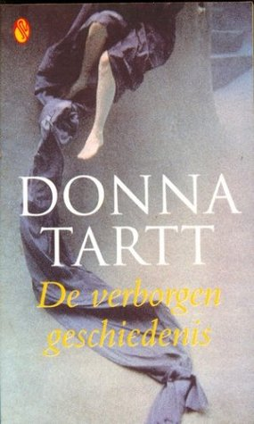
*Dutch first, tr. Barbara de Lange.*

*French first HC, tr. Pierre Alien.*

*French Pocket paperback.*

*German first, tr. Rainer Schmidt.*

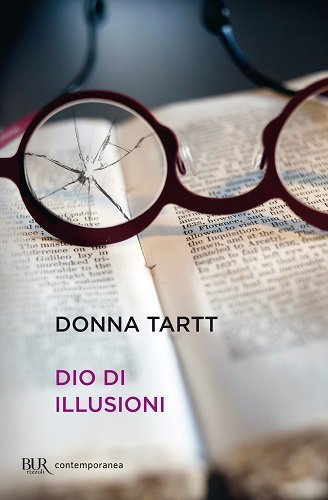
*Italian first HC, tr. Idolina Landolfi.*

*Japanese retitled bunko edition (Vol. 上).*

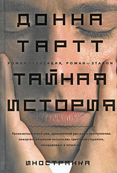
*Russian edition, tr. Borodkin & Lensman.*

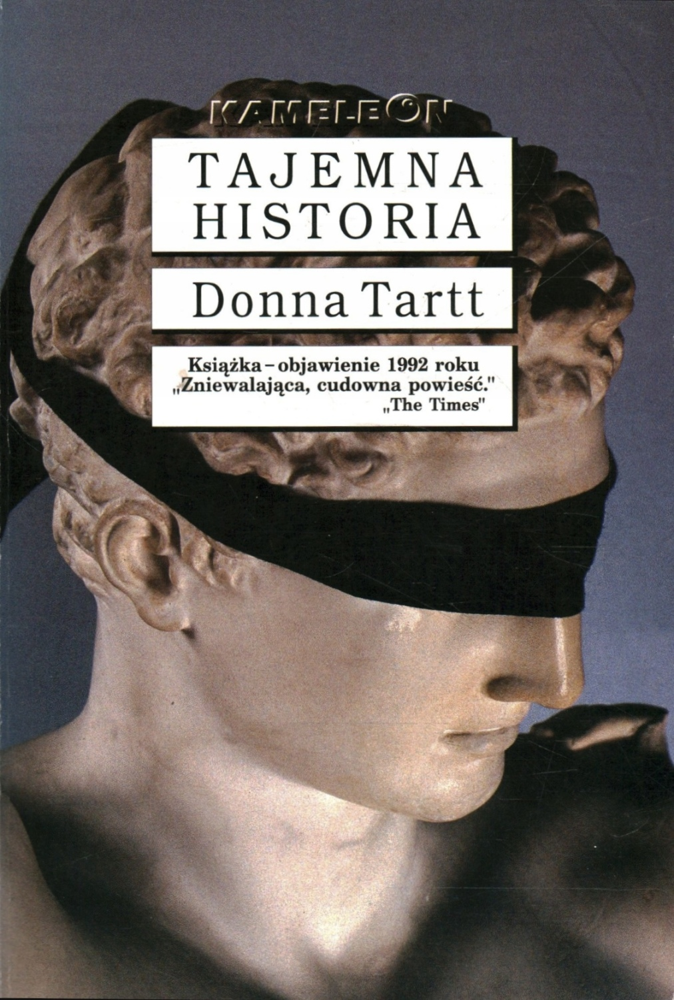
*Polish first, tr. Paweł Witkowski.*

*Polish 2022 reissue, tr. Jerzy Kozłowski.*

*Greek edition (Livanis).*

*Spanish first, tr. Gemma Rovira Ortega.*

*Brazilian Portuguese edition.*

*Finnish first.*

*Norwegian first, tr. IdaLou Larsen.*

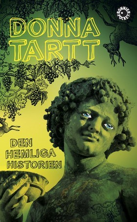
*Swedish first.*

*Danish first.*

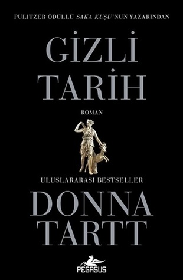
*Turkish edition.*

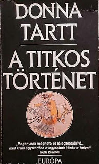
*Hungarian first (Európa 1996).*

*Hebrew edition (Keter 2004).*

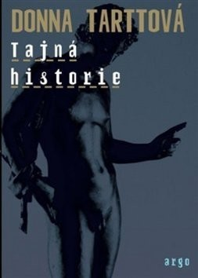
*Czech edition.*

*Lithuanian first, tr. Zita Marienė.*

*Romanian edition.*

---

## G.2 The Little Friend (2002) — covers

### G.2.1 US Knopf canonical
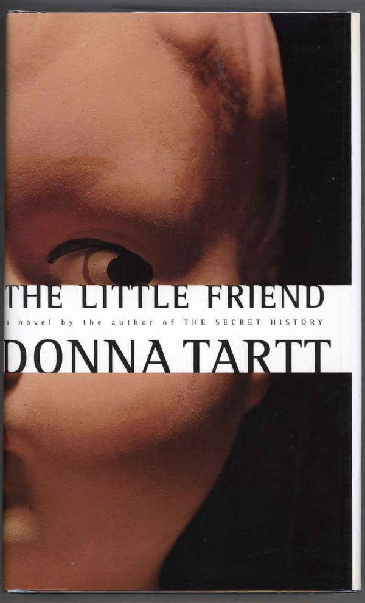
*US Knopf 1st, ISBN 9780679439387.*

*Advance reading copy, glossy wrappers.*

### G.2.2 UK Bloomsbury states

*Quarter-leather signed limited, ISBN 9780747564225.*

*Signed ARC, 940 numbered copies.*

*ISBN 9781408891360.*

### G.2.3 US paperback / large-print / e-book / audio

*Vintage Contemporaries tpb, ISBN 9781400031696.*

*Large-print edition, ISBN 9780375434976.*

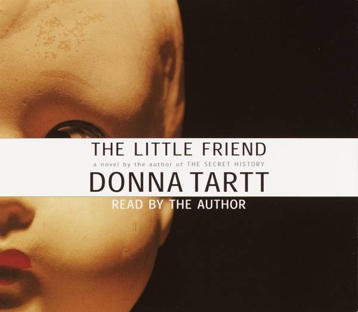
*Abridged audiobook narrated by Tartt, ISBN 9780553714067.*

*Karen White unabridged, ASIN B00014WS3M.*

### G.2.4 Foreign-language firsts

*Dutch chronological first, tr. Jonkheer/de Lange/Mossel.*

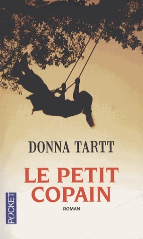
*French first, tr. Anne Rabinovitch.*

*German first, tr. Rainer Schmidt.*

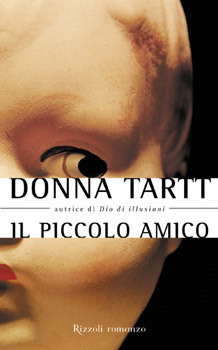
*Italian first, tr. Landolfi + Maccari.*

*Spanish first, tr. Gemma Rovira Ortega.*

*Greek first.*

*Polish first, tr. Paweł Lipszyc.*

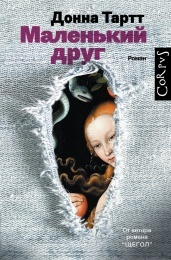
*Russian edition, tr. Anastasiya Zavozova.*

### G.2.5 TLF and Bezige Bij anniversary set

*Vol. 13 of the 20-volume 2004 anniversary set — Dutch translation of "Sleepytown".*

*Japanese first vol. 2 (2-volume bunko set), tr. Oka Machiko.*

---

## G.3 The Goldfinch (2013) — covers

### G.3.1 Dutch true first
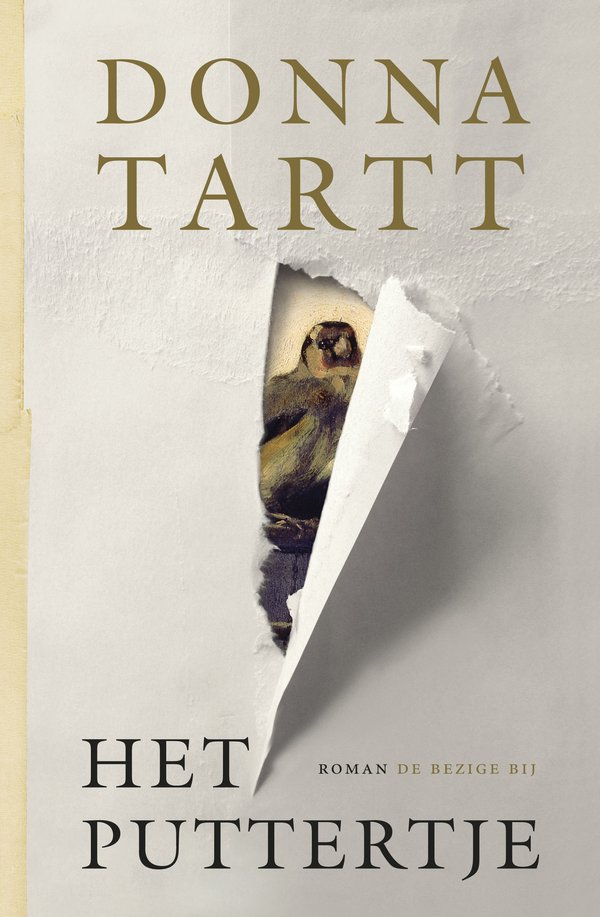
*Chronological true first in print.*

### G.3.2 US/UK canonical

*US Little Brown 1st with Fabritius torn-paper DJ, ISBN 9780316055437.*

*UK trade HC, ISBN 9780316258821.*

*Uncorrected proof, glossy wrappers.*

### G.3.3 Signed / limited editions
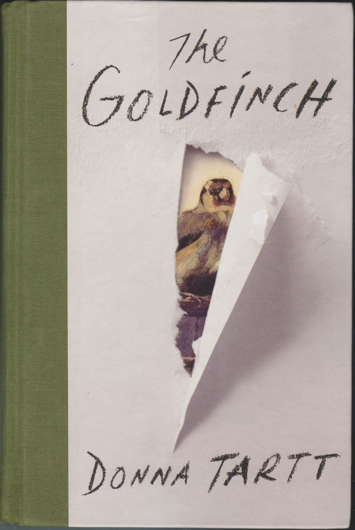
*UK Deluxe Signed Limited, 1,000 numbered, ISBN 9781408704943.*

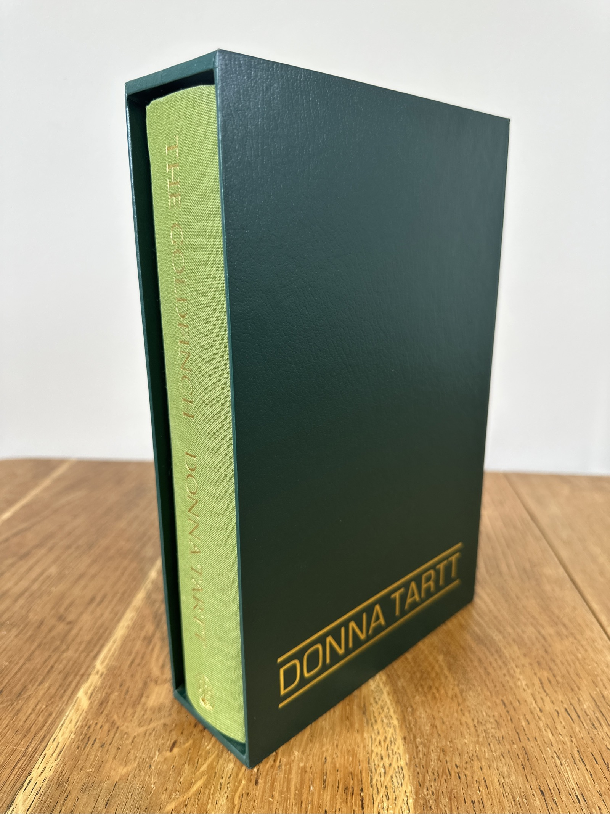
*Deluxe Lettered, copy Z of A–Z.*

*Brown cloth slipcase + chapbook, signed in purple ink.*

*Red Foyles sticker, signed in copper ink.*

*B&N signed first, signed below tipped-in bird bookplate.*

*10th Anniversary signed limited, 1,000 numbered.*

### G.3.4 US large-print / e-book / audio

*Large-print, ISBN 9780316239875.*

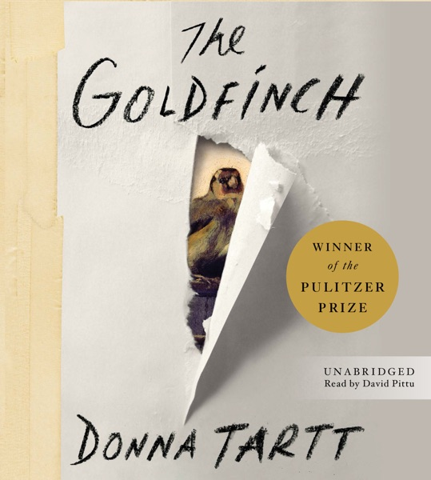
*Unabridged audiobook narrated by David Pittu, ASIN B00FF7K23A.*

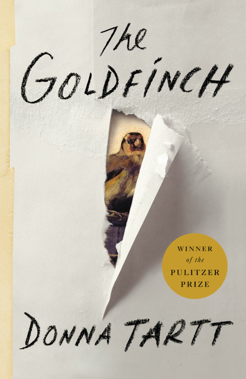
*Physical 19-CD audio set, ISBN 9781600247118.*

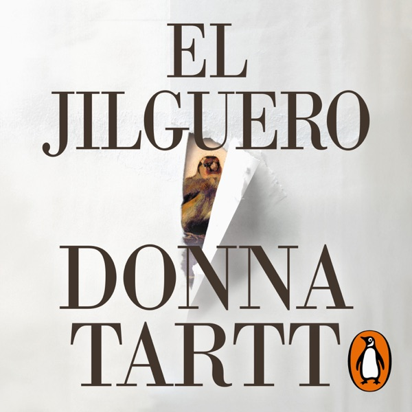
*Spanish-language audiobook, ASIN B09GWBGFVT.*

*Kindle US, ASIN B00BAXFECK.*

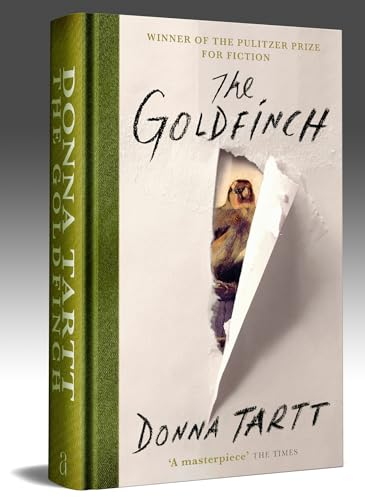
*Kindle UK, ASIN B00C74SHRK.*

### G.3.5 Foreign-language firsts

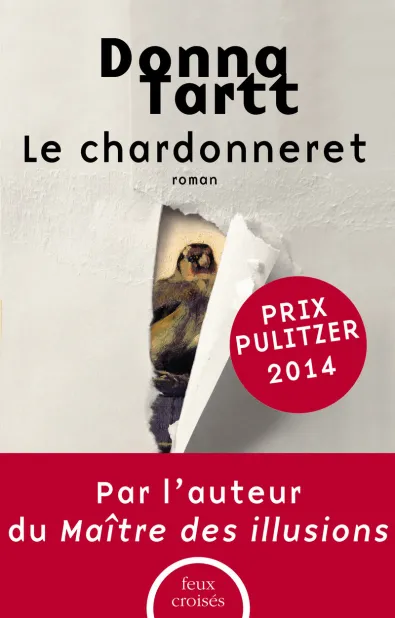
*French first, tr. Édith Soonckindt.*

*German first, tr. Rainer Schmidt + Kristian Lutze.*

*Italian first HC, tr. Mirko Zilahi De' Gyurgyokai.*

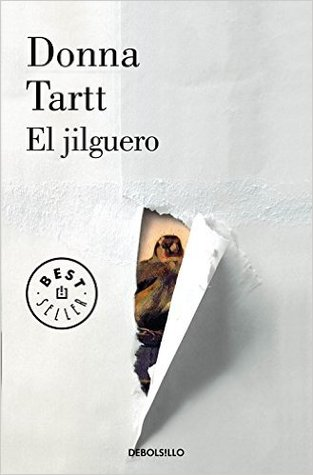
*Spanish first, tr. Aurora Echevarría Pérez.*

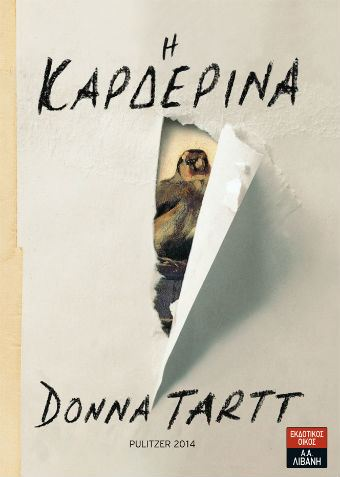
*Greek first.*

*Polish first, tr. Jerzy Kozłowski.*

*Japanese first vol. 1 (4-volume set), tr. Oka Machiko.*

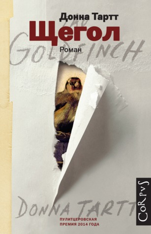
*Russian first, tr. Anastasiya Zavozova.*

*Korean first vol. 1 (2-volume set).*

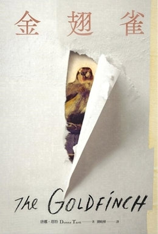
*Mainland Chinese first.*

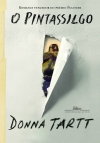
*Brazilian Portuguese first.*

*Portuguese (Portugal) first.*

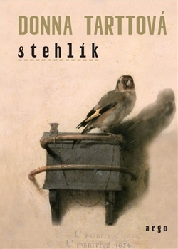
*Czech first, tr. David Petrů.*

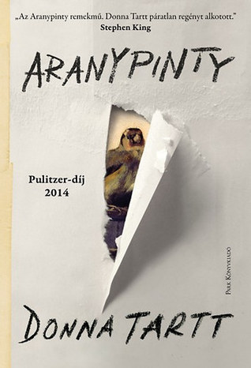
*Hungarian first, tr. Kada Júlia.*

*Romanian first.*

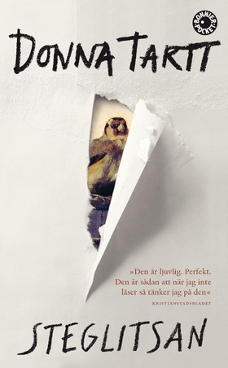
*Swedish first.*

*Norwegian first.*

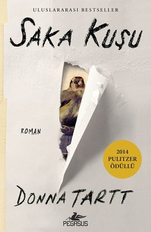
*Turkish first, tr. Püren Özgören.*

*Hebrew first.*

---

## G.4 Short fiction — covers

*Vol. 285, no. 1706. Contains Tartt's "Sleepytown: A Southern Gothic Childhood, with Codeine," pp. 60–66.*

*Contains "Tam-O'-Shanter," pp. 90–95.*

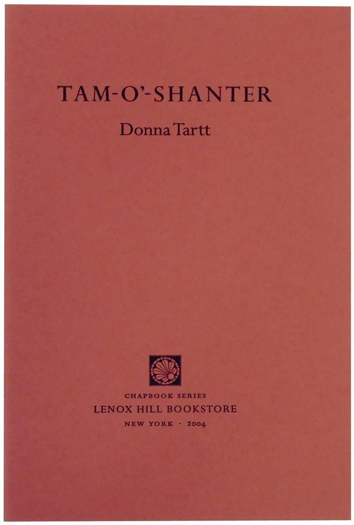
*Letterpress chapbook of "Tam-O'-Shanter," 250 signed copies.*

*Vol. 287, no. 1723.*

*Vol. 65, no. 5.*

---

## G.5 Nonfiction — covers

*Eudora Welty cover photograph.*

*Vol. 288, no. 1727. Republication of "Basketball Season."*

*Contains Tartt's tribute "My friend, my mentor, my inspiration."*

*Excerpt of the Martel Reclaiming Art introduction.*

---

## G.6 Introductions, contributions, and audiobooks — covers

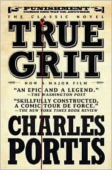
*Overlook reissue with Tartt's True Grit introduction.*

*Narrated by Donna Tartt; includes her introduction as afterword.*

*Anthology containing Tartt's only published poem — the 1996 Delacorte hardcover dust jacket.*

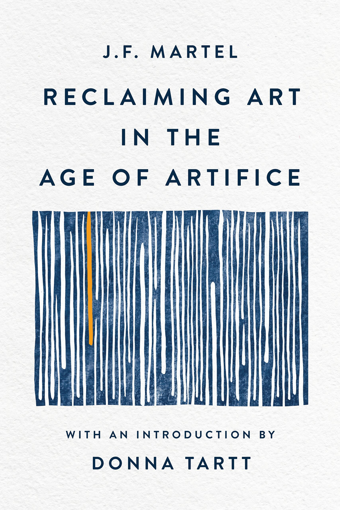
*Counterpoint/Basic Books reissue with Tartt introduction.*

*Contains Tartt's "Editor's Choice: Erin Parish."*

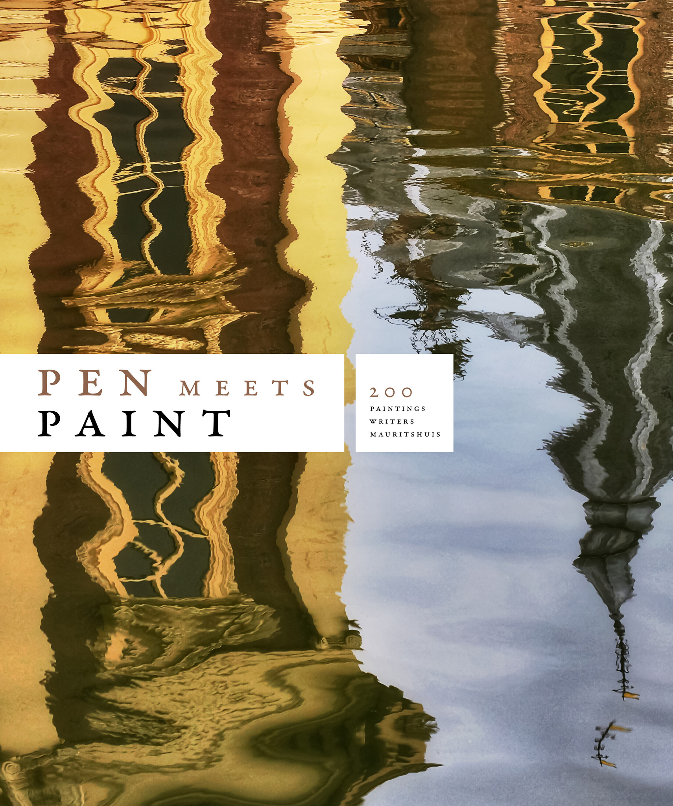
*Mauritshuis 200-painting / 200-writer commemorative anthology with Tartt contribution.*

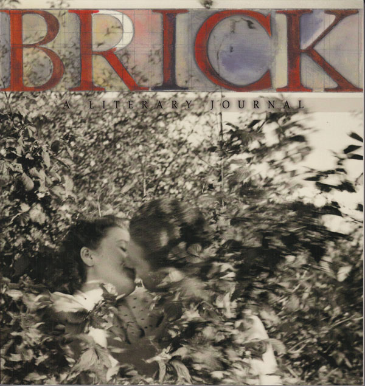
*Full text of the True Grit introduction as published in Brick.*

*Anthology containing a licensed reprint of a TSH passage.*

*Contains "Basketball Season" reprint.*

---

## G.7 Press, ephemera — covers

*Geena Davis cover. Photographer: Henry Benson.*

*Robert Redford cover.*

*US Vogue, vol 182 no. 9.*

*Cosmopolitan, vol 213 no. 3.*

*Glamour, vol 90 no. 9.*

---

## G.8 Authentication & signatures

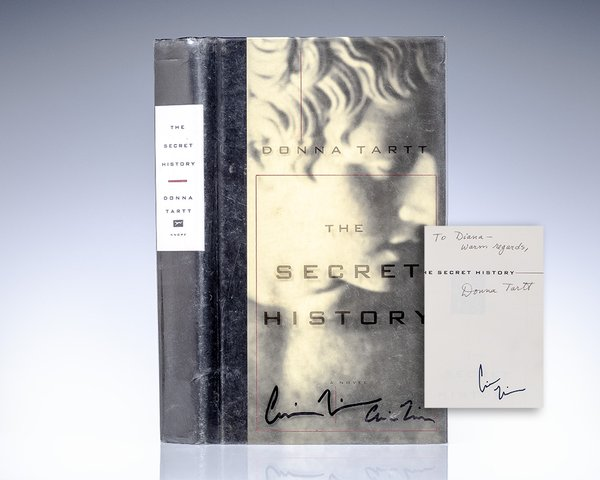
*Characteristic Tartt inscription with flowing horizontal stroke through signature line; additionally signed by jacket designer Chip Kidd.*
