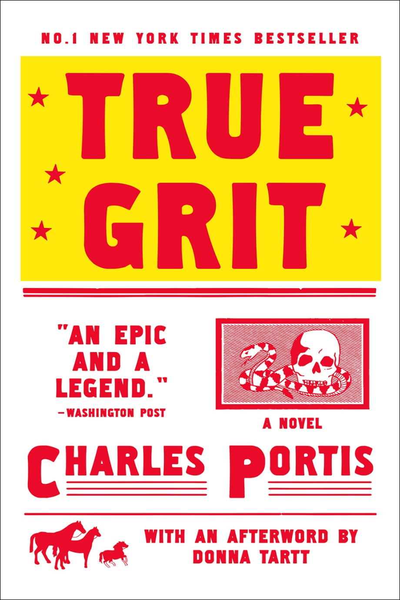

[← Back to the Catalogue](../CATALOGUE.md)

# True Grit (Overlook 2010 movie tie-in reissue)

Introductions & Contributions · item `CON-001b`

### Reference details
| Field | Value |
|---|---|
| Work | Introductions & Contributions |
| Section | §7.1 |
| Edition | True Grit (Overlook 2010 movie tie-in reissue) |
| Country | US |
| Language | EN |
| Publisher | Overlook Press |
| Year | 2010 |
| ISBN-13 | 9781590204597 |
| Status | have |

📖 **Full reference entry:** [§7.1 in the Collector's Reference](../Donna_Tartt_Collectors_Reference.md#71-introduction-charles-portis-true-grit-bloomsbury-reissue-2005)

🔗 **Read the original:** [brickmag.com](https://brickmag.com/the-great-abiding-pleasure-of-true-grit/) · [theguardian.com](https://www.theguardian.com/books/2005/jan/08/classics.charlieportis)

### Full text

### From Brick 76

							Brick 76							Winter 2005

			The following piece appeared in Brick 76, and as the introduction to the 2005 edition of Charles Portis’s True Grit, published by in the U.K. by Bloomsbury Publishing and in the U.S. and Canada by Overlook Press.

It’s a commonplace to say that we “love” a book, but when we say it, we really mean all sorts of things. Sometimes we mean only that we have read a book once and enjoyed it; sometimes we mean that a book was important to us in our youth, though we haven’t picked it up in years; sometimes what we “love” is an impressionistic idea glimpsed from afar (Combray . . . madeleines . . . Tante Léonie . . .) as opposed to the experience of wallowing and plowing through an actual text, and all too often people claim to “love” books they haven’t read at all. Then there are the books we love so much that we read them every year or two, and know passages of them by heart; that cheer us when we are sick or sad and never fail to amuse us when we take them up at random; that we press on all our friends and acquaintances; and to which we return again and again with undimmed enthusiasm over the course of a lifetime. I think it goes without saying that most books that engage readers on this very high level are masterpieces; and this is why I believe that True Grit by Charles Portis is a masterpiece.

Not only have I loved True Grit since I was a child; it is a book loved passionately by my entire family. I cannot think of another novel—any novel—that is so delightful to so many disparate age groups and literary tastes. Four generations of us fell for it in a swift coup de foudre—starting with my mother’s grandmother, then in her early eighties, who borrowed it from the library and adored it and passed it along to my mother. My mother—her eldest granddaughter—was suspicious. There wasn’t much overlap in their reading matter: my gentle great-grandmother—born in 1890—was the product of an extremely sheltered life, and a more innocent creature in many respects than are most six-year-olds today; whereas my mother (in her twenties then) kept books like The Boston Strangler on her bedside table. Purely from a sense of duty, she gave True Grit a try—and was so crazy about it that when she finished it, she turned back to the first page and read it all over again. My own middle-aged grandmother (whose reading habits were rather severe, running to politics and science and history) was smitten by True Grit, too, which was even more remarkable since—apart from the classics of her childhood, and what she called “the great books”—she didn’t even care all that much for fiction. I think she might have been the person who suggested that it be given to me to read. And I was only about ten, but I loved it too, and I’ve loved it ever since.

The plot of True Grit is uncomplicated, and as pure in its way as one of the Canterbury Tales. The opening paragraph sets up the premise of the novel elegantly and economically.

People do not give it credence that a fourteen-year-old girl could leave home and go off in the wintertime to avenge her father’s blood but it did not seem so strange then, although I will say it did not happen every day. I was just fourteen years of age when a coward going by the name of Tom Chaney shot my father down in Fort Smith, Arkansas, and robbed him of his life and his horse and $150 in cash money plus two California gold pieces that he carried in his trouser band.

The speaker is Mattie Ross, from Yell County near Dardanelle, Arkansas, and the time is the 1870s, shortly after the Civil War. Mattie leaves her grief-stricken mother at home with her younger siblings and sets out after Tom Chaney, the hired man who has killed her father. (“Chaney said he was from Louisiana. He was a short man with cruel features. I will tell more about his face later.”) But Chaney has joined up with a band of outlaws—the Lucky Ned Pepper gang—and ridden out into the Indian territory, which is under the jurisdiction of U.S. marshals. Mattie wants someone to go after him; and she wants someone who will shoot first and ask questions later. So she asks the sheriff in Fort Smith for the name of the best marshal he knows.

The sheriff thought on it a minute. He said: “I would have to weigh that proposition. There is near about two hundred of them. I reckon William Waters is the best tracker. He is a half-breed Comanche and it is something to see, watching him cut for sign. The meanest one is Rooster Cogburn. He is a pitiless man, double-tough, and fear don’t enter into his thinking. He loves to pull a cork. Now L. T. Quinn, he brings his prisoners in alive. He may let one get by now and then but he believes even the worst of men is entitled to a fair shake. Also the court does not pay any fees for dead men. Quinn is a good peace officer and a lay preacher to boot. He will not plant evidence or abuse a prisoner. He is straight as a string. Yes, I will say that Quinn is about the best they have.”

I said, “Where can I find this Rooster?”

Movie fans will call to mind the aging John Wayne, who famously portrayed Rooster Cogburn on the screen, but the Rooster of the novel is somewhat younger, in his late forties: a fat, one-eyed character with walrus moustaches, unwashed, malarial, drunk much of the time. He is a veteran of the Confederate Army; and, more particularly, of William Clarke Quantrill’s bloody border gang, notorious in American history for the massacre at Lawrence, Kansas, and also for launching the careers of the teenaged Frank and Jesse James. Mattie runs Rooster to ground in his squalid rented room at the back of a Chinese grocery store (“Men will live like billy goats if they are let alone,” she remarks, disapprovingly) and he’s happy enough to take Mattie’s money to ride out after her father’s killer—but not to let Mattie come along.

He sat up in the bed. “Wait,” he said. “Hold up. You are not going.”

“That is part of it,” said I.

“It cannot be done.”

“And why not? You have misjudged me if you think I am silly enough to give you a hundred dollars and watch you ride away. No, I will see the thing done myself.”

Mattie is not the only party after Tom Chaney; so is a vain, good-looking Texas Ranger named LaBoeuf who has already tracked Chaney over several states. LaBoeuf (whose name is pronounced “La Beef,” and who is somewhat overly proud of his membership in the Rangers) wants to team up with Rooster to bring Chaney back alive and collect the bounty. But the dandy LaBoeuf, clanking along in his “great brutal spurs” and “Texas trappings,” is no more interested than Rooster in allowing a fourteen-year-old girl to tag along on a manhunt; moreover, LaBoeuf’s intent is to bring Chaney back to Texas to hang for shooting a Texas state senator in a dispute over a bird dog, a claim that Mattie hotly disputes.

“Haw, haw,” said LaBoeuf. “It is not important where he hangs, is it?”

“It is to me. Is it to you?”

“It means a good deal of money to me. Would not a hanging in Texas serve as well as a hanging in Arkansas?”

“No. You said yourself they might turn him loose down there. This judge will do his duty.”

“If they don’t hang him we will shoot him. I can give you my word as a Ranger on that.”

“I want Chaney to pay for killing my father and not some Texas bird dog.”

“It will not be for the dog, it will be for the senator, and your father too. He will be just as dead that way, you see, and pay for all his crimes at once.”

“No, I do not see. That is not the way I look at it.”

Not surprisingly, Rooster and LaBoeuf contrive to slip away from Fort Smith without Mattie. But she strikes out after them, and as hard as they ride, they cannot lose her. (“What a foolish plan, pitting horses so heavily loaded with men and hardware against a pony so lightly burdened as Blackie!”) Finally, when they cannot get Mattie to turn back, they accept her: first, in anger, as a worrisome tagalong; then, grudgingly, as a mascot and equal of sorts; and at last—as she stands among them and proves herself—as a relentless force in her own right.

Like Huckleberry Finn (or The Catcher in the Rye, or even the Bertie and Jeeves stories for that matter), True Grit is a monologue, and the great, abiding pleasure of it that compels the reader to return to it again and again is Mattie’s voice. No living Southern writer captures the spoken idioms of the South as artfully as Portis does; but though in all his novels (including those set in the current day), Portis shows his deep understanding of place, True Grit also masters the more complicated subtleties of time. Mattie, having survived her youthful adventure, is recounting her story as an old woman, and Portis is such a genius of a literary mimic that the book reads less like a novel than a first-hand account: the Wild West of the 1870s, as recollected in a spinster’s memory and filtered through the sedate sepia tones of the early 1900s. Mattie’s narrative tone is naive, didactic, hard-headed, and completely lacking in self-consciousness—and, at times, unintentionally hilarious, rather in the manner of Daisy Ashford’s The Young Visiters. And like The Young Visiters (which is largely delightful because it views the most absurd Victorian crotchets as obvious common sense), a great part of True Grit’s charm is in Mattie’s blasé view of frontier America. Shootings, stabbings, and public hangings are recounted frankly and flatly, and often with rather less warmth than the political and personal opinions upon which Mattie digresses. She quotes scripture; she explains and gives advice to the reader; her observations are often overlaid with a decorative glaze of Sunday school piety. And her own very distinctive voice (blunt, unsentimental, yet salted with parlour platitudes) echoes throughout the reported speech of all the other characters—lawmen and outlaws alike—to richly comic effect, as when Rooster remarks austerely of a young prisoner he has brought back alive to stand trial: “I should have put a ball in that boy’s head instead of his collarbone. I was thinking about my fee. You will sometimes let money interfere with your notion of what is right.”

Mattie is often compared to her literary ancestor, Huckleberry Finn; but though the two of them share some obvious similarities, in most respects Mattie is a much harder customer than careless, sweet-tempered Huck. Where Huck is barefoot and “uncivilized,” living happily in his hogshead barrel, Mattie is a pure product of civilization as a Sunday school teacher in nineteenth-century Arkansas might define it; she is a strait-laced Presbyterian, prim as a poker (“I would not put a thief in my mouth to steal my brains,” she says coolly to the drunken Rooster), tidy, industrious, and frugal, with a head for figures and a shrewd business sense. Her deadpan manner is reminiscent of Buster Keaton: Mattie, too, is a Great Stone Face; she never cracks a smile when recounting the undignified and ridiculous situations in which she finds herself, and even predicaments of great danger fail to draw violent emotion from her. But this deadpan flatness serves a double purpose in the novel, for if Mattie is humourless, she is also completely lacking in qualities like pity and self-doubt, and her implacable stoniness—while very, very funny—is formidable, too, in a manner reminiscent of old tintypes and cartes des visites of Confederate soldier boys: dead-eyed killers with rumpled hair and serious angel faces. One cannot picture Huckleberry Finn in the same light; for while Huck is an adventuresome spirit, duty and discipline are wholly foreign to him; conscripted by any army, any cause, he would desert in short order, slipping away the first chance he got to his easy riverbank life. Mattie on the other hand is the perfect soldier, despite her sex. She is as tireless as a gun dog, and while we laugh at her single-mindedness, we also stand in awe of it. In her Old Testament morality, in her legalistic and exacting turn of mind, in the thunderous blackness of her wrath (“What a waste! . . . I would not rest easy until that Louisiana cur was roasting and screaming in hell!”), she is less Huck Finn’s little sister than Captain Ahab’s.

True Grit is an adventure story, and though the two books in most respects could not be more different, Mattie’s quest in some ways reflects Dorothy Gale’s in The Wizard of Oz. Practical Dorothy, throughout all her trials, is really only working her way back home to Kansas, while practical Mattie, with her own mission and her own brace of unlikely travelling companions, is riding in the historical shadow of a very different Kansas: the mythical outlaw territory of Quantrill and his Confederate raiders. While Quantrill—a brilliant tactician—was romanticized in some quarters as an outlaw chieftain à la Alexandre Dumas, the massacre he led at the abolitionist town of Lawrence, Kansas, is considered the worst atrocity of the American Civil War, and history has tended to view Quantrill as a cold-blooded killer. (One man—shot five times when he tried to surrender—was left for dead by his assailant with the parting advice “Tell old God that the last man you saw on earth was Quantrill.”) Rooster, presumably, has come by some of his famous meanness under Quantrill’s tutelage; the incident with Odus Wharton and the bodies in the fire does seem to have some parallels with unpleasant incidents in historical accounts of raids at Lawrence and Centralia; and certainly he has picked up Quantrill’s reputed habit of riding against his enemy with the reins of his horse between his teeth and a revolver in each hand. And yet it is scoundrelly old Rooster who—like Huck Finn, revolting instinctively against the accepted brutality of his day—rises unexpectedly to True Grit’s moments of justice and nobility. He does this in a number of minor comical respects (as in his satisfying encounter with the two “wicked boys” who are tormenting the mule on the riverbank), not to mention the novel’s extraordinary climax. But perhaps the most gratifying moment in the entire book is when Rooster is jolted from his ambivalence about Mattie by the sight of LaBoeuf falling upon her with a switch.

I began to cry, I could not help it, but more from anger and embarrassment than pain. I said to Rooster, “Are you going to let him do this?”

He dropped his cigarette to the ground and said, “No, I don’t believe I will. Put your switch away, LaBoeuf. She has got the best of us.”

“She has not got the best of me,” replied the Ranger.

Rooster said, “That will do, I said.”

LaBoeuf paid him no heed.

Rooster raised his voice and said, “Put that switch down, LaBoeuf! Do you hear me talking to you?”

LaBoeuf stopped and looked at him. Then he said, “I am going ahead with what I started.”

Rooster pulled his cedar-handled revolver and cocked it with his thumb and threw down on LaBoeuf. He said, “It will be the biggest mistake you ever made, you Texas brush-popper.”

True Grit, in short, begins where chivalry meets the frontier—where the old Confederacy starts to merge and shade away into the Wild West. And without giving anything away, I can say that the book ends at a travelling Wild West show in Memphis in the early 1900s: which is to say, at once in the twentieth century and firmly enshrined in myth and legend.

True Grit was first published in 1968. When it came out, Roald Dahl wrote that it was the best novel to come his way in a long time. “I was going to say it was the best novel to come my way since . . . Then I stopped. Since what? What book has given me greater pleasure in the last five years? Or in the last twenty?” Certainly when I was growing up in the 1970s, True Grit was widely thought to be a classic; when I was about fourteen years old, it was read along with Walt Whitman and Nathaniel Hawthorne and Edgar Allan Poe in the honours English classes at my school. Yet True Grit vanished from the public eye  (because, I believe, of the John Wayne film, which is good enough but which doesn’t do the book justice), and my mother and I, along with many other Portis fans, were reduced to scouring used bookstores and buying up whatever stock we could find because the copies we lent out so evangelically were never returned. (In one particularly dark moment, when my mother’s last copy had disappeared and a new one was nowhere to be had, she borrowed the library’s copy and then pretended that she had lost it.) Now—thankfully—the book is back in print in America and the U.K., introducing Mattie Ross and Rooster Cogburn to a new generation of readers.

					Donna Tartt is a novelist, essayist, and critic. Most recently, she is the author of The Little Friend (Vintage). Her first novel, The Secret History, has been published in twenty-three languages.

### More Articles

### Previous Article

### Next Article

### Read from Brick 73

### The Omens

								by

								Jeffrey Eugenides

### Read from Brick 79

### Why Go Out?

								by

								Sheila Heti

Full text reproduced for non-commercial research; original source linked above. Hosted at <code>assets/sources/fulltext/CON-001b.md</code>.

### Sources & documents held

- [Guardian 2005 01 08 HowMattieGotHerMan G6 03](../assets/articles/Guardian_2005-01-08_HowMattieGotHerMan_G6-03.pdf) (PDF)
- [Guardian 2005 01 08 HowMattieGotHerMan G7 03](../assets/articles/Guardian_2005-01-08_HowMattieGotHerMan_G7-03.pdf) (PDF)

Primary-source captures cited for this section of the reference. PDFs and images open in GitHub's viewer; `.webarchive` files download.

---
[← Back to the Catalogue](../CATALOGUE.md)
