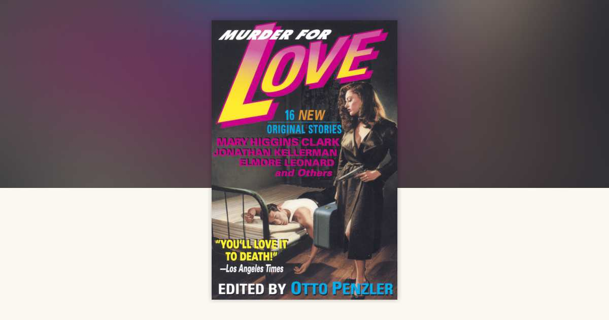

[← Back to the Catalogue](../CATALOGUE.md)

# Murder For Love - Penzler ed (Delacorte 1996)

Introductions & Contributions · item `CON-004`

### Reference details
| Field | Value |
|---|---|
| Work | Introductions & Contributions |
| Section | §7.5 |
| Edition | Murder For Love - Penzler ed (Delacorte 1996) |
| Country | US |
| Language | EN |
| Publisher | Delacorte Press |
| Year | 1996 |
| ISBN-13 | 9780385314664 |
| Status | have |

📖 **Full reference entry:** [§7.5 in the Collector's Reference](../Donna_Tartt_Collectors_Reference.md#75-tartt-poem-true-crime-in-otto-penzler-ed-murder-for-love-delacorte-press-1996)

🔗 **Read the original:** [languageisavirus.com](http://languageisavirus.com/donna-tartt/poem-true-crime.php) · [languageisavirus.com](https://www.languageisavirus.com/donna-tartt/poem-true-crime.php)

### Full text

donna tartt

A problem common to many lauded novels by the new generation of writers is lack of story. While we may not always like the principal characters, they are well drawn and fully realized. The dialogue may be brittle and frequently predictable, but it is crisp and true. Places and ambience come into plain view, even if they are not necessarily where we would choose to be. But nothing happens. The tales move along on a long stretch of road and then stop. The whole experience is as satisfying as one of those food bars consumed by astronauts. One tasted like steak and supplied the same nutrients, but it wasn't the real thing. Neither was the bar that tasted like chocolate ice cream.

Donna Tartt's first novel, The Secret History, on the other hand, is the real thing. All the terrific writing of other talented English majors, sure, but a real story too: a plot—that great rarity among "serious" writers of contemporary fiction. And, no less important, a good plot.

The author is not a fast writer, so there has been no book to follow that huge initial success. Even her short stories take ages to produce.

As an admirer of her work, I wanted Donna Tartt to be in this book. The inflexible rule was that all stories had to be original, written especially for this book. We winked at the rule, as this is a poem. It had previously been read by about eleven subscribers to the Oxford Review.

—O. P.

 

True Crime

BY DONNA TARTT

Things were getting hot in Idaho. Smiling,

strangled, in his distinctive red-and-silver pickup,

he seethed with the name of actress Elke Sommer.

Full moons seemed to bring out the worst in him.

So did eighteen year old neighbor Debra Earl. Lake Charles,

	Louisiana.

Prognosis: poor. Following a late dance at the VFW hall, 

Authorities recovered a diary, a favorite rifle, a sales receipt 

For antifreeze. "I have a problem. I'm 

A cannibal." He spoke of plans 

For a G.E.D. degree, a part-time candy business. 

Stick figures of his first-grade sweetheart 

Were scratched along the barrel of his gun.

Source: <code>assets/sources/archive/excerpts/Tartt-TrueCrime-MurderForLove-Penzler-1996-poem-p323.html</code> — regenerated by <code>scripts/build_catalogue.py</code>.

### Sources & documents held

- [OA Issue4 Winter1994 TOC userArchive 20260527](../assets/sources/archive/OA-Issue4-Winter1994-TOC-userArchive-20260527.html) (saved web page)
- [S088 CaptainAhabs TSH Penzler](../assets/sources/archive/S088_CaptainAhabs_TSH_Penzler.html) (saved web page)

Primary-source captures cited for this section of the reference. PDFs and images open in GitHub's viewer; `.webarchive` files download.

---
[← Back to the Catalogue](../CATALOGUE.md)
