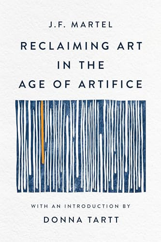

[← Back to the Catalogue](../CATALOGUE.md)

# Reclaiming Art in the Age of Artifice (Counterpoint/Basic 2024)

Introductions & Contributions · item `CON-005`

### Reference details
| Field | Value |
|---|---|
| Work | Introductions & Contributions |
| Section | §7.6 |
| Edition | Reclaiming Art in the Age of Artifice (Counterpoint/Basic 2024) |
| Country | US |
| Language | EN |
| Publisher | Counterpoint Press / Basic Books |
| Year | 2024 |
| ISBN-13 | 9781541607248 |
| Status | have |

📖 **Full reference entry:** [§7.6 in the Collector's Reference](../Donna_Tartt_Collectors_Reference.md#76-introduction-jf-martel-reclaiming-art-in-the-age-of-artifice-counterpoint-press--basic-books-2024-reissue)

🔗 **Read the original:** [harpers.org](https://harpers.org/archive/2024/07/art-and-artifice-donna-tartt/) · [counterpointpress.com](https://www.counterpointpress.com/dd-product/reclaiming-art-in-the-age-of-artifice/)

### Full text

_No full text is held for this item. See the reference entry above and the cited source._

### Sources & documents held

_No primary-source scan is held for this item yet — see the reference entry and the cited source above._

---
[← Back to the Catalogue](../CATALOGUE.md)
