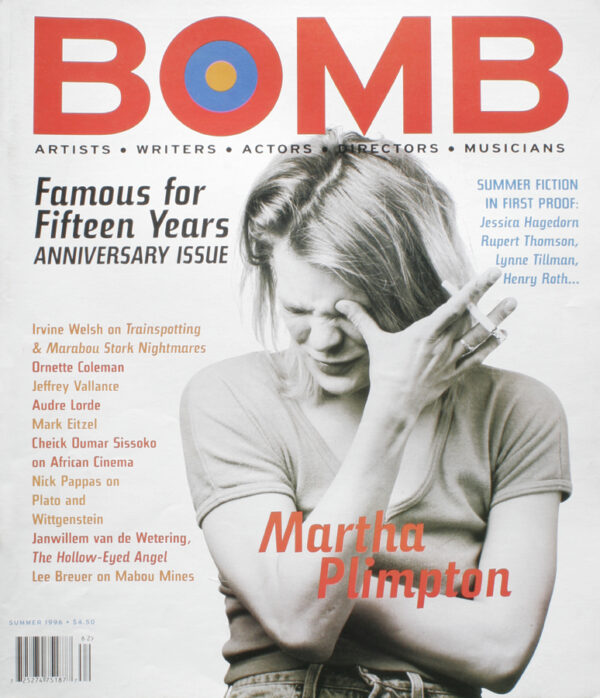

[← Back to the Catalogue](../CATALOGUE.md)

# Bomb Magazine Summer 1996 - Editor's Choice

Introductions & Contributions · item `CON-006`

### Reference details
| Field | Value |
|---|---|
| Work | Introductions & Contributions |
| Section | §7.7 |
| Edition | Bomb Magazine Summer 1996 - Editor's Choice |
| Country | US |
| Language | EN |
| Publisher | Bomb Magazine |
| Year | 1996 |
| Status | have |

📖 **Full reference entry:** [§7.7 in the Collector's Reference](../Donna_Tartt_Collectors_Reference.md#77-bomb-magazine-editors-choice-summer-1996)

🔗 **Read the original:** [bombmagazine.org](https://bombmagazine.org/articles/1996/07/01/erin-parish/)

### Full text

Erin Parish, daughter of artists Tom and Susan Parish, made her first oil painting when she was five (of a still-legged scarecrow with her skull instead of a pumpkin for a head, beneath a furious sun, feet planted firmly on the ground). Now, in her late twenties, her painting still trembles with menace and the ferocity of inner solitudes: empty halls, the partial glimpse of a drunkard’s slouched shoulder seen beneath the blaze of an electric bulb; a German funerary angel numbed with snow and post-war twilight, or an Ophelia delirious in weed-tangled silence. In her new paintings (included in Waterline at Black and Herron Gallery this past May), her figurative sensibility dissolves into abstraction and the open plains of dream—as relentless as the still line on a flat heart monitor—or sinks into abstraction and golden light. The result is a hypnotic pull in two very different directions, and into abandon on a more profound level. Here, the unmoored mind reeling from excess diffuses into blurred vision: the drunkard’s loss of consciousness, the swimmer’s last gasp of oxygen, the lights of the delivery room or the deathbed.

—Donna Tartt

Full text reproduced for non-commercial research; original source linked above. Hosted at <code>assets/sources/fulltext/CON-006.md</code>.

### Sources & documents held

_No primary-source scan is held for this item yet — see the reference entry and the cited source above._

---
[← Back to the Catalogue](../CATALOGUE.md)
