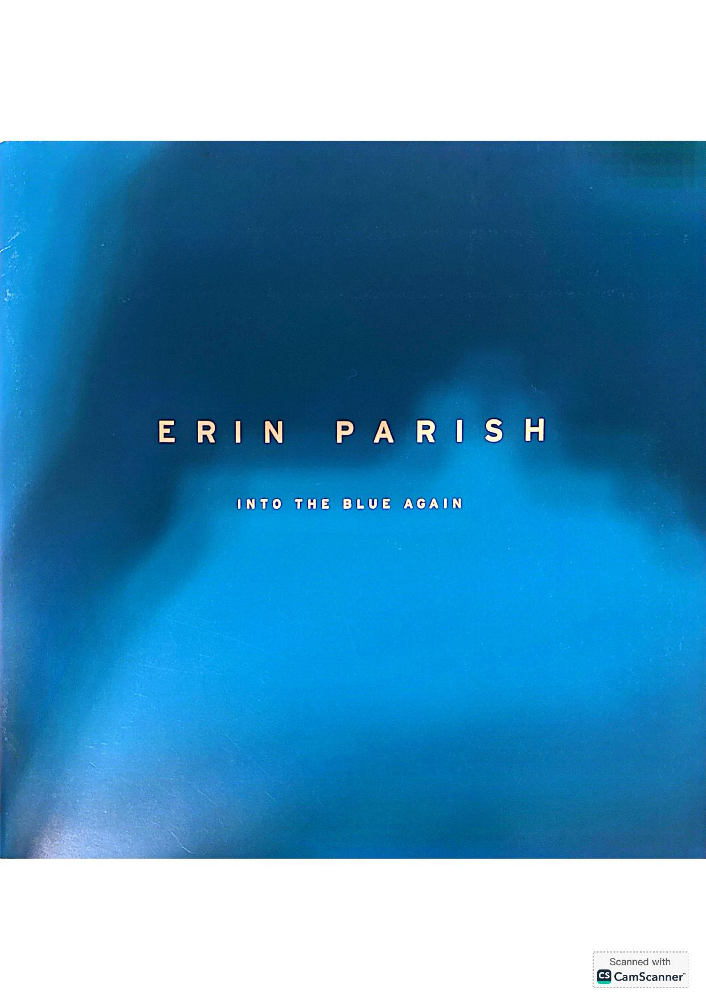
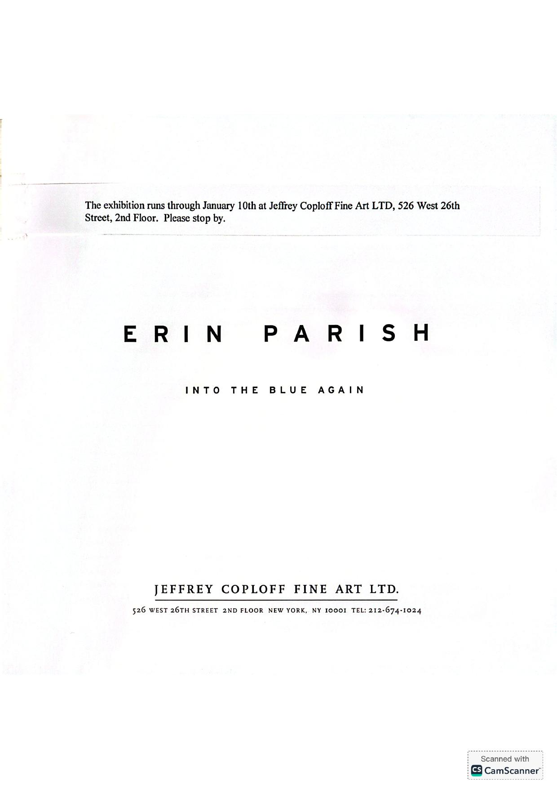
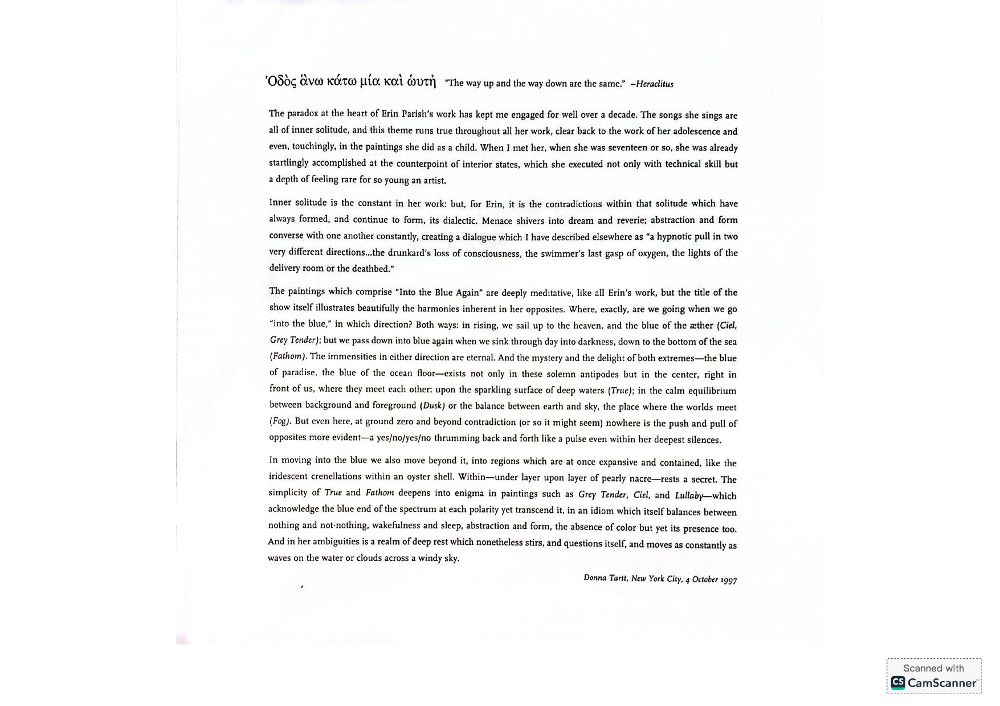
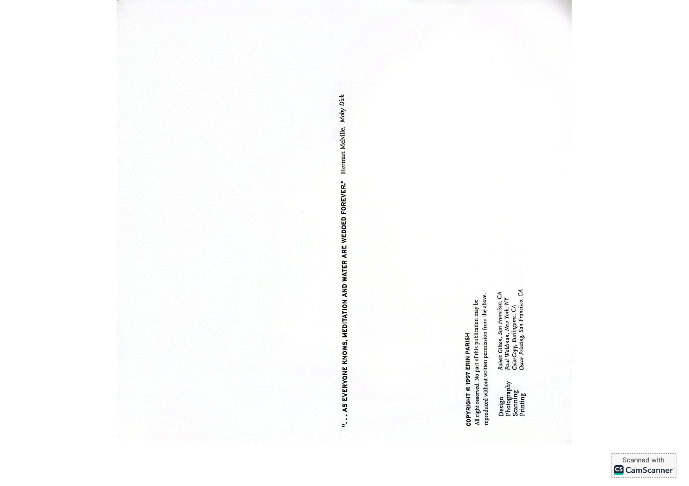

[← Back to the Catalogue](../CATALOGUE.md)

# Erin Parish 'Into the Blue Again' exhibition catalog 1997

Introductions & Contributions · item `CON-007`

### Reference details
| Field | Value |
|---|---|
| Work | Introductions & Contributions |
| Section | §7.8 |
| Edition | Erin Parish 'Into the Blue Again' exhibition catalog 1997 |
| Country | US |
| Language | EN |
| Publisher | Jeffrey Coploff Fine Art |
| Year | 1997 |
| Status | have |

📖 **Full reference entry:** [§7.8 in the Collector's Reference](../Donna_Tartt_Collectors_Reference.md#78-exhibition-catalog-erin-parish-into-the-blue-again-jeffrey-coploff-fine-art-new-york-1997)

### Full text

_No machine-readable text available — the original is reproduced here as page scans:_

### Sources & documents held

- [S083 BOMB56 ErinParish byDonnaTartt](../assets/sources/archive/S083_BOMB56_ErinParish_byDonnaTartt.html) (saved web page)
- [S084 artist info JeffreyCoploff](../assets/sources/archive/S084_artist-info_JeffreyCoploff.html) (saved web page)

Primary-source captures cited for this section of the reference. PDFs and images open in GitHub's viewer; `.webarchive` files download.

---
[← Back to the Catalogue](../CATALOGUE.md)
