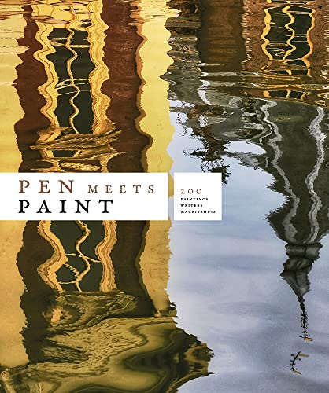
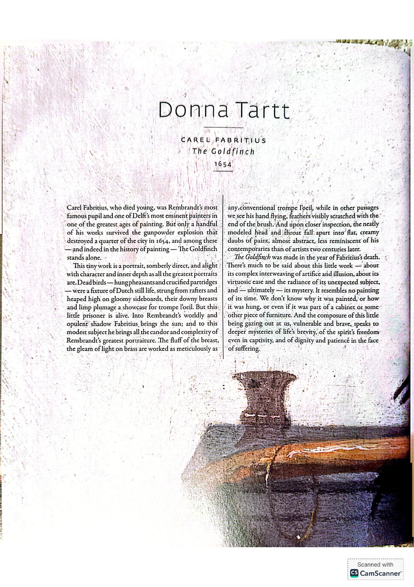
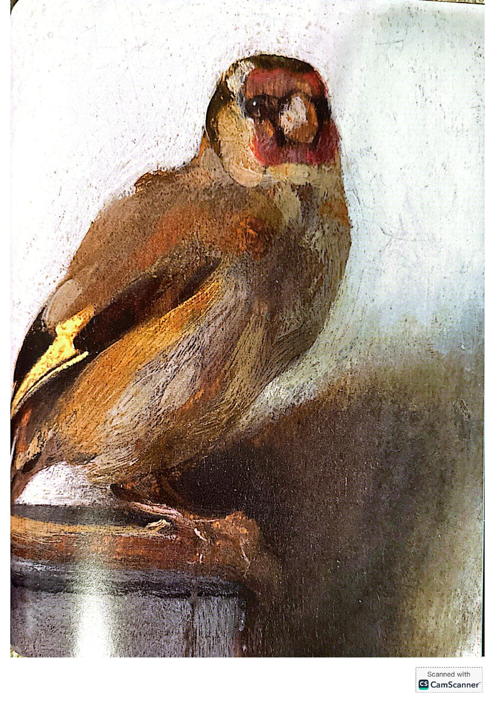
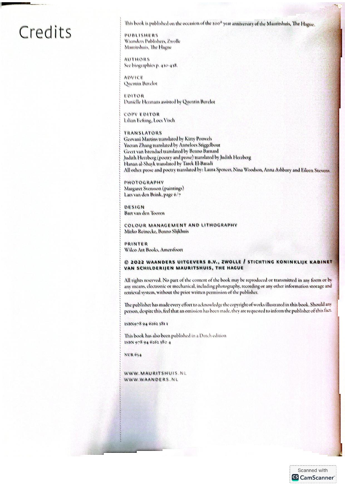
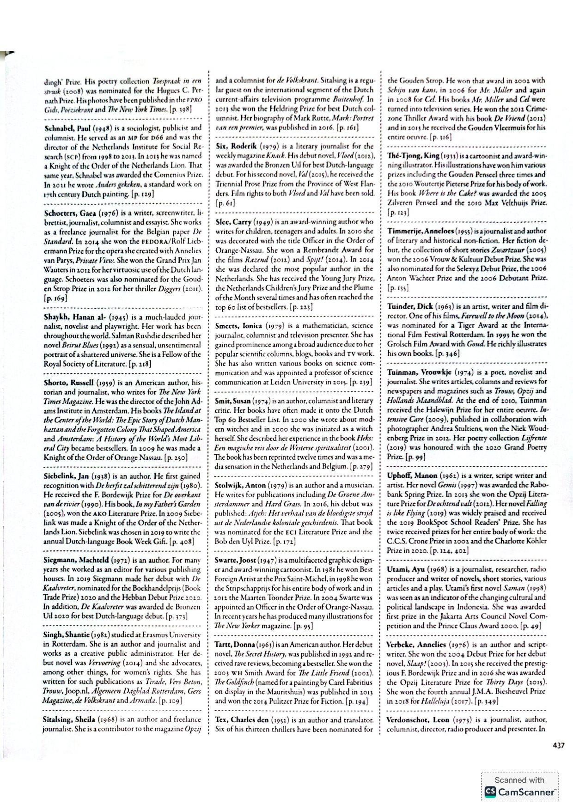

[← Back to the Catalogue](../CATALOGUE.md)

# Pen Meets Paint - 200 Years Mauritshuis (Waanders 2022)

Introductions & Contributions · item `CON-008`

### Reference details
| Field | Value |
|---|---|
| Work | Introductions & Contributions |
| Section | §7.9 |
| Edition | Pen Meets Paint - 200 Years Mauritshuis (Waanders 2022) |
| Country | NL |
| Language | EN |
| Publisher | Waanders / Mauritshuis |
| Year | 2022 |
| ISBN-13 | 9789462623811 |
| Status | have |

📖 **Full reference entry:** [§7.9 in the Collector's Reference](../Donna_Tartt_Collectors_Reference.md#79-museum-anthology-pen-meets-paint-200-years-mauritshuis-200-writers-200-paintings-waanders--mauritshuis-2022)

🔗 **Read the original:** [waanders.nl](https://www.waanders.nl/nl/pen-meets-paint.html) · [mauritshuis.nl](https://www.mauritshuis.nl/nu-te-doen/200-jaar-mauritshuis/pennenoverpenselen) · [openlibrary.org](https://openlibrary.org/books/OL40324119M)

### Full text

_No machine-readable text available — the original is reproduced here as page scans:_

### Sources & documents held

_No primary-source scan is held for this item yet — see the reference entry and the cited source above._

---
[← Back to the Catalogue](../CATALOGUE.md)
