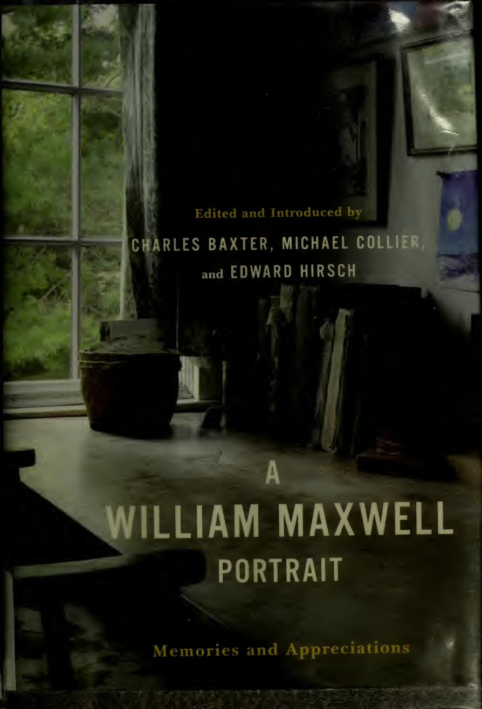

[← Back to the Catalogue](../CATALOGUE.md)

# A William Maxwell Portrait (Norton 2004) - Tartt essay "Mr. Maxwell" pp. 19-33

Introductions & Contributions · item `CON-010`

### Reference details
| Field | Value |
|---|---|
| Work | Introductions & Contributions |
| Section | §7.13 |
| Edition | A William Maxwell Portrait (Norton 2004) - Tartt essay "Mr. Maxwell" pp. 19-33 |
| Country | US |
| Language | EN |
| Publisher | W. W. Norton & Company |
| Year | 2004 |
| ISBN-13 | 9780393057713 |
| ISBN-10 | 0393057712 |
| Status | have |

📖 **Full reference entry:** [§7.13 in the Collector's Reference](../Donna_Tartt_Collectors_Reference.md#713-tartt-essay-mr-maxwell--a-william-maxwell-portrait-memories-and-appreciations-w-w-norton-2004)

### Full text

_No full text is held for this item. See the reference entry above and the cited source._

### Sources & documents held

_No primary-source scan is held for this item yet — see the reference entry and the cited source above._

---
[← Back to the Catalogue](../CATALOGUE.md)
