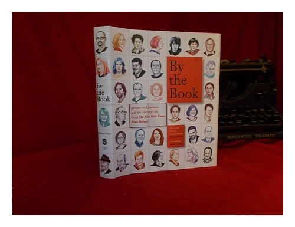

[← Back to the Catalogue](../CATALOGUE.md)

# By the Book - Writers on Literature (Pamela Paul ed) Henry Holt 2014 - Tartt By the Book Q&A reprint

Introductions & Contributions · item `CON-013`

### Reference details
| Field | Value |
|---|---|
| Work | Introductions & Contributions |
| Section | §7.16 |
| Edition | By the Book - Writers on Literature (Pamela Paul ed) Henry Holt 2014 - Tartt By the Book Q&A reprint |
| Country | US |
| Language | EN |
| Publisher | Henry Holt & Co. |
| Year | 2014 |
| ISBN-13 | 9781627791458 |
| ISBN-10 | 162779145X |
| Status | have |

📖 **Full reference entry:** [§7.16 in the Collector's Reference](../Donna_Tartt_Collectors_Reference.md#716-tartt-by-the-book-qa-reprint--by-the-book-writers-on-literature-and-the-literary-life-from-the-new-york-times-book-review-ed-pamela-paul-henry-holt-2014)

🔗 **Read the original:** [nytimes.com](https://www.nytimes.com/2013/10/20/books/review/donna-tartt-by-the-book.html) · [goodreads.com](https://www.goodreads.com/book/show/20696029-by-the-book) · [amazon.com](https://www.amazon.com/Book-Writers-Literature-Literary-Review/dp/125007469X)

### Full text

BY THE BOOK

Donna Tartt: By the Book
Oct. 17, 2013

The author of “The Goldfinch” and “The Secret History” says that personally, “to paraphrase Nabokov: all I want from a
book is the tingle down the spine, for my hairs to stand on end.”
What are you reading at the moment? Are you a one-book-at-a-time person?
I’ve always got a dozen books going, which is why my suitcases are always so heavy. At the moment: Am greatly
enjoying the Neversink Library reissue of Jean Cocteau’s “Difficulty of Being,” since my copy from college is so torn up
the pages are falling out. Am also loving Rachel Kushner’s “Telex From Cuba” and Gilbert Highet’s “Poets in a
Landscape,” a charming appreciation of Catullus and Propertius and the Latin poets. (I love almost all the reissues of
the New York Review Books Classics — at the Corner Bookstore, uptown, they shelve them all together, and I always
make a beeline for that shelf the instant I set foot in the store.) On the table by my bed: “Byron: The Last Journey,” by
Harold Nicolson; “Horse, Flower, Bird,” by Kate Bernheimer; Barry Paris’s biography of Louise Brooks; and
“Rifleman: A Front-Line Life,” by Victor Gregg with Rick Stroud. I always have a comfort book going too, something
I’ve read many times, and for me at the moment that comfort book is Raymond Chandler’s “The Big Sleep.”
What’s the best book you’ve read so far this year?
I certainly haven’t enjoyed anything more than “The Unquiet Grave,” by Cyril Connolly, which I went back and reread
sometime early this year. I’ve loved it since I was a teenager and like always to have it to hand; when I lived in France,
years ago, it was one of only six books I carried with me — but because of its aphoristic nature, usually I only read bits
and pieces of it, and it’s been many years since I read the whole thing start to finish.

Who are your favorite novelists?
The novelists I love best, the ones who made me want to become a writer, are mostly from the 19th century: Dickens,
Melville, James, Conrad, Stevenson, Dostoyevsky, with Dickens probably coming first in that list. As far as 20thcentury novelists go, I love Nabokov, Evelyn Waugh, Salinger, Fitzgerald, Don DeLillo; and of the 21st century, my two
favorites so far are Edward St. Aubyn and Paul Murray.
What’s the best thing about writing a novel?
I love having an alternate life to retreat into and to lose myself in. I love being away from the world so long — so far
out from shore. Eleven years.
The hardest?
Honestly, there are so many hard things about writing a novel that it’s hard to pick just one, but I particularly hate
having to try to formulate an answer when someone asks me: What’s your book about?
What kinds of stories are you drawn to? Any you steer clear of?
I’m not very interested in contemporary American realism, or books about marriage, parenting, suburbia, divorce.
Even as a child browsing at the library I distinctly remember avoiding books that had the big silver Caldecott award
sticker on the front, because I loved fairy tales, ghost stories, adventures, whereas the Caldecott prize stories often
had a dutiful tone that tended more towards social issues. Those things were not my cup of tea, even when I was small,
and I knew it — although if something’s written well enough, anything goes. To paraphrase Nabokov: all I want from a
book is the tingle down the spine, for my hairs to stand on end.
Do you ever read self-help? Anything you recommend?
I was a great fan of the now defunct Loompanics press, which published such self-help classics as “The Complete
Guide to Lock Picking” and “How to Disappear Completely and Never Be Found.”
What books might we be surprised to find on your shelves?

See above.
How do you organize your own personal library?

Donna Tartt Illustration by Jillian Tamaki

Not very well, I’m afraid. But I know where everything is.
Do you keep books or give them away?
Keep them. But I give lots of books as gifts.

If you could require the president to read one book, what would it be?
I wouldn’t dream of requiring the president to read a book; he’s far too busy, and besides, I think we probably wouldn’t
enjoy the same books.
Did you identify with any literary characters growing up? Who were your heroes?
As a child I adored Huckleberry Finn and Peter Pan. As a teenager: Franny Glass. In my 20s: Agatha Runcible.
If you could meet any writer, dead or alive, who would it be?
This to me is the most interesting question on the list, as it’s something I spend a great deal of time thinking about
every day. Just because you love a writer’s books doesn’t necessarily mean they would be great company. I’d love to
meet Oscar Wilde, because they all say he was so much more wonderful in person than on the page. From reading the
journals of Tennessee Williams, I’m almost positive that if Tennessee and I had ever met, we would have been friends.
And if it was a dinner date? Albert Camus. That trench coat! That cigarette! I think my French is good enough. We’d
have a great time.
Disappointing, overrated, just not good: What book did you feel you were supposed to like, and didn’t?
I don’t like Hemingway. And I know I don’t love “Ulysses” as much as I am supposed to — but then again, I never
cared even one-tenth so much for the “Odyssey” as I do for the “Iliad.”
Do you remember the last book you put down without finishing?
Definitely I do, but impolitic to say.
If you could be any character from literature, who would you be?
This is a hard question, because so many great characters from literature come to bad ends. Mrs. Stitch, from “Scoop,”
driving around madly in her tiny motorcar, looks like she’s having a lot of fun, though. So does Tom Ripley.

What book have you always meant to read and never gotten around to yet? What do you feel embarrassed never to
have read?
I’m looking at Shelby Foote’s three-volume history of the Civil War on my shelf — somehow I’ve never managed to
read the whole thing. And I’ve never read most of the novels of Thomas Hardy, although I don’t feel embarrassed
about it. Even though I love a lot of his poetry, his novels are just too sad for me.
What will you read next?
“Lord Rochester’s Monkey,” by Graham Greene. And — now that it’s out — “Doctor Sleep,” by Stephen King.
A version of this article appears in print on , Page 8 of the Sunday Book Review with the headline: Donna Tartt

Full text reproduced for non-commercial research; original source linked above. Hosted at <code>assets/sources/fulltext/CON-013.md</code>.

### Sources & documents held

_No primary-source scan is held for this item yet — see the reference entry and the cited source above._

---
[← Back to the Catalogue](../CATALOGUE.md)
