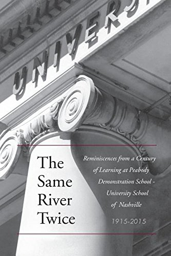

[← Back to the Catalogue](../CATALOGUE.md)

# The Same River Twice (USN 2014) - ✗ MISIDENTIFICATION (no Tartt content; full PDF examined May 13 2026; editor is Connie Culpepper)

Introductions & Contributions · item `CON-015`

### Reference details
| Field | Value |
|---|---|
| Work | Introductions & Contributions |
| Section | §7.18 |
| Edition | The Same River Twice (USN 2014) - ✗ MISIDENTIFICATION (no Tartt content; full PDF examined May 13 2026; editor is Connie Culpepper) |
| Country | US |
| Language | EN |
| Publisher | University School of Nashville |
| Year | 2014 |
| ISBN-13 | 9781615224715 |
| ISBN-10 | 1615224718 |
| Status | not by Tartt |

📖 **Full reference entry:** [§7.18 in the Collector's Reference](../Donna_Tartt_Collectors_Reference.md#718-the-same-river-twice-reminiscences-from-a-century-of-learning-at-pds-usn-1915-2015-usn-2014-anti-misattribution)

> ⚠️ **Misattribution.** Research found no Donna Tartt content in this item. It is listed here only to document — and correct — the false attribution.

### Full text

_No full text is held for this item. See the reference entry above and the cited source._

### Sources & documents held

_No primary-source scan is held for this item yet — see the reference entry and the cited source above._

---
[← Back to the Catalogue](../CATALOGUE.md)
