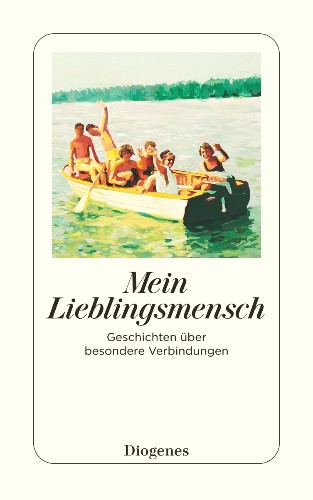

[← Back to the Catalogue](../CATALOGUE.md)

# Mein Lieblingsmensch - Geschichten ueber besondere Verbindungen (ed Armit + Thomma) - German anthology w/ translated Tartt story

Introductions & Contributions · item `CON-017`

### Reference details
| Field | Value |
|---|---|
| Work | Introductions & Contributions |
| Section | §7.20 |
| Edition | Mein Lieblingsmensch - Geschichten ueber besondere Verbindungen (ed Armit + Thomma) - German anthology w/ translated Tartt story |
| Country | CH |
| Language | DE |
| Publisher | Diogenes Verlag |
| Year | 2022 |
| ISBN-13 | 9783257245998 |
| ISBN-10 | 3257245998 |
| Status | have |

📖 **Full reference entry:** [§7.20 in the Collector's Reference](../Donna_Tartt_Collectors_Reference.md#720-german-anthology--mein-lieblingsmensch-geschichten-über-besondere-verbindungen-ed-shelagh-armit--lena-thomma-diogenes-verlag-2022)

🔗 **Read the original:** [diogenes.ch](https://www.diogenes.ch/leser/titel/diverse-autoren/mein-lieblingsmensch-9783257245998.html) · [diogenes.ch](https://www.diogenes.ch/leser/titel/diverse-autoren/mein-lieblingsmensch-9783257261936.html) · [diogenes.ch](https://www.diogenes.ch/dam/jcr:94a44164-9b4c-45d0-a9a4-c51257650b9d/978-3-257-24599-8.pdf)

### Full text

_No full text is held for this item. See the reference entry above and the cited source._

### Sources & documents held

_No primary-source scan is held for this item yet — see the reference entry and the cited source above._

---
[← Back to the Catalogue](../CATALOGUE.md)
