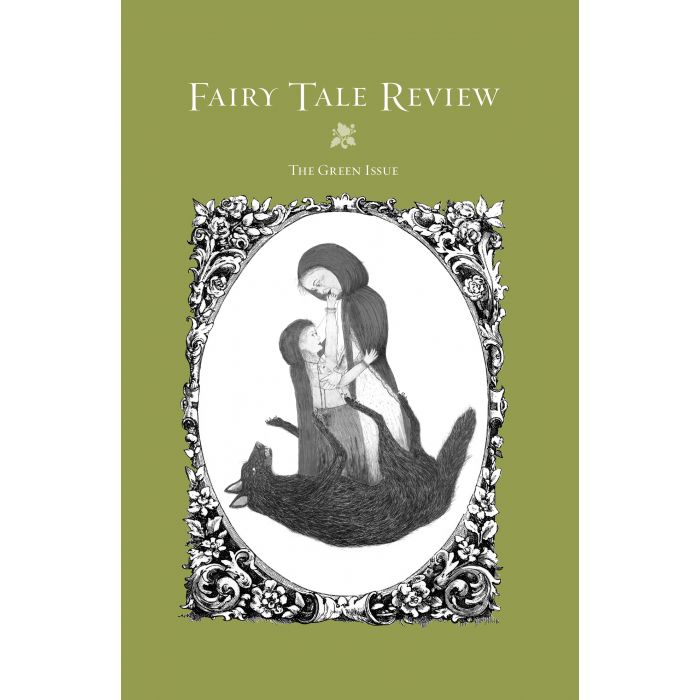

[← Back to the Catalogue](../CATALOGUE.md)

# Fairy Tale Review Vol 2 The Green Issue (Bernheimer ed) - Tartt translation of Rimbaud Four Poems from Les Illuminations (★ first documented Tartt translation)

Introductions & Contributions · item `CON-019`

### Reference details
| Field | Value |
|---|---|
| Work | Introductions & Contributions |
| Section | §7.22 |
| Edition | Fairy Tale Review Vol 2 The Green Issue (Bernheimer ed) - Tartt translation of Rimbaud Four Poems from Les Illuminations (★ first documented Tartt translation) |
| Country | US |
| Language | EN |
| Publisher | Fairy Tale Review (later WSU Press distribution) |
| Year | 2006 |
| ISBN-13 | 9780817355012 |
| ISBN-10 | 0817355014 |
| Status | have |

📖 **Full reference entry:** [§7.22 in the Collector's Reference](../Donna_Tartt_Collectors_Reference.md#722-tartt-translation--four-poems-from-les-illuminations-by-arthur-rimbaud-fairy-tale-review-vol-2-the-green-issue-2006)

🔗 **Read the original:** [shop.prod.wayne.edu](https://shop.prod.wayne.edu/wsupjournals/wsupjournals/fairy-tale-review/fairy-tale-review-back-issues/the-green-issue.html)

### Full text

Bottom
La réalité étant trop épineuse pour mon grand caractère,—je me trouvai néanmoins chez ma dame, en gros oiseau gris-bleu s’essorant vers les moulures du plafond et traînant l’aile dans les ombres de la soirée.
Je fus, au pied du baldaquin supportant ses bijoux adorés et ses chefs-d’oeuvre physiques, un gros ours aux gencives violettes et au poil chenu de chagrin, les yeux aux cristaux et aux argents des consoles.
Tout se fit ombre et aquarium ardent.
Au matin,—aube de juin batailleuse,—je courus aux champs, âne, claironnant et brandissant mon grief, jusqu’à ce que les Sabines de la banlieue vinrent se jeter à mon poitrail.
Bottom
Reality being entirely too spiny and thorny for my grand character,—I found myself nonetheless at my lady’s house, where I became an enormous gray-blue bird flying near the ceiling and trailing my wings in the shadow of the evening.
At the foot of the baldechin supporting her beloved jewels, her physical masterpieces: I was a bear with violet gums, my fur gone white with sorrow, my eyes on the crystal and silver in the consoles.
All grew shadowy like a glowing aquarium.
At dawn,—embattled June morning,—I ran to the fields, an ass, braying and brandishing my grief about, until the Sabines came in from the suburbs to fling themselves upon my breast.
Being Beauteous
Devant une neige un Etre de Beauté de haute taille. Des sifflements de mort et des cercles de musique sourde font monter, s’élargir et trembler comme un spectre ce corps adoré; des blessures écarlates et noires éclatent dans les chairs superbes. Les couleurs propres de la vie se foncent, dansent, et se dégagent autour de la Vision, sur le chantier. Et les frissons s’élèvent et grondent, et la saveur forcenée de ces effets se chargeant avec les sifflements mortels et les rauques musiques que le monde, loin derrière nous, lance sur notre mère de beauté,—elle recule, elle se dresse. Oh! nos os sont revêtus d’un nouveau corps amoureux.
O la face cendrée, l’écusson de crin, les bras de cristal! le canon sur lequel je dois m’abattre à travers la mêlée des arbres et de l’air léger!
Being Beauteous
An Ideal of Beauty, standing tall before snow. Whistles of death, circles of deafened music make this adored body rise, swell, shudder like a ghost; scarlet wounds and black burst out in the superb flesh. The colors of life darken, dance, whirl away and around the Vision, out in the timber-yard. And the shudders rise and groan, and the strong taste of these effects is charged with the mortal whistlings and the raucous music which the world, far behind us, throws to our mother of beauty—she draws back, she draws herself up. Oh! our bones are dressed up again with a new and amorous body.
*   *   *
O the ash-whitened face, the horsehair coat-of-arms, the embrace of crystal! the cannon on which I must fling myself across the fray of trees, the giddy air!
Vies
I
O les énormes avenues du pays saint, les terrasses du temple! Qu’a-t-on fait du brahmane qui m’expliqua les Proverbes? D’alors, de là-bas, je vois encore même les vieilles! Je me souviens des heures d’argent et de soleil vers les fleuves, la main de la campagne sur mon épaule, et de nos caresses debout dans les plaines poivrées.—Un envol de pigeons écarlates tonne autour de ma pensée.—Exilé ici, j’ai eu une scène où jouer les chefs-d’oeuvre dramatiques de toutes les littératures. Je vous indiquerais les richesses inouïes. J’observe l’histoire des trésors que vous trouvâtes. Je vois la suite! Ma sagesse est aussi dédaignée que le chaos. Qu’est mon néant, auprès de la stupeur qui vous attend?
II
Je suis un inventeur bien autrement méritant que tous ceux qui m’ont précédé; un musicien même, qui ai trouvé quelque chose comme la clef de l’amour. A présent, gentilhomme d’une campagne aigre au ciel sobre, j’essaye de m’émouvoir au souvenir de l’enfance mendiante, de l’apprentissage ou de l’arrivée en sabots, des polémiques, des cinq ou six veuvages, et quelques noces où ma forte tête m’empêcha de monter au diapason des camarades. Je ne regrette pas ma vieille part de gaieté divine: l’air sobre de cette aigre campagne alimente fort activement mon atroce scepticisme. Mais comme ce scepticisme ne peut désormais être mis en oeuvre, et que d’ailleurs je suis dévoué à un trouble nouveau,—j’attends de devenir un très méchant fou.
III
Dans un grenier où je fus enfermé à douze ans j’ai connu le monde, j’ai illustré la comédie humaine. Dans un cellier j’ai appris l’histoire. A quelque fête de nuit dans une cité du Nord j’ai rencontré toutes les femmes des anciens peintres. Dans un vieux passage à Paris on m’a enseigné les sciences classiques. Dans une magnifique demeure cernée par l’Orient entier j’ai accompli mon immense oeuvre et passé mon illustre retraite. J’ai brassé mon sang. Mon devoir m’est remis. Il ne faut même plus songer à cela. Je suis réellement d’outre-tombe, et pas de commissions.
Lives
I
O the enormous avenues of the Holy land, the terraces of the temple! What happened to the Brahmin who taught me the Proverbs? From then, from out there, I see even now the old women! I remember hours of silver and sun by the rivers, my playmate’s hand on my shoulder, our caresses as we stood on the pepper-scented plains.—A volley of scarlet pigeons thunders around my thoughts.—Exiled here, I have had a stage on which to play the dramatic masterworks of all nations. I could tell you about unimaginable riches. I examine the history of the treasures that you found. I see what comes! My wisdom is rejected as chaos. And what is my own emptiness, compared with the stupor that awaits you?
II
I am an inventor far more deserving than all those who have gone before me; a musician even, who has discovered something very like the key of love. At present, a noble of a bitter land with a sober sky, I try to move myself with the memory of my mendicant childhood, the apprenticeship where I arrived in wooden shoes, over my polemics, five or six bereavements, several wild nights where my strong head kept me from rising to the same high pitch as my companions. I don’t miss what I once had of that divine gaiety; the sober air of this harsh countryside is food for my atrocious skepticism. But since this skepticism can no longer be put to work, and since besides I am now devoted to a new kind of trouble—I expect to become a very vicious madman.
III
In an attic where they locked me up when I was twelve I knew the world, I illustrated the human comedy. In a wine-cellar I learned history. At some 
fête de nuit
 in a Northern city, I met all the wives of the old Flemish masters. In an old Parisian back street I was taught the classical sciences. In a magnificent abode surrounded by all the Orient I finished my immense work and passed into illustrious retirement. I have stirred and braced my blood. My duties have released me. I must no longer even dream of all that. I really am from beyond the grave, and without obligations.
Phrases
Quand le monde sera réduit en un seul bois noir pour nos quatre yeux étonnés,—en une plage pour deux enfants fidèles,—en une maison musicale pour notre claire sympathie,—je vous trouverai.
Qu’il n’y ait ici-bas qu’un vieillard seul, calme et beau, entouré d’un “luxe inouï,”—et je suis à vos genoux.
Que j’aie réalisé tous vos souvenirs,—que je sois celle qui sait vous garrotter,—je vous étoufferai.
Quand nous sommes très forts,—qui recule? très-gaies,—qui tombe de ridicule? Quand nous sommes très-méchants,—que ferait-on de nous?
Parez-vous, dansez, riez.—Je ne pourrai jamais envoyer l’Amour par la fenêtre.
Ma camarade, mendiante, enfant monstre! comme ça t’est égal, ces malheureuses et ces manoeuvres, et mes embarras. Attachetoi à nous avec ta voix impossible, ta voix! unique flatteur de ce vil désespoir.
Une matinée couverte, en juillet. Un goût de cendres vole dans l’air;—une odeur de bois suant dans l’âtre,—les fleurs rouies,—le saccage des promenades,—la bruine des canaux par les champs,—pourquoi pas déjà les joujoux et l’encens?
J’ai tendu des cordes de clocher à clocher; des guirlandes de fenêtre à fenêtre; des chaînes d’or d’étoile à étoile, et je danse.
Le haut étang fume continuellement. Quelle sorcière va se dresser sur le couchant blanc? Quelles violettes frondaisons vont descendre?
Pendant que les fonds publics s’écoulent en fêtes de fraternité, il sonne une cloche de feu rose dans les nuages.
Avivant un agréable goût d’encre de Chine, une poudre noire pleut doucement sur ma veillée.—Je baisse les feux du lustre, je me jette sur le lit, et, tourné du côté de l’ombre, je vous vois, mes filles! mes reines!
Phrases
Some day, when the world boils down to a single black wood for our four astonished eyes,—to one beach for two faithful children,—to one musical house for our clear harmony,—I will find you.
When there is nobody left on earth but a single old man, calm and beautiful, surrounded by unimaginable luxury,—then I am at your knees.
When I have cashed in all your memories—when I am the girl who knows how to slip the garrotte around your neck—then I will strangle you.
When we are most fierce—who draws back? most merry, who falls down laughing? When we are very bad, what can they do to us?
Dress yourself up, dance, laugh.—I could never throw Love out the window.
My playmate, beggar-girl, monster child! it’s all the same to you, these wretched women and their schemes, my embarassment. Join yourself to us with your impossible voice, your voice! sole flatterer of this vile despair.
Overcast morning, in July. A taste of ashes floats in the air,—a smell of damp wood in the hearth,—the mildewed flowers,—the devastation of the promenades—drizzle over the canals in the fields,—why not already toys and incense?
I strung ropes out from steeple to steeple; garlands from window to window; gold chains from star to star; and I dance.
The high lake smokes continually. What sorceress will rise up against the white sunset? What violet fronds will drift down?
As the public funds roll away in brotherly celebration, a bell of rose-pink fire rings in the clouds.
Sparking up a pleasant taste of Chinese ink, a black powder rains down softly on my evening hours. I lower the flame of the chandelier, I throw myself on the bed, and, turning my face to the shadows, I see you, my daughters! my queens!

Source: <code>assets/sources/archive/excerpts/Tartt-Rimbaud-FourPoems-FTRv2-2006-pp128-135.md</code> — regenerated by <code>scripts/build_catalogue.py</code>.

### Sources & documents held

_No primary-source scan is held for this item yet — see the reference entry and the cited source above._

---
[← Back to the Catalogue](../CATALOGUE.md)
