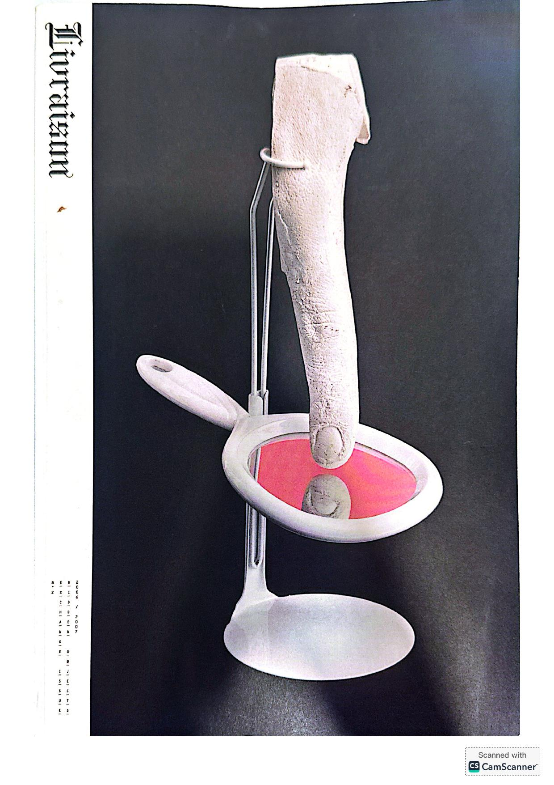
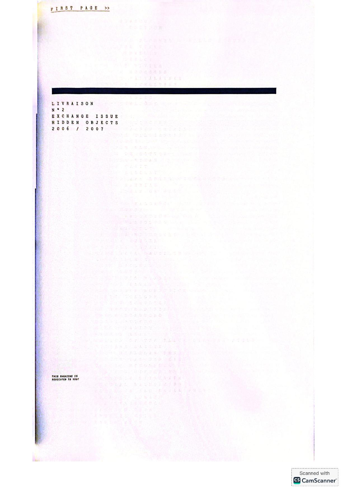
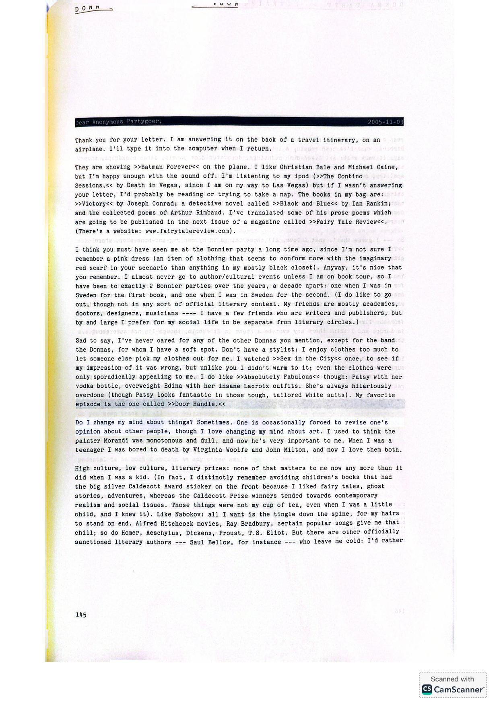
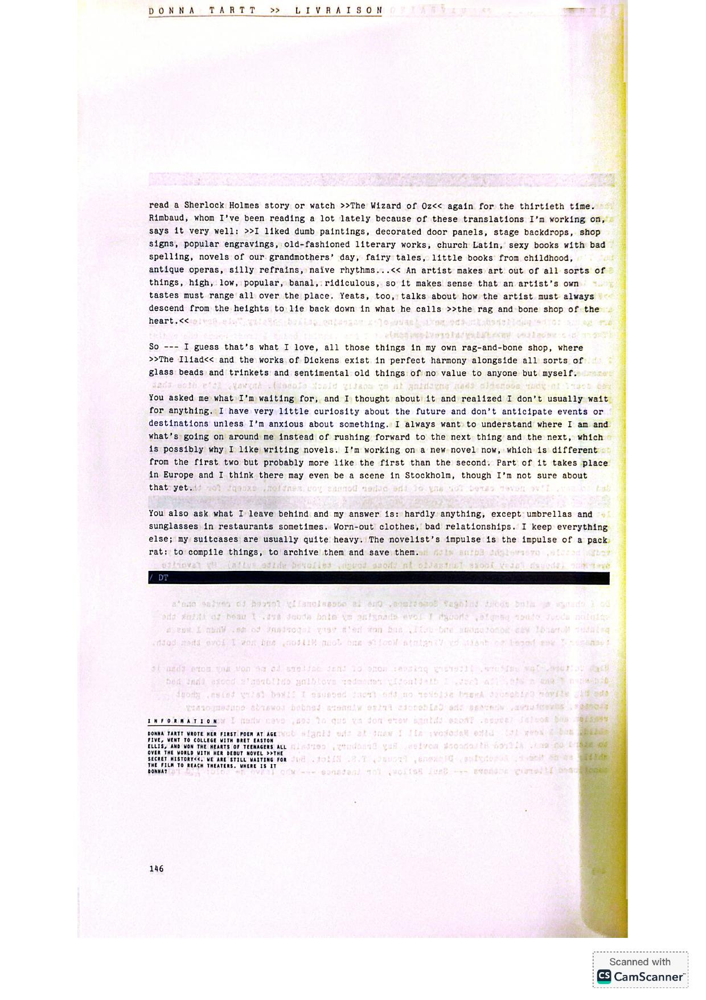
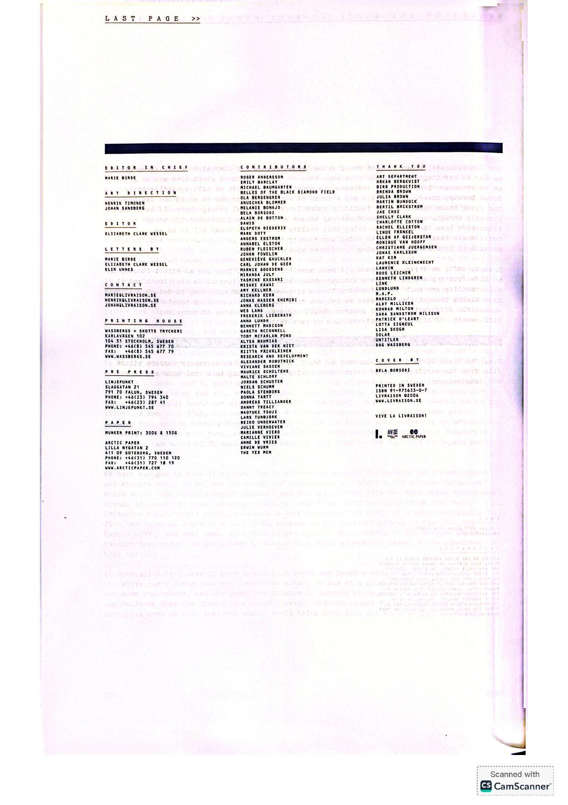

[← Back to the Catalogue](../CATALOGUE.md)

# Livraison N°2 (Marie Birde ed Stockholm 2006-2007) - NEW DISCOVERY Tartt letter (themed letter-writing issue)

Introductions & Contributions · item `CON-024`

### Reference details
| Field | Value |
|---|---|
| Work | Introductions & Contributions |
| Section | §7.27 |
| Edition | Livraison N°2 (Marie Birde ed Stockholm 2006-2007) - NEW DISCOVERY Tartt letter (themed letter-writing issue) |
| Country | SE |
| Language | EN |
| Publisher | Livraison Stockholm |
| Year | 2006 |
| ISBN-13 | 9197563307 |
| ISBN-10 | 9197563307 |
| Status | have |

📖 **Full reference entry:** [§7.27 in the Collector's Reference](../Donna_Tartt_Collectors_Reference.md#727-tartt-letter--livraison-n2-marie-birde-ed-stockholm-20062007--themed-letter-writing-issue)

🔗 **Read the original:** [livraison.se](https://www.livraison.se/) · [dashwoodbooks.com](https://dashwoodbooks.com/pages/books/19626/livraison-no-2) · [bokborsen.se](https://www.bokborsen.se/view/-/Livraison-Private-Issue-No-1-This-Magazine-I/6192082) · [openbookcollectibles.com](https://www.openbookcollectibles.com/shop/p/livraison-magazine-1-private-issue)

### Full text

_No machine-readable text available — the original is reproduced here as page scans:_

### Sources & documents held

_No primary-source scan is held for this item yet — see the reference entry and the cited source above._

---
[← Back to the Catalogue](../CATALOGUE.md)
