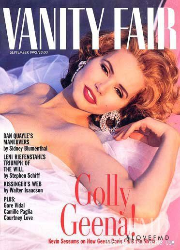

[← Back to the Catalogue](../CATALOGUE.md)

# Vanity Fair September 1992 - Smart Tartt by Kaplan

Press & Ephemera · item `EPH-001`

### Reference details
| Field | Value |
|---|---|
| Work | Press & Ephemera |
| Section | §8.1 |
| Edition | Vanity Fair September 1992 - Smart Tartt by Kaplan |
| Country | US |
| Language | EN |
| Publisher | Vanity Fair / Condé Nast |
| Year | 1992-09 |
| Status | have |

📖 **Full reference entry:** [§8.1 in the Collector's Reference](../Donna_Tartt_Collectors_Reference.md#81-vanity-fair-september-1992--smart-tartt-by-james-kaplan)

### Full text

Smart Tartt

by James Kaplan, Vanity Fair, September 1992

Every so often a first-novelist leaps out of the fray and into the literary spotlight. But unlike the apocalyptic eighties generation, Donna Tartt recalls a more romantic tradition: a privately idiosyncratic T.S. Eliot freak with a southern-gothic past who this month publishes her hotly awaited highbrow chiller, The Secret History . James Kaplan reports
Donna Tartt, who is going to be very famous very soon - conceivably the moment you read this - also happens to be exceedingly small. Teeny, even. "I'm the exact same size as Lolita," she says. "Do you remember that poem from the novel?" She recites,

Wanted, wanted: Dolores Haze
Her dream-gray gaze never flinches.
Ninety pounds is all she weighs
With a height of sixty inches.

We're sitting over a country breakfast in Smitty's, a homey cafe in Oxford, Mississippi - site of the university, Ole Miss, and hometown of another Mississippi writer, name of Faulkner. Who may have won a Nobel, but whose books never, in his lifetime, made anything like the commercial splash Donna Tartt has already made with her first novel, The Secret History , published this month by Knopf.

Tartt taps her Marlboro Gold on the ashtray. She is kind of girl-boy-woman in her lineaments, with lunar-pale skin, spooky light-green eyes, a good-size triangular nose, a high, pixieish voice. With her Norma Desmond sunglasses propped on her dark bobbed hair, her striped boy's shirt and shorts from Gap Kids (the only store whose ready-to-wear fits her), and her ever-present cigarette, she is, somehow, a character of her own fictive creation: precocious sprite from a Cunard Line cruise ship, circa 1920-something. A Wise Child out of Salinger.

"I know a ton of poetry by heart," Tartt says, when I comment on her recital of the Nabokov rhyme. It's true. She has an alarming ability to simply break into passages, short or long, from her favorite writing. She quotes, freely and naturally, from Thomas Aquinas, Cardinal Newman, Buddha, and Plato - as well as David Byrne of Talking Heads and Jonathan Richman of the Modern Lovers. And many others.

"When I was a little kid, first thing I memorized were really long poems by A.A. Milne," she says. "Then I went through a Kipling phase. I could say 'Gunga Din' for you. Then I went into sort of a Shakespeare phase, when I was about in sixth grade. In high school, I loved loved loved Edgar Allan Poe. Still love him. I could say 'Annabel Lee' for you now. I used to know even some of the shorter stories by heart. 'The Tell-Tale Heart' - I used to be able to say that.

"I still memorize poems," she says. "I know 'The Waste Land' by heart. 'Prufrock.' Yeats is good. I know a lot of poems in French by heart. A lot of Dante. That's just something that has always come easily to me. I also know all these things that I was made to learn. I'm sort of this horrible repository of doggerel verse."

Donna Tartt seems, in many ways, a figure from another decade: a small, hard-drinking, southern writer, a Catholic convert, witheringly smart, with an occluded past, sadness among the magnolias. Wasn't that Flannery? Or Carson? Or Truman, or Tennessee? Surely not a figure from the post-MTV generation. Yet here she is, not yet thirty, coming out of obscurity in Greenwich Village - where she lives with a cockatiel, Horace, and a pug, Pongo (and no television) - into supernova-hood, weighing in among the serious contenders. For The Secret History is, amid its vast entertainingness, an extremely serious book: a book whose very essence is the survival of formality in a formality-starved era.

It's commercially serious, too. In early 1989, Tartt's Bennington classmate and friend Bret Easton Ellis introduced her and her project (it was three-quarters done; she had an outline of the rest) to his agent, ICM honcho Amanda Urban. This was more than a favor: Ellis had been reading the novel as it progressed, for six years, since he and Tartt were in their second year at college. He thought she had the goods. So did Urban. "She said, 'My god, it's incredibly well written - I couldn't stop turning the pages,'" Ellis recalls.

Urban accepted Tartt as an unsigned client; two years later, with the completed (866-page) manuscript in hand, Urban was able to whip up a bidding frenzy among several publishing houses. The winner, Knopf, paid $450,000 for the book (which it made back almost immediately, and then again, in foreign sales). Shortly thereafter, Alan Pakula's Pakula Productions paid another large sum for the privilege of attempting to turn the book into a motion picture. This is a book that was on boil long before it even hit the stores: so great was the demand for five-hundred-page advance reader's editions of The Secret History that Knopf had to print an unprecedented second run.

What's all the fuss? This: The Secret History is about a small, singular cadre of classics students at Vermont's Hampden College (a tiny ultra-liberal, ultra-artistic school not unlike Bennington) who, for the strangest of possible reasons, slay a stranger, and then one of their own. It is a huge, mesmerizing, galloping read, pleasurably devoured in a few evenings: a book which, unlike the vast preponderance of page-turners of first novels - is gorgeously written, relentlessly erudite, and persistently (and quite anachronistically) high-minded. It is (the strangeness compounds) a murder mystery in which the two killings (and all the sex scenes) take place offstage, and in which the only mystery is why - the who, what, when, where, and how all being known virtually from the word go. " The snow in the mountains was melting and Bunny had been dead for several weeks before we came to understand the gravity of our situation. " Thus - deadpan, chockablock with beauty and portent - one of the classic first sentences of our vehemently anti-classical time.

But then, Donna Tartt is more than mildly fixated on things classical. As good a place to begin as any is the fact that she has a largish obsession, bordering on the cultic, with T.S. Eliot. The ringleader and chief malefactor in The Secret History , an eerily grave polymath called Henry Winter, comes from Eliot's hometown, St. Louis, has the same first name as Old Tom's brother, wears tiny, old-fashioned steel-rimmed glasses and "dark English suits and carries[s] and umbrella (a bizarre sight in Hampden) and . . . walk[s] stiffly through the throngs of hippies and beatniks and preppies and punks with the self-conscious formality of an old ballerina."

Tartt's answering machine message is the Man Himself, reading, solemnly, from "The Waste Land": "I see crowds of people, walking round in a ring. / Thank you. If you see dear Mrs. Equitone, / Tell her I bring the horoscope myself: / One must be so careful these days."

Indeed. Like Eliot, and like another idol, J.D. Salinger, Tartt is not at all averse to interest in her work. Period. When it comes to the perky, personal, prying tone of our time, her reservations are grave. The title of her book is not without autobiographical meaning. Her skittishness about being interviewed is formidable. But as Bret Easton Ellis (the co-dedicatee of The Secret History ) will later tell me, with the rueful tone of One Who Knows, "You can't be Salinger and be represented by ICM."

One can do one's best, however.

Grenada, Mississippi, sits astride the Yalobusha River at the eastern fringe of the Delta, a sleepy sunstruck southern town like many other southern towns, with a dead railroad depot (Illinois Central), a moribund square (where the Confederate monument still stands), and, outside of what used to be the center of things, two miles of new strip lined with bright prefab despair. Off the strip, time moves like molasses: children play in the dirt, big rusting Fords sit under carports, the kudzu creeps. In June, the air is like a hot sponge; the radio plays seventies rock and commercials for boll-weevil poison. Grenada is a town of small distinction, Mississippi-generic. It has produced a Miss Teen U.S.A. Mr. Borden, of Borden's milk, used to keep his polo ponies here. There was a yellow-fever epidemic in the nineteenth century. The Old Families die out or move on, or stay and gather moss. One of them, the Boushes, produced Donna Tartt's mother; her father's people were newer blood.

Don Tartt was an upwardly mobile small-town operator who went from working in a grocery store to owning a freeway service station to becoming a successful local politician. At one point he was president of the Grenada County Board of Supervisors. He and his wife, Taylor, a secretary for much of the time they were married, stayed together for two decades - on the evidence, not happy ones. They produced two daughters; the elder showed unsettling signs of precocity.

At an age when most girls her age were reading Misty of Chincoteague , Donna Tartt idolized Heinrich Schliemann, genius linguist and excavator of Troy. "When I was little," she says, "my grandmother gave me this book about archaeology, which was my favorite thing in the world. It was not a child's book. When I graduated from high school, one of the girls I had been in kindergarten with had brought a tape recorder to our kindergarten graduation. At Miss Doty's Kindergarten for Girls. They made us all stand and say what we wanted to be when we grew up. And when it was my turn, it was exactly my voice, except it was much higher-pitched. And I said, 'My name is Donna Louise Tartt, and when I grow up, I should like to be an ar-chae-ologist.' I was the only child that said should - all the other children said would . It was starting even then. Child is father to the man."

Memphis, a hundred miles north, may have been the big city, but Oxford, only half that distance away, was her beacon, especially during her adolescent years, when her insatiable hunger for learning had exhausted the resources of the Elizabeth Jones Library. Oxford had a good bookstore, and after shopping for shoes with her mother at Neilson's, she would pursue her self-education. She read and read, and listened.

"Something I think you're very conscious of growing up in the South is people who speak correctly and people who don't," she says. "George Orwell said, 'Englishmen are all branded on the tongue.' It's the same for southerners. I grew up around people who had wonderful, mellifluous voices; there's also that twangy cracker accent. And then you were also aware of black English. And the fourth thing that I was sort of hyper -aware of was - my mother read to me a lot when I was a little girl. The first book she ever read to me was The Wind in the Willows , which I still like. I read a lot of English children's books. And I was very conscious of the fact that Rat and Mole didn't talk the way that my mother talked, or that our housekeeper talked, or that my friends at school talked. I thought literature was English. Books seemed to speak to me in English accents."

She wrote her first poem at age five, lying on her stomach in front of the TV; she had to wait eight more years to be published, with a sonnet in a Mississippi literary review. By the time she was in high school, she was churning out the words in a promiscuous frenzy, winning prizes for her essays on patriotism and the dangers of alcohol, writing short stories about death. Then came college.

"Fall of '81 came here, seventeen years old, looked like I was about twelve," she says. "And acted like I was about twelve. Went through rush my first week, and pledged. It was what you did, and I did it."

We're driving slowly among the neo-Colonial brick piles and live oaks and wide lawns of Ole Miss, where, surrealistically enough, hundreds upon hundreds of identically T-shirted nymphets twirl, march, and chant in sweetly hortatory voices: Mid-South Cheerleading Camp is in session. Which, surrealistically enough, Donna Tartt seems to have once attended.

We have decided to trespass in the sacred precincts, the plush powder-blue fastness of the Delta Rho chapter of the Kappa Kappa Gamma sorority at Ole Miss: Kappa House, stronghold of Southern Womanhood, inviolable and pristine. this being summer, the place is cleared out. We tiptoe and whisper nevertheless, surrounded by the rustling presences of the Debbies and Tammies and Vonda Sues, the big blonde sunny girls born to marry Rhetts and Trents and live by the golf course and raise flocks of blond children and forever hold dear the Kappa ideal ( The Kappa is not an intruder upon life. / But rather an inner presence who seems to softly and naturally emerge . . . ). This is where Donna Tartt once stuffed the Sunshine Box - which her fellow Kappas would fill with sayings on scraps of paper, epigrams dear to their hopeful hearts, apothegms of uplift, treasured mots about life and lemons and lemonade - with vile sayings by Nietzsche and Sartre. "God is dead. . . . And we have killed him." "Hell is other people."

"Everybody knew it was me," Tartt says as we sneak up from the Kappa basement. "There was this dire meeting - they told me I had to confess, 'on your honor as a woman.'" (Did she? "Of course not," she replies indignantly.)

She laughs. "Here I was, this small, dark, thoughtful person among all these towering happy blondes. I mean, if you didn't dress up like Scarlett O'Hara to go to biology class, you were a total oddball. And I was. They were embarrassed by me. Their boyfriends would see me sitting around reading Ezra Pound cantos in the rain, and ask who this person was. And they'd have to grit their teeth and say, ' Oh, she's a pledge. '

"I remember my first couple of weeks, eating in the Union by myself, reading Nietzsche. I was so happy. Not lonely. There were forty people in my graduating class in high school, and I had known them since kindergarten. You never saw anybody that you hadn't known your whole life - didn't know their whole family history. So it was very exhilarating to come here - you'd see people you didn't know, and they didn't know you.

"It seemed like it would be a good thing to work on The Daily Mississippian . I didn't really have very much in the way of newspaper articles to submit, so I gave in some short stories. And the fellow called me back into his office and said, 'These are great! These are wonderful!' And 'How old are you? Did you write these by yourself?' It was raining. And I reached in my pocket and got out this pack of Lucky Strikes. It was like, 'Oh my God - where did you come from?'

"They said, 'We can't hire you to be on the paper, but this is still really good.' So I said thank you, and went off to sit in the Union by myself, and I was happy again. But without my knowing it, the guy at the paper had given a copy of one of my stories to Willie Morris. And I was in a bar at the Holiday Inn, and Willie came up to me and gave me his hand and said, 'Are you Donna Tartt?' And I said yes. And he said, 'My name is Willie Morris , and I think you're a genius.'"

Morris - former editor of Harper's and New York literary darling, author of North Toward Home and several other autobiographical books - is part of the third wave of Mississippi writers, Faulkner and Eudora Welty representing the first and second. If the state has always been desperately poor economically, it has been loaded literarily. And Donna Tartt is a new wave all by herself.

"On the one hand she was immensely grown-up; on the other hand she was a child," says Morris, then writer-in-residence at Ole Miss. "It was a very attractive combination. She was very elfin. Kind of a sufferer - I had the impression she wasn't very happy back at home in Grenada. And just riven with sensibility. An amazing writer. I was always so impressed by her powerful and evocative use of language - it got to me right off."

"Willie told me she was very good, and, man, she sure was," says fellow third-waver Barry Hannah, who admitted Tartt, as a freshman, to his graduate short-story course. "She was way out ahead of all those graduate student." Hannah and I are sitting in the courtyard of an Oxford bar, a college hangout. Drink in one hand, Marlboro in the other, Tartt is at the other end of the table, being talked to by an intense man in a yellow suit and yellow golf hat. If she looked twelve then, she looks perhaps sixteen now. At the same time, she seems infinitely older than the college kids around us.

Inside the bar, the band crashes and booms; out here, the big frat boys and blonde coeds, their shining faces as uncomplex as the music, pack the terrace, smiling. Overhead, the purple-brown sky erupts periodically with them most amazing heat lightning I've ever seen: gigantic, reticulate, like something out of a particularly unsubtle horror movie. Mississippi summer. "People call me a star-maker," the handsome gray-haired Hannah says, sipping his tonic. "*****, Donna made herself."

Later on, Tartt and I inch our way out of the packed bar, shouldering through the crush as the amplifiers, louder than loud, imperil our eardrums. We find ourselves outdoors. Suddenly she grabs my arm and breaks into a run, pulling me along, sprinting down the sidewalk as if her life depended on it. At first I don't understand, but then I see: this is, pure and simple, escape. The silent lightning carpets the sky.

The Secret History 's narrator, Richard Papen, hails from the fictional and deadly Plano, California - "drive-ins, tract homes, waves of heat rising from the blacktop" - where his father runs a gas station and his mother is a secretary. Tartt is highly guarded (to say the least) about any relationship between the novel and her own life, but there is surely common ground between her own vision of an ornately southern girlhood amid colorful elderly aunts and wisteria-twined old houses, and Richard's accounts of staring at TV and being bored in flat Plano. One can only speculate on how it felt to arrive from Mississippi in Bennington, circa 1982, as Tartt did, after having transferred from Ole Miss at the urging of Willie Morris and others. "Hampden College, Hampden, Vermont," her book's protagonist intones. "Even the name had an austere Anglican cadence, to my ear at least, which yearned hopelessly for England and was dead to the sweet dark rhythms of little mission towns."

Richard wants to continue his studies in ancient Greek, but is told that the one man who teaches the subject - Julian Morrow, a brilliant aesthete with a possibly checkered past, once an intimate of Eliot and Pound and Orwell and Sara Murphy - is a haughty eccentric who has only five students and will accept no more. And in fact he turns Papen down for his Greek class. But then, with a Horatio Alger-esque feat of intellectual pluck, Richard impresses some of Morrow's students with his knowledge of the subject, and is accepted into the fold.

And what a fold it is! Morrow's one demand is simple: that the new student take every course with him. This is not so much a class as a cult. But who, exactly, is the leader?

His students - if they were any mark of his tutelage - were imposing enough, and different as they all were they shared a certain coolness, a cruel, mannered charm which was not modern in the least but had a strange cold breath of the ancient world: they were magnificent creatures, such eyes, such hands, such looks - sic oculos, sic ille manus, sic ora ferebat . I envied them, and found them attractive; moreover this strange quality, far from being natural, gave every indication of having been intensely cultivated. . . . Studied or not, I wanted to be like them. It was heady to think that these qualities were acquired ones and that, perhaps, this was the way I might learn them.

There is the aforementioned Henry Winter; the beautiful (and very close) southern twins Charles and Camilla Macaulay; the rich, thin, elegant neurasthenic Francis Abernathy. And then there is the doomed Bunny, Edmund Corcoran, a big "sloppy blond boy, rosy-cheeked and gum-chewing, with a relentlessly cheery demeanor" and a loud, honking voice with a Locust Valley-lockjaw upper-crust accent. Bunny is the sole nonintellectual in the bunch - in the end, in a way, this is why he is singled out and dispensed with - but otherwise he fits right in. They are all of them, Julian included, fabulous monsters: a very catalogue of Waspocratic quirk, with their pressed white shirts and dark suits and tea drinking and euchre playing and constant smoking and drinking, their insistence on using fountain pens and tossing off conversational sallies in classical Greek. They're something, this crowd - something out of Edward Gorey. There is about them more than a smack of the between-wars, oh-so-U, Fascist-friendly British elite, Sir Oswald Mosley and the lost Mitford sisters and their like. Not to mention Leopold and Loeb, and the bloody-toothed English schoolboys of Lord of the Flies . and Richard, the outlander, is their mascot and greatest admirer.

But these people do more than drink tea. Richard's admiration turns to worried awe when he learns that some members of the group, obsessed with divine madness and the losing of self, have had a bacchanal. Not just an orgy, mind you, in the sloppy post-Roman sense, but an actual mystic rite, complete with hymns, holy objects, and, at last, a sacred trance: "Torches, dizziness, singing. Wolves howling around us and a bull bellowing in the dark. The river ran white . . . the moon waxing and waning, clouds rushing across the sky. Vines grew from the ground so fast they twined up the trees like snakes." God, in the form of Dionysus, appeared to the celebrants. Certain sexual acts took place. And then, the piece de resistance , a murder. The group, finally, has become as close as close can be: united in blood.

It is Donna Tartt's ability to make us believe, utterly, in all this - at the moment of sacred insanity, we are at one with the celebrants. We would follow her tumbling, mellifluous prose anywhere. The best writers are necromancers, levitation their specialty. But it is human nature to think of mirrors and wires even at the moment of enchantment: where did these people come from?

"Hampden is not Bennington," Donna Tartt tells me, and it's tempting to believe her. We're walking around the Bennington campus on a cool gray day between terms, and even though there is about the place a certain flat creepiness consonant with the atmosphere of The Secret History , it's hard to reconcile it with the rapturous New England richness Richard Papen drinks in with all his senses. Bennington is tatty around the edges. First opened during the Depression, the school has never gotten out from behind the fiscal eight ball, despite the highest tuition costs in the country.

But it has never lacked for vitality - or decadence. Bennington in the early to mid-1980s was a pinnacle of something, a kind of omphalos of refined depravity, money and drugs and hormones and scholarship (formal and very much otherwise) all mingling in a super-sophisticated soup. Bret Ellis, who published Less than Zero after his third year at Bennington, becoming world-famous even as he flunked his courses, memorializes the milieu in his second novel, The Rules of Attraction . The school color is, of course, black. And who else but Eric Fischl would be right for designing the school pamphlet: "'Some of the chic jet-setting nihilistic Eurotrash who live off-campus, nude, standing around with dogs and fish. Welcome to Camden College -- You'll Never Be Bored.'"

This isn't Hampden College. But even in the tiny real-life society of Bennington (five hundred students) there were sets and cliques and worlds apart, worlds through which the elfin, brilliant transfer student from Mississippi moved with ease. "I had lots of friends here," Tartt says. "I was one of the few people that kind of traversed boundaries."

"She was very headstrong, and very together," Bret Ellis recalls. "There was a lot of opportunity at Bennington for almost Sybil -like self-transformation. You'd see some girl from Darien, with her Ralph Lauren blouse and her hair in a blond bob - by midterm she'd have shaved her head and be shooting up. Donna was one of the few people there who was really exotic, in that she pretty much stayed the same. I remember seeing her at a Fling into Spring party, where everybody else was in black, in her seersucker suit, with a cigarette and a gin and tonic.

"Her room was a little bit of a salon. She and I, Jill Eisenstadt. Two writers named Mark Shaw and Orianne Smith. Donna gave what were supposed to be teas, but she had this little cabinet with liquor in it. We'd get totally *****faced. Donna is the only person I know who can drink me under the table. I mean, she's this tiny person, and I'm really big, but at the end of an evening I'll be tap-dancing in the street and yodeling, and she'll be exactly the way she was at the beginning, not even slurring her words.

"Of all the people I knew well at Bennington, I knew least about her," another former classmate recalls. "She was very put-together, very controlled. One year at the end of the term, a bunch of us had been up all night for days; I remember she calmed us all down by reading aloud from P.G. Wodehouse. And Donna was always dressed . She wore what was appropriate for the hour of the day. She dressed for dinner. She liked well-tailored boys' suits. If you went to her room at four A.M. - she was an insomniac - you'd find her sitting at her desk, smoking a cigarette, wearing a perfectly pressed white shirt buttoned to the top, collar studs, trousers with a knife crease."

"She was sort of a star early on - she was a big influence on me," says the novelist Jill Eisenstadt. "There was a lot of awful writing at Bennington, but Donna's stories were very sophisticated, very mysterious, very structurally sound. She was the only person I knew who'd studied Greek and Latin, who'd read all of Proust."

"When her stories came in, nobody could say anything," Bret Ellis says. "They were flawless. People would check out literary magazines to see if she'd cribbed them from someplace. It was this very decorative hothouse prose - frilly, piss-elegant, but even if you didn't like it, very impressive. The stories always ended in death. There was one about a rich southern couple arguing as they were getting dressed for a party. There was this great one called 'The Goldfish,' about a little boy who ran away from home and drowned in a lake."

Tartt began writing the novel that would become The Secret History in her second year at Bennington. She began showing it to Ellis almost at once. "I don't know if any of this would've happened without Bret," she says now. "I started seeing it around 1983," Ellis says. "It wasn't much different at all from the way it is today."

Then, as now, the story centered on a small group of over refined classic students; only then no one had any doubts about the book's sources. Early on at Bennington, Tartt had fallen in with a small clique of literature students that clustered around Claude Fredericks, a brilliant but odd teacher who admitted few people to his classes. "I wanted to take Greek from him, but he turned me down," Jill Eisenstadt says, raising an eerie echo of The Secret History . "I always thought if you wanted to take Greek, why should anyone turn you down? I don't think he liked women."

Like Fredericks, the group was exceeding well-tailored - a startling eccentricity at Bennington, where even the children of the super-rich wore the rattiest jeans and T-shirts. Tartt was the only female in the group. Soon her friends noticed she'd exchanged skirts and dresses for trousers, and begun getting her hair cut boy-style. She also developed an intense friendship with Paul McGloin - a tall, thin, pale upperclassman with a dry, sarcastic wit, a dazzling facility for languages, and a partiality for dark suits, who reminded one classmate of a quieter William S. Burroughs.

The group kept very much to themselves. An encyclopedia entry about Bennington notes, "A close relationship between students and faculty is encouraged." Some would say this understates the case. The school has always had a hothouse atmosphere, and tutorials are the rule. "Cliques grow up around certain teachers, and the mentor relationships get very intense," an alumnus says. " Very intense. There was definitely an air of Svengali about Fredericks - it seemed to go beyond even what was normal for Bennington."

No one is suggesting human sacrifices took place. But friends noticed the changes in Tartt - who was a wonderful storyteller, but famously closemouthed when it came to her own life - and wondered whether the novel was somehow a key.

"The only really tense moment she and I ever had was in this writing tutorial where she'd brought the novel," Bret Ellis says. "It was just me and Donna and one other girl. At that point I'd read the first eighty to ninety pages of The Secret History . I thought it was beautifully written; I only had one criticism. I said, 'Here's this guy, the narrator, a freshman at college, and he has no sort of sexual feeling, no desire at all. It just doesn't seem realistic.' She gave the stoniest look I ever got. I almost wilted into my chair.

"And you couldn't say anything about Claude Fredericks in front of her," Ellis adds. "It'd be the end of the evening."

Ellis, who took one course with Fredericks and failed, paid an esoteric tribute both to the strange coterie and Tartt's nascent novel in The Rules of Attraction , referring en passant, to "that weird group of Classics majors stand[ing] by [at a party], looking like undertakers," and "that weird Classics group . . . probably roaming the countryside sacrificing farmers and performing pagan rituals." How far was his tongue in cheek? It's always hard to tell with Ellis.

As for Tartt's relationship with McGloin, "I never did get a handle on it - it didn't seem right to ask," says a friend. "They were very, very private people. The kind of people who would invite you into the drawing room, but never upstairs."

Donna Tartt has her own secret history. Her childhood in Grenada should not, must not, be talked about. Bennington places, but no Bennington people, may be associated with her book. McGloin may not be spoken to. The novel itself is a thicket of literary references and inside jokes: the narrator's surname is the same as that of the Weimar Republic chancellor who knuckled under to the Nazis: Bunny, whose real name is Edmund, has the same nickname as literary critic Edmund Wilson. The hotel where Henry and Camilla go off together, the Albemarle, has the same name as the English Channel hotel where T.S. Eliot, recuperating from a nervous breakdown, revised "The Waste Land." What does this mean? Perhaps we shouldn't over interpret - but then, maybe we shouldn't under interpret, either. When, pleased with my discovery, I point out the Albemarle correspondence to Tartt, she grows chilly. "I have nothing to say about that," she says.

The Secret History is co-dedicated to Bret Ellis and to Paul McGloin, "muse and Maecenas . . . the dearest friend I can ever hope to have in this world." Some say that Tartt and McGloin shared lodgings, in Boston and New York, after her graduation from Bennington, and that he supported her while she finished her book. "After I graduated from college, I lived with a friend who didn't make me pay rent" is all she will say. "My mother was helpful. I was in Boston, then I was in New York. I worked at a bookstore called the Avenue Victor Hugo for three months, in Boston. Then in New York I worked as an assistant to a painting teacher at Parson. I was the monitor, and I helped him in his classes."

Was the accommodating friend McGloin, who went to Harvard Law School after graduating from Bennington, and who is now a member of a Manhattan law firm? She won't tell. The one thing she allows is "Paul was very good on sloughs of despond." Of which there appear to have been several. Even though Tartt's preternaturally graceful writing style seems to have been with her almost from the beginning, there were times when the structural challenges - not to mention the demands on her energy - of constructing such a huge novel almost defeated her. "There were nights I thought, I've just wasted my life," she says.

The reward of her travail is a wonderment of a book, anachronistically rich with both intellectual and narrative wallop. As Bret Ellis puts it, mildly, "Bennington is so tolerant of any type of behavior, it seems odd that anyone who went there could write The Secret History . It's a much more traditional view of the novel than you'd think would come from there." Certainly more traditional than Less than Zero . Yet apparently Ellis's early criticism of asexuality in Tartt's book took hold, however it may have stung, for in subsequent drafts the absence magically became a subterranean presence. "I mean, this is basically a novel about repressed sexuality," she says. "There's sex all in the book, but it's really pressed down. And that's basically the plot - it's like a water pipe with weak spots, and it'll kind of explode in different places. But it's very controlled .

"It's a way of giving events back their power that have been cheapened by over-use," she says. "Because these are the most powerful things we have - there's nothing more powerful. And we sap their power every day. You know, it's better to kind of keep them in reserve for when you really need them. Well, not necessarily better . But it's a way of looking at things."

No one looks at things the way she does. To make an actual bacchanal come to life, with real force, in this day and age - and at a place like Bennington, which seems to have been one continuous bacchanal - is no small achievement. And Henry Winter is one of the most chilling characters in recent memory. Does it matter whom he's based on, and what that person is to the author? And why, Donna Tartt seems to be asking - most anachronistically - should her private life be brought into it at all?

We're driving down a dark back road in Bennington, and I suddenly wonder how fame and wealth will take her. "I'm like Huck Finn," she says. "I can be perfectly happy on no money at all. Now that I have money, my life has changed not a bit. Everybody's expecting me to buy a condo, make investments. I don't care about any of that. I like ephemera - books, clothes. Food. That's all." I ask, musingly, if she ever intends to settle down and have a family. She shakes her head firmly. " Je ne vais jamais me marier ." she says.

Suddenly she spots, with delight, a whirling flock of goldfinches. "Look at these goldfinches - do you see?" she cries. "Goldfinches are the greatest little birds, because they build their nests in the spring, a long time after all the other birds do. They're the last to settle down - they just fly around and they're happy for a long time, and just sing and play. And only when it's insanely late in the year, they kind of break down and build their nests. I love goldfinches," she sighs, huddling tinily in the big car seat. "They're my favorite bird."

Leave a Comment

CAPTCHA: Day of the month + 9 =

+ + + Comments + + +

A prescient final paragraph.

Top

Full text reproduced for non-commercial research; original source linked above. Hosted at <code>assets/sources/fulltext/EPH-001.md</code>.

### Sources & documents held

_No primary-source scan is held for this item yet — see the reference entry and the cited source above._

---
[← Back to the Catalogue](../CATALOGUE.md)
