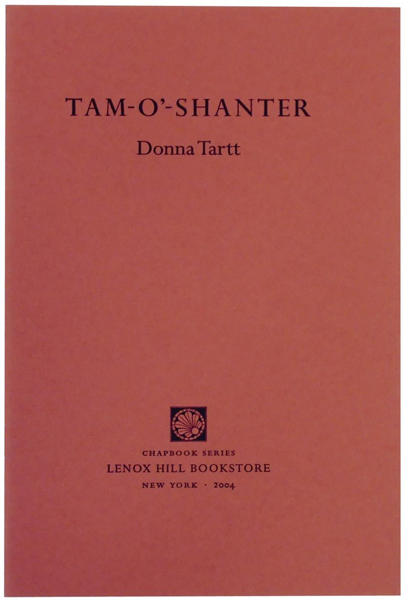

[← Back to the Catalogue](../CATALOGUE.md)

# Lenox Hill chapbook 'Tam O'Shanter' 250 copies signed 2004

Press & Ephemera · item `EPH-003`

### Reference details
| Field | Value |
|---|---|
| Work | Press & Ephemera |
| Section | §8.3 |
| Edition | Lenox Hill chapbook 'Tam O'Shanter' 250 copies signed 2004 |
| Country | US |
| Language | EN |
| Publisher | Lenox Hill Bookstore |
| Year | 2004 |
| Status | have |

📖 **Full reference entry:** [§8.3 in the Collector's Reference](../Donna_Tartt_Collectors_Reference.md#83-lenox-hill-bookstore-signed-limited-chapbook-program-2004)

### Full text

_No full text is held for this item. See the reference entry above and the cited source._

### Sources & documents held

_No primary-source scan is held for this item yet — see the reference entry and the cited source above._

---
[← Back to the Catalogue](../CATALOGUE.md)
