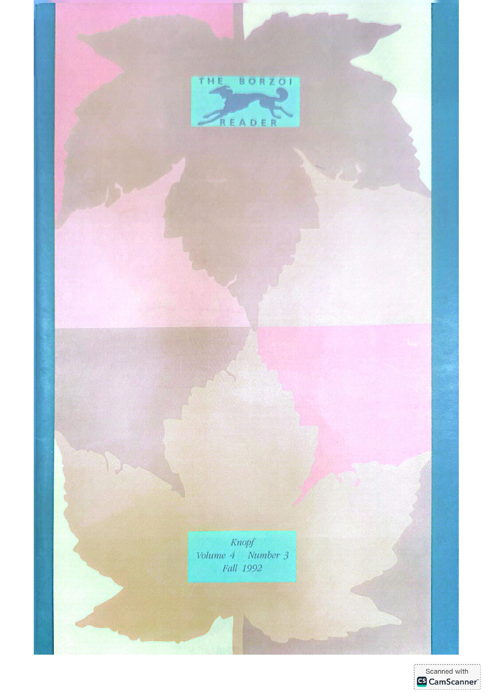
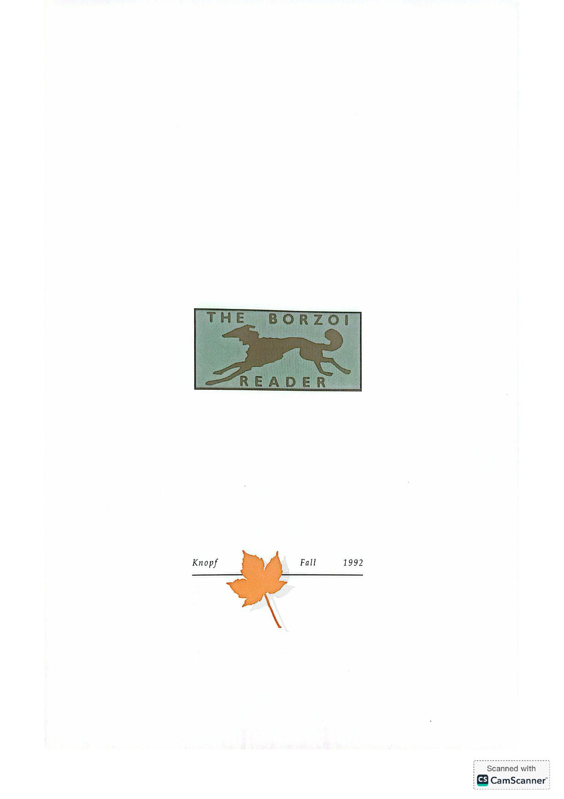
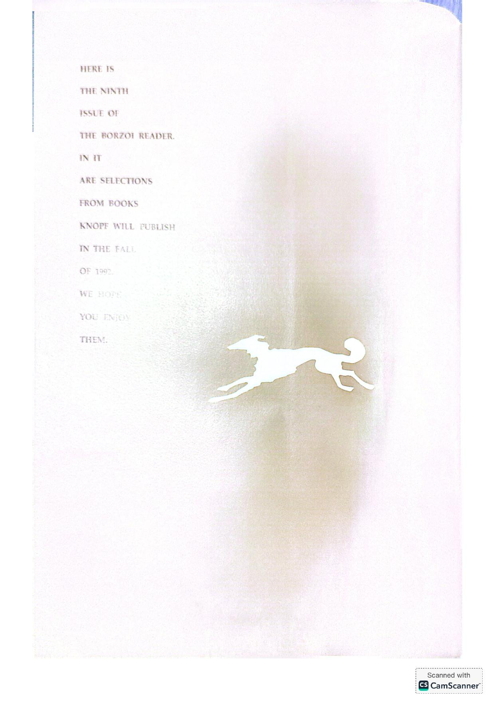
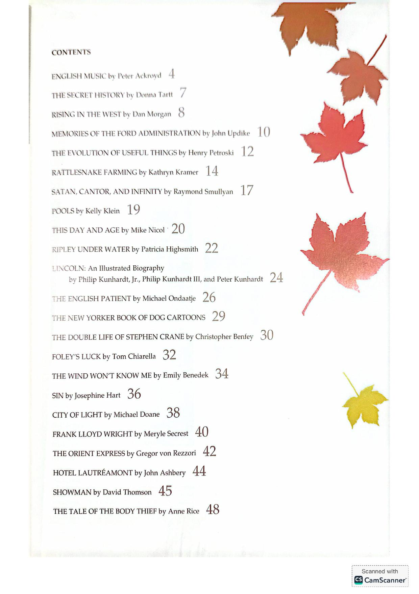
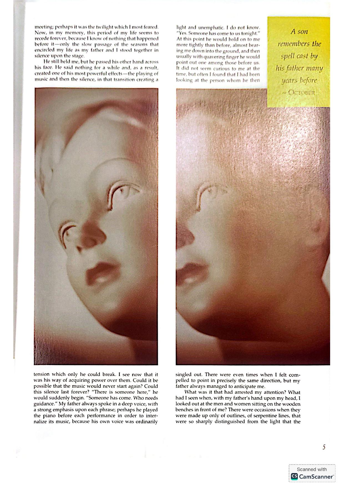
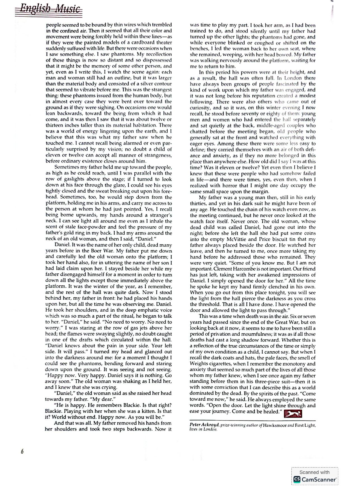
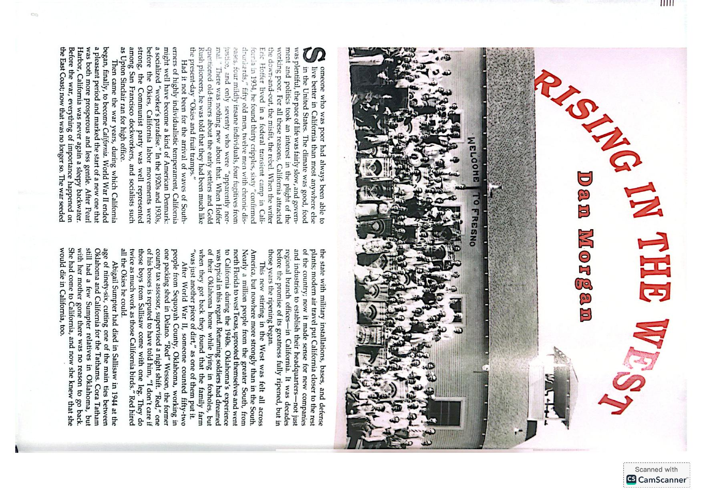
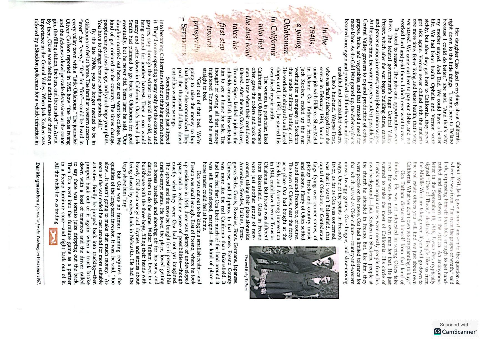
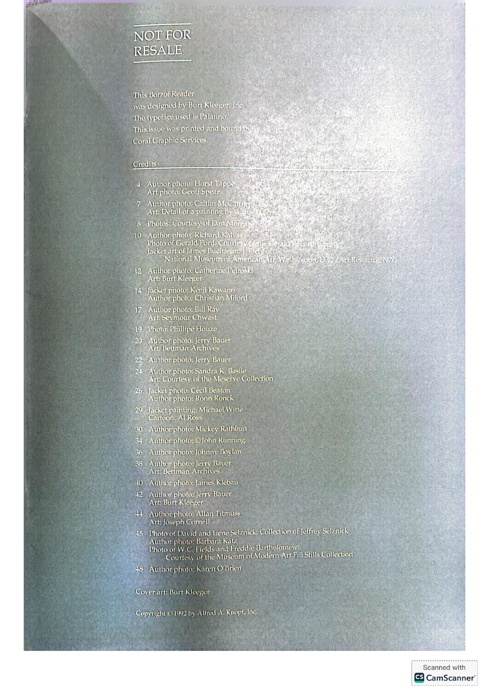

[← Back to the Catalogue](../CATALOGUE.md)

# Borzoi Reader Vol 4 No 3 Fall 1992 (Knopf seasonal catalog with TSH pre-pub excerpt p. 7)

Press & Ephemera · item `EPH-009`

> **Cover missing** — no cover image is held for this item yet.

### Reference details
| Field | Value |
|---|---|
| Work | Press & Ephemera |
| Section | §8.5 |
| Edition | Borzoi Reader Vol 4 No 3 Fall 1992 (Knopf seasonal catalog with TSH pre-pub excerpt p. 7) |
| Country | US |
| Language | EN |
| Publisher | Alfred A. Knopf |
| Year | 1992 |
| Status | have |

📖 **Full reference entry:** [§8.5 in the Collector's Reference](../Donna_Tartt_Collectors_Reference.md#85-the-borzoi-reader-vol-4-no-3-fall-1992--knopf-seasonal-catalog-with-tsh-pre-publication-excerpt)

### Full text

_No machine-readable text available — the original is reproduced here as page scans:_

### Sources & documents held

- [BorzoiReader Vol4No3 Knopf Fall1992 CamScanner full12pp](../assets/sources/press_primary/BorzoiReader-Vol4No3-Knopf-Fall1992-CamScanner-full12pp.pdf) (PDF)

Primary-source captures cited for this section of the reference. PDFs and images open in GitHub's viewer; `.webarchive` files download.

---
[← Back to the Catalogue](../CATALOGUE.md)
