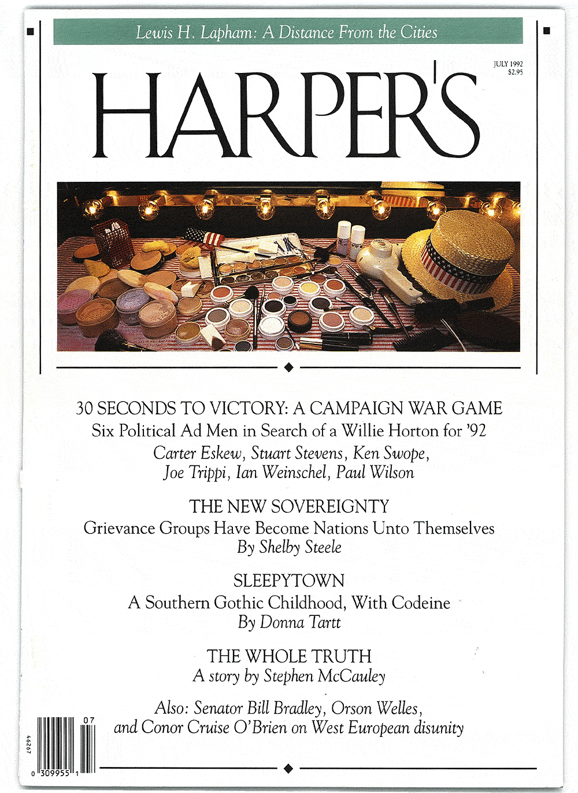

[← Back to the Catalogue](../CATALOGUE.md)

# Harper's July 1992 - Sleepytown

Short Fiction · item `MAG-001`

### Reference details
| Field | Value |
|---|---|
| Work | Short Fiction |
| Section | §5.1 |
| Edition | Harper's July 1992 - Sleepytown |
| Country | US |
| Language | EN |
| Publisher | Harper's Magazine |
| Year | 1992-07 |
| Status | have |

📖 **Full reference entry:** [§5.1 in the Collector's Reference](../Donna_Tartt_Collectors_Reference.md#51-sleepytown-a-southern-gothic-childhood-with-codeine)

🔗 **Read the original:** [harpers.org](https://harpers.org/archive/1992/07/sleepytown/) · [languageisavirus.com](https://www.languageisavirus.com/donna-tartt/short-fiction-sleepytown.php)

### Full text

### Sleepytown: A Southern Gothic Childhood, with Codeine by Donna Tartt
Harper's Magazine, 286, July 1992, 60-66

A case in point is a piece she wrote in 1992 called A Southern Gothic Childhood, With Codeine. Originally published by Harper's magazine as a memoir, it later turned up in The Penguin Book of New American Voices renamed Sleepytown and rebranded as fiction. When I start to ask about this, Tartt, quite narked, cuts in. "That is a short story. It is a short story. It's a short story. I was very upset when it appeared in Harper's with the designation 'memoir'. It's a short story. It's a short story." So it's largely untrue then? Typically, she shields herself from this straight question with a literary reference, directing me to the similarities between the short story collection Nabokov's Dozen and his autobiography Speak, Memory. "If you are reading his autobiography you see very clear elements of these stories of Russian childhood," she concludes. "But, you know, he chooses to call them stories. And Sleepytown is a story. I'm glad you asked me that. I'm glad to clear that up.
Donna Tartt. (2002, November). Peter Ross. The Sunday Herald. https://peterross.scot/articles/donna-tartt/

I remember my great-grandfather-who was born fourteen years before the end of Queen Victoria's reign, and who was therefore Victorian not only by temperament but by statute as well-once saying that Thomas De Quincey was the greatest prose stylist in the English language. He was given to proclamations like that, usually announced loudly in the midst of some entirely unrelated conversation: the greatest Natural Wonder of the World, say, or the greatest book in the Bible. These recipients of his favor happened to change as the mood struck him; Dickens, for instance, and James Fenimore Cooper being on other occasions bestowed the prose stylist's laurel. I was ten at the time, and aware of both Dickens and Cooper (it was hard, in our household, not to be aware of Dickens, as my great-grandfather spoke of Dickens frequently and in a manner that led one to believe he had been personally acquainted with him), but De Quincey was a mystery. Though there were plenty of books in our house, there were none by him. I supposed that they had been lost, along with other lamented articles, either in one of my great-grandparents' moves or in the big fire at the old house, an event that occurred thirty years before my birth and that had assumed, in my imagination, the importance of the burning of the library at Alexandria.

Three years later I happened to run across a copy of Confessions of an English Opium-Eater, in the college apartment of one of my older cousin's hippie friends. It was the end of term; I had come along with my aunt and uncle to fetch my cousin from school, and my cousin, who was seven years older than me and took a perverse and active interest in my corruption, had invited me to come inside with him, ostensibly to say good-bye to the hippie friend but actually to smoke pot, while Aunt and Uncle waited trustfully in the car. Though I was more than willing to be corrupted-and would have been heartbroken if my cousin, whom I idolized, had left me outside with his parents-I was both unused to pot and shy around the friend, who had a beard and scared me. Another guy was there, whom I didn't know, and a couple of girls. Wretchedly stoned after three or four awkward puffs, I left them all sitting on the living room floor-chatting, still passing the reefer around, apparently unaffected-and wandered speechlessly around the apartment. I found myself in a room that was empty except for a stack of books and some record albums. The records were predictable (Abbey Road, Are You Experienced?) and so were the books, except for the Thomas De Quincey. I sat down on the floor and looked at it. It was, to me, pretty much incomprehensible. But there were pictures, black-and-white engravings-of Chinese dragons screaming through the London skies and enormous bat wings spread over the sooty roof of St. Paul's-which struck a dim, sweet chord in my imagination. Overtly sinister, they were also oddly soothing, like the certain nightmare from childhood which had grown so familiar that-when I found myself standing on the windswept dream-hillside where it invariably began-I was somehow strangely comforted, because I always knew exactly what was going to happen. I looked at the pictures for a long time. Then my cousin came to find me and dragged me out to the car, where I sat very still on the drive home and tried not to act weird, as my unsuspecting aunt and uncle talked loudly in the paranoid, vibrating silence.

"O just, subtle, and mighty opium!" says De Quincey, "...thou buildest upon the bosom of darkness, out of the fantastic imagery of the brain, cities and temples, beyond the art of Phidias and Praxiteles-beyond the splendor of Babylon and Hekatompylos; and, 'from the anarchy of dreaming sleep,' callest into sunny light the faces of long-buried beauties, and the blessed household countenances, cleansed from the 'dishonors of the grave.'"

It might seem strange that my Victorian great-grandfather, who frowned even upon the innocent diversion of movie-going, could admire an author who described so winningly this far more vicious pleasure. But in spite of, perhaps even because of, his upbringing, he had a nearly unlimited faith in the magic of Pharmacy. He was fond of relating horror stories of the Confederacy, of nicks and blisters turning into septic poisoning ("One bottle of rubbing alcohol!" he would say dramatically. "One bottle of rubbing alcohol could have saved hundreds of those boys!"), or of simple surgical procedures leading to shock and needless fatality because of the deadly shortage of morphine. (To this day, one of the most moving scenes for me in the film of Gone With the Wind is the scene at the Atlanta railroad depot, where poor Dr. Meade is surrounded by thousands of Confederate wounded: no morphine, no bandages, no chloroform, nothing.)

My great-grandfather's own mother had died, when he was a boy, a wrenching and terrible death from some illness now easily cured by penicillin; in later life, he had unwavering faith in the supernatural powers of this drug, which in the end proved to be his undoing. Though he had been repeatedly warned not to, in the last years of his life he dosed himself almost constantly with antibiotics, whether there was anything the matter with him or not. These antibiotics were readily supplied to him-as was just about any drug in our town, to just about anybody-upon request, by local doctors and pharmacists who apparently believed that since my great-grandfather was an intelligent man, and well thought of in the community, he was therefore qualified to assume responsibility for his own medical treatment, despite his utter lack of any medical knowledge whatsoever. So he took antibiotics all the time, believing them to be a kind of healthful preventative, or nerve tonic, and over the years built up a gradual but powerful resistance, until the Easter weekend when a cold metamorphosed, unexpectedly, into pneumonia and-the pills that would have saved his mother now powerless to help him-he died.

When relatives reminisce about my great-grandfather, they almost always precede it with some reference to his affection for me. "You were his heart's own darling," they say; and, "He thought the sun rose and set on you." This was the truth. I was the product of a skittish, immature mother-Great-grandfather's youngest granddaughter, also dearly loved-and a dashing but feckless father; my parents were neither able nor inclined to take much of an interest in my early upbringing. But my mother's family-a bevy of great-aunts and grandparents-were only too glad to rush into this breach, and I spent my days and most my nights in the old house on Commerce Street, which had been bereft of children for nearly twenty years. Though most people in the advanced stages of life (the occupants of the Commerce Street house ranged in age from fifty to eighty) would have found the intrusion of a newborn infant unsettling, my arrival was apparently a source of excitement and much-needed diversion, and a bassinet was dragged from the attic, books were consulted, the milkman was advised to bring an extra quart or so per day. "It was," my great-aunt says happily, "like somebody just left a baby out on our doorstep." Then she goes on to tell the story that I've heard a thousand times: how, at the first, I was too small to wear regular baby clothes and had to be diapered in handkerchiefs, which had everyone in a quandary until someone hit upon the idea of doll's clothes, a small trunk of which was unearthed in some forgotten toy box. (There exists a hilarious photograph of me lying in a crib and wearing, for an infant, an oddly sophisticated career-girl outfit.)

Amidst this flurry of activity, my great-grandfather was the self-appointed arbiter of all matters relating to my care. Though he knew nothing about babies, he believed he knew everything and refused to listen to my great-grandmother's more sensible counsel. I was a healthy little girl, however, and thrived under what my great-aunts secretly thought was his nutty regime-until, to everyone's alarm, I started to become what they all called "sickly" when I was about five years old. The problem was bad tonsils, nothing serious. But until they were removed, when I was seven, I was ill and feverish much of the time and had to stay in bed an average of about three days a week. (I came close to failing the first grade, not because of poor marks but because of a poor attendance record.) To my gloomy and sentimental great-grandfather-who was possessed of a Dickensian world-view in which rowdy children prospered while sweet little good ones were gathered swiftly to the Lord-this was nothing less than a sign that I should soon be taken from him, and he mourned for me as if I were already dead. Matters were not helped by his having had a little sister who had died at about my age. And though everyone tried to reassure him-it was the 1960s, children didn't die of trifles anymore-he refused to be comforted. Even the beacon of penicillin did not offer him much hope. While he believed implicitly in its power in all matters pertaining to himself, he did not trust it fully with the lives of his loved ones: a lucky thing, as it happened, for me, as I do not know how I would have responded to the continual and bludgeoning doses of antibiotics that he prescribed for himself.

What my great-grandfather did prescribe for me-along with whatever medicine I got from the doctor-were spoonfuls of blackstrap molasses and some horrible licorice-flavored medicine that was supposed to have vitamins in it, along with glasses of whiskey at my bedtime and regular and massive doses of some red stuff which I now know to have been codeine cough syrup. The whiskey was mixed with sugar and hot water; it was supposed to make me sleep and help me put on weight, both of which it did. The reasoning behind the cough syrup remains obscure, as a cough was not among my symptoms. Perhaps he was unaware the syrup had codeine in it; perhaps he was simply trying to make me comfortable in what he thought were my last days. But, for whatever reason, the big red bottles kept coming from the drugstore, and-between the fever and the whiskey and the codeine-I spent nearly two years of my childhood submerged in a pretty powerfully altered state of consciousness.

When I remember those years, the long, drugged afternoons lying in bed, or the black winter mornings swaying dreamily at my desk (for the codeine bottle, along with the licorice medicine, accompanied me to school), I realize that I knew, even then, that the languorous undersea existence through which I drifted was peculiar to myself and understood by no one around me. Hiss of gas heater, sleepy scrape of chalk on blackboard. I saw desolate, volcanic landscapes stirring in the wood grain of the desk in front of me; a stained-glass window in the place of a taped-up piece of construction paper. A wadded paper bag, left over from someone's lunch, would metamorphose into a drowsy brown hedgehog, snoozing sweetly by the garbage can.

My report card for the first grade stated that I was "quiet" and "cooperative." But what I really preferred was staying home sick, where I could allow my hallucinations to run free without the teacher's tedious interruptions. I would stare, sometimes for hours, at a particular View-Master reel: Peter Pan, soaring high over London, his thin, moon-cast shadow skimming over the cobblestones below. Even when unmedicated, if I stared at this particular picture long enough, I sometimes got the giddy sensation that I was flying; just as, if I closed my eyes in the backseat of my mother's Chrysler and tried hard enough, I could sometimes transform the Chrysler into an airplane. Now-to my immense satisfaction-this knack had increased itself by an almost exponential degree, to the point where the Chrysler seemed to be able to turn itself into a plane whenever it liked, and with no help from me whatsoever.

If Thomas De Quincey dreamed of lost Babylons, I dreamed about Neverland. I dreamed about Neverland, and Disneyland, and Oz, and other lands that had no name at all, with talking bears and swan princes. Sometimes, in the sleepy glow of the gas heater, I would catch a glimpse of Huck and Tom's campfire, out on their sandbar in the Mississippi. And sometimes at night the rattle of a truck going past would transform itself into the leaden advent of a dinosaur, its head above the telephone wires, plodding down the moonlit, empty streets. Our neighborhood was full of mimosa trees; they looked, to my eye, much like the Jurassic tree-ferns in the illustrated dinosaur book my grandmother had given me. It was not hard to imagine our yard, after dark, transforming itself into some prehistoric feeding ground; the gentle neck of a brontosaurus-mild-eyed, blinking like a tortoise-stretching to peer at me through my bedroom window.

I was spending more time at my own house now-my parents had a maid who looked after me-but it was still only around the corner from the house on Commerce Street, and my relatives there, who were mostly retired and had nothing much to do, came frequently to visit on the days I was home sick: bullying the maid, inspecting the contents of the linen closet and the refrigerator, making rueful but affectionate comments about my poor mother's lack of household management skills. "That Baby," one of them remarked once (they all called my mother Baby, and still do, though she is now almost fifty), "isn't any better mother than a cat." This remark stuck in my mind-my mother, with her green eyes and her graceful way of sitting with her legs tucked under her, really did look like a cat-and I couldn't understand, when I repeated this to her, why she got so upset.

Feeling sick, and being warned occasionally that I might die, seemed a perfectly natural thing to me, as I had spent most of my life around old people. Though all the residents of Commerce Street possessed, in some degree or another, that affectionate, light-hearted streak which had found its culmination in my mother, they also possessed a kind of effusive, elegiac fatalism which expressed itself in long gloomy visits to the cemetery and melancholy ruminations on the vanity of human wishes, the certainty of suffering and loss. My great-grandfather liked to show me the graves of his deceased relatives ("Poor Papa," he would say with a mournful shake of the head, "that's all he's got left now") and also the spots reserved for my great-grandmother and himself. On the way to the car, he would always point out to me the tiny grave, adorned with the statue of a little girl, of some child about my age who had died nearly a hundred years before. "I expect this is the last Christmas" (or Thanksgiving, or Easter, or whatever holiday was coming up) "that you and I are going to spend together on this old earth, darling," he would always say sorrowfully, on the way home in the old De Soto. And I would look at the side of his face and wonder: which of us was going to go first, him or me?

I was convinced that I would die soon. This conviction, however, did not cause me much alarm. I was less concerned about separation from my family-a separation that, after all, would only be temporary-than I was about leaving my books and my toys and most of all my dog. In the Commerce Street theology, good dogs when to Heaven (and bad ones, presumably, to Hell), but when in Sunday school I expressed this theory as fact, I was swiftly corrected, and came home crying. My mother, my aunts, everyone tried to reassure me ("It was bad of that woman," said my great-grandfather darkly, "to tell you that"), but even so, doubt remained.

Though I disliked the idea of God and Jesus (an opinion that I, correctly, believed unwise to share with my family), everyone assured me that Heaven was a good place and I would be happy there. But I had a number of questions that no one was able to answer. Was there television? Did people exchange gifts at Christmas? Would I have to go to school? I had read in Peter Pan that Peter goes part of the way with dead children so they will not be frightened. Perhaps, I thought on long boring Sundays when the idea of Heaven seemed oppressive, if Peter did come to get me I could talk him into taking me not to Heaven but to wherever it was that he lived, where I could hunt pirates and swim in the lagoon with the mermaids and probably have a whole lot of fun.

I had a cigar box full of small things I loved, which I kept beneath my bed. In it were some photographs, a fossil that I'd found, a topaz ring my mother had given me, and a china dog that my great-grandfather had got in his Christmas stocking when he was a little boy. There was also a silver dollar, an ivory chess piece that had no particular sentimental value but that I thought was pretty, and a lock of my great-grandmother's hair. I had some idea that I would be able to tuck this box under my arm and bring it along with me when the time came. I also kept in this box-because I had nowhere else secret enough to keep it-an old stereopticon slide that I had stolen from my uncle's house in Meridian. It depicted savages, on some horrid African veld, eating a bloody dismembered thing that I was sure was a person. In normal consciousness (and it was not a drawing, but a photograph) it frightened me so much that I wouldn't even touch it, and I kept it well hidden beneath the other photographs at the bottom of the box. But sometimes, after I had taken my medicine, I would get it out and stare at it for hours-bewitched, in a kind of abstract way, at both the horror of the scene itself and its odd lack of power to affect me.

My mother, despite the accusations leveled at her, was actually not such a bad mother as all that. She liked to play with me, listened to me as carefully as I were an adult, and bought me Goo Goo clusters (her own favorite candy) at the little store down the street from where she worked. And though she was admittedly a bit on the childish side, this childishness enabled her to understand me better than just about anyone else. She, too, had been a dreamy little girl who sleepwalked and had imaginary playmates.

We also shared the gift-alarming to everyone else-of being able to plunge ourselves into sort of eerie, self-induced fits. I would stare fixedly at a certain object and repeat a word or phrase until it became nonsense. Then, at some subsequent point, I was never sure exactly how long, I would snap to again and have absolutely no idea who or where I was, and be unable to recognize even the members of my own family. This lasted sometimes as long as three or four minutes, during which I would be completely insensible to shakes, snapped fingers, my frantically repeated name. I was able to do this anytime I felt like it, to amuse myself when bored-the amusing thing being always those first strange minutes when I woke up and saw everything and everyone for the very first time; like a person blind from birth who has just had the bandages unwrapped after an operation restoring sight. I stumbled upon this gift quite by accident when I was four or five, while sitting in an Italian restaurant in Memphis with my parents.

On this first occasion, while my father-a black-haired, bad-tempered stranger-shook my arm and shouted an unfamiliar name in my face, my mother remained oddly calm. Later, alone, she questioned me. I explained what had happened and how I had brought it about. She then told me that she had once been able to do the exact same thing, though the knack, had been lost with age. (As I grew older, my talent, too, disappeared; the last time I was ever able to successfully pull this trick was when I was a sophomore in high school, bored in the back of biology class.) We discussed it for a while, the ins and outs. Her procedure, it seemed, was slightly different from mine. And yes, she said, if you were bored, it was sort of an interesting thing to do, wasn't it?

It was precisely this sort of thing that made some people consider my mother an unwholesome influence. But my mother had her own ideas about what was good for me. Though she did not want to offend my great-grandfather, for instance, I knew she did not like the way he constantly dosed me with medicine. This, I think, was partly instinct and partly because she did not like me to be forced, ever, to do anything I did not want to do-even if that something-like being made to eat liver or go to bed before ten-was unquestionably good for me. (I really do not think she would have had the heart to make me go to school were it not, she explained apologetically, the law).

Whatever the case, she never personally administered either the licorice medicine or the codeine and, left to her own devices, would have peacefully allowed the bottles to gather dust on top of the refrigerator along with the fondue pot, the mathematical flash cards somebody had given me, and various other useless and unloved articles. "Has that maid been forgetting to give this child her medicine?" my great-grandfather would sometimes say fiercely, upon noting that the levels of the bottles were suspiciously high. It was his roundabout way of accusing my mother; the maid-as he was well aware-was terrified of him and would never have skipped a dose that was to be administered while she was on duty. "Why, no," my mother would say sweetly. "I don't think Cleo would ever forget something like that, do you?" And sometimes, if he wasn't looking, she would wink at me.

My long sabbatical in the Land of the Poppy was by no means all pleasant. The good dreams, though sometimes effortless, usually required a bit of coaxing; when the bad ones came-as they frequently did, uninvited, like the evil fairy to the wedding feast-there was no forcing them back. I always had to sleep with a light on, and many nights woke screaming for Mother or Cleo. The worst dreams usually had to do with snakes, but the very worst dream of all still frightens me to think of, even though it is years since I last dreamed it. In it, a set of country-club types-smartly dressed, around what would have then been my parents' age-are gathered, cocktails in hand, around a barbecue grill. They are snickering with jaded amusement as one of their number-a handsome, caddish-looking fellow-holds a howling Persian cat over the barbecue, pushing its feet into the flames.

I always woke, howling myself, at this point. Though it was never quite clear exactly who these people were, it was obvious to me that what they were doing was Devil worship-which I knew all about from the maid-and that what I had glimpsed were only the more innocent, preliminary stages of the ritual. Unimaginable horrors lay beyond. Which set me thinking, as I lay back trembling in bed after Mother had come and gone, about Devils, and Hell, and all the bad things there were in the world, and what was really going to happen to me after I died, and I would start to scream again for Mother; and, frequently, it was lucky if anyone in the house got any sleep at all on those nights.

O mother, lay your hand on my brow!

O, mother, mother, where am I now?

Why is the room so gaunt and great?

Why am I lying awake so late?...

What have I done, and what do I fear,

And why are you crying, mother dear?

-from "The Sick Child,"

by Robert Louis Stevenson

The worst nights were when my fever was high, when my teeth chattered even in the summertime and the doctor had to come. I was one of those children who never told anyone when I was starting to feel bad and always crawled behind the couch or under the bed and fell asleep, to be discovered hours later, dusty and disoriented, still wrapped in the Navaho blanket I had dragged from the cupboard. (I used always to play Indian on those afternoons I was getting sick, the red Navaho blanket assisting for a while to disguise, as I crawled through the tunnel behind the sofa-back or lay in my hunter's camp beneath the table, the first creeping bone-chill of advancing fever.) So by the time they had become alarmed and begun to call through the house for me I was already pretty far gone; and when the doctor came, I sometimes had to be rubbed with alcohol or packed in ice, shot full of Compazine and God knows what.

My fever deliriums-unlike the heavy, leaden codeine hallucinations-were characterized by a whirlwind, giddy quality, a nightmarish sense of lightness. When I closed my eyes, I felt like an escaped balloon, sailing in a rapid helium rush to the ceiling; when I opened them again, I was pulled back down to my bed with a jolt, as if someone had suddenly grabbed my string and given me a sharp, fast tug to earth. The room spun like a merry-go-round; my stuffed animals, suddenly glitter-eyed and sinister, gazed hungrily at me from the mantelpiece. And my bed refused to stay still. It rocked on its moorings, pulled from beneath by some fast, spiraling undertow in the old blue carpet that threatened to break the rope entirely and sweep me, whirling bow to stern in helpless circles, out to sea.

My great-grandfather, when he came to see me on those nights, would frequently be near tears. He would sit on the bed, hold my hand, and not say much; this uncharacteristic silence disturbed me, as if he were not my great-grandfather at all but some mournful, bewitched old huntsman form a storybook, tongue-tied by the bad fairy, unable to speak. My bedroom seemed horribly elastic, as if it had somehow been pulled out of shape. And the gabble of my aunts in the background-normally the most comforting sound in the world to me-assumed a terrifying, singsong, nonsensical quality, while my mother flitted anxiously in the background, a slender ghost in her pale housecoat.

Sometimes, on the really bad nights, my great-grandfather would perform, with great seriousness, a bizarre old sickroom practice from his own boyhood that he called "fumigating." This involved lighting a rolled-up piece of newspaper on fire and walking through the house with it; it was horribly messy, since it sent black feathers of newspaper ash flying everywhere, but no one dared object because they all knew that the procedure pleased him so. It was, he said, in order to burn the germs out of the air, but it made my eyes sting and served only, in my delirium, to fan the blazes of an already raging unreality-my somber, heavy-jowled great-grandfather, gravely brandishing his flaming torch that somehow, in my mind, got all mixed up with the flames leaping from the barbecue grill in my nightmare about the Persian cat, and this in turn mingling with the madhouse babble of my aunts, until my poor balloon of a head swelled up so big that I thought it was going to explode with a bang.

I have outlived my great-grandfather by a number of years. But pretty much until the day he died he was convinced, I think, that he would outlive me; and this prospect caused him terrible grief. I remember, in a faint, dreamlike way, seeing him pause in my doorway on one of the bad nights, after the lamp was out, he and my mother black silhouettes in the lighted corridor. Mournfully, mournfully, he shook his heavy old head. "I'm afraid," I heard him say to my mother, in a low but quite audible voice, "that that poor child won't live to see the morning."

"Hush, Granddaddy," my mother said in an agitated whisper. Then, leaning her head inside, she called to me in a bright voice: "Now, I want you to try to rest awhile, sugar. You call me if you need anything, you hear?"

The door swung shut. I was alone in the dark. The voices, now indistinct, receded along with the footsteps. And I was left, staring at the mottled shadow that the moonlit trees cast on the ceiling, waiting for that soft rap (Peter Pan? Jesus? I wasn't sure who) which I felt sooner or later was going to gently sound on my windowpane.

Full text reproduced for non-commercial research; original source linked above. Hosted at <code>assets/sources/fulltext/MAG-001.md</code>.

### Sources & documents held

_No primary-source scan is held for this item yet — see the reference entry and the cited source above._

---
[← Back to the Catalogue](../CATALOGUE.md)
