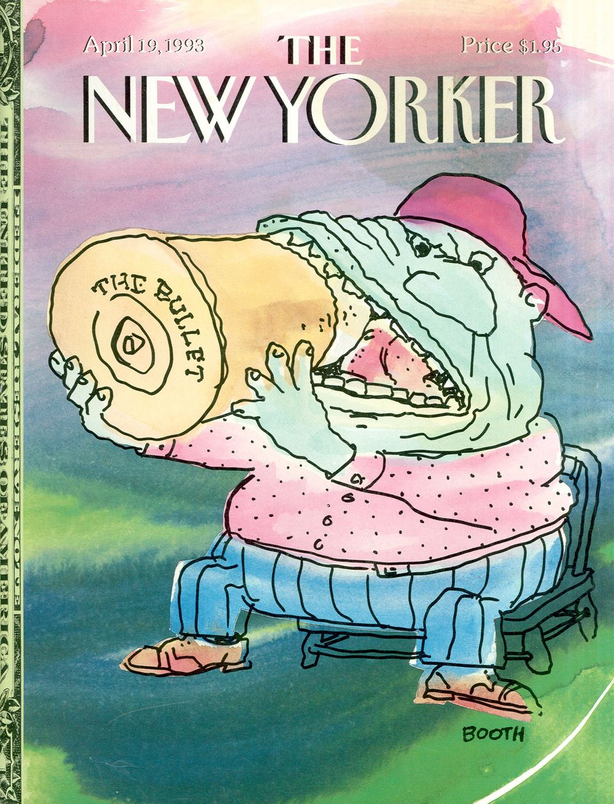

[← Back to the Catalogue](../CATALOGUE.md)

# The New Yorker April 1993 - Tam-O'-Shanter

Short Fiction · item `MAG-002`

### Reference details
| Field | Value |
|---|---|
| Work | Short Fiction |
| Section | §5.2 |
| Edition | The New Yorker April 1993 - Tam-O'-Shanter |
| Country | US |
| Language | EN |
| Publisher | The New Yorker |
| Year | 1993-04 |
| Status | have |

📖 **Full reference entry:** [§5.2 in the Collector's Reference](../Donna_Tartt_Collectors_Reference.md#52-tam-o-shanter)

🔗 **Read the original:** [newyorker.com](https://www.newyorker.com/magazine/1993/04/19/tam-o-shanter) · [languageisavirus.com](https://www.languageisavirus.com/donna-tartt/short-fiction-tam-o-shanter.php)

### Full text

### Tam-O'-Shanter by Donna Tartt
The New Yorker, April 19, 1993

The Children's Hospital was cheery enough, thought Gordon - as far as hospitals went. Still, there was no way they could get rid of that antiseptic smell, and the alien trappings of childhood irritated him and made him uncomfortable. High voices, pop music, bright murals of cartoon creatures that he didn't recognize: tea pots with dotty face? Ogling crabs and tuna fish? Medical apparatus lined the chill, windowless corridors, which echoed like the corridors of a ship in deep space. A young nurse, young enough to be his granddaughter -- maybe a doctor she was, with the trousers and the stethoscope; he had never got used to lady doctors -- walked humming past him, a bouquet of lollipops blooming from the breast pocket of her white coat.
The first film he'd ever been in, half a century before -- "Our Mutual Friend," Joan Fontaine, Larry Olivier, 1936 -- there had been a scene in a children's hospital. Gordon was seven years old, an extra, lying in an iron bed on a set in Twickenham with black circles painted under his eyes. He and Dolores had stayed up late to watch it on television about six months ago. Sitting there in the curtained sunroom with his decaf coffee and his low salt popcorn, and seeing the little face -- plump and healthy even under the makeup -- which had somehow, unbelievably, once been his own, all he could remember was how he had stealthily attempted to flatten a wad of chewing gum against the roof of his mouth as the arc lights blazed red through his closed eyelids. Later, between takes, he'd watched some of the older kids pretend to get drunk off the dregs of a bottle of Scotch that they said they'd stolen from Miss Fontaine but that actually had come from the makeup man; he and a girl his own age, annoyed at being excluded, had turned their attention to pinching a smaller boy until he cried. It was to be the most prestigious film Gordon would appear in his entire career, though he would not become aware of this for another twenty years or so. And it was a fine film; it stood up, even now. Alec Guinness had done a excellent job as the old Jew.

The garish cartoon faces on the wall -- green-armored space creatures, with slitted bandit kerchiefs tied around their eyes -- goggled down at him; with a sinking feeing, he became aware of the first, timorous lurch of the now familiar nausea. Fried eggs didn't sit so well with the roentgens. They'd tasted good in the coffee shop but he'd known he'd be sorry later.

He'd been in the States for fifty years, had almost completely lost his accent, though even when he was a kid it had all been largely phony, all those Geordie MacTavish phrases like "wee braw lassie" and "och the noo." His real name was Gordon Burns, but in the pictures he'd been Geordie MacTavish for six years. Geordie MacTavish the Highland Lad: Geordie rescuing hurt animals, Geordie breaking up smugglers' rings and fighting the Nazis, Geordie sent away to public school. Twelve years old and skipping around in a bloody kilt like Bonnie Prince Charlie, sneaking smokes between takes with the cameramen. Then the contract with Paramount, bit parts in costume dramas. He hadn't been in a film in thirty-five years. For the past thirty, he'd lived in Burbank with Dolores, in the same little pink stucco bungalow they'd bought when they were newlyweds, working on his golf game and doing public relations for one of the big production companies. He'd never been all that fond of P.R., had never been particularly crazy about his colleagues or the work that he did, but since he'd had to retire (it had got to be too much for him, he tired so easily, he just couldn't do it anymore), he missed it desperately. Away from the camaraderie of the shared routine, the office acquaintances had begun to slip, and he didn't see too many other people on a regular basis, not even in the neighborhood where he had lived for so long -- moving vans always in the driveways, strange dogs, unfamiliar kids, faces changing all the time.

He was definitely feeling ill now; he wished Dolores were with him; he wanted to turn around and go back home. But how could you refuse a request like this? His doctor had told him about the little girl. Down at the Cancer Center in San Diego, he'd said, a bit of a drive, but it would mean so much; old stills of Gordon all over the walls and even a Dandie Dinmont terrier -- named, of course, Bobbie, after Gordon's sidekick in the series. Nine years old and dying of leukemia -- some chromosomal kind, nearly always fatal. "She watches your movies before she goes into chemo," the doctor had said. "Says Geordie's never afraid and neither is she." What a rotten world, thought Gordon.

He wouldn't mind it so much if he stood any chance of actually cheering the poor kid up. But no matter how their parents tried to prepare them, warned them again and again that the films had been made fifty years before, children were always disappointed not to see another child. Sometimes the younger ones didn't understand. They asked him where the real Geordie was, was he Geordie's grandpa. But the older ones could scarcely conceal their dismay. He would never forget the afternoon several years before when a little girl -- grandchild of a colleague at the production company -- had been brought to meet him. Gamely, he had pulled out the old red tam-o'-shanter; gamely, he had answered the door, bending low to greet the little girl and booming: "Aye, then! And who's this wee lassie?" He would never forget the look on the little girl's face. It was a look of shocked recognition, then of dawning horror: as if it were her own death she saw, leaning down so close to greet her; as if she could see the ruin of the boy he had been -- destroyed now, lost forever -- buried deep beneath his sagging cheeks.

They kept the air-conditioners in these places turned up far too high; it was August outside, summer blazing away, though you'd never know it here. A towering man in a satin tracksuit, with freakishly elongated limbs and the placid face of a camel (Basketball player? thought Gordon, startled; has to be), walked past, carrying a tiny, too silent child. "So how you and your dad like to come watch the guys practice, Slice?" he was saying to it. Huge-eyed and staring, the child clung to his long neck like a baby marmoset, tracking Gordon with its gaze as it was borne down the gleaming hall. Even the bandages on its tiny wrists and ankles were covered with cartoons.

For a moment, he felt a queer sharp pang of what was almost jealousy; these kids were too little, he thought - they didn't understand what it was all about, they didn't know what it was to be really afraid. He hadn't lived like a lot of those fellows in the business; those guys deserved what they got, but he'd lived a quiet life and a sober one -- one cocktail before dinner, regular exercise, early to bed. Gave up the cigarettes at thirty-three, before they even knew how bad the damned things were; last year, at sixty-two, they'd finally caught up. The crowning inequity in a live full of bad deals. He'd joked sourly with Dolores, after they'd put him on the stuff that made him lose his dinner, that at least he was already bald, at least he wasn't going to lose his hair.

He paused outside the door. It stood partly open, waiting for his arrival. He fumbled in his coat pocket for the tam and -- glancing at the ghost of his reflection illumined in the chill glass of a reception area opposite -- placed it at a jaunty, Geordie-like angle on his bald head. The dim outline of his face shocked him. Dentures; flaccid cheeks; ghastly pouches under the eyes. His nose was as pinched as a dead man's. Maybe it'll be a comfort to the poor kid after all, he thought crossly. To see what she'd have to look forward to, to die and to know what she's not missing.

He nudged the door open. Instantly, a couple of anxious parents -- young, kids themselves, really -- rose nervous and smiling from their bedside chairs, but his fleeting impression of them was broken by a welcoming bark, a small gray blur dashing recklessly to meet him: Bobbie, he thought incredulously, Bobbie, and was knocked nearly breathless by a wild mysterious surge of joy.

He glanced up. Everywhere he looked, his own lost face stared back at him, from rain-swept piers and rocky landscapes, from the thundery dark of artificial skies: magical, defiant, impossibly young.

Then, with a jolt, he became aware of the little girl. She was sitting up in bed, propped on pillows and looking at him attentively. Tiny hands, like bird claws, rested on the edge of the coverlet; her face was mottled with broken capillaries, lurid purple blotches the color of grape jelly; she was as ugly and as fragile as a new-hatched chick. But there was a composure, a sweet intelligence about the eyes that regarded him calmly from the grotesque little face; on her head, as bald as his own, was perched a little red tam-o'-shanter.

Suddenly he was struck hard, disoriented by a shudder of nausea: barking dog, chorus of photographs, the stare of his own heartless young eyes. The little girl -- cruel plastic butterfly, which hid the needle of her I.V., perched bright on the tender veins of her wrist -- was looking at him with a good-humored, impartial, open-ended welcome, as if he were a stranger whose eyes she had chanced to meet on a railroad platform while she was scanning the unfamiliar faces for the face of a long-awaited loved one. And then she smiled, as though he were the best thing she'd ever seen, as though she'd been waiting for him all her life: "Hello, Geordie," she said in a high, clear voice.

The little dog was mad with excitement; it spun around him, barking in joyous circles as he went across the room to her, his arms held out to her tiny, bruised arms, which she stretched out to greet him, the wings of the stinging blue butterfly brushing his cheek: lover to lover, ruin to ruin. "Hello," he said to her, bending low, in a voice so boyish it surprised him, "hello, me wee Highland lassie."

Full text reproduced for non-commercial research; original source linked above. Hosted at <code>assets/sources/fulltext/MAG-002.md</code>.

### Sources & documents held

_No primary-source scan is held for this item yet — see the reference entry and the cited source above._

---
[← Back to the Catalogue](../CATALOGUE.md)
