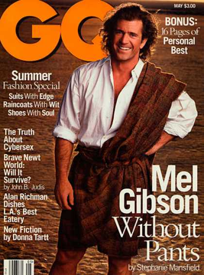

[← Back to the Catalogue](../CATALOGUE.md)

# GQ May 1995 - A Garter Snake

Short Fiction · item `MAG-004`

### Reference details
| Field | Value |
|---|---|
| Work | Short Fiction |
| Section | §5.4 |
| Edition | GQ May 1995 - A Garter Snake |
| Country | US |
| Language | EN |
| Publisher | GQ Magazine |
| Year | 1995-05 |
| Status | have |

📖 **Full reference entry:** [§5.4 in the Collector's Reference](../Donna_Tartt_Collectors_Reference.md#54-a-garter-snake)

🔗 **Read the original:** [languageisavirus.com](https://www.languageisavirus.com/donna-tartt/short-fiction-a-garter-snake.php)

### Full text

### A Garter Snake by Donna Tartt
GQ, May 1995

My older cousin Tom was intrigued by such creatures-snakes, spiders, toads. Not that he liked animals much. He tormented Valentina, my mother's tabby cat, jabbing her with a broomstick until she spat and hissed, and bragged of how, in his hometown of Pearl, he and his friends liked to set stray dogs on fire to watch them run screaming. I was 9 years old, an animal lover, who found even Disney nature films disturbing because sometimes the animals died in them; Tom's chronologies of torture made me angry, and sometimes, if he kept them up too long, I cried. "Fatso," he'd say, grinning at my tears. "Sissy. Why don't you go on upstairs and put on some of your mother's clothes? I bet they'd look good on you. Your titties are just about as big as hers." Which only made me cry harder, my stomach cramping with rage. Torturing me was as enjoyable for him as torturing the cat.

The Fatso and Sissy were not even accurate. I was a tall boy, large for 9, and when teams were picked, I was one of the first chosen. Sticks and stones might break my bones, and Tom might call me anything he wished and get back an earful just as hot in return, but the talk of tying cherry bombs to dogs' legs and so forth reduced me to tears. I loved animals, and was obsessively interested in them: not just dogs, but opossums and snails and centipedes and rats, and practically any creature that moved. I had nursed all kinds of ailing kittens and stray pups to health; with flannel and eyedropper, I had raised a naked baby squirrel and a new-hatched jay fallen from its nest. Bats were intoxicating; spiders I allowed to crawl up and down my bare arms; earthworms I felt sorry for. But though I was fond of even lizards and skinks and the little brown toads that lived under the lettuces in my father's garden, I had a terror of snakes the violence of which is difficult to describe.

This was an entirely irrational terror, and I was humiliated by it. Whenever I saw even a picture of a snake on television I screamed aloud, I couldn't help it. This made me miserable, and ashamed, but the panic which convulsed me at even these harmless images was impossible to control. I could not go into pet shops that sold snakes. I had never been anywhere near a snake house in a zoo. I could not even bring myself to pick up the S volume of the encyclopedia, for fear of it accidentally falling open to some big color photograph of a boa constrictor or mamba. When I was 6, I had had a sort of fit when another boy in my class brought a king snake in a jar to school, bolting from my desk to a corner, screaming in fear for my very life; screaming until the teacher, alarmed, called my mother to fetch me; screaming all the way home in the car and for half an hour in my mother's arms after we got there and intermittently, through the rest of that afternoon and night, whenever I suddenly remembered the teacher walking toward me saying, "Now, Marty," with the pickle jar in her arms.

At 9, my terror had not diminished. If anything, it had increased, and I was capable of making myself light-headed with the thought of the hysterical, white-livered spectacle I would make of myself if now, in the fourth grade, someone happened to bring a snake in a jar to school again. My friends were unaware of the tyranny of my fear. I lived in dread that my enemies-like Tom-might discover it, and torment me without mercy (a dead snake at the bottom of my soup bowl, a live one in my jacket pocket) and possibly drive me mad.

My terror was unfortunate on any number of theoretical levels. I wanted to be a naturalist when I grew up but this of course was impossible. Whenever I checked out books about animals from the library-and they were the only books I was interested in-my mother had to go through them first to make sure that there were no pictures of snakes. If there were any at all, even one, back the book went on the shelf, to my dark regret and shame. And though I could otherwise have happily spent every spare moment of my time outdoors, looking for birds' nests, admiring spiderwebs, catching tadpoles in ditches, I was too worried about the prospect of running across a snake-any snake at all, poisonous or not-to venture far out of my own yard. I dreamed of going to Ireland, where Saint Patrick had driven out all the serpents, and where for the first time it would be possible to tramp around in woods and fields to my heart's content.

But even my own yard was not safe. Little grass snakes were not at all uncommon, especially in the summer, and whenever I saw one as I was walking barefoot across the lawn, I would go practically spastic with terror and stumble, shrieking, for the house. My father, who was disgusted by these blithering panics, would sometimes get up, at my mother's prompting, to go out in the yard and make a perfunctory search in the tall grass with his hoe as I watched from the porch, trembling and wretched with my own cowardice. Though this was impossible to explain, even to my sympathetic mother, it was not that I wanted my father to kill the thing. I simply could not bear to have it anywhere near me. Even my grandmother had little time for such nonsense. "Snakes are the Farmer's Friend," she would tell me, stern in the big tan pith helmet she wore for gardening, and point out that grass snakes often ate harmful insects; but her arguments, while I sensed their intellectual weight, did little to dispel my fear.

My cousin Tom, who said he was not afraid even of water moccasins, was spending the summer with my grandmother and my father and me. My hatred of him-already considerable-grew by the day. I hated his freckles and his cruel big-knuckled hands, hated his horsey teeth with the wide spaces in between them, hated more than anything else his s*****ing tales of atrocity; but my grandmother ordered me, in fierce whispers on the back porch or in the kitchen hall, to be nice to him. Tom's mother-my grandmother's daughter and my aunt-had just died.

Her funeral had been scarcely a week before. I hadn't known Tom's mother much. For as long as I could remember, she'd been ill and stayed in bed most of the time. My clearest memory of her was my first, when I was probably only 3 or 4: a small, milky-skinned lady with rusty hair and chestnut-brown eyes who'd brought me a box of crayons when she came to visit and who, with a trembling hand, bent low to stroke my cheek as she gave it to me; who, inexplicably, as she and my mother were sitting on the sofa looking at some old photographs, had burst into tears.

Tom hadn't cried at the funeral, though everybody else had. He'd just stood by the hole in the ground and stared at it with narrowed eyes and what seemed to me a resentful expression.

"Why isn't he crying?" I asked my mother, who was sobbing into handkerchief.

My father clamped his hand hard on my shoulder near the collarbone, which was his way of ordering me to shut up.

So Tom was at our house now, and my mother was down in Pearl, taking care of Tom's father and Tom's little brother, Lewis, who was just a baby. I didn't care for babies, but still I wished it had been the baby who had come to stay instead of Tom. Whenever he smashed a robin's egg I'd found, or kicked over my ant farm, or tormented me with stories of feeding Alka-Seltzers to crows and blue jays so their stomachs exploded, my grandmother and my father only said "Now, Tom," and refused to punish him. If I persisted in my complaints, I was punished myself. The one time I retaliated, by stepping hard on his hand when he was sitting on the stairs and I was running down them, my grandmother took me out in the yard and whipped me while Tom made faces from the porch.

"Think how he feels," she hissed. "You be nice to him."

To me, Tom seemed leering, obscene, practically an adult; but he was only 13 and, compared to the boys his own age in the neighborhood, rather thin and small. Though he sometimes hung around with some of them, it seemed that they were as unimpressed as I was by his constant boasting. He had told them that he knew karate (I once saw him giving a demonstration of his art, feeble, unbalanced kicks; Allen Walthall caught him by the sneaker and threw him backward in the grass), and he bragged that his father was a Green Beret and a policeman. His father was neither of these things, so far as I knew, but only an examiner for the Bank of Mississippi. What was more, he was closer to my grandmother's age than my father's, bald as a baby and wore his trousers hiked way up under his armpits, but you would think that he was John Wayne to hear Tom talk about all the bad guys he had beaten up and shot.

Another of Tom's accomplishments, and one of which he often boasted, was his skill as a rattlesnake hunter. He grabbed them by the tail with his bare hands, he said, and snapped them in midair like whips so that their heads flew off. I found this story both repugnant and incredible; repugnant for obvious reasons and incredible because I knew Tom to be nearly as afraid of snakes, even little grass snakes, as I was. One day my grandmother, digging in her flower bed, found a tiny black snake in the snapdragons. She plucked it up with thumb and forefinger (I, far away on the porch, hid my eyes in terror at its horrible squiggling) and, feeding it back and forth between her hands, walked out to show it to Tom and Allen Walthall, who were trying to put up a badminton net in the backyard. Allen, looking up with interest, said, "Hey! A snake!" but I, even from the porch, saw the apprehension on Tom's face as my grandmother advanced, and saw how he flinched as my grandmother, who was only trying to be kind, attempted to put it in his hands.

Probably no one would have thought much about it if not for all the previous bragging about the rattlesnake-hunting, but this incident made Tom lose what little face he had with Allen and the other big boys. They stopped coming over in the afternoons, and whenever he went outside, they shouted insults at him from Allen's tree house next door.

After about three days of this, Tom caught me roughly by the arm as I was going up to my room. "Come here, you little turd," he said. "I want to show you something."

He dragged me down to the cellar and pointed at an old milk can. My mother had tried, unsuccessfully, to decorate it several years before, with the idea of turning it into an umbrella stand to sell at a church bazaar. It was painted a sickening gray color, and some pitiful photographs of butterflies, cut from magazines, were glued sporadically to the side.

"Guess what I've got in there," he said.

His grin was horrible. Somehow I knew, without a doubt, but before I could scream he grabbed my arm and wrenched it behind my back. "It's a snake," he said. "Want to see?"

"That can belongs to my mother. She uses it sometimes," I said.

"Your mother's not here."

Tears of rage burned my eyes. I could easily have elbowed him in the stomach with my other arm, and probably hurt him-though I was four years younger, I was nearly as big as he was-but instead I tried only to wriggle away and gasped as he wrenched my arm farther than I thought it would go.

"You'd better not tell," he said in my ear, his breath hot and vinegar-smelling on my cheek.

"You can't stop me."

"You do, butthole, and you'll find it in your bed tonight."

This thought flooded me with such an uncontrollable gush of panic that I began to scream, helplessly, heedless of his sharp jerks upward on my arm. Upstairs, the screen door slammed, and my grandmother's rapid footsteps clicked over the cellar ceiling.

I pulled free and ran for the stairs, but he caught me and twisted my arm again. His freckled face was blood-hot, and sweat trickled down his forehead.

"If you tell, pigface, I'll put it in your bed," he said breathlessly. "And she won't do a damn thing to me if I do."

The cellar door banged open. "What's going on down there?" said my grandmother sharply.

Tom let my arm drop. "Nothing, Nana," he said, his voice high and fast. "We were playing. Marty fell and hurt himself."

My grandmother came down the stairs. She had a trowel in her hands, and the knees of her trousers were covered with dirt. At the sight of her startled old face all hope of sanctuary, of justice, dropped abruptly away.

"Goodness, Marty," she said, alarmed, "what's happened to you?"

I began to cry.

The trowel clanged to the floor. I felt her hands on my shoulders.

"Marty?" I heard her say. "What's the matter?"

She pulled my hands from my eyes. Still crying, I turned my head away from her. "Nothing," I said, wiping my nose with the back of my wrist, unable to look her in the face.

Tom's plan was to fatten the snake on raw meat and, when it was large enough, to charge Allen and the other boys a dollar to come see it. He stole pinches of raw hamburger from the refrigerator and dropped them into the can through a slit at the top.

The entire house now seemed to draw horribly around the milk can as its center. No matter where I was, upstairs or down, I saw it as clearly as if the floors were transparent. I no longer went down into the cellar for any reason whatsoever. All day long, I jumped miserably at the rattle of crickets and the hiss of the water heater, at electrical cords, drapery pulls, the long, slinky cord to the vacuum cleaner. At supper, I stared at my plate, haunted by the knowledge that all the time my grandmother and my father laughed and talked and attempted to coax Tom "out of his shell" (ha ha) the snake was coiled below us in the dark, directly beneath the kitchen table. I had no idea what kind of snake it was. Tom had told me that it was poisonous-and there were plenty of poisonous snakes around where we lived. A knot of copperheads the size of a basketball had been found on Adams Street by men digging for the gas company, and a trick-or-treating toddler had almost died of a pilot rattlesnake's bite in the MacRaneys' carport last Halloween ("'Nake!" she had reportedly said with delight, looking up through the eyeholes of her ghost costume at horrified Mrs. MacRaney, who, in the sudden light of the opened door, saw her tiny, white-shrouded shape stooping toward the thing in the split second before it muscled back to strike); and there was always the story of Mrs. Powell's youngest daughter, Cynthia, who had fallen from her water skis into a nest of moccasins and floated to the surface thirty seconds later, stone-dead and swollen twice her size-there were stories like this, and more, you could tell them all night until you were black in the face, but I was terrified even of snakes in photographs and my terror at a live one, poisonous or not, was very nearly indescribable. Perhaps it was no longer in the milk can at all. Perhaps it had drawn back its pointed skull and pushed its delicate, nasty snout against the lid, slithered out and curled inside an empty flowerpot or around the base of my grandmother's gardening basket (a length of garden hose, that's what it would look like, a garden hose with teeth and eyes that lashed out half its length when one stooped for the tomato stakes); perhaps-and this was where my imagination began to lurch back upon itself, and darken-perhaps it had crawled up inside one of the heating pipes that led to the vents upstairs. What if it got out? What if it got out? Snakes were good at escaping from things. Allen's cousin in Atlanta had a pet boa constrictor, and I'd heard Allen's mother wailing about how she didn't feel safe visiting her own sister's house, how the nasty thing was always managing somehow or other to get out of its tank.

For days, I was haggard with fear. Never far from my mind was the other dreadful possibility: the thought of Tom, grinning, coming toward me with the thing like Mrs. Henley with the pickle jar. But Tom, despite his bragging, was wary of the snake himself. His trepidation-plainly genuine-did nothing to lessen my own. He never took the lid off the can and whenever he approached it did so cautiously, on tip-toe. I was too afraid to go anywhere near it, or him, but sometimes he went down to the cellar with a long stick, which he poked through the slot of the milk can to jab at the snake inside.

"I'm training him to strike," he said, his voice businesslike. "This'll make him mean." But even, I light-headed with terror at the top of the stairs, saw how blindly he prodded with the stick, reluctant even to look at the results of his training exercise.

After about a week, a dreadful stench began to ooze from the cellar up into the kitchen. My grandmother, believing that a mouse or squirrel had crawled up into the cellar and died, went downstairs with a sack of quicklime and knocked around at the walls with a shovel.

"It's up inside the wall, whatever it is," she said to my father when he came home from work.

"Maybe a rat," my father said.

In bed that night, I lay awake. Perhaps the snake was dead. For a day or two I was too afraid to say anything, but as the smell got worse I worked up the nerve to confront Tom with this.

He was furious. "Don't be retarded," he said. "You can't kill a snake even if you try. You can cut it up all in little pieces and the pieces will fly together and stick."

"I thought you liked to grab them and crack their heads off."

"That's different, mongoloid."

"I believe it's dead."

He spat on the ground. "You'll see how dead it is if you find it in your bed tonight," he said.

That night, again, I lay awake after everyone else had gone to sleep. Even the idea of a dead snake (Tom's lascivious smirk, the look he'd have in his flat, seedlike eyes if I was cornered and he was coming toward me with it) constricted my heart with a bright twist of fear. But at least, if it was dead, I needn't worry that it would escape.

Trembling, I got out of bed and walked barefoot down the hall, past my parents' bedroom, past the open door of the guest room where Tom lay asleep and grinding his teeth with a squeaky noise, down to the dark kitchen and the door that led to the cellar stairs.

I opened it, heart pounding, and switched on the light. There was the milk can, over against the wall by the lawn mower. The stink was nauseating even from the top of the steps. I had not dared set foot in the cellar since the day of the snake's capture. Holding tight to the pipe banister, my bare toes gripping the unfinished edge of the plank stair, the blood beat so hard in my head that I saw sparkles. There is nothing to be afraid of, I told myself, a dead snake in a milk can won't hurt you, but still I was afraid, as afraid as I have ever been in my life.

I don't know what I had thought I was going to do (certainly not tiptoe down to look, I was far too frightened), but even twenty feet away the smell was unimaginable. It was answer enough. I closed the door and ran back upstairs.

"Tom," I said to him the next day, "that snake's dead."

"How do you know, Marty-farty?"

"Because I went down last night and looked at it."

His flat, pale eyes searched mine. "No, you didn't," he said at last. "Mongoloid."

"It's dead," I said. "You killed it. Keeping it shut up in that filthy old can."

"If you feel so sorry for it, why don't we put it down your shirt and let it crawl around on your stomach?" He leaped for me, hoping to catch my arm and twist it behind my back-his favorite trick-but I was too fast for him.

"Come on, Marty-farty. What's the matter? You scared? Why don't' we go downstairs and let you play with it?"

"You make me sick."

"It's mine. I can kill it if I want."

He opened the cellar door and thumped down the stairs. I heard the clang of his stick against the metal. "See?" he said. "I'm not scared of it."

"I wouldn't be scared of a dead snake, either," I said-though this was far from the truth-and slammed the door shut, bolting for my room as I heard him start up after me.

My discovery had relieved me somewhat. Now, instead of paralyzing anxiety, I felt only disgusted, and ill at ease in a way I couldn't define. All that day and all the next, the putrid smell from the milk can lingered in my nostrils, in the back of my throat, even when I was riding in the car with my father on the way to the post office.

"What's wrong with you, Marty?" said my grandmother at supper. "You haven't eaten a thing."

"Got a stomachache?" my father asked me, reaching for the peas.

The stink in the cellar was relentless, and it worsened. It was a major topic of discussion between my grandmother and my father.

"I just can't figure out where it's coming from," my grandmother said. "Maybe we should call Mr. Bell from out at the Pest Control."

"I stopped by there this morning on my way to work," my father said. "They can't send anybody out until next week."

It was high summer, and the cellar was like a furnace. The milk can practically sizzled in a blazing flag of sunlight from the high window. Even if Tom hadn't starved or impaled the thing, it would certainly have cooked to death by now. I hoped Mr. Bell from the Pest Control would be able to find it when he came, and wondered what my grandmother and father would think about it if he did-if they would feel as guilty and disturbed as I believed they ought to. As soon as Tom left and there was no longer any danger of retaliation, I planned to tell them and Mr. Bell and anybody who would listen. But every day I waited anxiously for some word of Tom's departure (and Mother's welcome return), and there was no news. As the days dragged on, it seemed that Tom would never leave and my mother would never come home again, and that my life was tainted somehow and would never go back to being the way it had been before.

My friend Barney-Allen's little brother, the only boy in the neighborhood my age-had been sent off for three weeks to summer camp, and unexpectedly one morning he showed up at our back door: sunburnt and taller than I'd remembered him, wearing a green Camp Lake de Selby T-shirt and a lanyard belt he'd braided himself.

"Want to go ride bikes?" he said.

I was glad to see him, and glad for some distraction from my misery. We were out all day. He showed me the medals he'd won for Forestry and Woodsmanship and told me how some kid from Memphis had got a cramp during the swimming test and almost drowned. He was mad because Allen had gone into his room while he was away and put lipstick on his G.I. Joes. He'd tried to get it off with a scouring pad, but they all still had red smears across their faces.

I told Barney about Tom, how mean he was to animals, what a jerk he was. I told him about how he'd killed the snake in the milk can, but I didn't tell him how afraid I was because my fear of snakes was something I didn't trust even Barney with.

"At least he'll be going home soon," said Barney. "I have to live in the same house with Allen all the time."

It hadn't occurred to me that Barney would say anything to Allen about the snake, but he must have, because the next morning Allen and the other big boys showed up in our yard.

"I hear you got a snake down in the cellar," said Allen to Tom.

Tom shrugged.

"Let's see it."

"Pay me a dollar and I'll show you."

"Show me, and then I'll give you the dollar."

"No way. Dollar first."

"I bet he don't have anything there at all," said Charlie, stepping forward. He was 14, tall as my father and nearly as mean as Tom himself.

"That's for me to know and you to find out."

"I bet he don't have one, either," said Allen. "He couldn't even kill a baby snake. He's too scared."

"Naw, he's not scared," said Charlie. "He catches moccasins with his bare hands and cracks their heads off."

Barney and I, off by the porch, were listening stealthily to all this as we pushed our Matchbox cars back and forth in the dirt. "Boy," whispered Barney. "They are going to ***** him up." He had learned the word "*****" at Camp Lake de Selby and now used it at every possible opportunity.

"How'd you kill the snake?" Charlie said. "Like Lash LaRue, you mean?" He stepped back, with some brio, and mimicked a showy bullwhip crack.

"Come see, if you're not too scared," Tom shouted over their laughter. He had raised himself up on his tiptoes, and kept darting backward and forward in a queer, belligerent, feinting way that made them all laugh even harder.

"I'm not paying any dollar to see a dead snake," said Willie Triplett.

But Tom had already turned and was heading to the cellar and Charlie and Allen were close behind him.

As soon as they disappeared, Barney grabbed my arm and pulled me up. "Come on," he hissed as he tugged me around through the back of the house toward the cellar window. "We got to see this."

I followed, reluctantly. Even if Barney and I were hidden, at a distance of twenty feet, and separated by a pane of glass, this was not nearly distance enough for me. But my dread of the snake's corpse was less than my fear of seeming a coward in front of Barney and my itch to see Tom appear the boasting dog he was.

We dropped to the grass and crawled on our stomachs to the cellar window, which was set on a level with the ground and which, though furred with cobwebs and dust, afforded a bird's-eye view.

The four of them thumped down the stairs. As they approached, I saw Allen and Charlie grimace at the stink. Tom swaggered toward the can.

"Broke the bastard's neck," I heard him say, as he was unscrewing the lid. "Took me a while to-"

Then he staggered back, arms flailing, with a high scream.

Everyone-Barney and me, the boys in the cellar-was stunned. They stared at Tom-still waving his arms around his face-and we stared at them staring.

It took a moment or two to comprehend what my eyes had registered. Something or other had sprung from the can, like one of those trick snakes in a fake candy box, directly into Tom's face.

After the initial dumbfounded shock, I noticed that the other boys had begun to glance down at their feet, and then to hop around. There was an incredible shriek of laughter from Charlie.

"Jesus," said Allen.

"Hey. There it goes."

The next second, the two of them, with Willie, were scrambling around, heads down, attempting to corner something.

"Get it," shouted Charlie. "It's over there."

"Man," whispered Barney. "Did you see that *****er jump?"

It was several blinks before I began to realize, flesh crawling, what had happened. The snake had escaped. All that time it had been alive, no water, no food but the putrefied hamburger-which, as I was later to understand, accounted for the horrible stench emanating from the can. The thing had waited patiently for weeks in darkness, enduring the overheated metal of the milk can, the prods of Tom's sticks, suffering in silence through its hunger and filth and thirst and concentrating all its energies toward this very moment: when the lid of its prison would be unscrewed, for even a flicker, a heartbeat, for a glimmer of light in which it could make its desperate bid for freedom.

Tom, dumbfounded, his ugly mouth hanging open, still stood by the empty can. I saw Allen, laughing, run a few steps and stomp down hard with his sneaker and then, reeling back, off balance, stomp again, while Willie tried to drive the frantic, whiplashing thing toward him with a broom.

Charlie dashed to the opposite wall to get the hoe.

They were going to corner it and kill it. I don't know what came over me as I lay trembling with my stomach on the ground watching them-I could hardly even see the snake, the glass was so fuzzy and my eyes were so bad; all I could see was their confusion as they chased it-and even now, twenty years on, I can't imagine what was going through my mind. All I knew was that for the wretched creature, poisonous or not, to die like that-after its incredible escape, after the burst of hope which must have exploded for a moment even in its feeble reptile brain-that for the thing to now be stomped to death, without a chance, after all its weeks and weeks of suffering, seemed to me unendurable.

To be honest, I don't quite remember what happened. I must have jumped up, and run down to the cellar, because all I remember is being down there with Allen and Willie and Charlie knocking into each other and laughing, and seeing the horrible thing dart past my sneaker and diving for it. The next thing I knew, it was writhing in my grasp and I was running, running, sobbing as I went, running as fast as I could.

Now-twenty years later-I know what a garter snake looks like. I know that they are harmless. I have even come to realize that they are actually rather beautiful, not unlike a man's striped sleeve garter, as a matter of fact: glossy green-black with a deft wet streak of yellow paint dashed down the side. But back then, all snakes were poisonous to me and as I ran I wept with fear, the thing caught between my fingers, not much larger than a pencil-cool, slick, thrashing with a horrible muscularity, a repugnant glimpse of white segmented underbelly that made my stomach buck with nausea-as I scrambled up the stairs, blinded by my tears, and exploded through the kitchen door-past my grandmother, washing dishes at the sink, who stood agog with the dishtowel in her hand-and stumbled red-faced and weeping to the open door of the back porch and hurled the flailing thing out into the yard as far as it would go.

I threw myself, crying, on the linoleum, crying as I have since not cried again. My grandmother was still standing open-mouthed with the dishtowel. I don't now what on earth she must have thought to see me of all people bursting through the kitchen like a meteorite with a garter snake in my hands.

I heard the rapid thump of Barney's sneakers and his voice, from the porch. "Hey, Marty," he said cheerfully, and: "Hey, Marty, what's the matter? Did it bite you or something? That was really cool."

"What happened, Barney?" my grandmother said. Her voice was not quite steady.

"Marty saved it," Barney said. "The snake, Tom had it down in the cellar. Allen and them were trying to kill it."

After a moment, I felt her hand on my shoulders. She had knelt down beside me. "Marty," she said, "sweetheart," and her voice had a sound in it that I had never heard.

But I was still sobbing, sobbing so hard that my whole body shook, and I flung back my arm and threw her cautious hand off. I was crying so hard I could scarcely talk. "Leave me alone," I hiccupped, convulsed by an emotion so violent I couldn't come close to understanding it. "I hate you. I hate you all."

Full text reproduced for non-commercial research; original source linked above. Hosted at <code>assets/sources/fulltext/MAG-004.md</code>.

### Sources & documents held

_No primary-source scan is held for this item yet — see the reference entry and the cited source above._

---
[← Back to the Catalogue](../CATALOGUE.md)
