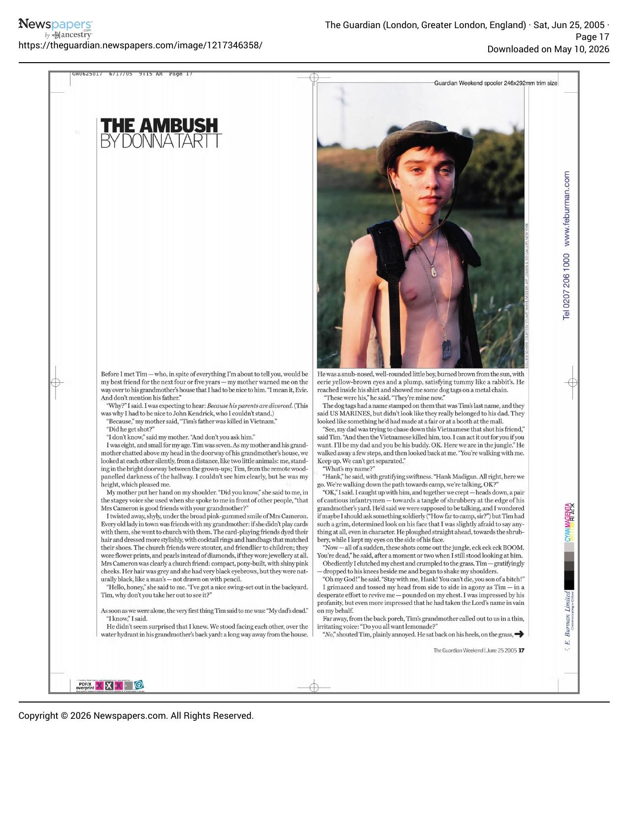
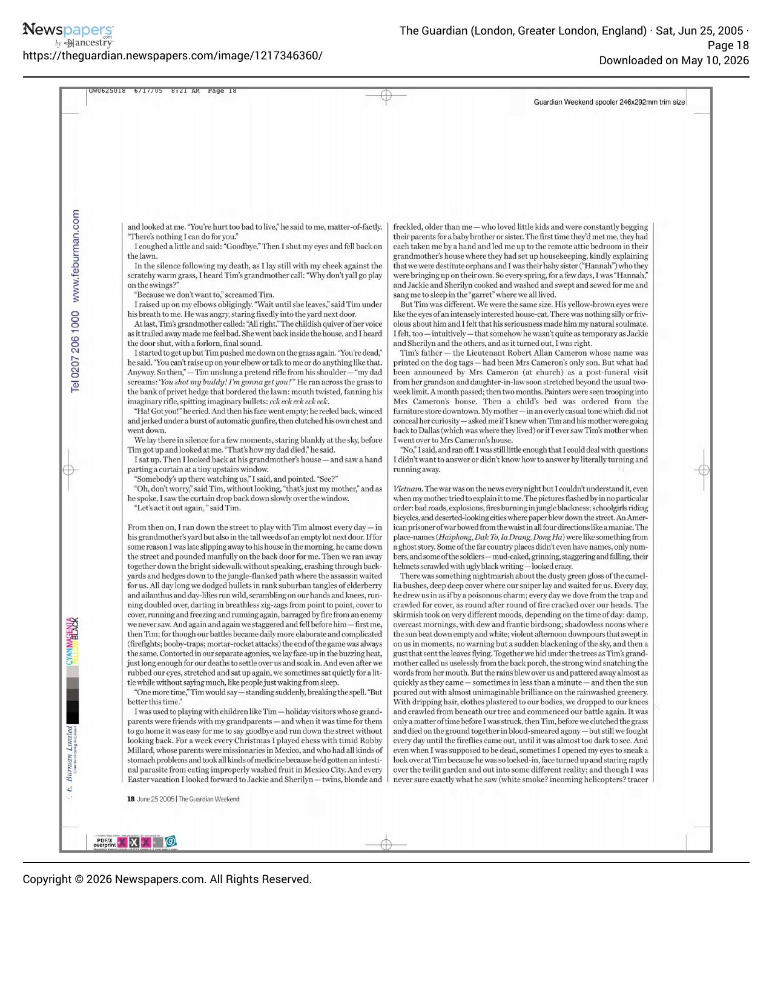
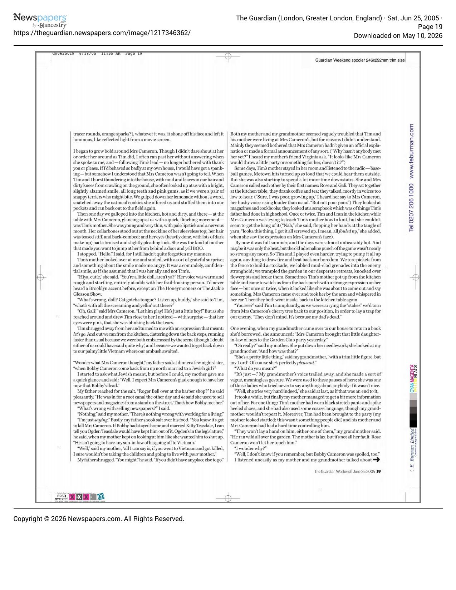
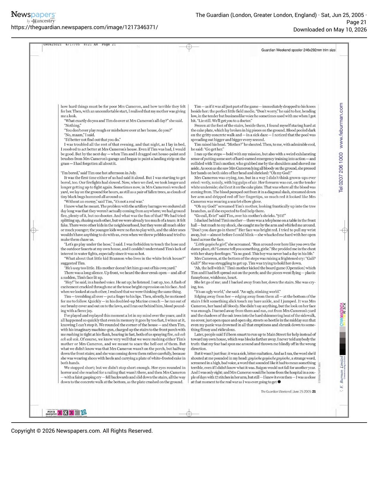

[← Back to the Catalogue](../CATALOGUE.md)

# Guardian Weekend June 25 2005 - The Ambush

Short Fiction · item `MAG-005`

> **Cover missing** — no cover image is held for this item yet.

### Reference details
| Field | Value |
|---|---|
| Work | Short Fiction |
| Section | §5.5 |
| Edition | Guardian Weekend June 25 2005 - The Ambush |
| Country | UK |
| Language | EN |
| Publisher | The Guardian |
| Year | 2005-06-25 |
| Status | n/a |

📖 **Full reference entry:** [§5.5 in the Collector's Reference](../Donna_Tartt_Collectors_Reference.md#55-the-ambush)

### Full text

_No machine-readable text available — the original is reproduced here as page scans:_

### Sources & documents held

- [Guardian 2005 06 25 TheAmbush p17](../assets/articles/Guardian_2005-06-25_TheAmbush_p17.pdf) (PDF)
- [Guardian 2005 06 25 TheAmbush p18](../assets/articles/Guardian_2005-06-25_TheAmbush_p18.pdf) (PDF)
- [Guardian 2005 06 25 TheAmbush p19](../assets/articles/Guardian_2005-06-25_TheAmbush_p19.pdf) (PDF)
- [Guardian 2005 06 25 TheAmbush p21](../assets/articles/Guardian_2005-06-25_TheAmbush_p21.pdf) (PDF)

Primary-source captures cited for this section of the reference. PDFs and images open in GitHub's viewer; `.webarchive` files download.

---
[← Back to the Catalogue](../CATALOGUE.md)
