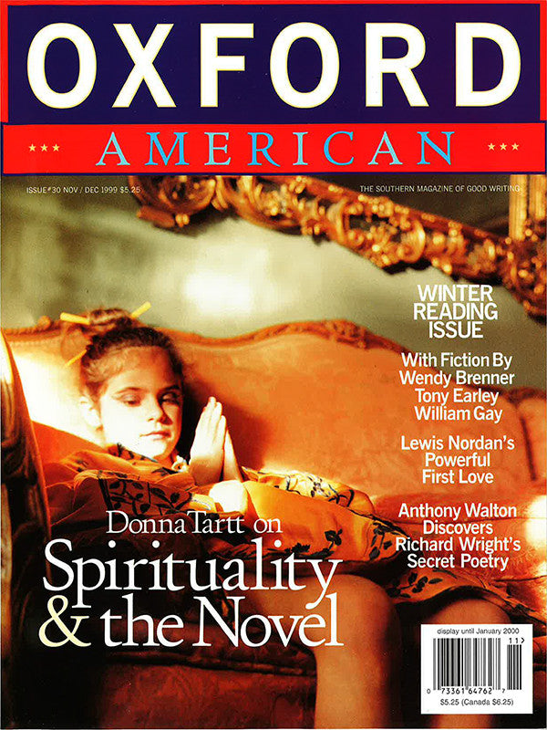

[← Back to the Catalogue](../CATALOGUE.md)

# Oxford American #30 Nov/Dec 1999 - Spirituality in the Modern Novel

Nonfiction & Essays · item `MAG-010`

### Reference details
| Field | Value |
|---|---|
| Work | Nonfiction & Essays |
| Section | §6.3 |
| Edition | Oxford American #30 Nov/Dec 1999 - Spirituality in the Modern Novel |
| Country | US |
| Language | EN |
| Publisher | Oxford American |
| Year | 1999-11 |
| Status | have |

📖 **Full reference entry:** [§6.3 in the Collector's Reference](../Donna_Tartt_Collectors_Reference.md#63-the-spirit-and-writing-in-a-secular-world--spirituality-in-the-modern-novel)

🔗 **Read the original:** [oxfordamerican.org](https://oxfordamerican.org/magazine/issue-30-november-december-1999/spirituality-in-the-modern-novel)

### Full text

In 1997 a lecture series, “The Contemporary Novel and Spirituality,” was held at Regent’s Park College of the University of Oxford (England). The following was the first talk presented.

T oday, I have been invited to speak to you about spirituality in the modern novel. As a novelist who happens to be a Roman Catholic, faith is vital in the process of making my work and in the reasons I’m driven to make it; yet there’s a constant tension between my faith on the one hand and my vocation as a novelist on the other, since the novel in its history and genesis is an emphatically secular art form: a product of secular society, addressing primarily secular concerns.

As we know, the novel appeared—with Richardson and Defoe—at exactly the moment when conventional religious truths were beginning to be questioned, as a sort of alternative to those conventions. And though the novel addresses many of the same mysteries as does theology—questions of sin, suffering, mortality, fate—it does so much more in terms of this world than the next one. At its best, the novel is a means to examine moral dilemmas without benefit of Heaven or God—or, to use a mathematical analogy, the novel is sort of a practical, extended word-problem in morality, as opposed to an equation. So, instead of a universal moral template like Thou Shalt Not Commit Adultery, we see Emma Bovary’s actions and their consequences unfolding across some five-hundred-odd pages. And from her fate—as well as her husband’s—we are left to draw our own conclusions, which may not be wholly inconsistent with the original biblical mandate but which are in any case far more complex.

We could conclude that inspiration is much the same for artists and writers as it is for saints. Still the mind, by whatever means—by boredom, by insomnia, even by a walk after a good meal—and Divinity enters.

Never has the novel’s existentialist quality been more marked than it is now. And, as a writer of fiction, I can assure you that this rather godless quality of the novel isn’t an aesthetic or cultural choice, but a necessity grounded in form. Any writer who tries to use the novel as a vehicle for theological discourse will soon run bang into solid technical obstacles; if he persists, he will find himself writing either a very bad novel or something that isn’t a novel at all. This is partly because the novel is such a big and boisterous form—highly populated, packed with noise and overheard conversations, with houses and horses and great white whales. Its characters are flawed and eccentric, and they interact with one another according to the skewed and particular and often quite unfair laws of this world. Because of its length and bulk, it cannot sustain the pure tone of the parable or the tale; because of its restless, many-leveled movement, it is ill-equipped to portray the constancy of faith; because its engines are driven by conflict and struggle, the novel is confounded above all by notions of peace and eternity.

Serious treatment of organized religion presents a particularly tough problem for the novelist. That is to say: novels delight, notoriously, in satirizing organized religion, but it has always seemed to me that it’s not so much religion that baffles efforts at serious narrative treatment as the “organization” part. Here again, it’s a question of structure, not aesthetics. In order to hold interest for two hundred pages or more, long fiction must contain a considerable element of the unpredictable. There must be loose ends, unanswered questions, unexpected catastrophes and accidents of fate, characters who react in unforeseen ways. As a Roman Catholic, my faith gives an unchanging viewpoint that is universally applicable to all questions in life; but if I, as a novelist, set out with the attitude that any view—Catholicism, Freudian psychology, what-have-you—is an unfailingly correct solution to all dilemmas within my novel, then my novel will seem predetermined and dull at best, and quite ridiculous and unbelievable at worst. Nothing makes fiction more monotonous than a writer’s attempt—no matter how well-meaning it may be—to propound within it some schematic, determinist view: whether political, economic, religious, sociological, or sexual. When such views are propounded by a character—a Dr. Pangloss or Mr. Chadband, for instance—we immediately find ourselves in the realm of comedy; when propounded too earnestly by an author, or an authorial mouthpiece, we find ourselves in the more discomfiting realm of unintentional comedy.

Novelists who do not wish to discredit unwittingly their own most deeply held convictions—whether in the Communion of Saints, the Communist Party, or the health benefits of a vegan diet—will therefore shy from asserting those convictions directly in their work. Exceptions to this are so rare that they serve only to prove the rule. Only a very few novelists, and those of the very first rank—Dostoyevsky is one who comes particularly to mind—are able to talk engagingly and at length about spiritual convictions without sabotaging narrative credibility; but this is a trick requiring exceptional passion and dramatic skill, and it is worth remembering that even masters like Tolstoy and Dickens sometimes lose our attention when they get too carried away in talking about their personal beliefs.

And yet literature is in many ways the most spiritual and personal of the arts. As readers, we know the soul of Dickens (for instance) in far more intimate and specific ways than we can “know” the soul of Turner or Debussy. This spiritual intimacy is true of all the literary arts, but the thoughts of a novelist in particular take on a curiously vivid life in us. When we are drawn to a novel, what we are really attracted by is the spirit that created it—its likes and dislikes, its flaws as well as its strengths. If we really love Proust, for instance, we love him for his petulant, slightly spoiled quality as well as for his lyricism; if we really love P.G. Wodehouse, we love him not only in his spectacular loop-the-loops but also in his predictable, slightly repetitive moments, where he doddles around like a sweet, short-sighted grandfather who sometimes tells the same story twice.

So, spirituality’s function in the novel is exceedingly subtle and indirect, because it must be refracted through the imperfect medium of human personality. And because it can be just as hard to see God in a literary character as it is to see Him in the people around us, many critics don’t see spirituality as a function of the novel at all, and interpret it as symptomatic of history, or psychology, or—as in the case of poor Dostoyevsky—actual pathology.

I’m not a critic, however, but a novelist, and what I mainly want to talk about today is spirit in the process of writing novels. For me, writing has always been much more a mystical process than an intellectual one—my greatest struggles in writing fiction are primarily spiritual, and solutions that arise to these problems are generally spiritual, as well. But first, I’ll try to clarify what I mean by “spirit” in my work as a writer.

Basically, the Holy Spirit that moves in my life as a Christian and a Catholic, and the spirit that informs my work as a novelist, are not precisely identical in definition. Certainly, it is going too far to make a gnostic split into good angel and bad angel—between the Holy Spirit that leads me to my Creator, on the one hand, and the mischievous little personal spirit that drives me, often in very capricious and willful ways, to create things of my own. But they are two, and they are not the same; sometimes they disagree. Generally, though, they move in much the same patterns, and by the same paths—and perhaps it’s helpful to talk first about the similarities between Great Spirit and personal spirit, because the similarities are ultimately what’s most important.

Somewhere, the writer Colin Wilson tells the following anecdote about Wordsworth. Once, a friend of Wordsworth’s asked him: “How do you write poems? Where do poems come from?” Well, Wordsworth thought about this for a minute or two, thought about it hard—it was a serious question—and finally was forced to put his hands over his eyes and admit that the process was a mystery.

So the subject was forgotten. Later, Wordsworth happened to be walking with the same friend in the countryside. This was in the days when trains were fairly new, and, when on this walk, they happened to come across a train track, one of the men said to the other: “Do you know, these things are extraordinary—they conduct sound for miles. If you put your ear to the rail, you can hear the train long before it pulls into view.”

Well, it happened that a train was due to pass in about half an hour. They each knelt, and put an ear to the rail, and listened, and listened—perfectly still, concentrating all their attention—and they listened like that for a number of minutes until finally they heard it at last, this little singing sound. Wordsworth got to his feet, stretched, took a deep breath, looked at the sky, and said: “ That’s it. That’s how poems come.” Because he’d been fixing all his attention on a single, monotonous point, straining to listen, shutting everything else out, he actually saw the sky when he stood up again. Everything—the wind, the clouds—came rushing back to him and made him want to write a poem.

Now, this is a story about aesthetic spirit—the spirit that moves poets to write poems—but any person of religious sensibility will see immediately that this is how Holy Spirit works, too. There are many, many examples in the religious texts of all faiths of Holy Spirit moving exactly like this—like a thunderbolt, catching one completely by surprise when one’s attention is fixed upon something else. One thinks of all those stories of Zen monks who meditate without ceasing for ten years, and then suddenly achieve enlightenment when their Roshi whacks them in the head or kicks them in the pants; or, too, of Achilles arguing with Agamemnon, wholly caught up in this petty quarrel over who deserves the war-prize and then boom , down vaults Pallas Athene from Olympus and grabs Achilles up by the hair. Achilles isn’t thinking about Athene; the moment she chooses to appear is when he isn’t thinking about her, which is the whole point. From the Bible, one of the great examples of this is Saul, on the road to Damascus, intent on his job of persecuting the Christians—an occupation that, we are told, he performed with the greatest zeal—he’s on a business trip, basically, to get arrest warrants for Christians and bring them back to Jerusalem, so in essence he thinks about nothing but Jesus all day long. Then, suddenly, from the very God he’s been so intent on persecuting, a blinding light bursts from the sky, and he hears the great voice: Saul, Saul, why persecutest thou Me? On both secular and spiritual levels, this story is a wonderful illustration of how blind we can be to what’s right in front of us. Both William James and Carl Jung, in talking about alcoholism (which both men considered a spiritual disease, incurable by traditional medicine), remark that the few alcoholics in their experience who do somehow recover seem to recover in much the same way—a great flash, an illumination, which can unexpectedly strike a man sitting on a barstool at any moment and throw the tragedy of his life—obvious to family, friends, all around him—into such a clear light that the alcoholic suddenly sees it, too, sees the way things really are: and this flash of revelation is sometimes so intense that the most incorrigible drunk will get up and walk out of the bar and change his life forever, while his companion, sitting on the barstool beside him, is not affected in the slightest. In much the same way, Achilles in his quarrel on the battlefield is the only one able to see Athene and the terrible eyes shining. Agamemnon and all the other witnesses are completely puzzled. To them, she’s invisible. But Achilles sees her; it’s Achilles she’s come to talk to, and that’s all that matters.

Another instance of Holy Spirit sweeping in unexpectedly like this is when Simon Peter is sitting by the fire in the courtyard after Jesus has been arrested. Peter is concentrating on this very banal thing, on the conversation of strangers around him—which we can be sure he is monitoring with great attention, because he is very afraid of attracting suspicion of any sort, and anxious to avert it if it does arise. He’s been up all night; he’s having a hard time staying awake. And all the time, his mind is whirring away with anxiety, because what will he do if these louts all of a sudden recognize not only that he’s a pal of the accused man but that he’s the very fellow who drew a sword and cut off somebody’s ear in the garden back there? By concentrating so intently on what’s right in front of him—and fixing his attention on nothing else, all night long—the Holy Spirit, when it strikes him, is like a thunderclap.

And the Spirit strikes at the third cock crow. In many ways, this cock crow at the third denial, jarring Peter back to an immediate realization of who and where he is, is exactly the same process as Wordsworth straightening up, preoccupied, from the railroad track and being called to attention by the sky. So you see, Wordsworth knew what he was talking about when he said this to his friend. This is where poems come from. The cock crow that shocks Peter into consciousness transforms this story into one of the greatest poems of the Bible.

So for saints as well as poets, inspiration often strikes hardest when one isn’t looking for it—and, in that sense, it’s a coup de foudre , like falling in love. Like falling in love, it’s also a democratic process, for this kind of startling realization happens to nearly everyone at some time or another. Numerous people—from Van Gogh to Niels Bohr to St. Augustine, from Virginia Woolf to Tchaikovsky—have written about this odd habit that Inspiration has of tiptoeing up and yelling “Boo!” when one’s back is turned, but I think this offhand passage, from one of Mozart’s letters, is one of the most concise descriptions of this process anywhere:

When I am, as it were, completely myself, entirely alone, and of good cheer—say, travelling in a carriage, or walking after a good meal, or during the night when I cannot sleep—it is on such occasions that my ideas flow best and most abundantly. Whence and how they come, I know not...nor can I force them.

Now, I think it’s worth remarking, too, that the occasions for inspiration that Mozart sets down—travel, a walk after dinner, an insomniac night—are the same occasions that inspired St. Paul, Wordsworth, and St. Peter back there in the courtyard. In hearing creative people talk about their inspirations, we come upon these exact catalysts again and again. The examples are so numerous, and so similar, that I can’t help but quote a few more. Here’s A.E. Housman, going for a walk:

Having drunk a pint of beer at luncheon...I would go out for a walk of two or three hours. As I went along, thinking of nothing in particular, only looking at things around me and following the progress of the seasons, there would flow into my mind, with sudden and unaccountable emotion, sometimes a line or two of verse, sometimes a whole stanza at once, accompanied, not preceded, by a vague notion of the poem which they were destined to form a part of...

And here’s Mary Shelley, unable to get to sleep:

When I placed my head on my pillow I did not sleep, nor could I be said to think. My imagination, unbidden, possessed and guided me, gifting the successive images that arose in my mind with a vividness far beyond the usual bounds of reverie. I saw—with shut eyes, but acute mental vision—I saw the pale student of unhallowed arts kneeling beside the thing he had put together. I saw the hideous phantasm of a man stretched out, and then, on the working of some powerful engine, show signs of life, and stir with an uneasy, half vital motion...

So it would seem that we could conclude that inspiration is much the same for artists and writers as it is for saints. Still the mind, by whatever means—by boredom, by insomnia, even by a walk after a good meal—and Divinity enters.

D ivinity, that is, or something else—sometimes an imp of the perverse. I’m asked all the time by young people who want to be novelists: “How do I become a writer? How do I do what you do?” Behind this question is frequently some breezy idea—implanted, I think, by parents fearful of impoverished offspring—that jobs in publishing, journalism, or even telecommunications are good training for a career in letters, or at the least a good way to earn a living while one works on writing in one’s spare time. My best and most honest advice is far less glamorous. Manual, repetitive labor is better for creating the right mind-set to write a work of fiction than is anything else I know. This is certainly why so many religious orders emphasize manual labor—the use of the hands to free the mind. The spirit talks through the body. Usually, the right thing to do when I’m stuck in my own writing is to get up from my desk and go work in my garden or take a walk with my dog and not think about it. Then the answer comes easily, of its own accord, like a name that won’t come if you’re thinking about it too hard. Often, all one has to do is turn one’s attention to something else. I read an interview with Steven Spielberg once where he said most of his best ideas came to him when he was driving—which made me laugh, because in New York, anyway, some of the best stories I’ve ever heard have been told to me by taxi drivers.

Now, I certainly don’t like manual labor or housework of any sort—and if, when I was eighteen, somebody had told me that the best way to be a writer was by driving a cab or washing dishes somewhere, I would have thought that person was crazy. This approach also takes for granted as its point of departure a native genius on the order of Jack London’s—or, at the very least, a good solid education. For young people who have neither—and I certainly didn’t—a good compromise is to do what I did, which is to follow an academic course of study that bores you to tears and makes you miserable for one reason or another. My first novel came to me quite unexpectedly, but very persistently for all that, during six months that I’d taken off from college to study Latin. At the end of that time, I’d made it only partway through the Latin text I was supposed to have finished, but I had quite a stack of occasional writing, which ended up, six or seven years later, becoming a book.

The problem here, of course, is that one can’t dictate what comes—and that’s why I call inspiration an imp of the perverse. Maybe all your drudgery will inspire you not with a novel but with a vision of the Trinity, or a plan for an all-new filing system, or the perfect, foolproof, absolutely genius plan to bilk hundreds of savings-and-loan clients out of all their money without leaving a single trace on paper.

Yet I do mean quite seriously the notion that empty time—sweeping floors, staring out a train window, or pursuing some meticulous, tiresome hobby—is the best way to clear the mind of chatter in order to make room for something new. I spent a lot of time alone when I was a child—unstructured time, without organized activities or other children to play with—and on an almost daily basis I sank into crashing, absolutely stupendous boredoms: lying on the floor and staring in a daze at the leg of a chair, or the quilted diamond-pattern of my toybox, or something like that, for hours on end. (School was far worse—so brutal and tedious that I would sometimes literally depart my body and float near the ceiling, as some primitive shamans are said to do.) And, as far as I’m aware, it was during those hours of boredom—while waiting in a car or staring around a hot, dull classroom or sitting under a garment rack in Goldsmith’s department store—it was during those hours that characters and stories first began to come to me, in a vivid and quite lively way I’m certain they wouldn’t have come had I been blessed with good modern parents who sent me to an artistic school, and filled my spare time with violin lessons and educational games and visits to the children’s museum and things like that. So to parents who want to make artists of their children, I would say: leave them alone . These negative spaces are precisely where aesthetic sense is formed, where the bored little mind turns in on itself, and presto! Spaceships, talking daffodils, entertainment! In his autobiography, Vladimir Nabokov writes very amusingly about these childhood trance states:

I liked to press the middle of my brow...against the smooth comfortable edge of the door and then roll my head a little, so that the door would move to and fro while its edge remained all the time in soothing contact with my forehead. A dreamy rhythm would permeate my being. The recent “Step, step, step” would be taken up by a dripping faucet. And, fruitfully combining rhythmic pattern with rhythmic sound, I would unravel the labyrinthian frets on the linoleum, and find faces where a crack or a shadow afforded a point de repére for the eye. I appeal to parents: never, never say, “Hurry up,” to a child.

As an adult, the trick is not to hurry oneself—and this is a difficult trick, because it goes against everything we are taught about how to live as grownups and productive citizens. It took me a long time to realize that the standards that make for excellence in academia (or journalism, or publishing—or, indeed, work of most sorts) are not necessarily helpful or even desirable in doing creative work. And sometimes still I forget this. It’s too easy, when I’m stuck in writing a piece of fiction, to run to the library and rush around pulling books off the shelves, looking for clarity in the same panicked way I would look for a lost wallet or keys. But—assuming that one is even moderately educated, and has a basic background knowledge of one’s subject—the really difficult questions in creative work are often best answered in a passive way: by relinquishing control, and waiting for the right answer to come in its own time and on its own terms, apart from conscious effort and expectation. In writing fiction, if you always know exactly what you’re doing, the likelihood is that you’re doing it badly. On some level, you have to be continuously open to surprise in order for your work to contain anything surprising or new for other people.

So far, I’ve talked only about the ways in which Great Spirit (or Holy Spirit) and personal spirit (which one may call the muse, the daimon , whatever one likes) tend to strike as one sometimes, and in similar patterns. But they are two: and, more pertinent, creative spirit isn’t always the Christian idea of a good spirit. This passage from Kipling’s Something of Myself makes it very clear where the two part company:

Let us now consider the Personal Daemon of Aristotle and others. — Most men, and some most unlikely, keep him under an alias which varies with their literary or scientific attainments. Mine came to me early when I sat bewildered among other notions, and said: “Take this,and no other.” I obeyed, and was rewarded. It was a tale in the little Christmas Magazine Quartette ...and it was called “The Phantom Rickshaw.” Some of it was weak, much was bad and out of key; but it was my first serious attempt to think in another man’s skin.

After that I learned to lean upon him and recognize the sign of his approach. If ever I held back, Ananias fashion, anything of myself (even though I had to throw it out afterwards) I paid for it by missing what I then knew the tale lacked. As an instance, many years later I wrote about a mediaeval artist, a monastery, and the premature discovery of the microscope. (“The Eye of Allah.”) Again and again it went dead under my hand, and for the life of me I could not see why I put it away and waited. Then said my Daemon—and I was meditating on something else at the time— “Treat it as an illuminated manuscript.” I had ridden off on hard black-and-white decoration, instead of pumicing the whole thing ivory-smooth, and loading it with thick colour and gilt...

My Daemon was with me in the Jungle Books, Kim , and both Puck books, and good care I took to walk delicately, lest he should withdraw. I know that he did not, because when those books were? finished they said so themselves with, almost, the water-hammer click of a tap turned off. One of the clauses in our con tract was that I should never follow up “a success, ” for by this sin fell Napoleon and a few others. Note here . When your Daemon is in charge, do not try to think consciously Drift, wait, and obey...

Though Holy Spirit and creative spirit do travel in some of the same ways, this passage makes it plain where comes the idea that all true poets are of the Devil’s party. My little daimon , who began to whisper more and more insistently in my ear as I sat stunned and perplexed over Latin grammar, works in almost exactly the same ways as Kiplings personified Daemon: daimonic in the Greek sense, which is to say, apart from me in some sense, and in essence amoral. If I ignore this voice—which sometimes speaks at very inconvenient and inappropriate times—I am always sorry later on. It doesn’t give me second chances; if I don’t get up and go immediately to my desk—even if I have guests, even if I’m in bed in the middle of the night—the spell dissipates, the idea is gone forever, and the next day I’ll find myself writing and re-writing and not being satisfied with a passage that might have been effortless and beautiful had I heeded the call at the moment it came. It doesn’t care about what other people like, or want me to write, or even about what I think I ought to write. For fear of making the process sound too mysterious, I might add that this voice is identical to the voice that prods most of us, unexpectedly, at one time or another, the obstinate inner voice that sometimes runs counter to reason but that—if we pay attention to it—is almost always right. It’s the same voice that warns us, at the airline counter, that the chatty clerk isn’t paying attention to the destination of our checked luggage and that we must speak up immediately (and risk looking unfriendly, or suspicious) if we don’t want our bags to end up in Detroit. It’s the same voice that sometimes demands, out of nowhere and in the midst of a busy day, that we telephone a friend we haven’t thought of in a long while, or that we go home and take a nap if we don’t want to come down with a cold, or that we speak up immediately about something that’s been bothering us even if the moment seems inappropriate.

A good novel therefore enables nonbelievers to participate in a world view that religious people take for granted.

C reative spirit, daimon , differs from Christian spirit just as body differs from soul. We’re forced to negotiate with the body all the time, and to listen to it whether we want to or not. Sometimes—no matter how good our intentions, whether spiritual or intellectual—the will of the body prevails. We’ll fall asleep, inexplicably, during a film or lecture we’re interested in; we’ll be concentrating very hard on some task and suddenly we’ll feel hungry and distracted and fall, poofft , down the rabbit hole. It’s not that the body is evil for bringing us back to earth like this. Ideally, body and spirit work in concert: I think straighter, for instance, if I sit straighter. But sometimes the body has needs of its own that intrude upon the spirit, or the need to think straight, or anything else. If you have to sneeze, it doesn’t matter that you left your handkerchief at home, or if you’re in church, or if you’re being decorated with the Congressional Medal of Honor on live national television. The same holds true for instincts that aren’t purely biological, like laughter. Sometimes—it doesn’t matter where we are, or how unseemly it is—we erupt in laughter and just can’t help it. Slips of the tongue betray us in the same way. Afterward, we shake our heads and wonder what came over us. What we don’t always realize is that these slips are a way of injecting life into stiff or wooden or otherwise predictable situations; that they are an involuntary means for telling the truth in situations where the truth would otherwise go unspoken. We aren’t supposed to laugh at the bishop’s lisp, even though it is funny; dignified people aren’t supposed to hiccup or sneeze during occasions of state but, being human, they sometimes do. Accidents like this—unwelcome though they are—have a way of cutting through pomp and ceremony and bringing us back to the reality of a situation.

Creative daimon shares these same irreverent, unruly, mischievous qualities with the body, which is why both are sometimes considered by Great Spirit—religious spirit—to be evil. It’s interesting to note that, in the ancient world, daimon and eros are both inhabitants of a middle region, neither human nor divine. And both daimon and eros visit humans in much the same way—unasked for, as hunches, inexplicable impulses or even accidents. Daimon and eros are thus both divinities in a sense—but they are presences much more intimate than a god’s, because they are part of us. Yet the feeling of otherness remains, which is why sometimes we don’t recognize eros or daimon when they speak to us, why we say we feel possessed by our love or our work. When we fall in love, we feel—correctly—that something alien has taken us over, something that acts counter to ego or intellect.

Yet by rendering eros or daimon or psyche herself uncanny—supernatural in origin—we set soul and body at odds. Rohde called this tendency “a drop of alien blood in the veins of the Greeks.” Certainly—for peace of mind, if nothing else—it is preferable that soul and body, Great Spirit and daimon, work together as far as possible. But when there is disagreement, or conflict, sometimes we just have to take it on faith that the lowest and most primitive levels of consciousness can give us a clue about the workings of the highest.

B eing a novelist is—for me—essentially an irreverent occupation. Whether or not my work is going well has much to do with how well I am tuned in to that mischievous spirit that blows up skirts, and pokes pins in balloons, and jumps out from behind doors and yells “Boo!” when everyone, including myself, least expects it. Writers are entertainers. Basically, we all lie for a living, and any novelist who feels too puffed up with the spiritual importance and nobility of his work would do well to consider if he wouldn’t be serving mankind far better by opening up a soup kitchen or working among the homeless. But the theatrics and mischief of storytelling can also be a vehicle for getting in touch with the deepest and most serious spiritual truths—truths of fate and coincidence, of suffering and justice, of life and death. For myself, as a religious person in a decidedly secular and nonreligious profession, it’s a question of using the gifts I was given on their own terms, and having faith that God can choose to manifest Himself even in the trickery and sleight of hand that—as an illusionist—is my trade. The novelist Hermann Broch speaks of “that which the novel alone can discover.” In a world without God, the only way we can see actions and their complex consequences played out in the fullness of time is through the novel. To return to my earlier analogy borrowed from mathematics: a novel is an extended word problem in morality, demonstrated in time via the agents of fate, character, cause and effect. A good novel therefore enables nonbelievers to participate in a world view that religious people take for granted: life as a vast polyphonous web of interconnections, predestined meetings, fortuitous choices, and accidents, all governed by a unifying if unforeseen plan. Insofar as novels can shed light on human existence, this is how they do it. And I think the reason that so many nonreligious people have faith in the illuminating, humanistic, healing powers of the novel—in Tolstoy, Faulkner, Melville—is precisely because of this strong inner design. Something in the spirit longs for meaning—longs to believe in a world order where nothing is purposeless, where character is more than chemistry, and people are something more than a random chaos of molecules. The novel can provide this kind of synthesis in microcosm, if not in the grandest sense; it can provide the impression (if not the reality) of a higher, invisible order of significance.

So, a great novel is a finger pointing at the moon. But one doesn’t have to be a great novelist to entertain hopes that one’s vocation is still somehow pleasing or valuable in the scheme of things. When I was a little girl, I read a French folktale about a circus acrobat who had tired of the world and decided to give up everything and become a monk. The problem was that he couldn’t cook, couldn’t sing, couldn’t garden, wasn’t good at any of the daily tasks around the monastery. All he could do was juggle and do acrobatics, which was his only talent. So, the other monks were slightly disgusted with him, for not pulling his weight. Then one day the abbot went down to the basement and was surprised to see this former-circus-acrobat-tumed-novice standing on his head, and tumbling, and doing all kinds of brilliant handsprings and gymnastics in front of a statue of the Virgin. He was about to cry aloud at the sacrilege when the acrobat, thoroughly exhausted, fell on the ground in a faint, and as the abbot stood watching in astonishment, the statue of the Virgin stepped down from her pedestal and very tenderly wiped the acrobat’s forehead with the hem of her garment. And this is the story I always think about when it seems to me that the work I do isn’t really the best possible occupation for a person of faith. Storytelling isn’t a religious gift per se, but it’s good to remember that even lesser gifts—no matter how humble or frivolous or inadequate they may seem—can be a way of praying when they are practiced in the right spirit.

Full text reproduced for non-commercial research; original source linked above. Hosted at <code>assets/sources/fulltext/MAG-010.md</code>.

### Sources & documents held

_No primary-source scan is held for this item yet — see the reference entry and the cited source above._

---
[← Back to the Catalogue](../CATALOGUE.md)
