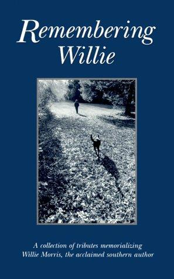

[← Back to the Catalogue](../CATALOGUE.md)

# Remembering Willie 2000 - UPMS

Nonfiction & Essays · item `MAG-011`

### Reference details
| Field | Value |
|---|---|
| Work | Nonfiction & Essays |
| Section | §6.4 |
| Edition | Remembering Willie 2000 - UPMS |
| Country | US |
| Language | EN |
| Publisher | University Press of Mississippi |
| Year | 2000 |
| ISBN-13 | 9781578062676 |
| Status | have |

📖 **Full reference entry:** [§6.4 in the Collector's Reference](../Donna_Tartt_Collectors_Reference.md#64-my-friend-my-mentor-my-inspiration)

🔗 **Read the original:** [languageisavirus.com](https://www.languageisavirus.com/donna-tartt/non-fiction-myfriendmymentor.php)

### Full text

### My friend, my mentor, my inspiration, Remembering Willie
Remembering Willie, University Press of Mississippi, 1st edition (May 2000)

Donna Tartt recalls the 'rich companionship' of the Mississippi writer Willie Morris, who died in 1999

Thinking about Willie, this honorific comes again and again to mind: "the greatest of the Boys". It was said, originally, of Stephen Crane, but it could be as easily said of Willie. Often I had the hilarious, incredulous sense, being with Willie, of being with Huckleberry Finn all grown up - for who knew, really, what happened to Huck after he lighted out for the Indian territories? One can easily imagine Huck grown up (and out) into a big old tender-hearted man much like Willie: a practical jokester, a foe of injustice, a friend to all dogs; a man who loved taverns, and old cemeteries, who poured big old slugs of bourbon into his coffee to warm himself up on chilly autumn nights. Like Huck, too, his happy carelessness for material comforts bordered on the vagabond - his raggedy sweaters, his torn tennis shoes, his modest little bachelor home back in the Oxford, Mississippi, days before he married JoAnne, a house that was (except for an unframed photograph of his terrier Skip, then 30 years dead) wholly unadorned.

When we met, I was 17 and he was in his late 40s, but what I think struck me most about him was this great open-hearted quality of boyishness that he had, for he was far more boyish than most of the actual boys I knew at Ole Miss, the University of Mississippi, passionless frat boys whose hearts had already narrowed and tightened (even at 17, 18, 19) into the hearts of the burghers and businessmen they would someday become.

Willie, on the other hand, was a boy in all the very best ways: quick to make friends, quick to take sides, quick to laughter and outrage and tears and mischief. Because of his unsuspicious good nature, he was not always so quick to defend himself, or to look out for his own best interests, but no one leapt more rapidly to the aid of a friend, and he mourned the disappointments of others as if they were his own. He had the boy's romantic way of thinking always about death, even in the raucous wholehearted tumble of life.

Moreover, he had the boy's heroic refusal to accept some of life's more petty brutalities. The bonds of affection were not lessened for him - as they are for most people - by the fact of physical death. For him, the wounds were always fresh. In the midst of life, he continued to grieve for, and honour, his dead - everyone, all the little ones, down to the very dogs, in a way that calls to mind the Bodhisattva's vow: "However numberless sentient beings are, I vow to save them." If it were up to Willie, he would have saved them all, kept the doors of heaven open until all creation was safe inside: every hobo, every stray, every last June bug. (One of the lines he loved most, from King Lear: "The little dogs and all,/Tray, Blanch, and Sweetheart, see, they bark at me."

To me, he said: "See now, darling, this is what makes Shakespeare a great poet. He remembers the little dogs, he calls them by their names." Then, glancing down at Pete the labrador retriever, his constant companion of those days: "Shakespeare would have loved old Pete here, wouldn't he, though? If old Pete was there, Shakespeare would have called Pete's name too, don't you think?")

Back when I was introduced to Willie, when I was just a kid myself, he was a great, mythical Mr Micawber of a figure, walking the streets of Oxford the late afternoons with his toes pointed out and his Ray-Ban sunglasses on. He grabbed me by the hand and pulled me down the street, so that I had to run to keep up with him, and it was as if we had known each other always. He was like that, I think, with all his friends: he knew them when he saw them, fell in step right alongside them, and loved them forever.

"Would you like a Coca-Cola, young lady?" he asked me on that first night, interrupting himself in the middle of a story, when his old pal Clyde the bartender came around to take our order at the bar of the Holiday Inn. "No, sir, I believe I'll have what you're drinking." Terrific roar of laughter. "Why," he shouted, staggering back as if dazed by my prodigy, rolling his rich old eye round at the assembled company, "this girl is a WRITER!"

When the bourbons arrived, he insisted that we clink glasses: "A toast."

"To what?"

"To you! To us! This is a historic night! Someday you'll be famous, you'll write about this very meeting, you'll remember it forever..."

I was a little overwhelmed, with this big drunk famous person towering over me at the bar, proclaiming blood-brothership, offering eternal friendship, thundering outlandish prophecies. But - God bless you, Willie! - you were right, because here I sit at the typewriter 20 years later, recalling all this.

I lived right down the street from Willie that year, when I was 17 and then 18, and I was lucky to get the chance then to know him so well and spend as much time with him as I did. We loved and hated a lot of the same things. Never will I forget my naive astonishment at discovering that there existed another person who loved words in much the same sputtering and agonised way that I did, who fought them and cursed them and cried over them and stood back, dazzled and agog in admiration of them. After all those years isolated in my hometown, shut up in my bedroom reading books, I had thought I was the only person in the world so afflicted.

"Oh, no, honey. There's a lot of us out there. You'll meet them." And I did. But he was the first, and the one I loved the best, and - when I look back through the years, at all the things I ended up doing that I never dreamed were possible, if I look back far enough I always see Willie, with his shirt untucked, standing at the very back of the room and blowing me a kiss.

Willie had his light moments, no doubt about it; he was a great phone prankster, chatting away straight-faced and unconcerned to one of his unsuspecting colleagues in the character of Mae Helen Biggs or Clinton Roy Peel or some such: "Yas suh!" he would cry.

"I sho did see it! Yo car rolling down the street just now and an ole black dog sitting right up at the wheel..." Afterward, he would hang up quite soberly - as if he'd just phoned to check on his bank balance - and not until some moments later (returning from the kitchen, fresh drink in hand) would he convulse with laughter, stricken all at once by the genius of the joke that he'd so brilliantly pulled off.

Rich companion that he was, Willie also suffered terribly. It was commonplace among those who knew him - those who didn't love him, but also some who did - to attribute Willie's operatic range of emotion to drink. The truth was more complicated, and had to do with that raw, gigantic, intensely tender heart of his which he seldom guarded or protected in any way but left right on the surface for the world to scratch at. What drink could palliate those ancient, chilling sorrows that settled over him?

"How are your spirits, darling?" That is the first question, or among the first, he always asked - for, when he wanted to bend forward and look close, he could see into other people's hearts with a rather terrifying clarity. The word spirit was chosen quite carefully: for when Willie asked this question he was inquiring about your spirit in the sense of your mood, but also the state of your immortal spirit, your soul; about your spirits in the old, high-coloured French sense (wit, sparkle, intelligence), and the spirits in your glass (did you need a refill?), and even your spirits in the sense of your ghosts, as in memories and people of the past (the recent past, 100 or 200 years past) which might be haunting you. All these things he was checking up on when he bent his head low and tried to catch your eye, like a waggish doctor, and asked his perennial question.

Further: he really wanted to know. And he wanted to do something about it.

"Let's go get a steak. Let's drive over to Rowan Oak. Let's call up old George Plimpton in New York and talk to him on the telephone." If Willie thought you were sad, he'd stand on his head if he thought it might cheer you up. (I think of how I once saw him following his housekeeper around his Oxford home, in and out of rooms, ruthless as a bird dog, because he thought something was bothering her and he had, absolutely had, to know what it was.) But in spite of his solicitude for others, Willie's own grief harrowed him continually; in many respects he was simply not at home here - and by here I mean the world, with all its callousness and cruelties and forgetfulness; he was inconsolable, too haunted by the inferno of loss, by time, and change, and mutability.

"Brightness falls from the air/Queens have died, young and fair."

Sometimes he would stop dead - in the middle of a sentence, in the middle of a room - as if sensing subterranean tremors. You could see it in his eyes then, that sickening awareness he had of the lurching, inescapable grind of time: time like sand, time sliding under our feet, time inescapable and relentless, time rolling forward - on all we love, and would like to save - with a sickle and a grin. And this too was a part of his genius. He was exquisitely calibrated to sense these dreadful underground rivers of sorrow, constantly quaking beneath the surface of everyday life; everybody senses them at one time or another, but Willie was so constituted that he was shaken by them constantly, and it is to this vertiginous but quite accurate awareness that he had, of time collapsing about us moment by moment, and shifting beneath us, that I attribute his occasional unsteadiness on his feet - a sort of motion sickness of the soul.

Though it's there all the time, this know- ledge of the hourglass running out, time slipping away, most people don't feel it the way he did (at least not so constantly - else they couldn't get out of bed in the morning). But Willie - like a dog driven crazy by a whistle too high-pitched for the human ear - was constantly stricken by this inexorable motion that others, less sensitive, were unable to detect and because of it he could never quite recover his equilibrium, his balance. No wonder he liked to slosh a little bourbon in his coffee from time to time.

In some sense, Willie's preoccupations were those of the Chinese poets. Fallen blossoms, dewy stairs, and lost youth. The sorrow of leavetakings, farewells to friends, soldiers on the march, and geese flying south. His sense of history pained him, and so did his sense of beauty. I can easily imagine him - like the great Li Po - toppling drunken into the river while trying to embrace the moon.

He was tremendously moved by things such as fallen sports idols, ageing movie stars, dead animals on the road. Forlorn or desecrated monuments in the cemetery. Rain and autumn bonfires. (Some neighbour hammering in a garage, on a foggy gray day in the winter: "Sounds like they're making somebody's coffin over there, darling.") When he was sad, sometimes he would ask me to recite poetry to him - poems I had learned in high school - which I didn't quite see the point of as they only seemed to make him sadder. Of my small repertoire, he especially liked Housman's "To an Athlete Dying Young"; "Annabel Lee"; and Gerard Manley Hopkins: "Margaret, are you grieving/Over Goldengrove unleaving? /... It is the blight man was born for, /It is Margaret you mourn for."

He also liked to read aloud. Thomas Wolfe. The last page of The Great Gatsby . "So we beat on, boats against the current, borne back ceaselessly into the past." And he would lean back in his shabby chair and close his eyes with the relief of hearing someone else describe, so well, the rhythms that beat so ceaselessly against his own poor heart.

After I left Mississippi, at Willie's urging, to go to college in New England ("You've learned what you need to know here," he said to me, and he was right), we didn't see nearly so much of each other, though we certainly had our laughing glorious reunions in the years to come: after he'd married JoAnne and moved to Jackson, after I'd published my first book. (Perhaps my very happiest memory of Willie is of being in a hotel room in New Orleans, on tour for my first book, hearing a knock on the door and thinking it was housekeeping but no, it was Willie, with JoAnne right behind him, Willie who grabbed me up and practically threw me in the air for joy. Still up to his old tricks: he'd deceived me with that timid little casual rap at the door, and neither of us could stop laughing about it. So many people were happy for me when I published my first novel, but apart from my mother, I don't think that anybody in the world was happier or more proud than he was.)

But it is much farther back, to that distant time when he and I were neighbours, and saw each other almost daily - to which my thoughts return again and again now that he is dead. I've been thinking about his frequent visits to Faulkner's grave, and his scratchy old record of the song "Moon River"; he played it over and over when he was sad, and upon at least one occasion he played it so incessantly that I - and several other guests - were driven from his home. I think, too, how the movie Casablanca always made him cry - especially the scene where everyone stands up in Rick's Café and sings the Marseillaise in defiance of the Nazis.

This episode was so important for Willie that it became a sort of shorthand, a code, a way for him to explain why he loved the people he did.

"They'd sing the Marseillaise," he'd say, nodding across the room at someone he loved. Ron Shapiro, say, or Deanie Faulkner (how he loved Deanie!) or Masaru or David Sansing. "And Pete. Pete'd be right up there in the front, leading the band, wouldn' t you, boy?"

Something else that comes to mind - I don't know why, but it does - is an evening I walked from my dormitory over to his chilly little bare house.

His house, with its lawn never raked, deep in dead leaves, was sunk all the year round in a perpetual autumn. There's a word, in French, for that particular still, sad, sentimental quality that Willie's house had, in the early 80s, with the forlorn little picture of Skip the dead terrier propped up on the bare mantel piece: fadeur. When I first came upon it, in a description of the poet Verlaine, I told Willie about it and he got all excited, too. "Oh, that's a marvellous word. Nothing like it in English at all, is there? Pete, can you think of anything? Pete?" I found Willie there, in the twilight, in his little fadeur house, sitting with his face in his hands without the lamp on, crying in the most desolate and brokenhearted way, so that I could not immediately understand what he was saying: "That girl," he cried, "that poor girl," and it was a while before I realised that he was crying for the movie star Natalie Wood, who (it was in all the papers that day) had fallen off a yacht, and drowned.

I was stricken, sympathetic. Had she been a great friend of his? "No," he cried, rolling his head back, "no, of course not, she was just so beautiful..."

This recollection surfaced, from an apparent void, two or three days after Willie's death, and it was so sharp and sudden that I flinched from it a little bit without quite knowing why: why had this odd fragment bobbed up so perfect and whole (I can still see the smoke spiralling from his cigarette) from the past? Why this memory? Why then? Because, of course, it was Willie, not Natalie Wood, whom they were reading about in the papers three years ago, Willie himself whom the strangers were crying for this time. How his great lying-in-state would have pleased him! [The state of Mississippi gave Willie Morris the rare honour of a state funeral; before it, the public came to pay their respects at the State Capitol Building, where his body lay in state.]

If the dead are in any way allowed to return and witness such things, Willie was there and eavesdropping on his mourners, revelling in the event, like Huckleberry Finn at his own funeral. I am so confident of the ability of that dear great soul of his to continue after death (for if Willie doesn't rise again, no one will) that - now that the flowers have browned on his grave - what I strangely find myself worrying about most are the whereabouts of Skip and Pete. (This, too, was a concern of Willie's; his friends will remember his insistence upon giving Pete a proper burial in the Oxford cemetery.) Buddhist theology gives hope upon this question, as does the theology of my own Roman Catholic faith, but still I return night after night to my heaviest books in an attempt to reassure myself on this point. I don't care how nice Heaven is, really I don't: he's not going to be happy if those dogs aren't there.

And as I read over these words, I wonder if I ought to tone down the emotion of these recollections, but no: I absolutely refuse. Willie flung around words such as great and noble and brave and genius wherever he went - great profligate showers of outdated coin, moidores, guineas, pieces of eight, stamped with all the crowns and statesmen of history. And this is the very coin that I wish to heap up in heavy glittering masses on his grave: "Now cracks a noble heart." He deserves all the glory we are able to give him - the flights of angels singing him to his rest, all of it - for he felt this way about the people and the things that he loved, and it is only natural that we who loved him should wish to bring him the same tribute now that he is gone.

Remembering Willie [Paperback]
University Press of Mississippi (Author), Kay Holloway (Photographer)
Paperback: 120 pages
Publisher: University Press of Mississippi; 1st edition (May 2000)
Language: English
ISBN-10: 1578062675
ISBN-13: 978-1578062676
Product Dimensions: 8.4 x 5.5 x 0.4 inches
Order Remembering Willie

Full text reproduced for non-commercial research; original source linked above. Hosted at <code>assets/sources/fulltext/MAG-011.md</code>.

### Sources & documents held

_No primary-source scan is held for this item yet — see the reference entry and the cited source above._

---
[← Back to the Catalogue](../CATALOGUE.md)
