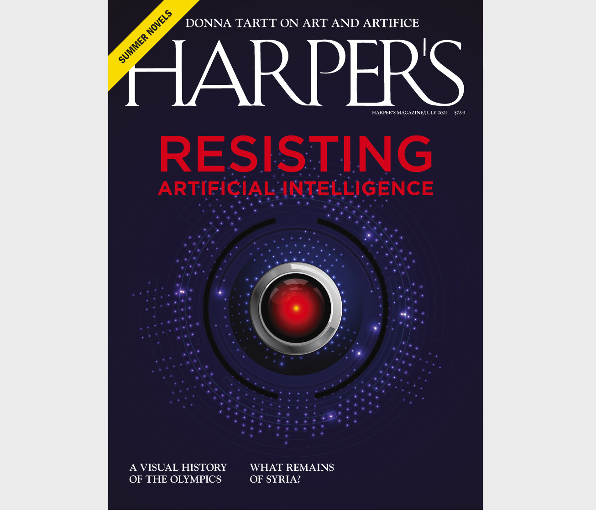

[← Back to the Catalogue](../CATALOGUE.md)

# Harper's July 2024 - Art and Artifice

Nonfiction & Essays · item `MAG-012`

### Reference details
| Field | Value |
|---|---|
| Work | Nonfiction & Essays |
| Section | §6.5 |
| Edition | Harper's July 2024 - Art and Artifice |
| Country | US |
| Language | EN |
| Publisher | Harper's Magazine |
| Year | 2024-07 |
| Status | have |

📖 **Full reference entry:** [§6.5 in the Collector's Reference](../Donna_Tartt_Collectors_Reference.md#65-art-and-artifice)

🔗 **Read the original:** [harpers.org](https://harpers.org/archive/2024/07/art-and-artifice-donna-tartt/) · [counterpointpress.com](https://www.counterpointpress.com/dd-product/reclaiming-art-in-the-age-of-artifice/)

### Full text

From an introduction to the audiobook edition of J. F. Martel’s Reclaiming Art in the Age of Artifice, which was released in May by Hachette Audio.

Toward the end of the nineteenth century, the painter James McNeill Whistler shouted out fiercely into posterity, over the heads of the art-world philistines of his day, and our own:

Listen! There never was an artistic period. There never was an Art-loving nation.

This hoarse cry from the Belle Époque is as bracing as it ever was, especially here in our own burned-out landscape where Art as Whistler defined it—Art with a capital A—is all too often viewed as an antiquated construction ensconced behind velvet ropes, not very relevant except as a standing resource to be boiled down to blunt cultural agendas, picked apart by theory, aped by predictive formulas, pillaged and parodied for commercials and computer software, if not ignored altogether in the glitz of technological stimulus.

Even in 1794, Schiller was asking: How is the artist to protect himself against the corruption of the age that besets him on all sides? Too much chasing after money and success, too much pandering to the popular taste, too much weight on ideology or politics or dogma of any stripe, and God, in the cogent phrase of Quincy Jones, walks out of the room. But in our own sped-up nightmare of screens and algorithms, accelerating more wildly every day, art—and artists—are battered with all the same old discouraging assaults along with new ones that Whistler never dreamed of.

In J.F. Martel’s graceful and incisive work of philosophy, Reclaiming Art in the Age of Artifice, he reminds us of what most artists, if they are honest with themselves, already know: that art is not decodable, not exhaustible, not neatly pressed into the service of morals or ideology of any kind. It cannot be pigeonholed in terms of utility or confined to any historically determined category. Instead, Martel echoes the great aesthete himself, Oscar Wilde, in his serene dictum that all art is perfectly useless. And yet, as Martel writes, “It is precisely the absence of political and moral interest that makes art an agent of liberation wherever it appears.”

But Martel’s definition of Art with a capital A extends beyond the gilded category of fine arts. He casts it as an uncanny force bursting into the world in earliest prehistory, less a theoretical construct or byproduct of culture than a slant of light streaming into our world from elsewhere. Like dream, it gives us access to parts of the psyche and even of society that we might not otherwise be able to see; like prophecy, it has potential to burn through all the managed and multilayered cultural fictions that surround us and to awaken us from our pervasive sense of unreality. And as our world degenerates around us into pixels, Martel maintains that one of our oldest and most human ways of knowing might also be our best hope of negotiating the present moment without being destroyed by it.

The thirty-thousand-year-old cave paintings at Chauvet–Pont d’Arc are ghostly images from the abyss of deep time whose purpose is illegible to us. Yet they shock us with a thrill of kinship and tell us something otherwise incommunicable not only about our ancestors, but about ourselves. We don’t know why humans make art, and yet starting with the earliest examples, it’s possible to make a strong case that art is an inborn human capacity, preceding culture and society, and that to lose our connection with art is to lose our connection with what is best and most mysterious about us as a species.

Art is a vehicle for putting us in touch with the Real—Real with a capital R—a concept that for Martel has nothing to do with realism as a critical stance or literary device, with scientific or materialistic understandings of realism, or even with that commonly understood consensus reality that Groucho Marx was talking about when he said, “I’m not crazy about reality, but it’s still the only place to get a decent meal.” Instead, the Real that art helps us come into contact with is something far more slippery, and far closer to what Walter Benjamin called the “true surrealist face of existence.” This is not the surrealism of predictive AI—endlessly recircling within its own sidewindings and elisions—but the bizarre wide-open Real out on the edges of experience, which has a good deal less to do with the measurable, quantifiable, empirical world than with the unseen possible: whether hidden aspects of the future simmering invisibly in the present, or mysteries so giant and unpredictable that science can’t begin to approach them. These are the outlying lands beyond opinion and ideology and even beyond fixed categories like past and future, life and death: the lands of white crows, black swans, poltergeists. When we dive into the depths of an artwork that has stood the test of time—even an artwork many thousands of years old—we will always find unexplored corners and new wonders. Whenever we make, or experience, art, we escape the chronic fatigue of screens. And in restoring us to unknowing and to radical mystery, even the most ancient artworks can give us some immunity and protection from the forces scraping away at our humanity, and help us in dreaming our way to the Real.

But if true art is an instrument for transcendence and cognitive freedom, then artifice—art’s look-alike—is a homogenizing force that blocks off possibilities and alternate modes of being. Following Stephen Dedalus’s theory of art in A Portrait of the Artist as a Young Man, Martel draws a sharp distinction between art and artifice, and breaks down artifice into two categories. At one end of the continuum are advertising and pornography—works engineered to create desire for the thing one sees—and at the other end are propaganda and rhetoric—works engineered to inflame people’s emotions and to steer them toward acting or thinking or voting a certain way.

Martel tells us that, according to Joyce, true art is static—both demanding calm and creating a calm microclimate of its own, a still space where, as Joyce says, “the mind is arrested and raised above desiring and loathing.” But artifice—or false art—orients us toward what is flashy and shallow—toward movement and, more specifically, in the predetermined path where it wants us to move. Like a brightly baited fishing hook, the shiny surface of artifice is designed to tempt us to bite down hard on it, in order that it might reel us in for its own purposes: love me, buy me, hate me, vote for me.

Throughout human history, art has been the primary force that blows out old paradigms and brings the possible into being. Any casual reader can point to many examples of science fiction becoming science fact, from cyberspace to smartwatches to reality television, from credit cards to submarines. But a key factor distinguishing a work of art from artifice is that a work of art has an unconscious. It thinks; it dreams. A painting or an opera or a film that has stood the test of time is a capacious public dream that’s big enough to let a lot of people in, and walk around in it, and bring different things in and out of it, and participate across language and time in the continual dreaming and redreaming of it. As Martel writes: “Art is the only truly effective means we have of engaging, in a communal context, the psyche on its own terms.”

Unlike artifice, art cannot be boiled down or reduced to its influences and component parts without falsifying it; its depths, which are nonlinear like dreams and unbound by time, are eerily self-renewing and inexhaustible, and they always have something new to say to us—quite often, things the artist could never have consciously intended.

Regarding, for instance, our strange immobility in the onrush of man-made climate change: the alarm is being sounded right and left. Economists and statisticians have one view of our failure to act, historians another, political scientists a third. The internet is bristling with opinions, informed and otherwise. But does anything come closer to helping us feel our way into the granular, organic complexity of the trap we’re really caught in than the sleepwalking heroes of Shakespeare? Consider these dynamics. A good man, curiously enthralled by a conniving inferior, is hijacked by illusion and destroys what he loves most in the world ( Othello ). A young man of uncommonly lucid mind, who sees quite plainly the crime that must be righted, is somehow unable to pull himself together and do what must be done to halt the slow-motion disaster unspooling around him ( Hamlet ). A solipsistic striver, overcome with a self-loathing horror of his own ruthlessness, babbles to reassure himself of “a prophecy” that will save him even as he walks to his doom ( Macbeth ). A fourth, wailing eloquently of treachery and wrongdoing, is too entranced by his own elegiac grief to avail himself of more earthbound or statesmanly measures to save his kingdom ( Richard II ). A fifth, finding the mute dignity of the truth less gratifying than the shameless and flowery lie, banishes the truth-teller and, in doing so, brings down almost unimaginable ruin ( King Lear ). All five of these situations give fresh angles on the players and dynamics and moving parts of our own slow-moving planetary tragedy, as no statistics or policy analysis ever could—the ghastly awareness, in real time, of a demon-haunted present, the conflicting information, the false sources, the foolhardy hope and the lie not spotted in time, the hidden motives of power and the passages where self-importance and self-interest and fixation on trivia shade into inertia or ignorance or tragic self-deception. A work of artifice, intent on pushing the audience into a predetermined direction or point of view however well-intended, is incapable of suggesting a way forward through a dilemma of any complexity without being preachy and simplistic. But in helping us think with the world, instead of about it, art—which has no agenda other than being itself—always reminds us that all human-created systems are contingent, for if we wade around inside a great work of art, all sorts of rifts appear, ambiguous open spaces free of opinion and preconceptions, where light breaks through unpredictably, revealing trapdoors and hidden connections—and even possible escapes. Is it too much to say, in our worn-out and trampled landscape, that one of our most neglected paths might now be the only way out? Or that art may be the last untrodden and inviolable way of the psyche remaining to us?

To return to Whistler:

Art happens—no hovel is safe from it, no prince may depend upon it, the vastest intelligence cannot bring it about, and puny efforts to make it universal end in quaint comedy and coarse farce.

Much of art happens, and has always happened, in the useless spaces between things, in the eerie psychic junkyard that Yeats called “the rag and bone shop of the heart.” These neglected spaces—cracks in the pavement where the grass sprouts up, Auden’s crack in the teacup that opens the lane to the dead—are where past and future stand still, where rift and prophecy and sometimes even flat-out miracles emerge. In these enigmatic interludes—our dreamings, as a species—rests the power to break us out of consensus trance and lead us to the Real. Joyce’s non serviam is also appropriate here; somehow, perversely, in valuing what is useless, and refusing to let ourselves be used (or used up) by the forces of artifice, we turn like sunflowers to the transcendent, and dream our way into the new.

Full text reproduced for non-commercial research; original source linked above. Hosted at <code>assets/sources/fulltext/MAG-012.md</code>.

### Sources & documents held

- [Harpers 2024 07 Tartt ArtAndArtifice](../assets/sources/archive/Harpers-2024-07-Tartt-ArtAndArtifice.html) (saved web page)

Primary-source captures cited for this section of the reference. PDFs and images open in GitHub's viewer; `.webarchive` files download.

---
[← Back to the Catalogue](../CATALOGUE.md)
