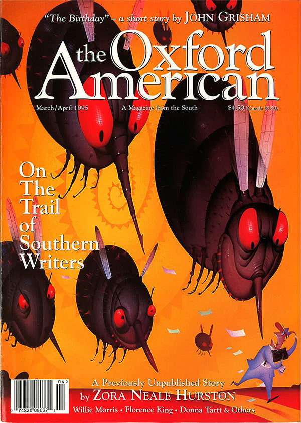

[← Back to the Catalogue](../CATALOGUE.md)

# Oxford American #6 Mar/Apr 1995 - In Melbourne

Nonfiction & Essays · item `MAG-016`

### Reference details
| Field | Value |
|---|---|
| Work | Nonfiction & Essays |
| Section | §6.9 |
| Edition | Oxford American #6 Mar/Apr 1995 - In Melbourne |
| Country | US |
| Language | EN |
| Publisher | Oxford American |
| Year | 1995-03 |
| Status | have |

📖 **Full reference entry:** [§6.9 in the Collector's Reference](../Donna_Tartt_Collectors_Reference.md#69-in-melbourne)

🔗 **Read the original:** [oxfordamerican.org](https://oxfordamerican.org/magazine/issue-6-march-april-1995)

### Full text

_No full text is held for this item. See the reference entry above and the cited source._

### Sources & documents held

_No primary-source scan is held for this item yet — see the reference entry and the cited source above._

---
[← Back to the Catalogue](../CATALOGUE.md)
