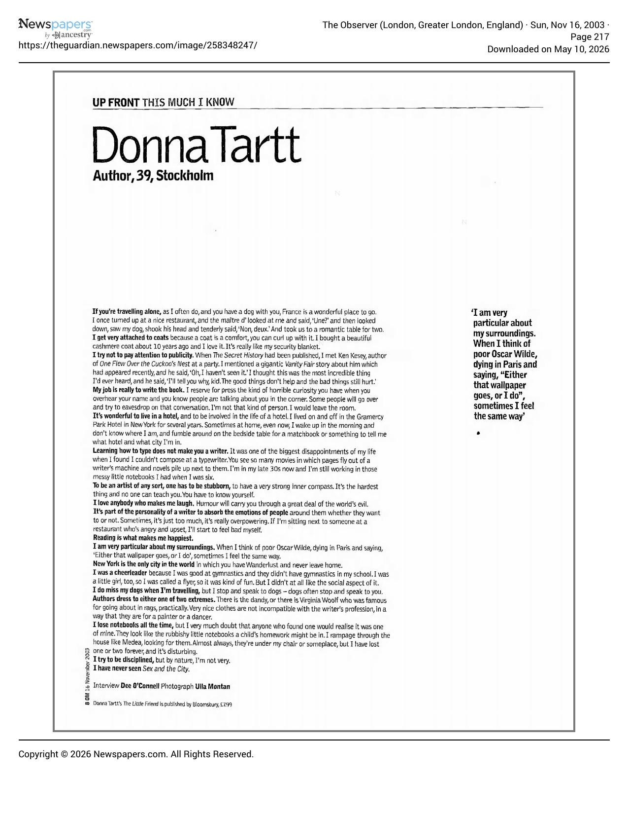
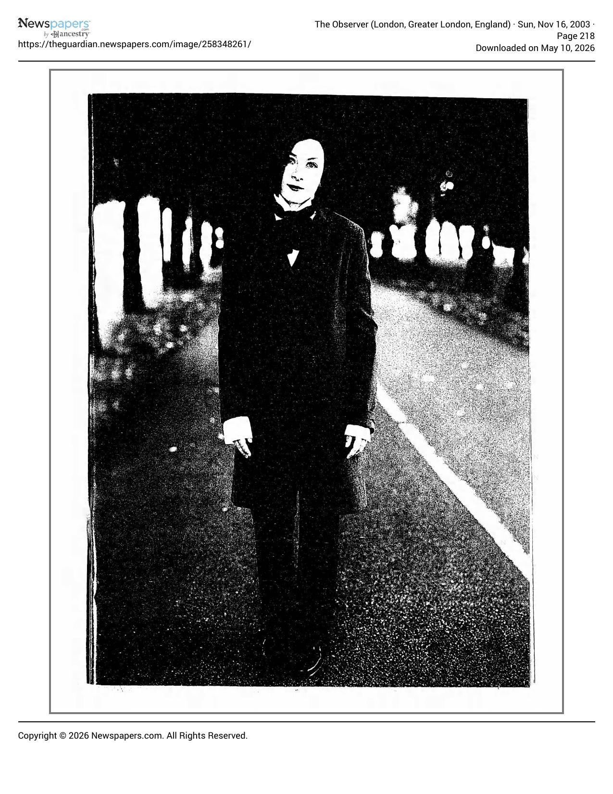

[← Back to the Catalogue](../CATALOGUE.md)

# The Observer Nov 16 2003 - This much I know

Nonfiction & Essays · item `MAG-018`

### Reference details
| Field | Value |
|---|---|
| Work | Nonfiction & Essays |
| Section | §6.11 |
| Edition | The Observer Nov 16 2003 - This much I know |
| Country | UK |
| Language | EN |
| Publisher | The Observer |
| Year | 2003-11-16 |
| Status | have |

📖 **Full reference entry:** [§6.11 in the Collector's Reference](../Donna_Tartt_Collectors_Reference.md#611-this-much-i-know)

### Full text

_No machine-readable text available — the original is reproduced here as page scans:_

### Sources & documents held

_No primary-source scan is held for this item yet — see the reference entry and the cited source above._

---
[← Back to the Catalogue](../CATALOGUE.md)
