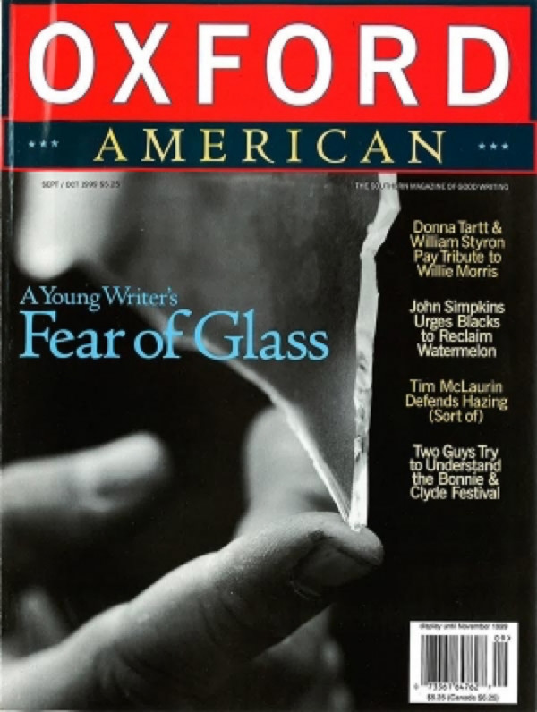

[← Back to the Catalogue](../CATALOGUE.md)

# Oxford American #29 Sep/Oct 1999 - Willie Morris Tribute

Nonfiction & Essays · item `MAG-019`

### Reference details
| Field | Value |
|---|---|
| Work | Nonfiction & Essays |
| Section | §6.12 |
| Edition | Oxford American #29 Sep/Oct 1999 - Willie Morris Tribute |
| Country | US |
| Language | EN |
| Publisher | Oxford American |
| Year | 1999-09 |
| Status | have |

📖 **Full reference entry:** [§6.12 in the Collector's Reference](../Donna_Tartt_Collectors_Reference.md#612-willie-morris-19341999-tribute)

🔗 **Read the original:** [oxfordamerican.org](https://oxfordamerican.org/magazine/issue-29-september-october-1999)

### Full text

_No full text is held for this item. See the reference entry above and the cited source._

### Sources & documents held

- [OA Issue29 1999 TOC CDX WB20210419231006](../assets/sources/archive/wayback/OA-Issue29-1999-TOC-CDX-WB20210419231006.html) (saved web page)

Primary-source captures cited for this section of the reference. PDFs and images open in GitHub's viewer; `.webarchive` files download.

---
[← Back to the Catalogue](../CATALOGUE.md)
